<a href="#v010" title="GClh II version 0.10 (??.??.2019)">v0.10</a> &nbsp;
<a href="#v0918" title="GClh II version 0.9.18 (23.05.2019)">v0.9.18</a> &nbsp;
<a href="#v0917" title="GClh II version 0.9.17 (10.04.2019)">v0.9.17</a> &nbsp;
<a href="#v0916" title="GClh II version 0.9.16 (13.02.2019)">v0.9.16</a> &nbsp;
<a href="#v0915" title="GClh II version 0.9.15 (18.01.2019)">v0.9.15</a> &nbsp;
<a href="#v0914" title="GClh II version 0.9.14 (21.12.2018)">v0.9.14</a> &nbsp;
<a href="#v0913" title="GClh II version 0.9.13 (09.10.2018)">v0.9.13</a> &nbsp;
<a href="#v0912" title="GClh II version 0.9.12 (04.09.2018)">v0.9.12</a> &nbsp;
<a href="#v0911" title="GClh II version 0.9.11 (25.08.2018)">v0.9.11</a> &nbsp;
<a href="#v0910" title="GClh II version 0.9.10 (11.08.2018)">v0.9.10</a> &nbsp;
<a href="#v099" title="GClh II version 0.9.9 (30.06.2018)">v0.9.9</a> &nbsp;
<a href="#v098" title="GClh II version 0.9.8 (25.06.2018)">v0.9.8</a> &nbsp;
<a href="#v097" title="GClh II version 0.9.7 (28.05.2018)">v0.9.7</a> &nbsp;
<a href="#v096" title="GClh II version 0.9.6 (14.05.2018)">v0.9.6</a> &nbsp;
<a href="#v095" title="GClh II version 0.9.5 (03.05.2018)">v0.9.5</a> &nbsp;
<a href="#v094" title="GClh II version 0.9.4 (02.05.2018)">v0.9.4</a> &nbsp;
<a href="#v093" title="GClh II version 0.9.3 (28.02.2018)">v0.9.3</a> &nbsp;
<a href="#v092" title="GClh II version 0.9.2 (08.02.2018)">v0.9.2</a> &nbsp;
<a href="#v091" title="GClh II version 0.9.1 (16.01.2018)">v0.9.1</a> &nbsp;
<a href="#v09" title="GClh II version 0.9 (19.12.2017)">v0.9</a> &nbsp;
<a href="changelog_before.md" title="Go to earlier changelog">Earlier changelog</a> &nbsp;

---
## v0.10:
 
<strong>Listing:</strong>  
<ul>
	<li>
		<strong>New:</strong> Added Openrouteservice as an additional map service. [<a href="https://github.com/2Abendsegler/GClh/issues/897" title="Issue 897">897</a> / <a href="https://www.geocaching.com/profile/?u=2Abendsegler" title="Thanks to 2Abendsegler">2Abendsegler</a>] 
		Openrouteservice also offers in addition to usual mediums for locomotion "wheelchair" as medium for locomotion in europe. 
                </a> 
		You can pick Openrouteservice in cache listing in the right navigation bar, or behind the "Additional Waypoints", if there are additional waypoints. 
                </a> 
                </a> 
		<a href="https://www.geocaching.com/my/#GClhShowConfig#a#settings_show_openrouteservice_link" title="Link to your GClh Config">Settings -> Listing: 
		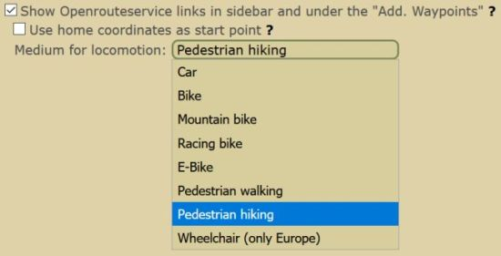</a> 
		If you want to use your home coordinates as start point for the route, you have to activate the parameter.  
	</li>
	<li>
		<strong>New:</strong> Copy various cache informations to clipboard. [<a href="https://github.com/2Abendsegler/GClh/issues/1096" title="Issue 1096">1096</a> / <a href="https://www.geocaching.com/profile/?u=Herr Ma" title="Thanks to Herr Ma">Herr Ma</a>] 
		If there are changed coordinates, not only the original coordinates but also the changed coordinates can be copied to the clipboard. 
		 
		<a href="https://www.geocaching.com/my/#GClhShowConfig#a#settings_show_copydata_menu" title="Link to your GClh Config">Settings -> Listing:  
		</a>  
	</li>
	<li>
		<strong>New:</strong> Button to copy coordinates to the clipboard. [<a href="https://github.com/2Abendsegler/GClh/issues/1095" title="Issue 1095">1095</a> / <a href="https://www.geocaching.com/profile/?u=Herr Ma" title="Thanks to Herr Ma">Herr Ma</a>] 
		If there are changed coordinates, the changed coordinates are copied into the clipboard, otherwise the original coordinates. 
		  
	</li>
	<li>
		<strong>New:</strong> One click ignoring/restoring. [<a href="https://github.com/2Abendsegler/GClh/issues/1053" title="Issue 1053">1053</a> / <a href="https://www.geocaching.com/profile/?u=2Abendsegler" title="Thanks to 2Abendsegler">2Abendsegler</a>] 
		With this feature you will be able to ignore respectively restore a cache in cache listing with only one click. 
		</a> 
		<a href="https://www.geocaching.com/my/#GClhShowConfig#a#settings_use_one_click_ignoring" title="Link to your GClh Config">Settings -> Listing: 
		</a> 
	        The "One click" feature runs only together with the "Show Stop Ignoring" feature. Please note that the "Show Stop Ignoring" feature is not new and you may need to activate the parameter, if you want to use the "One click" feature.  
	</li>
	<li>
		<strong>New:</strong> One click watching. [<a href="https://github.com/2Abendsegler/GClh/issues/1072" title="Issue 1072">1072</a> / <a href="https://www.geocaching.com/profile/?u=2Abendsegler" title="Thanks to 2Abendsegler">2Abendsegler</a>] 
		With this feature you can add a cache in cache listing to your watchlist with just one click. 
		</a> 
		<a href="https://www.geocaching.com/my/#GClhShowConfig#a#settings_use_one_click_watching" title="Link to your GClh Config">Settings -> Listing: 
		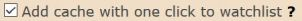</a>  
	</li>
        <li>
		<strong>New:</strong> Button for hiding lot of stuff in cache listing logs. [<a href="https://github.com/2Abendsegler/GClh/issues/1045" title="Issue 1045">1045</a> / <a href="https://www.geocaching.com/profile/?u=Ruko2010" title="Thanks to Ruko2010">Ruko2010</a>] 
		The functionality can be used, for example, to compare an external logbook with an online logbook. 
		 
		<a href="https://www.geocaching.com/my/#GClhShowConfig#a#settings_show_compact_logbook_but" title="Link to your GClh Config">Settings -> Listing: 
		</a>  
	</li>
	<li>
		<strong>New:</strong> Hide found counter in cache listing. [<a href="https://github.com/2Abendsegler/GClh/issues/1044" title="Issue 1044">1044</a> / <a href="https://www.geocaching.com/profile/?u=Ruko2010" title="Thanks to Ruko2010">Ruko2010</a>] 
		 
		<a href="https://www.geocaching.com/my/#GClhShowConfig#a#settings_hide_found_count" title="Link to your GClh Config">Settings -> Listing: 
		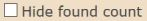</a> 
		If you want to use it, you have to activate the parameter.  
	</li>
	<li>
		<strong>Fix:</strong> Thunderforest is no longer supported on BRouter and Flopps. [<a href="https://github.com/2Abendsegler/GClh/issues/1041" title="Issue 1041">1041</a> / <a href="https://www.geocaching.com/profile/?u=radlerandi" title="Thanks to radlerandi">radlerandi</a>] 
	</li>
	<li>
		<strong>Fix:</strong> BRouter with empty waypoint in URL. [<a href="https://github.com/2Abendsegler/GClh/issues/1042" title="Issue 1042">1042</a> / <a href="https://www.geocaching.com/profile/?u=2Abendsegler" title="Thanks to 2Abendsegler">2Abendsegler</a>] 
	</li>
	<li>
		<strong>Fix:</strong> The weekday of an event is not shown in disabled events. [<a href="https://github.com/2Abendsegler/GClh/issues/1086" title="Issue 1086">1086</a> / <a href="https://www.geocaching.com/profile/?u=2Abendsegler" title="Thanks to 2Abendsegler">2Abendsegler</a>] 
	</li>
	<li>
		<strong>Fix:</strong> The long VIP list doesn't consider the parameter "Show owner in VIP list". [<a href="https://github.com/2Abendsegler/GClh/issues/1088" title="Issue 1088">1088</a> / <a href="https://www.geocaching.com/profile/?u=2Abendsegler" title="Thanks to 2Abendsegler">2Abendsegler</a>] 
	</li>
</ul>
  
<strong>Lists, Bookmark list, Favorites, Ignore list:</strong>  
<ul>	
	<li>
		<strong>New:</strong> Integrate GClh header with Linklist in new designed lists page. [<a href="https://github.com/2Abendsegler/GClh/issues/1052" title="Issue 1052">1052</a> / <a href="https://www.geocaching.com/profile/?u=2Abendsegler" title="Thanks to 2Abendsegler">2Abendsegler</a>] 
		</a>  
	</li>
	<li>
		<strong>New:</strong> New designed list of bookmark lists and bookmark lists: Show 1000 caches in bookmark lists. [<a href="https://github.com/2Abendsegler/GClh/issues/1059" title="Issue 1059">1059</a> / <a href="https://www.geocaching.com/profile/?u=2Abendsegler" title="Thanks to 2Abendsegler">2Abendsegler</a>] 
		<a href="https://www.geocaching.com/my/#GClhShowConfig#a#settings_show_1000_bm_lists" title="Link to your GClh Config">Settings -> Bookmark list:  
		</a> 
		If you want to use it, you have to activate the parameter.  
	</li>
</ul>
 
<strong>Pocket query:</strong>  
<ul>	
	<li>
		<strong>New:</strong> Rewrite fixed PQ header/footer by pure CSS. Compatible with compact view. [<a href="https://github.com/2Abendsegler/GClh/issues/1034" title="Issue 1034">1034</a> / <a href="https://www.geocaching.com/profile/?u=Dratenik" title="Thanks to Dratenik">Dratenik</a>] 
		The functionality is not new. New is only the great functionality. Especially for small screens very well, because the line stays at the bottom of the screen when you scroll through the pocket queries. 
		 
		<a href="https://www.geocaching.com/my/#GClhShowConfig#a#settings_fixed_pq_header" title="Link to your GClh Config">Settings -> Pocket query: 
		</a> 
	        Please note that the feature is not new and you may need to activate the parameter.  
	</li>
</ul>
 
<strong>Map (search map):</strong>  
<ul>	
	<li>
		<strong>New:</strong> Integrate GClh header with Linklist in new designed map page (search map). [<a href="https://github.com/2Abendsegler/GClh/issues/987" title="Issue 987">987</a> / <a href="https://www.geocaching.com/profile/?u=2Abendsegler" title="Thanks to 2Abendsegler">2Abendsegler</a>] 
		</a>  
	</li>
</ul>
 
<strong>Others:</strong>  
<ul>	
	<li>
		<strong>Fix:</strong> Show listing of (own) unpublished cache throws error. [<a href="https://github.com/2Abendsegler/GClh/issues/1039" title="Issue 1039">1039</a> / <a href="https://www.geocaching.com/profile/?u=Ruko2010" title="Thanks to Ruko2010">Ruko2010</a>] 
	</li>
	<li>
		<strong>Fix:</strong> Improve new and old log form. Show log preview on log page direct after automatic adding log signature, using log templates and using smilies. Make sure that signature is not generated multiple times. [<a href="https://github.com/2Abendsegler/GClh/issues/1047" title="Issue 1047">1047</a> / <a href="https://www.geocaching.com/profile/?u=2Abendsegler" title="Thanks to 2Abendsegler">2Abendsegler</a>] 
	</li>
	<li>
		<strong>Fix:</strong> Hide Facebook login doesn't run. [<a href="https://github.com/2Abendsegler/GClh/issues/1073" title="Issue 1073">1073</a> / <a href="https://www.geocaching.com/profile/?u=2Abendsegler" title="Thanks to 2Abendsegler">2Abendsegler</a>] 
	</li>
	<li>
		<strong>Fix:</strong> No coloring of TB listing. [<a href="https://github.com/2Abendsegler/GClh/issues/1074" title="Issue 1074">1074</a> / <a href="https://www.geocaching.com/profile/?u=2Abendsegler" title="Thanks to 2Abendsegler">2Abendsegler</a>] 
	</li>
	<li>
		<strong>Fix:</strong> Show bigger images in gallery doesn't run correct. [<a href="https://github.com/2Abendsegler/GClh/issues/1078" title="Issue 1078">1078</a> / <a href="https://www.geocaching.com/profile/?u=2Abendsegler" title="Thanks to 2Abendsegler">2Abendsegler</a>] 
	</li>
	<li>
		<strong>Fix:</strong> Link to Ignore List in dashboard doesn't run. [<a href="https://github.com/2Abendsegler/GClh/issues/1079" title="Issue 1079">1079</a> / <a href="https://www.geocaching.com/profile/?u=2Abendsegler" title="Thanks to 2Abendsegler">2Abendsegler</a>] 
	</li>
	<li>
		<strong>Fix:</strong> The changes of the links "Lists" and "Your lists" in dashboard to old-fashioned lists page are not longer possible. [<a href="https://github.com/2Abendsegler/GClh/issues/1080" title="Issue 1080">1080</a> / <a href="https://www.geocaching.com/profile/?u=2Abendsegler" title="Thanks to 2Abendsegler">2Abendsegler</a>] 
	</li>
	<li>
		<strong>Fix:</strong> Arrangement the Linklist and the other menus at the right side does not run. Alignment of vertical and horizontal menus. [<a href="https://github.com/2Abendsegler/GClh/issues/1091" title="Issue 1091">1091</a> / <a href="https://www.geocaching.com/profile/?u=2Abendsegler" title="Thanks to 2Abendsegler">2Abendsegler</a>] 
	</li>
</ul>
(??.??.2019) 
released by <a href="https://www.geocaching.com/profile/?u=Ruko2010">Ruko2010</a> 
 

---
## v0.9.18:
<ul>
	<li>
		<strong>New:</strong> Integrate reviewer/publisher in VIP lists. [<a href="https://github.com/2Abendsegler/GClh/issues/1011" title="Issue 1011">1011</a> / <a href="https://www.geocaching.com/profile/?u=Ruko2010" title="Thanks to Ruko2010">Ruko2010</a>] 
		You can now show the reviewer/publisher of the cache in your VIP list:  
		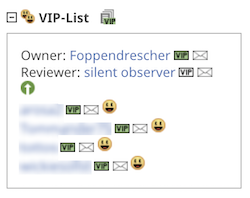 
		<a href="https://www.geocaching.com/my/#GClhShowConfig#a#settings_show_reviewer_as_vip" title="Link to your GClh Config">Settings -> Listing: 
		</a> 
	</li>
	<li>
		<strong>New:</strong> "Great story" and "Helpful" are not longer deleted by GClh. [<a href="https://github.com/2Abendsegler/GClh/issues/663" title="Issue 663">663</a> / <a href="https://www.geocaching.com/profile/?u=Ruko2010" title="Thanks to Ruko2010">Ruko2010</a>] 
		If you haven't noticed yet, since about 1 year, Groundspeak is testing a new feature where you can tag a log as "Great Story" or "Helpful" and you can sort the logs by the rating of the users. 
		This feature is only available in Canada and Norway at this time. Since today, GClh is deleting these so called "Upvote"-Buttons, because we replace the log template. But from now on, GClh no longer deletes those buttons and you can use them to rate the logs and sort them by a certain rating. 
		If you want to know more about this topic, here is a blogpost from Groundspeak: <a href="https://www.geocaching.com/blog/2018/05/faq-log-upvotes/" title="Log Upvotes">here</a> 
		And this is how it looks like: 
		 
	</li>
	<li>
		<strong>Fix:</strong> Show Google-Maps Link on Cache Listing Page does not work. [<a href="https://github.com/2Abendsegler/GClh/issues/1025" title="Issue 1025">1025</a> / <a href="https://www.geocaching.com/profile/?u=Ruko2010" title="Thanks to Ruko2010">Ruko2010</a>] 
	</li>
	<li>
		<strong>Fix:</strong> "Open Trackables" in Draft Mode not working consistently. [<a href="https://github.com/2Abendsegler/GClh/issues/1024" title="Issue 1024">1024</a> / <a href="https://www.geocaching.com/profile/?u=Ruko2010" title="Thanks to Ruko2010">Ruko2010</a>] 
	</li>
	<li>
		<strong>Fix:</strong> The "edit log" - functionality integrates the signature once again (Old log page). [<a href="https://github.com/2Abendsegler/GClh/issues/1023" title="Issue 1023">1023</a> / <a href="https://www.geocaching.com/profile/?u=Ruko2010" title="Thanks to Ruko2010">Ruko2010</a>] 
	</li>
	<li>
		<strong>Fix:</strong> Geonames in standard configuration as first service. [<a href="https://github.com/2Abendsegler/GClh/issues/1030" title="Issue 1030">1030</a> / <a href="https://www.geocaching.com/profile/?u=2Abendsegler" title="Thanks to 2Abendsegler">2Abendsegler</a>] 
	</li>
</ul>
(23.05.2019) 
released by <a href="https://www.geocaching.com/profile/?u=Ruko2010">Ruko2010</a> 
 

---
## v0.9.17:
<ul>
	<li>
		<strong>New:</strong> We added a Note of Thanks to honor all the contributors to this project. [<a href="https://github.com/2Abendsegler/GClh/issues/1004" title="Issue 1004">1004</a> / <a href="https://www.geocaching.com/profile/?u=2Abendsegler" title="Thanks to 2Abendsegler">2Abendsegler</a>] 
		You can access it via the config screen:  
		 
	</li>
	<li>
		<strong>New:</strong> Show log totals symbols at the top of the cache listing. [<a href="https://github.com/2Abendsegler/GClh/issues/1009" title="Issue 1009">1009</a> / <a href="https://www.geocaching.com/profile/?u=2Abendsegler" title="Thanks to 2Abendsegler" >2Abendsegler</a>] 
		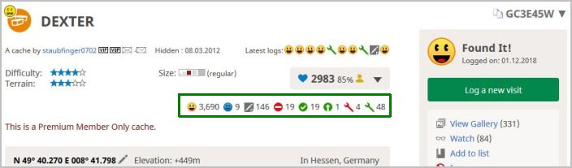 
		<a href="https://www.geocaching.com/my/#GClhShowConfig#a#settings_show_log_totals" title="Link to your GClh Config" >Settings -> Listing: 
		</a> 
	</li>
	<li>
		<strong>New:</strong> Replace initial Logs faster with GClh Template  [<a href="https://github.com/2Abendsegler/GClh/issues/995" title="Issue 995">995</a> / <a href="https://www.geocaching.com/profile/?u=Ruko2010" title="Thanks to Ruko2010" >Ruko2010</a>] 
	</li>
	<li>
		<strong>Fix:</strong> Logtemplate not inserted (Chrome / Safari)[<a href="https://github.com/2Abendsegler/GClh/issues/962" title="Issue 962">962</a> / <a href="https://www.geocaching.com/profile/?u=Ruko2010" title="Thanks to Ruko2010">Ruko2010</a>] 
		With fixing this bug, the insertion of a log Template is now also working on Android  
	</li>
	<li>
		<strong>Fix:</strong> Message Center - Receiver does not update if Message Center is accessed directly [<a href="https://github.com/2Abendsegler/GClh/issues/901" title="Issue 901">901</a> / <a href="https://www.geocaching.com/profile/?u=Ruko2010" title="Thanks to Ruko2010">Ruko2010</a>] 
	</li>
	<li>
		<strong>Fix:</strong> "Past Events" in bookmarklists and watchlists don't work with the new event time [<a href="https://github.com/2Abendsegler/GClh/issues/997" title="Issue 997">997</a> / <a href="https://www.geocaching.com/profile/?u=2Abendsegler" title="Thanks to 2Abendsegler">2Abendsegler</a>] 
	</li>
	<li>
		<strong>Fix:</strong> Show ignore list and hide area Lists in dashboard doesn't work [<a href="https://github.com/2Abendsegler/GClh/issues/999" title="Issue 999">999</a> / <a href="https://www.geocaching.com/profile/?u=2Abendsegler" title="Thanks to 2Abendsegler">2Abendsegler</a>] 
	</li>
	<li>
		<strong>Fix:</strong> Search field in header doesn't work with a location name [<a href="https://github.com/2Abendsegler/GClh/issues/1002" title="Issue 1002">1002</a> / <a href="https://www.geocaching.com/profile/?u=2Abendsegler" title="Thanks to 2Abendsegler">2Abendsegler</a>] 
	</li>
	<li>
		<strong>Fix:</strong> BRouter has a new URL schema [<a href="https://github.com/2Abendsegler/GClh/issues/1007" title="Issue 1007">1007</a> / <a href="https://www.geocaching.com/profile/?u=RadlerAndi" title="Thanks to RadlerAndi">RadlerAndi</a>] 
	</li>
	<li>
		<strong>Fix:</strong> Missing button create pocket query on foreign bookmarklists. [<a href="https://github.com/2Abendsegler/GClh/issues/1012" title="Issue 1012">1012</a> / <a href="https://www.geocaching.com/profile/?u=2Abendsegler" title="Thanks to 2Abendsegler">2Abendsegler</a>] 
	</li>
	<li>
		<strong>Fix:</strong> Build back old designed page list of bookmark lists and Rename link list of bookmark lists to new designed page. [<a href="https://github.com/2Abendsegler/GClh/issues/1015" title="Issue 1015">1015</a> / <a href="https://www.geocaching.com/profile/?u=2Abendsegler" title="Thanks to 2Abendsegler">2Abendsegler</a>] 
	</li>
	<li>
		<strong>Fix:</strong> On Google Maps page icon to GC Map is missing. [<a href="https://github.com/2Abendsegler/GClh/issues/1018" title="Issue 1018">1018</a> / <a href="https://www.geocaching.com/profile/?u=2Abendsegler" title="Thanks to 2Abendsegler">2Abendsegler</a>] 
	</li>
	<li>
		<strong>Fix:</strong> In dashboards sidebar the link to "Ignore List" comes also in chapter "Linklist" and "Default Links". [<a href="https://github.com/2Abendsegler/GClh/issues/1020" title="Issue 1020">1020</a> / <a href="https://www.geocaching.com/profile/?u=2Abendsegler" title="Thanks to 2Abendsegler">2Abendsegler</a>] 
	</li>
</ul>
(10.04.2019) 
released by <a href="https://www.geocaching.com/profile/?u=Ruko2010">Ruko2010</a> 
 

---
## v0.9.16:
<ul>
	<li>
		<strong>New:</strong> Show log counter when opening cache listing. [<a href="https://github.com/2Abendsegler/GClh/issues/954" title="Issue 954">954</a> / <a href="https://www.geocaching.com/profile/?u=2Abendsegler" title="Thanks to 2Abendsegler">2Abendsegler</a>] 
		 
		The functionality to show log counter is not new. New is only the possibility to activate the display by default without pushing a button. 
		<a href="https://www.geocaching.com/my/#GClhShowConfig#a#settings_show_log_counter_but" title="Link to your GClh Config">Settings -> Listing: 
		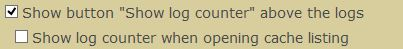</a> 
			If you want to use it, you have to <a href="https://www.geocaching.com/my/#GClhShowConfig#a#settings_show_log_counter_but" title="Link to your GClh Config">activate the parameter</a>. 
		 
	</li>
	<li>
		<strong>New:</strong> Display difficulty and terrain in bookmark lists. [<a href="https://github.com/2Abendsegler/GClh/issues/975" title="Issue 975">975</a> / <a href="https://www.geocaching.com/profile/?u=Ruko2010" title="Thanks to Ruko2010">Ruko2010</a>] 
		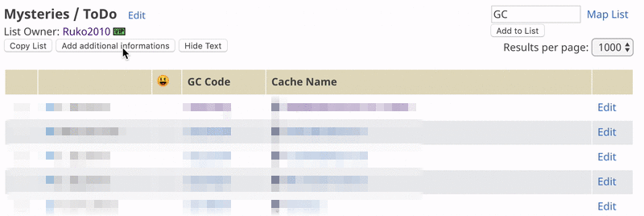 
		We changed the function of showing corrected coordinates to "Add additional information" and added difficulty and terrain for each cache. 
		 
	</li>
	<li>
		<strong>New:</strong> Add Link to "Unpublished Hides" to Linklist [<a href="https://github.com/2Abendsegler/GClh/issues/982" title="Issue 982">982</a> / <a href="https://www.geocaching.com/profile/?u=Ruko2010" title="Thanks to Ruko2010">Ruko2010</a>] 
		<a href="https://www.geocaching.com/my/#GClhShowConfig#a#llb#gclh_LinkListElement_74" title="Link to your GClh Config">Settings -> Linklist / Navigation: 
		</a> 
		 
	</li>
	<li>
		<strong>Fix:</strong> Prevent unwanted line breaks in GClh Config. [<a href="https://github.com/2Abendsegler/GClh/issues/956" title="Issue 956">956</a> / <a href="https://www.geocaching.com/profile/?u=2Abendsegler" title="Thanks to 2Abendsegler">2Abendsegler</a>] 
	</li>
	<li>
		<strong>Fix:</strong> Refine newer log page on small devices. [<a href="https://github.com/2Abendsegler/GClh/issues/957" title="Issue 957">957</a> / <a href="https://www.geocaching.com/profile/?u=2Abendsegler" title="Thanks to 2Abendsegler">2Abendsegler</a>] 
	</li>
	<li>
		<strong>Fix:</strong> Hide sidebar on map doesn't work with open in new tab. [<a href="https://github.com/2Abendsegler/GClh/issues/967" title="Issue 967">967</a> / <a href="https://www.geocaching.com/profile/?u=2Abendsegler" title="Thanks to 2Abendsegler">2Abendsegler</a>] 
	</li>
	<li>
		<strong>Fix:</strong> Error on shared bookmark lists if no home coordinates are known. [<a href="https://github.com/2Abendsegler/GClh/issues/970" title="Issue 970">970</a> / <a href="https://www.geocaching.com/profile/?u=2Abendsegler" title="Thanks to 2Abendsegler">2Abendsegler</a>] 
	</li>
	<li>
		<strong>Fix:</strong> Map error with additional layer and additional popup if Leaflet is not selected. [<a href="https://github.com/2Abendsegler/GClh/issues/969" title="Issue 969">969</a> / <a href="https://www.geocaching.com/profile/?u=Ruko2010" title="Thanks to Ruko2010">Ruko2010</a>, <a href="https://www.geocaching.com/profile/?u=2Abendsegler" title="Thanks to 2Abendsegler">2Abendsegler</a>] 
	</li>
	<li>
		<strong>Fix:</strong> Geonames elevation error with more than 20 coordinates. [<a href="https://github.com/2Abendsegler/GClh/issues/976" title="Issue 976">976</a> / <a href="https://www.geocaching.com/profile/?u=2Abendsegler" title="Thanks to 2Abendsegler">2Abendsegler</a>] 
	</li>
	<li>
		<strong>Fix:</strong> Save As Pocket Query - Default settings for new pocket queries do not work. [<a href="https://github.com/2Abendsegler/GClh/issues/978" title="Issue 978">978</a> / <a href="https://www.geocaching.com/profile/?u=Ruko2010" title="Thanks to Ruko2010">Ruko2010</a>] 
	</li>
	<li>
		<strong>Fix:</strong> Message Center: cacher name in greeting doesn't change on click on another geocacher [<a href="https://github.com/2Abendsegler/GClh/issues/901" title="Issue 901">901</a> / <a href="https://www.geocaching.com/profile/?u=Ruko2010" title="Thanks to Ruko2010">Ruko2010</a>] 
	</li>
</ul>
(13.02.2019) 
released by <a href="https://www.geocaching.com/profile/?u=2Abendsegler">2Abendsegler</a> 
 

---
## v0.9.15:
<ul>
	<li>
		<strong>New:</strong>  How you install GClh on Android devices. [<a href="https://github.com/2Abendsegler/GClh/issues/783" title="Issue 783">783</a> / <a href="https://www.geocaching.com/profile/?u=2Abendsegler" title="Thanks to 2Abendsegler">2Abendsegler</a>] 
		Extension of the <a href="https://github.com/2Abendsegler/GClh/blob/master/docu/tips_installation.md#android_firefox_en" title="Link to Tips for the installation of GC little helper II">Tips for the installation of GC little helper II (english)</a> / <a href="https://github.com/2Abendsegler/GClh/blob/master/docu/tips_installation.md#android_firefox_de" title="Link to Tips for the installation of GC little helper II">(german)</a>. 
		Extension of the FAQ: 
		- <a href="https://github.com/2Abendsegler/GClh/blob/master/docu/faq.md#4-en" title="Link to FAQ">Hints for using on Android devices (english)</a> / <a href="https://github.com/2Abendsegler/GClh/blob/master/docu/faq.md#4-de" title="Link to FAQ">(german)</a>. 
		- <a href="https://github.com/2Abendsegler/GClh/blob/master/docu/faq.md#3-en" title="Link to FAQ">GClh doesn't start (english)</a> / <a href="https://github.com/2Abendsegler/GClh/blob/master/docu/faq.md#3-de" title="Link to FAQ">(german)</a>. 
		 
	</li>
	<li>
		<strong>New:</strong> Show elevations also with Geonames. [<a href="https://github.com/2Abendsegler/GClh/issues/920" title="Issue 920">920</a> / <a href="https://www.geocaching.com/profile/?u=2Abendsegler" title="Thanks to 2Abendsegler">2Abendsegler</a>] 
		Because the number of calls to the Google Elevation API is limited and the Open-Elevation API is very slow and sometimes providing erroneous data, the Geonames API has also been implemented. The Geonames API is very fast. As before, a first and a second service can be selected. 
		We recommend the following settings. 
		<a href="https://www.geocaching.com/my/#GClhShowConfig#a#settings_show_elevation_of_waypoints" title="Link to your GClh Config">Settings -> Listing: 
			</a> 
		 
	</li>
	<li>
		<strong>New:</strong> Show elevation on additional popup on the map. [<a href="https://github.com/2Abendsegler/GClh/issues/802" title="Issue 802">802</a> / <a href="https://www.geocaching.com/profile/?u=2Abendsegler" title="Thanks to 2Abendsegler">2Abendsegler</a>] 
		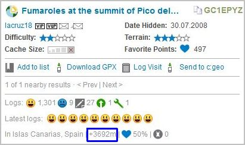 
		It only works if elevations for waypoints and listing coordinates is activated and at least a first service is named there. 
		<a href="https://www.geocaching.com/my/#GClhShowConfig#a#settings_show_elevation_of_waypoints" title="Link to your GClh Config">Settings -> Listing: 
			</a> 
		 
	</li>
	<li>
		<strong>Improvement:</strong> On favorites page no line-breaks in column location. [<a href="https://github.com/2Abendsegler/GClh/issues/926" title="Issue 926">926</a> / <a href="https://www.geocaching.com/profile/?u=2Abendsegler" title="Thanks to 2Abendsegler">2Abendsegler</a>] 
		<a href="https://www.geocaching.com/my/favorites.aspx" title="Link to your Favorites">
			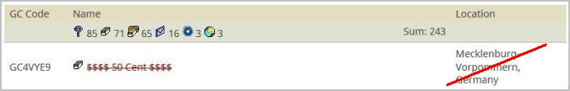 
			</a> 
		It is only used with a page width of at least 1000 pixels. 
		<a href="https://www.geocaching.com/my/#GClhShowConfig#a#settings_new_width" title="Link to your GClh Config">Settings -> Global: 
			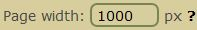</a> 
		 
	</li>
	<li>
		<strong>Fix:</strong> Wrong log's date in "latest logs" section of the map pop-up. [<a href="https://github.com/2Abendsegler/GClh/issues/922" title="Issue 922">922</a> / <a href="https://www.geocaching.com/profile/?u=Ruko2010" title="Thanks to Ruko2010">Ruko2010</a>] 
	</li>
	<li>
		<strong>Fix:</strong> Prevention line break caused by long cache name in map popup, works only for the first cache. [<a href="https://github.com/2Abendsegler/GClh/issues/924" title="Issue 924">924</a> / <a href="https://www.geocaching.com/profile/?u=2Abendsegler" title="Thanks to 2Abendsegler">2Abendsegler</a>] 
		(It is only implemented for browser Mozilla Firefox.) 
	</li>
	<li>
		<strong>Fix:</strong> Button "Mark Caches with Corr. Coords" can be pressed several times. [<a href="https://github.com/2Abendsegler/GClh/issues/925" title="Issue 925">925</a> / <a href="https://www.geocaching.com/profile/?u=2Abendsegler" title="Thanks to 2Abendsegler">2Abendsegler</a>] 
	</li>
	<li>
		<strong>Fix:</strong> Button "Mark Caches with Corr. Coords" doesn't work on foreign bookmarklists. [<a href="https://github.com/2Abendsegler/GClh/issues/928" title="Issue 928">928</a> / <a href="https://www.geocaching.com/profile/?u=2Abendsegler" title="Thanks to 2Abendsegler">2Abendsegler</a>] 
	</li>
	<li>
		<strong>Fix:</strong> Link to Gallery on friends page does not work for new designed profile page. [<a href="https://github.com/2Abendsegler/GClh/issues/937" title="Issue 937">937</a> / <a href="https://www.geocaching.com/profile/?u=2Abendsegler" title="Thanks to 2Abendsegler">2Abendsegler</a>] 
	</li>
	<li>
		<strong>Fix:</strong> Destroyed style of icons on search page for manage filter sets. [<a href="https://github.com/2Abendsegler/GClh/issues/939" title="Issue 939">939</a> / <a href="https://www.geocaching.com/profile/?u=2Abendsegler" title="Thanks to 2Abendsegler">2Abendsegler</a>] 
	</li>
	<li>
		<strong>Fix:</strong> Error on friends page in section Pending Friend Requests. [<a href="https://github.com/2Abendsegler/GClh/issues/941" title="Issue 941">941</a> / <a href="https://www.geocaching.com/profile/?u=2Abendsegler" title="Thanks to 2Abendsegler">2Abendsegler</a>] 
	</li>
	<li>
		<strong>Fix:</strong> Error on emtpy trackable pages. [<a href="https://github.com/2Abendsegler/GClh/issues/943" title="Issue 943">943</a> / <a href="https://www.geocaching.com/profile/?u=2Abendsegler" title="Thanks to 2Abendsegler">2Abendsegler</a>] 
	</li>
	<li>
		<strong>Fix:</strong> From "Friend League" to "Leaderboard". [<a href="https://github.com/2Abendsegler/GClh/issues/932" title="Issue 932">932</a> / <a href="https://www.geocaching.com/profile/?u=2Abendsegler" title="Thanks to 2Abendsegler">2Abendsegler</a>] 
	</li>
	<li>
		<strong>Fix:</strong> Link in dashboard to ignore list does not work with right mouse. [<a href="https://github.com/2Abendsegler/GClh/issues/851" title="Issue 851">851</a> / <a href="https://www.geocaching.com/profile/?u=2Abendsegler" title="Thanks to 2Abendsegler">2Abendsegler</a>] 
	</li>
</ul>
(18.01.2019) 
released by <a href="https://www.geocaching.com/profile/?u=2Abendsegler">2Abendsegler</a> 
 

---
## v0.9.14:
<ul>
	<li>
		<strong>Improvement:</strong> Save Personal Cache Note in cache listing with F2 key: [Issue <a href="https://github.com/2Abendsegler/GClh/issues/907">#907</a> / Thanks <a href="https://www.geocaching.com/profile/?u=2Abendsegler">2Abendsegler</a>] 
		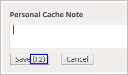 
	</li>
	<li>
		<strong>Improvement:</strong> Process icon "Copy GC Code to clipboard" also on additional Popup in maps: [Issue <a href="https://github.com/2Abendsegler/GClh/issues/911">#911</a> / Thanks <a href="https://www.geocaching.com/profile/?u=2Abendsegler">2Abendsegler</a>] 
		 
	</li>
	<li>
		<strong>Improvement:</strong> Past events error in foreign bookmarklists and in watchlist: [Issue <a href="https://github.com/2Abendsegler/GClh/issues/898">#898</a> / Thanks <a href="https://www.geocaching.com/profile/?u=2Abendsegler">2Abendsegler</a>] 
		To recognize and to select past events in bookmark lists and in the watchlist, the cache listings of the events will be read additionally. If you do not want this, the option can be disabled. 
		 
	</li>
	<li>
		<strong>Fix:</strong> Bookmark List: Create PQ-Button disappears in Compact Layout: [Issue <a href="https://github.com/2Abendsegler/GClh/issues/891">#891</a> / Thanks <a href="https://www.geocaching.com/profile/?u=Ruko2010">Ruko2010</a>] 
	</li>
	<li>
		<strong>Fix:</strong> Error while generating Message Icons on own Caches: [Issue <a href="https://github.com/2Abendsegler/GClh/issues/889">#889</a> / Thanks <a href="https://www.geocaching.com/profile/?u=Ruko2010">Ruko2010</a>] 
	</li>
	<li>
		<strong>Fix:</strong> Log Templates do not work when Owner Name contains a Single Quote: [Issue <a href="https://github.com/2Abendsegler/GClh/issues/902">#902</a> / Thanks <a href="https://www.geocaching.com/profile/?u=2Abendsegler">2Abendsegler</a>] 
	</li>
	<li>
		<strong>Fix:</strong> Unification of line spacing and font size of "Add to list" popup: [Issue <a href="https://github.com/2Abendsegler/GClh/issues/905">#905</a> / Thanks <a href="https://www.geocaching.com/profile/?u=2Abendsegler">2Abendsegler</a>] 
	</li>
	<li>
		<strong>Fix:</strong> Log inline and PMO log inline on listing do not work: [Issue <a href="https://github.com/2Abendsegler/GClh/issues/888">#888</a> / Thanks <a href="https://www.geocaching.com/profile/?u=2Abendsegler">2Abendsegler</a>] 
	</li>
	<li>
		<strong>Fix:</strong> Small map in Listing does not show up: [Issue <a href="https://github.com/2Abendsegler/GClh/issues/865">#865</a> / Thanks <a href="https://www.geocaching.com/profile/?u=CachingFoX">CachingFoX</a>] 
		Small Map in Listing and while creating a Pocketquery is now configurable. You can choose the map layer and the zoom: 
		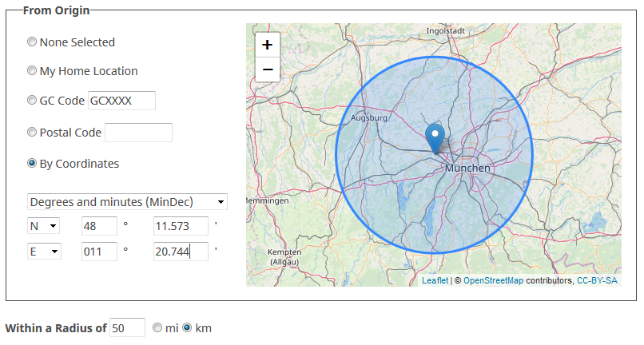 
		 
		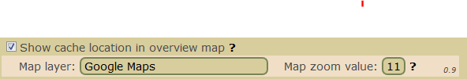 
	</li>
	<li>
		<strong>Improvement:</strong> Preventing twitching on the additional map popup: [Issue <a href="https://github.com/2Abendsegler/GClh/issues/916">#916</a> / Thanks <a href="https://www.geocaching.com/profile/?u=2Abendsegler">2Abendsegler</a>] 
	</li>
</ul>
(21.12.2018) 
released by <a href="https://www.geocaching.com/profile/?u=Ruko2010">Ruko2010</a> 
 

---
## v0.9.13:
<ul>
	<li>
		<strong>New:</strong> Project-GC - PQ-Splitter: You can now configurate how often the querys should run and choose between primary and secondary Output Email [Issue <a href="https://github.com/2Abendsegler/GClh/issues/861">#861</a>] 
		Thanks to <a href="https://www.geocaching.com/profile/?u=Ruko2010">Ruko2010</a> for the implementation. 
		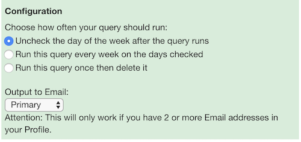 
  </li>
  <li>
		<strong>New:</strong> Added VIP/VUP and Message Icon behind Usernames on "Read the audit Log"-page (this page is only visible for own <i>premium caches</i>) [Issue <a href="https://github.com/2Abendsegler/GClh/issues/874">#874</a>] 
		Thanks to <a href="https://www.geocaching.com/profile/?u=Ruko2010">Ruko2010</a> for the implementation. 
		 
	</li>
	<li>
		<strong>Improvement:</strong> PQ-Splitter (Project GC) now only opens 5 Popups at a time to reduce the browsers resource consumption [Issue <a href="https://github.com/2Abendsegler/GClh/issues/842">#842</a>] 
		Thanks to <a href="https://www.geocaching.com/profile/?u=Ruko2010">Ruko2010</a> for the implementation. 
	</li>
	<li>
		<strong>Improvement:</strong> Selection in Message Center and Profile Settings is not visible in Firefox [Issue <a href="https://github.com/2Abendsegler/GClh/issues/878">#878</a>] 
		Thanks to <a href="https://www.geocaching.com/profile/?u=Ruko2010">Ruko2010</a> for the implementation. 
	</li>
	<li>
		<strong>Fix:</strong> Error in Nearest List, PQ, Recently viewed because of missing last column "Send to GPS" [Issue <a href="https://github.com/2Abendsegler/GClh/issues/844">#844</a>] 
		Thanks to <a href="https://www.geocaching.com/profile/?u=2Abendsegler">2Abendsegler</a> for the fix. 
	</li>
	<li>
		<strong>Fix:</strong> Edit and Image Links to own caches doesn't shown [Issue <a href="https://github.com/2Abendsegler/GClh/issues/810">#810</a>] 
		Thanks to <a href="https://www.geocaching.com/profile/?u=Ruko2010">Ruko2010</a> for the fix. 
	</li>
	<li>
		<strong>Fix:</strong> Loading logs do not stop after click to button show all logs [Issue <a href="https://github.com/2Abendsegler/GClh/issues/825">#825</a>] 
		Thanks to <a href="https://www.geocaching.com/profile/?u=Ruko2010">Ruko2010</a> for the fix. 
	</li>
	<li>
		<strong>Fix:</strong> Disable Loading Logs by GC on Product Listing Page [Issue <a href="https://github.com/2Abendsegler/GClh/issues/832">#832</a>] 
		Thanks to <a href="https://www.geocaching.com/profile/?u=Ruko2010">Ruko2010</a> for the fix. 
	</li>
	<li>
		<strong>Fix:</strong> PQ error because of missing last column "Send to GPS". [Issue <a href="https://github.com/2Abendsegler/GClh/issues/844">#844</a>] 
		Thanks to <a href="https://www.geocaching.com/profile/?u=2Abendsegler">2Abendsegler</a> for the fix. 
	</li>
	<li>
		<strong>Fix:</strong> Improved Elevation Service Error Handling [Issue <a href="https://github.com/2Abendsegler/GClh/issues/847">#847</a>] 
		Thanks to <a href="https://www.geocaching.com/profile/?u=CachingFoX">CachingFoX</a> for the fix. 
	</li>
	<li>
		<strong>Fix:</strong> Adapt the height of the Personal Cache Note does not work properly [Issue <a href="https://github.com/2Abendsegler/GClh/issues/848">#848</a>] 
		Thanks to <a href="https://www.geocaching.com/profile/?u=CachingFoX">CachingFoX</a> for the fix. 
	</li>
	<li>
		<strong>Fix:</strong> Added Color in Configuration and Documentation in Changelog for new parameter "Show GPSVisualizer" introduced in 0.9.12 [Issues <a href="https://github.com/2Abendsegler/GClh/issues/849">#849</a>, <a href="https://github.com/2Abendsegler/GClh/issues/850">#850</a>] 
		Thanks to <a href="https://www.geocaching.com/profile/?u=CachingFoX">CachingFoX</a> and <a href="https://www.geocaching.com/profile/?u=Ruko2010">Ruko2010</a> for the fixes. 
	</li>
	<li>
		<strong>Fix:</strong> Preselection map for BRouter does not work [Issue <a href="https://github.com/2Abendsegler/GClh/issues/852">#852</a>] 
		Thanks to <a href="https://www.geocaching.com/profile/?u=CachingFoX">CachingFoX</a> for the fix. 
	</li>
	<li>
		<strong>Fix:</strong> Error on Profile (Settings) [Issue <a href="https://github.com/2Abendsegler/GClh/issues/854">#854</a>] 
		Thanks to <a href="https://www.geocaching.com/profile/?u=CachingFoX">CachingFoX</a> for the fix. 
	</li>
	<li>
		<strong>Fix:</strong> Need to scroll down to see image description in pop-up mode [Issue <a href="https://github.com/2Abendsegler/GClh/issues/862">#862</a>] 
		Thanks to <a href="https://www.geocaching.com/profile/?u=Ruko2010">Ruko2010</a> for the fix. 
	</li>
	<li>
		<strong>Fix:</strong> Flopps Maps Link in Listing: Link to Google Maps Satellite not working [Issue <a href="https://github.com/2Abendsegler/GClh/issues/868">#868</a>] 
		Thanks to <a href="https://www.geocaching.com/profile/?u=Ruko2010">Ruko2010</a> for the fix. 
	</li>
	<li>
		<strong>Fix:</strong> Showing Weekday throws Error on unpublished Events [Issue <a href="https://github.com/2Abendsegler/GClh/issues/876">#876</a>] 
		Thanks to <a href="https://www.geocaching.com/profile/?u=Ruko2010">Ruko2010</a> for the fix. 
	</li>
</ul>
(09.10.2018) 
released by <a href="https://www.geocaching.com/profile/?u=Ruko2010">Ruko2010</a> 
 

---
## v0.9.12:
<ul>
	<li>
		<strong>New:</strong> Generate PQs from Output of Project-GC PQSplit [Issue <a href="https://github.com/2Abendsegler/GClh/issues/699">#699</a>] 
		Thanks to <a href="https://www.geocaching.com/profile/?u=Ruko2010">Ruko2010</a> for the implementation. 
		<strong>How to use it:</strong> Go to <a href="https://project-gc.com/Tools/PQSplit">https://project-gc.com/Tools/PQSplit</a> and, if not already done authenticate your account with Geocaching.com. Select either a country or a region to generate Pocket Querys for all caches in this area. Now enter a name and click on "Create PQ(s)". GClh will open as many Pop-ups as needed to generate all PocketQuerys on Geocaching.com. The Pup-ups will automaticly close if everything is done. Please make sure to not use a Pop-Up-Blocker. Also for now you can only set the filter country or region. Any other filter will disable this function. 
		<strong>Example:</strong> 
		 
	</li>
	<li>
		<strong>New:</strong> Added GPSVisualizer as an additional map service [Issue <a href="https://github.com/2Abendsegler/GClh/issues/807">#807</a>] 
		Thanks to <a href="https://www.geocaching.com/profile/?u=CachingFox">CachingFox</a> for the implementation. 
		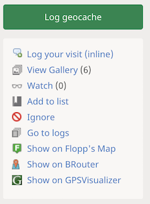 
		 
	</li>
	<li>
		<strong>New:</strong> Adapt the height of the edit field 'Personal Cache Note' to show the complete note [Issues <a href="https://github.com/2Abendsegler/GClh/issues/821">#821</a>, <a href="https://github.com/2Abendsegler/GClh/issues/816">#816</a>] 
		Thanks to <a href="https://www.geocaching.com/profile/?u=CachingFox">CachingFox</a> for the implementation. 
		 
	</li>
	<li>
		<strong>New:</strong> Add link to ignore list in sidebar [Issues <a href="https://github.com/2Abendsegler/GClh/issues/815">#815</a>, <a href="https://github.com/2Abendsegler/GClh/issues/819">#819</a>] 
		Thanks to <a href="https://www.geocaching.com/profile/?u=CachingFox">CachingFox</a> for the implementation. 
		 
		 
	</li>
	<li>
		<strong>New:</strong> Show both tabs "Active Pocket Queries" and "Pocket Queries Ready for Download" together of one page [Issue <a href="https://github.com/2Abendsegler/GClh/issues/835">#835</a>] 
		Thanks to <a href="https://www.geocaching.com/profile/?u=2Abendsegler">2Abendsegler</a> for the implementation. 
		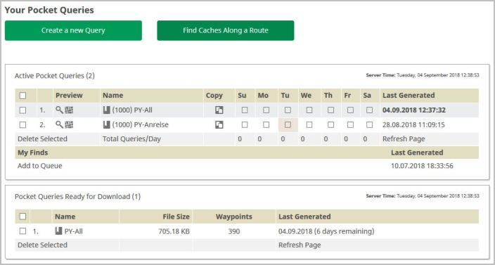 
		 
		This feature is disabled by default. You can enable it in the GClh configuration.
	</li>
	<li>
		<strong>New:</strong> Own statistic values in one line [Issue <a href="https://github.com/2Abendsegler/GClh/issues/800">#800</a>] 
		Thanks to <a href="https://www.geocaching.com/profile/?u=2Abendsegler">2Abendsegler</a> for the implementation. 
		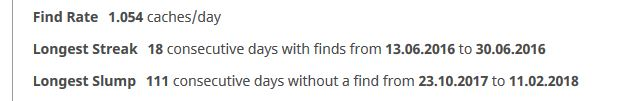 
	</li>
	<li>
		<strong>Fix:</strong> Duplicated Buttons in TB-List (Log Page) are not working [Issue <a href="https://github.com/2Abendsegler/GClh/issues/786">#786</a>] 
		Thanks to <a href="https://www.geocaching.com/profile/?u=Ruko2010">Ruko2010</a> for the fix. 
	</li>
	<li>
		<strong>Fix:</strong> On Paste in Log, Signature is added also if the pasted log contains the signature [Issue <a href="https://github.com/2Abendsegler/GClh/issues/776">#776</a>] 
		Thanks to <a href="https://www.geocaching.com/profile/?u=Ruko2010">Ruko2010</a> for the fix. 
	</li>
	<li>
		<strong>Fix:</strong> Reduce script injection in head section [Issue <a href="https://github.com/2Abendsegler/GClh/issues/811">#811</a>] 
		Thanks to <a href="https://www.geocaching.com/profile/?u=CachingFox">CachingFox</a> for the fix. 
	</li>
	<li>
		<strong>Fix:</strong> Error in small Map on Listing Page [Issue <a href="https://github.com/2Abendsegler/GClh/issues/787">#787</a>] 
		Thanks to <a href="https://www.geocaching.com/profile/?u=CachingFox">CachingFox</a> for the fix. 
	</li>
	<li>
		<strong>Fix:</strong> Error occurs on own "Unpublished Cache" page [Issue <a href="https://github.com/2Abendsegler/GClh/issues/809">#809</a>] 
		Thanks to <a href="https://www.geocaching.com/profile/?u=CachingFox">CachingFox</a> for the fix. 
	</li>
	<li>
		<strong>Fix:</strong> Error occurs on (not owned) "Unpublished Cache" page [Issue <a href="https://github.com/2Abendsegler/GClh/issues/826">#826</a>] 
		Thanks to <a href="https://www.geocaching.com/profile/?u=CachingFox">CachingFox</a> for the fix. 
	</li>
	<li>
		<strong>Fix:</strong> Errors on Log Page [Issue <a href="https://github.com/2Abendsegler/GClh/issues/833">#833</a>] 
		Thanks to <a href="https://www.geocaching.com/profile/?u=Ruko2010">Ruko2010</a> for the fix. 
	</li>
	<li>
		<strong>Fix:</strong> Error messages at 'All Geocaches' on the public profile [Issue <a href="https://github.com/2Abendsegler/GClh/issues/818">#818</a>] 
		Thanks to <a href="https://www.geocaching.com/profile/?u=CachingFox">CachingFox</a> for the fix. 
	</li>
	<li>
		<strong>Fix:</strong> The list of pq shows Active and Ready for Download together of one page [Issue <a href="https://github.com/2Abendsegler/GClh/issues/830">#830</a>] 
		Thanks to <a href="https://www.geocaching.com/profile/?u=2Abendsegler">2Abendsegler</a> for the fix. 
	</li>
	<li>
		<strong>Fix:</strong> If a message comes before posting a special log there is an error [Issue <a href="https://github.com/2Abendsegler/GClh/issues/836">#836</a>] 
		Thanks to <a href="https://www.geocaching.com/profile/?u=2Abendsegler">2Abendsegler</a> for the fix. 
	</li>
	<li>
		<strong>Fix:</strong> Button Show all logs and other sections do not work [Issue <a href="https://github.com/2Abendsegler/GClh/issues/761">#761</a>] 
		Thanks to <a href="https://www.geocaching.com/profile/?u=2Abendsegler">2Abendsegler</a> for the fix. 
	</li>
	<li>
		<strong>Fix:</strong> Tune server time output in pocket querries [Issue <a href="https://github.com/2Abendsegler/GClh/issues/796">#796</a>] 
		Thanks to <a href="https://www.geocaching.com/profile/?u=2Abendsegler">2Abendsegler</a> for the fix. 
	</li>
	<li>
		<strong>Fix:</strong> Tune positioning of buttons on friend league page. Tune distance of the images in the logs in the listing [Issue <a href="https://github.com/2Abendsegler/GClh/issues/790">#790</a>] 
		Thanks to <a href="https://www.geocaching.com/profile/?u=2Abendsegler">2Abendsegler</a> for the fix. 
	</li>
	<li>
		<strong>Fix:</strong> Username for generating profile link is not always recognized [Issue <a href="https://github.com/2Abendsegler/GClh/issues/793">#793</a>] 
		Thanks to <a href="https://www.geocaching.com/profile/?u=2Abendsegler">2Abendsegler</a> for the fix. 
	</li>
</ul>
(04.09.2018) 
released by <a href="https://www.geocaching.com/profile/?u=Ruko2010">Ruko2010</a> 
 

---
## v0.9.11:
<ul>
	<li>
		<strong>New:</strong> Alert if gclh_error is called (only in developer mode) [Issue <a href="https://github.com/2Abendsegler/GClh/issues/752">#752</a>] 
		We introduced a new section "Development" in the configuration. Here we will place features that are mostly designed for developers. The standard user can ignore this configurations. 
		Thanks to <a href="https://www.geocaching.com/profile/?u=CachingFoX">CachingFoX</a> for the implementation. 
	</li>
	<li>
		<strong>New:</strong> Clicking on the Personal Note Field focusing the input (no need to click twice any more) [Issue <a href="https://github.com/2Abendsegler/GClh/issues/762">#762</a>] 
	</li>
	<li>
		<strong>New:</strong> Auto Open Trackables when loading the logging page (new design) [Issue <a href="https://github.com/2Abendsegler/GClh/issues/775">#775</a>] 
	</li>
	<li>
		<strong>New:</strong> Line break for cache title and owner in additional popup on map [Issue <a href="https://github.com/2Abendsegler/GClh/issues/768">#768</a>] 
	</li>
	<li>
		<strong>Fix:</strong> Nickname missing in the Latest logs section [Issue <a href="https://github.com/2Abendsegler/GClh/issues/753">#753</a>] 
	</li>
	<li>
		<strong>Fix:</strong> Preview of Pictures in Logs throws Error [Issue <a href="https://github.com/2Abendsegler/GClh/issues/755">#755</a>] 
		Thanks to <a href="https://www.geocaching.com/profile/?u=2Abendsegler">2Abendsegler</a> for the fix. 
	</li>
	<li>
		<strong>Fix:</strong> Logs with Many Pictures: Picture container floats out of viewport [Issue <a href="https://github.com/2Abendsegler/GClh/issues/754">#754</a>] 
		Thanks to <a href="https://www.geocaching.com/profile/?u=2Abendsegler">2Abendsegler</a> for the fix. 
	</li>
	<li>
		<strong>Fix:</strong> Formatting in logs is demolished due to changes made by GS [Issue <a href="https://github.com/2Abendsegler/GClh/issues/759">#759</a>] 
		Thanks to <a href="https://www.geocaching.com/profile/?u=2Abendsegler">2Abendsegler</a> for the fix. 
	</li>
	<li>
		<strong>Fix:</strong> Eventdate is missing [Issue <a href="https://github.com/2Abendsegler/GClh/issues/764">#764</a>] 
		Thanks to <a href="https://www.geocaching.com/profile/?u=2Abendsegler">2Abendsegler</a> for the fix. 
	</li>
	<li>
		<strong>Fix:</strong> No favorites in percent in map on additional popup [Issue <a href="https://github.com/2Abendsegler/GClh/issues/766">#766</a>] 
		Thanks to <a href="https://www.geocaching.com/profile/?u=2Abendsegler">2Abendsegler</a> for the fix. 
	</li>
	<li>
		<strong>Fix:</strong> Listing Coordinates are not transfered to Flopp's Map and BRouter [Issue <a href="https://github.com/2Abendsegler/GClh/issues/771">#771</a>] 
		Thanks to <a href="https://www.geocaching.com/profile/?u=CachingFoX">CachingFoX</a> for the fix. 
	</li>
	<li>
		<strong>Fix:</strong> Logs are not added while scrolling down [Issue <a href="https://github.com/2Abendsegler/GClh/issues/745">#745</a>] 
	</li>
	<li>
		<strong>Fix:</strong> Calling Config from new dashboard do not work correct [Issue <a href="https://github.com/2Abendsegler/GClh/issues/784">#784</a>] 
		Thanks to <a href="https://www.geocaching.com/profile/?u=2Abendsegler">2Abendsegler</a> for the fix. 
	</li>
	<li>
		<strong>Fix:</strong> Wrong implementation of delayed re-try call idiom at impCallLink() [Issue <a href="https://github.com/2Abendsegler/GClh/issues/788">#788</a>] 
		Thanks to <a href="https://www.geocaching.com/profile/?u=CachingFoX">CachingFoX</a> for the fix. 
	</li>
	<li>
		<strong>Refactoring:</strong> [Issue <a href="https://github.com/2Abendsegler/GClh/issues/770">#770</a>], [Issue <a href="https://github.com/2Abendsegler/GClh/issues/770">#770</a>] 
		Thanks to <a href="https://www.geocaching.com/profile/?u=CachingFoX">CachingFoX</a> for the implementation. 
	</li>
</ul>
(25.08.2018) 
released by <a href="https://www.geocaching.com/profile/?u=Ruko2010">Ruko2010</a> 
 

---
## v0.9.10:
<ul>
	<li>
		<strong>Improvement:</strong> Some changes to the Map-Popup to make it more flexible [Issue <a href="https://github.com/2Abendsegler/GClh/issues/646">#646</a>] 
	</li>
	<li>
		<strong>Hot-Fix:</strong> Reload of logs in Listing-Page fails and breaks GClh. [Issue <a href="https://github.com/2Abendsegler/GClh/issues/745">#745</a>] 
		This Problem is not fixed yet. We have just deactived this function to get the whole Listing page (VIP/VUP, etc.) back to work. In the meantime you can use the button under the last log or at the top of the logs to load all logs. 
		<strong>We are still working on this Issue and hope to get a fix soon.</strong> 
	</li>
	<li>
		<strong>Fix:</strong> Updating names of countries [Issue <a href="https://github.com/2Abendsegler/GClh/issues/722">#722</a>] 
		Thanks to <a href="https://www.geocaching.com/profile/?u=CachingFoX">CachingFoX</a> for the fix. 
	</li>
	<li>
		<strong>Fix:</strong> Friendleague: After click on "see more" reloaded friends have no VIP/VUP Icons [Issue <a href="https://github.com/2Abendsegler/GClh/issues/734">#734</a>] 
	</li>
	<li>
		<strong>Fix:</strong> Missing 'Go to GC Map' button at www.openstreetmap.org [Issue <a href="https://github.com/2Abendsegler/GClh/issues/740">#740</a>] 
		Thanks to <a href="https://www.geocaching.com/profile/?u=CachingFoX">CachingFoX</a> for the fix. 
	</li>
	<li>
		<strong>Fix:</strong> MapPopup-Data is not loaded [Issue <a href="https://github.com/2Abendsegler/GClh/issues/747">#747</a>] 
	</li>
	<li>
		<strong>Fix:</strong> Hide empty Personal note in a cache listing fails [Issue <a href="https://github.com/2Abendsegler/GClh/issues/746">#746</a>] 
		Thanks to <a href="https://www.geocaching.com/profile/?u=CachingFoX">CachingFoX</a> for the fix. 
	</li>
</ul>
(11.08.2018) 
released by <a href="https://www.geocaching.com/profile/?u=Ruko2010">Ruko2010</a> 
 

---
## v0.9.9:
<ul>
	<li>
		<strong>Fix:</strong> Move Cursor to Starting Position after insertion of Signature in New Log/Draft Page: [Issue <a href="https://github.com/2Abendsegler/GClh/issues/729">#729</a>] 
		Thanks to <a href="https://www.geocaching.com/profile/?u=Ruko2010">Ruko2010</a> for the fix. 
	</li>
	<li>
		<strong>Fix:</strong> On Friendleague VIP/VUP List ist not generated correctly for Names with Special Chars in it: [Issue <a href="https://github.com/2Abendsegler/GClh/issues/732">#732</a>] 
		Thanks to <a href="https://www.geocaching.com/profile/?u=Ruko2010">Ruko2010</a> for the fix. 
	</li>
	<li>
		<strong>Fix:</strong> GClh and Geothumbs: Images in cache listing are damaged due to changes made by GS: [Issue <a href="https://github.com/2Abendsegler/GClh/issues/733">#733</a>] 
		If you are using Geothumbs, please install also the new version <a href="http://benchmarks.org.uk/greasemonkey/geothumbs/geothumbs_v7.9.user.js">Geothumbs 7.9</a>. 
	</li>
</ul>
(30.06.2018) 
released by <a href="https://www.geocaching.com/profile/?u=2Abendsegler">2Abendsegler</a> 
 

---
## v0.9.8:
<ul>
	<li>
		<strong>New:</strong> Mark more than one Pocket Query for generating without refreshing page for each: [Issue <a href="https://github.com/2Abendsegler/GClh/issues/702">#702</a>] 
		Only available with activated setting <a href="https://www.geocaching.com/my/#GClhShowConfig#a#settings_compact_layout_list_of_pqs">Show compact layout in list of pocket queries</a>. 
		Page <a href="https://www.geocaching.com/pocket/default.aspx">List of Pocket Queries</a>. 
		 
		Thanks to <a href="https://www.geocaching.com/profile/?u=2Abendsegler">2Abendsegler</a> for the implementation. 
		 
	</li>
	<li>
		<strong>Improvement:</strong> Show number of active Pocket Queries on page <a href="https://www.geocaching.com/pocket/default.aspx">Your Pocket Queries</a>: [Issue <a href="https://github.com/2Abendsegler/GClh/issues/705">#705</a>] 
		Thanks to <a href="https://www.geocaching.com/profile/?u=2Abendsegler">2Abendsegler</a> for the change. 
	</li>
	<li>
		<strong>Improvement:</strong> Show number of Bookmark Lists above on old page <a href="https://www.geocaching.com/my/lists.aspx">List of Bookmark Lists</a>: [Issue <a href="https://github.com/2Abendsegler/GClh/issues/711">#711</a>] 
		Thanks to <a href="https://www.geocaching.com/profile/?u=2Abendsegler">2Abendsegler</a> for the change. 
	</li>
	<li>
		<strong>Improvement:</strong> Translate <a href="https://github.com/2Abendsegler/GClh/blob/master/docu/development-tampermonkey.md">Development with Tampermonkey</a> to English: [Issue <a href="https://github.com/2Abendsegler/GClh/issues/630">#630</a>] 
	</li>
	<li>
		<strong>Improvement:</strong> Show links to found caches for every country/state on statistic maps page (improve of #363): [Issue <a href="https://github.com/2Abendsegler/GClh/issues/725">#725</a>] 
		Thanks to <a href="https://www.geocaching.com/profile/?u=CachingFoX">CachingFoX</a> for the implementation. 
	</li>
	<li>
		<strong>Fix:</strong> Navigation menu not reachable on new page Hidden Creatures: [Issue <a href="https://github.com/2Abendsegler/GClh/issues/713">#713</a>] 
		Thanks to <a href="https://www.geocaching.com/profile/?u=2Abendsegler">2Abendsegler</a> for the fix. 
	</li>
	<li>
		<strong>Fix:</strong> Push the map further down when the map popup is displayed: [Issue <a href="https://github.com/2Abendsegler/GClh/issues/646">#646</a>] 
	</li>
	<li>
		<strong>Fix:</strong> Damaged name and position of log images due to changes made by GS: [Issue <a href="https://github.com/2Abendsegler/GClh/issues/719">#719</a>] 
		Thanks to <a href="https://www.geocaching.com/profile/?u=2Abendsegler">2Abendsegler</a> for the fix. 
	</li>
	<li>
		<strong>Fix:</strong> Elevation of waypoints with hidden coordinates are shown as +0m: [Issue <a href="https://github.com/2Abendsegler/GClh/issues/670">#670</a>] 
		Thanks to <a href="https://www.geocaching.com/profile/?u=CachingFoX">CachingFoX</a> for the fix. 
	</li>
	<li>
		<strong>Fix:</strong> Updating names of countries: [Issue <a href="https://github.com/2Abendsegler/GClh/issues/722">#722</a>] 
		Thanks to <a href="https://www.geocaching.com/profile/?u=CachingFoX">CachingFoX</a> for the fix. 
	</li>
</ul>
(25.06.2018) 
released by <a href="https://www.geocaching.com/profile/?u=Ruko2010">Ruko2010</a> 
 

---
## v0.9.7:
<ul>
	<li>
		<strong>New:</strong> Show number of acquired souvenirs: [Issue <a href="https://github.com/2Abendsegler/GClh/issues/672">#672</a>] 
		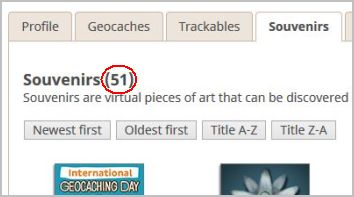 
		Thanks to <a href="https://www.geocaching.com/profile/?u=CachingFoX">CachingFoX</a> for the implementation. 
		 
	</li>
	<li>
		<strong>New:</strong> Link to map on bookmark list page: [Issue <a href="https://github.com/2Abendsegler/GClh/issues/680">#680</a>] 
		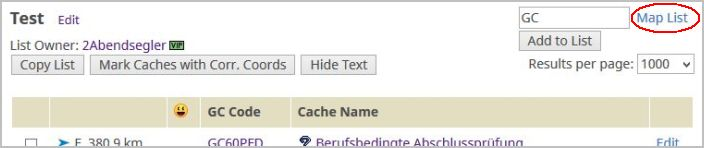 
		(Picture is in compact layout.) 
		 
	</li>
	<li>
		<strong>New:</strong> Button to copy GC Code in cache listing to clipboard: [Issue <a href="https://github.com/2Abendsegler/GClh/issues/695">#695</a>] 
		 
		 
	</li>
	<li>
		<strong>New:</strong> Show/hide text in column Description in <a href="https://www.geocaching.com/my/lists.aspx">old list of bookmark lists</a>: [Issue <a href="https://github.com/2Abendsegler/GClh/issues/686">#686</a>] 
		Only available with activated setting <a href="https://www.geocaching.com/my/#GClhShowConfig#a#settings_compact_layout_list_of_bm_lists">show compact layout in list of bookmark lists</a>. 
		 
		 
		 
	</li>
	<li>
		<strong>Improvement:</strong> Reduce line breaks in owner line on enhanced map popup: [Issue <a href="https://github.com/2Abendsegler/GClh/issues/668">#668</a>] 
		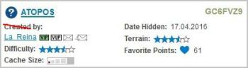  
		 
	</li>
	<li>
		<strong>Improvement:</strong> Update FAQs: [Issue <a href="https://github.com/2Abendsegler/GClh/issues/664">#664</a>] 
		Thanks to <a href="https://www.geocaching.com/profile/?u=Ruko2010">Ruko2010</a> for the update. 
		 
	</li>
	<li>
		<strong>Fix:</strong> Wrong links to found caches if there are equal names for a country and a region (statistics/map): [Issue <a href="https://github.com/2Abendsegler/GClh/issues/693">#693</a>] 
		Thanks to <a href="https://www.geocaching.com/profile/?u=Ruko2010">Ruko2010</a> for the fix. 
	</li>
	<li>
		<strong>Fix:</strong> Link to found caches in Czechia is missing (statistics/map): [Issue <a href="https://github.com/2Abendsegler/GClh/issues/691">#691</a>] 
		Thanks to <a href="https://www.geocaching.com/profile/?u=CachingFoX">CachingFoX</a> for the fix. 
	</li>
	<li>
		<strong>Fix:</strong> Elevation value 0m is shown with a plus sign: [Issue <a href="https://github.com/2Abendsegler/GClh/issues/671">#671</a>] 
		Thanks to <a href="https://www.geocaching.com/profile/?u=CachingFoX">CachingFoX</a> for the fix. 
	</li>
	<li>
		<strong>Fix:</strong> Grammar and Typo. 
		Thanks to <a href="https://www.geocaching.com/profile/?u=Bananeweizen">Bananeweizen</a> for the fix. 
	</li>
	<li>
		<strong>Fix:</strong> Set black as text color in search field: [Issue <a href="https://github.com/2Abendsegler/GClh/issues/662">#662</a>] 
	</li>
	<li>
		<strong>Fix:</strong> Demolished search and map buttons on new dashboard page due to changes made by GS: [Issue <a href="https://github.com/2Abendsegler/GClh/issues/674">#674</a>] 
	</li>
	<li>
		<strong>Fix:</strong> Demolished buttons on search page due to changes made by GS: [Issue <a href="https://github.com/2Abendsegler/GClh/issues/666">#666</a>] 
	</li>
	<li>
		<strong>Fix:</strong> More than one loading area and VIP button on enhanced map popup: [Issue <a href="https://github.com/2Abendsegler/GClh/issues/667">#667</a>] 
	</li>
	<li>
		<strong>Fix:</strong> Wrong percentage of favorites in enhanced map popup: [Issue <a href="https://github.com/2Abendsegler/GClh/issues/676">#676</a>] 
	</li>
</ul>
(28.05.2018) 
released by <a href="https://www.geocaching.com/profile/?u=2Abendsegler">2Abendsegler</a> 
 

---
## v0.9.6:
<ul>
	<li>
		<strong>New:</strong> After a change of a bookmark list you can go back to bookmark list automatically. The confirmation page of this change is skip: [Issue <a href="https://github.com/2Abendsegler/GClh/issues/648">#648</a>] 
		Settings -> Bookmark list: 
		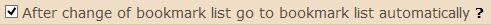 
	</li>
	<li>
		<strong>New:</strong> Save bookmark list with Key F2 too: [Issue <a href="https://github.com/2Abendsegler/GClh/issues/648">#648</a>] 
		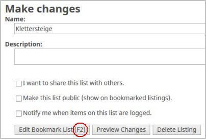 
	</li>
	<li>
		<strong>Improvement:</strong> Show Premium Only-Info in MapPopup: [Issue <a href="https://github.com/2Abendsegler/GClh/issues/651">#651</a>] 
		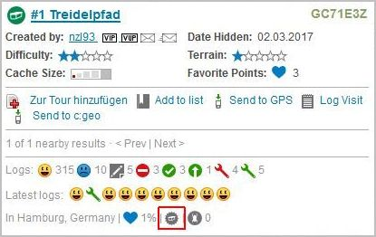 
		Thanks to <a href="https://www.geocaching.com/profile/?u=Ruko2010">Ruko2010</a> for the change. 	
	</li>
	<li>
		<strong>Improvement:</strong> Enhance message "GC Little Helper II is already running" with link to new document FAQ: [Issue <a href="https://github.com/2Abendsegler/GClh/issues/637">#637</a>, <a href="https://github.com/2Abendsegler/GClh/issues/644">#644</a>] 
		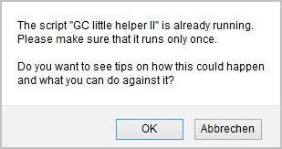 
		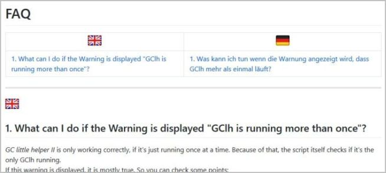 
		Thanks to <a href="https://www.geocaching.com/profile/?u=Ruko2010">Ruko2010</a> for the change. 	
	</li>
	<li>
		<strong>Improvement:</strong> Reorganization buttons in bookmark lists so it runs to with 900 pixel: [Issue <a href="https://github.com/2Abendsegler/GClh/issues/650">#650</a>] 
		 
	</li>
	<li>
		<strong>Improvement:</strong> Change souvenirs sort buttons to standard: [Issue <a href="https://github.com/2Abendsegler/GClh/issues/649">#649</a>] 
		 
	</li>
	<li>
		<strong>Fix:</strong> Misrepresentation of coordinates if only one digit before the minutes comma: [Issue <a href="https://github.com/2Abendsegler/GClh/issues/640">#640</a>] 
	<li>
		<strong>Fix:</strong> Error on old drafts page if no drafts available: [Issue <a href="https://github.com/2Abendsegler/GClh/issues/639">#639</a>] 
	<li>
		<strong>Fix:</strong> Copyright in GClh Config is too long, it is partly demolished: [Issue <a href="https://github.com/2Abendsegler/GClh/issues/643">#643</a>] 
	</li>
	<li>
		<strong>Fix:</strong> Additional linebreaks in cache listing due to changes made by GS: [Issue <a href="https://github.com/2Abendsegler/GClh/issues/652">#652</a>] 
	</li>
	<li>
		<strong>Fix:</strong> No button for "Find Caches Along a Route" in list of pocket queries due to changes made by GS: [Issue <a href="https://github.com/2Abendsegler/GClh/issues/654">#654</a>] 
	</li>
	<li>
		<strong>Fix:</strong> Wrong owner identification on new log page if draft log was empty: [Issue <a href="https://github.com/2Abendsegler/GClh/issues/655">#655</a>] 
	</li>
</ul>
(14.05.2018) 
released by <a href="https://www.geocaching.com/profile/?u=2Abendsegler">2Abendsegler</a> 
 

---
## v0.9.5:
<ul>
	<li>
		<strong>HotFix:</strong> Save in Config does not work: [Issue <a href="https://github.com/2Abendsegler/GClh/issues/634">#634</a>] 
		Thanks to <a href="https://www.geocaching.com/profile/?u=2Abendsegler">2Abendsegler</a> for the Fix. 
	</li>
</ul>
(03.05.2018) 
released by <a href="https://www.geocaching.com/profile/?u=Ruko2010">Ruko2010</a> 

---
## v0.9.4:
<ul>
	<li>
		<strong>New:</strong> Enhanced the map popup for a cache. [Issue <a href="https://github.com/2Abendsegler/GClh/issues/554">#554</a>, <a href="https://github.com/2Abendsegler/GClh/issues/623">#623</a>] 
		Additional Informations displayed:
		<ul>
			<li>Number of different log types</li>
			<li>Latest logs (configurable from 1 to 25)</li>
			<li>Cache place (state and country)</li>
			<li>Favorite Percentage</li>
			<li>Number of Trackables in Cache</li>
		</ul> 
		 
		 
		 
	</li>
	<li>
		<strong>New:</strong> Sorting of Souvenirs. [Issue <a href="https://github.com/2Abendsegler/GClh/issues/624">#624</a>] 
		Available sorting methods:
		<ul>
			<li>Sort by Date, latest first</li>
			<li>Sort by Date, oldest first</li>
			<li>Sort by Title A to Z</li>
			<li>Sort by Title Z to A</li>
		</ul> 
		 
		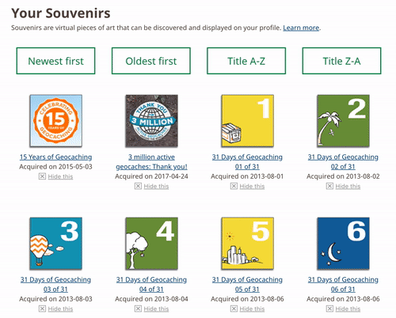 
		Thanks to <a href="https://www.geocaching.com/profile/?u=CachingFoX">CachingFoX</a> for the idea and the implementation. 
	</li>
	<li>
		<strong>New:</strong> You can now choose between Google Elevation Service and Open Elevation Service for Elevation-Data. [Issue <a href="https://github.com/2Abendsegler/GClh/issues/621">#621</a>] 
		You can choose the order of the services. The secound method will be used as Fall-Back if the first encounters an error or the data is missing.
		 
		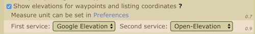 
		Thanks to <a href="https://www.geocaching.com/profile/?u=CachingFoX">CachingFoX</a> for the idea and the implementation. 
	</li>
	<li>
		<strong>New:</strong> Improvements of the new Draft-Page. [Issue <a href="https://github.com/2Abendsegler/GClh/issues/620">#620</a>] 
		<ul>
			<li>the Logtype (e.g. "Found-it", "Write-Note", etc.) is now displayed as Icon next to the cacheicon</li>
			<li>new link icon on the right to go directly to the cache listing (instead if the "new-log-page")</li>
			<li>Cache Icon is also linked to the cache listing</li>
		</ul>
		 
		 
		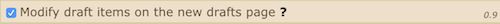 
		Thanks to <a href="https://www.geocaching.com/profile/?u=CachingFoX">CachingFoX</a> for the idea and the implementation. 
	</li>
	<li>
		<strong>New:</strong> We now have a Documentation, how you can develop Userscripts like GClh easily with Tampermonkey and Github. [Issue <a href="https://github.com/2Abendsegler/GClh/issues/619">#619</a>] 
		You can find it here: <a href="https://github.com/2Abendsegler/GClh/blob/master/docu/development-tampermonkey.md">Development with Tampermonkey</a> 
		Thanks to <a href="https://www.geocaching.com/profile/?u=CachingFoX">CachingFoX</a> for the idea and the implementation. 
	</li>
	<li>
		<strong>Fix:</strong> Draft count is also displayed at project GC button: [Issue <a href="https://github.com/2Abendsegler/GClh/pull/611">#611</a>] 
		Thanks to <a href="https://www.geocaching.com/profile/?u=2Abendsegler">2Abendsegler</a> for the Fix. 
	</li>
	<li>
		<strong>Fix:</strong> Images in the Listing were replaced by thumbnails: [Issue <a href="https://github.com/2Abendsegler/GClh/issues/625">#625</a>] 
	</li>
</ul>
(02.05.2018) 
released by <a href="https://www.geocaching.com/profile/?u=Ruko2010">Ruko2010</a> 

---
## v0.9.3:
<ul>
	<li>
		New: Added Draft Indicator to User Avatar in the menue. it shows the number of drafts you have. You can click on the number and jump directly to the drafts page. [Issue <a href="https://github.com/2Abendsegler/GClh/issues/589">#589</a>] 
		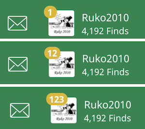 
		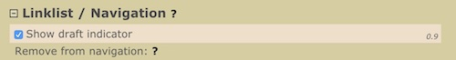 
	</li>
	<li>
		&nbsp; New: GClh is now runable under the Browser Safari [Issue <a href="https://github.com/2Abendsegler/GClh/pull/582">#582</a>]. You can find tips for the installation [<a href="https://github.com/2Abendsegler/GClh/blob/master/docu/tips_installation.md">here</a>]. If you find any issues please report them [<a href="https://github.com/2Abendsegler/GClh/issues">here</a>]. 
	</li>
	<li>
		New: Duplicated the Trackable Header (where you can mark all Trackables as visited / dropped) to the bottom of the Trackable List [Issue <a href="https://github.com/2Abendsegler/GClh/pull/600">#600</a>]. 
		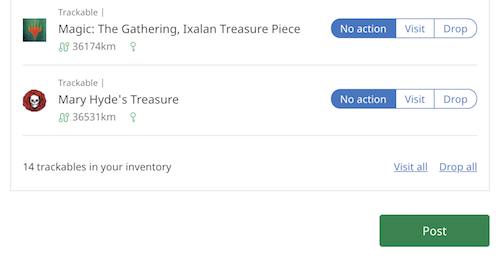 
	</li>
	<li>
		Improvement: Updated Layout of Readme and Installation Tips. Added english to Readme [Issue <a href="https://github.com/2Abendsegler/GClh/pull/599">#599</a>] 
	</li>
	<li>
		Fix: On new dashboard search button is moved due to changes made by GS: [Issue <a href="https://github.com/2Abendsegler/GClh/pull/607">#607</a>] 
		Thanks to <a href="https://www.geocaching.com/profile/?u=2Abendsegler">2Abendsegler</a> for the Fix. 
	</li>
	<li>
		Fix: If user is not logged in and visiting a cache page (premium caches) directly, he has no chance to sign in [Issue <a href="https://github.com/2Abendsegler/GClh/pull/594">#594</a>] 
		Thanks to <a href="https://www.geocaching.com/profile/?u=2Abendsegler">2Abendsegler</a> for the Fix.
	</li>
	<li>
		Fix: On Friend League page social sharing Twitter do not hide due to changes made by GS: [Issue <a href="https://github.com/2Abendsegler/GClh/pull/601">#601</a>] 
		Thanks to <a href="https://www.geocaching.com/profile/?u=2Abendsegler">2Abendsegler</a> for the Fix.
	</li>
	<li>
		Fix: Images in filtered out logs load as a new page instead of showing a "fancybox" on the same page [Issue <a href="https://github.com/2Abendsegler/GClh/pull/591">#591</a>] 
	</li>
	<li>
		Fix: Logcount was not replaced correctly in logtemplate (#Found#), when language was set to france on geocaching.com [Issue <a href="https://github.com/2Abendsegler/GClh/pull/596">#596</a>] 
	</li>
</ul>
(28.02.2018) 
released by <a href="https://www.geocaching.com/profile/?u=Ruko2010">Ruko2010</a> 

---
## v0.9.2:
<ul>
	<li>
		Fix: [Edge] After Tampermonkey update to 4.5.5648 GClh is not running anymore: [Issue <a href="https://github.com/2Abendsegler/GClh/issues/583">#583</a>] 
		Many thanks to <a href="https://www.geocaching.com/profile/?u=DrakMrak">DrakMrak</a> for the fix.
	</li>
	<li>
		Fix: Compact layout of bookmark lists is no longer displayed correctly, due to changes made by GS on 24.01.: [Issue <a href="https://github.com/2Abendsegler/GClh/pull/580">#580</a>] 
	</li>
	<li>
		Fix: On new log page signature is set also if parameter "Add log signature on drafts logs" is deactivated: [Issue <a href="https://github.com/2Abendsegler/GClh/pull/576">#576</a>] 
	</li>
	<li>
		Fix: In the list of Bookmark lists from a cache compact layout should not run.  [Issue <a href="https://github.com/2Abendsegler/GClh/issues/574">#574</a>] 
	</li>
	<li>
		New: Add selectable month and year in calendar of <a href="https://www.geocaching.com/my/geocaches.aspx">cache logs</a> and <a href="https://www.geocaching.com/my/travelbugs.aspx">trackable logs</a>: [Issue <a href="https://github.com/2Abendsegler/GClh/issues/572">#572</a>] 
		Many thanks to <a href="https://www.geocaching.com/profile/?u=Dratenik">Dratenik</a> for the idea and the implementation. 
		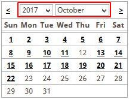 
	</li>
</ul>
(08.02.2018)  

---
## v0.9.1:
<ul>
<li>
New: Log preview on new log page: [Issue <a href="https://github.com/2Abendsegler/GClh/pull/545">#545</a>] 
Many thanks to <a href="https://www.geocaching.com/profile/?u=Ruko2010">Ruko2010</a> for the great implementation. 
 
 
</li>
<li>
New: In GClh Config there are some new chapters and some regroupings: [Issue <a href="https://github.com/2Abendsegler/GClh/pull/547">#547</a>] 
It should be now much easier to find things. 
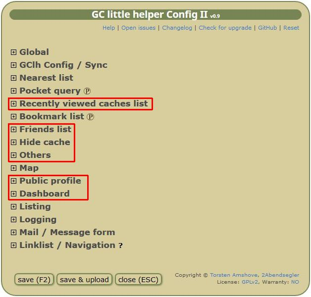 
 
</li>
<li>
New: Show favorites percentage in a new column on nearest lists, pocket querries and recently viewed cache list in compact layout. (A sort about this new column is not possible.) 
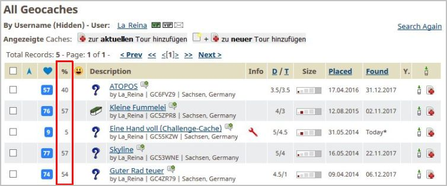 
Settings -> Nearest lists, Pocket querry and Recently viewed cache list: 
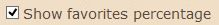 
 
</li>
<li>
New: Search and Map buttons on new dashboard. 
Many thanks to <a href="https://www.geocaching.com/profile/?u=DrakMrak">DrakMrak</a> for the nice implementation. 
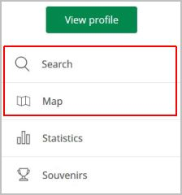 
Settings -> Dashboard: 
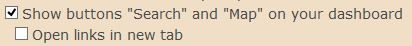 
 
</li>
<li>
New: Show compact layout on new dashboard: [Issue <a href="https://github.com/2Abendsegler/GClh/pull/523">#523</a>] 
Many thanks to <a href="https://www.geocaching.com/profile/?u=DrakMrak">DrakMrak</a>. 
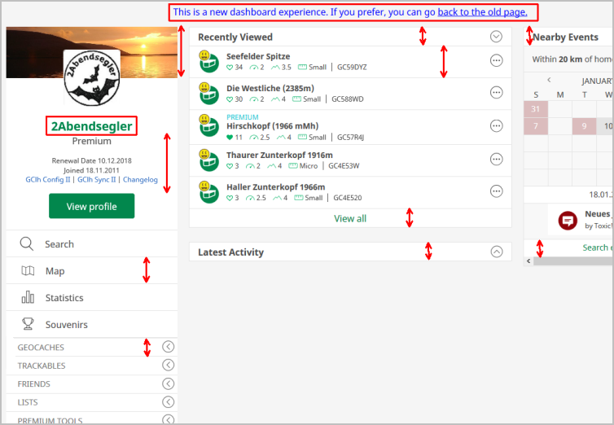 
Settings -> Dashboard: 
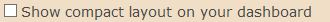 
 
</li>
<li>
New: Hide longtext in bookmarks on bookmark list: [Issue <a href="https://github.com/2Abendsegler/GClh/pull/565">#565</a>] 
(Only available in compact layout.) 
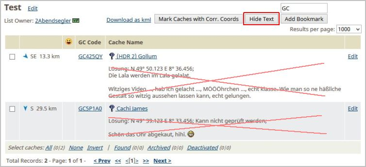 
 
</li>
<li>
New: Build Config parameter for the buttons "Show all logs", "Show log counter" and "Show bigger avatars" above the logs in cache listing. This is a special tribute to the loud weeping cachers (Pienzers). 
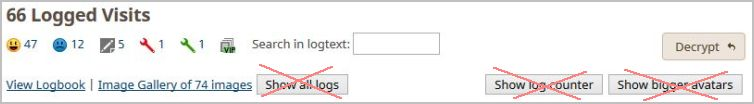 
Settings -> Listing: 
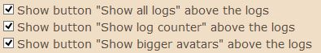 
 
</li>
<li>
New: Hide green feedback icon. 
 
Settings -> Global: 
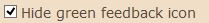 
 
</li>
<li>
New: Take also owner pseudonym to replace placeholder owner on new logging page: [Issue <a href="https://github.com/2Abendsegler/GClh/pull/526">#526</a>] 
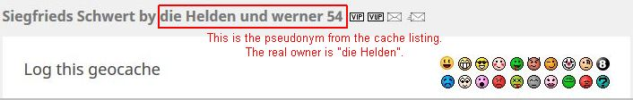 
Settings -> Logging: 
 
 
</li>
<li>
New: Improve mail and message page: [Issue <a href="https://github.com/2Abendsegler/GClh/pull/531">#531</a>] 
- Set message template also if no GClh icon was choosen. 
- Replace #receiver# in mail/message template also if no GClh icon was choosen. 
- Set VIP and VUP icon also on default mail page. 
 
</li>
<li>
New: Count favorite points also on public profile lists. 
 
 
</li>
<li>
Fix: Check which script has requested the DropBox token: [Issue <a href="https://github.com/2Abendsegler/GClh/pull/535">#535</a>] 
Many thanks to <a href="https://www.geocaching.com/profile/?u=ramirez_">ramirez_</a> for the fix. 
DropBox redirect changed to GC page "Account Settings", so the check can be handled easier. 
 
</li>
<li>
Fix: Standard GC settings menu frees from GClh: [Issue <a href="https://github.com/2Abendsegler/GClh/pull/552">#552</a>] 
 
</li>
<li>
Fix: Remove F2 new log page it is not stable, the reason could not be determined. 
 
</li>
<li>
Fix: Remove Autovisit functionality new log page. GC does not recognize settings with scripts. 
 
</li>
</ul>
(16.01.2018)  
 

---
## v0.9:
<ul>
<li>
New: GClh header processing with Linklist for all the new designed pages. 
 
</li>
<li>
New: Porting all functionality from the "old" pages to the new designed pages (except Drafts and My Lists, especially the latter side is just too ugly): 
(<i>Please note that depending on your user behavior, you may come to the old page, then select the new page there.</i>) 
<a href="https://www.geocaching.com/account/dashboard">Dashboard</a>: 
 
 
<a href="https://www.geocaching.com/play/geocache/gc1efpw/log">Logging</a>: 
 
 
 
<a href="https://www.geocaching.com/p/default.aspx?u=2Abendsegler">Public Profile</a>:  
 
<a href="https://www.geocaching.com/p/default.aspx?u=2Abendsegler&tab=trackables#profilepanel">Public Profile / Trackables</a>:  
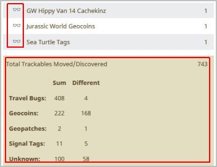 
<a href="https://www.geocaching.com/p/default.aspx?u=2Abendsegler&tab=gallery#profilepanel">Public Profile / Gallery</a>:  
 
<a href="https://www.geocaching.com/p/default.aspx?tab=stats#profilepanel">Public Profile / Statistik</a>:  
 
 
 
 
<a href="https://www.geocaching.com/play/friendleague">Friend League</a>:  
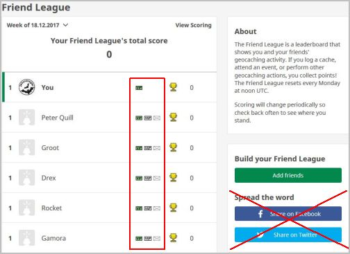 
 
</li>
<li>
New: Revision of the GClh Config and Sync so that they can be displayed on all pages (except the map because of no scrolling functionality). 
 
</li>
<li>
New: Faster processing of GClh especially on cache listing page. 
 
</li>
<li>
New: Added @connect statements to avoid Tampermonkey warnings because of data request from Google Maps Elevation and Github: [Issue <a href="https://github.com/2Abendsegler/GClh/pull/495">#495</a>] 
Many thanks to <a href="https://www.geocaching.com/profile/?u=Bananeweizen">Bananeweizen</a> for this note. 
 
</li>
<li>
New: Some new default links for the Linklist were added in GClh Config. 
 
 
</li>
<li>
New: The VIP, VUP, Mail and Message Icons are now additionally available for the owner on foreign Bookmark lists and on Nearest lists for users found and hidden caches. 
 
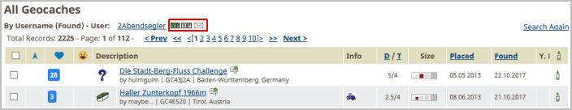 
 
</li>
<li>
New: Too in listings with event caches, the GClh image processing is now available. The images are displayed as thumbnails for a preview and if you hover with the mouse over a thumbnail you can see the big one. The corresponding Config settings are already longer available for all the other caches. 
Settings -> Listing: 
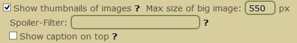 
 
</li>
<li>
New: After a change of a bookmark you can go back to bookmark list automatically. The confirmation page of this change is skip: 
Settings -> Bookmark list: 
 
 
</li>
<li>
New: The Trackables maps are now bigger, you can zoom in and zoom out by mouse wheel and you can change the size of the map via a slider below left with the mouse: [Issue <a href="https://github.com/2Abendsegler/GClh/pull/492">#492</a>] 
Many thanks to <a href="https://www.geocaching.com/profile/?u=Ruko2010">Ruko2010</a> for this great implementation. 
 
 
</li>
<li>
New: With a new button in Bookmark lists, you can determine which caches have corrected coordinates. This detail can be helpful by planning of cache tours: [Issue <a href="https://github.com/2Abendsegler/GClh/pull/504">#504</a>] 
Many thanks to <a href="https://www.geocaching.com/profile/?u=Ruko2010">Ruko2010</a> for the idea and the nice implementation. 
 
(<i>Bookmark list in compact layout together with script GC Tour</i>) 
 
</li>
<li>
New: Show Trackable Inventory in new dashboard. (In the old dashboard it is GC standard.): 
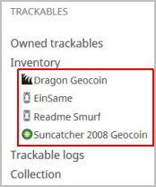 
Settings -> Public Profile / Dashboard - Trackables: 
 
 
</li>
<li>
New: Show all default links for the Linklist in new dashboard: 
 
Settings -> Public Profile / Dashboard: 
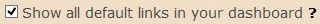 
 
</li>
<li>
New: Compact layout for Recently Viewed Caches list and show GClh Icon "Log it" too on this list: 
 
Settings -> Public Profile / Dashboard: 
 
Settings -> Global: 
 
(<i>This setting is not really new, only the Recently Viewed Caches list is here new.</i>) 
 
</li>
<li>
Fix: The whole Funktionality is tested on Firefox and Chrome with premium and with basic member in english and on Firefox with premium member in german only for the new developments. All bugs are fixed. 
</li>
</ul>
(19.12.2017)  
 
