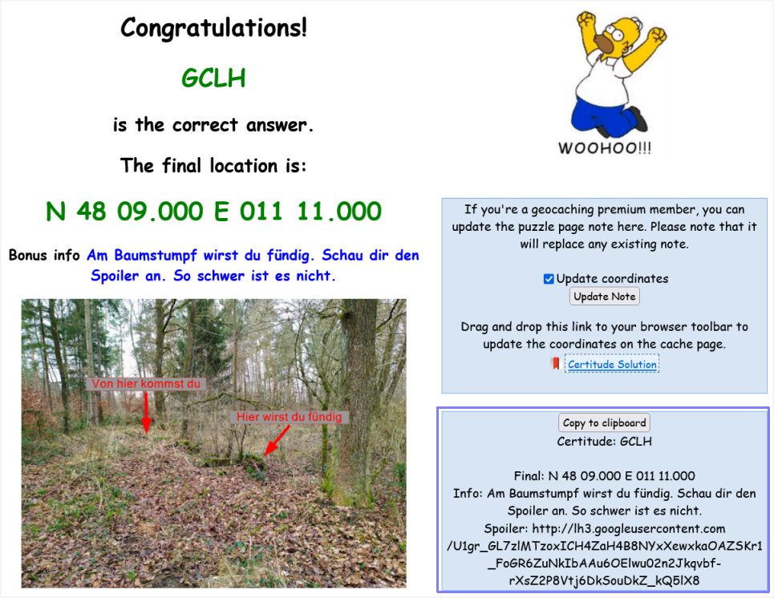
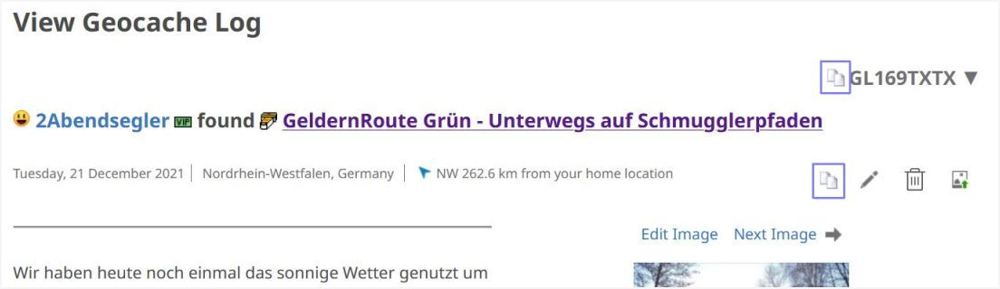
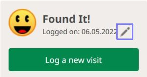
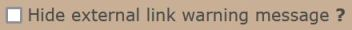
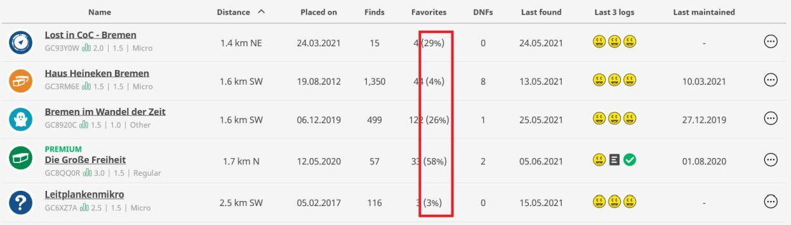
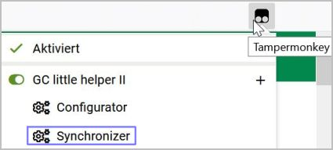
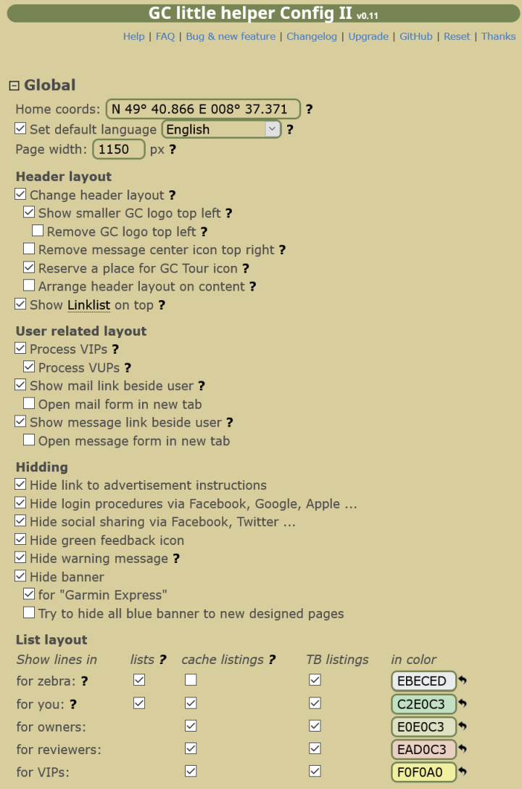

 
 
<a href="#v015" title="GClh II version 0.15 (26.11.2023)">v0.15</a> &nbsp;
<a href="#v0146" title="GClh II version 0.14.6 (22.04.2023)">v0.14.6</a> &nbsp;
<a href="#v0145" title="GClh II version 0.14.5 (12.04.2023)">v0.14.5</a> &nbsp;
<a href="#v0144" title="GClh II version 0.14.4 (28.02.2023)">v0.14.4</a> &nbsp;
<a href="#v0143" title="GClh II version 0.14.3 (25.02.2023)">v0.14.3</a> &nbsp;
<a href="#v0142" title="GClh II version 0.14.2 (14.02.2023)">v0.14.2</a> &nbsp;
<a href="#v0141" title="GClh II version 0.14.1 (27.01.2023)">v0.14.1</a> &nbsp;
<a href="#v014" title="GClh II version 0.14 (17.01.2023)">v0.14</a> &nbsp;
<a href="#v013" title="GClh II version 0.13">v0.13</a> &nbsp;
<a href="#v0121" title="GClh II version 0.12.1 (02.01.2023)">v0.12.1</a> &nbsp;
<a href="#v012" title="GClh II version 0.12 (15.10.2022)">v0.12</a> &nbsp;
<a href="#v01120" title="GClh II version 0.11.20 (03.10.2022)">v0.11.20</a> &nbsp;
<a href="#v01119" title="GClh II version 0.11.19 (26.07.2022)">v0.11.19</a> &nbsp;
<a href="#v01118" title="GClh II version 0.11.18 (04.07.2022)">v0.11.18</a> &nbsp;
<a href="#v01117" title="GClh II version 0.11.17 (23.06.2022)">v0.11.17</a> &nbsp;
<a href="#v01116" title="GClh II version 0.11.16 (07.05.2022)">v0.11.16</a> &nbsp;
<a href="#v01115" title="GClh II version 0.11.15 (31.03.2022)">v0.11.15</a> &nbsp;
<a href="#v01114" title="GClh II version 0.11.14 (12.03.2022)">v0.11.14</a> &nbsp;
<a href="#v01113" title="GClh II version 0.11.13 (08.03.2022)">v0.11.13</a> &nbsp;
<a href="#v01112" title="GClh II version 0.11.12 (03.02.2022)">v0.11.12</a> &nbsp;
<a href="#v01111" title="GClh II version 0.11.11 (02.02.2022)">v0.11.11</a> &nbsp;
<a href="#v01110" title="GClh II version 0.11.10 (25.01.2022)">v0.11.10</a> &nbsp;
<a href="#v0119" title="GClh II version 0.11.9 (23.12.2021)">v0.11.9</a> &nbsp;
<a href="#v01181" title="GClh II version 0.11.8.1 (22.11.2021)">v0.11.8.1</a> &nbsp;
<a href="#v0118" title="GClh II version 0.11.8 (20.11.2021)">v0.11.8</a> &nbsp;
<a href="#v0117" title="GClh II version 0.11.7 (12.09.2021)">v0.11.7</a> &nbsp;
<a href="#v01152" title="GClh II version 0.11.5.2 (20.08.2021)">v0.11.5.2</a> &nbsp;
<a href="#v01151" title="GClh II version 0.11.5.1 (17.07.2021)">v0.11.5.1</a> &nbsp;
<a href="#v0115" title="GClh II version 0.11.5 (03.07.2021)">v0.11.5</a> &nbsp;
<a href="#v0114" title="GClh II version 0.11.4 (29.05.2021)">v0.11.4</a> &nbsp;
<a href="#v0113" title="GClh II version 0.11.3 (23.05.2021)">v0.11.3</a> &nbsp;
<a href="#v0112" title="GClh II version 0.11.2 (17.05.2021)">v0.11.2</a> &nbsp;
<a href="#v0111" title="GClh II version 0.11.1 (16.05.2021)">v0.11.1</a> &nbsp;
<a href="#v011" title="GClh II version 0.11 (09.05.2021)">v0.11</a> &nbsp;
<a href="changelog_before.md" title="Go to earlier changelog">Earlier changelog</a> &nbsp;

---
## v0.15:
&nbsp; &nbsp;  
<ul>
	<li>
		<strong>New:</strong> [Log Form] Improve Log Form. [<a href="https://github.com/2Abendsegler/GClh/issues?q=is%3Aclosed+milestone%3A%22v0.15+%5BLog+Form%5D%22+sort%3Aupdated-desc" title="Collection of issues">Collection of issues</a> / <a href="https://www.geocaching.com/profile/?u=2Abendsegler" title="Thanks to 2Abendsegler">2Abendsegler</a> / <a href="https://www.geocaching.com/profile/?u=capoaira" title="Thanks to capoaira">capoaira</a>]  
		Please note that a log consisting only of an automatic signature and log templates cannot be saved. The website only notices a change in the log text, when the data is entered manually. It is enough to insert any character, which can also be removed immediately.  
		There are some older parameters in the <a href="https://www.geocaching.com/my/#GClhShowConfig#a#gclh_config_logging" title="Link to your GClh II Config">Log area</a> for the setting. Only the new parameters are presented below.  
		 
		<ul>
			<li>
				Additional cache info, like favorite points, favorites in percent, number of watcher, difficulty and terrain behind the name of a cache or an event. 
			</li>  
			<li>
				VIP, VUP, message and mail icon behind the owner. 
			</li>  
			<li>
				Set default log types. This feature is new here. It was previously only available for the old log form. The log type is set depending on whether it is a cache, an event or a TB and whether you are the owner or not. 
			</li>  
			<li>
				Log templates. 
				<a href="https://www.geocaching.com/my/#GClhShowConfig#a#settings_add_cache_log_signature_as_log_template" title="Link to your GClh II Config">Settings -> Log: 
				</a> 
				If you want to use one of these features, you have to activate it. 
			</li>  
			<li>
				Cache log signature or TB log signature. 
			</li>  
			<li>
				Show message in case of unsaved log. 
			</li>  
			<li>
				Show length of logtext and word count.  
			</li>  
		</ul>
		 
		<ul>
			<li>
				TB auto visit. 
			</li>  
			<li>
				Replicate TB-Header to bottom. 
			</li>  
			<li>
				F2 key for send the log. This feature is new here. It was previously only available for the old log form.   
			</li>
		</ul>
	</li>
	<li>
		<strong>New:</strong> [Notification] Improve notification list and notifications. [<a href="https://github.com/2Abendsegler/GClh/issues/2454" title="Issue 2454">2454</a> / <a href="https://www.geocaching.com/profile/?u=2Abendsegler" title="Thanks to 2Abendsegler">2Abendsegler</a>]  
		<a href="https://www.geocaching.com/my/#GClhShowConfig#a#settings_improve_notifications" title="Link to your GClh II Config">Settings -> Other: 
		</a>  
		Notification list: 
		 
		<ul>
			<li>
				Build a table header. 
			</li>
			<li>
				Sorting the lines by clicking on the column header. 
			</li>
			<li>
				Button in the header to create a new notification. 
			</li>
			<li>
				Button in the header to load, show, hide the missing notification data coordinates, distance and send to. 
			</li>
			<li>
				Button in the header to hide, show page info. 
			</li>
			<li>
				Enable, disable a notification without reloading the page. 
			</li>
			<li>
				Button to start a copy process to copy the data into a new notification.  
			</li>
		</ul>
		Notification: Copy process 
		 
		<ul>
			<li>
				During the copy process the contents of all fields are set. 
			</li>
			<li>
				After changing the cache type, the log types are also set again as far as possible.  
			</li>
		</ul>
		Notification: 
		 
		<ul>
			<li>
				The coordinates can alternatively be entered using a single field.  
			</li>
		</ul>
		 
		<ul>
			<li>
				Add or save with the F2 key.   
			</li>
		</ul>
	</li>
	<li>
		<strong>New:</strong> [Maps] Add link to Komoot on Browse and Search Map. [<a href="https://github.com/2Abendsegler/GClh/issues/2433" title="Issue 2433">2433</a> / <a href="https://www.geocaching.com/profile/?u=2Abendsegler" title="Thanks to 2Abendsegler">2Abendsegler</a>]  
		Browse Map: 
		  
		Search Map: 
		  
		<a href="https://www.geocaching.com/my/#GClhShowConfig#a#settings_add_link_komoot_on_gc_map" title="Link to your GClh II Config">Settings -> Map - Komoot Page: 
		</a> 
		If you want to use the second feature, you have to activate it.   
	</li>
	<li>
		<strong>New:</strong> [Cache Listing] Allow "Search in logs" to be case sensitive. [<a href="https://github.com/2Abendsegler/GClh/issues/2381" title="Issue 2381">2381</a> / <a href="https://www.geocaching.com/profile/?u=2Abendsegler" title="Thanks to 2Abendsegler">2Abendsegler</a>] 
		 
		The "Search in logs" feature is not new, only the possibility to search case sensitive.   
	</li>
	<li>
		<strong>New:</strong> [TB Listing] Button to copy TB Code in trackable listing to clipboard. [<a href="https://github.com/2Abendsegler/GClh/issues/2413" title="Issue 2413">2413</a> / <a href="https://www.geocaching.com/profile/?u=2Abendsegler" title="Thanks to 2Abendsegler">2Abendsegler</a>] 
		   
	</li>
	<li>
		<strong>Fix:</strong> [Cache Listing] GC Code is not copyable when PGC script is running. [<a href="https://github.com/2Abendsegler/GClh/issues/2420" title="Issue 2420">2420</a> / <a href="https://www.geocaching.com/profile/?u=2Abendsegler" title="Thanks to 2Abendsegler">2Abendsegler</a> / <a href="https://www.geocaching.com/profile/?u=capoaira" title="Thanks to capoaira">capoaira</a>] 
	</li>
	<li>
		<strong>Fix:</strong> [Cache Listing] VIP-List "Not Found" does not work on Webcam Caches. [<a href="https://github.com/2Abendsegler/GClh/issues/2412" title="Issue 2412">2412</a> / <a href="https://www.geocaching.com/profile/?u=2Abendsegler" title="Thanks to 2Abendsegler">2Abendsegler</a>] 
	</li>
	<li>
		<strong>Fix:</strong> [Old Log Form] Markdown smilies have been changed. [<a href="https://github.com/2Abendsegler/GClh/issues/2411" title="Issue 2411">2411</a> / <a href="https://www.geocaching.com/profile/?u=capoaira" title="Thanks to capoaira">capoaira</a>] 
	</li>
	<li>
		<strong>Fix:</strong> [Old Log Form] Log date not changeable for passed events in old log form. [<a href="https://github.com/2Abendsegler/GClh/issues/2418" title="Issue 2418">2418</a> / <a href="https://www.geocaching.com/profile/?u=2Abendsegler" title="Thanks to 2Abendsegler">2Abendsegler</a>] 
	</li>
	<li>
		<strong>Fix:</strong> [Log Form] GClh header disappears. [<a href="https://github.com/2Abendsegler/GClh/issues/2443" title="Issue 2443">2443</a> / <a href="https://www.geocaching.com/profile/?u=2Abendsegler" title="Thanks to 2Abendsegler">2Abendsegler</a>] 
	</li>
</ul>
 
(26.11.2023) 
released by <a href="https://www.geocaching.com/profile/?u=2Abendsegler">2Abendsegler</a> 
 

---
## v0.14.6:
&nbsp; &nbsp;  
<ul>
	<li>
		<strong>New:</strong> [Log Forms] Show further cache info cache type, difficulty and terrain in log forms. [<a href="https://github.com/2Abendsegler/GClh/issues/2399" title="Issue 2399">2399</a> / <a href="https://www.geocaching.com/profile/?u=ChristianGK" title="Thanks to ChristianGK">ChristianGK</a>] 
		New log form: 
		  
		Old log form: 
		  
		<a href="https://www.geocaching.com/my/#GClhShowConfig#a#settings_show_add_cache_info_in_log_page" title="Link to your GClh II Config">Settings -> Log: 
		</a> 
		This parameter is not new. If you want to use this feature, maybe you have to activate it.  
	</li>
	<li>
		<strong>Fix:</strong> [New Log Form] VIP, mail, message icons are not stable. [<a href="https://github.com/2Abendsegler/GClh/issues/2393" title="Issue 2393">2393</a> / <a href="https://www.geocaching.com/profile/?u=2Abendsegler" title="Thanks to 2Abendsegler">2Abendsegler</a>] 
	</li>
	<li>
		<strong>Fix:</strong> [New Log Form] Replacement owner in log template doesn't work. [<a href="https://github.com/2Abendsegler/GClh/issues/2391" title="Issue 2391">2391</a> / <a href="https://www.geocaching.com/profile/?u=2Abendsegler" title="Thanks to 2Abendsegler">2Abendsegler</a>] 
	</li>
	<li>
		<strong>Fix:</strong> [Old Log Form] Additional cache info favorite percentage not shown if blue banner deactivated. [<a href="https://github.com/2Abendsegler/GClh/issues/2400" title="Issue 2400">2400</a> / <a href="https://www.geocaching.com/profile/?u=2Abendsegler" title="Thanks to 2Abendsegler">2Abendsegler</a>] 
	</li>
	<li>
		<strong>Fix:</strong> [Recently Viewed Caches] Improve PQs runs into error if script send2cgeo is active. [<a href="https://github.com/2Abendsegler/GClh/issues/2390" title="Issue 2390">2390</a> / <a href="https://www.geocaching.com/profile/?u=2Abendsegler" title="Thanks to 2Abendsegler">2Abendsegler</a>] 
	</li>
	<li>
		<strong>Fix:</strong> [BML] Output sometimes incorrect when cache is deleted from a list. [<a href="https://github.com/2Abendsegler/GClh/issues/2402" title="Issue 2402">2402</a> / <a href="https://www.geocaching.com/profile/?u=2Abendsegler" title="Thanks to 2Abendsegler">2Abendsegler</a>] 
	</li>
</ul>
 
(22.04.2023) 
released by <a href="https://www.geocaching.com/profile/?u=2Abendsegler">2Abendsegler</a> 
 

---
## v0.14.5:
&nbsp; &nbsp;  
<ul>
	<li>
		<strong>Fix:</strong> [Friend List] Without "Reset Counter" button. [<a href="https://github.com/2Abendsegler/GClh/issues/2383" title="Issue 2383">2383</a> / <a href="https://www.geocaching.com/profile/?u=2Abendsegler" title="Thanks to 2Abendsegler">2Abendsegler</a>] 
	</li>
</ul>
 
(12.04.2023) 
released by <a href="https://www.geocaching.com/profile/?u=2Abendsegler">2Abendsegler</a> 
 

---
## v0.14.4:
&nbsp; &nbsp;  
<ul>
	<li>
		<strong>Fix:</strong> [Global] Failed to execute 'atob' on 'Window': The string to be decoded contains characters outside of the Latin1 range. [<a href="https://github.com/2Abendsegler/GClh/issues/2375" title="Issue 2375">2375</a> / <a href="https://www.geocaching.com/profile/?u=capoaira" title="Thanks to capoaira">capoaira</a>] 
	</li>
</ul>
 
(28.02.2023) 
released by <a href="https://www.geocaching.com/profile/?u=2Abendsegler">2Abendsegler</a> 
 

---
## v0.14.3:
&nbsp; &nbsp;  
<ul>
	<li>
		<strong>New:</strong> [Global] Rewrite the function for remove a blue banner - activate [X] button for user interaction. [<a href="https://github.com/2Abendsegler/GClh/issues/2351" title="Issue 2351">2351</a> / <a href="https://www.geocaching.com/profile/?u=Dratenik" title="Thanks to Dratenik">Dratenik</a>] 
		With blue banners below the page header, new page layouts or new features are pointed out. If you don't want that, you don't have the option to hide the annoying banner. This parameter adds a button to decide which banners to hide. If the parameter is deactivated, the hidden banners are deleted again. 
		 
		<a href="https://www.geocaching.com/my/#GClhShowConfig#a#settings_remove_banner" title="Link to your GClh II Config">Settings -> Global: 
		</a> 
		This parameter is not new. If you want to use this feature, maybe you have to activate it.  
	</li>
	<li>
		<strong>New:</strong> [New Dashboard] Copy to clipboard for log text in Latest Activity list. [<a href="https://github.com/2Abendsegler/GClh/issues/2353" title="Issue 2353">2353</a> / <a href="https://www.geocaching.com/profile/?u=ChristianGK" title="Thanks to ChristianGK">ChristianGK</a>] 
		With the new button the log text is copied to the clipboard. 
		  
	</li>
	<li>
		<strong>New:</strong> [Event Listing] Show event time in 24 hours format. [<a href="https://github.com/2Abendsegler/GClh/issues/2358" title="Issue 2358">2358</a> / <a href="https://www.geocaching.com/profile/?u=2Abendsegler" title="Thanks to 2Abendsegler">2Abendsegler</a>] 
		The start time and end time of an event are generated on the website using the language in which you are signed in. In English, the preferred language when using the GClh, but also in some other languages, the start time and end time of an event is shown in 12 hour format with AM and PM. If you want to change it to a 24 hour format, you can activate this parameter. 
		Event time in 12 hours format: 
		 
		Event time in 24 hours format: 
		 
		<a href="https://www.geocaching.com/my/#GClhShowConfig#a#settings_show_eventtime_with_24_hours" title="Link to your GClh II Config">Settings -> Listing - Listing Header: 
		</a> 
		If you want to use this feature, you have to activate it.  
	</li>
	<li>
		<strong>Fix:</strong> [New Dashboard] If there are more than ten unpublished hides, the display no longer works correctly. [<a href="https://github.com/2Abendsegler/GClh/issues/2354" title="Issue 2354">2354</a> / <a href="https://www.geocaching.com/profile/?u=2Abendsegler" title="Thanks to 2Abendsegler">2Abendsegler</a>] 
	</li>
	<li>
		<strong>Fix:</strong> [Cache Listing] The possible layers on Flopp's Map have changed. [<a href="https://github.com/2Abendsegler/GClh/issues/2364" title="Issue 2364">2364</a> / <a href="https://www.geocaching.com/profile/?u=2Abendsegler" title="Thanks to 2Abendsegler">2Abendsegler</a>] 
	</li>
	<li>
		<strong>Fix:</strong> [Cache Listing] Overview map shows only the signs '>. [<a href="https://github.com/2Abendsegler/GClh/issues/2355" title="Issue 2355">2355</a> / <a href="https://www.geocaching.com/profile/?u=2Abendsegler" title="Thanks to 2Abendsegler">2Abendsegler</a>] 
	</li>
	<li>
		<strong>Fix:</strong> [Sync] Dropbox authentication keeps getting lost. [<a href="https://github.com/2Abendsegler/GClh/issues/2360" title="Issue 2360">2360</a> / <a href="https://www.geocaching.com/profile/?u=2Abendsegler" title="Thanks to 2Abendsegler">2Abendsegler</a>] 
	</li>
</ul>
 
(25.02.2023) 
released by <a href="https://www.geocaching.com/profile/?u=2Abendsegler">2Abendsegler</a> 
 

---
## v0.14.2:
&nbsp; &nbsp;  
<ul>
	<li>
		<strong>New:</strong> [Search Map] Improve layout in "Add to list" pop up. [<a href="https://github.com/2Abendsegler/GClh/issues/2316" title="Issue 2316">2316</a> / <a href="https://www.geocaching.com/profile/?u=2Abendsegler" title="Thanks to 2Abendsegler">2Abendsegler</a>] 
		Add to list pop up without the enhancement: 
		 
		Add to list pop up with the enhancement: 
		 
		<a href="https://www.geocaching.com/my/#GClhShowConfig#a#settings_searchmap_improve_add_to_list" title="Link to your GClh II Config">Settings -> Map: 
		</a> 
		With the last option you can choose the maximum height of the "Add to list" pop up to bookmark a cache from 130 up to 520 pixel. The default is 130 pixel, similar to the standard. If you want to use a bigger "Add to list" pop up, you have to maintain the parameter.  
	</li>
	<li>
		<strong>Fix:</strong> [Cache Listing] "Who Gave Favorite" aborts when VIPs are disabled. [<a href="https://github.com/2Abendsegler/GClh/issues/2293" title="Issue 2293">2293</a> / <a href="https://www.geocaching.com/profile/?u=Die Batzen" title="Thanks to Die Batzen">Die Batzen</a>] 
	</li>
	<li>
		<strong>Fix:</strong> [Browse Map / Search Map] The OpenStreetMap layer "OpenStreetMap Black and White" and "OpenStreetMap Hike and Bike" are no longer built. [<a href="https://github.com/2Abendsegler/GClh/issues/2296" title="Issue 2296">2296</a> / <a href="https://www.geocaching.com/profile/?u=2Abendsegler" title="Thanks to 2Abendsegler">2Abendsegler</a>] 
	</li>
	<li>
		<strong>Fix:</strong> [Certitude] Copy to clipboard feature not longer available and stay anonymous does not work if signed in by certitudes. [<a href="https://github.com/2Abendsegler/GClh/issues/2315" title="Issue 2315">2315</a> / <a href="https://www.geocaching.com/profile/?u=2Abendsegler" title="Thanks to 2Abendsegler">2Abendsegler</a>] 
	</li>
	<li>
		<strong>Fix:</strong> [GitHub] raw.githubusercontent.com does not update. [<a href="https://github.com/2Abendsegler/GClh/issues/2314" title="Issue 2314">2314</a> / <a href="https://www.geocaching.com/profile/?u=2Abendsegler" title="Thanks to 2Abendsegler">2Abendsegler</a>] 
	</li>
</ul>
 
(14.02.2023) 
released by <a href="https://www.geocaching.com/profile/?u=2Abendsegler">2Abendsegler</a> 
 

---
## v0.14.1:
&nbsp; &nbsp;  
<ul>
	<li>
		<strong>Fix:</strong> [Search Map] Corrected coordinates bug fix. [<a href="https://github.com/2Abendsegler/GClh/issues/2285" title="Issue 2285">2285</a> / <a href="https://www.geocaching.com/profile/?u=Die Batzen" title="Thanks to Die Batzen">Die Batzen</a>] 
	</li>
	<li>
		<strong>Fix:</strong> [New Log Form] Missing favorite point marker. [<a href="https://github.com/2Abendsegler/GClh/issues/2193" title="Issue 2193">2193</a> / <a href="https://www.geocaching.com/profile/?u=2Abendsegler" title="Thanks to 2Abendsegler">2Abendsegler</a>] 
	</li>
</ul>
 
(27.01.2023) 
released by <a href="https://www.geocaching.com/profile/?u=2Abendsegler">2Abendsegler</a> 
 

---
## v0.14:
&nbsp; &nbsp;  
<ul>
	<li>
		<strong>New:</strong> [Search Map] Additional Map Layer. [<a href="https://github.com/2Abendsegler/GClh/issues/960" title="Issue 960">960</a> / <a href="https://www.geocaching.com/profile/?u=Die Batzen" title="Thanks to Die Batzen">Die Batzen</a>] 
		This feature implements the additional Map Layer also in der Search Map.  
		  
		<a href="https://www.geocaching.com/my/#GClhShowConfig#a#settings_use_gclh_layercontrol" title="Link to your GClh II Config">Settings -> Map - Layers in Map:</a> 
		 
		This parameter is not new. The parameter already adds the additional map layer for the Browse Map. Now the parameter also adds the additional map layer for the Search Map. If you want to use this feature, maybe you have to activate it and maybe you have to do some more settings.   
	</li>
	<li>
		<strong>New:</strong> [Browse Map / Search Map] Separate parameters for Browse Map and Search Map to add map layers. [<a href="https://github.com/2Abendsegler/GClh/issues/2278" title="Issue 2278">2278</a> / <a href="https://www.geocaching.com/profile/?u=2Abendsegler" title="Thanks to 2Abendsegler">2Abendsegler</a>] 
		<a href="https://www.geocaching.com/my/#GClhShowConfig#a#settings_use_gclh_layercontrol_on_browse_map" title="Link to your GClh II Config">Settings -> Map - Layers in Map:</a> 
		 
		If you want to use these features, maybe you have to activate its and maybe you have to do some more settings.   
	</li>
	<li>
		<strong>New:</strong> [Search Map] Show found caches at corrected coordinates. [<a href="https://github.com/2Abendsegler/GClh/issues/2274" title="Issue 2274">2274</a> / <a href="https://www.geocaching.com/profile/?u=Die Batzen" title="Thanks to Die Batzen">Die Batzen</a>] 
		Found caches are displayed on the Search Map at the original coordinates, even if they have corrected coordinates. This is nice for displaying GeoArts, but there are also occasions when you would rather see the caches at the corrected coordinates on the map. This is now possible with a simple click on the new button.  
		  
		<a href="https://www.geocaching.com/my/#GClhShowConfig#a#settings_show_found_caches_at_corrected_coords_but" title="Link to your GClh II Config">Settings -> Map:</a> 
		   
	</li>
	<li>
		<strong>New:</strong> [Public Profile] Replace privacy text links by icon link. [<a href="https://github.com/2Abendsegler/GClh/issues/2240" title="Issue 2240">2240</a> / <a href="https://www.geocaching.com/profile/?u=capoaira" title="Thanks to capoaira">capoaira</a>] 
		The long and numerous user privacy links in the own Public Profile are reduced to simple icons.  
		For example the Public Profile Geocaches page: 
		Old: 
		  
		New: 
		  
		<a href="https://www.geocaching.com/my/#GClhShowConfig#a#settings_public_profile_smaller_privacy_btn" title="Link to your GClh II Config">Settings -> Public Profile:</a> 
		 
		If you want to use this feature, you have to activate it.   
	</li>
	<li>
		<strong>Fix:</strong> [Browse Map] Sorting of map layers doesn't work in Chrome. [<a href="https://github.com/2Abendsegler/GClh/issues/2259" title="Issue 2259">2259</a> / <a href="https://www.geocaching.com/profile/?u=Die Batzen" title="Thanks to Die Batzen">Die Batzen</a>] 
	</li>
	<li>
		<strong>Fix:</strong> [Cache Listing] After pressing the reset button, dynamic reloading of logs no longer works. [<a href="https://github.com/2Abendsegler/GClh/issues/2252" title="Issue 2252">2252</a> / <a href="https://www.geocaching.com/profile/?u=Die Batzen" title="Thanks to Die Batzen">Die Batzen</a>] 
	</li>
	<li>
		<strong>Fix:</strong> [Cache Listing] Possible unneeded (and dangerous) call to append upvotes to logs. [<a href="https://github.com/2Abendsegler/GClh/issues/2258" title="Issue 2258">2258</a> / <a href="https://www.geocaching.com/profile/?u=2Abendsegler" title="Thanks to 2Abendsegler">2Abendsegler</a> / <a href="https://www.geocaching.com/profile/?u=Die Batzen" title="Thanks to Die Batzen">Die Batzen</a>] 
	</li>
	<li>
		<strong>Fix:</strong> [Cache Listing] Log counters are not displayed for dynamically loaded logs. [<a href="https://github.com/2Abendsegler/GClh/issues/2264" title="Issue 2264">2264</a> / <a href="https://www.geocaching.com/profile/?u=2Abendsegler" title="Thanks to 2Abendsegler">2Abendsegler</a>] 
	</li>
	<li>
		<strong>Fix:</strong> [Cache Listing] "Search in logs" is not reset when a log type selection is clicked. [<a href="https://github.com/2Abendsegler/GClh/issues/2266" title="Issue 2266">2266</a> / <a href="https://www.geocaching.com/profile/?u=2Abendsegler" title="Thanks to 2Abendsegler">2Abendsegler</a>] 
	</li>
	<li>
		<strong>Fix:</strong> [Cache Listing] Prevent the button line above the logs from breaking. [<a href="https://github.com/2Abendsegler/GClh/issues/2253" title="Issue 2253">2253</a> / <a href="https://www.geocaching.com/profile/?u=2Abendsegler" title="Thanks to 2Abendsegler">2Abendsegler</a>] 
	</li>
	<li>
		<strong>Fix:</strong> [Global] Prevent the user area in the header from moving to the left and the play menu from disappear on narrow screens. [<a href="https://github.com/2Abendsegler/GClh/issues/2269" title="Issue 2269">2269</a> / <a href="https://www.geocaching.com/profile/?u=2Abendsegler" title="Thanks to 2Abendsegler">2Abendsegler</a>] 
	</li>
</ul>
 
(17.01.2023) 
released by <a href="https://www.geocaching.com/profile/?u=2Abendsegler">2Abendsegler</a> 
 

---
## v0.13:
&nbsp; &nbsp; Lost in space. 
 

---
## v0.12.1:
&nbsp; &nbsp;  
<ul>
	<li>
		<strong>New:</strong> [Cache listing] Show who gave a favorite in cache listings. [<a href="https://github.com/2Abendsegler/GClh/issues/2247" title="Issue 2247">2247</a> / <a href="https://www.geocaching.com/profile/?u=Die Batzen" title="Thanks to Die Batzen">Die Batzen</a>] 
		With a new button above the logs in cache listings, the favorite points can be reloaded for a cache, in order to show in the logs, who has assigned a favorite point. There is also a new filter option that only shows logs with a favorite point.  
		  
		<a href="https://www.geocaching.com/my/#GClhShowConfig#a#settings_show_who_gave_favorite_but" title="Link to your GClh II Config">Settings -> Listing - Logs Header:</a> 
		  
	</li>
	<li>
		<strong>Fix:</strong> [Cache Owner Dashboard] Link to CCE are undefined. [<a href="https://github.com/2Abendsegler/GClh/issues/2248" title="Issue 2248">2248</a> / <a href="https://www.geocaching.com/profile/?u=capoaira" title="Thanks to capoaira">capoaira</a>] 
	</li>
	<li>
		<strong>Fix:</strong> [Pocket Query Splitter] eSwatini is not a country. [<a href="https://github.com/2Abendsegler/GClh/issues/2245" title="Issue 2245">2245</a> / <a href="https://www.geocaching.com/profile/?u=2Abendsegler" title="Thanks to 2Abendsegler">2Abendsegler</a>] 
	</li>
	<li>
		<strong>Fix:</strong> [View/Edit Log] Scripts sometimes add strange things in logs. [<a href="https://github.com/2Abendsegler/GClh/issues/2244" title="Issue 2244">2244</a> / <a href="https://www.geocaching.com/profile/?u=2Abendsegler" title="Thanks to 2Abendsegler">2Abendsegler</a>] 
	</li>
</ul>
 
(02.01.2023) 
released by <a href="https://www.geocaching.com/profile/?u=2Abendsegler">2Abendsegler</a> 
 

---
## v0.12:
&nbsp; &nbsp;  
<ul>
	<li>
		<strong>New:</strong> [Draft] Download der eigenen Drafts. [<a href="https://github.com/2Abendsegler/GClh/issues/645" title="Issue 645">645</a> / <a href="https://www.geocaching.com/profile/?u=2Abendsegler" title="Thanks to 2Abendsegler">2Abendsegler</a>] 
		You can use the download of the drafts for a backup, especially if you have many drafts, and you can use the downloaded file to process the drafts elsewhere. 
		 
		<a href="https://www.geocaching.com/my/#GClhShowConfig#a#settings_drafts_download_show_button" title="Link to your GClh II Config">Settings -> Draft:</a> 
		 
		With the first parameter you can activate the draft download feature. A download button will then appear next to the upload button on the draft page. 
		With the second parameter you can choose whether the log dates in the drafts is reduced by one second. This is necessary if you might want to upload the drafts in the download file later, after deleting the drafts on the drafts page, as uploading with the same log date is not possible. If you want to use this feature, you have to activate it.   
	</li>
	<li>
		<strong>New:</strong> [New Log Form] Automatic view posted log after logging. [<a href="https://github.com/2Abendsegler/GClh/issues/2208" title="Issue 2208">2208</a> / <a href="https://www.geocaching.com/profile/?u=2Abendsegler" title="Thanks to 2Abendsegler">2Abendsegler</a>] 
		After sending a new log using the new log form, the listing will appear. After sending a new log using the old log form, the view log page will appear. If it was a draft related log, you can enable an option to automatic go back to the drafts page (older parameter) or you can enable an option to automatic go to view log page. If it was a non draft related log, you can enable an option to automatic go to view log page. 		
		<a href="https://www.geocaching.com/my/#GClhShowConfig#a#settings_drafts_go_automatic_backX0" title="Link to your GClh II Config">Settings -> Log:</a> 
		 
		If you want to use one of the features, you have to activate it.   
	</li>
	<li>
		<strong>New:</strong> [PQ-Splitter] Additional settings on Project-GC's PQ Splitter page. [<a href="https://github.com/2Abendsegler/GClh/issues/2196" title="Issue 2196">2196</a> / <a href="https://www.geocaching.com/profile/?u=2Abendsegler" title="Thanks to 2Abendsegler">2Abendsegler</a>] 
		   
	</li>
	<li>
		<strong>New:</strong> [PQ-Splitter] Add information on how to change pop-up blocker settings on Project-GC's PQ splitter page. [<a href="https://github.com/2Abendsegler/GClh/issues/2234" title="Issue 2234">2234</a> / <a href="https://www.geocaching.com/profile/?u=2Abendsegler" title="Thanks to 2Abendsegler">2Abendsegler</a>] 
		We have added links to information on how to change pop-up blocker settings on Project-GC's PQ splitter page. We have added links for browser <a href="https://support.mozilla.org/kb/pop-blocker-settings-exceptions-troubleshooting">Mozilla Firefox</a> and browser <a href="https://support.google.com/chrome/answer/95472">Google Chrome</a>. 
		   
	</li>
	<li>
		<strong>New:</strong> [New Dashboard] Show log text in Markdown as it is in cache listing. [<a href="https://github.com/2Abendsegler/GClh/issues/2223" title="Issue 2223">2223</a> / <a href="https://www.geocaching.com/profile/?u=2Abendsegler" title="Thanks to 2Abendsegler">2Abendsegler</a>] 
		Without Markdown: 
		 
		With Markdown: 
		 
		<a href="https://www.geocaching.com/my/#GClhShowConfig#a#settings_dashboard_show_logs_in_markdown" title="Link to your GClh II Config">Settings -> Dashboard - New Dashboard Only:</a> 
		   
	</li>
	<li>
		<strong>New:</strong> [Public Profile] Show bigger avatar image while hovering with the mouse. [<a href="https://github.com/2Abendsegler/GClh/issues/2211" title="Issue 2211">2211</a> / <a href="https://www.geocaching.com/profile/?u=2Abendsegler" title="Thanks to 2Abendsegler">2Abendsegler</a>] 
		 
		<a href="https://www.geocaching.com/my/#GClhShowConfig#a#settings_public_profile_avatar_show_thumbnail" title="Link to your GClh II Config">Settings -> Public Profile:</a> 
		 
		This option requires <a href="https://www.geocaching.com/my/#GClhShowConfig#a#settings_show_thumbnailsX1" title="Link to your GClh II Config">"Show thumbnails of images"</a>.   
	</li>
	<li>
		<strong>New:</strong> [Pocket Query] Mark 10 PQs with right click. [<a href="https://github.com/2Abendsegler/GClh/issues/2228" title="Issue 2228">2228</a> / <a href="https://www.geocaching.com/profile/?u=2Abendsegler" title="Thanks to 2Abendsegler">2Abendsegler</a>] 
		   
	</li>
	<li>
		<strong>New:</strong> [Cache Listing] Add logs by Lackeys to VIP-List. [<a href="https://github.com/2Abendsegler/GClh/issues/2203" title="Issue 2203">2203</a> / <a href="https://www.geocaching.com/profile/?u=2Abendsegler" title="Thanks to 2Abendsegler">2Abendsegler</a>] 
		 
		<a href="https://www.geocaching.com/my/#GClhShowConfig#a#settings_show_lackey_as_vip" title="Link to your GClh II Config">Settings -> Listing - VIP-Lists:</a> 
		 
		If you want to use this feature, you have to activate it.   
	</li>
	<li>
		<strong>Fix:</strong> [Drafts] "Count cache and log types" does not work correctly after uploading or deleting drafts. [<a href="https://github.com/2Abendsegler/GClh/issues/2215" title="Issue 2215">2215</a> / <a href="https://www.geocaching.com/profile/?u=capoaira" title="Thanks to capoaira">capoaira</a>] 
	</li>
	<li>
		<strong>Fix:</strong> [Friends List] Error on page if "Show summary for new finds/hides in friends list" is deactivated. [<a href="https://github.com/2Abendsegler/GClh/issues/2205" title="Issue 2205">2205</a> / <a href="https://www.geocaching.com/profile/?u=ChristianGK" title="Thanks to ChristianGK">ChristianGK</a>] 
	</li>
	<li>
		<strong>Fix:</strong> [Cache Listing / Draft] GClh remove blue banner with button "Back to Drafts" after sending log related to a draft. [<a href="https://github.com/2Abendsegler/GClh/issues/2216" title="Issue 2216">2216</a> / <a href="https://www.geocaching.com/profile/?u=2Abendsegler" title="Thanks to 2Abendsegler">2Abendsegler</a>] 
	</li>
	<li>
		<strong>Fix:</strong> [Search Map] The checkboxes in the cache list are no longer one below the other on the right side. [<a href="https://github.com/2Abendsegler/GClh/issues/2213" title="Issue 2213">2213</a> / <a href="https://www.geocaching.com/profile/?u=2Abendsegler" title="Thanks to 2Abendsegler">2Abendsegler</a>] 
	</li>
	<li>
		<strong>Fix:</strong> [Searchs] "Manage Filter Sets" button is no longer displayed correctly. [<a href="https://github.com/2Abendsegler/GClh/issues/2170" title="Issue 2170">2170</a> / <a href="https://www.geocaching.com/profile/?u=2Abendsegler" title="Thanks to 2Abendsegler">2Abendsegler</a>] 
		The feature is not available. The parameter has been deactivated. 
	</li>
	<li>
		<strong>Fix:</strong> [Certitude] Error if a file is specified. [<a href="https://github.com/2Abendsegler/GClh/issues/2227" title="Issue 2227">2227</a> / <a href="https://www.geocaching.com/profile/?u=ChristianGK" title="Thanks to ChristianGK">ChristianGK</a>] 
	</li>
</ul>
 
(15.10.2022) 
released by <a href="https://www.geocaching.com/profile/?u=2Abendsegler">2Abendsegler</a> 
 

---
## v0.11.20:
&nbsp; &nbsp;  
<ul>
	<li>
		<strong>New:</strong> [Search Map / Browse Map] Show Weekday of an Event. [<a href="https://github.com/2Abendsegler/GClh/issues/2091" title="Issue 2091">2091</a> / <a href="https://www.geocaching.com/profile/?u=capoaira" title="Thanks to capoaira">capoaira</a> / <a href="https://www.geocaching.com/profile/?u=ChristianGK" title="Thanks to ChristianGK">ChristianGK</a>] 
		Search Map: 
		 
		Browse Map: 
		 
		<a href="https://www.geocaching.com/my/#GClhShowConfig#a#settings_show_eventdayX0" title="Link to your GClh II Config">Settings -> Map:</a> 
		  
	</li>
	<li>
		<strong>New:</strong> [Cache Listing] Add for own caches the link "Owner Maintenance" to Admin Tools in the right sidebar. [<a href="https://github.com/2Abendsegler/GClh/issues/2182" title="Issue 2182">2182</a> / <a href="https://www.geocaching.com/profile/?u=ChristianGK" title="Thanks to ChristianGK">ChristianGK</a>] 
		  
	</li>
	<li>
		<strong>New:</strong> [Browse Map] Improve clickability on list names of add to list popup. [<a href="https://github.com/2Abendsegler/GClh/issues/2194" title="Issue 2194">2194</a> / <a href="https://www.geocaching.com/profile/?u=2Abendsegler" title="Thanks to 2Abendsegler">2Abendsegler</a>]  
	</li>
	<li>
		<strong>Fix:</strong> [Cache Listing / Search Map / Browse Map / Cache Log] Favorite score missing. [<a href="https://github.com/2Abendsegler/GClh/issues/2191" title="Issue 2191">2191</a> / <a href="https://www.geocaching.com/profile/?u=Die Batzen" title="Thanks to Die Batzen">Die Batzen</a>] 
	</li>
	<li>
		<strong>Fix:</strong> [PQ-Splitter] "Create PQ(s)" button on Project-GC's PQ Splitter page does not work. [<a href="https://github.com/2Abendsegler/GClh/issues/2177" title="Issue 2177">2177</a> / <a href="https://www.geocaching.com/profile/?u=2Abendsegler" title="Thanks to 2Abendsegler">2Abendsegler</a>] 
	</li>
	<li>
		<strong>Fix:</strong> [Search Map / Browse Map] The additional cache data is not displayed correctly if the display of VIPs is disabled. [<a href="https://github.com/2Abendsegler/GClh/issues/2183" title="Issue 2183">2183</a> / <a href="https://www.geocaching.com/profile/?u=2Abendsegler" title="Thanks to 2Abendsegler">2Abendsegler</a>] 
	</li>
	<li>
		<strong>Fix:</strong> [Config] Green signs in config fields. [<a href="https://github.com/2Abendsegler/GClh/issues/2189" title="Issue 2189">2189</a> / <a href="https://www.geocaching.com/profile/?u=2Abendsegler" title="Thanks to 2Abendsegler">2Abendsegler</a>] 
	</li>
</ul>
 
(03.10.2022) 
released by <a href="https://www.geocaching.com/profile/?u=2Abendsegler">2Abendsegler</a> 
 

---
## v0.11.19:
&nbsp; &nbsp;  
<ul>
	<li>
		<strong>Info:</strong> [Browse Map] Map overlay "Hillshadow" doesn't work. [<a href="https://github.com/2Abendsegler/GClh/issues/2016" title="Issue 2016">2016</a>] 
		The "Hillshadow" service is no longer available. We have removed the feature. We'll keep an eye on it, maybe the service will be reactivated, then we'll reinstall it. 
		See also the earlier note in <a href="https://github.com/2Abendsegler/GClh/blob/collector/docu/changelog.md#v01114" title="Issue 2016">changelog to v0.11.14</a>.  
	</li>
	<li>
		<strong>New:</strong> [New Dashboard] Show cache/TB type in front of log type in Latest Activity list. [<a href="https://github.com/2Abendsegler/GClh/issues/2164" title="Issue 2164">2164</a> / <a href="https://www.geocaching.com/profile/?u=2Abendsegler" title="Thanks to 2Abendsegler">2Abendsegler</a>] 
		 
		<a href="https://www.geocaching.com/my/#GClhShowConfig#a#settings_show_cache_type_icons_in_dashboard" title="Link to your GClh II Config">Settings -> Dashboard:</a> 
		 
		If you want to use this feature, you have to activate it.  
	</li>
	<li>
		<strong>Fix:</strong> [Friends List] Friends List will not work. [<a href="https://github.com/2Abendsegler/GClh/issues/2159" title="Issue 2159">2159</a> / <a href="https://www.geocaching.com/profile/?u=Herr Ma" title="Thanks to Herr Ma">Herr Ma</a> / <a href="https://www.geocaching.com/profile/?u=capoaira" title="Thanks to capoaira">capoaira</a>] 
	</li>
	<li>
		<strong>Fix:</strong> [Drafts / Old log form] Bugfix - Automatic go back to drafts after sending to log with old log form. [<a href="https://github.com/2Abendsegler/GClh/issues/2161" title="Issue 2161">2161</a> / <a href="https://www.geocaching.com/profile/?u=ChristianGK" title="Thanks to ChristianGK">ChristianGK</a> / <a href="https://www.geocaching.com/profile/?u=2Abendsegler" title="Thanks to 2Abendsegler">2Abendsegler</a>] 
	</li>
</ul>
 
(26.07.2022) 
released by <a href="https://www.geocaching.com/profile/?u=2Abendsegler">2Abendsegler</a> 
 

---
## v0.11.18:
&nbsp; &nbsp;  
<ul>
	<li>
		<strong>New:</strong> [Drafts / Old log form] Automatic go back to drafts after sending to log also with old log form. [<a href="https://github.com/2Abendsegler/GClh/issues/2150" title="Issue 2150">2150</a> / <a href="https://www.geocaching.com/profile/?u=ChristianGK" title="Thanks to ChristianGK">ChristianGK</a>]  
	</li>
	<li>
		<strong>Fix:</strong> [Browse Map] Empty header due to a bug on the website. [<a href="https://github.com/2Abendsegler/GClh/issues/2134" title="Issue 2134">2134</a> / <a href="https://www.geocaching.com/profile/?u=2Abendsegler" title="Thanks to 2Abendsegler">2Abendsegler</a> / <a href="https://www.geocaching.com/profile/?u=cghove" title="Thanks to cghove">cghove</a>] 
	</li>
	<li>
		<strong>Fix:</strong> [New Log Form] Auto visit does not work on Events if you log from Drafts. [<a href="https://github.com/2Abendsegler/GClh/issues/2148" title="Issue 2148">2148</a> / <a href="https://www.geocaching.com/profile/?u=2Abendsegler" title="Thanks to 2Abendsegler">2Abendsegler</a>] 
	</li>
	<li>
		<strong>Fix:</strong> [The Great Jerky Hunt by Jack Link's] Integration of the page. [<a href="https://github.com/2Abendsegler/GClh/issues/2146" title="Issue 2146">2146</a> / <a href="https://www.geocaching.com/profile/?u=2Abendsegler" title="Thanks to 2Abendsegler">2Abendsegler</a>] 
	</li>
</ul>
 
(04.07.2022) 
released by <a href="https://www.geocaching.com/profile/?u=2Abendsegler">2Abendsegler</a> 
 

---
## v0.11.17:
&nbsp; &nbsp;  
<ul>
	<li>
		<strong>New:</strong> [Certitude] Show compact solution information. [<a href="https://github.com/2Abendsegler/GClh/issues/2129" title="Issue 2129">2129</a> / <a href="https://www.geocaching.com/profile/?u=ChristianGK" title="Thanks to ChristianGK">ChristianGK</a>] 
		 
		<a href="https://www.geocaching.com/my/#GClhShowConfig#a#settings_show_compact_certitude_information" title="Link to your GClh II Config">Settings -> Others:</a> 
		  
	</li>
	<li>
		<strong>New:</strong> [Certitude] Activate the "Stay anonymous" checkbox and fix issue with copy function on Linux. [<a href="https://github.com/2Abendsegler/GClh/issues/2140" title="Issue 2140">2140</a> / <a href="https://www.geocaching.com/profile/?u=ChristianGK" title="Thanks to ChristianGK">ChristianGK</a>] 
		 
		<a href="https://www.geocaching.com/my/#GClhShowConfig#a#settings_anonymous_on_certitude" title="Link to your GClh II Config">Settings -> Others:</a> 
		 
		If you want to use this feature, you have to activate it.  
	</li>
	<li>
		<strong>New:</strong> [Search Map] Error message "Sorry, we couldn't find what you're looking for". [<a href="https://github.com/2Abendsegler/GClh/issues/1785" title="Issue 1785">1785</a> / <a href="https://www.geocaching.com/profile/?u=Die Batzen" title="Thanks to Die Batzen">Die Batzen</a>] 
		The search for caches is limited to 10 searches per minute. Exceeding this limit, previously resulted in an error message. Sometimes the page had to be reloaded because you couldn't disable the error message. 
Now, the error message no longer appears. Instead, a countdown appears. After the countdown, it will automatically search for caches again.  
	</li>
	<li>
		<strong>New:</strong> [Search Map] Auto "Search this area" also for Google maps and also when zooming a map. [<a href="https://github.com/2Abendsegler/GClh/issues/2132" title="Issue 2132">2132</a> / <a href="https://www.geocaching.com/profile/?u=Die Batzen" title="Thanks to Die Batzen">Die Batzen</a>]  
	</li>
	<li>
		<strong>New:</strong> [Cache/TB Log] Show copy to clipboard button for Logtext and for Log ID. [<a href="https://github.com/2Abendsegler/GClh/issues/2127" title="Issue 2127">2127</a> / <a href="https://www.geocaching.com/profile/?u=ChristianGK" title="Thanks to ChristianGK">ChristianGK</a>] 
		  
	</li>
	<li>
		<strong>Fix:</strong> [Browse Map] When starting with the default configuration, no map layers are displayed. [<a href="https://github.com/2Abendsegler/GClh/issues/2131" title="Issue 2131">2131</a> / <a href="https://www.geocaching.com/profile/?u=2Abendsegler" title="Thanks to 2Abendsegler">2Abendsegler</a>] 
	</li>
	<li>
		<strong>Fix:</strong> [Config/Reset] Reset to standard configuration doesn't run. [<a href="https://github.com/2Abendsegler/GClh/issues/2130" title="Issue 2130">2130</a> / <a href="https://www.geocaching.com/profile/?u=2Abendsegler" title="Thanks to 2Abendsegler">2Abendsegler</a>] 
	</li>
</ul>
 
(23.06.2022) 
released by <a href="https://www.geocaching.com/profile/?u=2Abendsegler">2Abendsegler</a> 
 

---
## v0.11.16:
&nbsp; &nbsp;  
<ul>
	<li>
		<strong>New:</strong> [Drafts] Statistic of cache types and log types, mark double caches and load all drafts. [<a href="https://github.com/2Abendsegler/GClh/issues/2108" title="Issue 2108">2108</a> / <a href="https://www.geocaching.com/profile/?u=capoaira" title="Thanks to capoaira">capoaira</a>] 
		When you click on "Count cache and log types" on your drafts page, all drafts are loaded 
		 
		and a statistic of cache types and log types is generated 
		 
		and double caches are marked. 
		  
	</li>
	<li>
		<strong>New:</strong> [Cache Listing] Show edit button for last log. [<a href="https://github.com/2Abendsegler/GClh/issues/2105" title="Issue 2105">2105</a> / <a href="https://www.geocaching.com/profile/?u=ChristianGK" title="Thanks to ChristianGK">ChristianGK</a>] 
		When you log with the new log form, an edit button is shown for this log in the cache listing screen. 
		  
	</li>
	<li>
		<strong>New:</strong> [Log, Mail, Message] Flexible found placeholder. [<a href="https://github.com/2Abendsegler/GClh/issues/2109" title="Issue 2109">2109</a> / <a href="https://www.geocaching.com/profile/?u=capoaira" title="Thanks to capoaira">capoaira</a>] 
		With the flexible found placeholder you can reduce the determined found counter with a minus followed by a number. This works in cache and TB log templates and signatures and in Mails and Messages. It works for the placeholders #Found# and #Found_no#. For example: #Found-2# reduce the determined counter by two.  
	</li>
	<li>
		<strong>Fix:</strong> [Config] Color Picker popup behind config. [<a href="https://github.com/2Abendsegler/GClh/issues/2114" title="Issue 2114">2114</a> / <a href="https://www.geocaching.com/profile/?u=capoaira" title="Thanks to capoaira">capoaira</a>] 
	</li>
	<li>
		<strong>Fix:</strong> [Header] Horizontal Linklist with more than one line does not work. [<a href="https://github.com/2Abendsegler/GClh/issues/2110" title="Issue 2110">2110</a> / <a href="https://www.geocaching.com/profile/?u=2Abendsegler" title="Thanks to 2Abendsegler">2Abendsegler</a>] 
	</li>
	<li>
		<strong>Fix:</strong> [PQ Splitter] Creating a PQ with countries or regions with special characters does not work. [<a href="https://github.com/2Abendsegler/GClh/issues/2103" title="Issue 2103">2103</a> / <a href="https://www.geocaching.com/profile/?u=2Abendsegler" title="Thanks to 2Abendsegler">2Abendsegler</a>] 
	</li>
</ul>
 
(07.05.2022) 
released by <a href="https://www.geocaching.com/profile/?u=2Abendsegler">2Abendsegler</a> 
 

---
## v0.11.15:
&nbsp; &nbsp;  
<ul>
	<li>
		<strong>New:</strong> [Draft] Show log type icons and show time always. [<a href="https://github.com/2Abendsegler/GClh/issues/2095" title="Issue 2095">2095</a> / <a href="https://www.geocaching.com/profile/?u=capoaira" title="Thanks to capoaira">capoaira</a>] 
		Times in drafts are now always shown instead of just when you mouse over them. 
		Icons of the log type are displayed instead of the log type texts, if the parameter is activated. 
		 
		<a href="https://www.geocaching.com/my/#GClhShowConfig#a#settings_drafts_log_icons" title="Link to your GClh II Config">Settings -> Draft:</a> 
		  
	</li>
	<li>
		<strong>New:</strong> [Draft] Automatic go back to Drafts after sending to log. [<a href="https://github.com/2Abendsegler/GClh/issues/2098" title="Issue 2098">2098</a> / <a href="https://www.geocaching.com/profile/?u=capoaira" title="Thanks to capoaira">capoaira</a>] 
		<a href="https://www.geocaching.com/my/#GClhShowConfig#a#settings_drafts_go_automatic_back" title="Link to your GClh II Config">Settings -> Draft:</a> 
		 
		If you want to use this feature, you have to activate it.  
	</li>
	<li>
		<strong>New:</strong> [Statistic] Mark current date on "Finds for Each Day of the Year" statistic. [<a href="https://github.com/2Abendsegler/GClh/issues/2092" title="Issue 2092">2092</a> / sdennler</a>] 
		  
	</li>
	<li>
		<strong>New:</strong> [Cache Listing] Open Links in a new Tab. [<a href="https://github.com/2Abendsegler/GClh/issues/2084" title="Issue 2084">2084</a> / <a href="https://www.geocaching.com/profile/?u=capoaira" title="Thanks to capoaira">capoaira</a>] 
		<a href="https://www.geocaching.com/my/#GClhShowConfig#a#settings_listing_links_new_tab" title="Link to your GClh II Config">Settings -> Listing - Cache Description:</a> 
		 
		If you want to use this feature, you have to activate it.  
	</li>
	<li>
		<strong>Fix:</strong> [Cache Listing] Log from Listing for Basic Members does not work. [<a href="https://github.com/2Abendsegler/GClh/issues/2096" title="Issue 2096">2096</a> / <a href="https://www.geocaching.com/profile/?u=capoaira" title="Thanks to capoaira">capoaira</a>] 
	</li>
	<li>
		<strong>Fix:</strong> [Statistic] Link to map in 81er does not work. [<a href="https://github.com/2Abendsegler/GClh/issues/2093" title="Issue 2093">2093</a> / <a href="https://www.geocaching.com/profile/?u=capoaira" title="Thanks to capoaira">capoaira</a>] 
	</li>
</ul>
 
(31.03.2022) 
released by <a href="https://www.geocaching.com/profile/?u=2Abendsegler">2Abendsegler</a> 
 

---
## v0.11.14:
&nbsp; &nbsp;  
<ul>
	<li>
		<strong>Info:</strong> [Browse Map] Map layer errors regarding "<i>Hillshadow</i>". [<a href="https://github.com/2Abendsegler/GClh/issues/2016" title="Issue 2016">2016</a>] 
		The map layers "<i>OpenStreetMap Hike and Bike</i>" and "<i>OpenStreetMap Black and White</i>" work properly again and can be used again. In <a href="https://github.com/2Abendsegler/GClh/blob/collector/docu/changelog.md#v01110" title="Issue 2016">changelog to v0.11.10</a> we pointed out that these map layers no longer worked. 
		However, the "<i>Hillshadow</i>" map overlay still doesn't work properly.  
	</li>
	<li>
		<strong>New:</strong> [Draft] Improve drafts page. [<a href="https://github.com/2Abendsegler/GClh/issues/2079" title="Issue 2079">2079</a> / <a href="https://www.geocaching.com/profile/?u=2Abendsegler" title="Thanks to 2Abendsegler">2Abendsegler</a>] 
		In the config there is now the new topic "Draft". With the options in this topic you can use the cache name in a draft as link to the cache listing, you can color a visited link like we know it from a normal link, and you can use currently also the old log form to log a draft. 
		<a href="https://www.geocaching.com/my/#GClhShowConfig#a#settings_modify_new_drafts_page" title="Link to your GClh II Config">Settings -> Draft:</a> 
		 
		Some of the features may need to be activated in order to use them.  
	</li>
	<li>
		<strong>New:</strong> [Cache Listing] Hide external link warning message. [<a href="https://github.com/2Abendsegler/GClh/issues/2053" title="Issue 2053">2053</a> / <a href="https://www.geocaching.com/profile/?u=2Abendsegler" title="Thanks to 2Abendsegler">2Abendsegler</a>] 
		With this option you can hide the warning message for external links in the cache listing description. The warning message is a security feature and is intended to inform you that the external link has not been reviewed by the operator of the website. 
		 
		<a href="https://www.geocaching.com/my/#GClhShowConfig#a#settings_listing_hide_external_link_warning" title="Link to your GClh II Config">Settings -> Listing - Cache Description:</a> 
		 
		If you want to use this feature, you have to activate it. 
	</li>
</ul>
 
(12.03.2022) 
released by <a href="https://www.geocaching.com/profile/?u=2Abendsegler">2Abendsegler</a> 
 

---
## v0.11.13:
&nbsp; &nbsp;  
<ul>
	<li>
		<strong>New:</strong> [Cache Listing] Set language in Driving Directions links for the cache coordinates and the waypoints to system language. [<a href="https://github.com/2Abendsegler/GClh/issues/2045" title="Issue 2045">2045</a> / <a href="https://www.geocaching.com/profile/?u=capoaira" title="Thanks to capoaira">capoaira</a>]  
	</li>
	<li>
		<strong>Fix:</strong> [Cache Listing / Browse Map / Search Map] Log type counters are no longer displayed correct. [<a href="https://github.com/2Abendsegler/GClh/issues/2044" title="Issue 2044">2044</a> / <a href="https://www.geocaching.com/profile/?u=capoaira" title="Thanks to capoaira">capoaira</a>] 
	</li>
	<li>
		<strong>Fix:</strong> [Cache Listing] "Show log counter" button doesn't work anymore. [<a href="https://github.com/2Abendsegler/GClh/issues/2060" title="Issue 2060">2060</a> / <a href="https://www.geocaching.com/profile/?u=capoaira" title="Thanks to capoaira">capoaira</a>] 
	</li>
	<li>
		<strong>Fix:</strong> [Pocket Query] "Add to Queue" and "Delete" buttons doesn't work anymore. [<a href="https://github.com/2Abendsegler/GClh/issues/2028" title="Issue 2028">2028</a> / <a href="https://www.geocaching.com/profile/?u=2Abendsegler" title="Thanks to 2Abendsegler">2Abendsegler</a>] 
	</li>
	<li>
		<strong>Fix:</strong> [New Log Form] Favorite percentages are displayed incorrectly. [<a href="https://github.com/2Abendsegler/GClh/issues/2061" title="Issue 2061">2061</a> / <a href="https://www.geocaching.com/profile/?u=capoaira" title="Thanks to capoaira">capoaira</a>] 
	</li>
	<li>
		<strong>Fix:</strong> [Header] Submenu is displayed on wrong position on wide screens. [<a href="https://github.com/2Abendsegler/GClh/issues/2035" title="Issue 2035">2035</a> / <a href="https://www.geocaching.com/profile/?u=capoaira" title="Thanks to capoaira">capoaira</a>] 
	</li>
	<li>
		<strong>Fix:</strong> [Config] Typo in settings. [<a href="https://github.com/2Abendsegler/GClh/issues/2054" title="Issue 2054">2054</a> / <a href="https://www.geocaching.com/profile/?u=capoaira" title="Thanks to capoaira">capoaira</a>] 
	</li>
</ul>
 
(08.03.2022) 
released by <a href="https://www.geocaching.com/profile/?u=2Abendsegler">2Abendsegler</a> 
 

---
## v0.11.12:
<ul>
	<li>
		<strong>Fix:</strong> [New Drafts] The GClh causes an error on the webpage. [<a href="https://github.com/2Abendsegler/GClh/issues/2037" title="Issue 2037">2037</a> / <a href="https://www.geocaching.com/profile/?u=2Abendsegler" title="Thanks to 2Abendsegler">2Abendsegler</a>] 
		We have disabled the GClh adjustments on the newer draft webpage, until the developments on the webpage are finished.  
		If you wish to make changes to the newer draft webpage, you can express them in the <a href="https://forums.geocaching.com/GC/index.php?/topic/370029-release-notes-website-upcoming-retirement-of-the-old-drafts-pages-february-1-2022/&tab=comments#comment-5962920">geocaching forum</a>.  
	</li>
	<li>
		<strong>Fix:</strong> [Header] Submenu is displayed on wrong position on wide screens. [<a href="https://github.com/2Abendsegler/GClh/issues/2035" title="Issue 2035">2035</a> / <a href="https://www.geocaching.com/profile/?u=capoaira" title="Thanks to capoaira">capoaira</a>] 
	</li>
</ul>
 
(03.02.2022) 
released by <a href="https://www.geocaching.com/profile/?u=2Abendsegler">2Abendsegler</a> 
 

---
## v0.11.11:
<ul>
	<li>
		<strong>New:</strong> [Pocket Query] Schedule all possible PQs for a day with right mouse click. [<a href="https://github.com/2Abendsegler/GClh/issues/2022" title="Issue 2022">2022</a> / <a href="https://www.geocaching.com/profile/?u=2Abendsegler" title="Thanks to 2Abendsegler">2Abendsegler</a>] 
		Schedule all possible PQs for a day with right mouse click, if the checkbox hovered with the mouse is deactivated and unschedule all PQs for a day with right mouse click, if the checkbox hovered with the mouse is activated. 
		  
	</li>
	<li>
		<strong>New:</strong> [Pocket Query Splitter] Show/hide feature to create PQs on Project-GC's PQ Splitter page. [<a href="https://github.com/2Abendsegler/GClh/issues/2024" title="Issue 2024">2024</a> / <a href="https://www.geocaching.com/profile/?u=2Abendsegler" title="Thanks to 2Abendsegler">2Abendsegler</a>] 
		<a href="https://www.geocaching.com/my/#GClhShowConfig#a#settings_show_create_pq_from_pq_splitter" title="Link to your GClh II Config">Settings -> Pocket Query:</a> 
		 
		Deactivate this option if you do not want this feature to be displayed on the Project-GC page.  
		Short explanation due to some inquiries: 
		On the Project-GC page there is a <a href="https://project-gc.com/Tools/PQSplit">feature to split caches in pocket queries</a> into packets of 1000 and 500 caches. For this purpose, lists with entries with publish date from and publish date to are generated. Thank you for this feature! 
		With the help of a GC little helper II feature, the entries in these lists can be used to create corresponding pocket queries automatically. 
		  
	</li>
	<li>
		<strong>New:</strong> [Pocket Query] Revise the look of the buttons. [<a href="https://github.com/2Abendsegler/GClh/issues/2028" title="Issue 2028">2028</a> / <a href="https://www.geocaching.com/profile/?u=2Abendsegler" title="Thanks to 2Abendsegler">2Abendsegler</a>] 
		  
	</li>
	<li>
		<strong>New:</strong> [Cache Listing] Revise the look of the buttons above the logs. [<a href="https://github.com/2Abendsegler/GClh/issues/2026" title="Issue 2026">2026</a> / <a href="https://www.geocaching.com/profile/?u=2Abendsegler" title="Thanks to 2Abendsegler">2Abendsegler</a>] 
		  
	</li>
	<li>
		<strong>Fix:</strong> [Cache Listing] Improve cursor when displaying or editing the personal cache note. [<a href="https://github.com/2Abendsegler/GClh/issues/2030" title="Issue 2030">2030</a> / <a href="https://www.geocaching.com/profile/?u=2Abendsegler" title="Thanks to 2Abendsegler">2Abendsegler</a>] 
	</li>
</ul>
 
(02.02.2022) 
released by <a href="https://www.geocaching.com/profile/?u=2Abendsegler">2Abendsegler</a> 
 

---
## v0.11.10:
<ul>
	<li>
		<strong>Info:</strong> [Browse Map] The map overlay "<i>Hillshadow</i>" and the map layers "<i>OpenStreetMap Hike and Bike</i>" und "<i>OpenStreetMap Black and White</i>" don't work correctly. [<a href="https://github.com/2Abendsegler/GClh/issues/2016" title="Issue 2016">2016</a>]  
		The service based on OpenStreetMap is currently no longer available correctly and could also be switched off completely in the future. There is nothing we can do here, except wait for the service to be restored. Please disable the map overlay "<i>Hillshadow</i>" and uses other map layers. Maybe the map layer "<i>CyclOSM: OSM-based bicycle map</i>" could be used as a replacement for "<i>OpenStreetMap Hike and Bike</i>". 
		   
	</li>
	<li>
		<strong>New:</strong> [PQ splitter] Implement all filter for PQ splitter, show progress of created PQs, work with suggested values, work with all languages. [<a href="https://github.com/2Abendsegler/GClh/issues/843" title="Issue 843">843</a> / <a href="https://www.geocaching.com/profile/?u=2Abendsegler" title="Thanks to 2Abendsegler">2Abendsegler</a>]  
		The feature now includes all filters currently provided by Project-GC. 
		  
		The feature can now be started under all languages supported by Project-GC, even if the description of the feature is always in English. 
		  
		Here is an example process with Project-GC language English, with all caches in the Region "Sachsen-Anhalt" in Germany, with creating of 16 PQs and displaying the progress of creating PQs. 
		   
	</li>
	<li>
		<strong>New:</strong> [New Log form] Improve the description of parameter "settings_show_pseudo_as_owner". [<a href="https://github.com/2Abendsegler/GClh/issues/1920" title="Issue 1920">1920</a> / <a href="https://www.geocaching.com/profile/?u=2Abendsegler" title="Thanks to 2Abendsegler">2Abendsegler</a>]  
	</li>
	<li>
		<strong>Fix:</strong> [Old Log form] Show additional cache info only in post mode. [<a href="https://github.com/2Abendsegler/GClh/issues/2002" title="Issue 2002">2002</a> / <a href="https://www.geocaching.com/profile/?u=2Abendsegler" title="Thanks to 2Abendsegler">2Abendsegler</a>] 
	</li>
	<li>
		<strong>Fix:</strong> [Public Profile] Change links to found/hide caches to the old link no longer works. [<a href="https://github.com/2Abendsegler/GClh/issues/2012" title="Issue 2012">2012</a> / <a href="https://www.geocaching.com/profile/?u=2Abendsegler" title="Thanks to 2Abendsegler">2Abendsegler</a>] 
	</li>
	<li>
		<strong>Fix:</strong> [Browse Map] Special character in title of cache name in popup of additional cache data are not displayed correctly. [<a href="https://github.com/2Abendsegler/GClh/issues/2006" title="Issue 2006">2006</a> / <a href="https://www.geocaching.com/profile/?u=2Abendsegler" title="Thanks to 2Abendsegler">2Abendsegler</a>] 
	</li>
	<li>
		<strong>Fix:</strong> [Search Map] Incorrect display of the search field. [<a href="https://github.com/2Abendsegler/GClh/issues/2008" title="Issue 2008">2008</a> / <a href="https://www.geocaching.com/profile/?u=2Abendsegler" title="Thanks to 2Abendsegler">2Abendsegler</a>] 
	</li>
	<li>
		<strong>Fix:</strong> [Search Map] Sometimes there is a line break between the cache type icon and the cache name in the cache details screen. [<a href="https://github.com/2Abendsegler/GClh/issues/1976" title="Issue 1976">1976</a> / <a href="https://www.geocaching.com/profile/?u=2Abendsegler" title="Thanks to 2Abendsegler">2Abendsegler</a>] 
	</li>
</ul>
 
(25.01.2022) 
released by <a href="https://www.geocaching.com/profile/?u=2Abendsegler">2Abendsegler</a> 
 

---
## v0.11.9:
<ul>
	<li>
		<strong>New:</strong> [Log forms] Show number and percentage of favorites and number of watcher. [<a href="https://github.com/2Abendsegler/GClh/issues/1965" title="Issue 1965">1965</a> / <a href="https://www.geocaching.com/profile/?u=2Abendsegler" title="Thanks to 2Abendsegler">2Abendsegler</a>] 
		Old log form: 
		  
		New log form: 
		  
		<a href="https://www.geocaching.com/my/#GClhShowConfig#a#settings_show_add_cache_info_in_log_page" title="Link to your GClh II Config">Settings -> Logging:</a> 
		  
	</li>
	<li>
		<strong>New:</strong> [Log forms] Prevents a message from being displayed if the log is not saved. [<a href="https://github.com/2Abendsegler/GClh/issues/1979" title="Issue 1979">1979</a> / <a href="https://www.geocaching.com/profile/?u=2Abendsegler" title="Thanks to 2Abendsegler">2Abendsegler</a>] 
		<a href="https://www.geocaching.com/my/#GClhShowConfig#a#settings_unsaved_log_message" title="Link to your GClh II Config">Settings -> Logging:</a> 
		  
	</li>
	<li>
		<strong>New:</strong> [Browse Map] Optionally an alphabetical sorting of the layers in the selection display on the map. [<a href="https://github.com/2Abendsegler/GClh/issues/1873" title="Issue 1873">1873</a> / <a href="https://www.geocaching.com/profile/?u=2Abendsegler" title="Thanks to 2Abendsegler">2Abendsegler</a>] 
		 
		<a href="https://www.geocaching.com/my/#GClhShowConfig#a#settings_sort_map_layers" title="Link to your GClh II Config">Settings -> Map - Layers in Map:</a> 
		 
		If you want to use this feature, you have to activate it.  
	</li>
	<li>
		<strong>New:</strong> [Browse Map / Search Map] Keep "Set default" parameter in mind. [<a href="https://github.com/2Abendsegler/GClh/issues/1920" title="Issue 1920">1920</a> / <a href="https://www.geocaching.com/profile/?u=2Abendsegler" title="Thanks to 2Abendsegler">2Abendsegler</a>]  
	</li>
	<li>
		<strong>New:</strong> [Cache Listing] Revision of "Search in logs". [<a href="https://github.com/2Abendsegler/GClh/issues/1983" title="Issue 1983">1983</a> / <a href="https://www.geocaching.com/profile/?u=2Abendsegler" title="Thanks to 2Abendsegler">2Abendsegler</a>] 
		The feature is not new. The previous functionality is retained. There is also new functionality.  
		- As before, several possible search terms are marked with the "|" separated from each other. 
		- During the search, the log texts and the user names are examined. 
		- The search can be started with the new "Go" button. 
		- The search can still be started by pressing the "Enter" key when the cursor is in the search field. 
		- The search can be reset with the new "Reset" button. It is no longer necessary to refresh the page via the browser or to press the "Show all logs" button. 
		- The number of hits and the number of logs with hits are displayed.  
		  
		- The hits are still highlighted in color in the logs.  
		  
		- There is a new parameter with which the entire feature can be hidden.  
		<a href="https://www.geocaching.com/my/#GClhShowConfig#a#settings_add_search_in_logs_func" title="Link to your GClh II Config">Settings -> Listing - Logs Header:</a> 
		  
	</li>
	<li>
		<strong>New:</strong> [Cache Listing] Let icons on overview map gray separately when hovering. [<a href="https://github.com/2Abendsegler/GClh/issues/1891" title="Issue 1891">1891</a> / <a href="https://www.geocaching.com/profile/?u=2Abendsegler" title="Thanks to 2Abendsegler">2Abendsegler</a>] 
		  
	</li>
	<li>
		<strong>New:</strong> [Cache Listing] Improve screen "Enter solved coordinates" (only in english). [<a href="https://github.com/2Abendsegler/GClh/issues/1985" title="Issue 1985">1985</a> / <a href="https://www.geocaching.com/profile/?u=2Abendsegler" title="Thanks to 2Abendsegler">2Abendsegler</a>]  
	</li>
	<li>
		<strong>New:</strong> [Config] Handle the key combination ctrl + s like the key F2 to save config. [<a href="https://github.com/2Abendsegler/GClh/issues/1994" title="Issue 1994">1994</a> / <a href="https://www.geocaching.com/profile/?u=2Abendsegler" title="Thanks to 2Abendsegler">2Abendsegler</a>]  
	</li>
	<li>
		<strong>New:</strong> [Trackable search] Simplify trackable search. [<a href="https://github.com/2Abendsegler/GClh/issues/1996" title="Issue 1996">1996</a> / <a href="https://www.geocaching.com/profile/?u=2Abendsegler" title="Thanks to 2Abendsegler">2Abendsegler</a>] 
		Place the cursor directly in the input field with the start of the page. 
		Enable the search to be started by pressing the Enter key.  
	</li>
	<li>
		<strong>Fix:</strong> [My Lists] Compact layout doesn't always work. [<a href="https://github.com/2Abendsegler/GClh/issues/1930" title="Issue 1930">1930</a> / <a href="https://www.geocaching.com/profile/?u=2Abendsegler" title="Thanks to 2Abendsegler">2Abendsegler</a>] 
	</li>
	<li>
		<strong>Fix:</strong> [Cache Listing] "Go to Logs" doesn't work. [<a href="https://github.com/2Abendsegler/GClh/issues/1966" title="Issue 1966">1966</a> / <a href="https://www.geocaching.com/profile/?u=2Abendsegler" title="Thanks to 2Abendsegler">2Abendsegler</a>] 
	</li>
	<li>
		<strong>Fix:</strong> [Cache Listing] Ugly display in "Add to List" popup. [<a href="https://github.com/2Abendsegler/GClh/issues/1968" title="Issue 1968">1968</a> / <a href="https://www.geocaching.com/profile/?u=2Abendsegler" title="Thanks to 2Abendsegler">2Abendsegler</a>] 
	</li>
	<li>
		<strong>Fix:</strong> [Cache Listing] Display "Image not available" is wrong. [<a href="https://github.com/2Abendsegler/GClh/issues/1972" title="Issue 1972">1972</a> / <a href="https://www.geocaching.com/profile/?u=2Abendsegler" title="Thanks to 2Abendsegler">2Abendsegler</a>] 
	</li>
	<li>
		<strong>Fix:</strong> [Browse Map] No "Hide/Show all Cachetypes" buttons if we comes from pocket query. [<a href="https://github.com/2Abendsegler/GClh/issues/1970" title="Issue 1970">1970</a> / <a href="https://www.geocaching.com/profile/?u=2Abendsegler" title="Thanks to 2Abendsegler">2Abendsegler</a>] 
	</li>
	<li>
		<strong>Fix:</strong> [Search Map] Header has white space border if "Change header layout" is disabled. [<a href="https://github.com/2Abendsegler/GClh/issues/1936" title="Issue 1936">1936</a> / <a href="https://www.geocaching.com/profile/?u=capoaira" title="Thanks to capoaira">capoaira</a>] 
	</li>
	<li>
		<strong>Fix:</strong> [Search Map] Sometimes there is a line break between the cache type icon and the cache name in the cache details screen. [<a href="https://github.com/2Abendsegler/GClh/issues/1976" title="Issue 1976">1976</a> / <a href="https://www.geocaching.com/profile/?u=2Abendsegler" title="Thanks to 2Abendsegler">2Abendsegler</a>] 
	</li>
	<li>
		<strong>Fix:</strong> [Log forms] Double signature in both log forms when coming from the drafts. [<a href="https://github.com/2Abendsegler/GClh/issues/1991" title="Issue 1991">1991</a> / <a href="https://www.geocaching.com/profile/?u=2Abendsegler" title="Thanks to 2Abendsegler">2Abendsegler</a>] 
	</li>
	<li>
		<strong>Fix:</strong> [Statistik Matrix] Possible D/T combinations no longer works. [<a href="https://github.com/2Abendsegler/GClh/issues/1959" title="Issue 1959">1959</a> / <a href="https://www.geocaching.com/profile/?u=capoaira" title="Thanks to capoaira">capoaira</a>] 
	</li>
	<li>
		<strong>Fix:</strong> [Pocket Query] Some default values are not set if the PQ is created from map. [<a href="https://github.com/2Abendsegler/GClh/issues/1920" title="Issue 1920">1920</a> / <a href="https://www.geocaching.com/profile/?u=2Abendsegler" title="Thanks to 2Abendsegler">2Abendsegler</a>] 
	</li>
</ul>
 
(23.12.2021) 
released by <a href="https://www.geocaching.com/profile/?u=2Abendsegler">2Abendsegler</a> 
 

---
## v0.11.8.1:
<ul>
	<li>
		<strong>Roll back:</strong> [Search Map] Header has white space border if "Change header layout" is disabled. [<a href="https://github.com/2Abendsegler/GClh/issues/1955" title="Issue 1955">1955</a> / <a href="https://www.geocaching.com/profile/?u=2Abendsegler" title="Thanks to 2Abendsegler">2Abendsegler</a>] 
		We rolled back the development because with certain settings the menu in the header was no longer centered. 
	</li>
</ul>
(22.11.2021) 
released by <a href="https://www.geocaching.com/profile/?u=2Abendsegler">2Abendsegler</a> 
 

---
## v0.11.8:
<ul>
	<li>
		<strong>New:</strong> [Browse Map] New map layer "OpenTopoMap". [<a href="https://github.com/2Abendsegler/GClh/issues/1937" title="Issue 1937">1937</a> / <a href="https://www.geocaching.com/profile/?u=Pzi" title="Thanks to Pzi">Pzi</a>] 
		<a href="https://www.geocaching.com/my/#GClhShowConfig#a#settings_use_gclh_layercontrol" title="Link to your GClh II Config">Settings -> Map - Layers in Map:</a> 
		  
	</li>
	<li>
		<strong>New:</strong> [Search Map / Search] Implement F2 key functionality on "Apply" button of the filters screens of both pages Search Map and Search. [<a href="https://github.com/2Abendsegler/GClh/issues/1945" title="Issue 1945">1945</a> / <a href="https://www.geocaching.com/profile/?u=2Abendsegler" title="Thanks to 2Abendsegler">2Abendsegler</a>] 
		The parameter is not new, it already exists for other F2 activities. We have now placed the parameter in the Global area. 
		<a href="https://www.geocaching.com/my/#GClhShowConfig#a#settings_submit_log_button" title="Link to your GClh II Config">Settings -> Global:</a> 
		  
	</li>
	<li>
		<strong>New:</strong> [Search Map] Don't display the filters screen during the GClh default filters setting are running. [<a href="https://github.com/2Abendsegler/GClh/issues/1921" title="Issue 1921">1921</a> / <a href="https://www.geocaching.com/profile/?u=2Abendsegler" title="Thanks to 2Abendsegler">2Abendsegler</a>]  
	</li>
	<li>
		<strong>New:</strong> [Cache Listing] Prevent popup when clicking on "Watch" or "Stop Watching". [<a href="https://github.com/2Abendsegler/GClh/issues/1913" title="Issue 1913">1913</a> / <a href="https://www.geocaching.com/profile/?u=2Abendsegler" title="Thanks to 2Abendsegler">2Abendsegler</a>] 
		 
		<a href="https://www.geocaching.com/my/#GClhShowConfig#a#settings_prevent_watchclick_popup" title="Link to your GClh II Config">Settings -> Listing - Cache Detail Navigation:</a> 
		 
		If you want to use this feature, you have to activate it.  
	</li>
	<li>
		<strong>New:</strong> [Cache Listing] Integrate the new styled upvotes element "Order by" in the available settings. [<a href="https://github.com/2Abendsegler/GClh/issues/1948" title="Issue 1948">1948</a> / <a href="https://www.geocaching.com/profile/?u=2Abendsegler" title="Thanks to 2Abendsegler">2Abendsegler</a>] 
		Old: 
		 
		New: 
		 
		<a href="https://www.geocaching.com/my/#GClhShowConfig#a#settings_smaller_upvotes_icons" title="Link to your GClh II Config">Settings -> Listing - Logs Header and Logs:</a> 
		  
	</li>
	<li>
		<strong>New:</strong> [Global] Check if the old GC little helper is running. [<a href="https://github.com/2Abendsegler/GClh/issues/1909" title="Issue 1909">1909</a> / <a href="https://www.geocaching.com/profile/?u=2Abendsegler" title="Thanks to 2Abendsegler">2Abendsegler</a>] 
		  
	</li>
	<li>
		<strong>New:</strong> [Global] Hide upgrade button in header with new parameter (basic member). [<a href="https://github.com/2Abendsegler/GClh/issues/1835" title="Issue 1835">1835</a> / <a href="https://www.geocaching.com/profile/?u=2Abendsegler" title="Thanks to 2Abendsegler">2Abendsegler</a>] 
		<a href="https://www.geocaching.com/my/#GClhShowConfig#a#settings_upgrade_button_header_remove" title="Link to your GClh II Config">Settings -> Global - Header Layout:</a> 
		 
		If you want to use this feature, you have to activate it.  
	</li>
	<li>
		<strong>Change:</strong> [Cache Listing] Limit the number of logs to be displayed when opening the Listing. [<a href="https://github.com/2Abendsegler/GClh/issues/1939" title="Issue 1939">1939</a> / <a href="https://www.geocaching.com/profile/?u=2Abendsegler" title="Thanks to 2Abendsegler">2Abendsegler</a>] 
		The parameter is not new, but we have limited the initial load to 500 logs so that we don't overwhelm the browser. You have nothing to do, we migrate it. 
		<a href="https://www.geocaching.com/my/#GClhShowConfig#a#settings_show_all_logs" title="Link to your GClh II Config">Settings -> Listing - Logs:</a> 
		  
	</li>
	<li>
		<strong>Fix:</strong> [Search Map] After clicking the back button in the cache detail screen, the positioning in the list of caches doesn't work. [<a href="https://github.com/2Abendsegler/GClh/issues/1932" title="Issue 1932">1932</a> / <a href="https://www.geocaching.com/profile/?u=2Abendsegler" title="Thanks to 2Abendsegler">2Abendsegler</a>] 
	</li>
	<li>
		<strong>Fix:</strong> [Search Map] Header has white space border if "Change header layout" is disabled. [<a href="https://github.com/2Abendsegler/GClh/issues/1936" title="Issue 1936">1936</a> / <a href="https://www.geocaching.com/profile/?u=2Abendsegler" title="Thanks to 2Abendsegler">2Abendsegler</a>] 
	</li>
	<li>
		<strong>Fix:</strong> [Search Map] The first line of buttons in sidebar is again bigger then necessary in compact layout. [<a href="https://github.com/2Abendsegler/GClh/issues/1929" title="Issue 1929">1929</a> / <a href="https://www.geocaching.com/profile/?u=2Abendsegler" title="Thanks to 2Abendsegler">2Abendsegler</a>] 
	</li>
	<li>
		<strong>Fix:</strong> [Search Map] Button "Browse geocaches" remains, even if it is relocated to the other buttons. [<a href="https://github.com/2Abendsegler/GClh/issues/1927" title="Issue 1927">1927</a> / <a href="https://www.geocaching.com/profile/?u=2Abendsegler" title="Thanks to 2Abendsegler">2Abendsegler</a>] 
	</li>
	<li>
		<strong>Fix:</strong> [Search Map] The GClh default filters setting change map zoom. [<a href="https://github.com/2Abendsegler/GClh/issues/1921" title="Issue 1921">1921</a> / <a href="https://www.geocaching.com/profile/?u=2Abendsegler" title="Thanks to 2Abendsegler">2Abendsegler</a>] 
	</li>
	<li>
		<strong>Fix:</strong> [Cache Listing] An "Add to List" popup is displayed in front of the GClh config. [<a href="https://github.com/2Abendsegler/GClh/issues/1931" title="Issue 1931">1931</a> / <a href="https://www.geocaching.com/profile/?u=2Abendsegler" title="Thanks to 2Abendsegler">2Abendsegler</a>] 
	</li>
	<li>
		<strong>Fix:</strong> [Cache Listing] The look of the "Search in logtext" Input change. [<a href="https://github.com/2Abendsegler/GClh/issues/1919" title="Issue 1919">1919</a> / <a href="https://www.geocaching.com/profile/?u=2Abendsegler" title="Thanks to 2Abendsegler">2Abendsegler</a>] 
	</li>
	<li>
		<strong>Fix:</strong> [Bookmarklists] Menue item "Open Caches in new tab" not selectable. [<a href="https://github.com/2Abendsegler/GClh/issues/1926" title="Issue 1926">1926</a> / <a href="https://www.geocaching.com/profile/?u=2Abendsegler" title="Thanks to 2Abendsegler">2Abendsegler</a>] 
	</li>
	<li>
		<strong>Fix:</strong> [Old log form] Automatic opt out to the old log form with a draft run into error on old log form. [<a href="https://github.com/2Abendsegler/GClh/issues/1917" title="Issue 1917">1917</a> / <a href="https://www.geocaching.com/profile/?u=capoaira" title="Thanks to capoaira">capoaira</a>] 
	</li>
	<li>
		<strong>Fix:</strong> [New log form] Placeholder "Owner" include VIP/VUP/Mail Icons. [<a href="https://github.com/2Abendsegler/GClh/issues/1911" title="Issue 1911">1911</a> / <a href="https://www.geocaching.com/profile/?u=capoaira" title="Thanks to capoaira">capoaira</a>] 
	</li>
	<li>
		<strong>Fix:</strong> [Own caches] Different button descriptions for the same thing. [<a href="https://github.com/2Abendsegler/GClh/issues/1924" title="Issue 1924">1924</a> / <a href="https://www.geocaching.com/profile/?u=2Abendsegler" title="Thanks to 2Abendsegler">2Abendsegler</a>] 
	</li>
	<li>
		<strong>Fix:</strong> [Menue / WoW] On the newer World of Warcraft page the submenus are moved. [<a href="https://github.com/2Abendsegler/GClh/issues/1922" title="Issue 1922">1922</a> / <a href="https://www.geocaching.com/profile/?u=2Abendsegler" title="Thanks to 2Abendsegler">2Abendsegler</a>]  
	</li>
</ul>
(20.11.2021) 
released by <a href="https://www.geocaching.com/profile/?u=2Abendsegler">2Abendsegler</a> 
 

---
## v0.11.7:
<ul>
	<li>
		<strong>New:</strong> [Cache Listing] Change preview map link from Search Map to Browse Map. [<a href="https://github.com/2Abendsegler/GClh/issues/1859" title="Issue 1859">1859</a> / <a href="https://www.geocaching.com/profile/?u=CastParo" title="Thanks to CastParo">CastParo</a>] 
		 
		<a href="https://www.geocaching.com/my/#GClhShowConfig#a#settings_larger_map_as_browse_map" title="Link to your GClh II Config">Settings -> Listing</a> 
		 
		If you want to use this feature, you have to activate it.  
	</li>
	<li>
		<strong>New:</strong> [Cache Listing] Font of personal cache note in monospace. [<a href="https://github.com/2Abendsegler/GClh/issues/1860" title="Issue 1860">1860</a> / <a href="https://www.geocaching.com/profile/?u=CastParo" title="Thanks to CastParo">CastParo</a>] 
		 
		<a href="https://www.geocaching.com/my/#GClhShowConfig#a#settings_change_font_cache_notes" title="Link to your GClh II Config">Settings -> Listing</a> 
		 
		If you want to use this feature, you have to activate it.  
	</li>
	<li>
		<strong>New:</strong> [Log Form] Automatic opt out to the old log form. [<a href="https://github.com/2Abendsegler/GClh/issues/1884" title="Issue 1884">1884</a> / <a href="https://www.geocaching.com/profile/?u=capoaira" title="Thanks to capoaira">capoaira</a>] 
		<a href="https://www.geocaching.com/my/#GClhShowConfig#a#settings_logs_old_fashioned" title="Link to your GClh II Config">Settings -> Logging</a> 
		 
		If you want to use this feature, you have to activate it.  
	</li>
	<li>
		<strong>Fix:</strong> [New Log Form] Templates, Smilies and VUP/VUP/Mail missing, Placeholders and Signature does not work. [<a href="https://github.com/2Abendsegler/GClh/issues/1855" title="Issue 1855">1855</a> / <a href="https://www.geocaching.com/profile/?u=capoaira" title="Thanks to capoaira">capoaira</a>] 
	</li>
	<li>
		<strong>Fix:</strong> [Search Map] Automatic hide caches do not work. [<a href="https://github.com/2Abendsegler/GClh/issues/1886" title="Issue 1886">1886</a> / <a href="https://www.geocaching.com/profile/?u=capoaira" title="Thanks to capoaira">capoaira</a>] 
	</li>
	<li>
		<strong>Fix:</strong> [Search Map / PQ] Save as PQ doesn't note D/T ratings. [<a href="https://github.com/2Abendsegler/GClh/issues/1888" title="Issue 1888">1888</a> / <a href="https://www.geocaching.com/profile/?u=capoaira" title="Thanks to capoaira">capoaira</a>] 
	</li>
	<li>
		<strong>Fix:</strong> [Browse Map] Enable non GClh layers like GME or GC. [<a href="https://github.com/2Abendsegler/GClh/issues/1892" title="Issue 1892">1892</a> / <a href="https://www.geocaching.com/profile/?u=2Abendsegler" title="Thanks to 2Abendsegler">2Abendsegler</a>] 
	</li>
	<li>
		<strong>Fix:</strong> [Search] Button to GClh-Filtersets not visible. [<a href="https://github.com/2Abendsegler/GClh/issues/1887" title="Issue 1887">1887</a> / <a href="https://www.geocaching.com/profile/?u=capoaira" title="Thanks to capoaira">capoaira</a>] 
	</li>
	<li>
		<strong>Fix:</strong> [Cache Listing] Remove One-Click Watching, because it was added by GS. [<a href="https://github.com/2Abendsegler/GClh/issues/1902" title="Issue 1902">1902</a> / <a href="https://www.geocaching.com/profile/?u=capoaira" title="Thanks to capoaira">capoaira</a>] 
	</li>
</ul>
(12.09.2021) 
released by <a href="https://www.geocaching.com/profile/?u=2Abendsegler">2Abendsegler</a> 
 

---
## v0.11.5.2:
<ul>	
	<li>
		<strong>Fix:</strong> [Cache Listing] Log in button missing if not logged in. [<a href="https://github.com/2Abendsegler/GClh/issues/1877" title="Issue 1877">1877</a> / <a href="https://www.geocaching.com/profile/?u=2Abendsegler" title="Thanks to 2Abendsegler">2Abendsegler</a>] 
	</li>
	<li>
		<strong>Fix:</strong> [Cache Listing] Limited calls on geonames https page result in errors. [<a href="https://github.com/2Abendsegler/GClh/issues/1876" title="Issue 1876">1876</a> / <a href="https://www.geocaching.com/profile/?u=2Abendsegler" title="Thanks to 2Abendsegler">2Abendsegler</a>] 
	</li>
	<li>
		<strong>Fix:</strong> [Cache Listing] Unpublish: Improve Watch button handling. [<a href="https://github.com/2Abendsegler/GClh/issues/1856" title="Issue 1856">1856</a> / <a href="https://www.geocaching.com/profile/?u=capoaira" title="Thanks to capoaira">capoaira</a>] 
	</li>
	<li>
		<strong>Fix:</strong> [Cache Listing] Alignment and look of personal cache note. [<a href="https://github.com/2Abendsegler/GClh/issues/1869" title="Issue 1869">1869</a> / <a href="https://www.geocaching.com/profile/?u=2Abendsegler" title="Thanks to 2Abendsegler">2Abendsegler</a>] 
	</li>
	<li>
		<strong>Fix:</strong> [Cache Listing / Maps] Elevation data with geonames run into errors. [<a href="https://github.com/2Abendsegler/GClh/issues/1857" title="Issue 1857">1857</a> / <a href="https://www.geocaching.com/profile/?u=capoaira" title="Thanks to capoaira">capoaira</a> / <a href="https://www.geocaching.com/profile/?u=2Abendsegler" title="Thanks to 2Abendsegler">2Abendsegler</a>] 
	</li>
	<li>
		<strong>Fix:</strong> [Browse Map] Map layer replacement doesn't work under Violentmonkey. [<a href="https://github.com/2Abendsegler/GClh/issues/1862" title="Issue 1862">1862</a> / <a href="https://www.geocaching.com/profile/?u=2Abendsegler" title="Thanks to 2Abendsegler">2Abendsegler</a>] 
	</li>
	<li>
		<strong>Fix:</strong> [Search Map] Alignment of sidebar header. [<a href="https://github.com/2Abendsegler/GClh/issues/1869" title="Issue 1869">1869</a> / <a href="https://www.geocaching.com/profile/?u=2Abendsegler" title="Thanks to 2Abendsegler">2Abendsegler</a>] 
	</li>
	<li>
		<strong>Fix:</strong> [Public Profile] Links "show hides" and "show finds" don't work for user "Doppelherz". [<a href="https://github.com/2Abendsegler/GClh/issues/1861" title="Issue 1861">1861</a> / <a href="https://www.geocaching.com/profile/?u=capoaira" title="Thanks to capoaira">capoaira</a> / <a href="https://www.geocaching.com/profile/?u=2Abendsegler" title="Thanks to 2Abendsegler">2Abendsegler</a>] 
	</li>
	<li>
		<strong>Fix:</strong> [Config] Errormessage after press button "Save & Upload" has wrong text if there is no authentication. [<a href="https://github.com/2Abendsegler/GClh/issues/1867" title="Issue 1867">1867</a> / <a href="https://www.geocaching.com/profile/?u=2Abendsegler" title="Thanks to 2Abendsegler">2Abendsegler</a>] 
	</li>
	<li>
		<strong>Fix:</strong> [Global] Nearest links and own trackable link from Linklist don't work. [<a href="https://github.com/2Abendsegler/GClh/issues/1863" title="Issue 1863">1863</a> / <a href="https://www.geocaching.com/profile/?u=2Abendsegler" title="Thanks to 2Abendsegler">2Abendsegler</a>]  
	</li>
</ul>
(20.08.2021) 
released by <a href="https://www.geocaching.com/profile/?u=2Abendsegler">2Abendsegler</a> 
 

---
## v0.11.5.1:
<ul>	
	<li>
		<strong>Info:</strong> Script manager Tampermonkey not longer free under Safari browser. 
		It seems that the script manager Tampermonkey is no longer free from Safari 12 onwards. If you want to use the script manager Tampermonkey for free, you can do so with the browsers Mozilla Firefox, Google Chrome ... .  
	</li>
	<li>
		<strong>New:</strong> [Cache Listing] Enable "one click Stop Watching". [<a href="https://github.com/2Abendsegler/GClh/issues/1822" title="Issue 1822">1822</a> / <a href="https://www.geocaching.com/profile/?u=capoaira" title="Thanks to capoaira">capoaira</a>] 
		  
	</li>
	<li>
		<strong>Fix:</strong> [Cache Listing] Fix "one click Watching". [<a href="https://github.com/2Abendsegler/GClh/issues/1822" title="Issue 1822">1822</a> / <a href="https://www.geocaching.com/profile/?u=capoaira" title="Thanks to capoaira">capoaira</a>] 
	</li>
	<li>
		<strong>Fix:</strong> [Cache Listing] "#GCNote# : User note" in "Copy Data to Clipboard" feature does not work anymore. [<a href="https://github.com/2Abendsegler/GClh/issues/1843" title="Issue 1843">1843</a> / <a href="https://www.geocaching.com/profile/?u=capoaira" title="Thanks to capoaira">capoaira</a>] 
	</li>
	<li>
		<strong>Fix:</strong> [Browse Map, Search Map] The display of the Personal Cache Note in the additional cache data is not correct. [<a href="https://github.com/2Abendsegler/GClh/issues/1845" title="Issue 1845">1845</a> / <a href="https://www.geocaching.com/profile/?u=capoaira" title="Thanks to capoaira">capoaira</a>]  
	</li>
</ul>
(17.07.2021) 
released by <a href="https://www.geocaching.com/profile/?u=2Abendsegler">2Abendsegler</a> 
 

---
## v0.11.5:

### Search Map / Browse Map:
<ul>	
	<li>
		<strong>New:</strong> [Search Map] Hide header. [<a href="https://github.com/2Abendsegler/GClh/issues/1117" title="Issue 1117">1117</a> / <a href="https://www.geocaching.com/profile/?u=capoaira" title="Thanks to capoaira">capoaira</a>] 
		  
		<a href="https://www.geocaching.com/my/#GClhShowConfig#a#settings_map_show_btn_hide_header" title="Link to your GClh II Config">Settings -> Map</a> 
		  
	</li>
	<li>
		<strong>New:</strong> [Browse Map / Layer] New map layer "CyclOSM: OSM-based bicycle map". [<a href="https://github.com/2Abendsegler/GClh/issues/1814" title="Issue 1814">1814</a> / <a href="https://www.geocaching.com/profile/?u=2Abendsegler" title="Thanks to 2Abendsegler">2Abendsegler</a>] 
		  
	</li>
	<li>
		<strong>New:</strong> [Search Map / Browse Map / Pocket Query] Before saving as PQ from map, determine whether the GClh default settings for new PQs should be set or not. [<a href="https://github.com/2Abendsegler/GClh/issues/1574" title="Issue 1574">1574</a> / <a href="https://www.geocaching.com/profile/?u=2Abendsegler" title="Thanks to 2Abendsegler">2Abendsegler</a>] 
		  
	</li>
	<li>
		<strong>New:</strong> [Statistic / Search Map] Zoom out fittingly for links from D/T matrix to map. [<a href="https://github.com/2Abendsegler/GClh/issues/1814" title="Issue 1814">1814</a> / <a href="https://www.geocaching.com/profile/?u=2Abendsegler" title="Thanks to 2Abendsegler">2Abendsegler</a>] 
	</li>
	<li>
		<strong>Fix:</strong> [Search Map] "set default" toggle runs on error. [<a href="https://github.com/2Abendsegler/GClh/issues/1819" title="Issue 1819">1819</a> / <a href="https://www.geocaching.com/profile/?u=2Abendsegler" title="Thanks to 2Abendsegler">2Abendsegler</a>] 
	</li>
	<li>
		<strong>Fix:</strong> [Search Map] Problems between GClh and Send to c:geo. [<a href="https://github.com/2Abendsegler/GClh/issues/1796" title="Issue 1796">1796</a> / <a href="https://www.geocaching.com/profile/?u=capoaira" title="Thanks to capoaira">capoaira</a>] 
	</li>
	<li>
		<strong>Fix:</strong> [Search Map] Undefined Finds in header. [<a href="https://github.com/2Abendsegler/GClh/issues/1831" title="Issue 1831">1831</a> / <a href="https://www.geocaching.com/profile/?u=2Abendsegler" title="Thanks to 2Abendsegler">2Abendsegler</a>]  
	</li>
</ul>	

### Cache Owner Dashboard:
<ul>	
	<li>
		<strong>New:</strong> [Owner Dashboard] Compact Layout. [<a href="https://github.com/2Abendsegler/GClh/issues/1370" title="Issue 1370">1370</a> / <a href="https://www.geocaching.com/profile/?u=capoaira" title="Thanks to capoaira">capoaira</a> / <a href="https://www.geocaching.com/profile/?u=2Abendsegler" title="Thanks to 2Abendsegler">2Abendsegler</a>] 
		  
		<a href="https://www.geocaching.com/my/#GClhShowConfig#a#settings_compact_layout_cod" title="Link to your GClh II Config">Settings -> Others</a> 
		 
		If you want to use this feature, you have to activate it.  
	</li>
	<li>
		<strong>New:</strong> [Owner Dashboard] Add the favorite percentage in the cache list. [<a href="https://github.com/2Abendsegler/GClh/issues/1378" title="Issue 1378">1378</a> / <a href="https://www.geocaching.com/profile/?u=capoaira" title="Thanks to capoaira">capoaira</a>] 
		 
		  
		<a href="https://www.geocaching.com/my/#GClhShowConfig#a#settings_show_button_fav_proz_cod" title="Link to your GClh II Config">Settings -> Others</a> 
		  
	</li>
	<li>
		<strong>Fix:</strong> [Owner Dashboard] GClh does not work after changing view. [<a href="https://github.com/2Abendsegler/GClh/issues/1761" title="Issue 1761">1761</a> / <a href="https://www.geocaching.com/profile/?u=capoaira" title="Thanks to capoaira">capoaira</a> / <a href="https://www.geocaching.com/profile/?u=2Abendsegler" title="Thanks to 2Abendsegler">2Abendsegler</a>] 
	</li>
	<li>
		<strong>Fix:</strong> [Owner Dashboard] No VIP, VUP, Mail icons if "Load More" button below the logs is clicked. [<a href="https://github.com/2Abendsegler/GClh/issues/1786" title="Issue 1786">1786</a> / <a href="https://www.geocaching.com/profile/?u=capoaira" title="Thanks to capoaira">capoaira</a>]  
	</li>
</ul>	

### Cache Listing:
<ul>	
	<li>
		<strong>New:</strong> [Listing] Open map links from overview map with left mouse click optional in new browser tab. [<a href="https://github.com/2Abendsegler/GClh/issues/1748" title="Issue 1748">1748</a> / <a href="https://www.geocaching.com/profile/?u=CastParo" title="Thanks to CastParo">CastParo</a>] 
		<a href="https://www.geocaching.com/my/#GClhShowConfig#a#settings_map_overview_browse_map_icon_new_tab" title="Link to your GClh II Config">Settings -> Listing - Overview map</a> 
		 
		If you want to use this feature, you have to activate it.  
		<a href="https://www.geocaching.com/my/#GClhShowConfig#a#settings_map_overview_search_map_icon_new_tab" title="Link to your GClh II Config">Settings -> Listing - Overview map</a> 
		 
		If you want to use this feature, you have to activate it.  
	</li>
	<li>
		<strong>New:</strong> [Cache Listing] Switch Geonames service to more secure https. [<a href="https://github.com/2Abendsegler/GClh/issues/1770" title="Issue 1770">1770</a> / <a href="https://www.geocaching.com/profile/?u=Die Batzen" title="Thanks to Die Batzen">Die Batzen</a>] 
	</li>
	<li>
		<strong>Fix:</strong> [Cache Listing] Upvote buttons and log edit button are not displayed for basic members. [<a href="https://github.com/2Abendsegler/GClh/issues/1792" title="Issue 1792">1792</a> / <a href="https://www.geocaching.com/profile/?u=2Abendsegler" title="Thanks to 2Abendsegler">2Abendsegler</a>]  
	</li>
</ul>	

### Global:
<ul>	
	<li>
		<strong>New:</strong> [Global] Handle the key combination ctrl + s like the key F2. [<a href="https://github.com/2Abendsegler/GClh/issues/1779" title="Issue 1779">1779</a> / <a href="https://www.geocaching.com/profile/?u=2Abendsegler" title="Thanks to 2Abendsegler">2Abendsegler</a>] 
	</li>
	<li>
		<strong>New:</strong> [Global] Build error message if running under Greasemonkey. [<a href="https://github.com/2Abendsegler/GClh/issues/1747" title="Issue 1747">1747</a> / <a href="https://www.geocaching.com/profile/?u=2Abendsegler" title="Thanks to 2Abendsegler">2Abendsegler</a>] 
	</li>
	<li>
		<strong>New:</strong> [Global] Test script manager Violentmonkey and revise some related documentation. [<a href="https://github.com/2Abendsegler/GClh/issues/1747" title="Issue 1747">1747</a> / <a href="https://www.geocaching.com/profile/?u=2Abendsegler" title="Thanks to 2Abendsegler">2Abendsegler</a>] 
	</li>
	<li>
		<strong>New:</strong> [Global] Delete script manager related functions. [<a href="https://github.com/2Abendsegler/GClh/issues/1747" title="Issue 1747">1747</a> / <a href="https://www.geocaching.com/profile/?u=2Abendsegler" title="Thanks to 2Abendsegler">2Abendsegler</a>] 
	</li>
	<li>
		<strong>New:</strong> [Global] Disable user profile menu by clicking anywhere else. [<a href="https://github.com/2Abendsegler/GClh/issues/1779" title="Issue 1779">1779</a> / <a href="https://www.geocaching.com/profile/?u=2Abendsegler" title="Thanks to 2Abendsegler">2Abendsegler</a>] 
	</li>
	<li>
		<strong>New:</strong> [Global] Set up checks log to console. [<a href="https://github.com/2Abendsegler/GClh/issues/1747" title="Issue 1747">1747</a> / <a href="https://www.geocaching.com/profile/?u=2Abendsegler" title="Thanks to 2Abendsegler">2Abendsegler</a>] 
	</li>
	<li>
		<strong>Fix:</strong> [Global / Project-GC] Project-GC script does not work because of changed page header. [<a href="https://github.com/2Abendsegler/GClh/issues/1783" title="Issue 1783">1783</a> / <a href="https://www.geocaching.com/profile/?u=capoaira" title="Thanks to capoaira">capoaira</a>]  
	</li>
</ul>	

### Config / Sync:
<ul>
	<li>
		<strong>New:</strong> [Config] Extend script manager menu in browser with GClh II Configurator. [<a href="https://github.com/2Abendsegler/GClh/issues/1752" title="Issue 1752">1752</a> / <a href="https://www.geocaching.com/profile/?u=2Abendsegler" title="Thanks to 2Abendsegler">2Abendsegler</a>] 
		The setting of the menu entry is not new. Only the config parameter to enable or disable it is new. 
		  
		<a href="https://www.geocaching.com/my/#GClhShowConfig#a#settings_call_config_via_sriptmanager" title="Link to your GClh II Config">Settings -> GClh II Config</a> 
		  
	</li>
	<li>
		<strong>New:</strong> [Sync] Extend script manager menu in browser with GClh II Synchronizer. [<a href="https://github.com/2Abendsegler/GClh/issues/1753" title="Issue 1753">1753</a> / <a href="https://www.geocaching.com/profile/?u=2Abendsegler" title="Thanks to 2Abendsegler">2Abendsegler</a>] 
		  
		<a href="https://www.geocaching.com/my/#GClhShowConfig#a#settings_call_sync_via_sriptmanager" title="Link to your GClh II Sync">Settings -> GClh II Sync</a> 
		  
	</li>
	<li>
		<strong>New:</strong> [Config / Sync] Split of the topic "Config / Sync" in two topics. [<a href="https://github.com/2Abendsegler/GClh/issues/1754" title="Issue 1754">1754</a> / <a href="https://www.geocaching.com/profile/?u=2Abendsegler" title="Thanks to 2Abendsegler">2Abendsegler</a>] 
		<a href="https://www.geocaching.com/my/#GClhShowConfig#a#gclh_config_config" title="Link to your GClh II Config">Settings -> GClh II Config</a> 
		  
		<a href="https://www.geocaching.com/my/#GClhShowConfig#a#gclh_config_sync" title="Link to your GClh II Sync">Settings -> GClh II Sync</a> 
		  
	</li>
	<li>
		<strong>New:</strong> [Config] New color in config. [<a href="https://github.com/2Abendsegler/GClh/issues/1797" title="Issue 1797">1797</a> / <a href="https://www.geocaching.com/profile/?u=2Abendsegler" title="Thanks to 2Abendsegler">2Abendsegler</a>] 
		We thought that we could all certainly use beautiful and bright colors in our dreary Corona everyday life. That's why there are new colors for the config, we hope you like the pretty colors. <a href="https://www.geocaching.com/my/#GClhShowConfig#a#settings_make_config_main_areas_hideable" title="Link to your GClh II Config">They only really work when you look at them in the config.</a>  
		  
	</li>
	<li>
		<strong>New:</strong> [Config] Delete older and not longer used config parameter. [<a href="https://github.com/2Abendsegler/GClh/issues/1747" title="Issue 1747">1747</a> / <a href="https://www.geocaching.com/profile/?u=2Abendsegler" title="Thanks to 2Abendsegler">2Abendsegler</a>] 
	</li>
	<li>
		<strong>Fix:</strong> [Config] Apostrophes in input fields do not work properly. [<a href="https://github.com/2Abendsegler/GClh/issues/1818" title="Issue 1818">1818</a> / <a href="https://www.geocaching.com/profile/?u=2Abendsegler" title="Thanks to 2Abendsegler">2Abendsegler</a>]  
	</li>
</ul>	

### Others:
<ul>	
	<li>
		<strong>New:</strong> [View Log] Improve alignment of icons on further log screens. [<a href="https://github.com/2Abendsegler/GClh/issues/1749" title="Issue 1749">1749</a> / <a href="https://www.geocaching.com/profile/?u=2Abendsegler" title="Thanks to 2Abendsegler">2Abendsegler</a>] 
	</li>
	<li>
		<strong>Fix:</strong> [New Log Form] Focus is not set to the Logtext. [<a href="https://github.com/2Abendsegler/GClh/issues/1814" title="Issue 1814">1814</a> / <a href="https://www.geocaching.com/profile/?u=2Abendsegler" title="Thanks to 2Abendsegler">2Abendsegler</a>] 
	</li>
	<li>
		<strong>Fix:</strong> [Drafts / New Log Form] Log templates field doesn't show "- Log Templates -". [<a href="https://github.com/2Abendsegler/GClh/issues/1814" title="Issue 1814">1814</a> / <a href="https://www.geocaching.com/profile/?u=2Abendsegler" title="Thanks to 2Abendsegler">2Abendsegler</a>] 
	</li>
	<li>
		<strong>Fix:</strong> [Public Profile] GS's souvenir sorting is now also available in the public profile. Our sorting and hiding functions need to be changed. [<a href="https://github.com/2Abendsegler/GClh/issues/1824" title="Issue 1824">1824</a> / <a href="https://www.geocaching.com/profile/?u=2Abendsegler" title="Thanks to 2Abendsegler">2Abendsegler</a>] 
	</li>
	<li>
		<strong>Fix:</strong> [Leaderboard] VipVupMail does not work. [<a href="https://github.com/2Abendsegler/GClh/issues/1829" title="Issue 1829">1829</a> / <a href="https://www.geocaching.com/profile/?u=2Abendsegler" title="Thanks to 2Abendsegler">2Abendsegler</a>]  
	</li>
</ul>
(03.07.2021) 
released by <a href="https://www.geocaching.com/profile/?u=2Abendsegler">2Abendsegler</a> 
 

---
## v0.11.4:
<ul>
	<li>
		<strong>Info:</strong> [Global / Google Chrome] Script does not start sometimes under Google Chrome. [<a href="https://github.com/2Abendsegler/GClh/issues/1760" title="Issue 1760">1760</a> / <a href="https://www.geocaching.com/profile/?u=2Abendsegler" title="Thanks to 2Abendsegler">2Abendsegler</a> / <a href="https://www.geocaching.com/profile/?u=Die Batzen" title="Thanks to Die Batzen">Die Batzen</a>] 
		Only affects the Google Chrome browser: 
		There was a bug in Tampermonkey. The bug should be fixed with Tampermonkey version 4.13 for Google Chrome. Please upgrade your Tampermonkey to version 4.13 or higher.  
	</li>
	<li>
		<strong>Fix:</strong> [Cache Listing] No dropdown with map selection for map services under waypoint table. [<a href="https://github.com/2Abendsegler/GClh/issues/1774" title="Issue 1774">1774</a> / <a href="https://www.geocaching.com/profile/?u=2Abendsegler" title="Thanks to 2Abendsegler">2Abendsegler</a>] 
	</li>
	<li>
		<strong>Fix:</strong> [Search Map] Space around the header without "Change header layout". [<a href="https://github.com/2Abendsegler/GClh/issues/1762" title="Issue 1762">1762</a> / <a href="https://www.geocaching.com/profile/?u=2Abendsegler" title="Thanks to 2Abendsegler">2Abendsegler</a> / <a href="https://www.geocaching.com/profile/?u=capoaira" title="Thanks to capoaira">capoaira</a>] 
	</li>
	<li>
		<strong>Fix:</strong> [Pocket query / Nearest list / Lists] Correct the order when opening selected caches in new browser tabs for Chrome. [<a href="https://github.com/2Abendsegler/GClh/issues/1772" title="Issue 1772">1772</a> / <a href="https://www.geocaching.com/profile/?u=2Abendsegler" title="Thanks to 2Abendsegler">2Abendsegler</a>] 
	</li>
	<li>
		<strong>Fix:</strong> [Owner Dashboard] Set Link to Profile does not work. [<a href="https://github.com/2Abendsegler/GClh/issues/1765" title="Issue 1765">1765</a> / <a href="https://www.geocaching.com/profile/?u=capoaira" title="Thanks to capoaira">capoaira</a>] 
	</li>
</ul>
(29.05.2021) 
released by <a href="https://www.geocaching.com/profile/?u=2Abendsegler">2Abendsegler</a> 
 

---
## v0.11.3:
<ul>
	<li>
		<strong>Fix:</strong> [Global] Script does not work because of missing user data. [<a href="https://github.com/2Abendsegler/GClh/issues/1755" title="Issue 1755">1755</a> / <a href="https://github.com/2Abendsegler/GClh/issues/1757" title="Issue 1757">1757</a> / <a href="https://www.geocaching.com/profile/?u=2Abendsegler" title="Thanks to 2Abendsegler">2Abendsegler</a>] 
		The data of the logged in user was saved under a different name. The script could not determine whether it was a registered user or not. Last affected pages: New Log Form, <a href="https://www.geocaching.com/play/search">Search</a>, <a href="https://www.geocaching.com/play/leaderboard">Leaderboard</a>, <a href="https://www.geocaching.com/play/geotours">Geotours</a> and <a href="https://www.geocaching.com/play/guidelines">Guidlines</a> 
	</li>
</ul>
(23.05.2021) 
released by <a href="https://www.geocaching.com/profile/?u=2Abendsegler">2Abendsegler</a> 
 

---
## v0.11.2:
<ul>
	<li>
		<strong>Fix:</strong> [Global / Chrome] "switch" handling in Chrome inconsistent (Chrome bug). [<a href="https://github.com/2Abendsegler/GClh/issues/1743" title="Issue 1743">1743</a> / <a href="https://www.geocaching.com/profile/?u=2Abendsegler" title="Thanks to 2Abendsegler">2Abendsegler</a>] 
		"switch" related functions were the starting point of the problems. Because some of these functions are very central, practically nothing works, if chrome no longer wants to. Or all works, if chrome just wants to. Fortunately, we haven't changed anything in the affected parts of the program for months.   
	</li>
</ul>
(17.05.2021) 
released by <a href="https://www.geocaching.com/profile/?u=2Abendsegler">2Abendsegler</a> 
 

---
## v0.11.1:
<ul>
	<li>
		<strong>New:</strong> [Cache listing] Change to old search on cache listing page. [<a href="https://github.com/2Abendsegler/GClh/issues/1682" title="Issue 1682">1682</a> / <a href="https://www.geocaching.com/profile/?u=2Abendsegler" title="Thanks to 2Abendsegler">2Abendsegler</a> / <a href="https://www.geocaching.com/profile/?u=capoaira" title="Thanks to capoaira">capoaira</a>] 
		The links in cache listing to find caches run through the new search. With this option you can use the old search again. 
		<a href="https://www.geocaching.com/my/#GClhShowConfig#a#settings_listing_old_links" title="Link to your GClh Config">Settings -> Listing:</a> 
		 
		If you want to use this feature, you have to activate it.  
		The following links in the find section of the cache listing are changed: 
		  
		Example for using this old search feature: 
		   
	</li>
	<li>
		<strong>New:</strong> [New Map/Old Map] Expand the additional cache data in new and old map with the personal cache note. [<a href="https://github.com/2Abendsegler/GClh/issues/1716" title="Issue 1716">1716</a> / <a href="https://www.geocaching.com/profile/?u=2Abendsegler" title="Thanks to 2Abendsegler">2Abendsegler</a>] 
		Example for the new map: 
		  
		Example for the old map: 
		   
	</li>
	<li>
		<strong>New:</strong> [New Map/Old Map] Show country as part of the place in the additional cache data of new and old map. [<a href="https://github.com/2Abendsegler/GClh/issues/1717" title="Issue 1717">1717</a> / <a href="https://www.geocaching.com/profile/?u=2Abendsegler" title="Thanks to 2Abendsegler">2Abendsegler</a>] 
		With this option the place of the cache is displayed with state and country separated by a comma or only with state. In the latter case the complete place is displayed if you hover with the mouse over the field. 
		You can use this also to prevent the line from being broken. 
		<a href="https://www.geocaching.com/my/#GClhShowConfig#a#settings_show_country_in_place" title="Link to your GClh Config">Settings -> Map:</a> 
		  
		Example for the new map with state and country: 
		  
		Example for the new map only with state: 
		   
	</li>
	<li>
		<strong>New:</strong> [New Map] VIP, VUP and Mail for owner in cache detail. [<a href="https://github.com/2Abendsegler/GClh/issues/1593" title="Issue 1593">1593</a> / <a href="https://www.geocaching.com/profile/?u=2Abendsegler" title="Thanks to 2Abendsegler">2Abendsegler</a>] 
		   
	</li>
	<li>
		<strong>New:</strong> [Lists] Open selected caches in new browser tabs. [<a href="https://github.com/2Abendsegler/GClh/issues/1737" title="Issue 1737">1737</a> / <a href="https://www.geocaching.com/profile/?u=2Abendsegler" title="Thanks to 2Abendsegler">2Abendsegler</a>] 
		This feature add an entry in the dropdown menu to open selected caches in new browser tabs. The feature is available in own and foreign bookmark lists and in the ignore list. 
		If you have only two or three caches to open, you can also open the listings manually. However, if you want to do this for a full page with for example twenty caches, this feature can be helpful. 
		<a href="https://www.geocaching.com/my/#GClhShowConfig#a#settings_lists_open_tabs" title="Link to your GClh Config">Settings -> Bookmark list:</a> 
		  
		Example: 
		   
	</li>
	<li>
		<strong>New:</strong> [Pocket query / Nearest list] Open selected caches in new browser tabs. [<a href="https://github.com/2Abendsegler/GClh/issues/1736" title="Issue 1736">1736</a> / <a href="https://www.geocaching.com/profile/?u=2Abendsegler" title="Thanks to 2Abendsegler">2Abendsegler</a>] 
		This option displays a button to open selected caches in new browser tabs. The feature is available in pocket queries and nearest lists if the compact layout feature for pocket queries respectively the compact layout for nearest lists is activated. 
		If you have only two or three caches to open, you can also open the listings manually. However, if you want to do this for a full page with for example twenty caches, this feature can be helpful. 
		<a href="https://www.geocaching.com/my/#GClhShowConfig#a#settings_open_tabs_nearest" title="Link to your GClh Config">Settings -> Nearest list:</a> 
		 
		<a href="https://www.geocaching.com/my/#GClhShowConfig#a#settings_open_tabs_pqs" title="Link to your GClh Config">Settings -> Pocket query:</a> 
		  
		Example for a nearest list: 
		   
	</li>
	<li>
		<strong>New:</strong> [Public Profile - Souvenirs] Standard sort changed to newest first as it is done on the souvenirs page. [<a href="https://github.com/2Abendsegler/GClh/issues/1724" title="Issue 1724">1724</a> / <a href="https://www.geocaching.com/profile/?u=2Abendsegler" title="Thanks to 2Abendsegler">2Abendsegler</a>] 
		   
	</li>
	<li>
		<strong>New:</strong> [Profile] Build back coding of the old profile page. [<a href="https://github.com/2Abendsegler/GClh/issues/1730" title="Issue 1730">1730</a> / <a href="https://www.geocaching.com/profile/?u=2Abendsegler" title="Thanks to 2Abendsegler">2Abendsegler</a>] 
	</li>
	<li>
		<strong>New:</strong> [Show logs] Do not break the column "View log" in my Geocaching Logs and my Trackable Logs. [<a href="https://github.com/2Abendsegler/GClh/issues/1728" title="Issue 1728">1728</a> / <a href="https://www.geocaching.com/profile/?u=2Abendsegler" title="Thanks to 2Abendsegler">2Abendsegler</a>]  
	</li>
	<li>
		<strong>Fix:</strong> [Global] Sign out does not always work. [<a href="https://github.com/2Abendsegler/GClh/issues/1711" title="Issue 1711">1711</a> / <a href="https://www.geocaching.com/profile/?u=2Abendsegler" title="Thanks to 2Abendsegler">2Abendsegler</a>] 
	</li>
	<li>
		<strong>Fix:</strong> [Souvenirs] Show more than four souvenirs in a row again. [<a href="https://github.com/2Abendsegler/GClh/issues/1712" title="Issue 1712">1712</a> / <a href="https://www.geocaching.com/profile/?u=2Abendsegler" title="Thanks to 2Abendsegler">2Abendsegler</a>] 
	</li>
	<li>
		<strong>Fix:</strong> [Pocket Query] Activate full compact layout on pocket queries again. [<a href="https://github.com/2Abendsegler/GClh/issues/1714" title="Issue 1714">1714</a> / <a href="https://www.geocaching.com/profile/?u=2Abendsegler" title="Thanks to 2Abendsegler">2Abendsegler</a>] 
	</li>
	<li>
		<strong>Fix:</strong> [Linklist] Correct links in Linklist. [<a href="https://github.com/2Abendsegler/GClh/issues/1726" title="Issue 1726">1726</a> / <a href="https://www.geocaching.com/profile/?u=2Abendsegler" title="Thanks to 2Abendsegler">2Abendsegler</a>] 
		Correct Flopp's Map link in Linklist. 
		Convert the two-stage direct links to the public profile tabs into one-stage. 
	</li>
</ul>
 
(16.05.2021) 
released by <a href="https://www.geocaching.com/profile/?u=2Abendsegler">2Abendsegler</a> 
 

---
## v0.11:

### Config:
<ul>
	<li>
		<strong>New:</strong> [Config] New structuring of the topics "Global" and "Listing" in config. [<a href="https://github.com/2Abendsegler/GClh/issues/1697" title="Issue 1697">1697</a> / <a href="https://www.geocaching.com/profile/?u=2Abendsegler" title="Thanks to 2Abendsegler">2Abendsegler</a>] 
		<a href="https://www.geocaching.com/my/#GClhShowConfig#a#gclh_config_global" title="Link to your GClh Config">Settings -> Global:</a> 
		New structuring of the topic "Global". 
		 
		<a href="https://www.geocaching.com/my/#GClhShowConfig#a#gclh_config_listing" title="Link to your GClh Config">Settings -> Listing:</a> 
		New structuring of the topic "Listing". 
		  
	</li>
</ul>

### Cache listing:
<ul>
	<li>
		<strong>New:</strong> [Cache listing] Open Personal Cache Note in minimum size. [<a href="https://github.com/2Abendsegler/GClh/issues/1695" title="Issue 1695">1695</a> / <a href="https://www.geocaching.com/profile/?u=2Abendsegler" title="Thanks to 2Abendsegler">2Abendsegler</a>] 
		<a href="https://www.geocaching.com/my/#GClhShowConfig#a#settings_cache_notes_min_size" title="Link to your GClh Config">Settings -> Listing - Personal cache note:</a> 
		  
	</li>
	<li>
		<strong>New:</strong> [Cache listing] Show icons to new and old map in overview map. [<a href="https://github.com/2Abendsegler/GClh/issues/1692" title="Issue 1692">1692</a> / <a href="https://www.geocaching.com/profile/?u=2Abendsegler" title="Thanks to 2Abendsegler">2Abendsegler</a>] 
		<a href="https://www.geocaching.com/my/#GClhShowConfig#a#settings_map_overview_browse_map_icon" title="Link to your GClh Config">Settings -> Listing - Overview map (right sidebar):</a> 
		  
		  
	</li>
	<li>
		<strong>New:</strong> [Cache listing] Show button "Hide upvotes" above the logs. [<a href="https://github.com/2Abendsegler/GClh/issues/1623" title="Issue 1623">1623</a> / <a href="https://www.geocaching.com/profile/?u=2Abendsegler" title="Thanks to 2Abendsegler">2Abendsegler</a>] 
		With this option you can show/hide the whole upvotes feature consist of the logs sort button "Order by" above the logs and the buttons "Great story" and "Helpful" in the logs. 
		<a href="https://www.geocaching.com/my/#GClhShowConfig#a#settings_show_hide_upvotes_but" title="Link to your GClh Config">Settings -> Listing - Logs header:</a> 
		 
		If you want to use this feature, you have to activate it.  
		  
	</li>
	<li>
		<strong>New:</strong> [Cache listing] Hide upvote feature with logs sort and "Great story", "Helpful" buttons. [<a href="https://github.com/2Abendsegler/GClh/issues/1623" title="Issue 1623">1623</a> / <a href="https://www.geocaching.com/profile/?u=2Abendsegler" title="Thanks to 2Abendsegler">2Abendsegler</a>] 
		With this option you can show/hide the whole upvotes feature consist of the logs sort button "Order by" above the logs and the buttons "Great story" and "Helpful" in the logs. 
		<a href="https://www.geocaching.com/my/#GClhShowConfig#a#settings_hide_upvotes" title="Link to your GClh Config">Settings -> Listing - Logs header:</a> 
		 
		If you want to use this feature, you have to activate it.  
	</li>
	<li>
		<strong>New:</strong> [Cache listing] No wiggle on click to upvotes buttons "Great story" and "Helpful". [<a href="https://github.com/2Abendsegler/GClh/issues/1703" title="Issue 1703">1703</a> / <a href="https://www.geocaching.com/profile/?u=2Abendsegler" title="Thanks to 2Abendsegler">2Abendsegler</a>] 
		With this option you can prevent the page wiggle if you click to the button "Great story" or "Helpful". 
		<a href="https://www.geocaching.com/my/#GClhShowConfig#a#settings_no_wiggle_upvotes_click" title="Link to your GClh Config">Settings -> Listing - Logs:</a> 
		  
	</li>
	<li>
		<strong>New:</strong> [Cache listing] Make upvotes icons for "Great story" and "Helpful" smaller. [<a href="https://github.com/2Abendsegler/GClh/issues/1702" title="Issue 1702">1702</a> / <a href="https://www.geocaching.com/profile/?u=2Abendsegler" title="Thanks to 2Abendsegler">2Abendsegler</a>] 
		This option makes the upvotes icons used for the buttons "Great story" and "Helpful" smaller, as is the case with other icons in the logs. 
		<a href="https://www.geocaching.com/my/#GClhShowConfig#a#settings_smaller_upvotes_icons" title="Link to your GClh Config">Settings -> Listing - Logs:</a> 
		  
	</li>
	<li>
		<strong>New:</strong> [Cache listing] Set focus in add to list popup to new list field. No mouse click to the field required. [<a href="https://github.com/2Abendsegler/GClh/pull/1685" title="Issue 1685">1685</a> / <a href="https://www.geocaching.com/profile/?u=2Abendsegler" title="Thanks to 2Abendsegler">2Abendsegler</a>] 
	</li>
	<li>
		<strong>Fix:</strong> [Cache listing] "Great story" and "Helpful" Button does not work. [<a href="https://github.com/2Abendsegler/GClh/issues/1622" title="Issue 1622">1622</a> / <a href="https://www.geocaching.com/profile/?u=Ruko2010" title="Thanks to Ruko2010">Ruko2010</a> / <a href="https://www.geocaching.com/profile/?u=2Abendsegler" title="Thanks to 2Abendsegler">2Abendsegler</a>] 
	</li>
	<li>
		<strong>Fix:</strong> [Cache listing / Event] GClh TypeError with click to dynamical copy to clipboard entries: Events have no favorite score. [<a href="https://github.com/2Abendsegler/GClh/pull/1685" title="Issue 1685">1685</a> / <a href="https://www.geocaching.com/profile/?u=capoaira" title="Thanks to capoaira">capoaira</a>] 
	</li>
	<li>
		<strong>Fix:</strong> [Cache listing / Print] Process additional features like other coordinates, decrypt hints ... again on print page. [<a href="https://github.com/2Abendsegler/GClh/pull/1685" title="Issue 1685">1685</a> / <a href="https://www.geocaching.com/profile/?u=2Abendsegler" title="Thanks to 2Abendsegler">2Abendsegler</a>] 
	</li>
	<li>
		<strong>Fix:</strong> [Cache listing / Print] Display listing images on print page not over the maximum available width. [<a href="https://github.com/2Abendsegler/GClh/pull/1685" title="Issue 1685">1685</a> / <a href="https://www.geocaching.com/profile/?u=2Abendsegler" title="Thanks to 2Abendsegler">2Abendsegler</a>]  
	</li>
</ul>

### Global:
<ul>
	<li>
		<strong>New:</strong> [Global] Menus aligned evenly. [<a href="https://github.com/2Abendsegler/GClh/pull/1685" title="Issue 1685">1685</a> / <a href="https://www.geocaching.com/profile/?u=2Abendsegler" title="Thanks to 2Abendsegler">2Abendsegler</a>] 
	</li>
	<li>
		<strong>New:</strong> [Global] Make Linklist calls to "GClh Config II" and "GClh Sync II" available on all pages except on both maps. [<a href="https://github.com/2Abendsegler/GClh/issues/1699" title="Issue 1699">1699</a> / <a href="https://www.geocaching.com/profile/?u=2Abendsegler" title="Thanks to 2Abendsegler">2Abendsegler</a>] 
	</li>
	<li>
		<strong>New:</strong> [Global] Make Linklist call to "Find Player" available on all pages. [<a href="https://github.com/2Abendsegler/GClh/issues/1699" title="Issue 1699">1699</a> / <a href="https://www.geocaching.com/profile/?u=2Abendsegler" title="Thanks to 2Abendsegler">2Abendsegler</a>] 
	</li>
	<li>
		<strong>New:</strong> [Global] Faster CSS loading for deactivate GS header. [<a href="https://github.com/2Abendsegler/GClh/pull/1685" title="Issue 1685">1685</a> / <a href="https://www.geocaching.com/profile/?u=2Abendsegler" title="Thanks to 2Abendsegler">2Abendsegler</a>] 
	</li>
	<li>
		<strong>Fix:</strong> [Global] Break of the Linklist with horizontal menu. [<a href="https://github.com/2Abendsegler/GClh/issues/1686" title="Issue 1686">1686</a> / <a href="https://www.geocaching.com/profile/?u=2Abendsegler" title="Thanks to 2Abendsegler">2Abendsegler</a>]  
	</li>
</ul>

### Others:
<ul>
	<li>
		<strong>New:</strong> [New Map] Set focus in add to list popup to new list field. No mouse click to the field required. [<a href="https://github.com/2Abendsegler/GClh/pull/1685" title="Issue 1685">1685</a> / <a href="https://www.geocaching.com/profile/?u=2Abendsegler" title="Thanks to 2Abendsegler">2Abendsegler</a>] 
	</li>
	<li>
		<strong>New:</strong> [View Log] Improve alignment of icons. [<a href="https://github.com/2Abendsegler/GClh/issues/1706" title="Issue 1706">1706</a> / <a href="https://www.geocaching.com/profile/?u=2Abendsegler" title="Thanks to 2Abendsegler">2Abendsegler</a>] 
	</li>
	<li>
		<strong>Fix:</strong> [Old Map] GClh Error: Copy to clipboard: anker_element.parentNode is undefined. [<a href="https://github.com/2Abendsegler/GClh/pull/1685" title="Issue 1685">1685</a> / <a href="https://www.geocaching.com/profile/?u=2Abendsegler" title="Thanks to 2Abendsegler">2Abendsegler</a>] 
	</li>
	<li>
		<strong>Fix:</strong> [Old Map] Additional data: Do not cut own favorite Icon. [<a href="https://github.com/2Abendsegler/GClh/pull/1685" title="Issue 1685">1685</a> / <a href="https://www.geocaching.com/profile/?u=2Abendsegler" title="Thanks to 2Abendsegler">2Abendsegler</a>] 
	</li>
	<li>
		<strong>Fix:</strong> [Public Profile] Change links to hide caches to the old link do not work for basic members. [<a href="https://github.com/2Abendsegler/GClh/issues/1683" title="Issue 1683">1683</a> / <a href="https://www.geocaching.com/profile/?u=2Abendsegler" title="Thanks to 2Abendsegler">2Abendsegler</a>] 
	</li>
	<li>
		<strong>Fix:</strong> [Souvenirs] Show buttons are not always displayed because the souvenirs dashboard is not there yet. [<a href="https://github.com/2Abendsegler/GClh/pull/1685" title="Issue 1685">1685</a> / <a href="https://www.geocaching.com/profile/?u=2Abendsegler" title="Thanks to 2Abendsegler">2Abendsegler</a>] 
	</li>
	<li>
		<strong>Fix:</strong> [Statistic] GClh TypeError, if matrix links to search caches are forwarded to map. [<a href="https://github.com/2Abendsegler/GClh/pull/1685" title="Issue 1685">1685</a> / <a href="https://www.geocaching.com/profile/?u=2Abendsegler" title="Thanks to 2Abendsegler">2Abendsegler</a>] 
	</li>
	<li>
		<strong>Fix:</strong> [Login] Hide other login partner like facebook ... also for create an account. [<a href="https://github.com/2Abendsegler/GClh/pull/1685" title="Issue 1685">1685</a> / <a href="https://www.geocaching.com/profile/?u=2Abendsegler" title="Thanks to 2Abendsegler">2Abendsegler</a>] 
	</li>
</ul>
 
(09.05.2021) 
released by <a href="https://www.geocaching.com/profile/?u=2Abendsegler">2Abendsegler</a> 
 

<a href="changelog_before.md" title="Go to earlier changelog">Go to earlier changelog.</a> &nbsp;
