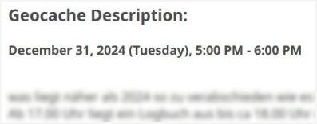
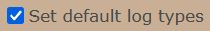
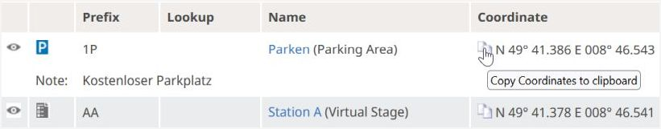
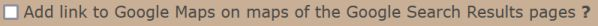
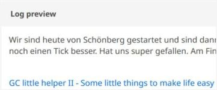
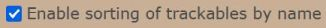
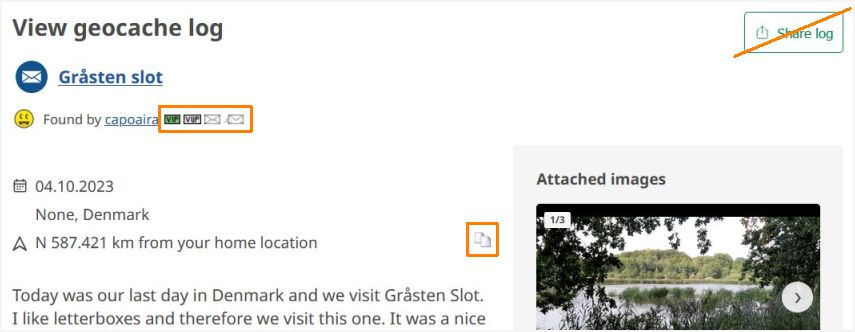
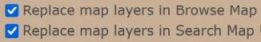

<a href="#v0168" title="GClh II version 0.16.8 (16.04.2025)">v0.16.8</a> &nbsp;
<a href="#v0167" title="GClh II version 0.16.7 (20.03.2025)">v0.16.7</a> &nbsp;
<a href="#v0166" title="GClh II version 0.16.6 (11.03.2025)">v0.16.6</a> &nbsp;
<a href="#v0165" title="GClh II version 0.16.5 (18.02.2025)">v0.16.5</a> &nbsp;
<a href="#v0164" title="GClh II version 0.16.4 (04.02.2025)">v0.16.4</a> &nbsp;
<a href="#v0163" title="GClh II version 0.16.3 (28.01.2025)">v0.16.3</a> &nbsp;
<a href="#v0162" title="GClh II version 0.16.2 (30.08.2024)">v0.16.2</a> &nbsp;
<a href="#v0161" title="GClh II version 0.16.1 (13.08.2024)">v0.16.1</a> &nbsp;
<a href="#v016" title="GClh II version 0.16 (13.08.2024)">v0.16</a> &nbsp;
<a href="#v0159" title="GClh II version 0.15.9 (13.06.2024)">v0.15.9</a> &nbsp;
<a href="#v0158" title="GClh II version 0.15.8 (20.04.2024)">v0.15.8</a> &nbsp;
<a href="#v0157" title="GClh II version 0.15.7 (13.04.2024)">v0.15.7</a> &nbsp;
<a href="#v0156" title="GClh II version 0.15.6 (14.03.2024)">v0.15.6</a> &nbsp;
<a href="#v0155" title="GClh II version 0.15.5 (11.01.2024)">v0.15.5</a> &nbsp;
<a href="#v0154" title="GClh II version 0.15.4 (09.01.2024)">v0.15.4</a> &nbsp;
<a href="#v0153" title="GClh II version 0.15.3 (20.12.2023)">v0.15.3</a> &nbsp;
<a href="#v0152" title="GClh II version 0.15.2 (09.12.2023)">v0.15.2</a> &nbsp;
<a href="#v0151" title="GClh II version 0.15.1 (02.12.2023)">v0.15.1</a> &nbsp;
<a href="#v015" title="GClh II version 0.15 (26.11.2023)">v0.15</a> &nbsp;
<a href="#v0146" title="GClh II version 0.14.6 (22.04.2023)">v0.14.6</a> &nbsp;
<a href="#v0145" title="GClh II version 0.14.5 (12.04.2023)">v0.14.5</a> &nbsp;
<a href="#v0144" title="GClh II version 0.14.4 (28.02.2023)">v0.14.4</a> &nbsp;
<a href="#v0143" title="GClh II version 0.14.3 (25.02.2023)">v0.14.3</a> &nbsp;
<a href="#v0142" title="GClh II version 0.14.2 (14.02.2023)">v0.14.2</a> &nbsp;
<a href="#v0141" title="GClh II version 0.14.1 (27.01.2023)">v0.14.1</a> &nbsp;
<a href="#v014" title="GClh II version 0.14 (17.01.2023)">v0.14</a> &nbsp;
<a href="#v013" title="GClh II version 0.13">v0.13</a> &nbsp;
<a href="#v0121" title="GClh II version 0.12.1 (02.01.2023)">v0.12.1</a> &nbsp;
<a href="#v012" title="GClh II version 0.12 (15.10.2022)">v0.12</a> &nbsp;
<a href="changelog_before.md" title="Go to earlier changelog">Earlier changelog</a> &nbsp;

---
## v0.16.8:
&nbsp; &nbsp;  
<ul>
	<li>
		<strong>Fix:</strong> [Browse Map] Improve buttons with GClh layers and without. [<a href="https://github.com/2Abendsegler/GClh/issues/2773" title="Issue 2773">2773</a> / <a href="https://www.geocaching.com/profile/?u=2Abendsegler" title="Thanks to 2Abendsegler">2Abendsegler</a>] 
	</li>
	<li>
		<strong>Fix:</strong> [Search Map] Move add to list count in new add to list area. [<a href="https://github.com/2Abendsegler/GClh/issues/2774" title="Issue 2774">2774</a> / <a href="https://www.geocaching.com/profile/?u=2Abendsegler" title="Thanks to 2Abendsegler">2Abendsegler</a>] 
	</li>
	<li>
		<strong>Fix:</strong> [Search Map] Move buttons behind user menu. [<a href="https://github.com/2Abendsegler/GClh/issues/2775" title="Issue 2775">2775</a> / <a href="https://www.geocaching.com/profile/?u=2Abendsegler" title="Thanks to 2Abendsegler">2Abendsegler</a>] 
	</li>
	<li>
		<strong>Fix:</strong> [Statistic] Prevent "Finds Per Month" and "Cumulative Finds Per Month" from having different widths. [<a href="https://github.com/2Abendsegler/GClh/issues/2776" title="Issue 2776">2776</a> / <a href="https://www.geocaching.com/profile/?u=2Abendsegler" title="Thanks to 2Abendsegler">2Abendsegler</a>] 
	</li>
	<li>
		<strong>Fix:</strong> [Statistik] Error in statistic map, if statistic is not available. [<a href="https://github.com/2Abendsegler/GClh/issues/2777" title="Issue 2777">2777</a> / <a href="https://www.geocaching.com/profile/?u=2Abendsegler" title="Thanks to 2Abendsegler">2Abendsegler</a>] 
	</li>
	<li>
		<strong>Fix:</strong> [New Dashboard] Remove border in GClh header. [<a href="https://github.com/2Abendsegler/GClh/issues/2778" title="Issue 2778">2778</a> / <a href="https://www.geocaching.com/profile/?u=2Abendsegler" title="Thanks to 2Abendsegler">2Abendsegler</a>] 
	</li>
	<li>
		<strong>Fix:</strong> [Recently Viewed Caches] Alternate color for lines overwrite user owned color. [<a href="https://github.com/2Abendsegler/GClh/issues/2779" title="Issue 2779">2779</a> / <a href="https://www.geocaching.com/profile/?u=2Abendsegler" title="Thanks to 2Abendsegler">2Abendsegler</a>] 
	</li>
	<li>
		<strong>Fix:</strong> [Account Settings] Integrate new page "Experimental Features". [<a href="https://github.com/2Abendsegler/GClh/issues/2780" title="Issue 2780">2780</a> / <a href="https://www.geocaching.com/profile/?u=2Abendsegler" title="Thanks to 2Abendsegler">2Abendsegler</a>] 
	</li>
	<li>
		<strong>Fix:</strong> [Account Settings] Integrate new page "Experimental Features", align menu. [<a href="https://github.com/2Abendsegler/GClh/issues/2781" title="Issue 2781">2781</a> / <a href="https://www.geocaching.com/profile/?u=2Abendsegler" title="Thanks to 2Abendsegler">2Abendsegler</a>] 
	</li>
</ul>
 
(16.04.2025) 
released by <a href="https://www.geocaching.com/profile/?u=2Abendsegler">2Abendsegler</a> 
 

---
## v0.16.7:
&nbsp; &nbsp;  
<ul>
	<li>
		<strong>Fix:</strong> [Treasures] Navigation menu not reachable on new page Treasures. [<a href="https://github.com/2Abendsegler/GClh/issues/2769" title="Issue 2769">2769</a> / <a href="https://www.geocaching.com/profile/?u=2Abendsegler" title="Thanks to 2Abendsegler">2Abendsegler</a>] 
	</li>
	<li>
		<strong>Fix:</strong> [Search Map] Geoservice does not have correct coordinates if you comes from browse map. [<a href="https://github.com/2Abendsegler/GClh/issues/2768" title="Issue 2768">2768</a> / <a href="https://www.geocaching.com/profile/?u=2Abendsegler" title="Thanks to 2Abendsegler">2Abendsegler</a>] 
	</li>
	<li>
		<strong>Fix:</strong> [Search Map] Improve buttons above (Tech migration). [<a href="https://github.com/2Abendsegler/GClh/issues/2767" title="Issue 2767">2767</a> / <a href="https://www.geocaching.com/profile/?u=2Abendsegler" title="Thanks to 2Abendsegler">2Abendsegler</a>] 
	</li>
	<li>
		<strong>Fix:</strong> [Search Map] Build geoservices map feature (Tech migration). [<a href="https://github.com/2Abendsegler/GClh/issues/2765" title="Issue 2765">2765</a> / <a href="https://www.geocaching.com/profile/?u=2Abendsegler" title="Thanks to 2Abendsegler">2Abendsegler</a>] 
	</li>
	<li>
		<strong>Fix:</strong> [Search Map] Button to collapse activity (Tech migration). [<a href="https://github.com/2Abendsegler/GClh/issues/2764" title="Issue 2764">2764</a> / <a href="https://www.geocaching.com/profile/?u=2Abendsegler" title="Thanks to 2Abendsegler">2Abendsegler</a>] 
	</li>
	<li>
		<strong>Fix:</strong> [Search Map] Create "save as Pocket Query" button (Tech migration). [<a href="https://github.com/2Abendsegler/GClh/issues/2759" title="Issue 2759">2759</a> / <a href="https://www.geocaching.com/profile/?u=2Abendsegler" title="Thanks to 2Abendsegler">2Abendsegler</a>] 
	</li>
</ul>
 
(20.03.2025) 
released by <a href="https://www.geocaching.com/profile/?u=2Abendsegler">2Abendsegler</a> 
 

---
## v0.16.6:
&nbsp; &nbsp;  
<ul>
	<li>
		<strong>New:</strong> [Statistic] Make countries and states clickable on own statistic maps. [<a href="https://github.com/2Abendsegler/GClh/issues/2014" title="Issue 2014">2014</a> / <a href="https://www.geocaching.com/profile/?u=2Abendsegler" title="Thanks to 2Abendsegler">2Abendsegler</a> / <a href="https://www.geocaching.com/profile/?u=capoaira" title="Thanks to capoaira">capoaira</a>] 
		<strong>Fix:</strong> [Statistic] Links in own statistic maps for US states and Canadian provinces and territories. [<a href="https://github.com/2Abendsegler/GClh/issues/2728" title="Issue 2728">2728</a> / <a href="https://www.geocaching.com/profile/?u=2Abendsegler" title="Thanks to 2Abendsegler">2Abendsegler</a>] 
		 
		  
	</li>
	<li>
		<strong>New:</strong> [Statistic] Show country and state names on statistic maps when hover with mouse. [<a href="https://github.com/2Abendsegler/GClh/issues/2014" title="Issue 2729">2729</a> / <a href="https://www.geocaching.com/profile/?u=2Abendsegler" title="Thanks to 2Abendsegler">2Abendsegler</a> / <a href="https://www.geocaching.com/profile/?u=capoaira" title="Thanks to capoaira">capoaira</a>] 
		 
		<a href="https://www.geocaching.com/my/#GClhShowConfig#a#settings_map_statistic_set_name_in_map" title="Link to your GClh II Config">Settings ->Public Profile - Statistic: 
		</a>   
	</li>
	<li>
		<strong>Fix:</strong> [Log Form] TB auto visit should not run in edit log mode. [<a href="https://github.com/2Abendsegler/GClh/issues/2741" title="Issue 2741">2741</a> / <a href="https://www.geocaching.com/profile/?u=2Abendsegler" title="Thanks to 2Abendsegler">2Abendsegler</a>] 
	</li>
	<li>
		<strong>Fix:</strong> [Cache Listing] Filtering logs by clicking on the log type totals no longer works if language is not English. [<a href="https://github.com/2Abendsegler/GClh/issues/2748" title="Issue 2748">2748</a> / <a href="https://www.geocaching.com/profile/?u=2Abendsegler" title="Thanks to 2Abendsegler">2Abendsegler</a>] 
	</li>
	<li>
		<strong>Fix:</strong> [Dashbard] Do not cut avatar image in Latest Activity. [<a href="https://github.com/2Abendsegler/GClh/issues/2735" title="Issue 2735">2735</a> / <a href="https://www.geocaching.com/profile/?u=2Abendsegler" title="Thanks to 2Abendsegler">2Abendsegler</a>] 
	</li>
	<li>
		<strong>Fix:</strong> [Config, Sync] Remove bold border of all links when calling from dashboard. [<a href="https://github.com/2Abendsegler/GClh/issues/2736" title="Issue 2736">2736</a> / <a href="https://www.geocaching.com/profile/?u=2Abendsegler" title="Thanks to 2Abendsegler">2Abendsegler</a>] 
	</li>
	<li>
		<strong>Fix:</strong> [Config] Correct changed cacher names in the thanks list. [<a href="https://github.com/2Abendsegler/GClh/issues/2737" title="Issue 2737">2737</a> / <a href="https://www.geocaching.com/profile/?u=2Abendsegler" title="Thanks to 2Abendsegler">2Abendsegler</a>] 
	</li>
	<li>
		<strong>Change:</strong> [Global] Make GClh error in header smaller. [<a href="https://github.com/2Abendsegler/GClh/issues/2733" title="Issue 2733">2733</a> / <a href="https://www.geocaching.com/profile/?u=2Abendsegler" title="Thanks to 2Abendsegler">2Abendsegler</a>] 
	</li>
	<li>
		<strong>Change:</strong> [Documentation] Make changelog smaller. [<a href="https://github.com/2Abendsegler/GClh/issues/2734" title="Issue 2734">2734</a> / <a href="https://www.geocaching.com/profile/?u=2Abendsegler" title="Thanks to 2Abendsegler">2Abendsegler</a>]  
	</li>
</ul>
<strong>Maps:</strong>  
Adjustments to the Search Map as part of the technical migration carried out by the owner and other adjustments in the area of ​​the both maps Search Map and Browse Map.  
<ul>
	<li>
		<strong>Fix:</strong> [Search Map] After go back from cache details to cache list or BML, scroll to last position (Tech migration). [<a href="https://github.com/2Abendsegler/GClh/issues/2726" title="Issue 2726">2726</a> / <a href="https://www.geocaching.com/profile/?u=Die Batzen" title="Thanks to Die Batzen">Die Batzen</a>] 
	</li>
	<li>
		<strong>Fix:</strong> [Search Map] Show hint automatically (Tech migration). [<a href="https://github.com/2Abendsegler/GClh/issues/2730" title="Issue 2730">2730</a> / <a href="https://www.geocaching.com/profile/?u=Die Batzen" title="Thanks to Die Batzen">Die Batzen</a>] 
	</li>
	<li>
		<strong>Fix:</strong> [Search Map] Hide header (Tech migration). [<a href="https://github.com/2Abendsegler/GClh/issues/2740" title="Issue 2740">2740</a> / <a href="https://www.geocaching.com/profile/?u=Die Batzen" title="Thanks to Die Batzen">Die Batzen</a>] 
	</li>
	<li>
		<strong>Fix:</strong> [Search Map] Fix error if default filter and show corrected coords both are active (Tech migration). [<a href="https://github.com/2Abendsegler/GClh/issues/2747" title="Issue 2747">2747</a> / <a href="https://www.geocaching.com/profile/?u=Die Batzen" title="Thanks to Die Batzen">Die Batzen</a>] 
	</li>
	<li>
		<strong>Fix:</strong> [Search Map, Browse Map] Collection of different things (Tech migration). [<a href="https://github.com/2Abendsegler/GClh/issues/2732" title="Issue 2732">2732</a> / <a href="https://www.geocaching.com/profile/?u=2Abendsegler" title="Thanks to 2Abendsegler">2Abendsegler</a>] 
		<ul>
			<li>
				<strong>Fix:</strong> [Search Map] Show additional cache data in cache details (Tech migration). 
			</li>
			<li>
				<strong>Fix:</strong> [Search Map] Add VIP, VUP, Mail to owner in cache details (Tech migration). 
			</li>
			<li>
				<strong>Fix:</strong> [Search Map] F2 keydown in filter screens to apply the settings (Tech migration). 
			</li>
			<li>
				<strong>Fix:</strong> [Search Map] Improve add to list pop up (Tech migration). 
			</li>
		</ul>
		Additional: 
		<ul>
			<li>
				<strong>New:</strong> [Search Map] Add county (Landkreis) to place in enhanced cache data. 
			</li>
			<li>
				<strong>New:</strong> [Search Map] Scroll up to top in description after "Description & Hint" was clicked. 
			</li>
			<li>
				<strong>Fix:</strong> [Browse Map] Number of trackables in cache detail popup only consider 20 trackables. 
			</li>
		</ul>
	</li>
	<li>
		<strong>Fix:</strong> [Search Map] Hide header button should only be displayed when dealing with lists (Tech migration) and show additional cache data on the maps. [<a href="https://github.com/2Abendsegler/GClh/issues/2745" title="Issue 2745">2745</a> / <a href="https://www.geocaching.com/profile/?u=2Abendsegler" title="Thanks to 2Abendsegler">2Abendsegler</a>] 
		Additional: 
		<ul>
			<li>
				<strong>Fix:</strong> [Search Map] Open latest logs and personal cache note slightly late so it doesn't flutter. 
			</li>
			<li>
				<strong>Fix:</strong> [Browse Map] Open latest logs and personal cache note slightly late so it doesn't flutter. 
			</li>
		</ul>
	</li>
	<li>
		<strong>Fix:</strong> [Search Map, Browse Map] Show additional cache data on the maps. [<a href="https://github.com/2Abendsegler/GClh/issues/2749" title="Issue 2749">2749</a> / <a href="https://www.geocaching.com/profile/?u=2Abendsegler" title="Thanks to 2Abendsegler">2Abendsegler</a>] 
		<ul>
			<li>
				<strong>Fix:</strong> [Search Map, Browse Map] Open latest logs and personal cache note slightly late so it doesn't flutter. 
			</li>
			<li>
				<strong>Fix:</strong> [Search Map, Browse Map] Put favorite percentage, elevation and place further to the right in the line so that the entire line content is not moved as soon as the data has been determined. 
			</li>
			<li>
				<strong>Fix:</strong> Fix [Search Map] Elevation in enhancement block is wrong if cache changed between determination of elevation. 
			</li>
		</ul>
	</li>
	<li>
		<strong>Fix:</strong> [Browse Map] Improve position and width of the latest logs and the personal cache note when hovering with the mouse. [<a href="https://github.com/2Abendsegler/GClh/issues/2750" title="Issue 2750">2750</a> / <a href="https://www.geocaching.com/profile/?u=2Abendsegler" title="Thanks to 2Abendsegler">2Abendsegler</a>] 
	</li>
</ul>
 
(11.03.2025) 
released by <a href="https://www.geocaching.com/profile/?u=2Abendsegler">2Abendsegler</a> 
 

---
## v0.16.5:
&nbsp; &nbsp;  
<ul>
	<li>
		<strong>Fix:</strong> [Search Map] Enable preserve a specified URL zoom parameter on page load (Tech migration). [<a href="https://github.com/2Abendsegler/GClh/issues/2707" title="Issue 2707">2707</a> / <a href="https://www.geocaching.com/profile/?u=Die Batzen" title="Thanks to Die Batzen">Die Batzen</a>] 
	</li>
	<li>
		<strong>Fix:</strong> [New Dashboard] Adjustments and removes because of the last update of the website. [<a href="https://github.com/2Abendsegler/GClh/issues/2721" title="Issue 2721">2721</a> / <a href="https://www.geocaching.com/profile/?u=2Abendsegler" title="Thanks to 2Abendsegler">2Abendsegler</a>] 
		Adjustments: 
		<ul>
			<li>
				Set real edit link in logs in area Latest Activity 
			</li>
			<li>
				Copy to clipboard button for log text in Latest Activity list 
			</li>
			<li>
				Build log texts in Markdown 
			</li>
			<li>
				Hide TB Activity 
			</li>
			<li>
				Show unpublished hides 
			</li>
			<li>
				Links to GClh config, sync and changelog 
			</li>
			<li>
				Compact layout 
			</li>
			<li>
				Map and Search button in left sidebar 
			</li>
			<li>
				Remove border in menu 
			</li>
		</ul>
		Removes: 
		<ul>
			<li>
				Show/Hide nearby events. It is now available on the standard website. 
			</li>
			<li>
				Show cache/TB type in front of log type in Latest Activity list. It is now available in a similar form on the standard website. 
			</li>
		</ul>
	</li>
	<li>
		<strong>Fix:</strong> [Cache Listing] Clicking on log type totals at the top of the listing does not work. [<a href="https://github.com/2Abendsegler/GClh/issues/2719" title="Issue 2719">2719</a> / <a href="https://www.geocaching.com/profile/?u=2Abendsegler" title="Thanks to 2Abendsegler">2Abendsegler</a>] 
	</li>
	<li>
		<strong>Fix:</strong> [Cache Listing] Icons in VIP list are moved by click. [<a href="https://github.com/2Abendsegler/GClh/issues/2720" title="Issue 2720">2720</a> / <a href="https://www.geocaching.com/profile/?u=2Abendsegler" title="Thanks to 2Abendsegler">2Abendsegler</a>] 
	</li>
</ul>
 
(18.02.2025) 
released by <a href="https://www.geocaching.com/profile/?u=2Abendsegler">2Abendsegler</a> 
 

---
## v0.16.4:
&nbsp; &nbsp;  
<ul>
	<li>
		<strong>New:</strong> [Cache Listing, Maps] Add county (Landkreis) to cache location. [<a href="https://github.com/2Abendsegler/GClh/issues/2419" title="Issue 2419">2419</a> / <a href="https://www.geocaching.com/profile/?u=2Abendsegler" title="Thanks to 2Abendsegler">2Abendsegler</a> / <a href="https://www.geocaching.com/profile/?u=capoaira" title="Thanks to capoaira">capoaira</a>]  
		With this option, the county is added to the location of the cache if the cache location is in Germany or Austria. If you hover with your mouse over the field, the full address will be displayed. 
		The data comes from OpenStreetMap. They are not always completely accurate, which is why the parameter is deactivated by default. Other countries work with different data structures and the quality of the data does not always seem sufficient, which is why we have decided to only provide the named countries for this feature.  
		<strong>Listing:</strong> 
		 
		<a href="https://www.geocaching.com/my/#GClhShowConfig#a#settings_listing_add_county_to_place" title="Link to your GClh II Config">Settings -> Listing - Location: 
		</a> 
		If you want to use this feature in cache listing, you have to activate it.  
		<strong>Maps:</strong> 
		 
		<a href="https://www.geocaching.com/my/#GClhShowConfig#a#settings_maps_add_county_to_place" title="Link to your GClh II Config">Settings -> Map - Enhanced Cache Data: 
		</a> 
		If you want to use this feature in a map, you have to activate it.   
	</li>
	<li>
		<strong>Fix:</strong> [Statistic] Error in Statistics - resize find charts does not work. [<a href="https://github.com/2Abendsegler/GClh/issues/2700" title="Issue 2700">2700</a> / <a href="https://www.geocaching.com/profile/?u=Die Batzen" title="Thanks to Die Batzen">Die Batzen</a>] 
	</li>
	<li>
		<strong>Fix:</strong> [Maps] Repair stamen map layers watercolor, toner and terrain. [<a href="https://github.com/2Abendsegler/GClh/issues/2702" title="Issue 2702">2702</a> / <a href="https://www.geocaching.com/profile/?u=2Abendsegler" title="Thanks to 2Abendsegler">2Abendsegler</a>] 
	</li>
	<li>
		<strong>Fix:</strong> [Cache Listing] Event Time wrong on different time zones. [<a href="https://github.com/2Abendsegler/GClh/issues/2709" title="Issue 2709">2709</a> / <a href="https://www.geocaching.com/profile/?u=2Abendsegler" title="Thanks to 2Abendsegler">2Abendsegler</a> / <a href="https://www.geocaching.com/profile/?u=capoaira" title="Thanks to capoaira">capoaira</a>] 
	</li>
	<li>
		<strong>Fix:</strong> [Search Map] Set Link to Owner (Tech migration). [<a href="https://github.com/2Abendsegler/GClh/issues/2712" title="Issue 2712">2712</a> / <a href="https://www.geocaching.com/profile/?u=capoaira" title="Thanks to capoaira">capoaira</a>] 
	</li>
</ul>
 
(04.02.2025) 
released by <a href="https://www.geocaching.com/profile/?u=2Abendsegler">2Abendsegler</a> 
 

---
## v0.16.3:
&nbsp; &nbsp;  
<ul>
	<li>
		<strong>Note:</strong> [FAQ] 3. The GClh doesn't start. 
		For chrome-based browsers such as Google Chrome, Microsoft Edge, Opera, Vivaldi... for some time now, developer mode has had to be activated in the browser in order to be able to run user scripts. How to activate developer mode in the browser is described in the <a href="https://www.tampermonkey.net/faq.php#Q209" title="Link to FAQ from Tampermonkey">FAQ from Tampermonkey</a>.  
	</li>
	<li>
		<strong>Note:</strong> [FAQ] 10. What can I do if individual features don't work or don't always work? 
		If the "GeocachingUtils" add-on is installed, the logs are not always displayed in the listing. Changes are made in the add-on that no longer allow GClh to display the logs. We are not planning to make any adjustments to fix the problem.   
	</li>
	<li>
		<strong>New:</strong> [Statistic] Own scale of graphical monthly found statistics. [<a href="https://github.com/2Abendsegler/GClh/issues/2662" title="Issue 2662">2662</a> / <a href="https://www.geocaching.com/profile/?u=Die Batzen" title="Thanks to Die Batzen">Die Batzen</a>] 
		   
	</li>
	<li>
		<strong>New:</strong> [Log Form] Added placeholder cache type to signature and log templates. [<a href="https://github.com/2Abendsegler/GClh/issues/2687" title="Issue 2687">2687</a> / <a href="https://www.geocaching.com/profile/?u=bruzie" title="Thanks to bruzie">bruzie</a>] 
		The new placeholder GCType (geocaching type) is now available for the cache signature and the log templates. 
		   
	</li>
	<li>
		<strong>New:</strong> [Event Listing] Add event start and end time back to description. [<a href="https://github.com/2Abendsegler/GClh/issues/2664" title="Issue 2664">2664</a> / <a href="https://www.geocaching.com/profile/?u=2Abendsegler" title="Thanks to 2Abendsegler">2Abendsegler</a>] 
		 
		<a href="https://www.geocaching.com/my/#GClhShowConfig#a#settings_show_eventinfo_in_desc" title="Link to your GClh II Config">Settings -> Listing - Cache Description: 
		</a>   
	</li>
	<li>
		<strong>New:</strong> [Log Form] Control of setting of all default log types. [<a href="https://github.com/2Abendsegler/GClh/issues/2673" title="Issue 2673">2673</a> / <a href="https://www.geocaching.com/profile/?u=2Abendsegler" title="Thanks to 2Abendsegler">2Abendsegler</a>] 
		<a href="https://www.geocaching.com/my/#GClhShowConfig#a#settings_default_logtype_control" title="Link to your GClh II Config">Settings -> Log: 
		</a>   
	</li>
	<li>
		<strong>Fix:</strong> [Search Map] The GClh features are no longer available (Tech migration). [<a href="https://github.com/2Abendsegler/GClh/issues/2661" title="Issue 2661">2661</a> / <a href="https://www.geocaching.com/profile/?u=Die Batzen" title="Thanks to Die Batzen">Die Batzen</a>] 
		Fixed issues: 
		<ul>
			<li>
				Map layer selection. 
			</li>
			<li>
				Default filters. 
			</li>
			<li>
				Relocate browse map button. 
			</li>
			<li>
				Hide sidebar. 
			</li>
			<li>
				Display found caches at corrected coordinates.  
			</li>
		</ul>
	</li>
	<li>
		<strong>Fix:</strong> [Friend List] "Reset Counter" button is missing after changing "Send Invitation" button. [<a href="https://github.com/2Abendsegler/GClh/issues/2666" title="Issue 2666">2666</a> / <a href="https://www.geocaching.com/profile/?u=2Abendsegler" title="Thanks to 2Abendsegler">2Abendsegler</a>] 
	</li>
	<li>
		<strong>Fix:</strong> [Cache Listing] The log totals icons at the top are missing and above the logs the log totals icons are displayed incorrectly. [<a href="https://github.com/2Abendsegler/GClh/issues/2693" title="Issue 2693">2693</a> / <a href="https://www.geocaching.com/profile/?u=2Abendsegler" title="Thanks to 2Abendsegler">2Abendsegler</a>] 
	</li>
	<li>
		<strong>Fix:</strong> [Browse Map] The log totals icons are displayed incorrectly in the detailed cache information. [<a href="https://github.com/2Abendsegler/GClh/issues/2694" title="Issue 2694">2694</a> / <a href="https://www.geocaching.com/profile/?u=2Abendsegler" title="Thanks to 2Abendsegler">2Abendsegler</a>] 
	</li>
	<li>
		<strong>Fix:</strong> [TB Listing] The serial name has no longer been displayed for a travel bug or geocoin. [<a href="https://github.com/2Abendsegler/GClh/issues/2678" title="Issue 2678">2678</a> / <a href="https://www.geocaching.com/profile/?u=2Abendsegler" title="Thanks to 2Abendsegler">2Abendsegler</a>] 
	</li>
	<li>
		<strong>Fix:</strong> [Log Form] Double TB log actions. [<a href="https://github.com/2Abendsegler/GClh/issues/2659" title="Issue 2659">2659</a> / <a href="https://www.geocaching.com/profile/?u=2Abendsegler" title="Thanks to 2Abendsegler">2Abendsegler</a>] 
	</li>
	<li>
		<strong>Fix:</strong> [Log Form] Enlarge the date field so that everything is visible also in trackable logs. [<a href="https://github.com/2Abendsegler/GClh/issues/2655" title="Issue 2655">2655</a> / <a href="https://www.geocaching.com/profile/?u=2Abendsegler" title="Thanks to 2Abendsegler">2Abendsegler</a>] 
	</li>
	<li>
		<strong>Fix:</strong> [Edit Log] Larger page width no longer works if calling edit log from log view. [<a href="https://github.com/2Abendsegler/GClh/issues/2658" title="Issue 2658">2658</a> / <a href="https://www.geocaching.com/profile/?u=2Abendsegler" title="Thanks to 2Abendsegler">2Abendsegler</a>] 
	</li>
	<li>
		<strong>Fix:</strong> [View Log] Hide "Share log" button is not working. [<a href="https://github.com/2Abendsegler/GClh/issues/2674" title="Issue 2674">2674</a> / <a href="https://www.geocaching.com/profile/?u=2Abendsegler" title="Thanks to 2Abendsegler">2Abendsegler</a>] 
	</li>
	<li>
		<strong>Fix:</strong> [Souvenirs] Türkiye is not recognized as a country in the souvenirs. [<a href="https://github.com/2Abendsegler/GClh/issues/2668" title="Issue 2668">2668</a> / <a href="https://www.geocaching.com/profile/?u=2Abendsegler" title="Thanks to 2Abendsegler">2Abendsegler</a>] 
	</li>
	<li>
		<strong>Fix:</strong> [Dashboard] Favorites icon almost completely disappears behind the found icon. [<a href="https://github.com/2Abendsegler/GClh/issues/2681" title="Issue 2681">2681</a> / <a href="https://www.geocaching.com/profile/?u=2Abendsegler" title="Thanks to 2Abendsegler">2Abendsegler</a>] 
	</li>
	<li>
		<strong>Fix:</strong> [Header] Same width of header search field in all browsers. [<a href="https://github.com/2Abendsegler/GClh/issues/2675" title="Issue 2675">2675</a> / <a href="https://www.geocaching.com/profile/?u=2Abendsegler" title="Thanks to 2Abendsegler">2Abendsegler</a>] 
	</li>
</ul>
 
(28.01.2025) 
released by <a href="https://www.geocaching.com/profile/?u=2Abendsegler">2Abendsegler</a> 
 

---
## v0.16.2:
&nbsp; &nbsp;  
<ul>
	<li>
		<strong>New:</strong> [Cache Listing] New button to "Copy Coordinates to Clipboard" for every waypoint. [<a href="https://github.com/2Abendsegler/GClh/issues/2650" title="Issue 2650">2650</a> / <a href="https://www.geocaching.com/profile/?u=2Abendsegler" title="Thanks to 2Abendsegler">2Abendsegler</a>] 
		 
		<a href="https://www.geocaching.com/my/#GClhShowConfig#a#settings_listing_ctoc_coords_waypoints" title="Link to your GClh II Config">Settings -> Listing - Additional Waypoints: 
		</a>  
	</li>
	<li>
		<strong>Note:</strong> [Google Chrome, Tampermonkey] Scripts do not start. 
		If scripts no longer start in browser Google Chrome with script manager Tampermonkey, then this could be due to a bug in Tampermonkey. Please install the latest version of Tampermonkey.  
	</li>
	<li>
		<strong>Fix:</strong> [Statistic] Country links to caches you have found do not work. [<a href="https://github.com/2Abendsegler/GClh/issues/2648" title="Issue 2648">2648</a> / <a href="https://www.geocaching.com/profile/?u=2Abendsegler" title="Thanks to 2Abendsegler">2Abendsegler</a>] 
	</li>
	<li>
		<strong>Fix:</strong> [Search] Alignment of search buttons on filters incorrect. [<a href="https://github.com/2Abendsegler/GClh/issues/2647" title="Issue 2647">2647</a> / <a href="https://www.geocaching.com/profile/?u=2Abendsegler" title="Thanks to 2Abendsegler">2Abendsegler</a>] 
	</li>
</ul>
 
(30.08.2024) 
released by <a href="https://www.geocaching.com/profile/?u=2Abendsegler">2Abendsegler</a> 
 

---
## v0.16.1:
&nbsp; &nbsp;  
<ul>
	<li>
		<strong>Fix:</strong> [Cache Listing] Error message: Create Character Counter for Personal Cache Note: $(...).html() is null. [<a href="https://github.com/2Abendsegler/GClh/issues/2638" title="Issue 2638">2638</a> / <a href="https://www.geocaching.com/profile/?u=2Abendsegler" title="Thanks to 2Abendsegler">2Abendsegler</a>] 
	</li>
</ul>
 
(13.08.2024) 
released by <a href="https://www.geocaching.com/profile/?u=2Abendsegler">2Abendsegler</a> 
 

---
## v0.16:
&nbsp; &nbsp;  
<ul>
	<li>
		<strong>New:</strong> [Cache Listing] Show number of characters in the Personal Cache Note. [<a href="https://github.com/2Abendsegler/GClh/issues/2560" title="Issue 2560">2560</a> / <a href="https://www.geocaching.com/profile/?u=capoaira" title="Thanks to capoaira">capoaira</a>] 
		The number of characters and words is displayed for the text in the Personal Cache Note. 
		  
	</li>
	<li>
		<strong>New:</strong> [Cache Listing] Show bigger avatar image in cache listing log. [<a href="https://github.com/2Abendsegler/GClh/issues/2559" title="Issue 2559">2559</a> / <a href="https://www.geocaching.com/profile/?u=2Abendsegler" title="Thanks to 2Abendsegler">2Abendsegler</a>] 
		 
		<a href="https://www.geocaching.com/my/#GClhShowConfig#a#settings_listing_bigger_avatar_with_mouse" title="Link to your GClh II Config">Settings -> Listing - Logs: 
		</a>  
	</li>
	<li>
		<strong>New:</strong> [Log Form, Log View] Link to Drafts page is missing (after sending a draft related log, automatic view log). [<a href="https://github.com/2Abendsegler/GClh/issues/2488" title="Issue 2488">2488</a> / <a href="https://www.geocaching.com/profile/?u=2Abendsegler" title="Thanks to 2Abendsegler">2Abendsegler</a>] 
		 
		<a href="https://www.geocaching.com/my/#GClhShowConfig#a#settings_drafts_after_new_logging_view_log_button" title="Link to your GClh II Config">Settings -> Log: 
		</a>  
	</li>
	<li>
		<strong>New:</strong> [Log Edit, Log View] After edit a log, go back to log view. [<a href="https://github.com/2Abendsegler/GClh/issues/2490" title="Issue 2490">2490</a> / <a href="https://www.geocaching.com/profile/?u=2Abendsegler" title="Thanks to 2Abendsegler">2Abendsegler</a>] 
		<a href="https://www.geocaching.com/my/#GClhShowConfig#a#settings_after_new_logging_view_log" title="Link to your GClh II Config">Settings -> Log: 
		</a> 
		This parameter is not new. If the parameter is enabled, the log will be displayed after editing a cache log, just like after a new log.  
	</li>
	<li>
		<strong>New:</strong> [Mail and Message Form] Placeholder for GC-Code without brackets. [<a href="https://github.com/2Abendsegler/GClh/issues/2617" title="Issue 2617">2617</a> / <a href="https://www.geocaching.com/profile/?u=2Abendsegler" title="Thanks to 2Abendsegler">2Abendsegler</a>] 
		<a href="https://www.geocaching.com/my/#GClhShowConfig#a#settings_mail_signature" title="Link to your GClh II Config">Settings -> Mail and Message Form: 
		</a> 
		This parameter is not new, only the placeholder is new.  
	</li>
	<li>
		<strong>New:</strong> [Global] Enlarge navigation field in header so that GC codes are visible. [<a href="https://github.com/2Abendsegler/GClh/issues/2628" title="Issue 2628">2628</a> / <a href="https://www.geocaching.com/profile/?u=2Abendsegler" title="Thanks to 2Abendsegler">2Abendsegler</a>]  
	</li>
	<li>
		<strong>Fix:</strong> [Google Maps] Google Maps not being linked from Google Search Results pages. [<a href="https://github.com/2Abendsegler/GClh/issues/2626" title="Issue 2626">2626</a> / <a href="https://www.geocaching.com/profile/?u=2Abendsegler" title="Thanks to 2Abendsegler">2Abendsegler</a>] 
	</li>
	<li>
		<strong>Fix:</strong> [Log Form] Additional cache info in log form are missing. [<a href="https://github.com/2Abendsegler/GClh/issues/2633" title="Issue 2633">2633</a> / <a href="https://www.geocaching.com/profile/?u=2Abendsegler" title="Thanks to 2Abendsegler">2Abendsegler</a>] 
	</li>
	<li>
		<strong>Fix:</strong> [Log Form] Log template "Last Cache-Log" inserts old Log instead of last one. [<a href="https://github.com/2Abendsegler/GClh/issues/2542" title="Issue 2542">2542</a> / <a href="https://www.geocaching.com/profile/?u=2Abendsegler" title="Thanks to 2Abendsegler">2Abendsegler</a>] 
	</li>
	<li>
		<strong>Fix:</strong> [Log Form] Larger page width no longer works. [<a href="https://github.com/2Abendsegler/GClh/issues/2623" title="Issue 2623">2623</a> / <a href="https://www.geocaching.com/profile/?u=2Abendsegler" title="Thanks to 2Abendsegler">2Abendsegler</a>] 
	</li>
	<li>
		<strong>Fix:</strong> [Public Profile] Old cache type links no longer works. [<a href="https://github.com/2Abendsegler/GClh/issues/2618" title="Issue 2618">2618</a> / <a href="https://www.geocaching.com/profile/?u=capoaira" title="Thanks to capoaira">capoaira</a>] 
	</li>
	<li>
		<strong>Fix:</strong> [Cache Listing] Select log types in listing not working for some types. [<a href="https://github.com/2Abendsegler/GClh/issues/2620" title="Issue 2620">2620</a> / <a href="https://www.geocaching.com/profile/?u=2Abendsegler" title="Thanks to 2Abendsegler">2Abendsegler</a>] 
	</li>
	<li>
		<strong>Fix:</strong> [Search Map] Link in cache details for caches with cache type "Geocaching HQ Block Party" missing. [<a href="https://github.com/2Abendsegler/GClh/issues/2619" title="Issue 2619">2619</a> / <a href="https://www.geocaching.com/profile/?u=capoaira" title="Thanks to capoaira">capoaira</a>] 
	</li>
	<li>
		<strong>Fix:</strong> [Search Map] Separate "Placed by" and Owner by space in cache details. [<a href="https://github.com/2Abendsegler/GClh/issues/2629" title="Issue 2629">2629</a> / <a href="https://www.geocaching.com/profile/?u=2Abendsegler" title="Thanks to 2Abendsegler">2Abendsegler</a>] 
	</li>
	<li>
		<strong>Fix:</strong> [Edit Cache Listing] F2 to save and preview the edited cache listing no longer works. [<a href="https://github.com/2Abendsegler/GClh/issues/2624" title="Issue 2624">2624</a> / <a href="https://www.geocaching.com/profile/?u=2Abendsegler" title="Thanks to 2Abendsegler">2Abendsegler</a>] 
	</li>
</ul>
 
(13.08.2024) 
released by <a href="https://www.geocaching.com/profile/?u=2Abendsegler">2Abendsegler</a> 
 

---
## v0.15.9:
&nbsp; &nbsp;  
<ul>
	<li>
		<strong>Fix:</strong> [Cache Listing] Compact layout in "Add to list" pop up no longer works. [<a href="https://github.com/2Abendsegler/GClh/issues/2609" title="Issue 2609">2609</a> / <a href="https://www.geocaching.com/profile/?u=2Abendsegler" title="Thanks to 2Abendsegler">2Abendsegler</a>] 
	</li>
	<li>
		<strong>Fix:</strong> [Cache Listing] "Ignore" feature no longer works properly. [<a href="https://github.com/2Abendsegler/GClh/issues/2608" title="Issue 2608">2608</a> / <a href="https://www.geocaching.com/profile/?u=2Abendsegler" title="Thanks to 2Abendsegler">2Abendsegler</a>] 
	</li>
	<li>
		<strong>Fix:</strong> [Cache Listing] Listing no longer centered and in intended area. [<a href="https://github.com/2Abendsegler/GClh/issues/2603" title="Issue 2603">2603</a> / <a href="https://www.geocaching.com/profile/?u=2Abendsegler" title="Thanks to 2Abendsegler">2Abendsegler</a>] 
	</li>
	<li>
		<strong>Fix:</strong> [Cache Listing] Alignment of the icons in the VIP boxes is incorrect. [<a href="https://github.com/2Abendsegler/GClh/issues/2605" title="Issue 2605">2605</a> / <a href="https://www.geocaching.com/profile/?u=2Abendsegler" title="Thanks to 2Abendsegler">2Abendsegler</a>] 
	</li>
	<li>
		<strong>Fix:</strong> [PQ-Splitter] The country specification "United States" can not be specified on the PQ page. [<a href="https://github.com/2Abendsegler/GClh/issues/2607" title="Issue 2607">2607</a> / <a href="https://www.geocaching.com/profile/?u=2Abendsegler" title="Thanks to 2Abendsegler">2Abendsegler</a>] 
	</li>
	<li>
		<strong>Fix:</strong> [Maps] Map layer "Thunderforest OpenCycleMap" stopped working. [<a href="https://github.com/2Abendsegler/GClh/issues/2606" title="Issue 2606">2606</a> / <a href="https://www.geocaching.com/profile/?u=2Abendsegler" title="Thanks to 2Abendsegler">2Abendsegler</a>] 
	</li>
</ul>
 
(13.06.2024) 
released by <a href="https://www.geocaching.com/profile/?u=2Abendsegler">2Abendsegler</a> 
 

---
## v0.15.8:
&nbsp; &nbsp;  
<ul>
	<li>
		<strong>Note:</strong> [Firefox, Tampermonkey] Blank screen after script update via Tampermonkey in Firefox browser.  
		After an update of the GClh or another script, some Firefox installations result in a blank screen. The problem is probably caused by an older version of the Tampermonkey script manager. Please upgrade the Tampermonkey add-on via Firefox. We do not know whether other script managers are also affected.   
	</li>
	<li>
		<strong>New:</strong> [Google Maps] Google Maps not being linked from Google Search Results pages. [<a href="https://github.com/2Abendsegler/GClh/issues/2597" title="Issue 2597">2597</a> / <a href="https://www.geocaching.com/profile/?u=2Abendsegler" title="Thanks to 2Abendsegler">2Abendsegler</a>]  
		Since March 2024 Google Maps not being linked from Google Search Results pages in the European Union. With this option some of these links to Google Maps will be restored, so that the links to GC Maps on Google Maps can be used again. In particular, the links and buttons on the maps on the Google Search Results pages have been restored, so that the maps are clickable again.  
		It is only relevant for the Member States of the European Union (EU) and for the Member States in the Europäischen Wirtschaftsraum (EWS) respectively for the Google Search Results pages with their top level domains. You can find details on Googles support page <a href="https://support.google.com/websearch/thread/261655134">here</a>.  
		If you want to get back all the links to Google Maps, then the add-on "Google Search Maps Button" might interest you. You should only use one of the two, the add-on or our new feature. In any case, we were inspired by the add-on to make our adjustments. Thanks to the developer.  
		<a href="https://github.com/2Abendsegler/GClh/issues/2597#issuecomment-2060285124">Here</a> you will find some examples of what we have restored.  
		<a href="https://www.geocaching.com/my/#GClhShowConfig#a#settings_add_links_google_maps_on_google_search" title="Link to your GClh II Config">Settings -> Map - Google Maps Page: 
		</a> 
		If you want to use this feature, you have to activate it.   
	</li>
	<li>
		<strong>Fix:</strong> [Google Maps] GC Map Icons overlap unpleasant with Google Maps elements. [<a href="https://github.com/2Abendsegler/GClh/issues/2596" title="Issue 2596">2596</a> / <a href="https://www.geocaching.com/profile/?u=2Abendsegler" title="Thanks to 2Abendsegler">2Abendsegler</a>] 
	</li>
	<li>
		<strong>Fix:</strong> [Cache Listing, Browse Map, Search Map] Number of bookmark lists in which a cache is contained are no longer displayed with "Add to List". [<a href="https://github.com/2Abendsegler/GClh/issues/2594" title="Issue 2594">2594</a> / <a href="https://www.geocaching.com/profile/?u=2Abendsegler" title="Thanks to 2Abendsegler">2Abendsegler</a>] 
	</li>
	<li>
		<strong>Fix:</strong> [Leaderboard] Hide social sharing via Facebook, X doesn't work. [<a href="https://github.com/2Abendsegler/GClh/issues/2591" title="Issue 2591">2591</a> / <a href="https://www.geocaching.com/profile/?u=2Abendsegler" title="Thanks to 2Abendsegler">2Abendsegler</a>] 
	</li>
</ul>
 
(20.04.2024) 
released by <a href="https://www.geocaching.com/profile/?u=2Abendsegler">2Abendsegler</a> 
 

---
## v0.15.7:
&nbsp; &nbsp;  
<ul>
	<li>
		<strong>New:</strong> [Log Form] Enlarge width of log form. [<a href="https://github.com/2Abendsegler/GClh/issues/2565" title="Issue 2565">2565</a> / <a href="https://www.geocaching.com/profile/?u=2Abendsegler" title="Thanks to 2Abendsegler">2Abendsegler</a>]  
		The "Page width" parameter can be used to set the width of the geocaching pages. This is not a new parameter. New is only, that this width is now also used for the narrow log form page. 
		<a href="https://www.geocaching.com/my/#GClhShowConfig#a#settings_new_width" title="Link to your GClh II Config">Settings -> Global: 
		</a>  
		If you don't want that, you can deactivate the page width for the log form page with the new parameter. 
		<a href="https://www.geocaching.com/my/#GClhShowConfig#a#settings_larger_content_width_log_form" title="Link to your GClh II Config">Settings -> Log: 
		</a>  
		Before / Larger page width: 
		    
	</li>
	<li>
		<strong>New:</strong> [Log Form] Less space between log lines. [<a href="https://github.com/2Abendsegler/GClh/issues/2581" title="Issue 2581">2581</a> / <a href="https://www.geocaching.com/profile/?u=2Abendsegler" title="Thanks to 2Abendsegler">2Abendsegler</a>]  
		This feature reduces the space between the lines of a log. In addition, the differences between the log text and the log preview are reduced. 
		<a href="https://www.geocaching.com/my/#GClhShowConfig#a#settings_less_space_log_lines_log_form" title="Link to your GClh II Config">Settings -> Log: 
		</a>  
		Log text: Before / Less space between the lines of a log 
		   
		Log preview: Before / Less space between the lines of a log 
		    
	</li>
	<li>
		<strong>Fix:</strong> [Friends] Reset button doesn't work. [<a href="https://github.com/2Abendsegler/GClh/issues/2575" title="Issue 2575">2575</a> / <a href="https://www.geocaching.com/profile/?u=2Abendsegler" title="Thanks to 2Abendsegler">2Abendsegler</a>] 
	</li>
	<li>
		<strong>Fix:</strong> [Public Profile] For the hide caches in own profile, the finds and not the hides are linked. [<a href="https://github.com/2Abendsegler/GClh/issues/2577" title="Issue 2577">2577</a> / <a href="https://www.geocaching.com/profile/?u=2Abendsegler" title="Thanks to 2Abendsegler">2Abendsegler</a>] 
	</li>
	<li>
		<strong>Fix:</strong> [Global] Upgrade button for basic member is not aligned. [<a href="https://github.com/2Abendsegler/GClh/issues/2584" title="Issue 2584">2584</a> / <a href="https://www.geocaching.com/profile/?u=2Abendsegler" title="Thanks to 2Abendsegler">2Abendsegler</a>] 
	</li>
	<li>
		<strong>Fix:</strong> [Search] Submenu is no longer aligned correctly (Tech migration). [<a href="https://github.com/2Abendsegler/GClh/issues/2585" title="Issue 2585">2585</a> / <a href="https://www.geocaching.com/profile/?u=2Abendsegler" title="Thanks to 2Abendsegler">2Abendsegler</a>] 
	</li>
	<li>
		<strong>Fix:</strong> [Cache Listing] Adapt the height of the "personal cache note edit field" doesn't always work. [<a href="https://github.com/2Abendsegler/GClh/issues/2586" title="Issue 2586">2586</a> / <a href="https://www.geocaching.com/profile/?u=2Abendsegler" title="Thanks to 2Abendsegler">2Abendsegler</a>] 
	</li>
</ul>
 
(13.04.2024) 
released by <a href="https://www.geocaching.com/profile/?u=2Abendsegler">2Abendsegler</a> 
 

---
## v0.15.6:
&nbsp; &nbsp;  
<ul>
	<li>
		<strong>Info:</strong> GClh features are no longer available on some pages (Tech migration).  
		With the <a href="https://forums.geocaching.com/GC/index.php?/topic/397274-release-notes-website-tech-migrations-february-26-2024/" title="link to the release notes of February 26, 2024">release notes of February 26, 2024</a> , GS announced that it would be carrying out a technical migration for some websites. Unfortunately, these adjustments mean that almost no GClh features are available on the pages anymore. Unfortunately, the adjustments required for the GClh are very large.  
		We took a look at it for the My Lists pages. Almost every line in the coding has to be revised. This pages alone will take us many days. It will probably become particularly problematic soon after the technical migration of the Search Map.  
		We don't know when we'll be able to rework the entire pages, sorry.  
		The following pages are currently affected: 
		<ul>
			<li>
				Cache owner dashboard 
			</li>
			<li>
				Hide a Cache (effects not yet checked) 
			</li>
			<li>
				My Lists, Bookmark Lists ... (List Hub, List Details)  
			</li>
		</ul>
		More pages are planned in the next few weeks: 
		<ul>
			<li>
				Search page 
			</li>
			<li>
				Search Map   
			</li>
		</ul>
	</li>
	<li>
		<strong>Fix:</strong> [Log Form] Default logtype overrides logtype from URL. [<a href="https://github.com/2Abendsegler/GClh/issues/2555" title="Issue 2555">2555</a> / <a href="https://www.geocaching.com/profile/?u=2Abendsegler" title="Thanks to 2Abendsegler">2Abendsegler</a>] 
	</li>
	<li>
		<strong>Fix:</strong> [Log Form] Autovisits are not set if log type "Found it" is set by default. [<a href="https://github.com/2Abendsegler/GClh/issues/2561" title="Issue 2561">2561</a> / <a href="https://www.geocaching.com/profile/?u=2Abendsegler" title="Thanks to 2Abendsegler">2Abendsegler</a>] 
	</li>
	<li>
		<strong>Fix:</strong> [Cache Listing] In the logs the old description "Needs archived" is used instead of "Reviewer attention requested". [<a href="https://github.com/2Abendsegler/GClh/issues/2556" title="Issue 2556">2556</a> / <a href="https://www.geocaching.com/profile/?u=2Abendsegler" title="Thanks to 2Abendsegler">2Abendsegler</a>] 
	</li>
	<li>
		<strong>Fix:</strong> [Cache Listing / Search Map / Browse Map] Geoname elevation errors are no longer displayed in the page header. [<a href="https://github.com/2Abendsegler/GClh/issues/2569" title="Issue 2569">2569</a> / <a href="https://www.geocaching.com/profile/?u=2Abendsegler" title="Thanks to 2Abendsegler">2Abendsegler</a>]  
	</li>
</ul>
 
(14.03.2024) 
released by <a href="https://www.geocaching.com/profile/?u=2Abendsegler">2Abendsegler</a> 
 

---
## v0.15.5:
&nbsp; &nbsp;  
<ul>
	<li>
		<strong>Fix:</strong> [Log Form] Default logtypes run into error: can't convert null to object. [<a href="https://github.com/2Abendsegler/GClh/issues/2549" title="Issue 2549">2549</a> / <a href="https://www.geocaching.com/profile/?u=Die Batzen" title="Thanks to Die Batzen">Die Batzen</a>]  
	</li>
</ul>
 
(12.01.2024) 
released by <a href="https://www.geocaching.com/profile/?u=2Abendsegler">2Abendsegler</a> 
 

---
## v0.15.4:
&nbsp; &nbsp;  
<ul>
	<li>
		<strong>New:</strong> [Log Form] Setting default logtypes without page reload. [<a href="https://github.com/2Abendsegler/GClh/issues/2544" title="Issue 2544">2544</a> / <a href="https://www.geocaching.com/profile/?u=Die Batzen" title="Thanks to Die Batzen">Die Batzen</a>]  
	</li>
	<li>
		<strong>New:</strong> [Search Map] Preserve a specified URL zoom parameter on page load. [<a href="https://github.com/2Abendsegler/GClh/issues/2545" title="Issue 2545">2545</a> / <a href="https://www.geocaching.com/profile/?u=Die Batzen" title="Thanks to Die Batzen">Die Batzen</a>] 
		On page load a specified URL zoom parameter is ignored and zoom level is set to 14. This happens e.g. on <a href="https://www.geocaching.com/my/statistics.aspx#DifficultyTerrainCaches">mapped matrix searches</a>, calling the <a href="https://www.geocaching.com/play/map?lat=52.5245&lng=13.4101&zoom=16">search map from the browse map</a> or calling a stored search from a bookmark.  
	</li>
</ul>
 
(09.01.2024) 
released by <a href="https://www.geocaching.com/profile/?u=2Abendsegler">2Abendsegler</a> 
 

---
## v0.15.3:
&nbsp; &nbsp;  
<ul>
	<li>
		<strong>New:</strong> [Log Form] Enable sorting of trackables by name. [<a href="https://github.com/2Abendsegler/GClh/issues/2531" title="Issue 2531">2531</a> / <a href="https://www.geocaching.com/profile/?u=2Abendsegler" title="Thanks to 2Abendsegler">2Abendsegler</a>] 
		 
		<a href="https://www.geocaching.com/my/#GClhShowConfig#a#settings_button_sort_tbs_by_name_log_form" title="Link to your GClh II Config">Settings -> Log: 
		</a>  
	</li>
	<li>
		<strong>New:</strong> [Log Form] Hide own or locked trackables. [<a href="https://github.com/2Abendsegler/GClh/issues/2506" title="Issue 2506">2506</a> / <a href="https://www.geocaching.com/profile/?u=2Abendsegler" title="Thanks to 2Abendsegler">2Abendsegler</a>] 
		 
		<a href="https://www.geocaching.com/my/#GClhShowConfig#a#settings_hide_locked_tbs_log_form" title="Link to your GClh II Config">Settings -> Log: 
		</a> 
		<a href="https://www.geocaching.com/my/#GClhShowConfig#a#settings_hide_own_tbs_log_form" title="Link to your GClh II Config">Settings -> Log: 
		</a> 
		If you want to use this feature, you have to activate it.  
	</li>
	<li>
		<strong>New:</strong> [Log Form, Log Edit, Log View] Do not open links in log automatic in new browser tab. [<a href="https://github.com/2Abendsegler/GClh/issues/2529" title="Issue 2529">2529</a> / <a href="https://www.geocaching.com/profile/?u=2Abendsegler" title="Thanks to 2Abendsegler">2Abendsegler</a>] 
		<a href="https://www.geocaching.com/my/#GClhShowConfig#a#settings_remove_target_log_form" title="Link to your GClh II Config">Settings -> Log: 
		</a> 
		If you want to use this feature, you have to activate it. 
		<a href="https://www.geocaching.com/my/#GClhShowConfig#a#settings_remove_target_log_view" title="Link to your GClh II Config">Settings -> Log: 
		</a> 
		If you want to use this feature, you have to activate it.  
	</li>
	<li>
		<strong>New:</strong> [New Dashboard] Hide TB-Logs from activity feed. [<a href="https://github.com/2Abendsegler/GClh/issues/2520" title="Issue 2520">2520</a> / <a href="https://www.geocaching.com/profile/?u=capoaira" title="Thanks to capoaira">capoaira</a>] 
		 
		<a href="https://www.geocaching.com/my/#GClhShowConfig#a#settings_dashboard_hide_tb_activity" title="Link to your GClh II Config">Settings -> Log: 
		</a> 
		If you want to use this feature, you have to activate it.  
	</li>
	<li>
		<strong>New:</strong> [Notification] Right mouse click to enable, disable all notifications with same name. [<a href="https://github.com/2Abendsegler/GClh/issues/2528" title="Issue 2528">2528</a> / <a href="https://www.geocaching.com/profile/?u=2Abendsegler" title="Thanks to 2Abendsegler">2Abendsegler</a>] 
		  
	</li>
	<li>
		<strong>Change:</strong> [Log View] "Copy Logtext to clipboard" icon is no longer supported for trackable logs. [<a href="https://github.com/2Abendsegler/GClh/issues/2537" title="Issue 2537">2537</a> / <a href="https://www.geocaching.com/profile/?u=2Abendsegler" title="Thanks to 2Abendsegler">2Abendsegler</a>]  
	</li>
	<li>
		<strong>Fix:</strong> [Log Edit, Log View] Logtext changes no longer possible. [<a href="https://github.com/2Abendsegler/GClh/issues/2525" title="Issue 2525">2525</a> / <a href="https://www.geocaching.com/profile/?u=2Abendsegler" title="Thanks to 2Abendsegler">2Abendsegler</a>] 
	</li>
	<li>
		<strong>Fix:</strong> [Log Form, Log Edit] Improve checking whether the last changes come from GClh. [<a href="https://github.com/2Abendsegler/GClh/issues/2524" title="Issue 2524">2524</a> / <a href="https://www.geocaching.com/profile/?u=2Abendsegler" title="Thanks to 2Abendsegler">2Abendsegler</a>] 
	</li>
	<li>
		<strong>Fix:</strong> [Log Edit] Default log type must not be set in edit mode. [<a href="https://github.com/2Abendsegler/GClh/issues/2518" title="Issue 2518">2518</a> / <a href="https://www.geocaching.com/profile/?u=2Abendsegler" title="Thanks to 2Abendsegler">2Abendsegler</a>] 
	</li>
</ul>
 
(20.12.2023) 
released by <a href="https://www.geocaching.com/profile/?u=2Abendsegler">2Abendsegler</a> 
 

---
## v0.15.2:
&nbsp; &nbsp;  
<ul>
	<li>
		<strong>Change:</strong> [Log View] Hide social sharing via Facebook, Twitter (X). Hide share button. [<a href="https://github.com/2Abendsegler/GClh/issues/2512" title="Issue 2512">2512</a> / <a href="https://www.geocaching.com/profile/?u=2Abendsegler" title="Thanks to 2Abendsegler">2Abendsegler</a>]  
		 
		<a href="https://www.geocaching.com/my/#GClhShowConfig#a#settings_hide_socialshare" title="Link to your GClh II Config">Settings -> Global - Hiding: 
		</a> 
		This parameter is not new. If you want to use this feature, maybe you have to activate it.  
		 
		<a href="https://www.geocaching.com/my/#GClhShowConfig#a#settings_hide_share_log_button_log_view" title="Link to your GClh II Config">Settings -> Log: 
		</a> 
		If you want to use this feature, you have to activate it.   
	</li>
	<li>
		<strong>New:</strong> [Notification] Delete notification from notification list with one click. [<a href="https://github.com/2Abendsegler/GClh/issues/2514" title="Issue 2514">2514</a> / <a href="https://www.geocaching.com/profile/?u=2Abendsegler" title="Thanks to 2Abendsegler">2Abendsegler</a>]  
		 
		You can also undo the deletion with one click. 
	</li>
</ul>
 
(09.12.2023) 
released by <a href="https://www.geocaching.com/profile/?u=2Abendsegler">2Abendsegler</a> 
 

---
## v0.15.1:
&nbsp; &nbsp;  
<ul>
	<li>
		<strong>New:</strong> [Log View] Hide share button. [<a href="https://github.com/2Abendsegler/GClh/issues/2483" title="Issue 2483">2483</a> / <a href="https://www.geocaching.com/profile/?u=2Abendsegler" title="Thanks to 2Abendsegler">2Abendsegler</a>] 
		<strong>New:</strong> [Log View] VIP, VUP, mail, message icons for logged user. [<a href="https://github.com/2Abendsegler/GClh/issues/2497" title="Issue 2497">2497</a> / <a href="https://www.geocaching.com/profile/?u=2Abendsegler" title="Thanks to 2Abendsegler">2Abendsegler</a>] 
		<strong>New:</strong> [Log View] Build copy to clipboard icon for logtext. [<a href="https://github.com/2Abendsegler/GClh/issues/2489" title="Issue 2489">2489</a> / <a href="https://www.geocaching.com/profile/?u=2Abendsegler" title="Thanks to 2Abendsegler">2Abendsegler</a>] 
		 
		<ul>
			<li>
				Hide share button. 
				<a href="https://www.geocaching.com/my/#GClhShowConfig#a#settings_hide_socialshare" title="Link to your GClh II Config">Settings -> Global - Hiding: 
				</a> 
				This parameter is not new. If you want to use this feature, maybe you have to activate it. 
			</li>  
			<li>
				VIP, VUP, mail, message icons for logged user. 
				<a href="https://www.geocaching.com/my/#GClhShowConfig#a#settings_show_vip_list" title="Link to your GClh II Config">Settings -> Global - User Related Layout: 
				</a> 
				These parameter are not new. If you want to use these features, maybe you have to activate them. 
			</li>  
			<li>
				Copy logtext to clipboard.  
			</li>  
		</ul>
	</li>
	<li>
		<strong>New:</strong> [Cache Owner Dashboard] Hide survey like it is done for the green feedback icon. [<a href="https://github.com/2Abendsegler/GClh/issues/2482" title="Issue 2482">2482</a> / <a href="https://www.geocaching.com/profile/?u=2Abendsegler" title="Thanks to 2Abendsegler">2Abendsegler</a>] 
		 
		<a href="https://www.geocaching.com/my/#GClhShowConfig#a#settings_hide_feedback_icon" title="Link to your GClh II Config">Settings -> Global - Hiding: 
		</a> 
		This parameter is not new. If you want to use this feature, maybe you have to activate it.  
	</li>
	<li>
		<strong>Change:</strong> [New Dashboard, Log Form] The edit links for the logs in the dashboard should be changed to the new log form. [<a href="https://github.com/2Abendsegler/GClh/issues/2473" title="Issue 2473">2473</a> / <a href="https://www.geocaching.com/profile/?u=capoaira" title="Thanks to capoaira">capoaira</a>]  
	</li>
	<li>
		<strong>Fix:</strong> [Log Form] Submitting an image name in a new log leads to a blank page. [<a href="https://github.com/2Abendsegler/GClh/issues/2500" title="Issue 2500">2500</a> / <a href="https://www.geocaching.com/profile/?u=2Abendsegler" title="Thanks to 2Abendsegler">2Abendsegler</a>] 
	</li>
	<li>
		<strong>Fix:</strong> [Log Form] Signature is insert into edit form. [<a href="https://github.com/2Abendsegler/GClh/issues/2475" title="Issue 2475">2475</a> / <a href="https://www.geocaching.com/profile/?u=capoaira" title="Thanks to capoaira">capoaira</a>] 
	</li>
	<li>
		<strong>Fix:</strong> [Log Edit] VIP, VUP, message, mail icons not available on edit log page if calling from edit button on view log page. [<a href="https://github.com/2Abendsegler/GClh/issues/2492" title="Issue 2492">2492</a> / <a href="https://www.geocaching.com/profile/?u=2Abendsegler" title="Thanks to 2Abendsegler">2Abendsegler</a>] 
	</li>
	<li>
		<strong>Fix:</strong> [Log Form] On the edit log page, GClh is not running, but the GClh header is available on the page. [<a href="https://github.com/2Abendsegler/GClh/issues/2472" title="Issue 2472">2472</a> / <a href="https://www.geocaching.com/profile/?u=capoaira" title="Thanks to capoaira">capoaira</a>] 
	</li>
	<li>
		<strong>Fix:</strong> [Log Form] Determine user data for id '__NEXT_DATA__' run into error. [<a href="https://github.com/2Abendsegler/GClh/issues/2494" title="Issue 2494">2494</a> / <a href="https://www.geocaching.com/profile/?u=2Abendsegler" title="Thanks to 2Abendsegler">2Abendsegler</a>] 
	</li>
	<li>
		<strong>Fix:</strong> [Log Form] Uncaught TypeError: Window.getComputedStyle: Argument 1 is not an object. [<a href="https://github.com/2Abendsegler/GClh/issues/2474" title="Issue 2474">2474</a> / <a href="https://www.geocaching.com/profile/?u=2Abendsegler" title="Thanks to 2Abendsegler">2Abendsegler</a>] 
	</li>
	<li>
		<strong>Fix:</strong> [New Dashboard] No edit links to own TB logs in dashboard. [<a href="https://github.com/2Abendsegler/GClh/issues/2484" title="Issue 2484">2484</a> / <a href="https://www.geocaching.com/profile/?u=capoaira" title="Thanks to capoaira">capoaira</a>] 
	</li>
	<li>
		<strong>Fix:</strong> [New Dashboard] Clicking on a TB in Latest Activity area causes an Uncaught TypeError. [<a href="https://github.com/2Abendsegler/GClh/issues/2467" title="Issue 2467">2467</a> / <a href="https://www.geocaching.com/profile/?u=2Abendsegler" title="Thanks to 2Abendsegler">2Abendsegler</a>] 
	</li>
</ul>
 
(02.12.2023) 
released by <a href="https://www.geocaching.com/profile/?u=2Abendsegler">2Abendsegler</a> 
 

---
## v0.15:
&nbsp; &nbsp;  
<ul>
	<li>
		<strong>New:</strong> [Log Form] Improve Log Form. [<a href="https://github.com/2Abendsegler/GClh/issues?q=is%3Aclosed+milestone%3A%22v0.15+%5BLog+Form%5D%22+sort%3Aupdated-desc" title="Collection of issues">Collection of issues</a> / <a href="https://www.geocaching.com/profile/?u=2Abendsegler" title="Thanks to 2Abendsegler">2Abendsegler</a> / <a href="https://www.geocaching.com/profile/?u=capoaira" title="Thanks to capoaira">capoaira</a>]  
		Please note that a log consisting only of an automatic signature and log templates cannot be saved. The website only notices a change in the log text, when the data is entered manually. It is enough to insert any character, which can also be removed immediately.  
		There are some older parameters in the <a href="https://www.geocaching.com/my/#GClhShowConfig#a#gclh_config_logging" title="Link to your GClh II Config">Log area</a> for the setting. Only the new parameters are presented below.  
		 
		<ul>
			<li>
				Additional cache info, like favorite points, favorites in percent, number of watcher, difficulty and terrain behind the name of a cache or an event. 
			</li>  
			<li>
				VIP, VUP, message and mail icon behind the owner. 
			</li>  
			<li>
				Set default log types. This feature is new here. It was previously only available for the old log form. The log type is set depending on whether it is a cache, an event or a TB and whether you are the owner or not. 
			</li>  
			<li>
				Log templates. 
				<a href="https://www.geocaching.com/my/#GClhShowConfig#a#settings_add_cache_log_signature_as_log_template" title="Link to your GClh II Config">Settings -> Log: 
				</a> 
				If you want to use one of these features, you have to activate it. 
			</li>  
			<li>
				Cache log signature or TB log signature. 
			</li>  
			<li>
				Show message in case of unsaved log. 
			</li>  
			<li>
				Show length of logtext and word count.  
			</li>  
		</ul>
		 
		<ul>
			<li>
				TB auto visit. 
			</li>  
			<li>
				Replicate TB-Header to bottom. 
			</li>  
			<li>
				F2 key for send the log. This feature is new here. It was previously only available for the old log form.   
			</li>
		</ul>
	</li>
	<li>
		<strong>New:</strong> [Notification] Improve notification list and notifications. [<a href="https://github.com/2Abendsegler/GClh/issues/2454" title="Issue 2454">2454</a> / <a href="https://www.geocaching.com/profile/?u=2Abendsegler" title="Thanks to 2Abendsegler">2Abendsegler</a>]  
		<a href="https://www.geocaching.com/my/#GClhShowConfig#a#settings_improve_notifications" title="Link to your GClh II Config">Settings -> Other: 
		</a>  
		Notification list: 
		 
		<ul>
			<li>
				Build a table header. 
			</li>
			<li>
				Sorting the lines by clicking on the column header. 
			</li>
			<li>
				Button in the header to create a new notification. 
			</li>
			<li>
				Button in the header to load, show, hide the missing notification data coordinates, distance and send to. 
			</li>
			<li>
				Button in the header to hide, show page info. 
			</li>
			<li>
				Enable, disable a notification without reloading the page. 
			</li>
			<li>
				Button to start a copy process to copy the data into a new notification.  
			</li>
		</ul>
		Notification: Copy process 
		 
		<ul>
			<li>
				During the copy process the contents of all fields are set. 
			</li>
			<li>
				After changing the cache type, the log types are also set again as far as possible.  
			</li>
		</ul>
		Notification: 
		 
		<ul>
			<li>
				The coordinates can alternatively be entered using a single field.  
			</li>
		</ul>
		 
		<ul>
			<li>
				Add or save with the F2 key.   
			</li>
		</ul>
	</li>
	<li>
		<strong>New:</strong> [Maps] Add link to Komoot on Browse and Search Map. [<a href="https://github.com/2Abendsegler/GClh/issues/2433" title="Issue 2433">2433</a> / <a href="https://www.geocaching.com/profile/?u=2Abendsegler" title="Thanks to 2Abendsegler">2Abendsegler</a>]  
		Browse Map: 
		  
		Search Map: 
		  
		<a href="https://www.geocaching.com/my/#GClhShowConfig#a#settings_add_link_komoot_on_gc_map" title="Link to your GClh II Config">Settings -> Map - Komoot Page: 
		</a> 
		If you want to use the second feature, you have to activate it.   
	</li>
	<li>
		<strong>New:</strong> [Cache Listing] Allow "Search in logs" to be case sensitive. [<a href="https://github.com/2Abendsegler/GClh/issues/2381" title="Issue 2381">2381</a> / <a href="https://www.geocaching.com/profile/?u=2Abendsegler" title="Thanks to 2Abendsegler">2Abendsegler</a>] 
		 
		The "Search in logs" feature is not new, only the possibility to search case sensitive.   
	</li>
	<li>
		<strong>New:</strong> [TB Listing] Button to copy TB Code in trackable listing to clipboard. [<a href="https://github.com/2Abendsegler/GClh/issues/2413" title="Issue 2413">2413</a> / <a href="https://www.geocaching.com/profile/?u=2Abendsegler" title="Thanks to 2Abendsegler">2Abendsegler</a>] 
		   
	</li>
	<li>
		<strong>Fix:</strong> [Cache Listing] GC Code is not copyable when PGC script is running. [<a href="https://github.com/2Abendsegler/GClh/issues/2420" title="Issue 2420">2420</a> / <a href="https://www.geocaching.com/profile/?u=2Abendsegler" title="Thanks to 2Abendsegler">2Abendsegler</a> / <a href="https://www.geocaching.com/profile/?u=capoaira" title="Thanks to capoaira">capoaira</a>] 
	</li>
	<li>
		<strong>Fix:</strong> [Cache Listing] VIP-List "Not Found" does not work on Webcam Caches. [<a href="https://github.com/2Abendsegler/GClh/issues/2412" title="Issue 2412">2412</a> / <a href="https://www.geocaching.com/profile/?u=2Abendsegler" title="Thanks to 2Abendsegler">2Abendsegler</a>] 
	</li>
	<li>
		<strong>Fix:</strong> [Old Log Form] Markdown smilies have been changed. [<a href="https://github.com/2Abendsegler/GClh/issues/2411" title="Issue 2411">2411</a> / <a href="https://www.geocaching.com/profile/?u=capoaira" title="Thanks to capoaira">capoaira</a>] 
	</li>
	<li>
		<strong>Fix:</strong> [Old Log Form] Log date not changeable for passed events in old log form. [<a href="https://github.com/2Abendsegler/GClh/issues/2418" title="Issue 2418">2418</a> / <a href="https://www.geocaching.com/profile/?u=2Abendsegler" title="Thanks to 2Abendsegler">2Abendsegler</a>] 
	</li>
	<li>
		<strong>Fix:</strong> [Log Form] GClh header disappears. [<a href="https://github.com/2Abendsegler/GClh/issues/2443" title="Issue 2443">2443</a> / <a href="https://www.geocaching.com/profile/?u=2Abendsegler" title="Thanks to 2Abendsegler">2Abendsegler</a>] 
	</li>
</ul>
 
(26.11.2023) 
released by <a href="https://www.geocaching.com/profile/?u=2Abendsegler">2Abendsegler</a> 
 

---
## v0.14.6:
&nbsp; &nbsp;  
<ul>
	<li>
		<strong>New:</strong> [Log Forms] Show further cache info cache type, difficulty and terrain in log forms. [<a href="https://github.com/2Abendsegler/GClh/issues/2399" title="Issue 2399">2399</a> / <a href="https://www.geocaching.com/profile/?u=ChristianGK" title="Thanks to ChristianGK">ChristianGK</a>] 
		New log form: 
		  
		Old log form: 
		  
		<a href="https://www.geocaching.com/my/#GClhShowConfig#a#settings_show_add_cache_info_in_log_page" title="Link to your GClh II Config">Settings -> Log: 
		</a> 
		This parameter is not new. If you want to use this feature, maybe you have to activate it.  
	</li>
	<li>
		<strong>Fix:</strong> [New Log Form] VIP, mail, message icons are not stable. [<a href="https://github.com/2Abendsegler/GClh/issues/2393" title="Issue 2393">2393</a> / <a href="https://www.geocaching.com/profile/?u=2Abendsegler" title="Thanks to 2Abendsegler">2Abendsegler</a>] 
	</li>
	<li>
		<strong>Fix:</strong> [New Log Form] Replacement owner in log template doesn't work. [<a href="https://github.com/2Abendsegler/GClh/issues/2391" title="Issue 2391">2391</a> / <a href="https://www.geocaching.com/profile/?u=2Abendsegler" title="Thanks to 2Abendsegler">2Abendsegler</a>] 
	</li>
	<li>
		<strong>Fix:</strong> [Old Log Form] Additional cache info favorite percentage not shown if blue banner deactivated. [<a href="https://github.com/2Abendsegler/GClh/issues/2400" title="Issue 2400">2400</a> / <a href="https://www.geocaching.com/profile/?u=2Abendsegler" title="Thanks to 2Abendsegler">2Abendsegler</a>] 
	</li>
	<li>
		<strong>Fix:</strong> [Recently Viewed Caches] Improve PQs runs into error if script send2cgeo is active. [<a href="https://github.com/2Abendsegler/GClh/issues/2390" title="Issue 2390">2390</a> / <a href="https://www.geocaching.com/profile/?u=2Abendsegler" title="Thanks to 2Abendsegler">2Abendsegler</a>] 
	</li>
	<li>
		<strong>Fix:</strong> [BML] Output sometimes incorrect when cache is deleted from a list. [<a href="https://github.com/2Abendsegler/GClh/issues/2402" title="Issue 2402">2402</a> / <a href="https://www.geocaching.com/profile/?u=2Abendsegler" title="Thanks to 2Abendsegler">2Abendsegler</a>] 
	</li>
</ul>
 
(22.04.2023) 
released by <a href="https://www.geocaching.com/profile/?u=2Abendsegler">2Abendsegler</a> 
 

---
## v0.14.5:
&nbsp; &nbsp;  
<ul>
	<li>
		<strong>Fix:</strong> [Friend List] Without "Reset Counter" button. [<a href="https://github.com/2Abendsegler/GClh/issues/2383" title="Issue 2383">2383</a> / <a href="https://www.geocaching.com/profile/?u=2Abendsegler" title="Thanks to 2Abendsegler">2Abendsegler</a>] 
	</li>
</ul>
 
(12.04.2023) 
released by <a href="https://www.geocaching.com/profile/?u=2Abendsegler">2Abendsegler</a> 
 

---
## v0.14.4:
&nbsp; &nbsp;  
<ul>
	<li>
		<strong>Fix:</strong> [Global] Failed to execute 'atob' on 'Window': The string to be decoded contains characters outside of the Latin1 range. [<a href="https://github.com/2Abendsegler/GClh/issues/2375" title="Issue 2375">2375</a> / <a href="https://www.geocaching.com/profile/?u=capoaira" title="Thanks to capoaira">capoaira</a>] 
	</li>
</ul>
 
(28.02.2023) 
released by <a href="https://www.geocaching.com/profile/?u=2Abendsegler">2Abendsegler</a> 
 

---
## v0.14.3:
&nbsp; &nbsp;  
<ul>
	<li>
		<strong>New:</strong> [Global] Rewrite the function for remove a blue banner - activate [X] button for user interaction. [<a href="https://github.com/2Abendsegler/GClh/issues/2351" title="Issue 2351">2351</a> / <a href="https://www.geocaching.com/profile/?u=Dratenik" title="Thanks to Dratenik">Dratenik</a>] 
		With blue banners below the page header, new page layouts or new features are pointed out. If you don't want that, you don't have the option to hide the annoying banner. This parameter adds a button to decide which banners to hide. If the parameter is deactivated, the hidden banners are deleted again. 
		 
		<a href="https://www.geocaching.com/my/#GClhShowConfig#a#settings_remove_banner" title="Link to your GClh II Config">Settings -> Global: 
		</a> 
		This parameter is not new. If you want to use this feature, maybe you have to activate it.  
	</li>
	<li>
		<strong>New:</strong> [New Dashboard] Copy to clipboard for log text in Latest Activity list. [<a href="https://github.com/2Abendsegler/GClh/issues/2353" title="Issue 2353">2353</a> / <a href="https://www.geocaching.com/profile/?u=ChristianGK" title="Thanks to ChristianGK">ChristianGK</a>] 
		With the new button the log text is copied to the clipboard. 
		  
	</li>
	<li>
		<strong>New:</strong> [Event Listing] Show event time in 24 hours format. [<a href="https://github.com/2Abendsegler/GClh/issues/2358" title="Issue 2358">2358</a> / <a href="https://www.geocaching.com/profile/?u=2Abendsegler" title="Thanks to 2Abendsegler">2Abendsegler</a>] 
		The start time and end time of an event are generated on the website using the language in which you are signed in. In English, the preferred language when using the GClh, but also in some other languages, the start time and end time of an event is shown in 12 hour format with AM and PM. If you want to change it to a 24 hour format, you can activate this parameter. 
		Event time in 12 hours format: 
		 
		Event time in 24 hours format: 
		 
		<a href="https://www.geocaching.com/my/#GClhShowConfig#a#settings_show_eventtime_with_24_hours" title="Link to your GClh II Config">Settings -> Listing - Listing Header: 
		</a> 
		If you want to use this feature, you have to activate it.  
	</li>
	<li>
		<strong>Fix:</strong> [New Dashboard] If there are more than ten unpublished hides, the display no longer works correctly. [<a href="https://github.com/2Abendsegler/GClh/issues/2354" title="Issue 2354">2354</a> / <a href="https://www.geocaching.com/profile/?u=2Abendsegler" title="Thanks to 2Abendsegler">2Abendsegler</a>] 
	</li>
	<li>
		<strong>Fix:</strong> [Cache Listing] The possible layers on Flopp's Map have changed. [<a href="https://github.com/2Abendsegler/GClh/issues/2364" title="Issue 2364">2364</a> / <a href="https://www.geocaching.com/profile/?u=2Abendsegler" title="Thanks to 2Abendsegler">2Abendsegler</a>] 
	</li>
	<li>
		<strong>Fix:</strong> [Cache Listing] Overview map shows only the signs '>. [<a href="https://github.com/2Abendsegler/GClh/issues/2355" title="Issue 2355">2355</a> / <a href="https://www.geocaching.com/profile/?u=2Abendsegler" title="Thanks to 2Abendsegler">2Abendsegler</a>] 
	</li>
	<li>
		<strong>Fix:</strong> [Sync] Dropbox authentication keeps getting lost. [<a href="https://github.com/2Abendsegler/GClh/issues/2360" title="Issue 2360">2360</a> / <a href="https://www.geocaching.com/profile/?u=2Abendsegler" title="Thanks to 2Abendsegler">2Abendsegler</a>] 
	</li>
</ul>
 
(25.02.2023) 
released by <a href="https://www.geocaching.com/profile/?u=2Abendsegler">2Abendsegler</a> 
 

---
## v0.14.2:
&nbsp; &nbsp;  
<ul>
	<li>
		<strong>New:</strong> [Search Map] Improve layout in "Add to list" pop up. [<a href="https://github.com/2Abendsegler/GClh/issues/2316" title="Issue 2316">2316</a> / <a href="https://www.geocaching.com/profile/?u=2Abendsegler" title="Thanks to 2Abendsegler">2Abendsegler</a>] 
		Add to list pop up without the enhancement: 
		 
		Add to list pop up with the enhancement: 
		 
		<a href="https://www.geocaching.com/my/#GClhShowConfig#a#settings_searchmap_improve_add_to_list" title="Link to your GClh II Config">Settings -> Map: 
		</a> 
		With the last option you can choose the maximum height of the "Add to list" pop up to bookmark a cache from 130 up to 520 pixel. The default is 130 pixel, similar to the standard. If you want to use a bigger "Add to list" pop up, you have to maintain the parameter.  
	</li>
	<li>
		<strong>Fix:</strong> [Cache Listing] "Who Gave Favorite" aborts when VIPs are disabled. [<a href="https://github.com/2Abendsegler/GClh/issues/2293" title="Issue 2293">2293</a> / <a href="https://www.geocaching.com/profile/?u=Die Batzen" title="Thanks to Die Batzen">Die Batzen</a>] 
	</li>
	<li>
		<strong>Fix:</strong> [Browse Map / Search Map] The OpenStreetMap layer "OpenStreetMap Black and White" and "OpenStreetMap Hike and Bike" are no longer built. [<a href="https://github.com/2Abendsegler/GClh/issues/2296" title="Issue 2296">2296</a> / <a href="https://www.geocaching.com/profile/?u=2Abendsegler" title="Thanks to 2Abendsegler">2Abendsegler</a>] 
	</li>
	<li>
		<strong>Fix:</strong> [Certitude] Copy to clipboard feature not longer available and stay anonymous does not work if signed in by certitudes. [<a href="https://github.com/2Abendsegler/GClh/issues/2315" title="Issue 2315">2315</a> / <a href="https://www.geocaching.com/profile/?u=2Abendsegler" title="Thanks to 2Abendsegler">2Abendsegler</a>] 
	</li>
	<li>
		<strong>Fix:</strong> [GitHub] raw.githubusercontent.com does not update. [<a href="https://github.com/2Abendsegler/GClh/issues/2314" title="Issue 2314">2314</a> / <a href="https://www.geocaching.com/profile/?u=2Abendsegler" title="Thanks to 2Abendsegler">2Abendsegler</a>] 
	</li>
</ul>
 
(14.02.2023) 
released by <a href="https://www.geocaching.com/profile/?u=2Abendsegler">2Abendsegler</a> 
 

---
## v0.14.1:
&nbsp; &nbsp;  
<ul>
	<li>
		<strong>Fix:</strong> [Search Map] Corrected coordinates bug fix. [<a href="https://github.com/2Abendsegler/GClh/issues/2285" title="Issue 2285">2285</a> / <a href="https://www.geocaching.com/profile/?u=Die Batzen" title="Thanks to Die Batzen">Die Batzen</a>] 
	</li>
	<li>
		<strong>Fix:</strong> [New Log Form] Missing favorite point marker. [<a href="https://github.com/2Abendsegler/GClh/issues/2193" title="Issue 2193">2193</a> / <a href="https://www.geocaching.com/profile/?u=2Abendsegler" title="Thanks to 2Abendsegler">2Abendsegler</a>] 
	</li>
</ul>
 
(27.01.2023) 
released by <a href="https://www.geocaching.com/profile/?u=2Abendsegler">2Abendsegler</a> 
 

---
## v0.14:
&nbsp; &nbsp;  
<ul>
	<li>
		<strong>New:</strong> [Search Map] Additional Map Layer. [<a href="https://github.com/2Abendsegler/GClh/issues/960" title="Issue 960">960</a> / <a href="https://www.geocaching.com/profile/?u=Die Batzen" title="Thanks to Die Batzen">Die Batzen</a>] 
		This feature implements the additional Map Layer also in der Search Map.  
		  
		<a href="https://www.geocaching.com/my/#GClhShowConfig#a#settings_use_gclh_layercontrol" title="Link to your GClh II Config">Settings -> Map - Layers in Map:</a> 
		 
		This parameter is not new. The parameter already adds the additional map layer for the Browse Map. Now the parameter also adds the additional map layer for the Search Map. If you want to use this feature, maybe you have to activate it and maybe you have to do some more settings.   
	</li>
	<li>
		<strong>New:</strong> [Browse Map / Search Map] Separate parameters for Browse Map and Search Map to add map layers. [<a href="https://github.com/2Abendsegler/GClh/issues/2278" title="Issue 2278">2278</a> / <a href="https://www.geocaching.com/profile/?u=2Abendsegler" title="Thanks to 2Abendsegler">2Abendsegler</a>] 
		<a href="https://www.geocaching.com/my/#GClhShowConfig#a#settings_use_gclh_layercontrol_on_browse_map" title="Link to your GClh II Config">Settings -> Map - Layers in Map:</a> 
		 
		If you want to use these features, maybe you have to activate its and maybe you have to do some more settings.   
	</li>
	<li>
		<strong>New:</strong> [Search Map] Show found caches at corrected coordinates. [<a href="https://github.com/2Abendsegler/GClh/issues/2274" title="Issue 2274">2274</a> / <a href="https://www.geocaching.com/profile/?u=Die Batzen" title="Thanks to Die Batzen">Die Batzen</a>] 
		Found caches are displayed on the Search Map at the original coordinates, even if they have corrected coordinates. This is nice for displaying GeoArts, but there are also occasions when you would rather see the caches at the corrected coordinates on the map. This is now possible with a simple click on the new button.  
		  
		<a href="https://www.geocaching.com/my/#GClhShowConfig#a#settings_show_found_caches_at_corrected_coords_but" title="Link to your GClh II Config">Settings -> Map:</a> 
		   
	</li>
	<li>
		<strong>New:</strong> [Public Profile] Replace privacy text links by icon link. [<a href="https://github.com/2Abendsegler/GClh/issues/2240" title="Issue 2240">2240</a> / <a href="https://www.geocaching.com/profile/?u=capoaira" title="Thanks to capoaira">capoaira</a>] 
		The long and numerous user privacy links in the own Public Profile are reduced to simple icons.  
		For example the Public Profile Geocaches page: 
		Old: 
		  
		New: 
		  
		<a href="https://www.geocaching.com/my/#GClhShowConfig#a#settings_public_profile_smaller_privacy_btn" title="Link to your GClh II Config">Settings -> Public Profile:</a> 
		 
		If you want to use this feature, you have to activate it.   
	</li>
	<li>
		<strong>Fix:</strong> [Browse Map] Sorting of map layers doesn't work in Chrome. [<a href="https://github.com/2Abendsegler/GClh/issues/2259" title="Issue 2259">2259</a> / <a href="https://www.geocaching.com/profile/?u=Die Batzen" title="Thanks to Die Batzen">Die Batzen</a>] 
	</li>
	<li>
		<strong>Fix:</strong> [Cache Listing] After pressing the reset button, dynamic reloading of logs no longer works. [<a href="https://github.com/2Abendsegler/GClh/issues/2252" title="Issue 2252">2252</a> / <a href="https://www.geocaching.com/profile/?u=Die Batzen" title="Thanks to Die Batzen">Die Batzen</a>] 
	</li>
	<li>
		<strong>Fix:</strong> [Cache Listing] Possible unneeded (and dangerous) call to append upvotes to logs. [<a href="https://github.com/2Abendsegler/GClh/issues/2258" title="Issue 2258">2258</a> / <a href="https://www.geocaching.com/profile/?u=2Abendsegler" title="Thanks to 2Abendsegler">2Abendsegler</a> / <a href="https://www.geocaching.com/profile/?u=Die Batzen" title="Thanks to Die Batzen">Die Batzen</a>] 
	</li>
	<li>
		<strong>Fix:</strong> [Cache Listing] Log counters are not displayed for dynamically loaded logs. [<a href="https://github.com/2Abendsegler/GClh/issues/2264" title="Issue 2264">2264</a> / <a href="https://www.geocaching.com/profile/?u=2Abendsegler" title="Thanks to 2Abendsegler">2Abendsegler</a>] 
	</li>
	<li>
		<strong>Fix:</strong> [Cache Listing] "Search in logs" is not reset when a log type selection is clicked. [<a href="https://github.com/2Abendsegler/GClh/issues/2266" title="Issue 2266">2266</a> / <a href="https://www.geocaching.com/profile/?u=2Abendsegler" title="Thanks to 2Abendsegler">2Abendsegler</a>] 
	</li>
	<li>
		<strong>Fix:</strong> [Cache Listing] Prevent the button line above the logs from breaking. [<a href="https://github.com/2Abendsegler/GClh/issues/2253" title="Issue 2253">2253</a> / <a href="https://www.geocaching.com/profile/?u=2Abendsegler" title="Thanks to 2Abendsegler">2Abendsegler</a>] 
	</li>
	<li>
		<strong>Fix:</strong> [Global] Prevent the user area in the header from moving to the left and the play menu from disappear on narrow screens. [<a href="https://github.com/2Abendsegler/GClh/issues/2269" title="Issue 2269">2269</a> / <a href="https://www.geocaching.com/profile/?u=2Abendsegler" title="Thanks to 2Abendsegler">2Abendsegler</a>] 
	</li>
</ul>
 
(17.01.2023) 
released by <a href="https://www.geocaching.com/profile/?u=2Abendsegler">2Abendsegler</a> 
 

---
## v0.13:
&nbsp; &nbsp; Lost in space. 
 

---
## v0.12.1:
&nbsp; &nbsp;  
<ul>
	<li>
		<strong>New:</strong> [Cache listing] Show who gave a favorite in cache listings. [<a href="https://github.com/2Abendsegler/GClh/issues/2247" title="Issue 2247">2247</a> / <a href="https://www.geocaching.com/profile/?u=Die Batzen" title="Thanks to Die Batzen">Die Batzen</a>] 
		With a new button above the logs in cache listings, the favorite points can be reloaded for a cache, in order to show in the logs, who has assigned a favorite point. There is also a new filter option that only shows logs with a favorite point.  
		  
		<a href="https://www.geocaching.com/my/#GClhShowConfig#a#settings_show_who_gave_favorite_but" title="Link to your GClh II Config">Settings -> Listing - Logs Header:</a> 
		  
	</li>
	<li>
		<strong>Fix:</strong> [Cache Owner Dashboard] Link to CCE are undefined. [<a href="https://github.com/2Abendsegler/GClh/issues/2248" title="Issue 2248">2248</a> / <a href="https://www.geocaching.com/profile/?u=capoaira" title="Thanks to capoaira">capoaira</a>] 
	</li>
	<li>
		<strong>Fix:</strong> [Pocket Query Splitter] eSwatini is not a country. [<a href="https://github.com/2Abendsegler/GClh/issues/2245" title="Issue 2245">2245</a> / <a href="https://www.geocaching.com/profile/?u=2Abendsegler" title="Thanks to 2Abendsegler">2Abendsegler</a>] 
	</li>
	<li>
		<strong>Fix:</strong> [View/Edit Log] Scripts sometimes add strange things in logs. [<a href="https://github.com/2Abendsegler/GClh/issues/2244" title="Issue 2244">2244</a> / <a href="https://www.geocaching.com/profile/?u=2Abendsegler" title="Thanks to 2Abendsegler">2Abendsegler</a>] 
	</li>
</ul>
 
(02.01.2023) 
released by <a href="https://www.geocaching.com/profile/?u=2Abendsegler">2Abendsegler</a> 
 

---
## v0.12:
&nbsp; &nbsp;  
<ul>
	<li>
		<strong>New:</strong> [Draft] Download der eigenen Drafts. [<a href="https://github.com/2Abendsegler/GClh/issues/645" title="Issue 645">645</a> / <a href="https://www.geocaching.com/profile/?u=2Abendsegler" title="Thanks to 2Abendsegler">2Abendsegler</a>] 
		You can use the download of the drafts for a backup, especially if you have many drafts, and you can use the downloaded file to process the drafts elsewhere. 
		 
		<a href="https://www.geocaching.com/my/#GClhShowConfig#a#settings_drafts_download_show_button" title="Link to your GClh II Config">Settings -> Draft:</a> 
		 
		With the first parameter you can activate the draft download feature. A download button will then appear next to the upload button on the draft page. 
		With the second parameter you can choose whether the log dates in the drafts is reduced by one second. This is necessary if you might want to upload the drafts in the download file later, after deleting the drafts on the drafts page, as uploading with the same log date is not possible. If you want to use this feature, you have to activate it.   
	</li>
	<li>
		<strong>New:</strong> [New Log Form] Automatic view posted log after logging. [<a href="https://github.com/2Abendsegler/GClh/issues/2208" title="Issue 2208">2208</a> / <a href="https://www.geocaching.com/profile/?u=2Abendsegler" title="Thanks to 2Abendsegler">2Abendsegler</a>] 
		After sending a new log using the new log form, the listing will appear. After sending a new log using the old log form, the view log page will appear. If it was a draft related log, you can enable an option to automatic go back to the drafts page (older parameter) or you can enable an option to automatic go to view log page. If it was a non draft related log, you can enable an option to automatic go to view log page. 		
		<a href="https://www.geocaching.com/my/#GClhShowConfig#a#settings_drafts_go_automatic_backX0" title="Link to your GClh II Config">Settings -> Log:</a> 
		 
		If you want to use one of the features, you have to activate it.   
	</li>
	<li>
		<strong>New:</strong> [PQ-Splitter] Additional settings on Project-GC's PQ Splitter page. [<a href="https://github.com/2Abendsegler/GClh/issues/2196" title="Issue 2196">2196</a> / <a href="https://www.geocaching.com/profile/?u=2Abendsegler" title="Thanks to 2Abendsegler">2Abendsegler</a>] 
		   
	</li>
	<li>
		<strong>New:</strong> [PQ-Splitter] Add information on how to change pop-up blocker settings on Project-GC's PQ splitter page. [<a href="https://github.com/2Abendsegler/GClh/issues/2234" title="Issue 2234">2234</a> / <a href="https://www.geocaching.com/profile/?u=2Abendsegler" title="Thanks to 2Abendsegler">2Abendsegler</a>] 
		We have added links to information on how to change pop-up blocker settings on Project-GC's PQ splitter page. We have added links for browser <a href="https://support.mozilla.org/kb/pop-blocker-settings-exceptions-troubleshooting">Mozilla Firefox</a> and browser <a href="https://support.google.com/chrome/answer/95472">Google Chrome</a>. 
		   
	</li>
	<li>
		<strong>New:</strong> [New Dashboard] Show log text in Markdown as it is in cache listing. [<a href="https://github.com/2Abendsegler/GClh/issues/2223" title="Issue 2223">2223</a> / <a href="https://www.geocaching.com/profile/?u=2Abendsegler" title="Thanks to 2Abendsegler">2Abendsegler</a>] 
		Without Markdown: 
		 
		With Markdown: 
		 
		<a href="https://www.geocaching.com/my/#GClhShowConfig#a#settings_dashboard_show_logs_in_markdown" title="Link to your GClh II Config">Settings -> Dashboard - New Dashboard Only:</a> 
		   
	</li>
	<li>
		<strong>New:</strong> [Public Profile] Show bigger avatar image while hovering with the mouse. [<a href="https://github.com/2Abendsegler/GClh/issues/2211" title="Issue 2211">2211</a> / <a href="https://www.geocaching.com/profile/?u=2Abendsegler" title="Thanks to 2Abendsegler">2Abendsegler</a>] 
		 
		<a href="https://www.geocaching.com/my/#GClhShowConfig#a#settings_public_profile_avatar_show_thumbnail" title="Link to your GClh II Config">Settings -> Public Profile:</a> 
		 
		This option requires <a href="https://www.geocaching.com/my/#GClhShowConfig#a#settings_show_thumbnailsX1" title="Link to your GClh II Config">"Show thumbnails of images"</a>.   
	</li>
	<li>
		<strong>New:</strong> [Pocket Query] Mark 10 PQs with right click. [<a href="https://github.com/2Abendsegler/GClh/issues/2228" title="Issue 2228">2228</a> / <a href="https://www.geocaching.com/profile/?u=2Abendsegler" title="Thanks to 2Abendsegler">2Abendsegler</a>] 
		   
	</li>
	<li>
		<strong>New:</strong> [Cache Listing] Add logs by Lackeys to VIP-List. [<a href="https://github.com/2Abendsegler/GClh/issues/2203" title="Issue 2203">2203</a> / <a href="https://www.geocaching.com/profile/?u=2Abendsegler" title="Thanks to 2Abendsegler">2Abendsegler</a>] 
		 
		<a href="https://www.geocaching.com/my/#GClhShowConfig#a#settings_show_lackey_as_vip" title="Link to your GClh II Config">Settings -> Listing - VIP-Lists:</a> 
		 
		If you want to use this feature, you have to activate it.   
	</li>
	<li>
		<strong>Fix:</strong> [Drafts] "Count cache and log types" does not work correctly after uploading or deleting drafts. [<a href="https://github.com/2Abendsegler/GClh/issues/2215" title="Issue 2215">2215</a> / <a href="https://www.geocaching.com/profile/?u=capoaira" title="Thanks to capoaira">capoaira</a>] 
	</li>
	<li>
		<strong>Fix:</strong> [Friends List] Error on page if "Show summary for new finds/hides in friends list" is deactivated. [<a href="https://github.com/2Abendsegler/GClh/issues/2205" title="Issue 2205">2205</a> / <a href="https://www.geocaching.com/profile/?u=ChristianGK" title="Thanks to ChristianGK">ChristianGK</a>] 
	</li>
	<li>
		<strong>Fix:</strong> [Cache Listing / Draft] GClh remove blue banner with button "Back to Drafts" after sending log related to a draft. [<a href="https://github.com/2Abendsegler/GClh/issues/2216" title="Issue 2216">2216</a> / <a href="https://www.geocaching.com/profile/?u=2Abendsegler" title="Thanks to 2Abendsegler">2Abendsegler</a>] 
	</li>
	<li>
		<strong>Fix:</strong> [Search Map] The checkboxes in the cache list are no longer one below the other on the right side. [<a href="https://github.com/2Abendsegler/GClh/issues/2213" title="Issue 2213">2213</a> / <a href="https://www.geocaching.com/profile/?u=2Abendsegler" title="Thanks to 2Abendsegler">2Abendsegler</a>] 
	</li>
	<li>
		<strong>Fix:</strong> [Searchs] "Manage Filter Sets" button is no longer displayed correctly. [<a href="https://github.com/2Abendsegler/GClh/issues/2170" title="Issue 2170">2170</a> / <a href="https://www.geocaching.com/profile/?u=2Abendsegler" title="Thanks to 2Abendsegler">2Abendsegler</a>] 
		The feature is not available. The parameter has been deactivated. 
	</li>
	<li>
		<strong>Fix:</strong> [Certitude] Error if a file is specified. [<a href="https://github.com/2Abendsegler/GClh/issues/2227" title="Issue 2227">2227</a> / <a href="https://www.geocaching.com/profile/?u=ChristianGK" title="Thanks to ChristianGK">ChristianGK</a>] 
	</li>
</ul>
 
(15.10.2022) 
released by <a href="https://www.geocaching.com/profile/?u=2Abendsegler">2Abendsegler</a> 
 

<a href="changelog_before.md" title="Go to earlier changelog">Go to earlier changelog.</a> &nbsp;
