<a href="#v01114" title="GClh II version 0.11.14 (12.03.2022)">v0.11.14</a> &nbsp;
<a href="#v01113" title="GClh II version 0.11.13 (08.03.2022)">v0.11.13</a> &nbsp;
<a href="#v01112" title="GClh II version 0.11.12 (03.02.2022)">v0.11.12</a> &nbsp;
<a href="#v01111" title="GClh II version 0.11.11 (02.02.2022)">v0.11.11</a> &nbsp;
<a href="#v01110" title="GClh II version 0.11.10 (25.01.2022)">v0.11.10</a> &nbsp;
<a href="#v0119" title="GClh II version 0.11.9 (23.12.2021)">v0.11.9</a> &nbsp;
<a href="#v01181" title="GClh II version 0.11.8.1 (22.11.2021)">v0.11.8.1</a> &nbsp;
<a href="#v0118" title="GClh II version 0.11.8 (20.11.2021)">v0.11.8</a> &nbsp;
<a href="#v0117" title="GClh II version 0.11.7 (12.09.2021)">v0.11.7</a> &nbsp;
<a href="#v01152" title="GClh II version 0.11.5.2 (20.08.2021)">v0.11.5.2</a> &nbsp;
<a href="#v01151" title="GClh II version 0.11.5.1 (17.07.2021)">v0.11.5.1</a> &nbsp;
<a href="#v0115" title="GClh II version 0.11.5 (03.07.2021)">v0.11.5</a> &nbsp;
<a href="#v0114" title="GClh II version 0.11.4 (29.05.2021)">v0.11.4</a> &nbsp;
<a href="#v0113" title="GClh II version 0.11.3 (23.05.2021)">v0.11.3</a> &nbsp;
<a href="#v0112" title="GClh II version 0.11.2 (17.05.2021)">v0.11.2</a> &nbsp;
<a href="#v0111" title="GClh II version 0.11.1 (16.05.2021)">v0.11.1</a> &nbsp;
<a href="#v011" title="GClh II version 0.11 (09.05.2021)">v0.11</a> &nbsp;
<a href="#v01020" title="GClh II version 0.10.20 (01.05.2021)">v0.10.20</a> &nbsp;
<a href="#v01019" title="GClh II version 0.10.19 (24.04.2021)">v0.10.19</a> &nbsp;
<a href="#v01018" title="GClh II version 0.10.18 (24.04.2021)">v0.10.18</a> &nbsp;
<a href="#v01016" title="GClh II version 0.10.16 (23.04.2021)">v0.10.16</a> &nbsp;
<a href="#v01015" title="GClh II version 0.10.15 (23.04.2021)">v0.10.15</a> &nbsp;
<a href="#v01014" title="GClh II version 0.10.14 (22.04.2021)">v0.10.14</a> &nbsp;
<a href="#v01013" title="GClh II version 0.10.13 (22.04.2021)">v0.10.13</a> &nbsp;
<a href="#v01012" title="GClh II version 0.10.12 (09.03.2021)">v0.10.12</a> &nbsp;
<a href="#v01011" title="GClh II version 0.10.11 (28.12.2020)">v0.10.11</a> &nbsp;
<a href="#v01010" title="GClh II version 0.10.10 (06.12.2020)">v0.10.10</a> &nbsp;
<a href="#v0109" title="GClh II version 0.10.9 (04.11.2020)">v0.10.9</a> &nbsp;
<a href="#v0108" title="GClh II version 0.10.8 (12.09.2020)">v0.10.8</a> &nbsp;
<a href="#v0107" title="GClh II version 0.10.7 (07.06.2020)">v0.10.7</a> &nbsp;
<a href="#v0106" title="GClh II version 0.10.6 (07.05.2020)">v0.10.6</a> &nbsp;
<a href="#v0105" title="GClh II version 0.10.5 (13.03.2020)">v0.10.5</a> &nbsp;
<a href="#v0104" title="GClh II version 0.10.4 (13.02.2020)">v0.10.4</a> &nbsp;
<a href="#v0103" title="GClh II version 0.10.3 (09.01.2020)">v0.10.3</a> &nbsp;
<a href="#v0102" title="GClh II version 0.10.2 (05.01.2020)">v0.10.2</a> &nbsp;
<a href="#v0101" title="GClh II version 0.10.1 (20.12.2019)">v0.10.1</a> &nbsp;
<a href="#v010" title="GClh II version 0.10 (13.12.2019)">v0.10</a> &nbsp;
<a href="changelog_before.md" title="Go to earlier changelog">Earlier changelog</a> &nbsp;

---
## v0.11.14:
&nbsp; &nbsp;  
<ul>
	<li>
		<strong>Info:</strong> Info: [Browse Map] Map layer errors regarding "<i>Hillshadow</i>". [<a href="https://github.com/2Abendsegler/GClh/issues/2016" title="Issue 2016">2016</a>] 
		The map layers "<i>OpenStreetMap Hike and Bike</i>" and "<i>OpenStreetMap Black and White</i>" work properly again and can be used again. In <a href="https://github.com/2Abendsegler/GClh/blob/collector/docu/changelog.md#v01110" title="Issue 2016">changelog to v0.11.10</a> we pointed out that these map layers no longer worked. 
		However, the "<i>Hillshadow</i>" map overlay still doesn't work properly.  
	</li>
	<li>
		<strong>New:</strong> [Draft] Improve drafts page. [<a href="https://github.com/2Abendsegler/GClh/issues/2079" title="Issue 2079">2079</a> / <a href="https://www.geocaching.com/profile/?u=2Abendsegler" title="Thanks to 2Abendsegler">2Abendsegler</a>] 
		In the config there is now the new topic "Draft". With the options in this topic you can use the cache name in a draft as link to the cache listing, you can color a visited link like we know it from a normal link, and you can use currently also the old log form to log a draft. 
		<a href="https://www.geocaching.com/my/#GClhShowConfig#a#settings_modify_new_drafts_page" title="Link to your GClh II Config">Settings -> Draft:</a> 
		 
		Some of the features may need to be activated in order to use them.  
	</li>
	<li>
		<strong>New:</strong> [Cache Listing] Hide external link warning message. [<a href="https://github.com/2Abendsegler/GClh/issues/2053" title="Issue 2053">2053</a> / <a href="https://www.geocaching.com/profile/?u=2Abendsegler" title="Thanks to 2Abendsegler">2Abendsegler</a>] 
		With this option you can hide the warning message for external links in the cache listing description. The warning message is a security feature and is intended to inform you that the external link has not been reviewed by the operator of the website. 
		 
		<a href="https://www.geocaching.com/my/#GClhShowConfig#a#settings_listing_hide_external_link_warning" title="Link to your GClh II Config">Settings -> Listing - Cache Description:</a> 
		 
		If you want to use this feature, you have to activate it. 
	</li>
</ul>
 
(08.03.2022) 
released by <a href="https://www.geocaching.com/profile/?u=2Abendsegler">2Abendsegler</a> 
 

---
## v0.11.13:
&nbsp; &nbsp;  
<ul>
	<li>
		<strong>New:</strong> [Cache Listing] Set language in Driving Directions links for the cache coordinates and the waypoints to system language. [<a href="https://github.com/2Abendsegler/GClh/issues/2045" title="Issue 2045">2045</a> / <a href="https://www.geocaching.com/profile/?u=capoaira" title="Thanks to capoaira">capoaira</a>]  
	</li>
	<li>
		<strong>Fix:</strong> [Cache Listing / Browse Map / Search Map] Log type counters are no longer displayed correct. [<a href="https://github.com/2Abendsegler/GClh/issues/2044" title="Issue 2044">2044</a> / <a href="https://www.geocaching.com/profile/?u=capoaira" title="Thanks to capoaira">capoaira</a>] 
	</li>
	<li>
		<strong>Fix:</strong> [Cache Listing] "Show log counter" button doesn't work anymore. [<a href="https://github.com/2Abendsegler/GClh/issues/2060" title="Issue 2060">2060</a> / <a href="https://www.geocaching.com/profile/?u=capoaira" title="Thanks to capoaira">capoaira</a>] 
	</li>
	<li>
		<strong>Fix:</strong> [Pocket Query] "Add to Queue" and "Delete" buttons doesn't work anymore. [<a href="https://github.com/2Abendsegler/GClh/issues/2028" title="Issue 2028">2028</a> / <a href="https://www.geocaching.com/profile/?u=2Abendsegler" title="Thanks to 2Abendsegler">2Abendsegler</a>] 
	</li>
	<li>
		<strong>Fix:</strong> [New Log Form] Favorite percentages are displayed incorrectly. [<a href="https://github.com/2Abendsegler/GClh/issues/2061" title="Issue 2061">2061</a> / <a href="https://www.geocaching.com/profile/?u=capoaira" title="Thanks to capoaira">capoaira</a>] 
	</li>
	<li>
		<strong>Fix:</strong> [Header] Submenu is displayed on wrong position on wide screens. [<a href="https://github.com/2Abendsegler/GClh/issues/2035" title="Issue 2035">2035</a> / <a href="https://www.geocaching.com/profile/?u=capoaira" title="Thanks to capoaira">capoaira</a>] 
	</li>
	<li>
		<strong>Fix:</strong> [Config] Typo in settings. [<a href="https://github.com/2Abendsegler/GClh/issues/2054" title="Issue 2054">2054</a> / <a href="https://www.geocaching.com/profile/?u=capoaira" title="Thanks to capoaira">capoaira</a>] 
	</li>
</ul>
 
(08.03.2022) 
released by <a href="https://www.geocaching.com/profile/?u=2Abendsegler">2Abendsegler</a> 
 

---
## v0.11.12:
<ul>
	<li>
		<strong>Fix:</strong> [New Drafts] The GClh causes an error on the webpage. [<a href="https://github.com/2Abendsegler/GClh/issues/2037" title="Issue 2037">2037</a> / <a href="https://www.geocaching.com/profile/?u=2Abendsegler" title="Thanks to 2Abendsegler">2Abendsegler</a>] 
		We have disabled the GClh adjustments on the newer draft webpage, until the developments on the webpage are finished.  
		If you wish to make changes to the newer draft webpage, you can express them in the <a href="https://forums.geocaching.com/GC/index.php?/topic/370029-release-notes-website-upcoming-retirement-of-the-old-drafts-pages-february-1-2022/&tab=comments#comment-5962920">geocaching forum</a>.  
	</li>
	<li>
		<strong>Fix:</strong> [Header] Submenu is displayed on wrong position on wide screens. [<a href="https://github.com/2Abendsegler/GClh/issues/2035" title="Issue 2035">2035</a> / <a href="https://www.geocaching.com/profile/?u=capoaira" title="Thanks to capoaira">capoaira</a>] 
	</li>
</ul>
 
(03.02.2022) 
released by <a href="https://www.geocaching.com/profile/?u=2Abendsegler">2Abendsegler</a> 
 

---
## v0.11.11:
<ul>
	<li>
		<strong>New:</strong> [Pocket Query] Schedule all possible PQs for a day with right mouse click. [<a href="https://github.com/2Abendsegler/GClh/issues/2022" title="Issue 2022">2022</a> / <a href="https://www.geocaching.com/profile/?u=2Abendsegler" title="Thanks to 2Abendsegler">2Abendsegler</a>] 
		Schedule all possible PQs for a day with right mouse click, if the checkbox hovered with the mouse is deactivated and unschedule all PQs for a day with right mouse click, if the checkbox hovered with the mouse is activated. 
		  
	</li>
	<li>
		<strong>New:</strong> [Pocket Query Splitter] Show/hide feature to create PQs on Project-GC's PQ Splitter page. [<a href="https://github.com/2Abendsegler/GClh/issues/2024" title="Issue 2024">2024</a> / <a href="https://www.geocaching.com/profile/?u=2Abendsegler" title="Thanks to 2Abendsegler">2Abendsegler</a>] 
		<a href="https://www.geocaching.com/my/#GClhShowConfig#a#settings_show_create_pq_from_pq_splitter" title="Link to your GClh II Config">Settings -> Pocket Query:</a> 
		 
		Deactivate this option if you do not want this feature to be displayed on the Project-GC page.  
		Short explanation due to some inquiries: 
		On the Project-GC page there is a <a href="https://project-gc.com/Tools/PQSplit">feature to split caches in pocket queries</a> into packets of 1000 and 500 caches. For this purpose, lists with entries with publish date from and publish date to are generated. Thank you for this feature! 
		With the help of a GC little helper II feature, the entries in these lists can be used to create corresponding pocket queries automatically. 
		  
	</li>
	<li>
		<strong>New:</strong> [Pocket Query] Revise the look of the buttons. [<a href="https://github.com/2Abendsegler/GClh/issues/2028" title="Issue 2028">2028</a> / <a href="https://www.geocaching.com/profile/?u=2Abendsegler" title="Thanks to 2Abendsegler">2Abendsegler</a>] 
		  
	</li>
	<li>
		<strong>New:</strong> [Cache Listing] Revise the look of the buttons above the logs. [<a href="https://github.com/2Abendsegler/GClh/issues/2026" title="Issue 2026">2026</a> / <a href="https://www.geocaching.com/profile/?u=2Abendsegler" title="Thanks to 2Abendsegler">2Abendsegler</a>] 
		  
	</li>
	<li>
		<strong>Fix:</strong> [Cache Listing] Improve cursor when displaying or editing the personal cache note. [<a href="https://github.com/2Abendsegler/GClh/issues/2030" title="Issue 2030">2030</a> / <a href="https://www.geocaching.com/profile/?u=2Abendsegler" title="Thanks to 2Abendsegler">2Abendsegler</a>] 
	</li>
</ul>
 
(02.02.2022) 
released by <a href="https://www.geocaching.com/profile/?u=2Abendsegler">2Abendsegler</a> 
 

---
## v0.11.10:
<ul>
	<li>
		<strong>Info:</strong> [Browse Map] The map overlay "<i>Hillshadow</i>" and the map layers "<i>OpenStreetMap Hike and Bike</i>" und "<i>OpenStreetMap Black and White</i>" don't work correctly. [<a href="https://github.com/2Abendsegler/GClh/issues/2016" title="Issue 2016">2016</a>]  
		The service based on OpenStreetMap is currently no longer available correctly and could also be switched off completely in the future. There is nothing we can do here, except wait for the service to be restored. Please disable the map overlay "<i>Hillshadow</i>" and uses other map layers. Maybe the map layer "<i>CyclOSM: OSM-based bicycle map</i>" could be used as a replacement for "<i>OpenStreetMap Hike and Bike</i>". 
		   
	</li>
	<li>
		<strong>New:</strong> [PQ splitter] Implement all filter for PQ splitter, show progress of created PQs, work with suggested values, work with all languages. [<a href="https://github.com/2Abendsegler/GClh/issues/843" title="Issue 843">843</a> / <a href="https://www.geocaching.com/profile/?u=2Abendsegler" title="Thanks to 2Abendsegler">2Abendsegler</a>]  
		The feature now includes all filters currently provided by Project-GC. 
		  
		The feature can now be started under all languages supported by Project-GC, even if the description of the feature is always in English. 
		  
		Here is an example process with Project-GC language English, with all caches in the Region "Sachsen-Anhalt" in Germany, with creating of 16 PQs and displaying the progress of creating PQs. 
		   
	</li>
	<li>
		<strong>New:</strong> [New Log form] Improve the description of parameter "settings_show_pseudo_as_owner". [<a href="https://github.com/2Abendsegler/GClh/issues/1920" title="Issue 1920">1920</a> / <a href="https://www.geocaching.com/profile/?u=2Abendsegler" title="Thanks to 2Abendsegler">2Abendsegler</a>]  
	</li>
	<li>
		<strong>Fix:</strong> [Old Log form] Show additional cache info only in post mode. [<a href="https://github.com/2Abendsegler/GClh/issues/2002" title="Issue 2002">2002</a> / <a href="https://www.geocaching.com/profile/?u=2Abendsegler" title="Thanks to 2Abendsegler">2Abendsegler</a>] 
	</li>
	<li>
		<strong>Fix:</strong> [Public Profile] Change links to found/hide caches to the old link no longer works. [<a href="https://github.com/2Abendsegler/GClh/issues/2012" title="Issue 2012">2012</a> / <a href="https://www.geocaching.com/profile/?u=2Abendsegler" title="Thanks to 2Abendsegler">2Abendsegler</a>] 
	</li>
	<li>
		<strong>Fix:</strong> [Browse Map] Special character in title of cache name in popup of additional cache data are not displayed correctly. [<a href="https://github.com/2Abendsegler/GClh/issues/2006" title="Issue 2006">2006</a> / <a href="https://www.geocaching.com/profile/?u=2Abendsegler" title="Thanks to 2Abendsegler">2Abendsegler</a>] 
	</li>
	<li>
		<strong>Fix:</strong> [Search Map] Incorrect display of the search field. [<a href="https://github.com/2Abendsegler/GClh/issues/2008" title="Issue 2008">2008</a> / <a href="https://www.geocaching.com/profile/?u=2Abendsegler" title="Thanks to 2Abendsegler">2Abendsegler</a>] 
	</li>
	<li>
		<strong>Fix:</strong> [Search Map] Sometimes there is a line break between the cache type icon and the cache name in the cache details screen. [<a href="https://github.com/2Abendsegler/GClh/issues/1976" title="Issue 1976">1976</a> / <a href="https://www.geocaching.com/profile/?u=2Abendsegler" title="Thanks to 2Abendsegler">2Abendsegler</a>] 
	</li>
</ul>
 
(25.01.2022) 
released by <a href="https://www.geocaching.com/profile/?u=2Abendsegler">2Abendsegler</a> 
 

---
## v0.11.9:
<ul>
	<li>
		<strong>New:</strong> [Log forms] Show number and percentage of favorites and number of watcher. [<a href="https://github.com/2Abendsegler/GClh/issues/1965" title="Issue 1965">1965</a> / <a href="https://www.geocaching.com/profile/?u=2Abendsegler" title="Thanks to 2Abendsegler">2Abendsegler</a>] 
		Old log form: 
		  
		New log form: 
		  
		<a href="https://www.geocaching.com/my/#GClhShowConfig#a#settings_show_add_cache_info_in_log_page" title="Link to your GClh II Config">Settings -> Logging:</a> 
		  
	</li>
	<li>
		<strong>New:</strong> [Log forms] Prevents a message from being displayed if the log is not saved. [<a href="https://github.com/2Abendsegler/GClh/issues/1979" title="Issue 1979">1979</a> / <a href="https://www.geocaching.com/profile/?u=2Abendsegler" title="Thanks to 2Abendsegler">2Abendsegler</a>] 
		<a href="https://www.geocaching.com/my/#GClhShowConfig#a#settings_unsaved_log_message" title="Link to your GClh II Config">Settings -> Logging:</a> 
		  
	</li>
	<li>
		<strong>New:</strong> [Browse Map] Optionally an alphabetical sorting of the layers in the selection display on the map. [<a href="https://github.com/2Abendsegler/GClh/issues/1873" title="Issue 1873">1873</a> / <a href="https://www.geocaching.com/profile/?u=2Abendsegler" title="Thanks to 2Abendsegler">2Abendsegler</a>] 
		 
		<a href="https://www.geocaching.com/my/#GClhShowConfig#a#settings_sort_map_layers" title="Link to your GClh II Config">Settings -> Map - Layers in Map:</a> 
		 
		If you want to use this feature, you have to activate it.  
	</li>
	<li>
		<strong>New:</strong> [Browse Map / Search Map] Keep "Set default" parameter in mind. [<a href="https://github.com/2Abendsegler/GClh/issues/1920" title="Issue 1920">1920</a> / <a href="https://www.geocaching.com/profile/?u=2Abendsegler" title="Thanks to 2Abendsegler">2Abendsegler</a>]  
	</li>
	<li>
		<strong>New:</strong> [Cache Listing] Revision of "Search in logs". [<a href="https://github.com/2Abendsegler/GClh/issues/1983" title="Issue 1983">1983</a> / <a href="https://www.geocaching.com/profile/?u=2Abendsegler" title="Thanks to 2Abendsegler">2Abendsegler</a>] 
		The feature is not new. The previous functionality is retained. There is also new functionality.  
		- As before, several possible search terms are marked with the "|" separated from each other. 
		- During the search, the log texts and the user names are examined. 
		- The search can be started with the new "Go" button. 
		- The search can still be started by pressing the "Enter" key when the cursor is in the search field. 
		- The search can be reset with the new "Reset" button. It is no longer necessary to refresh the page via the browser or to press the "Show all logs" button. 
		- The number of hits and the number of logs with hits are displayed.  
		  
		- The hits are still highlighted in color in the logs.  
		  
		- There is a new parameter with which the entire feature can be hidden.  
		<a href="https://www.geocaching.com/my/#GClhShowConfig#a#settings_add_search_in_logs_func" title="Link to your GClh II Config">Settings -> Listing - Logs Header:</a> 
		  
	</li>
	<li>
		<strong>New:</strong> [Cache Listing] Let icons on overview map gray separately when hovering. [<a href="https://github.com/2Abendsegler/GClh/issues/1891" title="Issue 1891">1891</a> / <a href="https://www.geocaching.com/profile/?u=2Abendsegler" title="Thanks to 2Abendsegler">2Abendsegler</a>] 
		  
	</li>
	<li>
		<strong>New:</strong> [Cache Listing] Improve screen "Enter solved coordinates" (only in english). [<a href="https://github.com/2Abendsegler/GClh/issues/1985" title="Issue 1985">1985</a> / <a href="https://www.geocaching.com/profile/?u=2Abendsegler" title="Thanks to 2Abendsegler">2Abendsegler</a>]  
	</li>
	<li>
		<strong>New:</strong> [Config] Handle the key combination ctrl + s like the key F2 to save config. [<a href="https://github.com/2Abendsegler/GClh/issues/1994" title="Issue 1994">1994</a> / <a href="https://www.geocaching.com/profile/?u=2Abendsegler" title="Thanks to 2Abendsegler">2Abendsegler</a>]  
	</li>
	<li>
		<strong>New:</strong> [Trackable search] Simplify trackable search. [<a href="https://github.com/2Abendsegler/GClh/issues/1996" title="Issue 1996">1996</a> / <a href="https://www.geocaching.com/profile/?u=2Abendsegler" title="Thanks to 2Abendsegler">2Abendsegler</a>] 
		Place the cursor directly in the input field with the start of the page. 
		Enable the search to be started by pressing the Enter key.  
	</li>
	<li>
		<strong>Fix:</strong> [My Lists] Compact layout doesn't always work. [<a href="https://github.com/2Abendsegler/GClh/issues/1930" title="Issue 1930">1930</a> / <a href="https://www.geocaching.com/profile/?u=2Abendsegler" title="Thanks to 2Abendsegler">2Abendsegler</a>] 
	</li>
	<li>
		<strong>Fix:</strong> [Cache Listing] "Go to Logs" doesn't work. [<a href="https://github.com/2Abendsegler/GClh/issues/1966" title="Issue 1966">1966</a> / <a href="https://www.geocaching.com/profile/?u=2Abendsegler" title="Thanks to 2Abendsegler">2Abendsegler</a>] 
	</li>
	<li>
		<strong>Fix:</strong> [Cache Listing] Ugly display in "Add to List" popup. [<a href="https://github.com/2Abendsegler/GClh/issues/1968" title="Issue 1968">1968</a> / <a href="https://www.geocaching.com/profile/?u=2Abendsegler" title="Thanks to 2Abendsegler">2Abendsegler</a>] 
	</li>
	<li>
		<strong>Fix:</strong> [Cache Listing] Display "Image not available" is wrong. [<a href="https://github.com/2Abendsegler/GClh/issues/1972" title="Issue 1972">1972</a> / <a href="https://www.geocaching.com/profile/?u=2Abendsegler" title="Thanks to 2Abendsegler">2Abendsegler</a>] 
	</li>
	<li>
		<strong>Fix:</strong> [Browse Map] No "Hide/Show all Cachetypes" buttons if we comes from pocket query. [<a href="https://github.com/2Abendsegler/GClh/issues/1970" title="Issue 1970">1970</a> / <a href="https://www.geocaching.com/profile/?u=2Abendsegler" title="Thanks to 2Abendsegler">2Abendsegler</a>] 
	</li>
	<li>
		<strong>Fix:</strong> [Search Map] Header has white space border if "Change header layout" is disabled. [<a href="https://github.com/2Abendsegler/GClh/issues/1936" title="Issue 1936">1936</a> / <a href="https://www.geocaching.com/profile/?u=capoaira" title="Thanks to capoaira">capoaira</a>] 
	</li>
	<li>
		<strong>Fix:</strong> [Search Map] Sometimes there is a line break between the cache type icon and the cache name in the cache details screen. [<a href="https://github.com/2Abendsegler/GClh/issues/1976" title="Issue 1976">1976</a> / <a href="https://www.geocaching.com/profile/?u=2Abendsegler" title="Thanks to 2Abendsegler">2Abendsegler</a>] 
	</li>
	<li>
		<strong>Fix:</strong> [Log forms] Double signature in both log forms when coming from the drafts. [<a href="https://github.com/2Abendsegler/GClh/issues/1991" title="Issue 1991">1991</a> / <a href="https://www.geocaching.com/profile/?u=2Abendsegler" title="Thanks to 2Abendsegler">2Abendsegler</a>] 
	</li>
	<li>
		<strong>Fix:</strong> [Statistik Matrix] Possible D/T combinations no longer works. [<a href="https://github.com/2Abendsegler/GClh/issues/1959" title="Issue 1959">1959</a> / <a href="https://www.geocaching.com/profile/?u=capoaira" title="Thanks to capoaira">capoaira</a>] 
	</li>
	<li>
		<strong>Fix:</strong> [Pocket Query] Some default values are not set if the PQ is created from map. [<a href="https://github.com/2Abendsegler/GClh/issues/1920" title="Issue 1920">1920</a> / <a href="https://www.geocaching.com/profile/?u=2Abendsegler" title="Thanks to 2Abendsegler">2Abendsegler</a>] 
	</li>
</ul>
 
(23.12.2021) 
released by <a href="https://www.geocaching.com/profile/?u=2Abendsegler">2Abendsegler</a> 
 

---
## v0.11.8.1:
<ul>
	<li>
		<strong>Roll back:</strong> [Search Map] Header has white space border if "Change header layout" is disabled. [<a href="https://github.com/2Abendsegler/GClh/issues/1955" title="Issue 1955">1955</a> / <a href="https://www.geocaching.com/profile/?u=2Abendsegler" title="Thanks to 2Abendsegler">2Abendsegler</a>] 
		We rolled back the development because with certain settings the menu in the header was no longer centered. 
	</li>
</ul>
(22.11.2021) 
released by <a href="https://www.geocaching.com/profile/?u=2Abendsegler">2Abendsegler</a> 
 

---
## v0.11.8:
<ul>
	<li>
		<strong>New:</strong> [Browse Map] New map layer "OpenTopoMap". [<a href="https://github.com/2Abendsegler/GClh/issues/1937" title="Issue 1937">1937</a> / <a href="https://www.geocaching.com/profile/?u=Pzi" title="Thanks to Pzi">Pzi</a>] 
		<a href="https://www.geocaching.com/my/#GClhShowConfig#a#settings_use_gclh_layercontrol" title="Link to your GClh II Config">Settings -> Map - Layers in Map:</a> 
		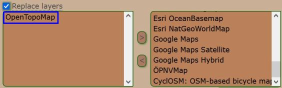  
	</li>
	<li>
		<strong>New:</strong> [Search Map / Search] Implement F2 key functionality on "Apply" button of the filters screens of both pages Search Map and Search. [<a href="https://github.com/2Abendsegler/GClh/issues/1945" title="Issue 1945">1945</a> / <a href="https://www.geocaching.com/profile/?u=2Abendsegler" title="Thanks to 2Abendsegler">2Abendsegler</a>] 
		The parameter is not new, it already exists for other F2 activities. We have now placed the parameter in the Global area. 
		<a href="https://www.geocaching.com/my/#GClhShowConfig#a#settings_submit_log_button" title="Link to your GClh II Config">Settings -> Global:</a> 
		  
	</li>
	<li>
		<strong>New:</strong> [Search Map] Don't display the filters screen during the GClh default filters setting are running. [<a href="https://github.com/2Abendsegler/GClh/issues/1921" title="Issue 1921">1921</a> / <a href="https://www.geocaching.com/profile/?u=2Abendsegler" title="Thanks to 2Abendsegler">2Abendsegler</a>]  
	</li>
	<li>
		<strong>New:</strong> [Cache Listing] Prevent popup when clicking on "Watch" or "Stop Watching". [<a href="https://github.com/2Abendsegler/GClh/issues/1913" title="Issue 1913">1913</a> / <a href="https://www.geocaching.com/profile/?u=2Abendsegler" title="Thanks to 2Abendsegler">2Abendsegler</a>] 
		 
		<a href="https://www.geocaching.com/my/#GClhShowConfig#a#settings_prevent_watchclick_popup" title="Link to your GClh II Config">Settings -> Listing - Cache Detail Navigation:</a> 
		 
		If you want to use this feature, you have to activate it.  
	</li>
	<li>
		<strong>New:</strong> [Cache Listing] Integrate the new styled upvotes element "Order by" in the available settings. [<a href="https://github.com/2Abendsegler/GClh/issues/1948" title="Issue 1948">1948</a> / <a href="https://www.geocaching.com/profile/?u=2Abendsegler" title="Thanks to 2Abendsegler">2Abendsegler</a>] 
		Old: 
		 
		New: 
		 
		<a href="https://www.geocaching.com/my/#GClhShowConfig#a#settings_smaller_upvotes_icons" title="Link to your GClh II Config">Settings -> Listing - Logs Header and Logs:</a> 
		  
	</li>
	<li>
		<strong>New:</strong> [Global] Check if the old GC little helper is running. [<a href="https://github.com/2Abendsegler/GClh/issues/1909" title="Issue 1909">1909</a> / <a href="https://www.geocaching.com/profile/?u=2Abendsegler" title="Thanks to 2Abendsegler">2Abendsegler</a>] 
		  
	</li>
	<li>
		<strong>New:</strong> [Global] Hide upgrade button in header with new parameter (basic member). [<a href="https://github.com/2Abendsegler/GClh/issues/1835" title="Issue 1835">1835</a> / <a href="https://www.geocaching.com/profile/?u=2Abendsegler" title="Thanks to 2Abendsegler">2Abendsegler</a>] 
		<a href="https://www.geocaching.com/my/#GClhShowConfig#a#settings_upgrade_button_header_remove" title="Link to your GClh II Config">Settings -> Global - Header Layout:</a> 
		 
		If you want to use this feature, you have to activate it.  
	</li>
	<li>
		<strong>Change:</strong> [Cache Listing] Limit the number of logs to be displayed when opening the Listing. [<a href="https://github.com/2Abendsegler/GClh/issues/1939" title="Issue 1939">1939</a> / <a href="https://www.geocaching.com/profile/?u=2Abendsegler" title="Thanks to 2Abendsegler">2Abendsegler</a>] 
		The parameter is not new, but we have limited the initial load to 500 logs so that we don't overwhelm the browser. You have nothing to do, we migrate it. 
		<a href="https://www.geocaching.com/my/#GClhShowConfig#a#settings_show_all_logs" title="Link to your GClh II Config">Settings -> Listing - Logs:</a> 
		  
	</li>
	<li>
		<strong>Fix:</strong> [Search Map] After clicking the back button in the cache detail screen, the positioning in the list of caches doesn't work. [<a href="https://github.com/2Abendsegler/GClh/issues/1932" title="Issue 1932">1932</a> / <a href="https://www.geocaching.com/profile/?u=2Abendsegler" title="Thanks to 2Abendsegler">2Abendsegler</a>] 
	</li>
	<li>
		<strong>Fix:</strong> [Search Map] Header has white space border if "Change header layout" is disabled. [<a href="https://github.com/2Abendsegler/GClh/issues/1936" title="Issue 1936">1936</a> / <a href="https://www.geocaching.com/profile/?u=2Abendsegler" title="Thanks to 2Abendsegler">2Abendsegler</a>] 
	</li>
	<li>
		<strong>Fix:</strong> [Search Map] The first line of buttons in sidebar is again bigger then necessary in compact layout. [<a href="https://github.com/2Abendsegler/GClh/issues/1929" title="Issue 1929">1929</a> / <a href="https://www.geocaching.com/profile/?u=2Abendsegler" title="Thanks to 2Abendsegler">2Abendsegler</a>] 
	</li>
	<li>
		<strong>Fix:</strong> [Search Map] Button "Browse geocaches" remains, even if it is relocated to the other buttons. [<a href="https://github.com/2Abendsegler/GClh/issues/1927" title="Issue 1927">1927</a> / <a href="https://www.geocaching.com/profile/?u=2Abendsegler" title="Thanks to 2Abendsegler">2Abendsegler</a>] 
	</li>
	<li>
		<strong>Fix:</strong> [Search Map] The GClh default filters setting change map zoom. [<a href="https://github.com/2Abendsegler/GClh/issues/1921" title="Issue 1921">1921</a> / <a href="https://www.geocaching.com/profile/?u=2Abendsegler" title="Thanks to 2Abendsegler">2Abendsegler</a>] 
	</li>
	<li>
		<strong>Fix:</strong> [Cache Listing] An "Add to List" popup is displayed in front of the GClh config. [<a href="https://github.com/2Abendsegler/GClh/issues/1931" title="Issue 1931">1931</a> / <a href="https://www.geocaching.com/profile/?u=2Abendsegler" title="Thanks to 2Abendsegler">2Abendsegler</a>] 
	</li>
	<li>
		<strong>Fix:</strong> [Cache Listing] The look of the "Search in logtext" Input change. [<a href="https://github.com/2Abendsegler/GClh/issues/1919" title="Issue 1919">1919</a> / <a href="https://www.geocaching.com/profile/?u=2Abendsegler" title="Thanks to 2Abendsegler">2Abendsegler</a>] 
	</li>
	<li>
		<strong>Fix:</strong> [Bookmarklists] Menue item "Open Caches in new tab" not selectable. [<a href="https://github.com/2Abendsegler/GClh/issues/1926" title="Issue 1926">1926</a> / <a href="https://www.geocaching.com/profile/?u=2Abendsegler" title="Thanks to 2Abendsegler">2Abendsegler</a>] 
	</li>
	<li>
		<strong>Fix:</strong> [Old log form] Automatic opt out to the old log form with a draft run into error on old log form. [<a href="https://github.com/2Abendsegler/GClh/issues/1917" title="Issue 1917">1917</a> / <a href="https://www.geocaching.com/profile/?u=capoaira" title="Thanks to capoaira">capoaira</a>] 
	</li>
	<li>
		<strong>Fix:</strong> [New log form] Placeholder "Owner" include VIP/VUP/Mail Icons. [<a href="https://github.com/2Abendsegler/GClh/issues/1911" title="Issue 1911">1911</a> / <a href="https://www.geocaching.com/profile/?u=capoaira" title="Thanks to capoaira">capoaira</a>] 
	</li>
	<li>
		<strong>Fix:</strong> [Own caches] Different button descriptions for the same thing. [<a href="https://github.com/2Abendsegler/GClh/issues/1924" title="Issue 1924">1924</a> / <a href="https://www.geocaching.com/profile/?u=2Abendsegler" title="Thanks to 2Abendsegler">2Abendsegler</a>] 
	</li>
	<li>
		<strong>Fix:</strong> [Menue / WoW] On the newer World of Warcraft page the submenus are moved. [<a href="https://github.com/2Abendsegler/GClh/issues/1922" title="Issue 1922">1922</a> / <a href="https://www.geocaching.com/profile/?u=2Abendsegler" title="Thanks to 2Abendsegler">2Abendsegler</a>]  
	</li>
</ul>
(20.11.2021) 
released by <a href="https://www.geocaching.com/profile/?u=2Abendsegler">2Abendsegler</a> 
 

---
## v0.11.7:
<ul>
	<li>
		<strong>New:</strong> [Cache Listing] Change preview map link from Search Map to Browse Map. [<a href="https://github.com/2Abendsegler/GClh/issues/1859" title="Issue 1859">1859</a> / <a href="https://www.geocaching.com/profile/?u=CastParo" title="Thanks to CastParo">CastParo</a>] 
		 
		<a href="https://www.geocaching.com/my/#GClhShowConfig#a#settings_larger_map_as_browse_map" title="Link to your GClh II Config">Settings -> Listing</a> 
		 
		If you want to use this feature, you have to activate it.  
	</li>
	<li>
		<strong>New:</strong> [Cache Listing] Font of personal cache note in monospace. [<a href="https://github.com/2Abendsegler/GClh/issues/1860" title="Issue 1860">1860</a> / <a href="https://www.geocaching.com/profile/?u=CastParo" title="Thanks to CastParo">CastParo</a>] 
		 
		<a href="https://www.geocaching.com/my/#GClhShowConfig#a#settings_change_font_cache_notes" title="Link to your GClh II Config">Settings -> Listing</a> 
		 
		If you want to use this feature, you have to activate it.  
	</li>
	<li>
		<strong>New:</strong> [Log Form] Automatic opt out to the old log form. [<a href="https://github.com/2Abendsegler/GClh/issues/1884" title="Issue 1884">1884</a> / <a href="https://www.geocaching.com/profile/?u=capoaira" title="Thanks to capoaira">capoaira</a>] 
		<a href="https://www.geocaching.com/my/#GClhShowConfig#a#settings_logs_old_fashioned" title="Link to your GClh II Config">Settings -> Logging</a> 
		 
		If you want to use this feature, you have to activate it.  
	</li>
	<li>
		<strong>Fix:</strong> [New Log Form] Templates, Smilies and VUP/VUP/Mail missing, Placeholders and Signature does not work. [<a href="https://github.com/2Abendsegler/GClh/issues/1855" title="Issue 1855">1855</a> / <a href="https://www.geocaching.com/profile/?u=capoaira" title="Thanks to capoaira">capoaira</a>] 
	</li>
	<li>
		<strong>Fix:</strong> [Search Map] Automatic hide caches do not work. [<a href="https://github.com/2Abendsegler/GClh/issues/1886" title="Issue 1886">1886</a> / <a href="https://www.geocaching.com/profile/?u=capoaira" title="Thanks to capoaira">capoaira</a>] 
	</li>
	<li>
		<strong>Fix:</strong> [Search Map / PQ] Save as PQ doesn't note D/T ratings. [<a href="https://github.com/2Abendsegler/GClh/issues/1888" title="Issue 1888">1888</a> / <a href="https://www.geocaching.com/profile/?u=capoaira" title="Thanks to capoaira">capoaira</a>] 
	</li>
	<li>
		<strong>Fix:</strong> [Browse Map] Enable non GClh layers like GME or GC. [<a href="https://github.com/2Abendsegler/GClh/issues/1892" title="Issue 1892">1892</a> / <a href="https://www.geocaching.com/profile/?u=2Abendsegler" title="Thanks to 2Abendsegler">2Abendsegler</a>] 
	</li>
	<li>
		<strong>Fix:</strong> [Search] Button to GClh-Filtersets not visible. [<a href="https://github.com/2Abendsegler/GClh/issues/1887" title="Issue 1887">1887</a> / <a href="https://www.geocaching.com/profile/?u=capoaira" title="Thanks to capoaira">capoaira</a>] 
	</li>
	<li>
		<strong>Fix:</strong> [Cache Listing] Remove One-Click Watching, because it was added by GS. [<a href="https://github.com/2Abendsegler/GClh/issues/1902" title="Issue 1902">1902</a> / <a href="https://www.geocaching.com/profile/?u=capoaira" title="Thanks to capoaira">capoaira</a>] 
	</li>
</ul>
(12.09.2021) 
released by <a href="https://www.geocaching.com/profile/?u=2Abendsegler">2Abendsegler</a> 
 

---
## v0.11.5.2:
<ul>	
	<li>
		<strong>Fix:</strong> [Cache Listing] Log in button missing if not logged in. [<a href="https://github.com/2Abendsegler/GClh/issues/1877" title="Issue 1877">1877</a> / <a href="https://www.geocaching.com/profile/?u=2Abendsegler" title="Thanks to 2Abendsegler">2Abendsegler</a>] 
	</li>
	<li>
		<strong>Fix:</strong> [Cache Listing] Limited calls on geonames https page result in errors. [<a href="https://github.com/2Abendsegler/GClh/issues/1876" title="Issue 1876">1876</a> / <a href="https://www.geocaching.com/profile/?u=2Abendsegler" title="Thanks to 2Abendsegler">2Abendsegler</a>] 
	</li>
	<li>
		<strong>Fix:</strong> [Cache Listing] Unpublish: Improve Watch button handling. [<a href="https://github.com/2Abendsegler/GClh/issues/1856" title="Issue 1856">1856</a> / <a href="https://www.geocaching.com/profile/?u=capoaira" title="Thanks to capoaira">capoaira</a>] 
	</li>
	<li>
		<strong>Fix:</strong> [Cache Listing] Alignment and look of personal cache note. [<a href="https://github.com/2Abendsegler/GClh/issues/1869" title="Issue 1869">1869</a> / <a href="https://www.geocaching.com/profile/?u=2Abendsegler" title="Thanks to 2Abendsegler">2Abendsegler</a>] 
	</li>
	<li>
		<strong>Fix:</strong> [Cache Listing / Maps] Elevation data with geonames run into errors. [<a href="https://github.com/2Abendsegler/GClh/issues/1857" title="Issue 1857">1857</a> / <a href="https://www.geocaching.com/profile/?u=capoaira" title="Thanks to capoaira">capoaira</a> / <a href="https://www.geocaching.com/profile/?u=2Abendsegler" title="Thanks to 2Abendsegler">2Abendsegler</a>] 
	</li>
	<li>
		<strong>Fix:</strong> [Browse Map] Map layer replacement doesn't work under Violentmonkey. [<a href="https://github.com/2Abendsegler/GClh/issues/1862" title="Issue 1862">1862</a> / <a href="https://www.geocaching.com/profile/?u=2Abendsegler" title="Thanks to 2Abendsegler">2Abendsegler</a>] 
	</li>
	<li>
		<strong>Fix:</strong> [Search Map] Alignment of sidebar header. [<a href="https://github.com/2Abendsegler/GClh/issues/1869" title="Issue 1869">1869</a> / <a href="https://www.geocaching.com/profile/?u=2Abendsegler" title="Thanks to 2Abendsegler">2Abendsegler</a>] 
	</li>
	<li>
		<strong>Fix:</strong> [Public Profile] Links "show hides" and "show finds" don't work for user "Doppelherz". [<a href="https://github.com/2Abendsegler/GClh/issues/1861" title="Issue 1861">1861</a> / <a href="https://www.geocaching.com/profile/?u=capoaira" title="Thanks to capoaira">capoaira</a> / <a href="https://www.geocaching.com/profile/?u=2Abendsegler" title="Thanks to 2Abendsegler">2Abendsegler</a>] 
	</li>
	<li>
		<strong>Fix:</strong> [Config] Errormessage after press button "Save & Upload" has wrong text if there is no authentication. [<a href="https://github.com/2Abendsegler/GClh/issues/1867" title="Issue 1867">1867</a> / <a href="https://www.geocaching.com/profile/?u=2Abendsegler" title="Thanks to 2Abendsegler">2Abendsegler</a>] 
	</li>
	<li>
		<strong>Fix:</strong> [Global] Nearest links and own trackable link from Linklist don't work. [<a href="https://github.com/2Abendsegler/GClh/issues/1863" title="Issue 1863">1863</a> / <a href="https://www.geocaching.com/profile/?u=2Abendsegler" title="Thanks to 2Abendsegler">2Abendsegler</a>]  
	</li>
</ul>
(20.08.2021) 
released by <a href="https://www.geocaching.com/profile/?u=2Abendsegler">2Abendsegler</a> 
 

---
## v0.11.5.1:
<ul>	
	<li>
		<strong>Info:</strong> Script manager Tampermonkey not longer free under Safari browser. 
		It seems that the script manager Tampermonkey is no longer free from Safari 12 onwards. If you want to use the script manager Tampermonkey for free, you can do so with the browsers Mozilla Firefox, Google Chrome ... .  
	</li>
	<li>
		<strong>New:</strong> [Cache Listing] Enable "one click Stop Watching". [<a href="https://github.com/2Abendsegler/GClh/issues/1822" title="Issue 1822">1822</a> / <a href="https://www.geocaching.com/profile/?u=capoaira" title="Thanks to capoaira">capoaira</a>] 
		  
	</li>
	<li>
		<strong>Fix:</strong> [Cache Listing] Fix "one click Watching". [<a href="https://github.com/2Abendsegler/GClh/issues/1822" title="Issue 1822">1822</a> / <a href="https://www.geocaching.com/profile/?u=capoaira" title="Thanks to capoaira">capoaira</a>] 
	</li>
	<li>
		<strong>Fix:</strong> [Cache Listing] "#GCNote# : User note" in "Copy Data to Clipboard" feature does not work anymore. [<a href="https://github.com/2Abendsegler/GClh/issues/1843" title="Issue 1843">1843</a> / <a href="https://www.geocaching.com/profile/?u=capoaira" title="Thanks to capoaira">capoaira</a>] 
	</li>
	<li>
		<strong>Fix:</strong> [Browse Map, Search Map] The display of the Personal Cache Note in the additional cache data is not correct. [<a href="https://github.com/2Abendsegler/GClh/issues/1845" title="Issue 1845">1845</a> / <a href="https://www.geocaching.com/profile/?u=capoaira" title="Thanks to capoaira">capoaira</a>]  
	</li>
</ul>
(17.07.2021) 
released by <a href="https://www.geocaching.com/profile/?u=2Abendsegler">2Abendsegler</a> 
 

---
## v0.11.5:

### Search Map / Browse Map:
<ul>	
	<li>
		<strong>New:</strong> [Search Map] Hide header. [<a href="https://github.com/2Abendsegler/GClh/issues/1117" title="Issue 1117">1117</a> / <a href="https://www.geocaching.com/profile/?u=capoaira" title="Thanks to capoaira">capoaira</a>] 
		  
		<a href="https://www.geocaching.com/my/#GClhShowConfig#a#settings_map_show_btn_hide_header" title="Link to your GClh II Config">Settings -> Map</a> 
		  
	</li>
	<li>
		<strong>New:</strong> [Browse Map / Layer] New map layer "CyclOSM: OSM-based bicycle map". [<a href="https://github.com/2Abendsegler/GClh/issues/1814" title="Issue 1814">1814</a> / <a href="https://www.geocaching.com/profile/?u=2Abendsegler" title="Thanks to 2Abendsegler">2Abendsegler</a>] 
		  
	</li>
	<li>
		<strong>New:</strong> [Search Map / Browse Map / Pocket Query] Before saving as PQ from map, determine whether the GClh default settings for new PQs should be set or not. [<a href="https://github.com/2Abendsegler/GClh/issues/1574" title="Issue 1574">1574</a> / <a href="https://www.geocaching.com/profile/?u=2Abendsegler" title="Thanks to 2Abendsegler">2Abendsegler</a>] 
		  
	</li>
	<li>
		<strong>New:</strong> [Statistic / Search Map] Zoom out fittingly for links from D/T matrix to map. [<a href="https://github.com/2Abendsegler/GClh/issues/1814" title="Issue 1814">1814</a> / <a href="https://www.geocaching.com/profile/?u=2Abendsegler" title="Thanks to 2Abendsegler">2Abendsegler</a>] 
	</li>
	<li>
		<strong>Fix:</strong> [Search Map] "set default" toggle runs on error. [<a href="https://github.com/2Abendsegler/GClh/issues/1819" title="Issue 1819">1819</a> / <a href="https://www.geocaching.com/profile/?u=2Abendsegler" title="Thanks to 2Abendsegler">2Abendsegler</a>] 
	</li>
	<li>
		<strong>Fix:</strong> [Search Map] Problems between GClh and Send to c:geo. [<a href="https://github.com/2Abendsegler/GClh/issues/1796" title="Issue 1796">1796</a> / <a href="https://www.geocaching.com/profile/?u=capoaira" title="Thanks to capoaira">capoaira</a>] 
	</li>
	<li>
		<strong>Fix:</strong> [Search Map] Undefined Finds in header. [<a href="https://github.com/2Abendsegler/GClh/issues/1831" title="Issue 1831">1831</a> / <a href="https://www.geocaching.com/profile/?u=2Abendsegler" title="Thanks to 2Abendsegler">2Abendsegler</a>]  
	</li>
</ul>	

### Cache Owner Dashboard:
<ul>	
	<li>
		<strong>New:</strong> [Owner Dashboard] Compact Layout. [<a href="https://github.com/2Abendsegler/GClh/issues/1370" title="Issue 1370">1370</a> / <a href="https://www.geocaching.com/profile/?u=capoaira" title="Thanks to capoaira">capoaira</a> / <a href="https://www.geocaching.com/profile/?u=2Abendsegler" title="Thanks to 2Abendsegler">2Abendsegler</a>] 
		  
		<a href="https://www.geocaching.com/my/#GClhShowConfig#a#settings_compact_layout_cod" title="Link to your GClh II Config">Settings -> Others</a> 
		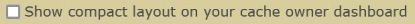 
		If you want to use this feature, you have to activate it.  
	</li>
	<li>
		<strong>New:</strong> [Owner Dashboard] Add the favorite percentage in the cache list. [<a href="https://github.com/2Abendsegler/GClh/issues/1378" title="Issue 1378">1378</a> / <a href="https://www.geocaching.com/profile/?u=capoaira" title="Thanks to capoaira">capoaira</a>] 
		 
		  
		<a href="https://www.geocaching.com/my/#GClhShowConfig#a#settings_show_button_fav_proz_cod" title="Link to your GClh II Config">Settings -> Others</a> 
		  
	</li>
	<li>
		<strong>Fix:</strong> [Owner Dashboard] GClh does not work after changing view. [<a href="https://github.com/2Abendsegler/GClh/issues/1761" title="Issue 1761">1761</a> / <a href="https://www.geocaching.com/profile/?u=capoaira" title="Thanks to capoaira">capoaira</a> / <a href="https://www.geocaching.com/profile/?u=2Abendsegler" title="Thanks to 2Abendsegler">2Abendsegler</a>] 
	</li>
	<li>
		<strong>Fix:</strong> [Owner Dashboard] No VIP, VUP, Mail icons if "Load More" button below the logs is clicked. [<a href="https://github.com/2Abendsegler/GClh/issues/1786" title="Issue 1786">1786</a> / <a href="https://www.geocaching.com/profile/?u=capoaira" title="Thanks to capoaira">capoaira</a>]  
	</li>
</ul>	

### Cache Listing:
<ul>	
	<li>
		<strong>New:</strong> [Listing] Open map links from overview map with left mouse click optional in new browser tab. [<a href="https://github.com/2Abendsegler/GClh/issues/1748" title="Issue 1748">1748</a> / <a href="https://www.geocaching.com/profile/?u=CastParo" title="Thanks to CastParo">CastParo</a>] 
		<a href="https://www.geocaching.com/my/#GClhShowConfig#a#settings_map_overview_browse_map_icon_new_tab" title="Link to your GClh II Config">Settings -> Listing - Overview map</a> 
		 
		If you want to use this feature, you have to activate it.  
		<a href="https://www.geocaching.com/my/#GClhShowConfig#a#settings_map_overview_search_map_icon_new_tab" title="Link to your GClh II Config">Settings -> Listing - Overview map</a> 
		 
		If you want to use this feature, you have to activate it.  
	</li>
	<li>
		<strong>New:</strong> [Cache Listing] Switch Geonames service to more secure https. [<a href="https://github.com/2Abendsegler/GClh/issues/1770" title="Issue 1770">1770</a> / <a href="https://www.geocaching.com/profile/?u=Die Batzen" title="Thanks to Die Batzen">Die Batzen</a>] 
	</li>
	<li>
		<strong>Fix:</strong> [Cache Listing] Upvote buttons and log edit button are not displayed for basic members. [<a href="https://github.com/2Abendsegler/GClh/issues/1792" title="Issue 1792">1792</a> / <a href="https://www.geocaching.com/profile/?u=2Abendsegler" title="Thanks to 2Abendsegler">2Abendsegler</a>]  
	</li>
</ul>	

### Global:
<ul>	
	<li>
		<strong>New:</strong> [Global] Handle the key combination ctrl + s like the key F2. [<a href="https://github.com/2Abendsegler/GClh/issues/1779" title="Issue 1779">1779</a> / <a href="https://www.geocaching.com/profile/?u=2Abendsegler" title="Thanks to 2Abendsegler">2Abendsegler</a>] 
	</li>
	<li>
		<strong>New:</strong> [Global] Build error message if running under Greasemonkey. [<a href="https://github.com/2Abendsegler/GClh/issues/1747" title="Issue 1747">1747</a> / <a href="https://www.geocaching.com/profile/?u=2Abendsegler" title="Thanks to 2Abendsegler">2Abendsegler</a>] 
	</li>
	<li>
		<strong>New:</strong> [Global] Test script manager Violentmonkey and revise some related documentation. [<a href="https://github.com/2Abendsegler/GClh/issues/1747" title="Issue 1747">1747</a> / <a href="https://www.geocaching.com/profile/?u=2Abendsegler" title="Thanks to 2Abendsegler">2Abendsegler</a>] 
	</li>
	<li>
		<strong>New:</strong> [Global] Delete script manager related functions. [<a href="https://github.com/2Abendsegler/GClh/issues/1747" title="Issue 1747">1747</a> / <a href="https://www.geocaching.com/profile/?u=2Abendsegler" title="Thanks to 2Abendsegler">2Abendsegler</a>] 
	</li>
	<li>
		<strong>New:</strong> [Global] Disable user profile menu by clicking anywhere else. [<a href="https://github.com/2Abendsegler/GClh/issues/1779" title="Issue 1779">1779</a> / <a href="https://www.geocaching.com/profile/?u=2Abendsegler" title="Thanks to 2Abendsegler">2Abendsegler</a>] 
	</li>
	<li>
		<strong>New:</strong> [Global] Set up checks log to console. [<a href="https://github.com/2Abendsegler/GClh/issues/1747" title="Issue 1747">1747</a> / <a href="https://www.geocaching.com/profile/?u=2Abendsegler" title="Thanks to 2Abendsegler">2Abendsegler</a>] 
	</li>
	<li>
		<strong>Fix:</strong> [Global / Project-GC] Project-GC script does not work because of changed page header. [<a href="https://github.com/2Abendsegler/GClh/issues/1783" title="Issue 1783">1783</a> / <a href="https://www.geocaching.com/profile/?u=capoaira" title="Thanks to capoaira">capoaira</a>]  
	</li>
</ul>	

### Config / Sync:
<ul>
	<li>
		<strong>New:</strong> [Config] Extend script manager menu in browser with GClh II Configurator. [<a href="https://github.com/2Abendsegler/GClh/issues/1752" title="Issue 1752">1752</a> / <a href="https://www.geocaching.com/profile/?u=2Abendsegler" title="Thanks to 2Abendsegler">2Abendsegler</a>] 
		The setting of the menu entry is not new. Only the config parameter to enable or disable it is new. 
		  
		<a href="https://www.geocaching.com/my/#GClhShowConfig#a#settings_call_config_via_sriptmanager" title="Link to your GClh II Config">Settings -> GClh II Config</a> 
		  
	</li>
	<li>
		<strong>New:</strong> [Sync] Extend script manager menu in browser with GClh II Synchronizer. [<a href="https://github.com/2Abendsegler/GClh/issues/1753" title="Issue 1753">1753</a> / <a href="https://www.geocaching.com/profile/?u=2Abendsegler" title="Thanks to 2Abendsegler">2Abendsegler</a>] 
		  
		<a href="https://www.geocaching.com/my/#GClhShowConfig#a#settings_call_sync_via_sriptmanager" title="Link to your GClh II Sync">Settings -> GClh II Sync</a> 
		  
	</li>
	<li>
		<strong>New:</strong> [Config / Sync] Split of the topic "Config / Sync" in two topics. [<a href="https://github.com/2Abendsegler/GClh/issues/1754" title="Issue 1754">1754</a> / <a href="https://www.geocaching.com/profile/?u=2Abendsegler" title="Thanks to 2Abendsegler">2Abendsegler</a>] 
		<a href="https://www.geocaching.com/my/#GClhShowConfig#a#gclh_config_config" title="Link to your GClh II Config">Settings -> GClh II Config</a> 
		  
		<a href="https://www.geocaching.com/my/#GClhShowConfig#a#gclh_config_sync" title="Link to your GClh II Sync">Settings -> GClh II Sync</a> 
		  
	</li>
	<li>
		<strong>New:</strong> [Config] New color in config. [<a href="https://github.com/2Abendsegler/GClh/issues/1797" title="Issue 1797">1797</a> / <a href="https://www.geocaching.com/profile/?u=2Abendsegler" title="Thanks to 2Abendsegler">2Abendsegler</a>] 
		We thought that we could all certainly use beautiful and bright colors in our dreary Corona everyday life. That's why there are new colors for the config, we hope you like the pretty colors. <a href="https://www.geocaching.com/my/#GClhShowConfig#a#settings_make_config_main_areas_hideable" title="Link to your GClh II Config">They only really work when you look at them in the config.</a>  
		  
	</li>
	<li>
		<strong>New:</strong> [Config] Delete older and not longer used config parameter. [<a href="https://github.com/2Abendsegler/GClh/issues/1747" title="Issue 1747">1747</a> / <a href="https://www.geocaching.com/profile/?u=2Abendsegler" title="Thanks to 2Abendsegler">2Abendsegler</a>] 
	</li>
	<li>
		<strong>Fix:</strong> [Config] Apostrophes in input fields do not work properly. [<a href="https://github.com/2Abendsegler/GClh/issues/1818" title="Issue 1818">1818</a> / <a href="https://www.geocaching.com/profile/?u=2Abendsegler" title="Thanks to 2Abendsegler">2Abendsegler</a>]  
	</li>
</ul>	

### Others:
<ul>	
	<li>
		<strong>New:</strong> [View Log] Improve alignment of icons on further log screens. [<a href="https://github.com/2Abendsegler/GClh/issues/1749" title="Issue 1749">1749</a> / <a href="https://www.geocaching.com/profile/?u=2Abendsegler" title="Thanks to 2Abendsegler">2Abendsegler</a>] 
	</li>
	<li>
		<strong>Fix:</strong> [New Log Form] Focus is not set to the Logtext. [<a href="https://github.com/2Abendsegler/GClh/issues/1814" title="Issue 1814">1814</a> / <a href="https://www.geocaching.com/profile/?u=2Abendsegler" title="Thanks to 2Abendsegler">2Abendsegler</a>] 
	</li>
	<li>
		<strong>Fix:</strong> [Drafts / New Log Form] Log templates field doesn't show "- Log Templates -". [<a href="https://github.com/2Abendsegler/GClh/issues/1814" title="Issue 1814">1814</a> / <a href="https://www.geocaching.com/profile/?u=2Abendsegler" title="Thanks to 2Abendsegler">2Abendsegler</a>] 
	</li>
	<li>
		<strong>Fix:</strong> [Public Profile] GS's souvenir sorting is now also available in the public profile. Our sorting and hiding functions need to be changed. [<a href="https://github.com/2Abendsegler/GClh/issues/1824" title="Issue 1824">1824</a> / <a href="https://www.geocaching.com/profile/?u=2Abendsegler" title="Thanks to 2Abendsegler">2Abendsegler</a>] 
	</li>
	<li>
		<strong>Fix:</strong> [Leaderboard] VipVupMail does not work. [<a href="https://github.com/2Abendsegler/GClh/issues/1829" title="Issue 1829">1829</a> / <a href="https://www.geocaching.com/profile/?u=2Abendsegler" title="Thanks to 2Abendsegler">2Abendsegler</a>]  
	</li>
</ul>
(03.07.2021) 
released by <a href="https://www.geocaching.com/profile/?u=2Abendsegler">2Abendsegler</a> 
 

---
## v0.11.4:
<ul>
	<li>
		<strong>Info:</strong> [Global / Google Chrome] Script does not start sometimes under Google Chrome. [<a href="https://github.com/2Abendsegler/GClh/issues/1760" title="Issue 1760">1760</a> / <a href="https://www.geocaching.com/profile/?u=2Abendsegler" title="Thanks to 2Abendsegler">2Abendsegler</a> / <a href="https://www.geocaching.com/profile/?u=Die Batzen" title="Thanks to Die Batzen">Die Batzen</a>] 
		Only affects the Google Chrome browser: 
		There was a bug in Tampermonkey. The bug should be fixed with Tampermonkey version 4.13 for Google Chrome. Please upgrade your Tampermonkey to version 4.13 or higher.  
	</li>
	<li>
		<strong>Fix:</strong> [Cache Listing] No dropdown with map selection for map services under waypoint table. [<a href="https://github.com/2Abendsegler/GClh/issues/1774" title="Issue 1774">1774</a> / <a href="https://www.geocaching.com/profile/?u=2Abendsegler" title="Thanks to 2Abendsegler">2Abendsegler</a>] 
	</li>
	<li>
		<strong>Fix:</strong> [Search Map] Space around the header without "Change header layout". [<a href="https://github.com/2Abendsegler/GClh/issues/1762" title="Issue 1762">1762</a> / <a href="https://www.geocaching.com/profile/?u=2Abendsegler" title="Thanks to 2Abendsegler">2Abendsegler</a> / <a href="https://www.geocaching.com/profile/?u=capoaira" title="Thanks to capoaira">capoaira</a>] 
	</li>
	<li>
		<strong>Fix:</strong> [Pocket query / Nearest list / Lists] Correct the order when opening selected caches in new browser tabs for Chrome. [<a href="https://github.com/2Abendsegler/GClh/issues/1772" title="Issue 1772">1772</a> / <a href="https://www.geocaching.com/profile/?u=2Abendsegler" title="Thanks to 2Abendsegler">2Abendsegler</a>] 
	</li>
	<li>
		<strong>Fix:</strong> [Owner Dashboard] Set Link to Profile does not work. [<a href="https://github.com/2Abendsegler/GClh/issues/1765" title="Issue 1765">1765</a> / <a href="https://www.geocaching.com/profile/?u=capoaira" title="Thanks to capoaira">capoaira</a>] 
	</li>
</ul>
(29.05.2021) 
released by <a href="https://www.geocaching.com/profile/?u=2Abendsegler">2Abendsegler</a> 
 

---
## v0.11.3:
<ul>
	<li>
		<strong>Fix:</strong> [Global] Script does not work because of missing user data. [<a href="https://github.com/2Abendsegler/GClh/issues/1755" title="Issue 1755">1755</a> / <a href="https://github.com/2Abendsegler/GClh/issues/1757" title="Issue 1757">1757</a> / <a href="https://www.geocaching.com/profile/?u=2Abendsegler" title="Thanks to 2Abendsegler">2Abendsegler</a>] 
		The data of the logged in user was saved under a different name. The script could not determine whether it was a registered user or not. Last affected pages: New Log Form, <a href="https://www.geocaching.com/play/search">Search</a>, <a href="https://www.geocaching.com/play/leaderboard">Leaderboard</a>, <a href="https://www.geocaching.com/play/geotours">Geotours</a> and <a href="https://www.geocaching.com/play/guidelines">Guidlines</a> 
	</li>
</ul>
(23.05.2021) 
released by <a href="https://www.geocaching.com/profile/?u=2Abendsegler">2Abendsegler</a> 
 

---
## v0.11.2:
<ul>
	<li>
		<strong>Fix:</strong> [Global / Chrome] "switch" handling in Chrome inconsistent (Chrome bug). [<a href="https://github.com/2Abendsegler/GClh/issues/1743" title="Issue 1743">1743</a> / <a href="https://www.geocaching.com/profile/?u=2Abendsegler" title="Thanks to 2Abendsegler">2Abendsegler</a>] 
		"switch" related functions were the starting point of the problems. Because some of these functions are very central, practically nothing works, if chrome no longer wants to. Or all works, if chrome just wants to. Fortunately, we haven't changed anything in the affected parts of the program for months.   
	</li>
</ul>
(17.05.2021) 
released by <a href="https://www.geocaching.com/profile/?u=2Abendsegler">2Abendsegler</a> 
 

---
## v0.11.1:
<ul>
	<li>
		<strong>New:</strong> [Cache listing] Change to old search on cache listing page. [<a href="https://github.com/2Abendsegler/GClh/issues/1682" title="Issue 1682">1682</a> / <a href="https://www.geocaching.com/profile/?u=2Abendsegler" title="Thanks to 2Abendsegler">2Abendsegler</a> / <a href="https://www.geocaching.com/profile/?u=capoaira" title="Thanks to capoaira">capoaira</a>] 
		The links in cache listing to find caches run through the new search. With this option you can use the old search again. 
		<a href="https://www.geocaching.com/my/#GClhShowConfig#a#settings_listing_old_links" title="Link to your GClh Config">Settings -> Listing:</a> 
		 
		If you want to use this feature, you have to activate it.  
		The following links in the find section of the cache listing are changed: 
		  
		Example for using this old search feature: 
		   
	</li>
	<li>
		<strong>New:</strong> [New Map/Old Map] Expand the additional cache data in new and old map with the personal cache note. [<a href="https://github.com/2Abendsegler/GClh/issues/1716" title="Issue 1716">1716</a> / <a href="https://www.geocaching.com/profile/?u=2Abendsegler" title="Thanks to 2Abendsegler">2Abendsegler</a>] 
		Example for the new map: 
		  
		Example for the old map: 
		   
	</li>
	<li>
		<strong>New:</strong> [New Map/Old Map] Show country as part of the place in the additional cache data of new and old map. [<a href="https://github.com/2Abendsegler/GClh/issues/1717" title="Issue 1717">1717</a> / <a href="https://www.geocaching.com/profile/?u=2Abendsegler" title="Thanks to 2Abendsegler">2Abendsegler</a>] 
		With this option the place of the cache is displayed with state and country separated by a comma or only with state. In the latter case the complete place is displayed if you hover with the mouse over the field. 
		You can use this also to prevent the line from being broken. 
		<a href="https://www.geocaching.com/my/#GClhShowConfig#a#settings_show_country_in_place" title="Link to your GClh Config">Settings -> Map:</a> 
		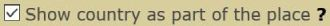  
		Example for the new map with state and country: 
		  
		Example for the new map only with state: 
		   
	</li>
	<li>
		<strong>New:</strong> [New Map] VIP, VUP and Mail for owner in cache detail. [<a href="https://github.com/2Abendsegler/GClh/issues/1593" title="Issue 1593">1593</a> / <a href="https://www.geocaching.com/profile/?u=2Abendsegler" title="Thanks to 2Abendsegler">2Abendsegler</a>] 
		   
	</li>
	<li>
		<strong>New:</strong> [Lists] Open selected caches in new browser tabs. [<a href="https://github.com/2Abendsegler/GClh/issues/1737" title="Issue 1737">1737</a> / <a href="https://www.geocaching.com/profile/?u=2Abendsegler" title="Thanks to 2Abendsegler">2Abendsegler</a>] 
		This feature add an entry in the dropdown menu to open selected caches in new browser tabs. The feature is available in own and foreign bookmark lists and in the ignore list. 
		If you have only two or three caches to open, you can also open the listings manually. However, if you want to do this for a full page with for example twenty caches, this feature can be helpful. 
		<a href="https://www.geocaching.com/my/#GClhShowConfig#a#settings_lists_open_tabs" title="Link to your GClh Config">Settings -> Bookmark list:</a> 
		  
		Example: 
		   
	</li>
	<li>
		<strong>New:</strong> [Pocket query / Nearest list] Open selected caches in new browser tabs. [<a href="https://github.com/2Abendsegler/GClh/issues/1736" title="Issue 1736">1736</a> / <a href="https://www.geocaching.com/profile/?u=2Abendsegler" title="Thanks to 2Abendsegler">2Abendsegler</a>] 
		This option displays a button to open selected caches in new browser tabs. The feature is available in pocket queries and nearest lists if the compact layout feature for pocket queries respectively the compact layout for nearest lists is activated. 
		If you have only two or three caches to open, you can also open the listings manually. However, if you want to do this for a full page with for example twenty caches, this feature can be helpful. 
		<a href="https://www.geocaching.com/my/#GClhShowConfig#a#settings_open_tabs_nearest" title="Link to your GClh Config">Settings -> Nearest list:</a> 
		 
		<a href="https://www.geocaching.com/my/#GClhShowConfig#a#settings_open_tabs_pqs" title="Link to your GClh Config">Settings -> Pocket query:</a> 
		  
		Example for a nearest list: 
		   
	</li>
	<li>
		<strong>New:</strong> [Public Profile - Souvenirs] Standard sort changed to newest first as it is done on the souvenirs page. [<a href="https://github.com/2Abendsegler/GClh/issues/1724" title="Issue 1724">1724</a> / <a href="https://www.geocaching.com/profile/?u=2Abendsegler" title="Thanks to 2Abendsegler">2Abendsegler</a>] 
		   
	</li>
	<li>
		<strong>New:</strong> [Profile] Build back coding of the old profile page. [<a href="https://github.com/2Abendsegler/GClh/issues/1730" title="Issue 1730">1730</a> / <a href="https://www.geocaching.com/profile/?u=2Abendsegler" title="Thanks to 2Abendsegler">2Abendsegler</a>] 
	</li>
	<li>
		<strong>New:</strong> [Show logs] Do not break the column "View log" in my Geocaching Logs and my Trackable Logs. [<a href="https://github.com/2Abendsegler/GClh/issues/1728" title="Issue 1728">1728</a> / <a href="https://www.geocaching.com/profile/?u=2Abendsegler" title="Thanks to 2Abendsegler">2Abendsegler</a>]  
	</li>
	<li>
		<strong>Fix:</strong> [Global] Sign out does not always work. [<a href="https://github.com/2Abendsegler/GClh/issues/1711" title="Issue 1711">1711</a> / <a href="https://www.geocaching.com/profile/?u=2Abendsegler" title="Thanks to 2Abendsegler">2Abendsegler</a>] 
	</li>
	<li>
		<strong>Fix:</strong> [Souvenirs] Show more than four souvenirs in a row again. [<a href="https://github.com/2Abendsegler/GClh/issues/1712" title="Issue 1712">1712</a> / <a href="https://www.geocaching.com/profile/?u=2Abendsegler" title="Thanks to 2Abendsegler">2Abendsegler</a>] 
	</li>
	<li>
		<strong>Fix:</strong> [Pocket Query] Activate full compact layout on pocket queries again. [<a href="https://github.com/2Abendsegler/GClh/issues/1714" title="Issue 1714">1714</a> / <a href="https://www.geocaching.com/profile/?u=2Abendsegler" title="Thanks to 2Abendsegler">2Abendsegler</a>] 
	</li>
	<li>
		<strong>Fix:</strong> [Linklist] Correct links in Linklist. [<a href="https://github.com/2Abendsegler/GClh/issues/1726" title="Issue 1726">1726</a> / <a href="https://www.geocaching.com/profile/?u=2Abendsegler" title="Thanks to 2Abendsegler">2Abendsegler</a>] 
		Correct Flopp's Map link in Linklist. 
		Convert the two-stage direct links to the public profile tabs into one-stage. 
	</li>
</ul>
 
(16.05.2021) 
released by <a href="https://www.geocaching.com/profile/?u=2Abendsegler">2Abendsegler</a> 
 

---
## v0.11:

### Config:
<ul>
	<li>
		<strong>New:</strong> [Config] New structuring of the topics "Global" and "Listing" in config. [<a href="https://github.com/2Abendsegler/GClh/issues/1697" title="Issue 1697">1697</a> / <a href="https://www.geocaching.com/profile/?u=2Abendsegler" title="Thanks to 2Abendsegler">2Abendsegler</a>] 
		<a href="https://www.geocaching.com/my/#GClhShowConfig#a#gclh_config_global" title="Link to your GClh Config">Settings -> Global:</a> 
		New structuring of the topic "Global". 
		 
		<a href="https://www.geocaching.com/my/#GClhShowConfig#a#gclh_config_listing" title="Link to your GClh Config">Settings -> Listing:</a> 
		New structuring of the topic "Listing". 
		  
	</li>
</ul>

### Cache listing:
<ul>
	<li>
		<strong>New:</strong> [Cache listing] Open Personal Cache Note in minimum size. [<a href="https://github.com/2Abendsegler/GClh/issues/1695" title="Issue 1695">1695</a> / <a href="https://www.geocaching.com/profile/?u=2Abendsegler" title="Thanks to 2Abendsegler">2Abendsegler</a>] 
		<a href="https://www.geocaching.com/my/#GClhShowConfig#a#settings_cache_notes_min_size" title="Link to your GClh Config">Settings -> Listing - Personal cache note:</a> 
		  
	</li>
	<li>
		<strong>New:</strong> [Cache listing] Show icons to new and old map in overview map. [<a href="https://github.com/2Abendsegler/GClh/issues/1692" title="Issue 1692">1692</a> / <a href="https://www.geocaching.com/profile/?u=2Abendsegler" title="Thanks to 2Abendsegler">2Abendsegler</a>] 
		<a href="https://www.geocaching.com/my/#GClhShowConfig#a#settings_map_overview_browse_map_icon" title="Link to your GClh Config">Settings -> Listing - Overview map (right sidebar):</a> 
		  
		  
	</li>
	<li>
		<strong>New:</strong> [Cache listing] Show button "Hide upvotes" above the logs. [<a href="https://github.com/2Abendsegler/GClh/issues/1623" title="Issue 1623">1623</a> / <a href="https://www.geocaching.com/profile/?u=2Abendsegler" title="Thanks to 2Abendsegler">2Abendsegler</a>] 
		With this option you can show/hide the whole upvotes feature consist of the logs sort button "Order by" above the logs and the buttons "Great story" and "Helpful" in the logs. 
		<a href="https://www.geocaching.com/my/#GClhShowConfig#a#settings_show_hide_upvotes_but" title="Link to your GClh Config">Settings -> Listing - Logs header:</a> 
		 
		If you want to use this feature, you have to activate it.  
		  
	</li>
	<li>
		<strong>New:</strong> [Cache listing] Hide upvote feature with logs sort and "Great story", "Helpful" buttons. [<a href="https://github.com/2Abendsegler/GClh/issues/1623" title="Issue 1623">1623</a> / <a href="https://www.geocaching.com/profile/?u=2Abendsegler" title="Thanks to 2Abendsegler">2Abendsegler</a>] 
		With this option you can show/hide the whole upvotes feature consist of the logs sort button "Order by" above the logs and the buttons "Great story" and "Helpful" in the logs. 
		<a href="https://www.geocaching.com/my/#GClhShowConfig#a#settings_hide_upvotes" title="Link to your GClh Config">Settings -> Listing - Logs header:</a> 
		 
		If you want to use this feature, you have to activate it.  
	</li>
	<li>
		<strong>New:</strong> [Cache listing] No wiggle on click to upvotes buttons "Great story" and "Helpful". [<a href="https://github.com/2Abendsegler/GClh/issues/1703" title="Issue 1703">1703</a> / <a href="https://www.geocaching.com/profile/?u=2Abendsegler" title="Thanks to 2Abendsegler">2Abendsegler</a>] 
		With this option you can prevent the page wiggle if you click to the button "Great story" or "Helpful". 
		<a href="https://www.geocaching.com/my/#GClhShowConfig#a#settings_no_wiggle_upvotes_click" title="Link to your GClh Config">Settings -> Listing - Logs:</a> 
		  
	</li>
	<li>
		<strong>New:</strong> [Cache listing] Make upvotes icons for "Great story" and "Helpful" smaller. [<a href="https://github.com/2Abendsegler/GClh/issues/1702" title="Issue 1702">1702</a> / <a href="https://www.geocaching.com/profile/?u=2Abendsegler" title="Thanks to 2Abendsegler">2Abendsegler</a>] 
		This option makes the upvotes icons used for the buttons "Great story" and "Helpful" smaller, as is the case with other icons in the logs. 
		<a href="https://www.geocaching.com/my/#GClhShowConfig#a#settings_smaller_upvotes_icons" title="Link to your GClh Config">Settings -> Listing - Logs:</a> 
		  
	</li>
	<li>
		<strong>New:</strong> [Cache listing] Set focus in add to list popup to new list field. No mouse click to the field required. [<a href="https://github.com/2Abendsegler/GClh/pull/1685" title="Issue 1685">1685</a> / <a href="https://www.geocaching.com/profile/?u=2Abendsegler" title="Thanks to 2Abendsegler">2Abendsegler</a>] 
	</li>
	<li>
		<strong>Fix:</strong> [Cache listing] "Great story" and "Helpful" Button does not work. [<a href="https://github.com/2Abendsegler/GClh/issues/1622" title="Issue 1622">1622</a> / <a href="https://www.geocaching.com/profile/?u=Ruko2010" title="Thanks to Ruko2010">Ruko2010</a> / <a href="https://www.geocaching.com/profile/?u=2Abendsegler" title="Thanks to 2Abendsegler">2Abendsegler</a>] 
	</li>
	<li>
		<strong>Fix:</strong> [Cache listing / Event] GClh TypeError with click to dynamical copy to clipboard entries: Events have no favorite score. [<a href="https://github.com/2Abendsegler/GClh/pull/1685" title="Issue 1685">1685</a> / <a href="https://www.geocaching.com/profile/?u=capoaira" title="Thanks to capoaira">capoaira</a>] 
	</li>
	<li>
		<strong>Fix:</strong> [Cache listing / Print] Process additional features like other coordinates, decrypt hints ... again on print page. [<a href="https://github.com/2Abendsegler/GClh/pull/1685" title="Issue 1685">1685</a> / <a href="https://www.geocaching.com/profile/?u=2Abendsegler" title="Thanks to 2Abendsegler">2Abendsegler</a>] 
	</li>
	<li>
		<strong>Fix:</strong> [Cache listing / Print] Display listing images on print page not over the maximum available width. [<a href="https://github.com/2Abendsegler/GClh/pull/1685" title="Issue 1685">1685</a> / <a href="https://www.geocaching.com/profile/?u=2Abendsegler" title="Thanks to 2Abendsegler">2Abendsegler</a>]  
	</li>
</ul>

### Global:
<ul>
	<li>
		<strong>New:</strong> [Global] Menus aligned evenly. [<a href="https://github.com/2Abendsegler/GClh/pull/1685" title="Issue 1685">1685</a> / <a href="https://www.geocaching.com/profile/?u=2Abendsegler" title="Thanks to 2Abendsegler">2Abendsegler</a>] 
	</li>
	<li>
		<strong>New:</strong> [Global] Make Linklist calls to "GClh Config II" and "GClh Sync II" available on all pages except on both maps. [<a href="https://github.com/2Abendsegler/GClh/issues/1699" title="Issue 1699">1699</a> / <a href="https://www.geocaching.com/profile/?u=2Abendsegler" title="Thanks to 2Abendsegler">2Abendsegler</a>] 
	</li>
	<li>
		<strong>New:</strong> [Global] Make Linklist call to "Find Player" available on all pages. [<a href="https://github.com/2Abendsegler/GClh/issues/1699" title="Issue 1699">1699</a> / <a href="https://www.geocaching.com/profile/?u=2Abendsegler" title="Thanks to 2Abendsegler">2Abendsegler</a>] 
	</li>
	<li>
		<strong>New:</strong> [Global] Faster CSS loading for deactivate GS header. [<a href="https://github.com/2Abendsegler/GClh/pull/1685" title="Issue 1685">1685</a> / <a href="https://www.geocaching.com/profile/?u=2Abendsegler" title="Thanks to 2Abendsegler">2Abendsegler</a>] 
	</li>
	<li>
		<strong>Fix:</strong> [Global] Break of the Linklist with horizontal menu. [<a href="https://github.com/2Abendsegler/GClh/issues/1686" title="Issue 1686">1686</a> / <a href="https://www.geocaching.com/profile/?u=2Abendsegler" title="Thanks to 2Abendsegler">2Abendsegler</a>]  
	</li>
</ul>

### Others:
<ul>
	<li>
		<strong>New:</strong> [New Map] Set focus in add to list popup to new list field. No mouse click to the field required. [<a href="https://github.com/2Abendsegler/GClh/pull/1685" title="Issue 1685">1685</a> / <a href="https://www.geocaching.com/profile/?u=2Abendsegler" title="Thanks to 2Abendsegler">2Abendsegler</a>] 
	</li>
	<li>
		<strong>New:</strong> [View Log] Improve alignment of icons. [<a href="https://github.com/2Abendsegler/GClh/issues/1706" title="Issue 1706">1706</a> / <a href="https://www.geocaching.com/profile/?u=2Abendsegler" title="Thanks to 2Abendsegler">2Abendsegler</a>] 
	</li>
	<li>
		<strong>Fix:</strong> [Old Map] GClh Error: Copy to clipboard: anker_element.parentNode is undefined. [<a href="https://github.com/2Abendsegler/GClh/pull/1685" title="Issue 1685">1685</a> / <a href="https://www.geocaching.com/profile/?u=2Abendsegler" title="Thanks to 2Abendsegler">2Abendsegler</a>] 
	</li>
	<li>
		<strong>Fix:</strong> [Old Map] Additional data: Do not cut own favorite Icon. [<a href="https://github.com/2Abendsegler/GClh/pull/1685" title="Issue 1685">1685</a> / <a href="https://www.geocaching.com/profile/?u=2Abendsegler" title="Thanks to 2Abendsegler">2Abendsegler</a>] 
	</li>
	<li>
		<strong>Fix:</strong> [Public Profile] Change links to hide caches to the old link do not work for basic members. [<a href="https://github.com/2Abendsegler/GClh/issues/1683" title="Issue 1683">1683</a> / <a href="https://www.geocaching.com/profile/?u=2Abendsegler" title="Thanks to 2Abendsegler">2Abendsegler</a>] 
	</li>
	<li>
		<strong>Fix:</strong> [Souvenirs] Show buttons are not always displayed because the souvenirs dashboard is not there yet. [<a href="https://github.com/2Abendsegler/GClh/pull/1685" title="Issue 1685">1685</a> / <a href="https://www.geocaching.com/profile/?u=2Abendsegler" title="Thanks to 2Abendsegler">2Abendsegler</a>] 
	</li>
	<li>
		<strong>Fix:</strong> [Statistic] GClh TypeError, if matrix links to search caches are forwarded to map. [<a href="https://github.com/2Abendsegler/GClh/pull/1685" title="Issue 1685">1685</a> / <a href="https://www.geocaching.com/profile/?u=2Abendsegler" title="Thanks to 2Abendsegler">2Abendsegler</a>] 
	</li>
	<li>
		<strong>Fix:</strong> [Login] Hide other login partner like facebook ... also for create an account. [<a href="https://github.com/2Abendsegler/GClh/pull/1685" title="Issue 1685">1685</a> / <a href="https://www.geocaching.com/profile/?u=2Abendsegler" title="Thanks to 2Abendsegler">2Abendsegler</a>] 
	</li>
</ul>
 
(09.05.2021) 
released by <a href="https://www.geocaching.com/profile/?u=2Abendsegler">2Abendsegler</a> 
 

---
## v0.10.20:
<ul>
	<li>
		<strong>New:</strong> [Public Profile] Change links to found/hide caches to the old link again. [<a href="https://github.com/2Abendsegler/GClh/issues/1656" title="Issue 1656">1656</a> / <a href="https://www.geocaching.com/profile/?u=capoaira" title="Thanks to capoaira">capoaira</a>] 
		<a href="https://www.geocaching.com/my/#GClhShowConfig#a#settings_profile_old_links" title="Link to your GClh Config">Settings -> Public profile - Geocaches:</a> 
		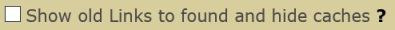 
		If you want to use these old links again, you have to activate it.  
		  
	</li>
	<li>
		<strong>New:</strong> [Old Map] Install map layer PNVMap. [<a href="https://github.com/2Abendsegler/GClh/issues/1657" title="Issue 1657">1657</a> / <a href="https://www.geocaching.com/profile/?u=2Abendsegler" title="Thanks to 2Abendsegler">2Abendsegler</a>] 
		<a href="https://www.geocaching.com/my/#GClhShowConfig#a#settings_use_gclh_layercontrol" title="Link to your GClh Config">Settings -> Map - Layers in map:</a> 
		This map layer is set automatically. It is the replacement for "Public Transport Lines" which is no longer available. If you don't want it, then you can deactivate it.  
		  
	</li>
	<li>
		<strong>New:</strong> [New Map / Pocket query] Save as PQ button on search map. [<a href="https://github.com/2Abendsegler/GClh/issues/1578" title="Issue 1578">1578</a> / <a href="https://www.geocaching.com/profile/?u=capoaira" title="Thanks to capoaira">capoaira</a>] 
		  
	</li>
	<li>
		<strong>New:</strong> [Global] Remove whitespace from search field in header. [<a href="https://github.com/2Abendsegler/GClh/issues/1676" title="Issue 1676">1676</a> / <a href="https://www.geocaching.com/profile/?u=ChristianGK" title="Thanks to ChristianGK">ChristianGK</a>]  
	</li>
	<li>
		<strong>Fix:</strong> [Global] GS menues do not work with no "Change header layout" and no "Linklist on top". [<a href="https://github.com/2Abendsegler/GClh/issues/1664" title="Issue 1664">1664</a> / <a href="https://www.geocaching.com/profile/?u=2Abendsegler" title="Thanks to 2Abendsegler">2Abendsegler</a>] 
	</li>
	<li>
		<strong>Fix:</strong> [Global] GClh does not always run if finds are null. [<a href="https://github.com/2Abendsegler/GClh/issues/1674" title="Issue 1674">1674</a> / <a href="https://www.geocaching.com/profile/?u=2Abendsegler" title="Thanks to 2Abendsegler">2Abendsegler</a>] 
	</li>
	<li>
		<strong>Fix:</strong> [Cache listing] Print page cache listing has coords format error. [<a href="https://github.com/2Abendsegler/GClh/issues/1670" title="Issue 1670">1670</a> / <a href="https://www.geocaching.com/profile/?u=2Abendsegler" title="Thanks to 2Abendsegler">2Abendsegler</a>] 
	</li>
	<li>
		<strong>Fix:</strong> [Old Map] "Public Transport Lines" are not shown. This map layer is no longer available. [<a href="https://github.com/2Abendsegler/GClh/issues/1594" title="Issue 1594">1594</a> / <a href="https://www.geocaching.com/profile/?u=2Abendsegler" title="Thanks to 2Abendsegler">2Abendsegler</a>] 
	</li>
	<li>
		<strong>Fix:</strong> [New Map] Shows white screen. [<a href="https://github.com/2Abendsegler/GClh/issues/1595" title="Issue 1595">1595</a> / <a href="https://www.geocaching.com/profile/?u=2Abendsegler" title="Thanks to 2Abendsegler">2Abendsegler</a>] 
	</li>
	<li>
		<strong>Fix:</strong> [New Map] Hide sidebar by default does not work on list hub. [<a href="https://github.com/2Abendsegler/GClh/issues/1627" title="Issue 1627">1627</a> / <a href="https://www.geocaching.com/profile/?u=capoaira" title="Thanks to capoaira">capoaira</a> / <a href="https://www.geocaching.com/profile/?u=2Abendsegler" title="Thanks to 2Abendsegler">2Abendsegler</a>] 
	</li>
	<li>
		<strong>Fix:</strong> [Log form, Draft] "Found" placeholders do not work. [<a href="https://github.com/2Abendsegler/GClh/issues/1672" title="Issue 1672">1672</a> / <a href="https://www.geocaching.com/profile/?u=2Abendsegler" title="Thanks to 2Abendsegler">2Abendsegler</a>] 
	</li>
	<li>
		<strong>Fix:</strong> [Souvenirs] GS has now an own souvenirs sort feature. Display group of souvenirs do not work. [<a href="https://github.com/2Abendsegler/GClh/issues/1661" title="Issue 1661">1661</a> / <a href="https://www.geocaching.com/profile/?u=2Abendsegler" title="Thanks to 2Abendsegler">2Abendsegler</a>] 
	</li>
</ul>
 
(01.05.2021) 
released by <a href="https://www.geocaching.com/profile/?u=2Abendsegler">2Abendsegler</a> 
 

---
## v0.10.19:
<ul>
	<li>
		<strong>Fix:</strong> [Cache listing] Determination of actual owner wrong. [<a href="https://github.com/2Abendsegler/GClh/issues/1652" title="Issue 1652">1652</a> / <a href="https://www.geocaching.com/profile/?u=2Abendsegler" title="Thanks to 2Abendsegler">2Abendsegler</a>] 
	</li>
</ul>
(24.04.2021) 
released by <a href="https://www.geocaching.com/profile/?u=2Abendsegler">2Abendsegler</a> 
 

---
## v0.10.18:
<ul>
	<li>
		<strong>Fix:</strong> [Global] GClh doesn't run because of changing page header. [<a href="https://github.com/2Abendsegler/GClh/issues/1630" title="Issue 1630">1630</a> / <a href="https://www.geocaching.com/profile/?u=2Abendsegler" title="Thanks to 2Abendsegler">2Abendsegler</a>] 
		All problems from the last changes of GS should now have been eliminated. 
		The menu of all geocaching pages is now in English and cannot be changed via the language setting in the GClh config or on the geocaching page. 
		Some user had problems in such a way, that the GClh did not want to run despite the last update or even sometimes ran and sometimes didn't. That should be fixed now also.   
	</li>
	<li>
		<strong>Fix:</strong> [Global] Found count in header not displayed. [<a href="https://github.com/2Abendsegler/GClh/issues/1644" title="Issue 1644">1644</a> / <a href="https://www.geocaching.com/profile/?u=2Abendsegler" title="Thanks to 2Abendsegler">2Abendsegler</a>] 
	</li>
	<li>
		<strong>Fix:</strong> [Global] Message center message indicator in header not displayed. [<a href="https://github.com/2Abendsegler/GClh/issues/1647" title="Issue 1647">1647</a> / <a href="https://www.geocaching.com/profile/?u=2Abendsegler" title="Thanks to 2Abendsegler">2Abendsegler</a>] 
	</li>
	<li>
		<strong>Fix:</strong> [Global] Set a language of the geocaching pages through the GClh. [<a href="https://github.com/2Abendsegler/GClh/issues/1648" title="Issue 1648">1648</a> / <a href="https://www.geocaching.com/profile/?u=2Abendsegler" title="Thanks to 2Abendsegler">2Abendsegler</a>] 
	</li>
</ul>
 
(24.04.2021) 
released by <a href="https://www.geocaching.com/profile/?u=2Abendsegler">2Abendsegler</a> 
 

---
## v0.10.16:
<ul>
	<li>
		<strong>Fix:</strong> [Cache listing] Copy to clipboard menu will not work for own entries. [<a href="https://github.com/2Abendsegler/GClh/issues/1629" title="Issue 1629">1629</a> / <a href="https://www.geocaching.com/profile/?u=2Abendsegler" title="Thanks to 2Abendsegler">2Abendsegler</a>] 
	</li>
	<li>
		<strong>Fix:</strong> [Favorites] Log status not longer available. [<a href="https://github.com/2Abendsegler/GClh/issues/1640" title="Issue 1640">1640</a> / <a href="https://www.geocaching.com/profile/?u=2Abendsegler" title="Thanks to 2Abendsegler">2Abendsegler</a>] 
	</li>
	<li>
		<strong>Fix:</strong> [My List, Owner Dashboard, New Map] Build header page. [<a href="https://github.com/2Abendsegler/GClh/issues/1641" title="Issue 1641">1641</a> / <a href="https://www.geocaching.com/profile/?u=2Abendsegler" title="Thanks to 2Abendsegler">2Abendsegler</a>] 
	</li>
</ul>
(23.04.2021) 
released by <a href="https://www.geocaching.com/profile/?u=2Abendsegler">2Abendsegler</a> 
 

---
## v0.10.15:
<ul>
	<li>
		<strong>Fix:</strong> [My List] No page header. [<a href="https://github.com/2Abendsegler/GClh/issues/1637" title="Issue 1637">1637</a> / <a href="https://www.geocaching.com/profile/?u=2Abendsegler" title="Thanks to 2Abendsegler">2Abendsegler</a>] 
	</li>
</ul>
(23.04.2021) 
released by <a href="https://www.geocaching.com/profile/?u=2Abendsegler">2Abendsegler</a> 
 

---
## v0.10.14:
<ul>
	<li>
		<strong>Fix:</strong> [Global] GClh doesn't run because of changing all page headers. [<a href="https://github.com/2Abendsegler/GClh/issues/1630" title="Issue 1630">1630</a> / <a href="https://www.geocaching.com/profile/?u=2Abendsegler" title="Thanks to 2Abendsegler">2Abendsegler</a>] 
	</li>
</ul>
(22.04.2021) 
released by <a href="https://www.geocaching.com/profile/?u=2Abendsegler">2Abendsegler</a> 
 

---
## v0.10.13:
<ul>
	<li>
		<strong>Fix:</strong> [Global] GClh doesn't run because of changing all page headers. [<a href="https://github.com/2Abendsegler/GClh/issues/1630" title="Issue 1630">1630</a> / <a href="https://www.geocaching.com/profile/?u=2Abendsegler" title="Thanks to 2Abendsegler">2Abendsegler</a>] 
	</li>
</ul>
(22.04.2021) 
released by <a href="https://www.geocaching.com/profile/?u=2Abendsegler">2Abendsegler</a> 
 

---
## v0.10.12:
<ul>
	<li>
		<strong>New:</strong> [Log forms] Convert TB autovisit feature of old log form to asynchronous, and integrate new log form. [<a href="https://github.com/2Abendsegler/GClh/issues/1301" title="Issue 1301">1301</a> / <a href="https://www.geocaching.com/profile/?u=capoaira" title="Thanks to capoaira">capoaira</a>] 
		TB autovisit feature in new log form: 
		  
	</li>
	<li>
		<strong>New:</strong> [Souvenirs] Classify souvenirs by country, state and other. [<a href="https://github.com/2Abendsegler/GClh/issues/1603" title="Issue 1603">1603</a> / <a href="https://www.geocaching.com/profile/?u=2Abendsegler" title="Thanks to 2Abendsegler">2Abendsegler</a>] 
		  
	</li>
	<li>
		<strong>New:</strong> GClh Search can now search for bookmarklists "BM...", profiles "PR..." and logs "GL...". [<a href="https://github.com/2Abendsegler/GClh/issues/1586" title="Issue 1586">1586</a> / <a href="https://www.geocaching.com/profile/?u=capoaira" title="Thanks to capoaira">capoaira</a>] 
		For example to call the bookmarklist of the best Jigsaw Puzzle collection: 
		  
	</li>
	<li>
		<strong>New:</strong> [New Map] Integrate new BML feature in compact layout feature in new map. [<a href="https://github.com/2Abendsegler/GClh/issues/1597" title="Issue 1597">1597</a> / <a href="https://www.geocaching.com/profile/?u=2Abendsegler" title="Thanks to 2Abendsegler">2Abendsegler</a>]  
	</li>
	<li>
		<strong>Fix:</strong> [Cache listing] Openroutemaps has been changed their url. [<a href="https://github.com/2Abendsegler/GClh/issues/1585" title="Issue 1585">1585</a> / <a href="https://www.geocaching.com/profile/?u=ColleIsarco" title="Thanks to ColleIsarco">ColleIsarco</a>] 
	</li>
	<li>
		<strong>Fix:</strong> [Cache listing] Oneclick watching does not work. [<a href="https://github.com/2Abendsegler/GClh/issues/1589" title="Issue 1589">1589</a> / <a href="https://www.geocaching.com/profile/?u=capoaira" title="Thanks to capoaira">capoaira</a>] 
	</li>
	<li>
		<strong>Fix:</strong> [New/Old Map] Additional cache data not loaded. [<a href="https://github.com/2Abendsegler/GClh/issues/1591" title="Issue 1591">1591</a> / <a href="https://www.geocaching.com/profile/?u=capoaira" title="Thanks to capoaira">capoaira</a>] 
	</li>
	<li>
		<strong>Fix:</strong> [Owner Dashboard] Build VIP, VUP, Mail icons does not work. [<a href="https://github.com/2Abendsegler/GClh/issues/1583" title="Issue 1583">1583</a> / <a href="https://www.geocaching.com/profile/?u=capoaira" title="Thanks to capoaira">capoaira</a>] 
	</li>
	<li>
		<strong>Fix:</strong> [Pocket query] Error if there is no PQ. [<a href="https://github.com/2Abendsegler/GClh/issues/1579" title="Issue 1579">1579</a> / <a href="https://www.geocaching.com/profile/?u=capoaira" title="Thanks to capoaira">capoaira</a>] 
	</li>
	<li>
		<strong>Fix:</strong> User related features don't work correct on several pages. [<a href="https://github.com/2Abendsegler/GClh/issues/1612" title="Issue 1612">1612</a> / <a href="https://www.geocaching.com/profile/?u=2Abendsegler" title="Thanks to 2Abendsegler">2Abendsegler</a> / <a href="https://www.geocaching.com/profile/?u=capoaira" title="Thanks to capoaira">capoaira</a>] 
		[Cache listing, New log form, Old log form, Friends, TB listing, Mail, TB log form, TB inventury] VIP, VUP, mail, message corrected. 
		[Cache listing] One click ignoring corrected. 
		[Cache listing] Counter of "Add to List" corrected. 
		[TB listing] VIP, VUP, own, owner, reviewer coloring in TB listing corrected. 
	</li>
	<li>
		<strong>Fix:</strong> Small bugs and features collection. [<a href="https://github.com/2Abendsegler/GClh/issues/1601" title="Issue 1601">1601</a> / <a href="https://www.geocaching.com/profile/?u=2Abendsegler" title="Thanks to 2Abendsegler">2Abendsegler</a>] 
		[Cache listing] A locked cache is equated with an archived cache so that the cache name also appears in red. 
		[Cache listing] Migrate Openroutemaps settings_show_openrouteservice_medium from 1 to 1a. 
		[New Map] If no long text is given in the cache listing, no additional data was displayed in the new map. 
		[New Map] New map due to BML may not be automatically updated if it has been moved. 
		[New log form] Alignment of smilies in preview in the new log form. 
		[Bookmarklist] The display of the rating for bookmark lists may only be suppressed if there is no rating and the link to create a rating is not available either. 
		[TB search] Alignment TB search page. 
		[FAQ] New FAQ 8. How can I get help to GClh? 
		[FAQ] New FAQ 9. How can I report a bug or a feature request? 
	</li>
</ul>
 
(09.03.2021) 
released by <a href="https://www.geocaching.com/profile/?u=2Abendsegler">2Abendsegler</a> 
 

---
## v0.10.11:
<ul>
	<li>
		<strong>Info:</strong> [Config] Migrate elevation parameters first service to 'GeoNames-Elevation' and second service to 'Open-Elevation'. [<a href="https://github.com/2Abendsegler/GClh/issues/1566" title="Issue 1566">1566</a> / <a href="https://www.geocaching.com/profile/?u=2Abendsegler" title="Thanks to 2Abendsegler">2Abendsegler</a>] 
		We have migrate this setting to all of you. You can change the parameters again, if you want. 
		<a href="https://www.geocaching.com/my/#GClhShowConfig#a#settings_show_elevation_of_waypoints" title="Link to your GClh Config">Settings -> Listing: 
		</a>  
	</li>
	<li>
		<strong>New:</strong> [Lists] Add feature to show/hide the cache descriptions in bookmark lists and ignore list. [<a href="https://github.com/2Abendsegler/GClh/issues/1570" title="Issue 1570">1570</a> / <a href="https://www.geocaching.com/profile/?u=2Abendsegler" title="Thanks to 2Abendsegler">2Abendsegler</a>] 
		</a> 
		<a href="https://www.geocaching.com/my/#GClhShowConfig#a#settings_lists_show_dd" title="Link to your GClh Config">Settings -> Bookmark list: 
		</a>  
	</li>
	<li>
		<strong>New:</strong> [Lists] Upload caches to a bookmark list from .gpx or .loc file, or from file with separators. [<a href="https://github.com/2Abendsegler/GClh/issues/1571" title="Issue 1571">1571</a> / <a href="https://www.geocaching.com/profile/?u=2Abendsegler" title="Thanks to 2Abendsegler">2Abendsegler</a> / <a href="https://www.geocaching.com/profile/?u=Die Batzen" title="Thanks to Die Batzen">Die Batzen</a>] 
		Example: Upload a .gpx file to a bookmark list: 
		</a> 
		<a href="https://www.geocaching.com/my/#GClhShowConfig#a#settings_lists_show_dd" title="Link to your GClh Config">Settings -> Bookmark list: 
		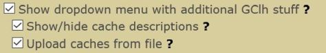</a>  
	</li>
	<li>
		<strong>New:</strong> [Global] Extend scriptmanager menu in browser with GClh configurator. [<a href="https://github.com/2Abendsegler/GClh/issues/1556" title="Issue 1556">1556</a> / <a href="https://www.geocaching.com/profile/?u=2Abendsegler" title="Thanks to 2Abendsegler">2Abendsegler</a>] 
		</a>  
	</li>
	<li>
		<strong>New:</strong> [Hide cache] Build header with navigation menu and linklist. [<a href="https://github.com/2Abendsegler/GClh/issues/1542" title="Issue 1542">1542</a> / <a href="https://www.geocaching.com/profile/?u=2Abendsegler" title="Thanks to 2Abendsegler">2Abendsegler</a> / <a href="https://www.geocaching.com/profile/?u=capoaira" title="Thanks to capoaira">capoaira</a>]  
	</li>
	<li>
		<strong>Fix:</strong> [New Map] Automatic search of new caches is available also for bookmarklists maps. [<a href="https://github.com/2Abendsegler/GClh/issues/1553" title="Issue 1553">1553</a> / <a href="https://www.geocaching.com/profile/?u=capoaira" title="Thanks to capoaira">capoaira</a>] 
	</li>
	<li>
		<strong>Fix:</strong> [New Map] After go back from cache details to cache list, scroll to last position does not work, if the cache is not on the first part of the cache lists. [<a href="https://github.com/2Abendsegler/GClh/issues/1538" title="Issue 1538">1538</a> / <a href="https://www.geocaching.com/profile/?u=2Abendsegler" title="Thanks to 2Abendsegler">2Abendsegler</a>] 
	</li>
	<li>
		<strong>Fix:</strong> [Old Map] Popups on maps not working properly when a cache has S or W corrected coordinates. [<a href="https://github.com/2Abendsegler/GClh/issues/1548" title="Issue 1548">1548</a> / <a href="https://www.geocaching.com/profile/?u=capoaira" title="Thanks to capoaira">capoaira</a>] 
	</li>
	<li>
		<strong>Fix:</strong> [Old Map] Wrong cache name title in map popup. [<a href="https://github.com/2Abendsegler/GClh/issues/1558" title="Issue 1558">1558</a> / <a href="https://www.geocaching.com/profile/?u=2Abendsegler" title="Thanks to 2Abendsegler">2Abendsegler</a>] 
	</li>
	<li>
		<strong>Fix:</strong> [Profile] Both trackables lists are not displayed side by side. [<a href="https://github.com/2Abendsegler/GClh/issues/1560" title="Issue 1560">1560</a> / <a href="https://www.geocaching.com/profile/?u=2Abendsegler" title="Thanks to 2Abendsegler">2Abendsegler</a>] 
	</li>
	<li>
		<strong>Fix:</strong> [Profile] Links on new profile page to found and hidden caches don't work with user with special characters. [<a href="https://github.com/2Abendsegler/GClh/issues/1554" title="Issue 1554">1554</a> / <a href="https://www.geocaching.com/profile/?u=2Abendsegler" title="Thanks to 2Abendsegler">2Abendsegler</a>] 
	</li>
	<li>
		<strong>Fix:</strong> [Find player] Link "Find Player" from Linklist doesn't work. [<a href="https://github.com/2Abendsegler/GClh/issues/1476" title="Issue 1476">1476</a> / <a href="https://www.geocaching.com/profile/?u=2Abendsegler" title="Thanks to 2Abendsegler">2Abendsegler</a>] 
	</li>
</ul>
 
(28.12.2020) 
released by <a href="https://www.geocaching.com/profile/?u=2Abendsegler">2Abendsegler</a> 
 

---
## v0.10.10:
<ul>
	<li>
		<strong>Docu:</strong> How can you contribute? [<a href="https://github.com/2Abendsegler/GClh/issues/1498" title="Issue 1498">1498</a> / <a href="https://www.geocaching.com/profile/?u=Ruko2010" title="Thanks to Ruko2010">Ruko2010</a>] 
		Have you ever wanted to participate in the GC little helper II script and you didn't know how to do that? 
		Then take a look at the new step by step instructions <a href="../docu/how_to_contribute.md#en" title="Link to 'How can you contribute?'">How can you contribute? (English)</a> / <a href="../docu/how_to_contribute.md#de" title="Link zu 'Wie kannst du etwas beitragen?'">(German)</a>  
	</li>
	<li>
		<strong>Info:</strong>  How you can install the GClh on Android devices. [<a href="https://github.com/2Abendsegler/GClh/issues/1519" title="Issue 1519">1519</a> / <a href="https://www.geocaching.com/profile/?u=2Abendsegler" title="Thanks to 2Abendsegler">2Abendsegler</a>] 
		<a href="https://github.com/2Abendsegler/GClh/blob/master/docu/tips_installation.md#android_en" title="Link to 'Tips for the installation of GC little helper II - Android'">Tips for the installation of GC little helper II - Android (English)</a> / <a href="https://github.com/2Abendsegler/GClh/blob/master/docu/tips_installation.md#android_de" title="Link zu 'Tipps fr die Installation des GC little helper II - Android'">(German)</a> / <a href="https://france-geocaching.fr/forum/viewtopic.php?f=22&t=5982&p=100012#p100010" title="Link to an article on the french forum 'France Geocaching'">(French)</a> 
		<a href="https://github.com/2Abendsegler/GClh/blob/master/docu/faq.md#4-en" title="Link to 'FAQ 4. Hints for using on Android devices'">Hints for using on Android devices (English)</a> / <a href="https://github.com/2Abendsegler/GClh/blob/master/docu/faq.md#4-de" title="Link zu 'FAQ 4. Hinweise fr die Nutzung auf Android Gerten'">(German)</a>  
		</li>
	<li>
		<strong>New:</strong> [Owner Dashboard] Build VIP, VUP, Mail icons. [<a href="https://github.com/2Abendsegler/GClh/issues/1372" title="Issue 1372">1372</a> / <a href="https://www.geocaching.com/profile/?u=capoaira" title="Thanks to capoaira">capoaira</a>] 
		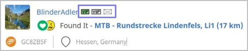  
	</li>
	<li>
		<strong>Change:</strong> [Statistic] Rebuild D/T Matrix functionality together with implemented enhancements of GS. [<a href="https://github.com/2Abendsegler/GClh/issues/1491" title="Issue 1491">1491</a> / <a href="https://www.geocaching.com/profile/?u=2Abendsegler" title="Thanks to 2Abendsegler">2Abendsegler</a>] 
		The functionality is not new, but we have it redesigned to use it together with the newer enhancements of GS. 
		</a> 
		<a href="https://www.geocaching.com/my/#GClhShowConfig#a#settings_count_own_matrix" title="Link to your GClh Config">Settings -> Public profile - Statistic: 
		</a>  
	</li>
	<li>
		<strong>Fix:</strong> [New log form] Wrong alignment of smileys on new logging page. [<a href="https://github.com/2Abendsegler/GClh/issues/1490" title="Issue 1490">1490</a> / <a href="https://www.geocaching.com/profile/?u=sunhillduo" title="Thanks to sunhillduo">sunhillduo</a>] 
	</li>
	<li>
		<strong>Fix:</strong> [New log form] Signature does not work. [<a href="https://github.com/2Abendsegler/GClh/issues/1502" title="Issue 1502">1502</a> / <a href="https://www.geocaching.com/profile/?u=capoaira" title="Thanks to capoaira">capoaira</a>] 
	</li>
	<li>
		<strong>Fix:</strong> [New log form] Adjust alignment and height of the "Log Templates" field. [<a href="https://github.com/2Abendsegler/GClh/issues/1505" title="Issue 1505">1505</a> / <a href="https://www.geocaching.com/profile/?u=2Abendsegler" title="Thanks to 2Abendsegler">2Abendsegler</a>]  
	</li>
	<li>
		<strong>Fix:</strong> [Old log form] Not all GClh features run if log form is called from dashboard. [<a href="https://github.com/2Abendsegler/GClh/issues/1485" title="Issue 1485">1485</a> / <a href="https://www.geocaching.com/profile/?u=capoaira" title="Thanks to capoaira">capoaira</a>]  
	</li>
	<li>
		<strong>Change:</strong> [New Map] Refactoring compact layout. [<a href="https://github.com/2Abendsegler/GClh/issues/1507" title="Issue 1507">1507</a> / <a href="https://www.geocaching.com/profile/?u=capoaira" title="Thanks to capoaira">capoaira</a>] 
		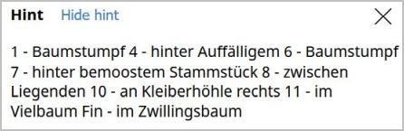</a>  
	</li>
	<li>
		<strong>Change:</strong> [New Map] Show hint automatically does not work always. / Refactor show hint automatically. [<a href="https://github.com/2Abendsegler/GClh/issues/1531" title="Issue 1531">1531</a> / <a href="https://www.geocaching.com/profile/?u=2Abendsegler" title="Thanks to 2Abendsegler">2Abendsegler</a>] 
		Cache list: 
		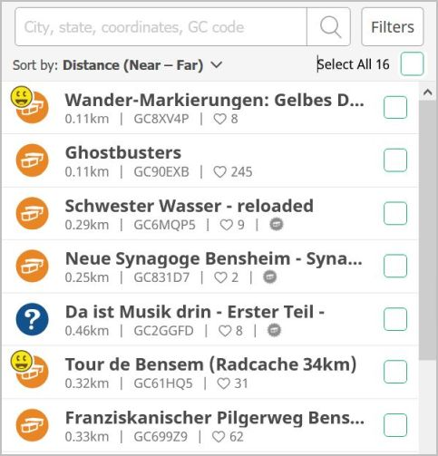</a> 
		Cache details: 
		</a> 
		Filter: 
		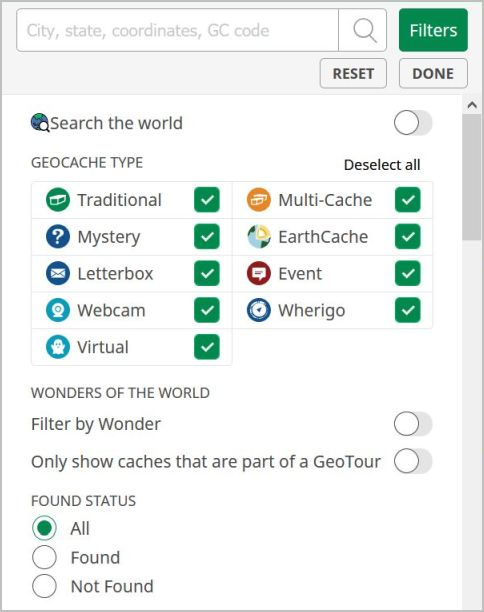</a>  
	</li>
	<li>
		<strong>New:</strong> [New Map] Automatic search for new caches not only after dragging but also after zooming. [<a href="https://github.com/2Abendsegler/GClh/issues/1540" title="Issue 1540">1540</a> / <a href="https://www.geocaching.com/profile/?u=2Abendsegler" title="Thanks to 2Abendsegler">2Abendsegler</a>] 
	</li>
	<li>
		<strong>Fix:</strong> [New Map]  Buttons to "Search Map" and "Go to ..." are missing. [<a href="https://github.com/2Abendsegler/GClh/issues/1493" title="Issue 1493">1493</a> / <a href="https://www.geocaching.com/profile/?u=capoaira" title="Thanks to capoaira">capoaira</a>] 
	</li>
	<li>
		<strong>Fix:</strong> [New Map] Hide found/own caches, cache types does not work. [<a href="https://github.com/2Abendsegler/GClh/issues/1478" title="Issue 1478">1478</a> / <a href="https://www.geocaching.com/profile/?u=capoaira" title="Thanks to capoaira">capoaira</a>] 
	</li>
	<li>
		<strong>Fix:</strong> [New Map] Remove code for "Align logs again correctly in the detail screen" because GS has fixed it. [<a href="https://github.com/2Abendsegler/GClh/issues/1511" title="Issue 1511">1511</a> / <a href="https://www.geocaching.com/profile/?u=capoaira" title="Thanks to capoaira">capoaira</a>] 
	</li>
	<li>
		<strong>Fix:</strong> [New Map] Change of the language does not affect the header of the new map. [<a href="https://github.com/2Abendsegler/GClh/issues/1523" title="Issue 1523">1523</a> / <a href="https://www.geocaching.com/profile/?u=2Abendsegler" title="Thanks to 2Abendsegler">2Abendsegler</a>] 
	</li>
	<li>
		<strong>Fix:</strong> [New Map] Loading Spinner is visible if "Automatic search for new caches after dragging" is off. [<a href="https://github.com/2Abendsegler/GClh/issues/1534" title="Issue 1534">1534</a> / <a href="https://www.geocaching.com/profile/?u=capoaira" title="Thanks to capoaira">capoaira</a>] 
	</li>
	<li>
		<strong>Fix:</strong> [New Map] After go back from cache details to cache list, scroll to last position does not work. [<a href="https://github.com/2Abendsegler/GClh/issues/1510" title="Issue 1510">1510</a> / <a href="https://www.geocaching.com/profile/?u=2Abendsegler" title="Thanks to 2Abendsegler">2Abendsegler</a>] 
	</li>
	<li>
		<strong>Fix:</strong> [New Map] Show behind the "Add to list" button if cache is available in own bookmarklists does not work. [<a href="https://github.com/2Abendsegler/GClh/issues/1500" title="Issue 1500">1500</a> / <a href="https://www.geocaching.com/profile/?u=capoaira" title="Thanks to capoaira">capoaira</a>]  
	</li>
	<li>
		<strong>Fix:</strong> [Cache listing] Show behind the "Add to list" button if cache is available in own bookmarklists does not work. [<a href="https://github.com/2Abendsegler/GClh/issues/1500" title="Issue 1500">1500</a> / <a href="https://www.geocaching.com/profile/?u=capoaira" title="Thanks to capoaira">capoaira</a>]  
	</li>
	<li>
		<strong>Fix:</strong> [Old Map] Show behind the "Add to list" button if cache is available in own bookmarklists does not work. [<a href="https://github.com/2Abendsegler/GClh/issues/1500" title="Issue 1500">1500</a> / <a href="https://www.geocaching.com/profile/?u=capoaira" title="Thanks to capoaira">capoaira</a>]  
	</li>
	<li>
		<strong>Fix:</strong> [PQ-Splitter] Problems with Firefox Popup-Blocker. [<a href="https://github.com/2Abendsegler/GClh/issues/886" title="Issue 886">886</a> / <a href="https://www.geocaching.com/profile/?u=Ruko2010" title="Thanks to Ruko2010">Ruko2010</a>]  
	</li>
	<li>
		<strong>Fix:</strong> [Old bookmarklists] After change of bookmark go to bookmark list automatically does not work. [<a href="https://github.com/2Abendsegler/GClh/issues/1517" title="Issue 1517">1517</a> / <a href="https://www.geocaching.com/profile/?u=2Abendsegler" title="Thanks to 2Abendsegler">2Abendsegler</a>] 
	</li>
</ul>
 
(06.12.2020) 
released by <a href="https://www.geocaching.com/profile/?u=2Abendsegler">2Abendsegler</a> 
 

---
## v0.10.9:
<ul>
	<li>
		<strong>New:</strong> [Cache listing] Show behind the "Add to list" button if cache is available in own bookmarklists. [<a href="https://github.com/2Abendsegler/GClh/issues/1463" title="Issue 1463">1463</a> / <a href="https://www.geocaching.com/profile/?u=2Abendsegler" title="Thanks to 2Abendsegler">2Abendsegler</a>] 
		  
	</li>
	<li>
		<strong>Fix:</strong> [Cache Listing] "Photo file name" in "Copy Data to Clipboard" feature does not filter invalid characters. [<a href="https://github.com/2Abendsegler/GClh/issues/1467" title="Issue 1467">1467</a> / <a href="https://www.geocaching.com/profile/?u=2Abendsegler" title="Thanks to 2Abendsegler">2Abendsegler</a>]  
	</li>
	<li>
		<strong>Fix:</strong> [Cache listing] Improve alignment in the header of event listings especially on smaller pages. [<a href="https://github.com/2Abendsegler/GClh/issues/1471" title="Issue 1471">1471</a> / <a href="https://www.geocaching.com/profile/?u=2Abendsegler" title="Thanks to 2Abendsegler">2Abendsegler</a>]  
	</li>
	<li>
		<strong>New:</strong> [Old Map] Show in cache popup behind the "Add to list" button if cache is available in own bookmarklists. [<a href="https://github.com/2Abendsegler/GClh/issues/1463" title="Issue 1463">1463</a> / <a href="https://www.geocaching.com/profile/?u=2Abendsegler" title="Thanks to 2Abendsegler">2Abendsegler</a>] 
		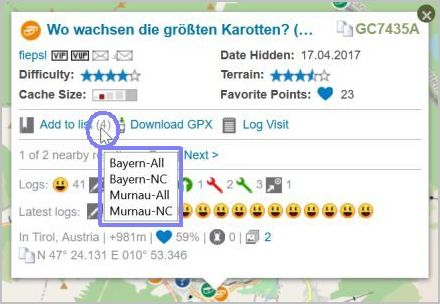  
	</li>
	<li>
		<strong>New:</strong> [New Map] Show in cache detail screen behind the "Add to list" button if cache is available in own bookmarklists. [<a href="https://github.com/2Abendsegler/GClh/issues/1463" title="Issue 1463">1463</a> / <a href="https://www.geocaching.com/profile/?u=2Abendsegler" title="Thanks to 2Abendsegler">2Abendsegler</a>] 
		  
	</li>
	<li>
		<strong>New:</strong> [New Profile] Add links to finds and hides on new profilpage. [<a href="https://github.com/2Abendsegler/GClh/issues/1481" title="Issue 1481">1481</a> / <a href="https://www.geocaching.com/profile/?u=2Abendsegler" title="Thanks to 2Abendsegler">2Abendsegler</a>] 
		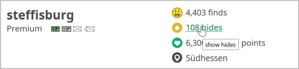  
	</li>
	<li>
		<strong>New:</strong> [Search] Implement F2 key functionality on "Search" button of the filters screen of the search page. [<a href="https://github.com/2Abendsegler/GClh/issues/1469" title="Issue 1469">1469</a> / <a href="https://www.geocaching.com/profile/?u=2Abendsegler" title="Thanks to 2Abendsegler">2Abendsegler</a>]  
	</li>
	<li>
		<strong>Fix:</strong> [Flopp] Circle around mystery corrected coordinates has wrong diameter. [<a href="https://github.com/2Abendsegler/GClh/issues/1475" title="Issue 1475">1475</a> / <a href="https://www.geocaching.com/profile/?u=Ruko2010" title="Thanks to Ruko2010">Ruko2010</a>]  
	</li>
	<li>
		<strong>Fix:</strong> [Google maps] Improve the alignment of the icons on google maps. [<a href="https://github.com/2Abendsegler/GClh/issues/1479" title="Issue 1479">1479</a> / <a href="https://www.geocaching.com/profile/?u=2Abendsegler" title="Thanks to 2Abendsegler">2Abendsegler</a>]  
	</li>
	<li>
		<strong>Fix:</strong> [TB listing] Correct colors in TB listing logs. [<a href="https://github.com/2Abendsegler/GClh/issues/1483" title="Issue 1483">1483</a> / <a href="https://www.geocaching.com/profile/?u=2Abendsegler" title="Thanks to 2Abendsegler">2Abendsegler</a>] 
	</li>
</ul>
 
(04.11.2020) 
released by <a href="https://www.geocaching.com/profile/?u=2Abendsegler">2Abendsegler</a> 
 

---
## v0.10.8:

### Maps:
<ul>
	<li>
		<strong>New:</strong> [New Map] Hide found/own caches, cache types and sidebar also in new Map (Search Map). [<a href="https://github.com/2Abendsegler/GClh/issues/1304" title="Issue 1304">1304</a> / <a href="https://www.geocaching.com/profile/?u=Die Batzen" title="Thanks to Die Batzen">Die Batzen</a> ] 
		<a href="https://www.geocaching.com/my/#GClhShowConfig#a#settings_map_hide_sidebar" title="Link to your GClh Config">Settings -> Maps: 
		</a>  
	</li>
	<li>
		<strong>Info:</strong> [New/old Map] Mark features in Config which are only available in one of the maps. [<a href="https://www.geocaching.com/profile/?u=2Abendsegler" title="2Abendsegler">2Abendsegler</a>] 
		The following features are only available on the new Map (Search Map): 
		<a href="https://www.geocaching.com/my/#GClhShowConfig#a#settings_searchmap_autoupdate_after_dragging" title="Link to your GClh Config">Settings -> Maps: 
		</a> 
		The following features are only available on the old Map (Browse Map): 
		<a href="https://www.geocaching.com/my/#GClhShowConfig#a#settings_show_homezone" title="Link to your GClh Config">Settings -> Maps: 
		 
		 
		 
		 
		</a>  
	</li>
	<li>
		<strong>New:</strong> [New Map] Add links on Google Maps and Openstreetmap to new GC Map. [<a href="https://github.com/2Abendsegler/GClh/issues/1374" title="Issue 1374">1374</a> / <a href="https://www.geocaching.com/profile/?u=2Abendsegler" title="Thanks to 2Abendsegler">2Abendsegler</a>] 
		<a href="https://www.geocaching.com/my/#GClhShowConfig#a#settings_hide_left_sidebar_on_google_maps" title="Link to your GClh Config">Settings -> Maps: 
		</a> 
		Google Maps: 
		 
		Openstreetmap: 
		  
	</li>
	<li>
		<strong>New:</strong> [Old Map] Hide and show "Community Celebration Events" together with "Events". [<a href="https://github.com/2Abendsegler/GClh/issues/1386" title="Issue 1386">1386</a> / <a href="https://www.geocaching.com/profile/?u=2Abendsegler" title="Thanks to 2Abendsegler">2Abendsegler</a>] 
		In the old Map there is no icon to hide "Community Celebration Events". Therefore, these events remain visible even if you have hidden all events with the event icons. Now, if you hide or show "Events", the "Community Celebration Events" should also be hidden or showed. This also works for the features "Show / hide all Cachetypes". 
		  
	</li>
	<li>
		<strong>New:</strong> [New/old Map] Show number of images on the maps and provide a link to the image gallery. [<a href="https://github.com/2Abendsegler/GClh/issues/1399" title="Issue 1399">1399</a> / <a href="https://www.geocaching.com/profile/?u=2Abendsegler" title="Thanks to 2Abendsegler">2Abendsegler</a>] 
		Popup of the old Map (Browse Map): 
		 
		Detail screen of the new Map (Search Map): 
		  
	</li>
	<li>
		<strong>Fix:</strong> [New Map] Align logs again correctly in the detail screen. [<a href="https://github.com/2Abendsegler/GClh/issues/1375" title="Issue 1375">1375</a> / <a href="https://www.geocaching.com/profile/?u=2Abendsegler" title="Thanks to 2Abendsegler">2Abendsegler</a>]  
	</li>
</ul>
 

### Cache Listing:
<ul>	
	<li>
		<strong>New:</strong> [Cache listing] Highlight found places from cache listing "Search in logtext" in the logs. [<a href="https://github.com/2Abendsegler/GClh/issues/1437" title="Issue 1437">1437</a> / <a href="https://www.geocaching.com/profile/?u=2Abendsegler" title="Thanks to 2Abendsegler">2Abendsegler</a>] 
		  
	</li>
	<li>
		<strong>New:</strong> [Cache listing] Additional link for logging premium caches for non-premium cachers. [<a href="https://github.com/2Abendsegler/GClh/issues/1345" title="Issue 1345">1345</a> / <a href="https://www.geocaching.com/profile/?u=2Abendsegler" title="Thanks to 2Abendsegler">2Abendsegler</a>] 
		  
		To "Log your visit" not inline, you have to do nothing.  
		To "Log your visit (inline)" you have to activate possibly the parameter. If you're using an ad-blocking add-on, such as uBlock, the embedded screen may not be allowed. To turn this off, you have to add "www.geocaching.com/geocache/GC*" to the whitelist, or something similar, of your add-on. 
		<a href="https://www.geocaching.com/my/#GClhShowConfig#a#settings_log_inline_pmo4basic" title="Link to your GClh Config">Settings -> Listing: 
		</a>  
	</li>
	<li>
		<strong>New:</strong> [Cache listing] After clicking on a log icon in the VIP area, go to the log, even if the log is not yet displayed. [<a href="https://github.com/2Abendsegler/GClh/issues/1411" title="Issue 1411">1411</a> / <a href="https://www.geocaching.com/profile/?u=2Abendsegler" title="Thanks to 2Abendsegler">2Abendsegler</a>] 
		  
	</li>
	<li>
		<strong>New:</strong> [Cache listing] Build links to the log section, at the top log totals. [<a href="https://github.com/2Abendsegler/GClh/issues/1413" title="Issue 1413">1413</a> / <a href="https://www.geocaching.com/profile/?u=2Abendsegler" title="Thanks to 2Abendsegler">2Abendsegler</a>] 
		  
	</li>
	<li>
		<strong>New:</strong> [Cache Listing] New feature for the menu "copy data to clipboard": Addition of data to clipboard. [<a href="https://github.com/2Abendsegler/GClh/issues/1365" title="Issue 1365">1365</a> / <a href="https://www.geocaching.com/profile/?u=2Abendsegler" title="Thanks to 2Abendsegler">2Abendsegler</a> / <a href="https://www.geocaching.com/profile/?u=Die Batzen" title="Thanks to Die Batzen">Die Batzen</a> / <a href="https://www.geocaching.com/profile/?u=Herr Ma" title="Thanks to Herr Ma">Herr Ma</a>] 
		This feature allows you not only to copy something to the clipboard after clearing the clipboard, but also to add something to the clipboard without clearing it. This is how you can collect things on the clipboard. You can enter a separator to use between the addings. The default value is a line feed. 
		<a href="https://www.geocaching.com/my/#GClhShowConfig#a#settings_show_copydata_menu" title="Link to your GClh Config">Settings -> Listing: 
		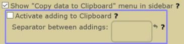</a> 
		If you want to use this feature, you have to activate the parameter.  
		For example: 
		1. Copy a GC Code to clipboard 
		2. Than add a further GC Code to clipboard 
		3. Then paste the content of the clipboard with the keys on the keyboard "Strg" ("Ctrl") and "v"  
		  
	</li>
	<li>
		<strong>Fix:</strong> [Cache listing] Display favorite percent and own favorite point in cache listing again. [<a href="https://github.com/2Abendsegler/GClh/issues/1366" title="Issue 1366">1366</a> / <a href="https://www.geocaching.com/profile/?u=2Abendsegler" title="Thanks to 2Abendsegler">2Abendsegler</a>] 
		  
	</li>
	<li>
		<strong>Fix:</strong> [Cache listing] "Photo file name" in "Copy Data to Clipboard" feature in cache listings use invalid characters. [<a href="https://github.com/2Abendsegler/GClh/issues/1348" title="Issue 1348">1348</a> / <a href="https://www.geocaching.com/profile/?u=2Abendsegler" title="Thanks to 2Abendsegler">2Abendsegler</a>]  
	</li>
	<li>
		<strong>Fix:</strong> [Cache listing] For basic member the dropdown menu in premium cache listings are not aligned properly. [<a href="https://github.com/2Abendsegler/GClh/issues/1435" title="Issue 1435">1435</a> / <a href="https://www.geocaching.com/profile/?u=2Abendsegler" title="Thanks to 2Abendsegler">2Abendsegler</a>]  
	</li>
</ul>
 

### Owner Dashboard:
<ul>
	<li>
		<strong>New:</strong> [Owner Dashboard] Add links to cachetypes. [<a href="https://github.com/2Abendsegler/GClh/issues/1377" title="Issue 1377">1377</a> / <a href="https://www.geocaching.com/profile/?u=capoaira" title="Thanks to capoaira">capoaira</a>] 
		  
	</li>
	<li>
		<strong>New:</strong> [Owner Dashboard] Add link to own profile. [<a href="https://github.com/2Abendsegler/GClh/issues/1402" title="Issue 1402">1402</a> / <a href="https://www.geocaching.com/profile/?u=capoaira" title="Thanks to capoaira">capoaira</a>] 
		  
	</li>
	<li>
		<strong>New:</strong> [Owner Dashboard] Build up the new links in Linklist. [<a href="https://github.com/2Abendsegler/GClh/issues/1384" title="Issue 1384">1384</a> / <a href="https://www.geocaching.com/profile/?u=2Abendsegler" title="Thanks to 2Abendsegler">2Abendsegler</a>] 
		  
	</li>
	<li>
		<strong>New:</strong> [Owner Dashboard] Build header with navigation menu and Linklist. [<a href="https://github.com/2Abendsegler/GClh/issues/1382" title="Issue 1382">1382</a> / <a href="https://www.geocaching.com/profile/?u=2Abendsegler" title="Thanks to 2Abendsegler">2Abendsegler</a>]  
	</li>
</ul>
 

### New Dashboard:
<ul>
	<li>
		<strong>New:</strong> [New Dashboard] Create direct "Edit log"-links on the dashboard to make logs editable without an extra-step. [<a href="https://github.com/2Abendsegler/GClh/issues/1353" title="Issue 1353">1353</a> / <a href="https://www.geocaching.com/profile/?u=2Abendsegler" title="Thanks to 2Abendsegler">2Abendsegler</a>] 
		  
	</li>
	<li>
		<strong>Fix:</strong> [New Dashboard] Unpublished caches in new dashboard have disappeared. [<a href="https://github.com/2Abendsegler/GClh/issues/1371" title="Issue 1371">1371</a> / <a href="https://www.geocaching.com/profile/?u=capoaira" title="Thanks to capoaira">capoaira</a>] 
		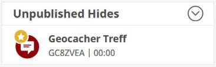  
	</li>
</ul>
 

### Others:
<ul>
	<li>
		<strong>New:</strong> [Header] Get asynchron header replacement only once a day to speed up loading page. [<a href="https://github.com/2Abendsegler/GClh/issues/1427" title="Issue 1427">1427</a> / <a href="https://www.geocaching.com/profile/?u=2Abendsegler" title="Thanks to 2Abendsegler">2Abendsegler</a>]  
	</li>
	<li>
		<strong>New:</strong> [Wonders of the World] Build header with navigation menu and Linklist. [<a href="https://github.com/2Abendsegler/GClh/issues/1382" title="Issue 1382">1382</a> / <a href="https://www.geocaching.com/profile/?u=2Abendsegler" title="Thanks to 2Abendsegler">2Abendsegler</a>]  
	</li>
	<li>
		<strong>Fix:</strong> [New Drafts] Wrong link to cache listing. [<a href="https://github.com/2Abendsegler/GClh/issues/1415" title="Issue 1415">1415</a> / <a href="https://www.geocaching.com/profile/?u=2Abendsegler" title="Thanks to 2Abendsegler">2Abendsegler</a>] 
		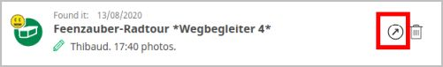  
	</li>
	<li>
		<strong>Fix:</strong> [TB map] Resizable TB-Map does not work. [<a href="https://github.com/2Abendsegler/GClh/issues/1287" title="Issue 1287">1287</a> / <a href="https://www.geocaching.com/profile/?u=2Abendsegler" title="Thanks to 2Abendsegler">2Abendsegler</a>] 
		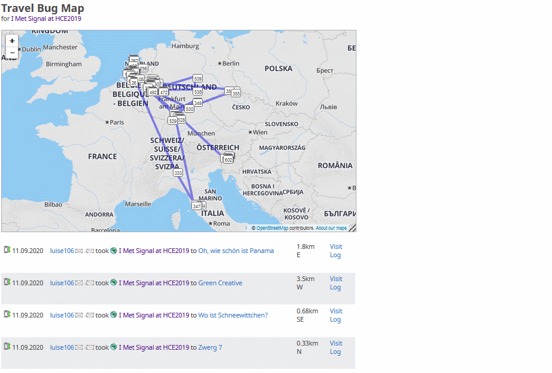  
	</li>
	<li>
		<strong>Fix:</strong> [New log form] Correct position of date. [<a href="https://github.com/2Abendsegler/GClh/issues/1406" title="Issue 1406">1406</a> / <a href="https://www.geocaching.com/profile/?u=2Abendsegler" title="Thanks to 2Abendsegler">2Abendsegler</a>]  
	</li>
	<li>
		<strong>Fix:</strong> [TB upload] Incorrect navigation menu location on page upload trackable log image. [<a href="https://github.com/2Abendsegler/GClh/issues/1347" title="Issue 1347">1347</a> / <a href="https://www.geocaching.com/profile/?u=2Abendsegler" title="Thanks to 2Abendsegler">2Abendsegler</a>]  
	</li>
	<li>
		<strong>Fix:</strong> [Menu] Mark new entries in navigation menu. [<a href="https://github.com/2Abendsegler/GClh/issues/1385" title="Issue 1385">1385</a> / <a href="https://www.geocaching.com/profile/?u=2Abendsegler" title="Thanks to 2Abendsegler">2Abendsegler</a>] 
	</li>
</ul>
 
 
(12.09.2020) 
released by <a href="https://www.geocaching.com/profile/?u=2Abendsegler">2Abendsegler</a> 
 

---
## v0.10.7:
<ul>
	<li>
		<strong>New:</strong> Show weekday for community celebration events. [<a href="https://github.com/2Abendsegler/GClh/issues/1352" title="Issue 1352">1352</a> / <a href="https://www.geocaching.com/profile/?u=capoaira" title="Thanks to capoaira">capoaira</a>]  
	</li>
	<li>
		<strong>Fix:</strong> "Submit" corrected coordinates does not react. [<a href="https://github.com/2Abendsegler/GClh/issues/1360" title="Issue 1360">1360</a> / <a href="https://www.geocaching.com/profile/?u=2Abendsegler" title="Thanks to 2Abendsegler">2Abendsegler</a>] 
	</li>
	<li>
		<strong>Fix:</strong> Cache listing page is very slow. [<a href="https://github.com/2Abendsegler/GClh/issues/1358" title="Issue 1358">1358</a> / <a href="https://www.geocaching.com/profile/?u=2Abendsegler" title="Thanks to 2Abendsegler">2Abendsegler</a>] 
	</li>
	<li>
		<strong>Fix:</strong> [New Map] GClh doesn't work on new map page. [<a href="https://github.com/2Abendsegler/GClh/issues/1356" title="Issue 1356">1356</a> / <a href="https://www.geocaching.com/profile/?u=2Abendsegler" title="Thanks to 2Abendsegler">2Abendsegler</a>] 
	</li>
	<li>
		<strong>Fix:</strong> Logs shown twice with disabled VIP list. [<a href="https://github.com/2Abendsegler/GClh/issues/1350" title="Issue 1350">1350</a> / <a href="https://www.geocaching.com/profile/?u=Ruko2010" title="Thanks to Ruko2010">Ruko2010</a>] 
	</li>
	<li>
		<strong>Fix:</strong> [New Map] Wrong position of "size" area in detail screen of a cache on new map page. [<a href="https://github.com/2Abendsegler/GClh/issues/1349" title="Issue 1349">1349</a> / <a href="https://www.geocaching.com/profile/?u=2Abendsegler" title="Thanks to 2Abendsegler">2Abendsegler</a>] 
	</li>
	<li>
		<strong>Fix:</strong> Scroll Bar at statistik page is missing respectively number of caches not recognizable everywhere. [<a href="https://github.com/2Abendsegler/GClh/issues/1344" title="Issue 1344">1344</a> / <a href="https://www.geocaching.com/profile/?u=2Abendsegler" title="Thanks to 2Abendsegler">2Abendsegler</a>] 
	</li>
</ul>
 
(07.06.2020) 
released by <a href="https://www.geocaching.com/profile/?u=2Abendsegler">2Abendsegler</a> 
 

---
## v0.10.6:
<ul>
	<li>
		<strong>New:</strong> Build coords related functions also on unpublished caches. [<a href="https://github.com/2Abendsegler/GClh/issues/1305" title="Issue 1305">1305</a> / <a href="https://www.geocaching.com/profile/?u=Ruko2010" title="Thanks to Ruko2010">Ruko2010</a>] 
		  
	</li>
	<li>
		<strong>New:</strong> New placeholder cache type for own stuff in copy to clipboard menu in cache listing #GCType#. [<a href="https://github.com/2Abendsegler/GClh/issues/1327" title="Issue 1327">1327</a> / <a href="https://www.geocaching.com/profile/?u=2Abendsegler" title="Thanks to 2Abendsegler">2Abendsegler</a>] 
		<a href="https://www.geocaching.com/my/#GClhShowConfig#a#settings_show_copydata_menu" title="Link to your GClh Config">Settings -> Listing</a>  
	</li>
	<li>
		<strong>New:</strong> Add parameter to show radius around caches on Flopp's Map. [<a href="https://github.com/2Abendsegler/GClh/issues/1334" title="Issue 1334">1334</a> / <a href="https://www.geocaching.com/profile/?u=Ruko2010" title="Thanks to Ruko2010">Ruko2010</a>] 
		 
		<a href="https://www.geocaching.com/my/#GClhShowConfig#a#settings_show_radius_on_flopps" title="Link to your GClh Config">Settings -> Listing: 
		</a>  
	</li>	
	<li>
		<strong>New:</strong> Optionally display coordinates in extended map info. [<a href="https://github.com/2Abendsegler/GClh/issues/1330" title="Issue 1330">1330</a> / <a href="https://www.geocaching.com/profile/?u=2Abendsegler" title="Thanks to 2Abendsegler">2Abendsegler</a>] 
		<a href="https://www.geocaching.com/my/#GClhShowConfig#a#settings_show_enhanced_map_coords" title="Link to your GClh Config">Settings -> Map - Enhanced Map Popup: 
		</a>  
	</li>
	<li>
		<strong>Fix:</strong> Flopp's Map distance line between coords and corrected coords does not work. [<a href="https://github.com/2Abendsegler/GClh/issues/1334" title="Issue 1334">1334</a> / <a href="https://www.geocaching.com/profile/?u=Ruko2010" title="Thanks to Ruko2010">Ruko2010</a>] 
	</li>
	<li>
		<strong>Fix:</strong> Favorits percentage for copy to clipboard is not recognized if it is <1% #FavoPerc#. [<a href="https://github.com/2Abendsegler/GClh/issues/1325" title="Issue 1325">1325</a> / <a href="https://www.geocaching.com/profile/?u=2Abendsegler" title="Thanks to 2Abendsegler">2Abendsegler</a>] 
	</li>
	<li>
		<strong>Fix:</strong> Empty personal cache note for copy to clipboard is not always recognized #GCNote#.  [<a href="https://github.com/2Abendsegler/GClh/issues/1324" title="Issue 1324">1324</a> / <a href="https://www.geocaching.com/profile/?u=2Abendsegler" title="Thanks to 2Abendsegler">2Abendsegler</a>] 
	</li>
</ul>
 
(07.05.2020) 
released by <a href="https://www.geocaching.com/profile/?u=2Abendsegler">2Abendsegler</a> 
 

---
## v0.10.5:
<ul>
	<li>
		<strong>New:</strong> New placeholders for own stuff in copy to clipboard menu in cache listing. [<a href="https://github.com/2Abendsegler/GClh/issues/1308" title="Issue 1308">1308</a> / <a href="https://www.geocaching.com/profile/?u=Herr-Ma" title="Thanks to Herr-Ma">Herr-Ma</a> / <a href="https://www.geocaching.com/profile/?u=2Abendsegler" title="Thanks to 2Abendsegler">2Abendsegler</a>] 
		  
		<strong>New:</strong> Multi entries for own stuff in copy to clipboard menu in cache listing. [<a href="https://github.com/2Abendsegler/GClh/issues/1309" title="Issue 1309">1309</a> / <a href="https://www.geocaching.com/profile/?u=2Abendsegler" title="Thanks to 2Abendsegler">2Abendsegler</a>] 
		You can create for example something like this. 
		<a href="https://www.geocaching.com/my/#GClhShowConfig#a#settings_show_copydata_menu" title="Link to your GClh Config">Settings -> Listing: 
		</a> 
		Cache Listing: 
		 
		Clipboard: 
		  
	</li>
	<li>
		<strong>New:</strong> Download current config as txt-file. [<a href="https://github.com/2Abendsegler/GClh/issues/1312" title="Issue 1312">1312</a> / <a href="https://www.geocaching.com/profile/?u=Ruko2010" title="Thanks to Ruko2010">Ruko2010</a>] 
		<a href="//#GClhShowSync" title="Link to your GClh Sync">GClh Sync 
		</a> 
		 
		  
	</li>
	<li>
		<strong>New:</strong> [New Map] Button to Google Maps, Flopps, ... [<a href="https://github.com/2Abendsegler/GClh/issues/961" title="Issue 961">961</a> / <a href="https://www.geocaching.com/profile/?u=2Abendsegler" title="Thanks to 2Abendsegler">2Abendsegler</a>] 
		 
		<a href="https://www.geocaching.com/my/#GClhShowConfig#a#settings_hide_left_sidebar_on_google_maps" title="Link to your GClh Config">Settings -> Map: 
		</a> 
		The parameters are not new, they are already used on browse map.   
	</li>
	<li>
		<strong>New:</strong> [New Map] Set link to owner. [<a href="https://github.com/2Abendsegler/GClh/issues/1315" title="Issue 1315">1315</a> / <a href="https://www.geocaching.com/profile/?u=capoaira" title="Thanks to capoaira">capoaira</a>] 
		  
	</li>
	<li>
		<strong>New:</strong> [New Map] Relocate button "Browse geocaches" on search map to the other buttons. [<a href="https://github.com/2Abendsegler/GClh/issues/1282" title="Issue 1282">1282</a> / <a href="https://www.geocaching.com/profile/?u=2Abendsegler" title="Thanks to 2Abendsegler">2Abendsegler</a>] 
		 
		<a href="https://www.geocaching.com/my/#GClhShowConfig#a#settings_relocate_other_map_buttons" title="Link to your GClh Config">Settings -> Map: 
		</a>  
	</li>
	<li>
		<strong>New:</strong> [Browse Map] Relocate button "Search geocaches" on browse map to the other buttons. [<a href="https://github.com/2Abendsegler/GClh/issues/1272" title="Issue 1272">1272</a> / <a href="https://www.geocaching.com/profile/?u=2Abendsegler" title="Thanks to 2Abendsegler">2Abendsegler</a>] 
		 
		<a href="https://www.geocaching.com/my/#GClhShowConfig#a#settings_relocate_other_map_buttons" title="Link to your GClh Config">Settings -> Map: 
		</a>  
	</li>
	<li>
		<strong>New:</strong> [Browse Map] Show coordinates in additional popup. [<a href="https://github.com/2Abendsegler/GClh/issues/1279" title="Issue 1279">1279</a> / <a href="https://www.geocaching.com/profile/?u=2Abendsegler" title="Thanks to 2Abendsegler">2Abendsegler</a>] 
		  
	</li>
	<li>
		<strong>New:</strong> Show number of words behind the loglength. [<a href="https://github.com/2Abendsegler/GClh/issues/1273" title="Issue 1273">1273</a> / <a href="https://www.geocaching.com/profile/?u=capoaira" title="Thanks to capoaira">capoaira</a>] 
		Old log form: 
		 
		New log form: 
		</a>  
	</li>
	<li>
		<strong>New:</strong> Build possible links of found and hidden caches in Linklist. [<a href="https://github.com/2Abendsegler/GClh/issues/1271" title="Issue 1271">1271</a> / <a href="https://www.geocaching.com/profile/?u=2Abendsegler" title="Thanks to 2Abendsegler">2Abendsegler</a>] 
		<a href="https://www.geocaching.com/my/#GClhShowConfig#a#ll#settings_bookmarks_top_menu_h" title="Link to your GClh Config">Settings -> Linklist / Navigation: 
		</a> 
		If you want to use it in your Linklist, you have to set it.  
	</li>
	<li>
		<strong>New:</strong> Note whether nearby events on dashboard are opened or closed. [<a href="https://github.com/2Abendsegler/GClh/issues/1270" title="Issue 1270">1270</a> / <a href="https://www.geocaching.com/profile/?u=2Abendsegler" title="Thanks to 2Abendsegler">2Abendsegler</a>]  
	</li>
	<li>
		<strong>New:</strong> Refactor helper functions. [<a href="https://github.com/2Abendsegler/GClh/issues/772" title="Issue 772">772</a> / <a href="https://www.geocaching.com/profile/?u=2Abendsegler" title="Thanks to 2Abendsegler">2Abendsegler</a>]  
	</li>
	<li>
		<strong>Fix:</strong> [New Map] Compact layout for new fields "placed date". [<a href="https://github.com/2Abendsegler/GClh/issues/1277" title="Issue 1277">1277</a> / <a href="https://www.geocaching.com/profile/?u=2Abendsegler" title="Thanks to 2Abendsegler">2Abendsegler</a>] 
	</li>
	<li>
		<strong>Fix:</strong> [New Map] Search Map output of "undefined" behind the favorite points. [<a href="https://github.com/2Abendsegler/GClh/issues/1268" title="Issue 1268">1268</a> / <a href="https://www.geocaching.com/profile/?u=Ruko2010" title="Thanks to Ruko2010">Ruko2010</a> / <a href="https://www.geocaching.com/profile/?u=2Abendsegler" title="Thanks to 2Abendsegler">2Abendsegler</a>] 
	</li>
	<li>
		<strong>Fix:</strong> Load trackables faster without images does not work correct. [<a href="https://github.com/2Abendsegler/GClh/issues/1297" title="Issue 1297">1297</a> / <a href="https://www.geocaching.com/profile/?u=2Abendsegler" title="Thanks to 2Abendsegler">2Abendsegler</a>] 
	</li>
	<li>
		<strong>Fix:</strong> Parsing error on reset functionality. [<a href="https://github.com/2Abendsegler/GClh/issues/1294" title="Issue 1294">1294</a> / <a href="https://www.geocaching.com/profile/?u=2Abendsegler" title="Thanks to 2Abendsegler">2Abendsegler</a>] 
	</li>
	<li>
		<strong>Fix:</strong> Key F2 deletes personal note in cache listing. [<a href="https://github.com/2Abendsegler/GClh/issues/1281" title="Issue 1281">1281</a> / <a href="https://www.geocaching.com/profile/?u=2Abendsegler" title="Thanks to 2Abendsegler">2Abendsegler</a>] 
	</li>
	<li>
		<strong>Fix:</strong> The alignment of the new logging form is not correct. [<a href="https://github.com/2Abendsegler/GClh/issues/1290" title="Issue 1290">1290</a> / <a href="https://www.geocaching.com/profile/?u=2Abendsegler" title="Thanks to 2Abendsegler">2Abendsegler</a>] 
	</li>
	<li>
		<strong>Fix:</strong> Hide Facebook login doesn't run, again. [<a href="https://github.com/2Abendsegler/GClh/issues/1306" title="Issue 1306">1306</a> / <a href="https://www.geocaching.com/profile/?u=2Abendsegler" title="Thanks to 2Abendsegler">2Abendsegler</a>] 
	</li>
</ul>
 
(13.03.2020) 
released by <a href="https://www.geocaching.com/profile/?u=2Abendsegler">2Abendsegler</a> 
 

---
## v0.10.4:
<ul>
	<li>
		<strong>Fix:</strong> Errors due to the current GDPR (General Data Protection Regulation) changes of GS. [<a href="https://www.geocaching.com/profile/?u=2Abendsegler" title="Thanks to 2Abendsegler">2Abendsegler</a>] 
		<ul>
			<li>
				Clicks on the latest logs icons or the log icons in the VIP tables do not work. [<a href="https://github.com/2Abendsegler/GClh/issues/1193" title="Issue 1193">1193</a>] 
			</li>
			<li>
				The alignment of the new logging form is not correct. [<a href="https://github.com/2Abendsegler/GClh/issues/1248" title="Issue 1248">1248</a>] 
			</li>
			<li>
				On new Lists page, GClh header with Linklist ... does not load. [<a href="https://github.com/2Abendsegler/GClh/issues/1227" title="Issue 1227">1227</a>] 
			</li>
			<li>
				Some unnecessary sliders have recently been added to statistical data. [<a href="https://github.com/2Abendsegler/GClh/issues/1201" title="Issue 1201">1201</a>] 
			</li>
			<li>
				Show both tabs in list of pocket queries of one page does not work. [<a href="https://github.com/2Abendsegler/GClh/issues/1214" title="Issue 1214">1214</a>] 
			</li>
			<li>
				The TB autovisit feature on the old log page does not work. [<a href="https://github.com/2Abendsegler/GClh/issues/1205" title="Issue 1205">1205</a>] 
			</li>
			<li>
				At latest logs in cache listing, title of picture is shown as a second box next to the log. [<a href="https://github.com/2Abendsegler/GClh/issues/1191" title="Issue 1191">1191</a>] 
			</li>
			<li>
				The alignment of the "saved" information in the "One click watching" feature is not correct. [<a href="https://github.com/2Abendsegler/GClh/issues/1261" title="Issue 1261">1261</a>] 
			</li>
			<li>
				Show number of active pocket queries does not work. [<a href="https://github.com/2Abendsegler/GClh/issues/1216" title="Issue 1216">1216</a>] 
			</li>
			<li>
				On new Lists page, GClh does not work correct. [<a href="https://github.com/2Abendsegler/GClh/issues/1228" title="Issue 1228">1228</a>] 
			</li>
			<li>
				Edge no longer works with GClh. [<a href="https://github.com/2Abendsegler/GClh/issues/1251" title="Issue 1251">1251</a>]  
			</li>
		</ul>
	</li>
</ul>

### Search Map:
<ul>
	<li>
		<strong>New:</strong> [New Map] Own area on detail screen. [<a href="https://github.com/2Abendsegler/GClh/issues/964" title="Issue 964">964</a> / <a href="https://www.geocaching.com/profile/?u=Ruko2010" title="Thanks to Ruko2010">Ruko2010</a>] 
		<strong>New:</strong> [New Map] Copy GC-Code to clipboard. [<a href="https://github.com/2Abendsegler/GClh/issues/1196" title="Issue 1196">1196</a> / <a href="https://www.geocaching.com/profile/?u=Ruko2010" title="Thanks to Ruko2010">Ruko2010</a>] 
		<strong>New:</strong> [New Map] Show Elevation in Cache Details. [<a href="https://github.com/2Abendsegler/GClh/issues/953" title="Issue 953">953</a> / <a href="https://www.geocaching.com/profile/?u=Ruko2010" title="Thanks to Ruko2010">Ruko2010</a>] 
		  
	</li>
	<li>
		<strong>New:</strong> [New Map] Compact layout on detail screens. [<a href="https://github.com/2Abendsegler/GClh/issues/965" title="Issue 965">965</a> / <a href="https://www.geocaching.com/profile/?u=capoaira" title="Thanks to capoaira">capoaira</a> / <a href="https://www.geocaching.com/profile/?u=2Abendsegler" title="Thanks to 2Abendsegler">2Abendsegler</a>] 
		 
		 
		 
		 
		<a href="https://www.geocaching.com/my/#GClhShowConfig#a#settings_searchmap_compact_layout" title="Link to your GClh Config">Settings -> Map: 
		</a>  
	</li>
	<li>
		<strong>New:</strong> [New Map] After go back from cache details to cache list, scroll to last position. [<a href="https://github.com/2Abendsegler/GClh/issues/1247" title="Issue 1247">1247</a> / <a href="https://www.geocaching.com/profile/?u=2Abendsegler" title="Thanks to 2Abendsegler">2Abendsegler</a>] 
		  
	</li>
	<li>
		<strong>New:</strong> [New Map] Show hint automatically. [<a href="https://github.com/2Abendsegler/GClh/issues/1199" title="Issue 1199">1199</a> / <a href="https://www.geocaching.com/profile/?u=capoaira" title="Thanks to capoaira">capoaira</a>] 
		 
		<a href="https://www.geocaching.com/my/#GClhShowConfig#a#settings_searchmap_show_hint" title="Link to your GClh Config">Settings -> Map: 
		</a> 
		If you want to use this feature, you have to activate the parameter.  
	</li>
	<li>
		<strong>New:</strong> [New Map] Show button to collapse activity. [<a href="https://github.com/2Abendsegler/GClh/issues/1198" title="Issue 1198">1198</a> / <a href="https://www.geocaching.com/profile/?u=capoaira" title="Thanks to capoaira">capoaira</a>] 
		  
	</li>
	<li>
		<strong>New:</strong> [New Map] Strike through title of disabled caches. [<a href="https://github.com/2Abendsegler/GClh/issues/1197" title="Issue 1197">1197</a> / <a href="https://www.geocaching.com/profile/?u=capoaira" title="Thanks to capoaira">capoaira</a>] 
		 
		<a href="https://www.geocaching.com/my/#GClhShowConfig#a#settings_searchmap_disabled" title="Link to your GClh Config">Settings -> Map: 
		</a> 
		If you want to use this feature, you have to activate the parameter.  
	</li>
	<li>
		<strong>New:</strong> [New Map] Adapt the width of the pop up. [<a href="https://github.com/2Abendsegler/GClh/issues/1219" title="Issue 1219">1219</a> / <a href="https://www.geocaching.com/profile/?u=capoaira" title="Thanks to capoaira">capoaira</a>] 
		There is a pop up when you select an icon in the new map with the right mouse button.
		  
	</li>
</ul>	

### Cache Listing:
<ul>
	<li>
		<strong>New:</strong> Add right mouse click to "Add to list" to open screen "Create a Bookmark". [<a href="https://github.com/2Abendsegler/GClh/issues/1259" title="Issue 1259">1259</a> / <a href="https://www.geocaching.com/profile/?u=2Abendsegler" title="Thanks to 2Abendsegler">2Abendsegler</a>] 
		This function was last deactivated by GS. 
		 
		  
	</li>
	<li>
		<strong>New:</strong> Show own specified entry in menu of copy data to clipboard. [<a href="https://github.com/2Abendsegler/GClh/issues/1253" title="Issue 1253">1253</a> / <a href="https://www.geocaching.com/profile/?u=2Abendsegler" title="Thanks to 2Abendsegler">2Abendsegler</a>] 
		With this feature you can generate an entry in the menu "Copy Data to Clipbord" for example to build file names of cache-specific photos. 
		 
		<a href="https://www.geocaching.com/my/#GClhShowConfig#a#settings_show_copydata_own_stuff_show" title="Link to your GClh Config">Settings -> Listing: 
		</a> 
		If you want to use this feature, you have to customize the feature and you have to activate the parameter. 
		If you click to the entry in menu "Copy Data to Clipbord", something like this could be in the clipboard. 
		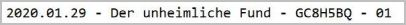  
	</li>
	<li>
		<strong>New:</strong> Consider script GCTour also in feature "copy corrected coordinates". [<a href="https://github.com/2Abendsegler/GClh/issues/1200" title="Issue 1200">1200</a> / <a href="https://www.geocaching.com/profile/?u=2Abendsegler" title="Thanks to 2Abendsegler">2Abendsegler</a>] 
		  
	</li>
</ul>

### Others:
<ul>
	<li>
		<strong>New:</strong> Make "copy to clipboard" a function to reduce code duplication. [<a href="https://github.com/2Abendsegler/GClh/issues/1195" title="Issue 1195">1195</a> / <a href="https://www.geocaching.com/profile/?u=Ruko2010" title="Thanks to Ruko2010">Ruko2010</a>] 
	</li>
	<li>
		<strong>New:</strong> Implement the newer GC logo in all page headers. [<a href="https://github.com/2Abendsegler/GClh/issues/1237" title="Issue 1237">1237</a> / <a href="https://www.geocaching.com/profile/?u=2Abendsegler" title="Thanks to 2Abendsegler">2Abendsegler</a>] 
	</li>
	<li>
		<strong>New:</strong> Remove all links to unsecure pages. [<a href="https://github.com/2Abendsegler/GClh/issues/1037" title="Issue 1037">1037</a> / <a href="https://www.geocaching.com/profile/?u=2Abendsegler" title="Thanks to 2Abendsegler">2Abendsegler</a>]  
	</li>
	<li>
		<strong>New:</strong> Update Overview/Screenshots. [<a href="https://github.com/2Abendsegler/GClh/issues/661" title="Issue 661">661</a> / <a href="https://www.geocaching.com/profile/?u=2Abendsegler" title="Thanks to 2Abendsegler">2Abendsegler</a>]  
	</li>
	<li>
		<strong>Fix:</strong> Unpublished hides were shown in recently viewed list after an update from GS. [<a href="https://github.com/2Abendsegler/GClh/issues/1220" title="Issue 1220">1220</a> / <a href="https://www.geocaching.com/profile/?u=capoaira" title="Thanks to capoaira">capoaira</a>] 
	</li>
	<li>
		<strong>Fix:</strong> Cache listing, the "hidden or found by" links for a user with "+" in name does not work. [<a href="https://github.com/2Abendsegler/GClh/issues/1233" title="Issue 1233">1233</a> / <a href="https://www.geocaching.com/profile/?u=2Abendsegler" title="Thanks to 2Abendsegler">2Abendsegler</a>] 
	</li>
	<li>
		<strong>Fix:</strong> Do not allow GClh Config or GClh Sync on new map page. [<a href="https://github.com/2Abendsegler/GClh/issues/1207" title="Issue 1207">1207</a> / <a href="https://www.geocaching.com/profile/?u=2Abendsegler" title="Thanks to 2Abendsegler">2Abendsegler</a>] 
	</li>
	<li>
		<strong>Fix:</strong> Correct Mystery radius for Flopp's Map. [<a href="https://github.com/2Abendsegler/GClh/issues/1212" title="Issue 1212">1212</a> / <a href="https://www.geocaching.com/profile/?u=ztNFny" title="Thanks to ztNFny">ztNFny</a>] 
	</li>
	<li>
		<strong>Fix:</strong> Allow Find Player on new map page. [<a href="https://github.com/2Abendsegler/GClh/issues/1209" title="Issue 1209">1209</a> / <a href="https://www.geocaching.com/profile/?u=2Abendsegler" title="Thanks to 2Abendsegler">2Abendsegler</a>] 
	</li>
	<li>
		<strong>Fix:</strong> [New Map] The parameter for strike through disabled caches is ignored. [<a href="https://github.com/2Abendsegler/GClh/issues/1250" title="Issue 1250">1250</a> / <a href="https://www.geocaching.com/profile/?u=2Abendsegler" title="Thanks to 2Abendsegler">2Abendsegler</a>] 
	</li>
	<li>
		<strong>Fix:</strong> Type error on description and hint page of new search map. [<a href="https://github.com/2Abendsegler/GClh/issues/1263" title="Issue 1263">1263</a> / <a href="https://www.geocaching.com/profile/?u=2Abendsegler" title="Thanks to 2Abendsegler">2Abendsegler</a>] 
	</li>
</ul>
 
(13.02.2020) 
released by <a href="https://www.geocaching.com/profile/?u=2Abendsegler">2Abendsegler</a> 
 

---
## v0.10.3:
<ul>
	<li>
		<strong>Fix:</strong> Errors due to the current GDPR (General Data Protection Regulation) changes of GS. [<a href="https://www.geocaching.com/profile/?u=2Abendsegler" title="Thanks to 2Abendsegler">2Abendsegler</a>] 
		<ul>
			<li>
				Copy corrected coordinates to clipboard does not work. [<a href="https://github.com/2Abendsegler/GClh/issues/1179" title="Issue 1179">1179</a>] 
			</li>
			<li>
				All routing services in cache listing do not work proper. [<a href="https://github.com/2Abendsegler/GClh/issues/1181" title="Issue 1181">1181</a>] 
			</li>
			<li>
				Determination of elevation data does not work. [<a href="https://github.com/2Abendsegler/GClh/issues/1180" title="Issue 1180">1180</a>] 
			</li>
			<li>
				Improve add to list in cache listing does not work. [<a href="https://github.com/2Abendsegler/GClh/issues/1182" title="Issue 1182">1182</a>] 
			</li>
			<li>
				Jump directly into one of the profile tabs does not work. [<a href="https://github.com/2Abendsegler/GClh/issues/1162" title="Issue 1162">1162</a>] 
			</li>
			<li>
				Error when you open a TB-Listing without logs. [<a href="https://github.com/2Abendsegler/GClh/issues/1169" title="Issue 1169">1169</a>] 
			</li>
			<li>
				Automatically adopt uid of own trackables in GClh does not work. [<a href="https://github.com/2Abendsegler/GClh/issues/1166" title="Issue 1166">1166</a>] 
			</li>
			<li>
				Automatically adopt home coordinates in GClh does not work. [<a href="https://github.com/2Abendsegler/GClh/issues/1165" title="Issue 1165">1165</a>] 
			</li>
			<li>
				Set default language does not work in cache listing. [<a href="https://github.com/2Abendsegler/GClh/issues/1161" title="Issue 1161">1161</a>]  
			</li>
		</ul>
	</li>
	<li>
		<strong>New:</strong> Show length of logtext on new logging page. [<a href="https://github.com/2Abendsegler/GClh/issues/1143" title="Issue 1143">1143</a> / <a href="https://www.geocaching.com/profile/?u=capoaira" title="Thanks to capoaira">capoaira</a>] 
		 
		<a href="https://www.geocaching.com/my/#GClhShowConfig#a#settings_improve_character_counter" title="Link to your GClh Config">Settings -> Logging: 
		</a>  
	</li>
	<li>
		<strong>New:</strong> Show length of hint, cachename and placed by on hide edit page. [<a href="https://github.com/2Abendsegler/GClh/issues/1143" title="Issue 1143">1143</a> / <a href="https://www.geocaching.com/profile/?u=capoaira" title="Thanks to capoaira">capoaira</a>] 
		 
		</a>  
	</li>
	<li>
		<strong>Fix:</strong> No automatic cache loading if map comes from 81 matrix statistic. [<a href="https://github.com/2Abendsegler/GClh/issues/1172" title="Issue 1172">1172</a> / <a href="https://www.geocaching.com/profile/?u=2Abendsegler" title="Thanks to 2Abendsegler">2Abendsegler</a>] 
	</li>
	<li>
		<strong>Fix:</strong> Link "Search Map" in Linklist is wrong. [<a href="https://github.com/2Abendsegler/GClh/issues/1163" title="Issue 1163">1163</a> / <a href="https://www.geocaching.com/profile/?u=2Abendsegler" title="Thanks to 2Abendsegler">2Abendsegler</a>] 
	</li>
	<li>
		<strong>Fix:</strong> Show the searched caches from the 81 matrix in a map doesn't work. [<a href="https://github.com/2Abendsegler/GClh/issues/1168" title="Issue 1168">1168</a> / <a href="https://www.geocaching.com/profile/?u=2Abendsegler" title="Thanks to 2Abendsegler">2Abendsegler</a>] 
	</li>
	<li>
		<strong>Fix:</strong> Menu misaligned on page "Edit your Trackable". [<a href="https://github.com/2Abendsegler/GClh/issues/1174" title="Issue 1174">1174</a> / <a href="https://www.geocaching.com/profile/?u=2Abendsegler" title="Thanks to 2Abendsegler">2Abendsegler</a>] 
	</li>
</ul>
 
(09.01.2020) 
released by <a href="https://www.geocaching.com/profile/?u=2Abendsegler">2Abendsegler</a> 
 

---
## v0.10.2:
<ul>
	<li>
		<strong>Info:</strong> The blocking of cookiebot.com is no longer necessary for the operation of the GClh.  
	</li>
	<li>
		<strong>Fix:</strong> Errors due to the current GDPR (General Data Protection Regulation) changes of GS. [<a href="https://github.com/2Abendsegler/GClh/issues/1153" title="Issue 1153">1153</a> / <a href="https://www.geocaching.com/profile/?u=2Abendsegler" title="Thanks to 2Abendsegler">2Abendsegler</a>] Many thanks to <a href="https://www.geocaching.com/profile/?u=Chrono81" title="Thanks to Chrono81">Chrono81</a> for the great tip.  
		<ul>
			<li>
				Show favorite percentage in cache listing run into error. 
			</li>
			<li>
				Build map overview in cache listing run into error. 
			</li>
			<li>
				Activate fancybox in cache listing run into error. 
			</li>
			<li>
				Decrypt hints in cache listing run into error. 
			</li>
			<li>
				Replace Log-Loading function in cache listing run into error. 
			</li>
			<li>
				Show thumbnails in cache listing run into ReferenceError. 
			</li>
			<li>
				Hide hints in cache listing behind a link with show/hide do not decrypt.  
			</li>
		</ul>
	</li>
	<li>
		<strong>New:</strong> Show percentage of found caches for every country on statistic map. [<a href="https://github.com/2Abendsegler/GClh/issues/1149" title="Issue 1149">1149</a> / <a href="https://www.geocaching.com/profile/?u=2Abendsegler" title="Thanks to 2Abendsegler">2Abendsegler</a>] 
		 
		<a href="https://www.geocaching.com/my/#GClhShowConfig#a#settings_map_percentage_statistic" title="Link to your GClh Config">Settings -> Public profile: 
		</a>  
	</li>
	<li>
		<strong>New:</strong> Show button to display all, only active or only archived caches in owned caches list. [<a href="https://github.com/2Abendsegler/GClh/issues/1145" title="Issue 1145">1145</a> / <a href="https://www.geocaching.com/profile/?u=capoaira" title="Thanks to capoaira">capoaira</a>] 
		 
		<a href="https://www.geocaching.com/my/#GClhShowConfig#a#settings_show_button_for_hide_archived" title="Link to your GClh Config">Settings -> Others: 
		</a>  
	</li>
	<li>
		<strong>Fix:</strong> Align dropdown menu under main menu. [<a href="https://github.com/2Abendsegler/GClh/issues/1145" title="Issue 1145">1145</a> / <a href="https://www.geocaching.com/profile/?u=2Abendsegler" title="Thanks to 2Abendsegler">2Abendsegler</a>]  
	</li>
	<li>
		<strong>Fix:</strong> Improve print page cache listing with hide disclaimer, decrypt hints, show other coord formats and hide side rights does not run. [<a href="https://github.com/2Abendsegler/GClh/issues/1153" title="Issue 1153">1153</a> / <a href="https://www.geocaching.com/profile/?u=2Abendsegler" title="Thanks to 2Abendsegler">2Abendsegler</a>] 
	</li>
</ul>
 
(05.01.2020) 
released by <a href="https://www.geocaching.com/profile/?u=2Abendsegler">2Abendsegler</a> 
 

---
## v0.10.1:
<ul>
	<li>
		<strong>Info:</strong> Please check your settings for the elevation data. [<a href="https://github.com/2Abendsegler/GClh/issues/1138" title="Issue 1131">1131</a>] 
                Because the number of calls of Google Elevation is limited and Open-Elevation is very slow and sometimes providing erroneous data, Geonames-Elevation has been implemented with version 0.9.15. Geonames-Elevation is very fast and providing almost no erroneous data.  
		Therefore we recommend the following settings. 
<a href="https://www.geocaching.com/my/#GClhShowConfig#a#settings_show_elevation_of_waypoints" title="Link to your GClh Config">Settings -> Listing: 
		</a>  
	</li>
	<li>
		<strong>New:</strong> Show an overflowed username in a cache listing log when hovering over with the mouse. [<a href="https://github.com/2Abendsegler/GClh/issues/1138" title="Issue 1138">1138</a> / <a href="https://www.geocaching.com/profile/?u=2Abendsegler" title="Thanks to 2Abendsegler">2Abendsegler</a>] 
		  
	</li>
	<li>
		<strong>Fix:</strong> One click watching feature doesn't work in other languages than english. [<a href="https://github.com/2Abendsegler/GClh/issues/1129" title="Issue 1129">1129</a> / <a href="https://www.geocaching.com/profile/?u=2Abendsegler" title="Thanks to 2Abendsegler">2Abendsegler</a>] 
	</li>
	<li>
		<strong>Fix:</strong> The add to list loading and success message in cache listing are displaced. [<a href="https://github.com/2Abendsegler/GClh/issues/1133" title="Issue 1133">1133</a> / <a href="https://www.geocaching.com/profile/?u=2Abendsegler" title="Thanks to 2Abendsegler">2Abendsegler</a>] 
	</li>
</ul>
 
(20.12.2019) 
released by <a href="https://www.geocaching.com/profile/?u=2Abendsegler">2Abendsegler</a> 
 

---
## v0.10:

### Cache Listing:
<ul>
	<li>
		<strong>New:</strong> One click ignoring/restoring. [<a href="https://github.com/2Abendsegler/GClh/issues/1053" title="Issue 1053">1053</a> / <a href="https://www.geocaching.com/profile/?u=2Abendsegler" title="Thanks to 2Abendsegler">2Abendsegler</a>] 
		With this feature you will be able to ignore respectively restore a cache in cache listing with only one click. 
		</a> 
		<a href="https://www.geocaching.com/my/#GClhShowConfig#a#settings_use_one_click_ignoring" title="Link to your GClh Config">Settings -> Listing: 
		</a> 
	        The "One click" feature runs only together with the "Show Stop Ignoring" feature. Please note that the "Show Stop Ignoring" feature is not new and you may need to activate the parameter, if you want to use the "One click" feature.  
	</li>
	<li>
		<strong>New:</strong> One click watching. [<a href="https://github.com/2Abendsegler/GClh/issues/1072" title="Issue 1072">1072</a> / <a href="https://www.geocaching.com/profile/?u=2Abendsegler" title="Thanks to 2Abendsegler">2Abendsegler</a>] 
		With this feature you can add a cache in cache listing to your watchlist with just one click. 
		</a> 
		<a href="https://www.geocaching.com/my/#GClhShowConfig#a#settings_use_one_click_watching" title="Link to your GClh Config">Settings -> Listing: 
		</a>  
	</li>
	<li>
		<strong>New:</strong> Copy various cache informations to clipboard. [<a href="https://github.com/2Abendsegler/GClh/issues/1096" title="Issue 1096">1096</a> / <a href="https://www.geocaching.com/profile/?u=Herr Ma" title="Thanks to Herr Ma">Herr Ma</a>] 
		If there are changed coordinates, not only the original coordinates but also the changed coordinates can be copied to the clipboard. 
		 
		<a href="https://www.geocaching.com/my/#GClhShowConfig#a#settings_show_copydata_menu" title="Link to your GClh Config">Settings -> Listing:  
		</a>  
	</li>
	<li>
		<strong>New:</strong> Button to copy coordinates to the clipboard. [<a href="https://github.com/2Abendsegler/GClh/issues/1095" title="Issue 1095">1095</a> / <a href="https://www.geocaching.com/profile/?u=Herr Ma" title="Thanks to Herr Ma">Herr Ma</a>] 
		If there are changed coordinates, the changed coordinates are copied into the clipboard, otherwise the original coordinates. 
		  
	</li>
	<li>
		<strong>New:</strong> Added Openrouteservice as an additional map service. [<a href="https://github.com/2Abendsegler/GClh/issues/897" title="Issue 897">897</a> / <a href="https://www.geocaching.com/profile/?u=2Abendsegler" title="Thanks to 2Abendsegler">2Abendsegler</a>] 
		Openrouteservice also offers in addition to usual mediums for locomotion "wheelchair" as medium for locomotion in europe. 
                </a> 
		You can pick Openrouteservice in cache listing in the right navigation bar, or behind the "Additional Waypoints", if there are additional waypoints. 
                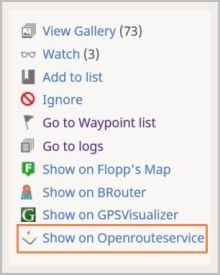</a> 
                </a> 
		<a href="https://www.geocaching.com/my/#GClhShowConfig#a#settings_show_openrouteservice_link" title="Link to your GClh Config">Settings -> Listing: 
		</a> 
		If you want to use your home coordinates as start point for the route, you have to activate the parameter.  
	</li>
        <li>
		<strong>New:</strong> Button for hiding lot of stuff in cache listing logs. [<a href="https://github.com/2Abendsegler/GClh/issues/1045" title="Issue 1045">1045</a> / <a href="https://www.geocaching.com/profile/?u=Ruko2010" title="Thanks to Ruko2010">Ruko2010</a>] 
		The functionality can be used, for example, to compare an external logbook with an online logbook. 
		 
		<a href="https://www.geocaching.com/my/#GClhShowConfig#a#settings_show_compact_logbook_but" title="Link to your GClh Config">Settings -> Listing: 
		</a>  
	</li>
	<li>
		<strong>New:</strong> Hide found counter in cache listing. [<a href="https://github.com/2Abendsegler/GClh/issues/1044" title="Issue 1044">1044</a> / <a href="https://www.geocaching.com/profile/?u=Ruko2010" title="Thanks to Ruko2010">Ruko2010</a>] 
		 
		<a href="https://www.geocaching.com/my/#GClhShowConfig#a#settings_hide_found_count" title="Link to your GClh Config">Settings -> Listing: 
		</a> 
		If you want to use it, you have to activate the parameter.  
	</li>
	<li>
		<strong>New:</strong> Set cache type icon and log status icon in cache listing always visible. [<a href="https://github.com/2Abendsegler/GClh/issues/1110" title="Issue 1110">1110</a> / <a href="https://www.geocaching.com/profile/?u=2Abendsegler" title="Thanks to 2Abendsegler">2Abendsegler</a>] 
		Cache type icon: 
		  
		<a href="https://www.geocaching.com/my/#GClhShowConfig#a#settings_cache_type_icon_visible" title="Link to your GClh Config">Settings -> Listing: 
		</a> 
		Log status icon: 
		  
		<a href="https://www.geocaching.com/my/#GClhShowConfig#a#settings_log_status_icon_visible" title="Link to your GClh Config">Settings -> Listing: 
		</a>  
	</li>
	<li>
		<strong>Fix:</strong> Thunderforest is no longer supported on BRouter and Flopps. [<a href="https://github.com/2Abendsegler/GClh/issues/1041" title="Issue 1041">1041</a> / <a href="https://www.geocaching.com/profile/?u=radlerandi" title="Thanks to radlerandi">radlerandi</a>] 
	</li>
	<li>
		<strong>Fix:</strong> BRouter with empty waypoint in URL. [<a href="https://github.com/2Abendsegler/GClh/issues/1042" title="Issue 1042">1042</a> / <a href="https://www.geocaching.com/profile/?u=2Abendsegler" title="Thanks to 2Abendsegler">2Abendsegler</a>] 
	</li>
	<li>
		<strong>Fix:</strong> The weekday of an event is not shown in disabled events. [<a href="https://github.com/2Abendsegler/GClh/issues/1086" title="Issue 1086">1086</a> / <a href="https://www.geocaching.com/profile/?u=2Abendsegler" title="Thanks to 2Abendsegler">2Abendsegler</a>] 
	</li>
	<li>
		<strong>Fix:</strong> The long VIP list doesn't consider the parameter "Show owner in VIP list". [<a href="https://github.com/2Abendsegler/GClh/issues/1088" title="Issue 1088">1088</a> / <a href="https://www.geocaching.com/profile/?u=2Abendsegler" title="Thanks to 2Abendsegler">2Abendsegler</a>]  
	</li>
</ul>
 

### My Lists, Favorites and Ignored geocaches:
<ul>	
	<li>
		<strong>New:</strong> Integrate GClh header with Linklist and GClh Search in new designed lists page with My Lists, Favorites and Ignored geocaches. [<a href="https://github.com/2Abendsegler/GClh/issues/1052" title="Issue 1052">1052</a> / <a href="https://www.geocaching.com/profile/?u=2Abendsegler" title="Thanks to 2Abendsegler">2Abendsegler</a>] 
		  
	</li>
	<li>
		<strong>New:</strong> Improve new lists pages My Lists, Favorites and Ignored geocaches. [<a href="https://github.com/2Abendsegler/GClh/issues/1119" title="Issue 1119">1119</a> / <a href="https://www.geocaching.com/profile/?u=2Abendsegler" title="Thanks to 2Abendsegler">2Abendsegler</a>] 
		 
		 
		 
		 
		<a href="https://www.geocaching.com/my/#GClhShowConfig#a#settings_lists_compact_layout" title="Link to your GClh Config">Settings -> Bookmark list:  
		</a> 
		If you want to use these features, you have to activate the parameter. 
		<i>Please note, that these pages are still under construction by GS. Changes can also affect our features.</i>  
	</li>
	<li>
		<strong>New:</strong> Add link "Ignore List" for using in Linklist. [<a href="https://github.com/2Abendsegler/GClh/issues/1052" title="Issue 1052">1052</a> / <a href="https://www.geocaching.com/profile/?u=2Abendsegler" title="Thanks to 2Abendsegler">2Abendsegler</a>] 
		<a href="https://www.geocaching.com/my/#GClhShowConfig#a#ll#settings_bookmarks_top_menu_h" title="Link to your GClh Config">Settings -> Linklist / Navigation:  
		</a> 
		If you want to use it in your Linklist, you have to set it.  
	</li>
</ul>
 

### Search map (new map):
<ul>	
	<li>
		<strong>New:</strong> Integrate GClh header with Linklist and GC Search in new designed map page (search map). [<a href="https://github.com/2Abendsegler/GClh/issues/987" title="Issue 987">987</a> / <a href="https://www.geocaching.com/profile/?u=2Abendsegler" title="Thanks to 2Abendsegler">2Abendsegler</a>] 
		  
	</li>
	<li>
		<strong>New:</strong> Virtually hit "Search this area" after dragging the map. [<a href="https://github.com/2Abendsegler/GClh/issues/966" title="Issue 966">966</a> / <a href="https://www.geocaching.com/profile/?u=capoaira" title="Thanks to capoaira">capoaira</a> / <a href="https://www.geocaching.com/profile/?u=2Abendsegler" title="Thanks to 2Abendsegler">2Abendsegler</a>] 
		<a href="https://www.geocaching.com/my/#GClhShowConfig#a#settings_searchmap_autoupdate_after_dragging" title="Link to your GClh Config">Settings -> Map:  
		</a>  
	</li>
	<li>
		<strong>New:</strong> Add link "Search Map" for using in Linklist. [<a href="https://github.com/2Abendsegler/GClh/issues/987" title="Issue 987">987</a> / <a href="https://www.geocaching.com/profile/?u=2Abendsegler" title="Thanks to 2Abendsegler">2Abendsegler</a>] 
		<a href="https://www.geocaching.com/my/#GClhShowConfig#a#ll#settings_bookmarks_top_menu_h" title="Link to your GClh Config">Settings -> Linklist / Navigation:  
		</a> 
		If you want to use it in your Linklist, you have to set it.  
	</li>
</ul>
 

### Browse map (old map):
<ul>	
	<li>
		<strong>New:</strong> Hide DNF smileys by default in browse map (old map). [<a href="https://github.com/2Abendsegler/GClh/issues/1115" title="Issue 1115">1115</a> / <a href="https://www.geocaching.com/profile/?u=capoaira" title="Thanks to capoaira">capoaira</a>] 
		</a> 
		<a href="https://www.geocaching.com/my/#GClhShowConfig#a#settings_map_hide_dnfs" title="Link to your GClh Config">Settings -> Map:  
		</a>  
	</li>
</ul>
 

### Pocket query:
<ul>	
	<li>
		<strong>Improve:</strong> Rewrite fixed PQ header/footer by pure CSS. Compatible with compact view. [<a href="https://github.com/2Abendsegler/GClh/issues/1034" title="Issue 1034">1034</a> / <a href="https://www.geocaching.com/profile/?u=Dratenik" title="Thanks to Dratenik">Dratenik</a>] 
		The functionality is not new. New is only the great functionality. Especially for small screens very well, because the line stays at the bottom of the screen when you scroll through the pocket queries. 
		 
		<a href="https://www.geocaching.com/my/#GClhShowConfig#a#settings_fixed_pq_header" title="Link to your GClh Config">Settings -> Pocket query: 
		</a> 
	        Please note that the feature is not new and you may need to activate the parameter.  
	</li>
</ul>
 

### Others:
<ul>	
	<li>
		<strong>New:</strong> Show unpublished caches in dashboard and show compact layout on unpublished caches page. [<a href="https://github.com/2Abendsegler/GClh/issues/1055" title="Issue 1055">1055</a> / <a href="https://www.geocaching.com/profile/?u=capoaira" title="Thanks to capoaira">capoaira</a>] 
		Show unpublished caches in dashboard under Nearby Events: 
		 
		Status "Disabled": The cache has not yet been submitted, you have disabled it or responded to the reviewer. 
		Status "Waiting for review": The cache has been submitted, but not yet edited by a reviewer. 
		Status "Your reviewer has responded": The cache has been submitted, the reviewer has responded. 
		Status "Ready to publish": The cache has been checked, is locked for further changes, and is waiting for the publish. 
		<a href="https://www.geocaching.com/my/#GClhShowConfig#a#settings_showUnpublishedHides" title="Link to your GClh Config">Settings -> Dashboard:  
		</a>  
		Show compact layout on unpublished caches page: 
		 
		<a href="https://www.geocaching.com/my/#GClhShowConfig#a#settings_compactLayout_unpublishedList" title="Link to your GClh Config">Settings -> Others:  
		</a>  
	</li>
	<li>
		<strong>Improve:</strong> Improve GClh Search to Geo tours. [<a href="https://github.com/2Abendsegler/GClh/issues/1104" title="Issue 1104">1104</a> / <a href="https://www.geocaching.com/profile/?u=capoaira" title="Thanks to capoaira">capoaira</a>] 
		</a>  
	</li>
	<li>
		<strong>Fix:</strong> Show listing of (own) unpublished cache throws error. [<a href="https://github.com/2Abendsegler/GClh/issues/1039" title="Issue 1039">1039</a> / <a href="https://www.geocaching.com/profile/?u=Ruko2010" title="Thanks to Ruko2010">Ruko2010</a>] 
	</li>
	<li>
		<strong>Fix:</strong> Improve new and old log form. Show log preview on log page direct after automatic adding log signature, using log templates and using smilies. Make sure that signature is not generated multiple times. [<a href="https://github.com/2Abendsegler/GClh/issues/1047" title="Issue 1047">1047</a> / <a href="https://www.geocaching.com/profile/?u=2Abendsegler" title="Thanks to 2Abendsegler">2Abendsegler</a>] 
	</li>
	<li>
		<strong>Fix:</strong> Hide Facebook login doesn't run. [<a href="https://github.com/2Abendsegler/GClh/issues/1073" title="Issue 1073">1073</a> / <a href="https://www.geocaching.com/profile/?u=2Abendsegler" title="Thanks to 2Abendsegler">2Abendsegler</a>] 
	</li>
	<li>
		<strong>Fix:</strong> No coloring of TB listing. [<a href="https://github.com/2Abendsegler/GClh/issues/1074" title="Issue 1074">1074</a> / <a href="https://www.geocaching.com/profile/?u=2Abendsegler" title="Thanks to 2Abendsegler">2Abendsegler</a>] 
	</li>
	<li>
		<strong>Fix:</strong> Show bigger images in gallery doesn't run correct. [<a href="https://github.com/2Abendsegler/GClh/issues/1078" title="Issue 1078">1078</a> / <a href="https://www.geocaching.com/profile/?u=2Abendsegler" title="Thanks to 2Abendsegler">2Abendsegler</a>] 
	</li>
	<li>
		<strong>Fix:</strong> Link to Ignore List in dashboard doesn't run. [<a href="https://github.com/2Abendsegler/GClh/issues/1079" title="Issue 1079">1079</a> / <a href="https://www.geocaching.com/profile/?u=2Abendsegler" title="Thanks to 2Abendsegler">2Abendsegler</a>] 
	</li>
	<li>
		<strong>Fix:</strong> The changes of the links "Lists" and "Your lists" in dashboard to old-fashioned lists page are not longer possible. [<a href="https://github.com/2Abendsegler/GClh/issues/1080" title="Issue 1080">1080</a> / <a href="https://www.geocaching.com/profile/?u=2Abendsegler" title="Thanks to 2Abendsegler">2Abendsegler</a>] 
	</li>
	<li>
		<strong>Fix:</strong> Arrangement the Linklist and the other menus at the right side does not run. Alignment of vertical and horizontal menus. [<a href="https://github.com/2Abendsegler/GClh/issues/1091" title="Issue 1091">1091</a> / <a href="https://www.geocaching.com/profile/?u=2Abendsegler" title="Thanks to 2Abendsegler">2Abendsegler</a>] 
	</li>
	<li>
		<strong>Fix:</strong> Coloring of recently viewed caches list is not right. [<a href="https://github.com/2Abendsegler/GClh/issues/1121" title="Issue 1121">1121</a> / <a href="https://www.geocaching.com/profile/?u=2Abendsegler" title="Thanks to 2Abendsegler">2Abendsegler</a>] 
	</li>
</ul>
 
(13.12.2019) 
released by <a href="https://www.geocaching.com/profile/?u=2Abendsegler">2Abendsegler</a> 
 

<a href="changelog_before.md" title="Go to earlier changelog">Go to earlier changelog.</a> &nbsp;
