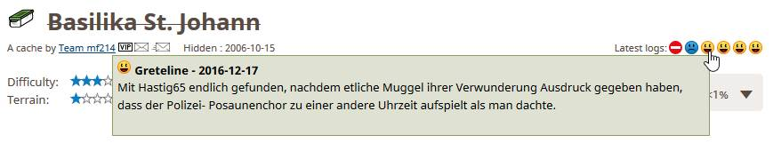
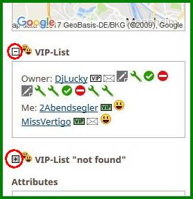

<a href="#v0223" title="GClh II Version 0.2.2.3">v0.2.2.3</a> &nbsp; 
<a href="#v0222" title="GClh II Version 0.2.2.2">v0.2.2.2</a> &nbsp; 
<a href="#v0221" title="GClh II Version 0.2.2.1">v0.2.2.1</a> &nbsp; 
<a href="#v022" title="GClh II Version 0.2.2">v0.2.2</a> &nbsp; 
<a href="#v021" title="GClh II Version 0.2.1">v0.2.1</a> &nbsp; 
<a href="#v01" title="GClh II Version 0.1">v0.1</a> &nbsp; 

---
## v0.2.2.3:
<ul>
<li>Fix: [Issue 54] (Again) Navigationsmenüs nicht sichtbar auf den Seiten "Find a Geocache", "Hide a Geocache" und "Geotours". Ursache: GS Änderung, Umbenennung der Menüs von "Menu" in "menu" und "SubMenu" in "submenu". </li>
</ul>
 

---
## v0.2.2.2:
<ul>
<li>Fix: [Issue 54] Navigationsmenüs nicht sichtbar auf den Seiten "Find a Geocache", "Hide a Geocache" und "Geotours". Ursache: GS Änderung, Umbenennung der Menüs von "Menu" in "menu" und "SubMenu" in "submenu". </li>
</ul>
 

---
## v0.2.2.1:
<ul>
<li>Change: [Enhancement #14] Hervorhebung geänderter Koordinaten flexibler gestalten. 
Danke an LittleJohn für die Vorarbeit. 
Das Aussehen der durch den Benutzer geänderten Koordinaten kann nun flexibler angepaßt werden. Das bekannte Aussehen aus dem GClh Original entspricht in etwa folgender Einstellung: 
</li>
<li>New: [Enhancement #30] Make colored illustration of versions in config selectable. 
Der teils doch etwas fleckig geratene Hintergrund im GClh Config mit den Informationen zu welcher Version ein Parameter implementiert wurde, kann nun abgewählt werden. 
</li>
<li>Fix: [Bug #31] When using "Log your visit (inline)" and clicking "All visited" for the trackables list opens an empty new tab. </li>
</ul>
 

---
## v0.2.2:
<ul><li>Der Bereich Map im GClh Config wurde komplett umgebaut und an die letzten Änderungen von GS angepaßt. Es gibt die neue Untergruppierung "Hide Map Elements", in der nun alle Hide Operationen zusammengefaßt sind. Die neuen Icons sind nun auch hier verfügbar und die beiden entfallenen A.P.E. und GPS Maze wurden auch hier entfernt. Außerdem wurde die Letterbox umgruppiert. Ist nun so wie auf der Karte.  Vielen Dank an CachingVoX.  [Bug Issue #18, #19]  

<dl class="file"><dt class="attach-image"></dt></dl>
</li>
<li>Im Bereich Map im GClh Config gibt es noch eine neue Gruppierung "Layers in map", die die gesamten Aufgaben der Kartenlayer abdeckt. Sollen die Layer nicht vom GClh geladen werden, wird der gesamte Bereich ausgeblendet. In der linken Liste sind die nicht verwendeten Layer, in der rechten die zu verwendenden Layer.  Und es wurde auch der standard Layer "Geocaching" von GS integriert! Vielen Dank an CachingVoX.  [Enhancement Issue #16, #17]  

<dl class="file"><dt class="attach-image"></dt></dl>
</li>
<li>Im GClh Config wurde eine default Sprache vorgesehen. Ist sie aktiviert, wird auf den GC Seiten die Sprache geprüft, entspricht sie nicht der default Sprache, wird sie geändert. Hier geht es im wesentlichen um die automatische Korrektur der Englischumstellungen, die einige Apps benötigen, um korrekt zu laufen. Das betrifft dann insbesondere diejenigen User, die auf den GC Seiten auf Deutsch unterwegs sind. (Soweit ich mich erinnere, stammt dieser Wunsch noch aus dem Block von Torsten.)   [Enhancement Issue #21] 

<dl class="file"><dt class="attach-image"></dt></dl>
</li></ul>
<ul><li>In den Latest logs wurde der Logtext integriert beim Drüberfahren mit der Maus.  [Enhancement Issue #22]  

<dl class="file"><dt class="attach-image"></dt></dl>
</li>
<li>Im GClh Config wurden die Verbindungen zwischen Checkboxen und Texten hergestellt. Nun muß man nicht mehr genau auf die Checkbox zielen, sondern kann die Checkbox auch durch einen Click auf den Text bedienen.  Vielen Dank an CachingVoX. 

<dl class="file"><dt class="attach-image"></dt></dl>
</li>
<li>Fix: Overview map in listing: zoom in/out loses cache marker. If you zoom in/out the overview map in a cache listing, the cache marker gets replaced by a default marker and the static image shows an error therefore the proper marker creation fails.  [Bug Issue #2]   </li>
<li>Fix: Linklist/Seachfield fälschlich in Map/Labs aufgebaut.  [Bug Issue #24]</li></ul>
 

---
## v0.2.1:
<ul><li>New: Downloadzaehler simulieren.</li>
<li>New: Cache Listing: Latest Logs Symbole im Kopf des Listings anzeigen. Ueber GClh Config steuern. 

<dl class="file"><dt class="attach-image"></dt></dl>
</li>
<li>New: GClh Config: GClh Sync als neue Bookmark zum Aufruf aus Linklist eingerichtet.</li>
<li>Change: GClh Config: Links im Kopf vom GClh Config ueberarbeitet.</li>
<li>New: Logs anzeigen: Wenn nicht alle eigenen Logs geladen werden, weil beispielsweise das Laden der Seite ueber den Browser gestoppt wurde, dann angeben wieviele Logs geladen wurden und das Datum des letzten geladenen Logs angeben, Cache und Trackables. (Wird das Laden der Seite ueber den Browser gestoppt, funktioniert nicht mehr alles auf der Seite, so z.B. die Linklist.) (Anschliessend kann man dann beispielsweise auch GC Vote für eine begrenzte Anzahl an Caches nachladen.) 

<dl class="file"><dt class="attach-image"></dt></dl>
</li>
<li>New: Cache Listing: Make VIP lists hideable. Ueber GClh Config steuern. 

<dl class="file"><dt class="attach-image"></dt></dl>
</li></ul>
 

---
## v0.1:
Rebuild GC little helper (2As) as GC little helper II:
<ol style="list-style-type: decimal"><li>Fix: Bei Eigenen Favoriten kein VIP Icon aufbauen. Hier steht gegebenenfalls das Pseudonym des Owners.</li><li>Fix: Save HomeCoords von Account Settings Seite funktionierte nicht mehr.</li><li>Fix: Select Buttons in einer Bookmarkliste aufbauen, aber nicht bei der Ablistung aller Bookmarklisten.</li><li>Fix: In Bookmarkliste nach dem Loeschen von Eintraegen (...bookmarks/bulk.aspx...) fehlt Zebra.</li><li>Fix: Farbliche Logkennzeichnung fuer User mit Sonderzeichen [] korrigiert.</li><li>Change: Spezielle Links Profile Tabs, Nearest Lists/Map, Own Trackables, GClh Config, GClh Sync und Find Player mit rechter und linker Maustaste funktionsfaehig machen mit Standard Contextmenue und postback.</li><li>Change: Config und Sync Aufrufe zusammengelegt und umgebaut. Rechte, linke Maus ueberall ok.</li><li>Change: Link zu alter deutscher Anleitung entfernt und Link github angepasst.</li></ol>
 

---
## v11.6.7 -&gt; v11.6.8 Fix:
<ol style="list-style-type: decimal"><li>MapQuest slippy map no longer available - remove both MapQuest layers  - use OpenStreetMap Mapnik as default map</li></ol>
 

---
## v11.6.6 -&gt; v11.6.7 Fix:
<ol style="list-style-type: decimal"><li>Neue Nachrichten des Message Centers wurden nicht mehr oder nicht mehr richtig angezeigt. (Sorry, mein Fehler.) Auf einigen Seiten, wie beispielsweise im öffentlichen Profil, verursacht das Message Center immer wieder mal Fehler. In diesen Fällen wird kein Zähler dagestellt. Das hängt aber nicht am GClh. </li></ol>
 

---
## v11.6.5 -&gt; v11.6.6 Fix:
<ol style="list-style-type: decimal"><li>Anzahl auszugebender Logs wurde fälschlicherweise um 1 reduziert.  Danke an Die Batzen: Ich hatte mich schon einige an diesem Problem versucht, kam aber nicht weiter. Das Beispiel war nun super, warum nicht mal im Kleinen versuchen.  Danke an RoRo: Das gemeldete Problem sollte damit auch behoben sein ..., hoffe ich.  </li><li>Beschreibung des Parameters "Show x logs" (settings_show_all_logs_count) ist nicht ganz korrekt, weil alle gelesenen Logs auch angezeigt werden, der Parameter ist also ein Minimalwert. Beschreibung im GClh Config angepaßt: Show at least x logs.  </li></ol>
 

---
## v11.6.4 -&gt; v11.6.5 Fix:
<ol style="list-style-type: decimal"><li>"Logged in Panel" mit Avatar ... auf "My Profile" Seite wurde durch GS geändert. (Danke CachingFox.) Eigentlich dachte ich, dass GS vor Seitenänderungen informiert, gestern Abend ging das nämlich noch. Oder haben die informiert?</li><li>Hillshadow funktionierte nicht, Adresse hat sich geändert. (Danke CachingFox.)   </li></ol>
 

---
## v11.6.3 -&gt; v11.6.4:
<ol style="list-style-type: decimal"><li><strong>New:</strong> "Find Player" für die Seiten im neuen Design ermöglicht.</li><li><strong>Fix:</strong> Updates stündlich checken.</li></ol>
 

---
## v11.6.2 -&gt; v11.6.3 Fix:
<ol style="list-style-type: decimal"><li>Beim Hovern über die mausaktivierten Bilder das Zucken im Hintergrund des Bildes im unteren Teil abgestellt.</li><li>$$023 Teilrückbau: Das Hovern über die mausaktivierten Bilder funktionierte im Cache Listing Bereich nicht.</li></ol>
 

---
## v11.6.1 -&gt; v11.6.2 Fix:
<ol style="list-style-type: decimal"><li>Die Namen von GClh Sync und GClh Config im Profil und die Bookmark GClh Config sind verwirrend wenn man mit GClh (2AS) arbeitet, sie sollten dem Scriptnamen entsprechen.</li><li>$$023 Teilrückbau: Image Gallerien: Gallerybreite auf Fenstergröße einstellen (vereinfacht mausaktivierten Bildwechsel).  Unterbindet im Profil das Verschieben nach links.</li><li>Orientierung der mausaktivierten Bilder angepaßt.  (Best practice in image galleries: Let the thumbnails as much as possible at the top or at the bottom of your screen. It should be better to hover with your mouse from the right side of your screen to the left side as inverse.)</li></ol>
 

---
## Rebuild GC little helper as GC little helper (2As), Version 11.6.1:

<strong>Fehlerbehebung (Fix), Änderungen (Change) und neue Funktionalität (New)</strong>  <strong>Global:</strong>       <strong>Fix:</strong> <ul><li>Avatar: Behandlung Checkbox zum Avatar in Settings, Preferences repariert.</li><li>Neue Seiten: Insbesondere "Message Center", "Find Cache", "Hide Cache", "GeoTours", "Labs" und auch "Account Settings" voll integriert.</li><li>Neue Seiten: Bei "Find Cache", "Hide Cache" und "GeoTours" wurde die Linklist ohne Event aufgebaut. </li><li>Neue Seiten: Remove advertisement instructions auch im Messagecenter durchführen. </li><li>Social Sharing: Hide (Facebook/Twitter) überall.  </li></ul><strong>Change:</strong> <ul><li>Mail, Message und VIP Icons: Auf weiteren Seiten etabliert. Steuerung über GClh Config.</li></ul><strong>New:</strong> <ul><li>VIP: Icon zusätzlich aufbauen: Im TB Listing für Owner und in den TB Logs. Bei Post, Edit, View Cache-Logs und TB-Logs. Bei Mail schreiben. Bei TB Inventar. Bei eigenen Favoriten.  </li><li>Warnmeldung: Wenn Warnmeldung über Down Time ... vorhanden ist, prüfen, ob sie identisch ist mit der bereits gesicherten, gegebenenfalls verbergen bzw. Button erzeugen zum Verbergen. Steuerung über GClh Config.</li></ul> <strong>Seitenheader, Navigations Menü:</strong>  <strong>Fix:</strong> <ul><li>Ausgabebreite: Variable Ausgabebreite im Header korrigiert und auf allen Seiten gesetzt. Den eigentlichen Contentbereich auf der Seite vergrößert. So beispielsweise den Platz für den Logtext im Listing verbreitert.</li><li>Find Player Link in Linklist: Verursachte fehlerhaftes Layout. So funktionierten beispielsweise die Menüs nicht mehr und das Layout im Header war verschoben. </li><li>GC Standard Menus: Ausblenden auch im neuen Seiten Design. </li><li>GClh Config Link in Linklist: Im neuen Seiten Design weglassen. GClh Config wird dort nicht richtig dargestellt.</li><li>GClh Config Link in Linklist: Aufruf aus Linklist repariert.</li><li>Linklist: Rechte Maustaste funktionierte nicht bei den speziellen Links aus Linkliste, gilt für Linklist on Top und im Profile. Repariert über direkten Link mit new Tab. Contextmenu wird nicht mehr angezeigt.</li><li>Message Center: Icon oben rechts wieder auswählbar gemacht.</li><li>Message Center: Verursacht immer mal wieder Fehler. Beseitigt, vermutlich.</li><li>Search Field: Repariert.</li></ul><strong>New:</strong> <ul><li>GC Tour: Platz für GC Tour Icon lassen. Steuerung über GClh Config.</li><li>Logo: Verkleinert. Steuerung über GClh Config.</li><li>Message Center, User Bereich rechts oben: Verkleinert. Steuerung über GClh Config.</li><li>Navigations Menü: Schriftgröße, Schriftfarbe, Abstände der Menü Punkte im vertikalen und horizontalen Menü und bis zu 3 Zeilen im horizontalen Menü mit und ohne Separator, frei wählbar über GClh Config steuerbar. </li></ul> <strong>Map:</strong>  <strong>Fix:</strong> <ul><li>Cache Types ausblenden: Auf der Karte werden die gewünschten Cache Types ausgeblendet, die Icons zum Cache Type wurden aber nicht gesetzt. </li><li>Cache Types: Die Reihenmarkierungen zu den Cache Types setzen.  </li><li>GC Map - Google Maps: Button zu GC Map in Google Maps platziert.</li><li>GC Map: Button "Find My Location" und Entfernungsangaben auf der Karte wurden beim ersten Verstecken der Sidebar nicht berücksichtigt, auch im Standard nicht.</li><li>GC Map: Warnmeldung wenn Leaflet-Map nicht aktiv ist, repariert.</li><li>GC Map: Fehler bei "Hide Map Header" repariert, wenn Auswahl zu "Set Map Preferences" angezeigt wurde.</li><li>Hide/Show Header: In der Sidebar der Karten komplett anzeigen und auch nicht mehr überblenden. Und rechts orientieren wegen möglichem GC Tour Icon.</li><li>Homezone: Auch die Multi Homezonen dürfen nicht angezeigt werden, wenn der Parameter "Show Homezone" deaktiviert ist.</li><li>Homezone: Die Homezone Circles werden manchmal zu früh aufgebaut, dann blinken sie kurz auf und sind dann auch schon wieder verschwunden. Das passiert insbesondere beim Kartenaufruf ohne Koordinaten, also beispielsweise aus dem Menü Play.</li><li>Kartenfilter: Bei externen Filtern (beispielsweise aus play/search) nichts verändern. Änderungen führten dazu, dass auf der Karte alle Caches und nicht die gemäß externem Filter in der Karte angezeigt wurden.</li><li>Layer: Konnten im Zusammenhang mit dem Einsatz von GC Vote nicht immer ausgetauscht werden, weil GC Vote ebenfalls mit den Layer Classen arbeitet.</li><li>Layerliste: In den Karten verbreitert, damit sie nicht zu schmal wird, wenn noch ein GC Vote Icon dort sitzt. </li></ul><strong>New:</strong> <ul><li>Google Maps - GC Map: Button zu Google Maps in GC Map platziert und Wechsel über neuen Browser Tab oder gleichen Tab ermöglicht. Steuerung über GClh Config. </li><li>Google Maps: Linke Sidebar in Google Maps ausblenden. Steuerung über GClh Config.</li><li>Linklist: Auch im Karten Header aufbauen.</li></ul> <strong>Listing:</strong>  <strong>Fix:</strong> <ul><li>Disclaimer Hide: Bei Mega, Giga Events wurde 'Related Web Page' als Disclaimer ausgeblendet und Disclaimer blieb stehen. </li><li>Favoritenbox: Box wurde mit Update vom 29.06.2016 geändert.</li><li>Image, Logs: Mausaktivierte Bilder deaktiviert, wenn die Logs nicht vom GClh geladen werden, weil das dann nicht korrekt funktioniert. Unterstrichene Bildnamen behoben.</li><li>Image, Spoiler-Filter: Der Filter funktioniert nicht, Funktionalität deaktiviert.</li><li>Logs: VIP Icons wieder setzen. </li><li>Logs: "Edit Log / Images" und "Upload Image" wieder setzen. </li><li>Logs: Anzahl Load Logs repariert.</li><li>Post log from PMO-Listing as Basic Member (inline): Notdürftig repariert.</li><li>Show Eventday beside Date: Giga Event integriert.</li><li>TB, Logs: Farbliche Hervorhebung von Owner und User und Zebra in den Logs korrigiert.</li><li>TB, Logs: Verarbeitung von Platzhaltern in TB Logs repariert.</li><li>VIP Listen: Ohne Einträge aufbauen, wenn die Logs nicht vom GClh geladen werden.</li></ul><strong>Change:</strong> <ul><li>Decrypt hints: Gepimpt.</li><li>Favoritenbox: Kompletter Umbau, schneller gemacht und Dropdown verbessert.</li><li>Hide hints behind a link: Gepimpt.</li><li>Hide/Show Cache Note: Gepimpt.</li><li>Highlight changed coordinates: Gepimpt.</li><li>Logs: Log-Template und Load Logs überarbeitet. Standard Aufbereitung der Logtexte etabliert. Logtext etwas gestrafft. Aufbereitung zum User des Logs gestrafft, eine Zeile für den Namen, eine Zeile für die Icons. </li><li>Post log from Listing (inline)": Gepimpt.</li></ul><strong>New:</strong> <ul><li>Ignore: Link Bezeichnung für bereits ignorierte Caches ändern in 'Stop Ignoring'. Steuerung über GClh Config.</li><li>Image, TB: Mausaktivierte Bilder eingebaut.</li><li>Logs: Farbliche Hervorhebung in TB und Cache Logs von User, Owner, VIP, Zebra Effekt und Steuerung über GClh Config.</li><li>Mail Icons bei Usern in "VIP-List": Eingebaut. Steuerung über GClh Config.</li><li>Message Icon: Hinter Mail Icon aufbauen. Steuerung über GClh Config. </li><li>Überblicks Karte: Von Cache Lokation oben rechts im Cache Listing eingebaut. (Gabs mal im Standard.)</li></ul> <strong>Profil:</strong>  <strong>Fix:</strong> <ul><li>Trackables: Wenn User keine eigenen Trackables, dann Fehler im Profile Trackables.</li></ul><strong>New:</strong> <ul><li>All my VIPs Liste: Mail Icons zu Usern in Liste aufbauen. Steuerung über GClh Config.</li><li>All my VIPs Liste: Block auch klappbar machen.</li><li>Linklist: Block auch klappbar machen. </li><li>Statistik: Auswertung zur Matrix auf der Statistik Seite und im Profile erweitert: Anzahl komplette Matrixes. Farbliche Hervorhebung für die nächsten x möglichen Matrixes. Links zur Suche nach entsprechenden Caches mit einem Radius von x km in Karte oder Liste. Steuerung über GClh Config. </li></ul> <strong>Logging:</strong>  <strong>Fix:</strong> <ul><li>Show Datepicker beside Date on Log-Page: Funktioniert nicht mehr und ist auch nicht mehr notwendig, entfernt.</li></ul><strong>Change:</strong> <ul><li>BBCode: Entfernt.</li></ul> <strong>Bookmarklisten, Watchliste, Pocket Queries, Fieldnotes und andere Listen:</strong>  <strong>Fix:</strong> <ul><li>Falsche Markierung: Der Einträge in Bookmarklisten durch zwischenzeitliche Änderungen repariert.</li><li>F2 Save: Speichern mit F2 Taste bei "Create a Bookmark", "Edit a Bookmark" und "Bookmark Pocket Query" repariert und Button Bezeichnung um F2 ergänzt.</li><li>GClh Config: Auf der Fieldnotes Seite läßt sich der GClh Config nicht aufbauen. Das hängt mit Namen der function checkbox zusammen. Nach Änderung in checkboxy gab es keine Probleme mehr.</li><li>KML: Die Anzeige von KML Dateien in Google Maps funktioniert so nicht mehr. Links entfernt.</li></ul><strong>New:</strong> <ul><li>Anzahl der Caches und Anzahl der selektierten Caches: In Bookmarklisten und Watchliste in den Kategorien All, Found, Archived und Deactivated, entsprechend der Selektions Buttons, anzeigen. Steuerung über GClh Config.</li><li>Listen: Zebra Look und Found Einfärbung über GClh Config.  </li><li>Loggen: über Standard "Log It" Icons zu Premium Only Caches für Basic Members ermöglicht.</li></ul> <strong>Image Gallery:</strong>  <strong>Fix:</strong> <ul><li>Cache und Profil: Mausaktivierte Bilder repariert. </li></ul><strong>New:</strong> <ul><li>Show bigger images in gallery: Auch für TB.</li><li>TB: Mausaktivierte Bilder eingebaut.</li></ul> <strong>GClh Config, GClh Sync:</strong>  <strong>Fix:</strong> <ul><li>Cache Typ: Um Giga Event erweitert.</li><li>Home-Coords, Multi Homezone: Koordinaten in den GClh Feldern Home-Coords und Multi Homezone vollqualifiziert ausgeben, auch wenn sie auf .000 enden, sonst werden sie beim nächsten Speichern demoliert.</li><li>Invalid format Meldung: Eliminiert. </li><li>Linklist: Echte Linkbezeichnungen anzeigen und nicht den Default. Default als Title.  </li></ul><strong>New:</strong> <ul><li>Call GClh Config: F4 Call aus allen erlaubten Seiten heraus ermöglicht. Steuerung über GClh Config. </li><li>Linklist: Einige Bookmarks für Linklist ergänzt.</li><li>Linklist: Bookmarks kennzeichnen, wenn sie, bzw. wenn sie nicht, in der Linklist vorhanden sind.</li><li>Linklist: Sortierung ermöglicht für default Bookmark Links für Linklist.</li><li>Neue Parameter: Im GClh Config mit Version versehen und farblich etwas hervorheben. </li><li>Neue Platzhalter für Logs: Aktuelles Datum und aktuelle Zeit. Danke an SiMaKiDD, er hats erfunden. </li><li>Save GClh Config: F2 Save aus GClh Config ermöglicht. Steuerung über GClh Config.</li></ul>

