<a href="#v07" title="GClh II version 0.7 (??.04.2017)">v0.7</a> &nbsp;
<a href="#v06" title="GClh II version 0.6 (25.03.2017)">v0.6</a> &nbsp;
<a href="#v05" title="GClh II version 0.5 (11.03.2017)">v0.5</a> &nbsp;
<a href="#v041" title="GClh II version 0.4.1 (26.02.2017)">v0.4.1</a> &nbsp; 
<a href="#v04" title="GClh II version 0.4 (25.02.2017)">v0.4</a> &nbsp; 
<a href="#v03" title="GClh II version 0.3 (05.02.2017)">v0.3</a> &nbsp; 
<a href="#v0231" title="GClh II version 0.2.3.1 (22.01.2017)">v0.2.3.1</a> &nbsp; 
<a href="#v023" title="GClh II version 0.2.3 (22.01.2017)">v0.2.3</a> &nbsp; 
<a href="#v0224" title="GClh II version 0.2.2.4 (20.01.2017)">v0.2.2.4</a> &nbsp; 
<a href="#v0223" title="GClh II version 0.2.2.3 (20.01.2017)">v0.2.2.3</a> &nbsp; 
<a href="#v0222" title="GClh II version 0.2.2.2 (20.01.2017)">v0.2.2.2</a> &nbsp; 
<a href="#v0221" title="GClh II version 0.2.2.1 (12.01.2017)">v0.2.2.1</a> &nbsp; 
<a href="#v022" title="GClh II version 0.2.2 (09.01.2017)">v0.2.2</a> &nbsp; 
<a href="#v021" title="GClh II version 0.2.1 (05.01.2017)">v0.2.1</a> &nbsp; 
<a href="#v01" title="GClh II version 0.1 (05.01.2017)">v0.1</a> &nbsp; 

---
## v0.7:
<ul>
<li>
New: [Issue <a href="https://github.com/2Abendsegler/GClh/issues/254">#254</a>] Filter VIP logs in cache listing: 
 
 </li>
<li>
New: [Issue <a href="https://github.com/2Abendsegler/GClh/issues/268">#268</a>] VIP list: Quick link to VIP logs: 
Navigate down to logs area and invoke the VIP filter. 
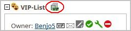 
 </li>
<li>
New: [Issue <a href="https://github.com/2Abendsegler/GClh/issues/250">#250</a>] Show elevation for listing coordinates and waypoints with visible coordinates. Metric and imperial is supported. 
Many thanks to <a href="https://www.geocaching.com/profile/?u=CachingFoX">CachingFoX</a> for the idea and the development. 
 
Settings > Listing: 
 
 
Elevation for listing coordinates (metric): 
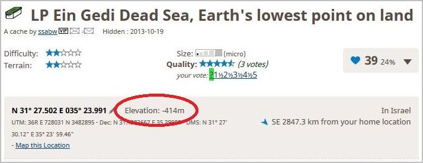 
 
Elevation for listing coordinates (imperial): 
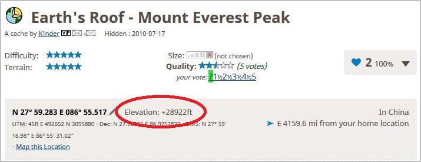 
 
Elevation for additional waypoints: 
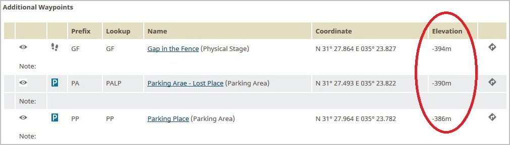 
 </li>
<li>
New: [Issue <a href="https://github.com/2Abendsegler/GClh/issues/10">#10</a>] Show listing coordinates and additional waypoints on Flopp's Map: 
Special thank to <a href="https://www.geocaching.com/profile/?u=SiMaKiDD">SiMaKiDD</a> - the creator of MAP_BUTTONS script - for the inspiration, permission and support.  
Many thanks to <a href="https://www.geocaching.com/profile/?u=CachingFoX">CachingFoX</a> for the implementation. 
 
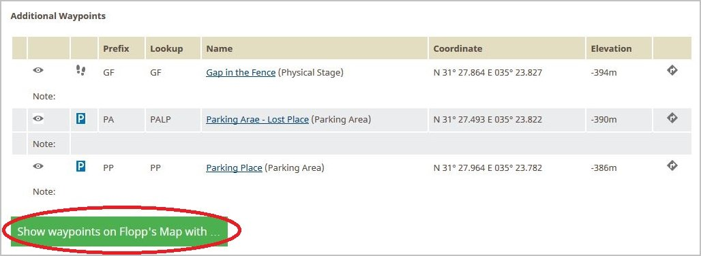 
 
Different map styles selectable: 
 
 
Zoom level is calculate automatically: 
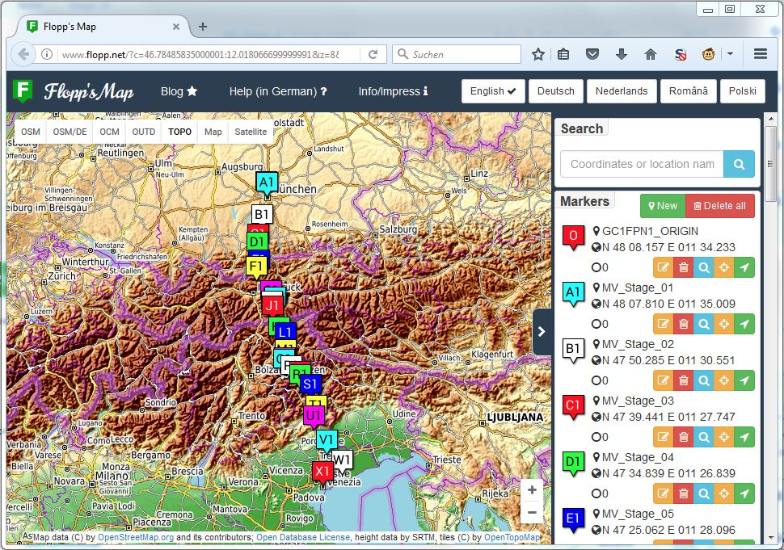 
 </li>
<li>
New: [Issue <a href="https://github.com/2Abendsegler/GClh/issues/253">#253</a>] Added shortcut links to waypoint list and logs section. 
 
 </li>
<li>
New: [Issue <a href="https://github.com/2Abendsegler/GClh/issues/252">#252</a>] Link to Google Map Driving Direction for every waypoint in the waypoint list (with visible coordinates) 
 
Settings > Listing: 
 
 
Additional Waypoint list: 
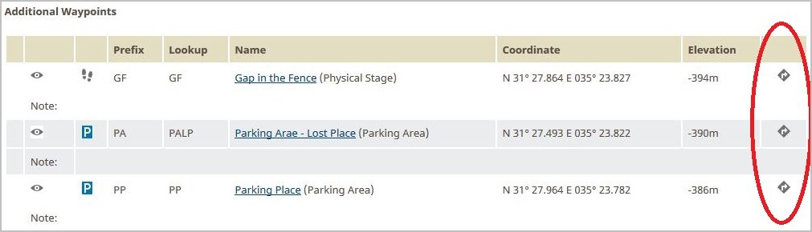 
 </li>
<li>
Change: [Issue <a href="https://github.com/2Abendsegler/GClh/issues/277">#277</a>] Show button "Show log counter" only if feature is possible: 
Do not show button "Show log counter" if the logs are filtered or searched. 
</li>
<li>
Change: [Issue <a href="https://github.com/2Abendsegler/GClh/issues/279">#279</a>] Implement note in Config with using information for log templates: 
Many thanks for implementation. 
</li>
<li>
Fix: [Issue <a href="https://github.com/2Abendsegler/GClh/issues/264">#264</a>] VIP list not rendered on a specific cache (Lesopark Dubina). Profile link in listing without any text. 
</li>
<li>
Fix: [Issue <a href="https://github.com/2Abendsegler/GClh/issues/276">#276</a>] Open list with "Pocket Queries ready to download" not possible, only in chrome. 
</li>
 
</ul>
(08.04.2017)  
 

---
## v0.6:
<ul>
<li>
New: [Issue <a href="https://github.com/2Abendsegler/GClh/issues/226">#226</a>] Make the using of browser Vivaldi possible: 
Please notice the special points in <a href="https://github.com/2Abendsegler/GClh/blob/master/docu/tips_installation.md#readme">Tipps für die Installation</a>. 
 
 </li>
<li>
New: [Issue <a href="https://github.com/2Abendsegler/GClh/issues/199">#199</a>] Default settings for new pocket queries:  
Many thanks to <a href="https://www.geocaching.com/profile/?u=CachingFoX">CachingFoX</a> for the idea and the implementation. 
 
 </li>
<li>
New: [Issue <a href="https://github.com/2Abendsegler/GClh/issues/200">#200</a>] Warning for mutually exclusive option in pocket queries: 
Many thanks to <a href="https://www.geocaching.com/profile/?u=CachingFoX">CachingFoX</a> for the idea and the development. 
 
 
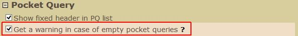 
 </li>
<li>
New: [Issue <a href="https://github.com/2Abendsegler/GClh/issues/230">#230</a>] Auto set approvals in hide cache process:  
Many thanks to <a href="https://www.geocaching.com/profile/?u=king-ton">king-ton</a> for the idea and the development. 
 
New: [Issue <a href="https://github.com/2Abendsegler/GClh/issues/231">#231</a>] Enable save / continue with F2 key in hide cache process:  
This includes the complete hide cache process with all of the buttons "Continue", "Continue Anyway", "Save and Preview", "Submit Changes", "Update Attributes", "Create Waypoint" and "Update Waypoint" of the create and the change functionality. 
 
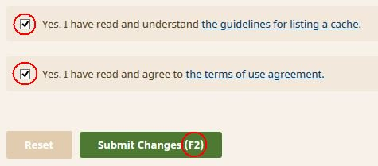 
 
 
 </li>
<li>
New: [Issue <a href="https://github.com/2Abendsegler/GClh/issues/226">#226</a>] New Config parameter to open mail/message form in a new window: 
Many thanks to <a href="https://www.geocaching.com/profile/?u=Herr%20Ma">Herr Ma</a> for the development. 
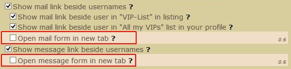 
 </li>
<li>
Fix: [Issue <a href="https://github.com/2Abendsegler/GClh/issues/224">#224</a>] Trim empty lines from mail/message template after replacing placeholders with empty strings. 
Many thanks to <a href="https://www.geocaching.com/profile/?u=Herr%20Ma">Herr Ma</a> for the fix. 
</li>
<li>
Fix: [Issue <a href="https://github.com/2Abendsegler/GClh/issues/227">#227</a>] Build maps linking on gc.map not always possible (Vorabkorrektur). 
</li>
<li>
Fix: [Issue <a href="https://github.com/2Abendsegler/GClh/issues/225">#225</a>] Own log statistics is generated on other user profile page (id). 
</li>
<li>
Fix: [Issue <a href="https://github.com/2Abendsegler/GClh/issues/239">#239</a>] Log templates show unreadable signs (Vorabkorrektur). 
</li>
<li>
Fix: [Issue <a href="https://github.com/2Abendsegler/GClh/issues/238">#238</a>] Friends page "Last check" stuck (Vorabkorrektur).  
Many thanks to <a href="https://www.geocaching.com/profile/?u=Herr%20Ma">Herr Ma</a> for the fix. 
</li>
 
</ul>
(25.03.2017)  
 

---
## v0.5:
<ul>
<li>New: [Issue <a href="https://github.com/2Abendsegler/GClh/issues/180">#180</a>] Additional geoservices (OSM, Flopp's Map, GeoHack) from GC Map: 
Many thanks to <a href="https://www.geocaching.com/profile/?u=CachingFoX">CachingFoX</a> for the idea and the implementation. 
 
New geoservices in GC Map 
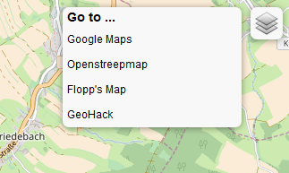 
 
New geoservices are configurable 
 
 
</li>
<li>New: [Issue <a href="https://github.com/2Abendsegler/GClh/issues/191">#191</a>] Add a link from Openstreetmap.org map to GC Map: 
Many thanks to <a href="https://www.geocaching.com/profile/?u=CachingFoX">CachingFoX</a> for the idea and the development. 
 
 
 
 
 
</li>
<li>New: [Issue <a href="https://github.com/2Abendsegler/GClh/issues/181">#181</a>] Replace img links in cache listing to an img link with the larger image if possible:  
Many thanks to <a href="https://www.geocaching.com/profile/?u=Herr%20Ma">Herr Ma</a> for the development. 
 
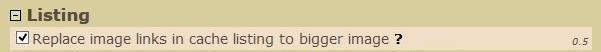 
 </li>
<li>New: Enlarge VUP list with new features: 
Many thanks to <a href="https://www.geocaching.com/profile/?u=Herr%20Ma">Herr Ma</a> for the idea and the development. 
 
 
 
Original Log: 
 
 
Log, if Cacher is on VUP list: 
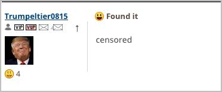 
 
Log with new option "Also hide name, avatar and counter from log": 
 
 
With the second new option "Hide complete log", the complete log is hidden. 
 </li>
<li>Fix: [Issue <a href="https://github.com/2Abendsegler/GClh/issues/179">#179</a>] Zebra effect in common lists not always available: Wrong parameter promt in special processing for common lists if user color is not set. </li>
<li>Fix: [Issue <a href="https://github.com/2Abendsegler/GClh/issues/179">#171</a>] No GClh enhancement on friends page </li>
<li>Fix: [Issue <a href="https://github.com/2Abendsegler/GClh/issues/185">#185</a>] Cacher names with brackets will not work in VUP List </li>
<li>Fix: [Issue <a href="https://github.com/2Abendsegler/GClh/issues/203">#203</a>] "Spoiler warning" text shining through in overlapping images </li>
<li>Fix: [Issue <a href="https://github.com/2Abendsegler/GClh/issues/204">#204</a>] Own log statistics is generated on other user profile page </li>
 
</ul>
(11.03.2017)  
 

---
## v0.4.1:
<ul><li>Fix: [Issue <a href="https://github.com/2Abendsegler/GClh/issues/169">#169</a>] Width in cache description is to big. Fix: [Issue <a href="https://github.com/2Abendsegler/GClh/issues/173">#173</a>] listing text "underflows" the right column. </li>
<li>Fix: [Issue <a href="https://github.com/2Abendsegler/GClh/issues/174">#174</a>] Button to GC Maps on Google Maps page was missing. </li>
<li>Change: [Issue <a href="https://github.com/2Abendsegler/GClh/issues/170">#170</a>] If empty "Spoiler Filter", no checking is done. </li>
<li>Change: [Issue <a href="https://github.com/2Abendsegler/GClh/issues/172">#172</a>] Checkbox "show VUP icons on friends list" without checkbox "Process VUPs" is misunderstood. Implement both checkboxes in section profile / friends. </li>
</ul>
(26.02.2017) 
 

---
## v0.4:
<ul><li>New: [Issue <a href="https://github.com/2Abendsegler/GClh/issues/111">#111</a>] New found / hidden in a summary in the beginning of the Friends page: 
Many thanks to <a href="https://www.geocaching.com/profile/?u=Herr%20Ma">Herr Ma</a> for the idea and the development. 
 
Summary for new finds/hides for friends of the friends page will be shown as follow: 
 
 
There is also a timestamp with the date/time of the last check. After pushing the Reset counter button or if there are no new finds/hides, the summary is hidden and only the timestamp is visible: 
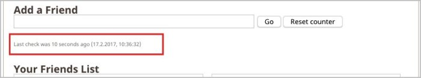 
 
To use the new summary feature you have to set the checkbox "Show summary for new finds/hides in friends list". Special feature. If you set the checkbox "Show summary only for friends in VIP list" the summary will be shown only for friends which are marked as VIPs. 
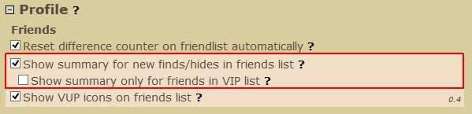 
 
 </li>
<li>New: [Issue <a href="https://github.com/2Abendsegler/GClh/issues/145">#145</a>] User ignore processing in cache listing logs, VUPs (Very unimportant persons): 
Many thanks to <a href="https://www.geocaching.com/profile/?u=Herr%20Ma">Herr Ma</a> for the idea and a lot of coding. 
 
The VUP processing is integrated in the VIP processing as a second part and have the most of the VIP functionality. The main idea are "censored" cache logs for the VUPs. If you mark a person as a VUP, the cache log text will only contain the text "censored", so you can be relaxed and you have not to be stressed. 
 
 
Cache listing, if cache owner is a VUP. 
 
 
Cache listing, if cache owner is a VUP, it is shown in the VIP list if owner is shown there. 
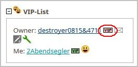 
 
Your profile contain a list of all your VUPs. 
 
 
The VUP processing can be activated and customized in Config. 
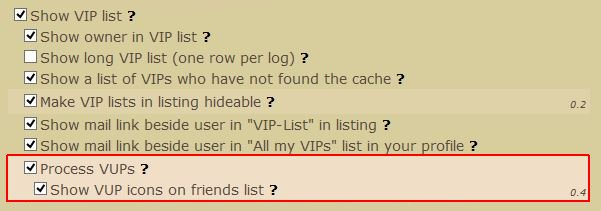 
 
 </li>
<li>New: [Issue <a href="https://github.com/2Abendsegler/GClh/issues/34">#34</a>] Manage user defined Filter Sets for geocache searchs: 
Many thanks to <a href="https://www.geocaching.com/profile/?u=CachingFoX">CachingFoX</a> for the idea and the development. 
 
The handling of the Filter Sets for geocache searchs are integrated in the standard geocache search / find "Find a geocache". About "Manage Filter Sets", a geocache search can be saved as a Filter Set. 
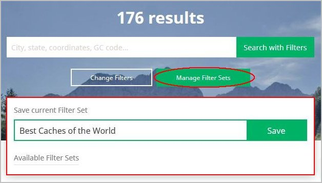 
 
With double click of a Filter Set in the column "Available Filter Sets", you can start the geocache search with this Filter Set. If you have changed the filter of a geocache search, you can update the Filter Set here too. 
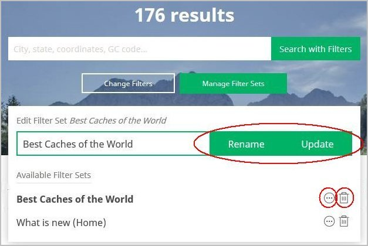 
 
At the geocache search / find page, the current Filter Set will be shown.  
 
 
To activate and deactivate this functionality there is a parameter in Config. 
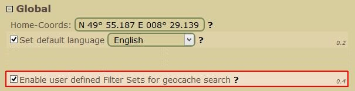 
 
 </li>
<li>New: [Issue <a href="https://github.com/2Abendsegler/GClh/issues/9">#9</a>] Provide standard configuration set (GClh Config): 
<ul><li>Reset to standard configuration: This is the main functionality to reset to standard configuration set. This is the way to come back to an efficient configuration set, after some experimental or other motivated changes. This option load a reasonable standard configuration and overwrite your configuration data in parts. Of course, personal data, like home-coords, homezone or similar data are not overwritten. </li>
<li>Reset your own home-coords could help you with problems around your home-coords, like for example with your main homezone, with nearest lists or with your home-coords itself. </li>
<li>Reset your own id for your trackables could help you with problems with your own trackables lists. </li>
<li>Reset dynamic and unused is the possibility to reorganize the configuration set. Unused parameters, of older script versions, are deleted. And all the dynamic data, especially the autovisit settings for every TB, are deleted too. </li></ul>
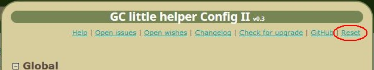 
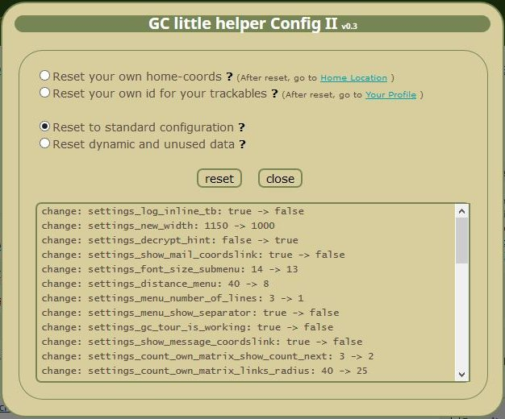 
 
 </li>
<li>Change: [Issue <a href="https://github.com/2Abendsegler/GClh/issues/138">#138</a>] Enlarge mail form signature to mail form template with known placeholder: 
<ul><li>Enlarge the mail and message form signature functionality to a mail and message form template with the known placeholder in the log templates. Especially integrate GC, TB name and GC, TB Link, in order that these things can be placed variable. For example above in the mail as subject. </li>
<li>The signature content is migrated automatically. </li>
<li>The settings "Show coord link in mail" and "Show coord link in message" are no longer necessary and are removed.  </li></ul>
 
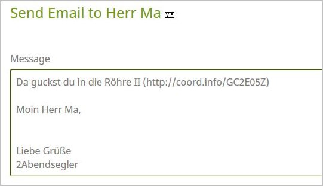 
 
 </li>
<li>New: [Issue <a href="https://github.com/2Abendsegler/GClh/issues/11">#11</a>] Seitenheader ausrichten / Arrange header layout on content: 
<ul><li>With this option you can arrange the header width on the width of the content of the page. This is an easy feature with some restrictions, like for example the available place, especially for horizontal navigation menues. </li>
<li>The fixed header is available at all pages in the older design like for example cache and TB listings, bookmarks, pocket queries, profiles, statistics, watchlists and field notes, to name just a few. </li>
<li>At maps and at the pages in the newer design it is not available, partly because the content of the pages are not yet in an accurate width, like the newer search cache page or the message center page. Also this feature is not fully integrated in the diverse possibilities of the header layout and the navigation menus. </li></ul>
(We hope the friends of this specific header design can deal with it.) 
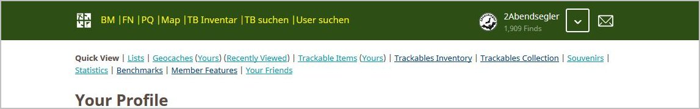 
 
 
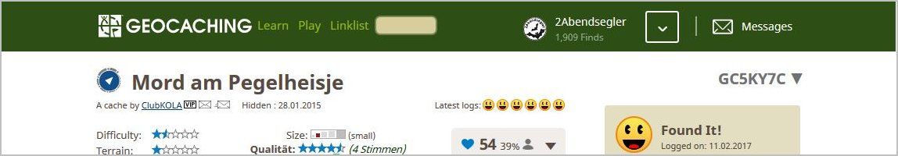 
 
 
 </li>
<li>New: [Issue <a href="https://github.com/2Abendsegler/GClh/issues/12">#12</a>] Logo und Message Center Icon wahlweise entfernen / Remove logo and message center in header: 
<ul><li>Remove logo in header: 
With this option you can remove the logo in the header. This is an easy feature with some restrictions. 
This feature is available at all pages in the older design like for example cache and TB listings, bookmarks, pocket queries, nearest lists, profiles, statistics, watchlists and field notes, to name just a few. 
At maps and at the pages in the newer design it is not available. Also this feature is not fully integrated in the diverse possibilities of the header layout and the navigation menus. </li>
<li>Remove message center in header: 
With this option you can remove the complete message center in the header. 
You will not be informed longer about new messages. </li></ul>
 
 
 
<a href="https://raw.githubusercontent.com/2Abendsegler/GClh/master/data/config_header_align_logo_mc_remove.txt ">Here</a> is a small config file with the necessary changes to arrange the header and remove the logo and the message center icon and text. You can copy the lines and insert and import it with GClh Sync II. 
 
 </li>
<li>New: [Issue <a href="https://github.com/2Abendsegler/GClh/issues/146">#146</a>] Show Cache log counter in cache listing: 
With the link "Show log counter" two counter are shown in every log. The first one is a counter only for logs with the same logtyp like for example "Found it" or "Enable Listing". The second one is the counter for all logs. 
(Only possible if all logs are shown.) 
 
 
 </li>
<li>New: Show or hide all the areas in Config with one click to a plus or minus icon with the right mouse. 
 </li>
<li>Fix: [Issue <a href="https://github.com/2Abendsegler/GClh/issues/139">#139</a>] Missing new founds and hiddens in friends list: 
In some cases, starting count of founds and hiddens are not saved. 
 </li>
<li>Fix: [Issue <a href="https://github.com/2Abendsegler/GClh/issues/147">#147</a>] Width in section "Profile Information" of public profile was cut. 
</li>
</ul>
 
(25.02.2017) 
 

---
## v0.3:
<ul>
<li>New: [Issue <a href="https://github.com/2Abendsegler/GClh/issues/23">#23</a>] Hide archived caches in owned cache list: 
Vielen Dank an <a href="https://www.geocaching.com/profile/?u=dontp%C3%A4nic">dontpänic</a> für die Entwicklung. 
 
 </li>
<li>New: [Issue <a href="https://github.com/2Abendsegler/GClh/issues/92">#92</a>] Added date format dd.MM.yyyy: 
Hier ist zu beachten, dass das Datums Format an zwei Stellen eingestellt werden muß. Das <a href="https://goo.gl/9Hgxnk">Event Date Format im GClh Config</a> und das <a href="https://www.geocaching.com/account/settings/preferences#SelectedDateFormat">Date Format in den Account settings</a>. 
Code comes from old <a href="https://github.com/amshove/GC_little_helper/pull/154">pull request 154</a> of the GClh original from petr-hendl. 
Vielen Dank an petr-hendl für das Coding. 
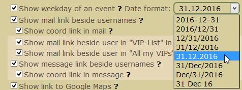 
 
 </li>
<li>New: [Issue <a href="https://github.com/2Abendsegler/GClh/issues/93">#93</a>] Aufruf GClh Sync per Taste F10 ermöglichen: 
In Tampermonkey gibt es kein eigenes Tampermonkey Menü, nicht so wie in Greasemonkey. Man kann dort also den GClh Sync nur aus dem Profile und gegebenenfalls aus der Linklist aufrufen. Mit dieser Anpassung kann der GClh Sync von überall aufgerufen werden, so wie es beim GClh Config mit der Taste F4 bereits der Fall ist. 
Und für Config und Sync neben Avatar im Profile, als Title Version einblenden. 
 
 </li>
<li>New: [Issue <a href="https://github.com/2Abendsegler/GClh/issues/94">#94</a>] Profile Foto in Originalgröße einbinden in mausaktivierte Bilder: 
Ist die Funktionalität "Show thumbnails of images" aktiviert, dann wird das Profile Foto in Originalgröße angezeigt, wenn man mit der Maus über das kleine Profile Foto fährt. 
(Die Idee stammt noch aus Zeiten des GClh Originals. Die Funktionalität gab es früher auch mal im Standard.) 
 
 </li>
<li>New: [Issue <a href="https://github.com/2Abendsegler/GClh/issues/20">#20</a>] Eigene Logs zu Caches und Trackables nach Logtypen aufsummieren und auf der Statistikseite anzeigen: 
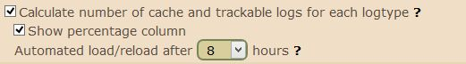 
 
 </li>
<li>New/Change: [Issue <a href="https://github.com/2Abendsegler/GClh/issues/100">#100</a>] Links in Linklist und Fehlermeldungen zu Nearest List, Own Trackables überarbeitet: 
- Text in der Meldung wegen Fehlender Homekoordinaten oder fehlender uid für die Own Trackables umformuliert. 
- Neuen Link für Linklist eingebaut direkt zum "Forum Geoclub" und Link "Forum" in "Forum Groundspeak" umbenannt. 
- Links zu den Nearest Lists und den Own Trackables auch im GClh Config schon prüfen und gegebenenfalls individuell für den User setzen, so dass von dort aus keine unnötigen Fehlermeldungen erzeugt werden. 
 </li>
<li>New/Change: [Issue <a href="https://github.com/2Abendsegler/GClh/issues/100">#100</a>] Dokumentation Linklist im GClh Config überarbeitet: 
Scheinbar macht die Einrichtung der Linklist einigenorts Probleme, sowohl im Bereich der Standard Links wie auch insbesondere bei den Custom Links. Die Beschreibung zu den einzelnen Spalten der Linklist über die Fragezeichen "?" und die Beschreibung zu den einzelnen Feldern per Tooltip wenn man mit der Maus drübersteht, wurde komplett überarbeitet und erweitert.  
(Ich hoffe das trägt zu einem besseren Verständnis bei. Es wäre schade, wenn die Linklist nur eingeschränkt genutzt werden kann, weil man die Bedienung und die Einrichtung nicht versteht.) 
Beispiel: 
 
 </li>
<li>Change: [Issue <a href="https://github.com/2Abendsegler/GClh/issues/107">#107</a>] Beim Editieren von TB Logs F2 speichern ermöglicht. 
 </li>
<li>Change: [Issue <a href="https://github.com/2Abendsegler/GClh/issues/65">#65</a>] Spoiler Filter bei den Thumbnails aktivieren und reparieren: 
Der Filter funktioniert nun für das Cache Listing und für die Cache Gallery, nicht aber für die Bilder in den Cache Logs. 
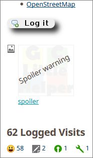 
 
 </li>
<li>New: [Issue <a href="https://github.com/2Abendsegler/GClh/issues/7">#7</a>] Platzhalter in Log Templates und Log Signaturen ergänzt und Dokumentation überarbeitet: 
#GCTBName# : GC or TB name 
#GCTBLink# : GC or TB link 
#GCTBNameLink# : GC or TB name as a link 
#LogDate# : Content of field "Date Logged" 
Upper and lower case is not required in the placeholder name. 
 </li>
<li>New: [Issue <a href="https://github.com/2Abendsegler/GClh/issues/15">#15</a> (not closed)] Profile Trackables pimpen: 
Hiermit werden lediglich die Ladezeiten reduziert, sofern auf die Trackable Icons verzichtet werden kann. Damit wird das eigentliche Problem umgangen, dass man die Summen im Footer nicht gut ansehen kann, weil die Icons noch ziemlich lange nachgeladen werden, und die Anzeige zuckelt. 
Danke auch an SiMaKiDD für die Idee das Laden zu stoppen. 
 
<i>(Das Vorhaben, die Trackables im Profile in weitere Kategorien zu untergliedern und die Einzelsätze per Icon ein- und aufzublenden (Issue <a href="https://github.com/2Abendsegler/GClh/issues/15">#15</a>), ist zur Zeit auf Eis gelegt. Es ist bisher nicht gelungen sinnvolle Kategorien zu bilden, weil die Systematic bei der Benennung der Trackable Serien sich noch nicht offenbart hat oder es über große Flächen eben keine gibt. Die Verwendung der Trackable Serien alleine macht nur begrenzt Sinn, weil die Serien häufig zu klein sind, was nicht nur die Darstellung aufblähen würde, sondern auch der Performance schadet.  
Wenn jemand Ideen hat, wie man die Trackables womöglich sinnvoll kategorisieren kann, dann nur her damit.)</i> 
</li>
</ul>
(05.02.2017) 
 

---
## v0.2.3.1:
<ul>
<li>Fix: [Issue #79] Script wurde doppelt installiert wegen Änderung Namespace.
 </li>
</ul>
(22.01.2017) 
 

---
## v0.2.3:
<ul>
<li>New: [Issue #36] Google Chrome, Opera und Microsoft Edge über Tampermonkey. 
Vielen Dank an <a href="https://www.geocaching.com/profile/?u=Nicole1338">Nicole1338</a> für die tolle Unterstützung. 
 
 
 
Vielen Dank auch an pstorch für das Angebot hier zu unterstützen. </li>
<li>New: [Issue #35] GClh Config: Make main areas in GClh Config hideable. 
Und im GClh Config Links zu Lizense, Gewährleistung und Check for upgrade hinzugefügt. 
Und Copyright Informationen vervollständigt. 
</li>
<li>Refactoring: [Issue #39] is_link function. 
Vielen Dank an <a href="https://www.geocaching.com/profile/?u=CachingFoX">CachingFoX</a>. </li>
<li>Performance: [Issue #42] Umbau Try/Catch. </li>
<li>Performance: [Issue #48] Umbau function getElementsByClass. 
Umbau function getElementsByClass in standard document.getElementsByClassName. </li>
<li>Performance: [Issue #49] Umbau function setLinesColorInCacheListing. 
In function setLinesColorInCacheListing jedes Log nur einmalig einfärben. 
Und Hide Personal Cache Notes wenn leer, beschleunigt. </li>
<li>Fix: [Issue #32] Cache title of an active cache shown striked. Changed for archieved and for deactivated caches. 
Vielen Dank an <a href="https://www.geocaching.com/profile/?u=CachingFoX">CachingFoX</a> für die Analyse. </li>
<li>Fix: [Issue #29] Push block of layers right, build unsorted layers in map. </li>
</ul>
(22.01.2017) 
 

---
## v0.2.2.4:
<ul>
<li>Fix: [Issue 60] Nearest List parameter generated error. Parameter changed from "&disable_redirect" to "&disable_redirect=" </li>
</ul>
(20.01.2017) 
 

---
## v0.2.2.3:
<ul>
<li>Fix: [Issue 54] (Again) Navigationsmenüs nicht sichtbar auf den Seiten "Find a Geocache", "Hide a Geocache" und "Geotours". Ursache: GS Änderung, Umbenennung der Menüs von "Menu" in "menu" und "SubMenu" in "submenu". </li>
</ul>
(20.01.2017) 
 

---
## v0.2.2.2:
<ul>
<li>Fix: [Issue 54] Navigationsmenüs nicht sichtbar auf den Seiten "Find a Geocache", "Hide a Geocache" und "Geotours". Ursache: GS Änderung, Umbenennung der Menüs von "Menu" in "menu" und "SubMenu" in "submenu". </li>
</ul>
(20.01.2017) 
 

---
## v0.2.2.1:
<ul>
<li>Change: [Enhancement #14] Hervorhebung geänderter Koordinaten flexibler gestalten. 
Danke an LittleJohn für die Vorarbeit. 
Das Aussehen der durch den Benutzer geänderten Koordinaten kann nun flexibler angepaßt werden. Das bekannte Aussehen aus dem GClh Original entspricht in etwa folgender Einstellung: 
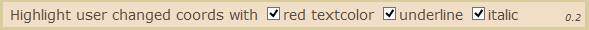</li>
<li>New: [Enhancement #30] Make colored illustration of versions in config selectable. 
Der teils doch etwas fleckig geratene Hintergrund im GClh Config mit den Informationen zu welcher Version ein Parameter implementiert wurde, kann nun abgewählt werden. 
</li>
<li>Fix: [Bug #31] When using "Log your visit (inline)" and clicking "All visited" for the trackables list opens an empty new tab. </li>
</ul>
(12.01.2017) 
 

---
## v0.2.2:
<ul><li>Der Bereich Map im GClh Config wurde komplett umgebaut und an die letzten Änderungen von GS angepaßt. Es gibt die neue Untergruppierung "Hide Map Elements", in der nun alle Hide Operationen zusammengefaßt sind. Die neuen Icons sind nun auch hier verfügbar und die beiden entfallenen A.P.E. und GPS Maze wurden auch hier entfernt. Außerdem wurde die Letterbox umgruppiert. Ist nun so wie auf der Karte.  Vielen Dank an <a href="https://www.geocaching.com/profile/?u=CachingFoX">CachingFoX</a>.  [Bug Issue #18, #19]  

<dl class="file"><dt class="attach-image">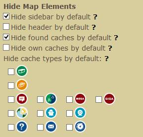</dt></dl>
</li>
<li>Im Bereich Map im GClh Config gibt es noch eine neue Gruppierung "Layers in map", die die gesamten Aufgaben der Kartenlayer abdeckt. Sollen die Layer nicht vom GClh geladen werden, wird der gesamte Bereich ausgeblendet. In der linken Liste sind die nicht verwendeten Layer, in der rechten die zu verwendenden Layer.  Und es wurde auch der standard Layer "Geocaching" von GS integriert! Vielen Dank an <a href="https://www.geocaching.com/profile/?u=CachingFoX">CachingFoX</a>.  [Enhancement Issue #16, #17]  

<dl class="file"><dt class="attach-image">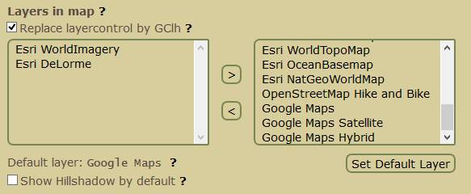</dt></dl>
</li>
<li>Im GClh Config wurde eine default Sprache vorgesehen. Ist sie aktiviert, wird auf den GC Seiten die Sprache geprüft, entspricht sie nicht der default Sprache, wird sie geändert. Hier geht es im wesentlichen um die automatische Korrektur der Englischumstellungen, die einige Apps benötigen, um korrekt zu laufen. Das betrifft dann insbesondere diejenigen User, die auf den GC Seiten auf Deutsch unterwegs sind. (Soweit ich mich erinnere, stammt dieser Wunsch noch aus dem Block von Torsten.)   [Enhancement Issue #21] 

<dl class="file"><dt class="attach-image"></dt></dl>
</li></ul>
<ul><li>In den Latest logs wurde der Logtext integriert beim Drüberfahren mit der Maus.  [Enhancement Issue #22]  

<dl class="file"><dt class="attach-image"></dt></dl>
</li>
<li>Im GClh Config wurden die Verbindungen zwischen Checkboxen und Texten hergestellt. Nun muß man nicht mehr genau auf die Checkbox zielen, sondern kann die Checkbox auch durch einen Click auf den Text bedienen.  Vielen Dank an <a href="https://www.geocaching.com/profile/?u=CachingFoX">CachingFoX</a>. 

<dl class="file"><dt class="attach-image">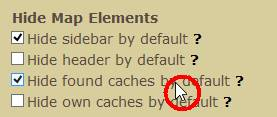</dt></dl>
</li>
<li>Fix: Overview map in listing: zoom in/out loses cache marker. If you zoom in/out the overview map in a cache listing, the cache marker gets replaced by a default marker and the static image shows an error therefore the proper marker creation fails.  [Bug Issue #2]   </li>
<li>Fix: Linklist/Seachfield fälschlich in Map/Labs aufgebaut.  [Bug Issue #24]</li></ul>
(09.01.2017) 
 

---
## v0.2.1:
<ul><li>New: Downloadzaehler simulieren.</li>
<li>New: Cache Listing: Latest Logs Symbole im Kopf des Listings anzeigen. Ueber GClh Config steuern. 

<dl class="file"><dt class="attach-image">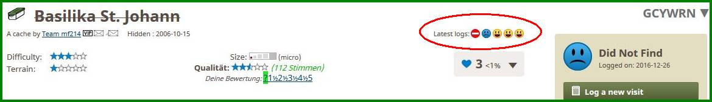</dt></dl>
</li>
<li>New: GClh Config: GClh Sync als neue Bookmark zum Aufruf aus Linklist eingerichtet.</li>
<li>Change: GClh Config: Links im Kopf vom GClh Config ueberarbeitet.</li>
<li>New: Logs anzeigen: Wenn nicht alle eigenen Logs geladen werden, weil beispielsweise das Laden der Seite ueber den Browser gestoppt wurde, dann angeben wieviele Logs geladen wurden und das Datum des letzten geladenen Logs angeben, Cache und Trackables. (Wird das Laden der Seite ueber den Browser gestoppt, funktioniert nicht mehr alles auf der Seite, so z.B. die Linklist.) (Anschliessend kann man dann beispielsweise auch GC Vote für eine begrenzte Anzahl an Caches nachladen.) 

<dl class="file"><dt class="attach-image">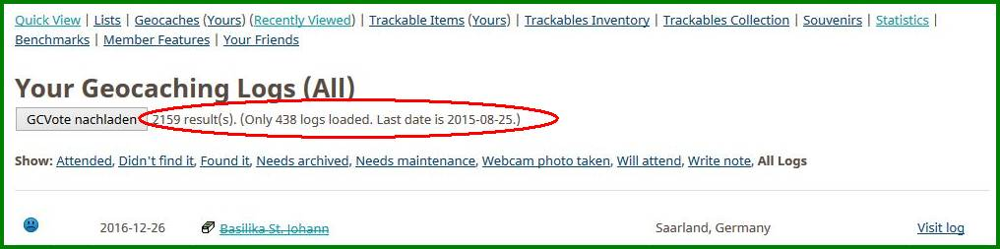</dt></dl>
</li>
<li>New: Cache Listing: Make VIP lists hideable. Ueber GClh Config steuern. 

<dl class="file"><dt class="attach-image"></dt></dl>
</li></ul>
(05.01.2017) 
 

---
## v0.1:
Rebuild GC little helper (2As) as GC little helper II:
<ol style="list-style-type: decimal"><li>Fix: Bei Eigenen Favoriten kein VIP Icon aufbauen. Hier steht gegebenenfalls das Pseudonym des Owners.</li><li>Fix: Save HomeCoords von Account Settings Seite funktionierte nicht mehr.</li><li>Fix: Select Buttons in einer Bookmarkliste aufbauen, aber nicht bei der Ablistung aller Bookmarklisten.</li><li>Fix: In Bookmarkliste nach dem Loeschen von Eintraegen (...bookmarks/bulk.aspx...) fehlt Zebra.</li><li>Fix: Farbliche Logkennzeichnung fuer User mit Sonderzeichen [] korrigiert.</li><li>Change: Spezielle Links Profile Tabs, Nearest Lists/Map, Own Trackables, GClh Config, GClh Sync und Find Player mit rechter und linker Maustaste funktionsfaehig machen mit Standard Contextmenue und postback.</li><li>Change: Config und Sync Aufrufe zusammengelegt und umgebaut. Rechte, linke Maus ueberall ok.</li><li>Change: Link zu alter deutscher Anleitung entfernt und Link github angepasst.</li></ol>
(05.01.2017) 
 

---
## v11.6.7 -&gt; v11.6.8 Fix:
<ol style="list-style-type: decimal"><li>MapQuest slippy map no longer available - remove both MapQuest layers  - use OpenStreetMap Mapnik as default map</li></ol>
 

---
## v11.6.6 -&gt; v11.6.7 Fix:
<ol style="list-style-type: decimal"><li>Neue Nachrichten des Message Centers wurden nicht mehr oder nicht mehr richtig angezeigt. (Sorry, mein Fehler.) Auf einigen Seiten, wie beispielsweise im öffentlichen Profil, verursacht das Message Center immer wieder mal Fehler. In diesen Fällen wird kein Zähler dagestellt. Das hängt aber nicht am GClh. </li></ol>
 

---
## v11.6.5 -&gt; v11.6.6 Fix:
<ol style="list-style-type: decimal"><li>Anzahl auszugebender Logs wurde fälschlicherweise um 1 reduziert.  Danke an Die Batzen: Ich hatte mich schon einige an diesem Problem versucht, kam aber nicht weiter. Das Beispiel war nun super, warum nicht mal im Kleinen versuchen.  Danke an RoRo: Das gemeldete Problem sollte damit auch behoben sein ..., hoffe ich.  </li><li>Beschreibung des Parameters "Show x logs" (settings_show_all_logs_count) ist nicht ganz korrekt, weil alle gelesenen Logs auch angezeigt werden, der Parameter ist also ein Minimalwert. Beschreibung im GClh Config angepaßt: Show at least x logs.  </li></ol>
 

---
## v11.6.4 -&gt; v11.6.5 Fix:
<ol style="list-style-type: decimal"><li>"Logged in Panel" mit Avatar ... auf "My Profile" Seite wurde durch GS geändert. (Danke CachingFox.) Eigentlich dachte ich, dass GS vor Seitenänderungen informiert, gestern Abend ging das nämlich noch. Oder haben die informiert?</li><li>Hillshadow funktionierte nicht, Adresse hat sich geändert. (Danke CachingFox.)   </li></ol>
 

---
## v11.6.3 -&gt; v11.6.4:
<ol style="list-style-type: decimal"><li><strong>New:</strong> "Find Player" für die Seiten im neuen Design ermöglicht.</li><li><strong>Fix:</strong> Updates stündlich checken.</li></ol>
 

---
## v11.6.2 -&gt; v11.6.3 Fix:
<ol style="list-style-type: decimal"><li>Beim Hovern über die mausaktivierten Bilder das Zucken im Hintergrund des Bildes im unteren Teil abgestellt.</li><li>$$023 Teilrückbau: Das Hovern über die mausaktivierten Bilder funktionierte im Cache Listing Bereich nicht.</li></ol>
 

---
## v11.6.1 -&gt; v11.6.2 Fix:
<ol style="list-style-type: decimal"><li>Die Namen von GClh Sync und GClh Config im Profil und die Bookmark GClh Config sind verwirrend wenn man mit GClh (2AS) arbeitet, sie sollten dem Scriptnamen entsprechen.</li><li>$$023 Teilrückbau: Image Gallerien: Gallerybreite auf Fenstergröße einstellen (vereinfacht mausaktivierten Bildwechsel).  Unterbindet im Profil das Verschieben nach links.</li><li>Orientierung der mausaktivierten Bilder angepaßt.  (Best practice in image galleries: Let the thumbnails as much as possible at the top or at the bottom of your screen. It should be better to hover with your mouse from the right side of your screen to the left side as inverse.)</li></ol>
 

---
## Rebuild GC little helper as GC little helper (2As), Version 11.6.1:

<strong>Fehlerbehebung (Fix), Änderungen (Change) und neue Funktionalität (New)</strong>  <strong>Global:</strong>       <strong>Fix:</strong> <ul><li>Avatar: Behandlung Checkbox zum Avatar in Settings, Preferences repariert.</li><li>Neue Seiten: Insbesondere "Message Center", "Find Cache", "Hide Cache", "GeoTours", "Labs" und auch "Account Settings" voll integriert.</li><li>Neue Seiten: Bei "Find Cache", "Hide Cache" und "GeoTours" wurde die Linklist ohne Event aufgebaut. </li><li>Neue Seiten: Remove advertisement instructions auch im Messagecenter durchführen. </li><li>Social Sharing: Hide (Facebook/Twitter) überall.  </li></ul><strong>Change:</strong> <ul><li>Mail, Message und VIP Icons: Auf weiteren Seiten etabliert. Steuerung über GClh Config.</li></ul><strong>New:</strong> <ul><li>VIP: Icon zusätzlich aufbauen: Im TB Listing für Owner und in den TB Logs. Bei Post, Edit, View Cache-Logs und TB-Logs. Bei Mail schreiben. Bei TB Inventar. Bei eigenen Favoriten.  </li><li>Warnmeldung: Wenn Warnmeldung über Down Time ... vorhanden ist, prüfen, ob sie identisch ist mit der bereits gesicherten, gegebenenfalls verbergen bzw. Button erzeugen zum Verbergen. Steuerung über GClh Config.</li></ul> <strong>Seitenheader, Navigations Menü:</strong>  <strong>Fix:</strong> <ul><li>Ausgabebreite: Variable Ausgabebreite im Header korrigiert und auf allen Seiten gesetzt. Den eigentlichen Contentbereich auf der Seite vergrößert. So beispielsweise den Platz für den Logtext im Listing verbreitert.</li><li>Find Player Link in Linklist: Verursachte fehlerhaftes Layout. So funktionierten beispielsweise die Menüs nicht mehr und das Layout im Header war verschoben. </li><li>GC Standard Menus: Ausblenden auch im neuen Seiten Design. </li><li>GClh Config Link in Linklist: Im neuen Seiten Design weglassen. GClh Config wird dort nicht richtig dargestellt.</li><li>GClh Config Link in Linklist: Aufruf aus Linklist repariert.</li><li>Linklist: Rechte Maustaste funktionierte nicht bei den speziellen Links aus Linkliste, gilt für Linklist on Top und im Profile. Repariert über direkten Link mit new Tab. Contextmenu wird nicht mehr angezeigt.</li><li>Message Center: Icon oben rechts wieder auswählbar gemacht.</li><li>Message Center: Verursacht immer mal wieder Fehler. Beseitigt, vermutlich.</li><li>Search Field: Repariert.</li></ul><strong>New:</strong> <ul><li>GC Tour: Platz für GC Tour Icon lassen. Steuerung über GClh Config.</li><li>Logo: Verkleinert. Steuerung über GClh Config.</li><li>Message Center, User Bereich rechts oben: Verkleinert. Steuerung über GClh Config.</li><li>Navigations Menü: Schriftgröße, Schriftfarbe, Abstände der Menü Punkte im vertikalen und horizontalen Menü und bis zu 3 Zeilen im horizontalen Menü mit und ohne Separator, frei wählbar über GClh Config steuerbar. </li></ul> <strong>Map:</strong>  <strong>Fix:</strong> <ul><li>Cache Types ausblenden: Auf der Karte werden die gewünschten Cache Types ausgeblendet, die Icons zum Cache Type wurden aber nicht gesetzt. </li><li>Cache Types: Die Reihenmarkierungen zu den Cache Types setzen.  </li><li>GC Map - Google Maps: Button zu GC Map in Google Maps platziert.</li><li>GC Map: Button "Find My Location" und Entfernungsangaben auf der Karte wurden beim ersten Verstecken der Sidebar nicht berücksichtigt, auch im Standard nicht.</li><li>GC Map: Warnmeldung wenn Leaflet-Map nicht aktiv ist, repariert.</li><li>GC Map: Fehler bei "Hide Map Header" repariert, wenn Auswahl zu "Set Map Preferences" angezeigt wurde.</li><li>Hide/Show Header: In der Sidebar der Karten komplett anzeigen und auch nicht mehr überblenden. Und rechts orientieren wegen möglichem GC Tour Icon.</li><li>Homezone: Auch die Multi Homezonen dürfen nicht angezeigt werden, wenn der Parameter "Show Homezone" deaktiviert ist.</li><li>Homezone: Die Homezone Circles werden manchmal zu früh aufgebaut, dann blinken sie kurz auf und sind dann auch schon wieder verschwunden. Das passiert insbesondere beim Kartenaufruf ohne Koordinaten, also beispielsweise aus dem Menü Play.</li><li>Kartenfilter: Bei externen Filtern (beispielsweise aus play/search) nichts verändern. Änderungen führten dazu, dass auf der Karte alle Caches und nicht die gemäß externem Filter in der Karte angezeigt wurden.</li><li>Layer: Konnten im Zusammenhang mit dem Einsatz von GC Vote nicht immer ausgetauscht werden, weil GC Vote ebenfalls mit den Layer Classen arbeitet.</li><li>Layerliste: In den Karten verbreitert, damit sie nicht zu schmal wird, wenn noch ein GC Vote Icon dort sitzt. </li></ul><strong>New:</strong> <ul><li>Google Maps - GC Map: Button zu Google Maps in GC Map platziert und Wechsel über neuen Browser Tab oder gleichen Tab ermöglicht. Steuerung über GClh Config. </li><li>Google Maps: Linke Sidebar in Google Maps ausblenden. Steuerung über GClh Config.</li><li>Linklist: Auch im Karten Header aufbauen.</li></ul> <strong>Listing:</strong>  <strong>Fix:</strong> <ul><li>Disclaimer Hide: Bei Mega, Giga Events wurde 'Related Web Page' als Disclaimer ausgeblendet und Disclaimer blieb stehen. </li><li>Favoritenbox: Box wurde mit Update vom 29.06.2016 geändert.</li><li>Image, Logs: Mausaktivierte Bilder deaktiviert, wenn die Logs nicht vom GClh geladen werden, weil das dann nicht korrekt funktioniert. Unterstrichene Bildnamen behoben.</li><li>Image, Spoiler-Filter: Der Filter funktioniert nicht, Funktionalität deaktiviert.</li><li>Logs: VIP Icons wieder setzen. </li><li>Logs: "Edit Log / Images" und "Upload Image" wieder setzen. </li><li>Logs: Anzahl Load Logs repariert.</li><li>Post log from PMO-Listing as Basic Member (inline): Notdürftig repariert.</li><li>Show Eventday beside Date: Giga Event integriert.</li><li>TB, Logs: Farbliche Hervorhebung von Owner und User und Zebra in den Logs korrigiert.</li><li>TB, Logs: Verarbeitung von Platzhaltern in TB Logs repariert.</li><li>VIP Listen: Ohne Einträge aufbauen, wenn die Logs nicht vom GClh geladen werden.</li></ul><strong>Change:</strong> <ul><li>Decrypt hints: Gepimpt.</li><li>Favoritenbox: Kompletter Umbau, schneller gemacht und Dropdown verbessert.</li><li>Hide hints behind a link: Gepimpt.</li><li>Hide/Show Cache Note: Gepimpt.</li><li>Highlight changed coordinates: Gepimpt.</li><li>Logs: Log-Template und Load Logs überarbeitet. Standard Aufbereitung der Logtexte etabliert. Logtext etwas gestrafft. Aufbereitung zum User des Logs gestrafft, eine Zeile für den Namen, eine Zeile für die Icons. </li><li>Post log from Listing (inline)": Gepimpt.</li></ul><strong>New:</strong> <ul><li>Ignore: Link Bezeichnung für bereits ignorierte Caches ändern in 'Stop Ignoring'. Steuerung über GClh Config.</li><li>Image, TB: Mausaktivierte Bilder eingebaut.</li><li>Logs: Farbliche Hervorhebung in TB und Cache Logs von User, Owner, VIP, Zebra Effekt und Steuerung über GClh Config.</li><li>Mail Icons bei Usern in "VIP-List": Eingebaut. Steuerung über GClh Config.</li><li>Message Icon: Hinter Mail Icon aufbauen. Steuerung über GClh Config. </li><li>Überblicks Karte: Von Cache Lokation oben rechts im Cache Listing eingebaut. (Gabs mal im Standard.)</li></ul> <strong>Profil:</strong>  <strong>Fix:</strong> <ul><li>Trackables: Wenn User keine eigenen Trackables, dann Fehler im Profile Trackables.</li></ul><strong>New:</strong> <ul><li>All my VIPs Liste: Mail Icons zu Usern in Liste aufbauen. Steuerung über GClh Config.</li><li>All my VIPs Liste: Block auch klappbar machen.</li><li>Linklist: Block auch klappbar machen. </li><li>Statistik: Auswertung zur Matrix auf der Statistik Seite und im Profile erweitert: Anzahl komplette Matrixes. Farbliche Hervorhebung für die nächsten x möglichen Matrixes. Links zur Suche nach entsprechenden Caches mit einem Radius von x km in Karte oder Liste. Steuerung über GClh Config. </li></ul> <strong>Logging:</strong>  <strong>Fix:</strong> <ul><li>Show Datepicker beside Date on Log-Page: Funktioniert nicht mehr und ist auch nicht mehr notwendig, entfernt.</li></ul><strong>Change:</strong> <ul><li>BBCode: Entfernt.</li></ul> <strong>Bookmarklisten, Watchliste, Pocket Queries, Fieldnotes und andere Listen:</strong>  <strong>Fix:</strong> <ul><li>Falsche Markierung: Der Einträge in Bookmarklisten durch zwischenzeitliche Änderungen repariert.</li><li>F2 Save: Speichern mit F2 Taste bei "Create a Bookmark", "Edit a Bookmark" und "Bookmark Pocket Query" repariert und Button Bezeichnung um F2 ergänzt.</li><li>GClh Config: Auf der Fieldnotes Seite läßt sich der GClh Config nicht aufbauen. Das hängt mit Namen der function checkbox zusammen. Nach Änderung in checkboxy gab es keine Probleme mehr.</li><li>KML: Die Anzeige von KML Dateien in Google Maps funktioniert so nicht mehr. Links entfernt.</li></ul><strong>New:</strong> <ul><li>Anzahl der Caches und Anzahl der selektierten Caches: In Bookmarklisten und Watchliste in den Kategorien All, Found, Archived und Deactivated, entsprechend der Selektions Buttons, anzeigen. Steuerung über GClh Config.</li><li>Listen: Zebra Look und Found Einfärbung über GClh Config.  </li><li>Loggen: über Standard "Log It" Icons zu Premium Only Caches für Basic Members ermöglicht.</li></ul> <strong>Image Gallery:</strong>  <strong>Fix:</strong> <ul><li>Cache und Profil: Mausaktivierte Bilder repariert. </li></ul><strong>New:</strong> <ul><li>Show bigger images in gallery: Auch für TB.</li><li>TB: Mausaktivierte Bilder eingebaut.</li></ul> <strong>GClh Config, GClh Sync:</strong>  <strong>Fix:</strong> <ul><li>Cache Typ: Um Giga Event erweitert.</li><li>Home-Coords, Multi Homezone: Koordinaten in den GClh Feldern Home-Coords und Multi Homezone vollqualifiziert ausgeben, auch wenn sie auf .000 enden, sonst werden sie beim nächsten Speichern demoliert.</li><li>Invalid format Meldung: Eliminiert. </li><li>Linklist: Echte Linkbezeichnungen anzeigen und nicht den Default. Default als Title.  </li></ul><strong>New:</strong> <ul><li>Call GClh Config: F4 Call aus allen erlaubten Seiten heraus ermöglicht. Steuerung über GClh Config. </li><li>Linklist: Einige Bookmarks für Linklist ergänzt.</li><li>Linklist: Bookmarks kennzeichnen, wenn sie, bzw. wenn sie nicht, in der Linklist vorhanden sind.</li><li>Linklist: Sortierung ermöglicht für default Bookmark Links für Linklist.</li><li>Neue Parameter: Im GClh Config mit Version versehen und farblich etwas hervorheben. </li><li>Neue Platzhalter für Logs: Aktuelles Datum und aktuelle Zeit. Danke an SiMaKiDD, er hats erfunden. </li><li>Save GClh Config: F2 Save aus GClh Config ermöglicht. Steuerung über GClh Config.</li></ul>

