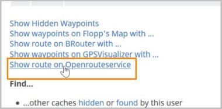
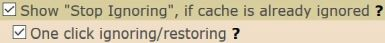
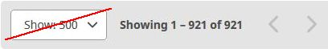

<a href="#v010" title="GClh II version 0.10 (??.??.2019)">v0.10</a> &nbsp;
<a href="changelog_before.md" title="Go to earlier changelog">Earlier changelog</a> &nbsp;

---
## v0.10:

### Listing:
<ul>
	<li>
		<strong>New:</strong> Added Openrouteservice as an additional map service. [<a href="https://github.com/2Abendsegler/GClh/issues/897" title="Issue 897">897</a> / <a href="https://www.geocaching.com/profile/?u=2Abendsegler" title="Thanks to 2Abendsegler">2Abendsegler</a>] 
		Openrouteservice also offers in addition to usual mediums for locomotion "wheelchair" as medium for locomotion in europe. 
                </a> 
		You can pick Openrouteservice in cache listing in the right navigation bar, or behind the "Additional Waypoints", if there are additional waypoints. 
                </a> 
                </a> 
		<a href="https://www.geocaching.com/my/#GClhShowConfig#a#settings_show_openrouteservice_link" title="Link to your GClh Config">Settings -> Listing: 
		</a> 
		If you want to use your home coordinates as start point for the route, you have to activate the parameter.  
	</li>
	<li>
		<strong>New:</strong> Copy various cache informations to clipboard. [<a href="https://github.com/2Abendsegler/GClh/issues/1096" title="Issue 1096">1096</a> / <a href="https://www.geocaching.com/profile/?u=Herr Ma" title="Thanks to Herr Ma">Herr Ma</a>] 
		If there are changed coordinates, not only the original coordinates but also the changed coordinates can be copied to the clipboard. 
		 
		<a href="https://www.geocaching.com/my/#GClhShowConfig#a#settings_show_copydata_menu" title="Link to your GClh Config">Settings -> Listing:  
		</a>  
	</li>
	<li>
		<strong>New:</strong> Button to copy coordinates to the clipboard. [<a href="https://github.com/2Abendsegler/GClh/issues/1095" title="Issue 1095">1095</a> / <a href="https://www.geocaching.com/profile/?u=Herr Ma" title="Thanks to Herr Ma">Herr Ma</a>] 
		If there are changed coordinates, the changed coordinates are copied into the clipboard, otherwise the original coordinates. 
		  
	</li>
	<li>
		<strong>New:</strong> One click ignoring/restoring. [<a href="https://github.com/2Abendsegler/GClh/issues/1053" title="Issue 1053">1053</a> / <a href="https://www.geocaching.com/profile/?u=2Abendsegler" title="Thanks to 2Abendsegler">2Abendsegler</a>] 
		With this feature you will be able to ignore respectively restore a cache in cache listing with only one click. 
		</a> 
		<a href="https://www.geocaching.com/my/#GClhShowConfig#a#settings_use_one_click_ignoring" title="Link to your GClh Config">Settings -> Listing: 
		</a> 
	        The "One click" feature runs only together with the "Show Stop Ignoring" feature. Please note that the "Show Stop Ignoring" feature is not new and you may need to activate the parameter, if you want to use the "One click" feature.  
	</li>
	<li>
		<strong>New:</strong> One click watching. [<a href="https://github.com/2Abendsegler/GClh/issues/1072" title="Issue 1072">1072</a> / <a href="https://www.geocaching.com/profile/?u=2Abendsegler" title="Thanks to 2Abendsegler">2Abendsegler</a>] 
		With this feature you can add a cache in cache listing to your watchlist with just one click. 
		</a> 
		<a href="https://www.geocaching.com/my/#GClhShowConfig#a#settings_use_one_click_watching" title="Link to your GClh Config">Settings -> Listing: 
		</a>  
	</li>
        <li>
		<strong>New:</strong> Button for hiding lot of stuff in cache listing logs. [<a href="https://github.com/2Abendsegler/GClh/issues/1045" title="Issue 1045">1045</a> / <a href="https://www.geocaching.com/profile/?u=Ruko2010" title="Thanks to Ruko2010">Ruko2010</a>] 
		The functionality can be used, for example, to compare an external logbook with an online logbook. 
		 
		<a href="https://www.geocaching.com/my/#GClhShowConfig#a#settings_show_compact_logbook_but" title="Link to your GClh Config">Settings -> Listing: 
		</a>  
	</li>
	<li>
		<strong>New:</strong> Hide found counter in cache listing. [<a href="https://github.com/2Abendsegler/GClh/issues/1044" title="Issue 1044">1044</a> / <a href="https://www.geocaching.com/profile/?u=Ruko2010" title="Thanks to Ruko2010">Ruko2010</a>] 
		 
		<a href="https://www.geocaching.com/my/#GClhShowConfig#a#settings_hide_found_count" title="Link to your GClh Config">Settings -> Listing: 
		</a> 
		If you want to use it, you have to activate the parameter.  
	</li>
	<li>
		<strong>New:</strong> Set cache type icon and log status icon in cache listing always visible. [<a href="https://github.com/2Abendsegler/GClh/issues/1110" title="Issue 1110">1110</a> / <a href="https://www.geocaching.com/profile/?u=2Abendsegler" title="Thanks to 2Abendsegler">2Abendsegler</a>] 
		Cache type icon: 
		  
		<a href="https://www.geocaching.com/my/#GClhShowConfig#a#settings_cache_type_icon_visible" title="Link to your GClh Config">Settings -> Listing: 
		</a> 
		Log status icon: 
		  
		<a href="https://www.geocaching.com/my/#GClhShowConfig#a#settings_log_status_icon_visible" title="Link to your GClh Config">Settings -> Listing: 
		</a>  
	</li>
	<li>
		<strong>Fix:</strong> Thunderforest is no longer supported on BRouter and Flopps. [<a href="https://github.com/2Abendsegler/GClh/issues/1041" title="Issue 1041">1041</a> / <a href="https://www.geocaching.com/profile/?u=radlerandi" title="Thanks to radlerandi">radlerandi</a>] 
	</li>
	<li>
		<strong>Fix:</strong> BRouter with empty waypoint in URL. [<a href="https://github.com/2Abendsegler/GClh/issues/1042" title="Issue 1042">1042</a> / <a href="https://www.geocaching.com/profile/?u=2Abendsegler" title="Thanks to 2Abendsegler">2Abendsegler</a>] 
	</li>
	<li>
		<strong>Fix:</strong> The weekday of an event is not shown in disabled events. [<a href="https://github.com/2Abendsegler/GClh/issues/1086" title="Issue 1086">1086</a> / <a href="https://www.geocaching.com/profile/?u=2Abendsegler" title="Thanks to 2Abendsegler">2Abendsegler</a>] 
	</li>
	<li>
		<strong>Fix:</strong> The long VIP list doesn't consider the parameter "Show owner in VIP list". [<a href="https://github.com/2Abendsegler/GClh/issues/1088" title="Issue 1088">1088</a> / <a href="https://www.geocaching.com/profile/?u=2Abendsegler" title="Thanks to 2Abendsegler">2Abendsegler</a>] 
	</li>
</ul>
 

### Lists, Bookmark lists, Favorites, Ignore list:
<ul>	
	<li>
		<strong>New:</strong> Integrate GClh header with Linklist and GClh Search in new designed lists page with My Lists, Favorites and Ignored Caches. [<a href="https://github.com/2Abendsegler/GClh/issues/1052" title="Issue 1052">1052</a> / <a href="https://www.geocaching.com/profile/?u=2Abendsegler" title="Thanks to 2Abendsegler">2Abendsegler</a>] 
		  
	</li>
	<li>
		<strong>New:</strong> Add link "Ignore List" to Linklist. [<a href="https://github.com/2Abendsegler/GClh/issues/1052" title="Issue 1052">1052</a> / <a href="https://www.geocaching.com/profile/?u=2Abendsegler" title="Thanks to 2Abendsegler">2Abendsegler</a>] 
		<a href="https://www.geocaching.com/my/#GClhShowConfig#a#ll#settings_bookmarks_top_menu_h" title="Link to your GClh Config">Settings -> Linklist / Navigation:  
		</a> 
		If you want to use it in your Linklist, you have to set it.  
	</li>
	<li>
		<strong>New:</strong> Show 1000 caches instead of maximum 500 caches in own bookmark lists. [<a href="https://github.com/2Abendsegler/GClh/issues/1059" title="Issue 1059">1059</a> / <a href="https://www.geocaching.com/profile/?u=2Abendsegler" title="Thanks to 2Abendsegler">2Abendsegler</a>] 
		Because GS does not allow an extension of the button to choose the number of showing caches, we hide the button if you use the feature to show 1000 caches. 
		 
		<a href="https://www.geocaching.com/my/#GClhShowConfig#a#settings_show_1000_bm_lists" title="Link to your GClh Config">Settings -> Bookmark list:  
		</a> 
		If you want to use it, you have to activate the parameter.  
	</li>
</ul>
 

### Pocket query:
<ul>	
	<li>
		<strong>Improve:</strong> Rewrite fixed PQ header/footer by pure CSS. Compatible with compact view. [<a href="https://github.com/2Abendsegler/GClh/issues/1034" title="Issue 1034">1034</a> / <a href="https://www.geocaching.com/profile/?u=Dratenik" title="Thanks to Dratenik">Dratenik</a>] 
		The functionality is not new. New is only the great functionality. Especially for small screens very well, because the line stays at the bottom of the screen when you scroll through the pocket queries. 
		 
		<a href="https://www.geocaching.com/my/#GClhShowConfig#a#settings_fixed_pq_header" title="Link to your GClh Config">Settings -> Pocket query: 
		</a> 
	        Please note that the feature is not new and you may need to activate the parameter.  
	</li>
</ul>
 

### Map (search map):
<ul>	
	<li>
		<strong>New:</strong> Integrate GClh header with Linklist and GC Search in new designed map page (search map). [<a href="https://github.com/2Abendsegler/GClh/issues/987" title="Issue 987">987</a> / <a href="https://www.geocaching.com/profile/?u=2Abendsegler" title="Thanks to 2Abendsegler">2Abendsegler</a>] 
		</a>  
	</li>
	<li>
		<strong>New:</strong> Add link "Search Map" to Linklist. [<a href="https://github.com/2Abendsegler/GClh/issues/987" title="Issue 987">987</a> / <a href="https://www.geocaching.com/profile/?u=2Abendsegler" title="Thanks to 2Abendsegler">2Abendsegler</a>] 
		<a href="https://www.geocaching.com/my/#GClhShowConfig#a#ll#settings_bookmarks_top_menu_h" title="Link to your GClh Config">Settings -> Linklist / Navigation:  
		</a> 
		If you want to use it in your Linklist, you have to set it.  
	</li>
</ul>
 

### Others:
<ul>	
	<li>
		<strong>New:</strong> Show unpublished caches in dashboard and show compact layout on unpublished caches page. [<a href="https://github.com/2Abendsegler/GClh/issues/1055" title="Issue 1055">1055</a> / <a href="https://www.geocaching.com/profile/?u=capoaira" title="Thanks to capoaira">capoaira</a>] 
		Show unpublished caches in dashboard: 
		 
		<a href="https://www.geocaching.com/my/#GClhShowConfig#a#settings_showUnpublishedHides" title="Link to your GClh Config">Settings -> Dashboard:  
		</a> 
		Show compact layout on unpublished caches page: 
		 
		<a href="https://www.geocaching.com/my/#GClhShowConfig#a#settings_compactLayout_unpublishedList" title="Link to your GClh Config">Settings -> Others:  
		</a> 
	</li>
	<li>
		<strong>Improve:</strong> Improve GClh Search to Geo tours. [<a href="https://github.com/2Abendsegler/GClh/issues/1104" title="Issue 1104">1104</a> / <a href="https://www.geocaching.com/profile/?u=capoaira" title="Thanks to capoaira">capoaira</a>] 
		</a>  
	</li>
	<li>
		<strong>Fix:</strong> Show listing of (own) unpublished cache throws error. [<a href="https://github.com/2Abendsegler/GClh/issues/1039" title="Issue 1039">1039</a> / <a href="https://www.geocaching.com/profile/?u=Ruko2010" title="Thanks to Ruko2010">Ruko2010</a>] 
	</li>
	<li>
		<strong>Fix:</strong> Improve new and old log form. Show log preview on log page direct after automatic adding log signature, using log templates and using smilies. Make sure that signature is not generated multiple times. [<a href="https://github.com/2Abendsegler/GClh/issues/1047" title="Issue 1047">1047</a> / <a href="https://www.geocaching.com/profile/?u=2Abendsegler" title="Thanks to 2Abendsegler">2Abendsegler</a>] 
	</li>
	<li>
		<strong>Fix:</strong> Hide Facebook login doesn't run. [<a href="https://github.com/2Abendsegler/GClh/issues/1073" title="Issue 1073">1073</a> / <a href="https://www.geocaching.com/profile/?u=2Abendsegler" title="Thanks to 2Abendsegler">2Abendsegler</a>] 
	</li>
	<li>
		<strong>Fix:</strong> No coloring of TB listing. [<a href="https://github.com/2Abendsegler/GClh/issues/1074" title="Issue 1074">1074</a> / <a href="https://www.geocaching.com/profile/?u=2Abendsegler" title="Thanks to 2Abendsegler">2Abendsegler</a>] 
	</li>
	<li>
		<strong>Fix:</strong> Show bigger images in gallery doesn't run correct. [<a href="https://github.com/2Abendsegler/GClh/issues/1078" title="Issue 1078">1078</a> / <a href="https://www.geocaching.com/profile/?u=2Abendsegler" title="Thanks to 2Abendsegler">2Abendsegler</a>] 
	</li>
	<li>
		<strong>Fix:</strong> Link to Ignore List in dashboard doesn't run. [<a href="https://github.com/2Abendsegler/GClh/issues/1079" title="Issue 1079">1079</a> / <a href="https://www.geocaching.com/profile/?u=2Abendsegler" title="Thanks to 2Abendsegler">2Abendsegler</a>] 
	</li>
	<li>
		<strong>Fix:</strong> The changes of the links "Lists" and "Your lists" in dashboard to old-fashioned lists page are not longer possible. [<a href="https://github.com/2Abendsegler/GClh/issues/1080" title="Issue 1080">1080</a> / <a href="https://www.geocaching.com/profile/?u=2Abendsegler" title="Thanks to 2Abendsegler">2Abendsegler</a>] 
	</li>
	<li>
		<strong>Fix:</strong> Arrangement the Linklist and the other menus at the right side does not run. Alignment of vertical and horizontal menus. [<a href="https://github.com/2Abendsegler/GClh/issues/1091" title="Issue 1091">1091</a> / <a href="https://www.geocaching.com/profile/?u=2Abendsegler" title="Thanks to 2Abendsegler">2Abendsegler</a>] 
	</li>
</ul>
 
(??.??.2019) 
released by <a href="https://www.geocaching.com/profile/?u=Ruko2010">Ruko2010</a> 
 

<a href="changelog_before.md" title="Go to earlier changelog">Go to earlier changelog.</a> &nbsp;
