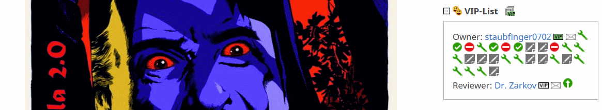
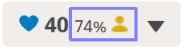
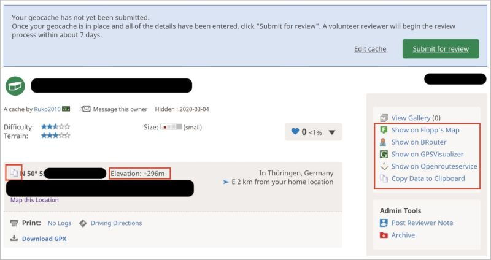
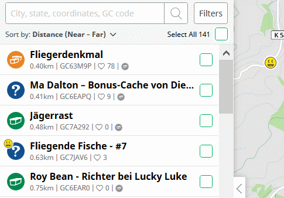
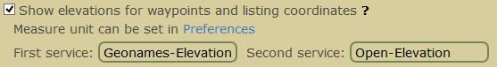
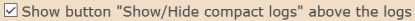

<a href="#v0108" title="GClh II version 0.10.8 (12.09.2020)">v0.10.8</a> &nbsp;
<a href="#v0107" title="GClh II version 0.10.7 (07.06.2020)">v0.10.7</a> &nbsp;
<a href="#v0106" title="GClh II version 0.10.6 (07.05.2020)">v0.10.6</a> &nbsp;
<a href="#v0105" title="GClh II version 0.10.5 (13.03.2020)">v0.10.5</a> &nbsp;
<a href="#v0104" title="GClh II version 0.10.4 (13.02.2020)">v0.10.4</a> &nbsp;
<a href="#v0103" title="GClh II version 0.10.3 (09.01.2020)">v0.10.3</a> &nbsp;
<a href="#v0102" title="GClh II version 0.10.2 (05.01.2020)">v0.10.2</a> &nbsp;
<a href="#v0101" title="GClh II version 0.10.1 (20.12.2019)">v0.10.1</a> &nbsp;
<a href="#v010" title="GClh II version 0.10 (13.12.2019)">v0.10</a> &nbsp;
<a href="changelog_before.md" title="Go to earlier changelog">Earlier changelog</a> &nbsp;

---
## v0.10.8:

### Maps:
<ul>
	<li>
		<strong>New:</strong> [New Map] Hide found/own caches, cache types and sidebar also in new Map (Search Map). [<a href="https://github.com/2Abendsegler/GClh/issues/1304" title="Issue 1304">1304</a> / <a href="https://www.geocaching.com/profile/?u=Die Batzen" title="Thanks to Die Batzen">Die Batzen</a> 😊] 
		<a href="https://www.geocaching.com/my/#GClhShowConfig#a#settings_map_hide_sidebar" title="Link to your GClh Config">Settings -> Maps: 
		</a>  
	</li>
	<li>
		<strong>Info:</strong> [New/old Map] Mark features in Config which are only available in one of the maps. [<a href="https://www.geocaching.com/profile/?u=2Abendsegler" title="2Abendsegler">2Abendsegler</a>] 
		The following features are only available on the new Map (Search Map): 
		<a href="https://www.geocaching.com/my/#GClhShowConfig#a#settings_searchmap_autoupdate_after_dragging" title="Link to your GClh Config">Settings -> Maps: 
		</a> 
		The following features are only available on the old Map (Browse Map): 
		<a href="https://www.geocaching.com/my/#GClhShowConfig#a#settings_show_homezone" title="Link to your GClh Config">Settings -> Maps: 
		 
		 
		 
		 
		</a>  
	</li>
	<li>
		<strong>New:</strong> [New Map] Add links on Google Maps and Openstreetmap to new GC Map. [<a href="https://github.com/2Abendsegler/GClh/issues/1374" title="Issue 1374">1374</a> / <a href="https://www.geocaching.com/profile/?u=2Abendsegler" title="Thanks to 2Abendsegler">2Abendsegler</a>] 
		<a href="https://www.geocaching.com/my/#GClhShowConfig#a#settings_hide_left_sidebar_on_google_maps" title="Link to your GClh Config">Settings -> Maps: 
		</a> 
		Google Maps: 
		 
		Openstreetmap: 
		  
	</li>
	<li>
		<strong>New:</strong> [Old Map] Hide and show "Community Celebration Events" together with "Events". [<a href="https://github.com/2Abendsegler/GClh/issues/1386" title="Issue 1386">1386</a> / <a href="https://www.geocaching.com/profile/?u=2Abendsegler" title="Thanks to 2Abendsegler">2Abendsegler</a>] 
		In the old Map there is no icon to hide "Community Celebration Events". Therefore, these events remain visible even if you have hidden all events with the event icons. Now, if you hide or show "Events", the "Community Celebration Events" should also be hidden or showed. This also works for the features "Show / hide all Cachetypes". 
		  
	</li>
	<li>
		<strong>New:</strong> [New/old Map] Show number of images on the maps and provide a link to the image gallery. [<a href="https://github.com/2Abendsegler/GClh/issues/1399" title="Issue 1399">1399</a> / <a href="https://www.geocaching.com/profile/?u=2Abendsegler" title="Thanks to 2Abendsegler">2Abendsegler</a>] 
		Popup of the old Map (Browse Map): 
		 
		Detail screen of the new Map (Search Map): 
		  
	</li>
	<li>
		<strong>Fix:</strong> [New Map] Align logs again correctly in the detail screen. [<a href="https://github.com/2Abendsegler/GClh/issues/1375" title="Issue 1375">1375</a> / <a href="https://www.geocaching.com/profile/?u=2Abendsegler" title="Thanks to 2Abendsegler">2Abendsegler</a>]  
	</li>
</ul>
 

### Cache Listing:
<ul>	
	<li>
		<strong>New:</strong> [Cache listing] Highlight found places from cache listing "Search in logtext" in the logs. [<a href="https://github.com/2Abendsegler/GClh/issues/1437" title="Issue 1437">1437</a> / <a href="https://www.geocaching.com/profile/?u=2Abendsegler" title="Thanks to 2Abendsegler">2Abendsegler</a>] 
		  
	</li>
	<li>
		<strong>New:</strong> [Cache listing] Additional link for logging premium caches for non-premium cachers. [<a href="https://github.com/2Abendsegler/GClh/issues/1345" title="Issue 1345">1345</a> / <a href="https://www.geocaching.com/profile/?u=2Abendsegler" title="Thanks to 2Abendsegler">2Abendsegler</a>] 
		  
		To "Log your visit" not inline, you have to do nothing.  
		To "Log your visit (inline)" you have to activate possibly the parameter. If you're using an ad-blocking add-on, such as uBlock, the embedded screen may not be allowed. To turn this off, you have to add "www.geocaching.com/geocache/GC*" to the whitelist, or something similar, of your add-on. 
		<a href="https://www.geocaching.com/my/#GClhShowConfig#a#settings_log_inline_pmo4basic" title="Link to your GClh Config">Settings -> Listing: 
		</a>  
	</li>
	<li>
		<strong>New:</strong> [Cache listing] After clicking on a log icon in the VIP area, go to the log, even if the log is not yet displayed. [<a href="https://github.com/2Abendsegler/GClh/issues/1411" title="Issue 1411">1411</a> / <a href="https://www.geocaching.com/profile/?u=2Abendsegler" title="Thanks to 2Abendsegler">2Abendsegler</a>] 
		  
	</li>
	<li>
		<strong>New:</strong> [Cache listing] Build links to the log section, at the top log totals. [<a href="https://github.com/2Abendsegler/GClh/issues/1413" title="Issue 1413">1413</a> / <a href="https://www.geocaching.com/profile/?u=2Abendsegler" title="Thanks to 2Abendsegler">2Abendsegler</a>] 
		  
	</li>
	<li>
		<strong>New:</strong> [Cache Listing] New feature for the menu "copy data to clipboard": Addition of data to clipboard. [<a href="https://github.com/2Abendsegler/GClh/issues/1365" title="Issue 1365">1365</a> / <a href="https://www.geocaching.com/profile/?u=2Abendsegler" title="Thanks to 2Abendsegler">2Abendsegler</a> / <a href="https://www.geocaching.com/profile/?u=Die Batzen" title="Thanks to Die Batzen">Die Batzen</a> / <a href="https://www.geocaching.com/profile/?u=Herr Ma" title="Thanks to Herr Ma">Herr Ma</a>] 
		This feature allows you not only to copy something to the clipboard after clearing the clipboard, but also to add something to the clipboard without clearing it. This is how you can collect things on the clipboard. You can enter a separator to use between the addings. The default value is a line feed. 
		<a href="https://www.geocaching.com/my/#GClhShowConfig#a#settings_show_copydata_menu" title="Link to your GClh Config">Settings -> Listing: 
		</a> 
		If you want to use this feature, you have to activate the parameter.  
		For example: 
		1. Copy a GC Code to clipboard 
		2. Than add a further GC Code to clipboard 
		3. Then paste the content of the clipboard with the keys on the keyboard "Strg" ("Ctrl") and "v"  
		  
	</li>
	<li>
		<strong>Fix:</strong> [Cache listing] Display favorite percent and own favorite point in cache listing again. [<a href="https://github.com/2Abendsegler/GClh/issues/1366" title="Issue 1366">1366</a> / <a href="https://www.geocaching.com/profile/?u=2Abendsegler" title="Thanks to 2Abendsegler">2Abendsegler</a>] 
		  
	</li>
	<li>
		<strong>Fix:</strong> [Cache listing] "Photo file name" in "Copy Data to Clipboard" feature in cache listings use invalid characters. [<a href="https://github.com/2Abendsegler/GClh/issues/1348" title="Issue 1348">1348</a> / <a href="https://www.geocaching.com/profile/?u=2Abendsegler" title="Thanks to 2Abendsegler">2Abendsegler</a>]  
	</li>
	<li>
		<strong>Fix:</strong> [Cache listing] For basic member the dropdown menu in premium cache listings are not aligned properly. [<a href="https://github.com/2Abendsegler/GClh/issues/1435" title="Issue 1435">1435</a> / <a href="https://www.geocaching.com/profile/?u=2Abendsegler" title="Thanks to 2Abendsegler">2Abendsegler</a>]  
	</li>
</ul>
 

### Owner Dashboard:
<ul>
	<li>
		<strong>New:</strong> [Owner Dashboard] Add links to cachetypes. [<a href="https://github.com/2Abendsegler/GClh/issues/1377" title="Issue 1377">1377</a> / <a href="https://www.geocaching.com/profile/?u=capoaira" title="Thanks to capoaira">capoaira</a>] 
		  
	</li>
	<li>
		<strong>New:</strong> [Owner Dashboard] Add link to own profile. [<a href="https://github.com/2Abendsegler/GClh/issues/1402" title="Issue 1402">1402</a> / <a href="https://www.geocaching.com/profile/?u=capoaira" title="Thanks to capoaira">capoaira</a>] 
		  
	</li>
	<li>
		<strong>New:</strong> [Owner Dashboard] Build up the new links in Linklist. [<a href="https://github.com/2Abendsegler/GClh/issues/1384" title="Issue 1384">1384</a> / <a href="https://www.geocaching.com/profile/?u=2Abendsegler" title="Thanks to 2Abendsegler">2Abendsegler</a>] 
		  
	</li>
	<li>
		<strong>New:</strong> [Owner Dashboard] Build header with navigation menu and Linklist. [<a href="https://github.com/2Abendsegler/GClh/issues/1382" title="Issue 1382">1382</a> / <a href="https://www.geocaching.com/profile/?u=2Abendsegler" title="Thanks to 2Abendsegler">2Abendsegler</a>]  
	</li>
</ul>
 

### New Dashboard:
<ul>
	<li>
		<strong>New:</strong> [New Dashboard] Create direct "Edit log"-links on the dashboard to make logs editable without an extra-step. [<a href="https://github.com/2Abendsegler/GClh/issues/1353" title="Issue 1353">1353</a> / <a href="https://www.geocaching.com/profile/?u=2Abendsegler" title="Thanks to 2Abendsegler">2Abendsegler</a>] 
		  
	</li>
	<li>
		<strong>Fix:</strong> [New Dashboard] Unpublished caches in new dashboard have disappeared. [<a href="https://github.com/2Abendsegler/GClh/issues/1371" title="Issue 1371">1371</a> / <a href="https://www.geocaching.com/profile/?u=capoaira" title="Thanks to capoaira">capoaira</a>] 
		  
	</li>
</ul>
 

### Others:
<ul>
	<li>
		<strong>New:</strong> [Header] Get asynchron header replacement only once a day to speed up loading page. [<a href="https://github.com/2Abendsegler/GClh/issues/1427" title="Issue 1427">1427</a> / <a href="https://www.geocaching.com/profile/?u=2Abendsegler" title="Thanks to 2Abendsegler">2Abendsegler</a>]  
	</li>
	<li>
		<strong>New:</strong> [Wonders of the World] Build header with navigation menu and Linklist. [<a href="https://github.com/2Abendsegler/GClh/issues/1382" title="Issue 1382">1382</a> / <a href="https://www.geocaching.com/profile/?u=2Abendsegler" title="Thanks to 2Abendsegler">2Abendsegler</a>]  
	</li>
	<li>
		<strong>Fix:</strong> [New Drafts] Wrong link to cache listing. [<a href="https://github.com/2Abendsegler/GClh/issues/1415" title="Issue 1415">1415</a> / <a href="https://www.geocaching.com/profile/?u=2Abendsegler" title="Thanks to 2Abendsegler">2Abendsegler</a>] 
		  
	</li>
	<li>
		<strong>Fix:</strong> [TB map] Resizable TB-Map does not work. [<a href="https://github.com/2Abendsegler/GClh/issues/1287" title="Issue 1287">1287</a> / <a href="https://www.geocaching.com/profile/?u=2Abendsegler" title="Thanks to 2Abendsegler">2Abendsegler</a>] 
		  
	</li>
	<li>
		<strong>Fix:</strong> [New log form] Correct position of date. [<a href="https://github.com/2Abendsegler/GClh/issues/1406" title="Issue 1406">1406</a> / <a href="https://www.geocaching.com/profile/?u=2Abendsegler" title="Thanks to 2Abendsegler">2Abendsegler</a>]  
	</li>
	<li>
		<strong>Fix:</strong> [TB upload] Incorrect navigation menu location on page upload trackable log image. [<a href="https://github.com/2Abendsegler/GClh/issues/1347" title="Issue 1347">1347</a> / <a href="https://www.geocaching.com/profile/?u=2Abendsegler" title="Thanks to 2Abendsegler">2Abendsegler</a>]  
	</li>
	<li>
		<strong>Fix:</strong> [Menu] Mark new entries in navigation menu. [<a href="https://github.com/2Abendsegler/GClh/issues/1385" title="Issue 1385">1385</a> / <a href="https://www.geocaching.com/profile/?u=2Abendsegler" title="Thanks to 2Abendsegler">2Abendsegler</a>] 
	</li>
</ul>
 
 
(12.09.2020) 
released by <a href="https://www.geocaching.com/profile/?u=2Abendsegler">2Abendsegler</a> 
 

---
## v0.10.7:
<ul>
	<li>
		<strong>New:</strong> Show weekday for community celebration events. [<a href="https://github.com/2Abendsegler/GClh/issues/1352" title="Issue 1352">1352</a> / <a href="https://www.geocaching.com/profile/?u=capoaira" title="Thanks to capoaira">capoaira</a>]  
	</li>
	<li>
		<strong>Fix:</strong> "Submit" corrected coordinates does not react. [<a href="https://github.com/2Abendsegler/GClh/issues/1360" title="Issue 1360">1360</a> / <a href="https://www.geocaching.com/profile/?u=2Abendsegler" title="Thanks to 2Abendsegler">2Abendsegler</a>] 
	</li>
	<li>
		<strong>Fix:</strong> Cache listing page is very slow. [<a href="https://github.com/2Abendsegler/GClh/issues/1358" title="Issue 1358">1358</a> / <a href="https://www.geocaching.com/profile/?u=2Abendsegler" title="Thanks to 2Abendsegler">2Abendsegler</a>] 
	</li>
	<li>
		<strong>Fix:</strong> [New Map] GClh doesn't work on new map page. [<a href="https://github.com/2Abendsegler/GClh/issues/1356" title="Issue 1356">1356</a> / <a href="https://www.geocaching.com/profile/?u=2Abendsegler" title="Thanks to 2Abendsegler">2Abendsegler</a>] 
	</li>
	<li>
		<strong>Fix:</strong> Logs shown twice with disabled VIP list. [<a href="https://github.com/2Abendsegler/GClh/issues/1350" title="Issue 1350">1350</a> / <a href="https://www.geocaching.com/profile/?u=Ruko2010" title="Thanks to Ruko2010">Ruko2010</a>] 
	</li>
	<li>
		<strong>Fix:</strong> [New Map] Wrong position of "size" area in detail screen of a cache on new map page. [<a href="https://github.com/2Abendsegler/GClh/issues/1349" title="Issue 1349">1349</a> / <a href="https://www.geocaching.com/profile/?u=2Abendsegler" title="Thanks to 2Abendsegler">2Abendsegler</a>] 
	</li>
	<li>
		<strong>Fix:</strong> Scroll Bar at statistik page is missing respectively number of caches not recognizable everywhere. [<a href="https://github.com/2Abendsegler/GClh/issues/1344" title="Issue 1344">1344</a> / <a href="https://www.geocaching.com/profile/?u=2Abendsegler" title="Thanks to 2Abendsegler">2Abendsegler</a>] 
	</li>
</ul>
 
(07.06.2020) 
released by <a href="https://www.geocaching.com/profile/?u=2Abendsegler">2Abendsegler</a> 
 

---
## v0.10.6:
<ul>
	<li>
		<strong>New:</strong> Build coords related functions also on unpublished caches. [<a href="https://github.com/2Abendsegler/GClh/issues/1305" title="Issue 1305">1305</a> / <a href="https://www.geocaching.com/profile/?u=Ruko2010" title="Thanks to Ruko2010">Ruko2010</a>] 
		  
	</li>
	<li>
		<strong>New:</strong> New placeholder cache type for own stuff in copy to clipboard menu in cache listing #GCType#. [<a href="https://github.com/2Abendsegler/GClh/issues/1327" title="Issue 1327">1327</a> / <a href="https://www.geocaching.com/profile/?u=2Abendsegler" title="Thanks to 2Abendsegler">2Abendsegler</a>] 
		<a href="https://www.geocaching.com/my/#GClhShowConfig#a#settings_show_copydata_menu" title="Link to your GClh Config">Settings -> Listing</a>  
	</li>
	<li>
		<strong>New:</strong> Add parameter to show radius around caches on Flopp's Map. [<a href="https://github.com/2Abendsegler/GClh/issues/1334" title="Issue 1334">1334</a> / <a href="https://www.geocaching.com/profile/?u=Ruko2010" title="Thanks to Ruko2010">Ruko2010</a>] 
		 
		<a href="https://www.geocaching.com/my/#GClhShowConfig#a#settings_show_radius_on_flopps" title="Link to your GClh Config">Settings -> Listing: 
		</a>  
	</li>	
	<li>
		<strong>New:</strong> Optionally display coordinates in extended map info. [<a href="https://github.com/2Abendsegler/GClh/issues/1330" title="Issue 1330">1330</a> / <a href="https://www.geocaching.com/profile/?u=2Abendsegler" title="Thanks to 2Abendsegler">2Abendsegler</a>] 
		<a href="https://www.geocaching.com/my/#GClhShowConfig#a#settings_show_enhanced_map_coords" title="Link to your GClh Config">Settings -> Map - Enhanced Map Popup: 
		</a>  
	</li>
	<li>
		<strong>Fix:</strong> Flopp's Map distance line between coords and corrected coords does not work. [<a href="https://github.com/2Abendsegler/GClh/issues/1334" title="Issue 1334">1334</a> / <a href="https://www.geocaching.com/profile/?u=Ruko2010" title="Thanks to Ruko2010">Ruko2010</a>] 
	</li>
	<li>
		<strong>Fix:</strong> Favorits percentage for copy to clipboard is not recognized if it is <1% #FavoPerc#. [<a href="https://github.com/2Abendsegler/GClh/issues/1325" title="Issue 1325">1325</a> / <a href="https://www.geocaching.com/profile/?u=2Abendsegler" title="Thanks to 2Abendsegler">2Abendsegler</a>] 
	</li>
	<li>
		<strong>Fix:</strong> Empty personal cache note for copy to clipboard is not always recognized #GCNote#.  [<a href="https://github.com/2Abendsegler/GClh/issues/1324" title="Issue 1324">1324</a> / <a href="https://www.geocaching.com/profile/?u=2Abendsegler" title="Thanks to 2Abendsegler">2Abendsegler</a>] 
	</li>
</ul>
 
(07.05.2020) 
released by <a href="https://www.geocaching.com/profile/?u=2Abendsegler">2Abendsegler</a> 
 

---
## v0.10.5:
<ul>
	<li>
		<strong>New:</strong> New placeholders for own stuff in copy to clipboard menu in cache listing. [<a href="https://github.com/2Abendsegler/GClh/issues/1308" title="Issue 1308">1308</a> / <a href="https://www.geocaching.com/profile/?u=Herr-Ma" title="Thanks to Herr-Ma">Herr-Ma</a> / <a href="https://www.geocaching.com/profile/?u=2Abendsegler" title="Thanks to 2Abendsegler">2Abendsegler</a>] 
		  
		<strong>New:</strong> Multi entries for own stuff in copy to clipboard menu in cache listing. [<a href="https://github.com/2Abendsegler/GClh/issues/1309" title="Issue 1309">1309</a> / <a href="https://www.geocaching.com/profile/?u=2Abendsegler" title="Thanks to 2Abendsegler">2Abendsegler</a>] 
		You can create for example something like this. 
		<a href="https://www.geocaching.com/my/#GClhShowConfig#a#settings_show_copydata_menu" title="Link to your GClh Config">Settings -> Listing: 
		</a> 
		Cache Listing: 
		 
		Clipboard: 
		  
	</li>
	<li>
		<strong>New:</strong> Download current config as txt-file. [<a href="https://github.com/2Abendsegler/GClh/issues/1312" title="Issue 1312">1312</a> / <a href="https://www.geocaching.com/profile/?u=Ruko2010" title="Thanks to Ruko2010">Ruko2010</a>] 
		<a href="//#GClhShowSync" title="Link to your GClh Sync">GClh Sync 
		</a> 
		 
		  
	</li>
	<li>
		<strong>New:</strong> [New Map] Button to Google Maps, Flopps, ... [<a href="https://github.com/2Abendsegler/GClh/issues/961" title="Issue 961">961</a> / <a href="https://www.geocaching.com/profile/?u=2Abendsegler" title="Thanks to 2Abendsegler">2Abendsegler</a>] 
		 
		<a href="https://www.geocaching.com/my/#GClhShowConfig#a#settings_hide_left_sidebar_on_google_maps" title="Link to your GClh Config">Settings -> Map: 
		</a> 
		The parameters are not new, they are already used on browse map.   
	</li>
	<li>
		<strong>New:</strong> [New Map] Set link to owner. [<a href="https://github.com/2Abendsegler/GClh/issues/1315" title="Issue 1315">1315</a> / <a href="https://www.geocaching.com/profile/?u=capoaira" title="Thanks to capoaira">capoaira</a>] 
		  
	</li>
	<li>
		<strong>New:</strong> [New Map] Relocate button "Browse geocaches" on search map to the other buttons. [<a href="https://github.com/2Abendsegler/GClh/issues/1282" title="Issue 1282">1282</a> / <a href="https://www.geocaching.com/profile/?u=2Abendsegler" title="Thanks to 2Abendsegler">2Abendsegler</a>] 
		 
		<a href="https://www.geocaching.com/my/#GClhShowConfig#a#settings_relocate_other_map_buttons" title="Link to your GClh Config">Settings -> Map: 
		</a>  
	</li>
	<li>
		<strong>New:</strong> [Browse Map] Relocate button "Search geocaches" on browse map to the other buttons. [<a href="https://github.com/2Abendsegler/GClh/issues/1272" title="Issue 1272">1272</a> / <a href="https://www.geocaching.com/profile/?u=2Abendsegler" title="Thanks to 2Abendsegler">2Abendsegler</a>] 
		 
		<a href="https://www.geocaching.com/my/#GClhShowConfig#a#settings_relocate_other_map_buttons" title="Link to your GClh Config">Settings -> Map: 
		</a>  
	</li>
	<li>
		<strong>New:</strong> [Browse Map] Show coordinates in additional popup. [<a href="https://github.com/2Abendsegler/GClh/issues/1279" title="Issue 1279">1279</a> / <a href="https://www.geocaching.com/profile/?u=2Abendsegler" title="Thanks to 2Abendsegler">2Abendsegler</a>] 
		  
	</li>
	<li>
		<strong>New:</strong> Show number of words behind the loglength. [<a href="https://github.com/2Abendsegler/GClh/issues/1273" title="Issue 1273">1273</a> / <a href="https://www.geocaching.com/profile/?u=capoaira" title="Thanks to capoaira">capoaira</a>] 
		Old log form: 
		 
		New log form: 
		</a>  
	</li>
	<li>
		<strong>New:</strong> Build possible links of found and hidden caches in Linklist. [<a href="https://github.com/2Abendsegler/GClh/issues/1271" title="Issue 1271">1271</a> / <a href="https://www.geocaching.com/profile/?u=2Abendsegler" title="Thanks to 2Abendsegler">2Abendsegler</a>] 
		<a href="https://www.geocaching.com/my/#GClhShowConfig#a#ll#settings_bookmarks_top_menu_h" title="Link to your GClh Config">Settings -> Linklist / Navigation: 
		</a> 
		If you want to use it in your Linklist, you have to set it.  
	</li>
	<li>
		<strong>New:</strong> Note whether nearby events on dashboard are opened or closed. [<a href="https://github.com/2Abendsegler/GClh/issues/1270" title="Issue 1270">1270</a> / <a href="https://www.geocaching.com/profile/?u=2Abendsegler" title="Thanks to 2Abendsegler">2Abendsegler</a>]  
	</li>
	<li>
		<strong>New:</strong> Refactor helper functions. [<a href="https://github.com/2Abendsegler/GClh/issues/772" title="Issue 772">772</a> / <a href="https://www.geocaching.com/profile/?u=2Abendsegler" title="Thanks to 2Abendsegler">2Abendsegler</a>]  
	</li>
	<li>
		<strong>Fix:</strong> [New Map] Compact layout for new fields "placed date". [<a href="https://github.com/2Abendsegler/GClh/issues/1277" title="Issue 1277">1277</a> / <a href="https://www.geocaching.com/profile/?u=2Abendsegler" title="Thanks to 2Abendsegler">2Abendsegler</a>] 
	</li>
	<li>
		<strong>Fix:</strong> [New Map] Search Map output of "undefined" behind the favorite points. [<a href="https://github.com/2Abendsegler/GClh/issues/1268" title="Issue 1268">1268</a> / <a href="https://www.geocaching.com/profile/?u=Ruko2010" title="Thanks to Ruko2010">Ruko2010</a> / <a href="https://www.geocaching.com/profile/?u=2Abendsegler" title="Thanks to 2Abendsegler">2Abendsegler</a>] 
	</li>
	<li>
		<strong>Fix:</strong> Load trackables faster without images does not work correct. [<a href="https://github.com/2Abendsegler/GClh/issues/1297" title="Issue 1297">1297</a> / <a href="https://www.geocaching.com/profile/?u=2Abendsegler" title="Thanks to 2Abendsegler">2Abendsegler</a>] 
	</li>
	<li>
		<strong>Fix:</strong> Parsing error on reset functionality. [<a href="https://github.com/2Abendsegler/GClh/issues/1294" title="Issue 1294">1294</a> / <a href="https://www.geocaching.com/profile/?u=2Abendsegler" title="Thanks to 2Abendsegler">2Abendsegler</a>] 
	</li>
	<li>
		<strong>Fix:</strong> Key F2 deletes personal note in cache listing. [<a href="https://github.com/2Abendsegler/GClh/issues/1281" title="Issue 1281">1281</a> / <a href="https://www.geocaching.com/profile/?u=2Abendsegler" title="Thanks to 2Abendsegler">2Abendsegler</a>] 
	</li>
	<li>
		<strong>Fix:</strong> The alignment of the new logging form is not correct. [<a href="https://github.com/2Abendsegler/GClh/issues/1290" title="Issue 1290">1290</a> / <a href="https://www.geocaching.com/profile/?u=2Abendsegler" title="Thanks to 2Abendsegler">2Abendsegler</a>] 
	</li>
	<li>
		<strong>Fix:</strong> Hide Facebook login doesn't run, again. [<a href="https://github.com/2Abendsegler/GClh/issues/1306" title="Issue 1306">1306</a> / <a href="https://www.geocaching.com/profile/?u=2Abendsegler" title="Thanks to 2Abendsegler">2Abendsegler</a>] 
	</li>
</ul>
 
(13.03.2020) 
released by <a href="https://www.geocaching.com/profile/?u=2Abendsegler">2Abendsegler</a> 
 

---
## v0.10.4:
<ul>
	<li>
		<strong>Fix:</strong> Errors due to the current GDPR (General Data Protection Regulation) changes of GS. [<a href="https://www.geocaching.com/profile/?u=2Abendsegler" title="Thanks to 2Abendsegler">2Abendsegler</a>] 
		<ul>
			<li>
				Clicks on the latest logs icons or the log icons in the VIP tables do not work. [<a href="https://github.com/2Abendsegler/GClh/issues/1193" title="Issue 1193">1193</a>] 
			</li>
			<li>
				The alignment of the new logging form is not correct. [<a href="https://github.com/2Abendsegler/GClh/issues/1248" title="Issue 1248">1248</a>] 
			</li>
			<li>
				On new Lists page, GClh header with Linklist ... does not load. [<a href="https://github.com/2Abendsegler/GClh/issues/1227" title="Issue 1227">1227</a>] 
			</li>
			<li>
				Some unnecessary sliders have recently been added to statistical data. [<a href="https://github.com/2Abendsegler/GClh/issues/1201" title="Issue 1201">1201</a>] 
			</li>
			<li>
				Show both tabs in list of pocket queries of one page does not work. [<a href="https://github.com/2Abendsegler/GClh/issues/1214" title="Issue 1214">1214</a>] 
			</li>
			<li>
				The TB autovisit feature on the old log page does not work. [<a href="https://github.com/2Abendsegler/GClh/issues/1205" title="Issue 1205">1205</a>] 
			</li>
			<li>
				At latest logs in cache listing, title of picture is shown as a second box next to the log. [<a href="https://github.com/2Abendsegler/GClh/issues/1191" title="Issue 1191">1191</a>] 
			</li>
			<li>
				The alignment of the "saved" information in the "One click watching" feature is not correct. [<a href="https://github.com/2Abendsegler/GClh/issues/1261" title="Issue 1261">1261</a>] 
			</li>
			<li>
				Show number of active pocket queries does not work. [<a href="https://github.com/2Abendsegler/GClh/issues/1216" title="Issue 1216">1216</a>] 
			</li>
			<li>
				On new Lists page, GClh does not work correct. [<a href="https://github.com/2Abendsegler/GClh/issues/1228" title="Issue 1228">1228</a>] 
			</li>
			<li>
				Edge no longer works with GClh. [<a href="https://github.com/2Abendsegler/GClh/issues/1251" title="Issue 1251">1251</a>]  
			</li>
		</ul>
	</li>
</ul>

### Search Map:
<ul>
	<li>
		<strong>New:</strong> [New Map] Own area on detail screen. [<a href="https://github.com/2Abendsegler/GClh/issues/964" title="Issue 964">964</a> / <a href="https://www.geocaching.com/profile/?u=Ruko2010" title="Thanks to Ruko2010">Ruko2010</a>] 
		<strong>New:</strong> [New Map] Copy GC-Code to clipboard. [<a href="https://github.com/2Abendsegler/GClh/issues/1196" title="Issue 1196">1196</a> / <a href="https://www.geocaching.com/profile/?u=Ruko2010" title="Thanks to Ruko2010">Ruko2010</a>] 
		<strong>New:</strong> [New Map] Show Elevation in Cache Details. [<a href="https://github.com/2Abendsegler/GClh/issues/953" title="Issue 953">953</a> / <a href="https://www.geocaching.com/profile/?u=Ruko2010" title="Thanks to Ruko2010">Ruko2010</a>] 
		  
	</li>
	<li>
		<strong>New:</strong> [New Map] Compact layout on detail screens. [<a href="https://github.com/2Abendsegler/GClh/issues/965" title="Issue 965">965</a> / <a href="https://www.geocaching.com/profile/?u=capoaira" title="Thanks to capoaira">capoaira</a> / <a href="https://www.geocaching.com/profile/?u=2Abendsegler" title="Thanks to 2Abendsegler">2Abendsegler</a>] 
		 
		 
		 
		 
		<a href="https://www.geocaching.com/my/#GClhShowConfig#a#settings_searchmap_compact_layout" title="Link to your GClh Config">Settings -> Map: 
		</a>  
	</li>
	<li>
		<strong>New:</strong> [New Map] After go back from cache details to cache list, scroll to last position. [<a href="https://github.com/2Abendsegler/GClh/issues/1247" title="Issue 1247">1247</a> / <a href="https://www.geocaching.com/profile/?u=2Abendsegler" title="Thanks to 2Abendsegler">2Abendsegler</a>] 
		  
	</li>
	<li>
		<strong>New:</strong> [New Map] Show hint automatically. [<a href="https://github.com/2Abendsegler/GClh/issues/1199" title="Issue 1199">1199</a> / <a href="https://www.geocaching.com/profile/?u=capoaira" title="Thanks to capoaira">capoaira</a>] 
		 
		<a href="https://www.geocaching.com/my/#GClhShowConfig#a#settings_searchmap_show_hint" title="Link to your GClh Config">Settings -> Map: 
		</a> 
		If you want to use this feature, you have to activate the parameter.  
	</li>
	<li>
		<strong>New:</strong> [New Map] Show button to collapse activity. [<a href="https://github.com/2Abendsegler/GClh/issues/1198" title="Issue 1198">1198</a> / <a href="https://www.geocaching.com/profile/?u=capoaira" title="Thanks to capoaira">capoaira</a>] 
		  
	</li>
	<li>
		<strong>New:</strong> [New Map] Strike through title of disabled caches. [<a href="https://github.com/2Abendsegler/GClh/issues/1197" title="Issue 1197">1197</a> / <a href="https://www.geocaching.com/profile/?u=capoaira" title="Thanks to capoaira">capoaira</a>] 
		 
		<a href="https://www.geocaching.com/my/#GClhShowConfig#a#settings_searchmap_disabled" title="Link to your GClh Config">Settings -> Map: 
		</a> 
		If you want to use this feature, you have to activate the parameter.  
	</li>
	<li>
		<strong>New:</strong> [New Map] Adapt the width of the pop up. [<a href="https://github.com/2Abendsegler/GClh/issues/1219" title="Issue 1219">1219</a> / <a href="https://www.geocaching.com/profile/?u=capoaira" title="Thanks to capoaira">capoaira</a>] 
		There is a pop up when you select an icon in the new map with the right mouse button.
		  
	</li>
</ul>	

### Cache Listing:
<ul>
	<li>
		<strong>New:</strong> Add right mouse click to "Add to list" to open screen "Create a Bookmark". [<a href="https://github.com/2Abendsegler/GClh/issues/1259" title="Issue 1259">1259</a> / <a href="https://www.geocaching.com/profile/?u=2Abendsegler" title="Thanks to 2Abendsegler">2Abendsegler</a>] 
		This function was last deactivated by GS. 
		 
		  
	</li>
	<li>
		<strong>New:</strong> Show own specified entry in menu of copy data to clipboard. [<a href="https://github.com/2Abendsegler/GClh/issues/1253" title="Issue 1253">1253</a> / <a href="https://www.geocaching.com/profile/?u=2Abendsegler" title="Thanks to 2Abendsegler">2Abendsegler</a>] 
		With this feature you can generate an entry in the menu "Copy Data to Clipbord" for example to build file names of cache-specific photos. 
		 
		<a href="https://www.geocaching.com/my/#GClhShowConfig#a#settings_show_copydata_own_stuff_show" title="Link to your GClh Config">Settings -> Listing: 
		</a> 
		If you want to use this feature, you have to customize the feature and you have to activate the parameter. 
		If you click to the entry in menu "Copy Data to Clipbord", something like this could be in the clipboard. 
		  
	</li>
	<li>
		<strong>New:</strong> Consider script GCTour also in feature "copy corrected coordinates". [<a href="https://github.com/2Abendsegler/GClh/issues/1200" title="Issue 1200">1200</a> / <a href="https://www.geocaching.com/profile/?u=2Abendsegler" title="Thanks to 2Abendsegler">2Abendsegler</a>] 
		  
	</li>
</ul>

### Others:
<ul>
	<li>
		<strong>New:</strong> Make "copy to clipboard" a function to reduce code duplication. [<a href="https://github.com/2Abendsegler/GClh/issues/1195" title="Issue 1195">1195</a> / <a href="https://www.geocaching.com/profile/?u=Ruko2010" title="Thanks to Ruko2010">Ruko2010</a>] 
	</li>
	<li>
		<strong>New:</strong> Implement the newer GC logo in all page headers. [<a href="https://github.com/2Abendsegler/GClh/issues/1237" title="Issue 1237">1237</a> / <a href="https://www.geocaching.com/profile/?u=2Abendsegler" title="Thanks to 2Abendsegler">2Abendsegler</a>] 
	</li>
	<li>
		<strong>New:</strong> Remove all links to unsecure pages. [<a href="https://github.com/2Abendsegler/GClh/issues/1037" title="Issue 1037">1037</a> / <a href="https://www.geocaching.com/profile/?u=2Abendsegler" title="Thanks to 2Abendsegler">2Abendsegler</a>]  
	</li>
	<li>
		<strong>New:</strong> Update Overview/Screenshots. [<a href="https://github.com/2Abendsegler/GClh/issues/661" title="Issue 661">661</a> / <a href="https://www.geocaching.com/profile/?u=2Abendsegler" title="Thanks to 2Abendsegler">2Abendsegler</a>]  
	</li>
	<li>
		<strong>Fix:</strong> Unpublished hides were shown in recently viewed list after an update from GS. [<a href="https://github.com/2Abendsegler/GClh/issues/1220" title="Issue 1220">1220</a> / <a href="https://www.geocaching.com/profile/?u=capoaira" title="Thanks to capoaira">capoaira</a>] 
	</li>
	<li>
		<strong>Fix:</strong> Cache listing, the "hidden or found by" links for a user with "+" in name does not work. [<a href="https://github.com/2Abendsegler/GClh/issues/1233" title="Issue 1233">1233</a> / <a href="https://www.geocaching.com/profile/?u=2Abendsegler" title="Thanks to 2Abendsegler">2Abendsegler</a>] 
	</li>
	<li>
		<strong>Fix:</strong> Do not allow GClh Config or GClh Sync on new map page. [<a href="https://github.com/2Abendsegler/GClh/issues/1207" title="Issue 1207">1207</a> / <a href="https://www.geocaching.com/profile/?u=2Abendsegler" title="Thanks to 2Abendsegler">2Abendsegler</a>] 
	</li>
	<li>
		<strong>Fix:</strong> Correct Mystery radius for Flopp's Map. [<a href="https://github.com/2Abendsegler/GClh/issues/1212" title="Issue 1212">1212</a> / <a href="https://www.geocaching.com/profile/?u=ztNFny" title="Thanks to ztNFny">ztNFny</a>] 
	</li>
	<li>
		<strong>Fix:</strong> Allow Find Player on new map page. [<a href="https://github.com/2Abendsegler/GClh/issues/1209" title="Issue 1209">1209</a> / <a href="https://www.geocaching.com/profile/?u=2Abendsegler" title="Thanks to 2Abendsegler">2Abendsegler</a>] 
	</li>
	<li>
		<strong>Fix:</strong> [New Map] The parameter for strike through disabled caches is ignored. [<a href="https://github.com/2Abendsegler/GClh/issues/1250" title="Issue 1250">1250</a> / <a href="https://www.geocaching.com/profile/?u=2Abendsegler" title="Thanks to 2Abendsegler">2Abendsegler</a>] 
	</li>
	<li>
		<strong>Fix:</strong> Type error on description and hint page of new search map. [<a href="https://github.com/2Abendsegler/GClh/issues/1263" title="Issue 1263">1263</a> / <a href="https://www.geocaching.com/profile/?u=2Abendsegler" title="Thanks to 2Abendsegler">2Abendsegler</a>] 
	</li>
</ul>
 
(13.02.2020) 
released by <a href="https://www.geocaching.com/profile/?u=2Abendsegler">2Abendsegler</a> 
 

---
## v0.10.3:
<ul>
	<li>
		<strong>Fix:</strong> Errors due to the current GDPR (General Data Protection Regulation) changes of GS. [<a href="https://www.geocaching.com/profile/?u=2Abendsegler" title="Thanks to 2Abendsegler">2Abendsegler</a>] 
		<ul>
			<li>
				Copy corrected coordinates to clipboard does not work. [<a href="https://github.com/2Abendsegler/GClh/issues/1179" title="Issue 1179">1179</a>] 
			</li>
			<li>
				All routing services in cache listing do not work proper. [<a href="https://github.com/2Abendsegler/GClh/issues/1181" title="Issue 1181">1181</a>] 
			</li>
			<li>
				Determination of elevation data does not work. [<a href="https://github.com/2Abendsegler/GClh/issues/1180" title="Issue 1180">1180</a>] 
			</li>
			<li>
				Improve add to list in cache listing does not work. [<a href="https://github.com/2Abendsegler/GClh/issues/1182" title="Issue 1182">1182</a>] 
			</li>
			<li>
				Jump directly into one of the profile tabs does not work. [<a href="https://github.com/2Abendsegler/GClh/issues/1162" title="Issue 1162">1162</a>] 
			</li>
			<li>
				Error when you open a TB-Listing without logs. [<a href="https://github.com/2Abendsegler/GClh/issues/1169" title="Issue 1169">1169</a>] 
			</li>
			<li>
				Automatically adopt uid of own trackables in GClh does not work. [<a href="https://github.com/2Abendsegler/GClh/issues/1166" title="Issue 1166">1166</a>] 
			</li>
			<li>
				Automatically adopt home coordinates in GClh does not work. [<a href="https://github.com/2Abendsegler/GClh/issues/1165" title="Issue 1165">1165</a>] 
			</li>
			<li>
				Set default language does not work in cache listing. [<a href="https://github.com/2Abendsegler/GClh/issues/1161" title="Issue 1161">1161</a>]  
			</li>
		</ul>
	</li>
	<li>
		<strong>New:</strong> Show length of logtext on new logging page. [<a href="https://github.com/2Abendsegler/GClh/issues/1143" title="Issue 1143">1143</a> / <a href="https://www.geocaching.com/profile/?u=capoaira" title="Thanks to capoaira">capoaira</a>] 
		 
		<a href="https://www.geocaching.com/my/#GClhShowConfig#a#settings_improve_character_counter" title="Link to your GClh Config">Settings -> Logging: 
		</a>  
	</li>
	<li>
		<strong>New:</strong> Show length of hint, cachename and placed by on hide edit page. [<a href="https://github.com/2Abendsegler/GClh/issues/1143" title="Issue 1143">1143</a> / <a href="https://www.geocaching.com/profile/?u=capoaira" title="Thanks to capoaira">capoaira</a>] 
		 
		</a>  
	</li>
	<li>
		<strong>Fix:</strong> No automatic cache loading if map comes from 81 matrix statistic. [<a href="https://github.com/2Abendsegler/GClh/issues/1172" title="Issue 1172">1172</a> / <a href="https://www.geocaching.com/profile/?u=2Abendsegler" title="Thanks to 2Abendsegler">2Abendsegler</a>] 
	</li>
	<li>
		<strong>Fix:</strong> Link "Search Map" in Linklist is wrong. [<a href="https://github.com/2Abendsegler/GClh/issues/1163" title="Issue 1163">1163</a> / <a href="https://www.geocaching.com/profile/?u=2Abendsegler" title="Thanks to 2Abendsegler">2Abendsegler</a>] 
	</li>
	<li>
		<strong>Fix:</strong> Show the searched caches from the 81 matrix in a map doesn't work. [<a href="https://github.com/2Abendsegler/GClh/issues/1168" title="Issue 1168">1168</a> / <a href="https://www.geocaching.com/profile/?u=2Abendsegler" title="Thanks to 2Abendsegler">2Abendsegler</a>] 
	</li>
	<li>
		<strong>Fix:</strong> Menu misaligned on page "Edit your Trackable". [<a href="https://github.com/2Abendsegler/GClh/issues/1174" title="Issue 1174">1174</a> / <a href="https://www.geocaching.com/profile/?u=2Abendsegler" title="Thanks to 2Abendsegler">2Abendsegler</a>] 
	</li>
</ul>
 
(09.01.2020) 
released by <a href="https://www.geocaching.com/profile/?u=2Abendsegler">2Abendsegler</a> 
 

---
## v0.10.2:
<ul>
	<li>
		<strong>Info:</strong> The blocking of cookiebot.com is no longer necessary for the operation of the GClh.  
	</li>
	<li>
		<strong>Fix:</strong> Errors due to the current GDPR (General Data Protection Regulation) changes of GS. [<a href="https://github.com/2Abendsegler/GClh/issues/1153" title="Issue 1153">1153</a> / <a href="https://www.geocaching.com/profile/?u=2Abendsegler" title="Thanks to 2Abendsegler">2Abendsegler</a>] Many thanks to <a href="https://www.geocaching.com/profile/?u=Chrono81" title="Thanks to Chrono81">Chrono81</a> for the great tip. 😊 
		<ul>
			<li>
				Show favorite percentage in cache listing run into error. 
			</li>
			<li>
				Build map overview in cache listing run into error. 
			</li>
			<li>
				Activate fancybox in cache listing run into error. 
			</li>
			<li>
				Decrypt hints in cache listing run into error. 
			</li>
			<li>
				Replace Log-Loading function in cache listing run into error. 
			</li>
			<li>
				Show thumbnails in cache listing run into ReferenceError. 
			</li>
			<li>
				Hide hints in cache listing behind a link with show/hide do not decrypt.  
			</li>
		</ul>
	</li>
	<li>
		<strong>New:</strong> Show percentage of found caches for every country on statistic map. [<a href="https://github.com/2Abendsegler/GClh/issues/1149" title="Issue 1149">1149</a> / <a href="https://www.geocaching.com/profile/?u=2Abendsegler" title="Thanks to 2Abendsegler">2Abendsegler</a>] 
		 
		<a href="https://www.geocaching.com/my/#GClhShowConfig#a#settings_map_percentage_statistic" title="Link to your GClh Config">Settings -> Public profile: 
		</a>  
	</li>
	<li>
		<strong>New:</strong> Show button to display all, only active or only archived caches in owned caches list. [<a href="https://github.com/2Abendsegler/GClh/issues/1145" title="Issue 1145">1145</a> / <a href="https://www.geocaching.com/profile/?u=capoaira" title="Thanks to capoaira">capoaira</a>] 
		 
		<a href="https://www.geocaching.com/my/#GClhShowConfig#a#settings_show_button_for_hide_archived" title="Link to your GClh Config">Settings -> Others: 
		</a>  
	</li>
	<li>
		<strong>Fix:</strong> Align dropdown menu under main menu. [<a href="https://github.com/2Abendsegler/GClh/issues/1145" title="Issue 1145">1145</a> / <a href="https://www.geocaching.com/profile/?u=2Abendsegler" title="Thanks to 2Abendsegler">2Abendsegler</a>]  
	</li>
	<li>
		<strong>Fix:</strong> Improve print page cache listing with hide disclaimer, decrypt hints, show other coord formats and hide side rights does not run. [<a href="https://github.com/2Abendsegler/GClh/issues/1153" title="Issue 1153">1153</a> / <a href="https://www.geocaching.com/profile/?u=2Abendsegler" title="Thanks to 2Abendsegler">2Abendsegler</a>] 
	</li>
</ul>
 
(05.01.2020) 
released by <a href="https://www.geocaching.com/profile/?u=2Abendsegler">2Abendsegler</a> 
 

---
## v0.10.1:
<ul>
	<li>
		<strong>Info:</strong> Please check your settings for the elevation data. [<a href="https://github.com/2Abendsegler/GClh/issues/1138" title="Issue 1131">1131</a>] 
                Because the number of calls of Google Elevation is limited and Open-Elevation is very slow and sometimes providing erroneous data, Geonames-Elevation has been implemented with version 0.9.15. Geonames-Elevation is very fast and providing almost no erroneous data.  
		Therefore we recommend the following settings. 
<a href="https://www.geocaching.com/my/#GClhShowConfig#a#settings_show_elevation_of_waypoints" title="Link to your GClh Config">Settings -> Listing: 
		</a>  
	</li>
	<li>
		<strong>New:</strong> Show an overflowed username in a cache listing log when hovering over with the mouse. [<a href="https://github.com/2Abendsegler/GClh/issues/1138" title="Issue 1138">1138</a> / <a href="https://www.geocaching.com/profile/?u=2Abendsegler" title="Thanks to 2Abendsegler">2Abendsegler</a>] 
		  
	</li>
	<li>
		<strong>Fix:</strong> One click watching feature doesn't work in other languages than english. [<a href="https://github.com/2Abendsegler/GClh/issues/1129" title="Issue 1129">1129</a> / <a href="https://www.geocaching.com/profile/?u=2Abendsegler" title="Thanks to 2Abendsegler">2Abendsegler</a>] 
	</li>
	<li>
		<strong>Fix:</strong> The add to list loading and success message in cache listing are displaced. [<a href="https://github.com/2Abendsegler/GClh/issues/1133" title="Issue 1133">1133</a> / <a href="https://www.geocaching.com/profile/?u=2Abendsegler" title="Thanks to 2Abendsegler">2Abendsegler</a>] 
	</li>
</ul>
 
(20.12.2019) 
released by <a href="https://www.geocaching.com/profile/?u=2Abendsegler">2Abendsegler</a> 
 

---
## v0.10:

### Cache Listing:
<ul>
	<li>
		<strong>New:</strong> One click ignoring/restoring. [<a href="https://github.com/2Abendsegler/GClh/issues/1053" title="Issue 1053">1053</a> / <a href="https://www.geocaching.com/profile/?u=2Abendsegler" title="Thanks to 2Abendsegler">2Abendsegler</a>] 
		With this feature you will be able to ignore respectively restore a cache in cache listing with only one click. 
		</a> 
		<a href="https://www.geocaching.com/my/#GClhShowConfig#a#settings_use_one_click_ignoring" title="Link to your GClh Config">Settings -> Listing: 
		</a> 
	        The "One click" feature runs only together with the "Show Stop Ignoring" feature. Please note that the "Show Stop Ignoring" feature is not new and you may need to activate the parameter, if you want to use the "One click" feature.  
	</li>
	<li>
		<strong>New:</strong> One click watching. [<a href="https://github.com/2Abendsegler/GClh/issues/1072" title="Issue 1072">1072</a> / <a href="https://www.geocaching.com/profile/?u=2Abendsegler" title="Thanks to 2Abendsegler">2Abendsegler</a>] 
		With this feature you can add a cache in cache listing to your watchlist with just one click. 
		</a> 
		<a href="https://www.geocaching.com/my/#GClhShowConfig#a#settings_use_one_click_watching" title="Link to your GClh Config">Settings -> Listing: 
		</a>  
	</li>
	<li>
		<strong>New:</strong> Copy various cache informations to clipboard. [<a href="https://github.com/2Abendsegler/GClh/issues/1096" title="Issue 1096">1096</a> / <a href="https://www.geocaching.com/profile/?u=Herr Ma" title="Thanks to Herr Ma">Herr Ma</a>] 
		If there are changed coordinates, not only the original coordinates but also the changed coordinates can be copied to the clipboard. 
		 
		<a href="https://www.geocaching.com/my/#GClhShowConfig#a#settings_show_copydata_menu" title="Link to your GClh Config">Settings -> Listing:  
		</a>  
	</li>
	<li>
		<strong>New:</strong> Button to copy coordinates to the clipboard. [<a href="https://github.com/2Abendsegler/GClh/issues/1095" title="Issue 1095">1095</a> / <a href="https://www.geocaching.com/profile/?u=Herr Ma" title="Thanks to Herr Ma">Herr Ma</a>] 
		If there are changed coordinates, the changed coordinates are copied into the clipboard, otherwise the original coordinates. 
		  
	</li>
	<li>
		<strong>New:</strong> Added Openrouteservice as an additional map service. [<a href="https://github.com/2Abendsegler/GClh/issues/897" title="Issue 897">897</a> / <a href="https://www.geocaching.com/profile/?u=2Abendsegler" title="Thanks to 2Abendsegler">2Abendsegler</a>] 
		Openrouteservice also offers in addition to usual mediums for locomotion "wheelchair" as medium for locomotion in europe. 
                </a> 
		You can pick Openrouteservice in cache listing in the right navigation bar, or behind the "Additional Waypoints", if there are additional waypoints. 
                </a> 
                </a> 
		<a href="https://www.geocaching.com/my/#GClhShowConfig#a#settings_show_openrouteservice_link" title="Link to your GClh Config">Settings -> Listing: 
		</a> 
		If you want to use your home coordinates as start point for the route, you have to activate the parameter.  
	</li>
        <li>
		<strong>New:</strong> Button for hiding lot of stuff in cache listing logs. [<a href="https://github.com/2Abendsegler/GClh/issues/1045" title="Issue 1045">1045</a> / <a href="https://www.geocaching.com/profile/?u=Ruko2010" title="Thanks to Ruko2010">Ruko2010</a>] 
		The functionality can be used, for example, to compare an external logbook with an online logbook. 
		 
		<a href="https://www.geocaching.com/my/#GClhShowConfig#a#settings_show_compact_logbook_but" title="Link to your GClh Config">Settings -> Listing: 
		</a>  
	</li>
	<li>
		<strong>New:</strong> Hide found counter in cache listing. [<a href="https://github.com/2Abendsegler/GClh/issues/1044" title="Issue 1044">1044</a> / <a href="https://www.geocaching.com/profile/?u=Ruko2010" title="Thanks to Ruko2010">Ruko2010</a>] 
		 
		<a href="https://www.geocaching.com/my/#GClhShowConfig#a#settings_hide_found_count" title="Link to your GClh Config">Settings -> Listing: 
		</a> 
		If you want to use it, you have to activate the parameter.  
	</li>
	<li>
		<strong>New:</strong> Set cache type icon and log status icon in cache listing always visible. [<a href="https://github.com/2Abendsegler/GClh/issues/1110" title="Issue 1110">1110</a> / <a href="https://www.geocaching.com/profile/?u=2Abendsegler" title="Thanks to 2Abendsegler">2Abendsegler</a>] 
		Cache type icon: 
		  
		<a href="https://www.geocaching.com/my/#GClhShowConfig#a#settings_cache_type_icon_visible" title="Link to your GClh Config">Settings -> Listing: 
		</a> 
		Log status icon: 
		  
		<a href="https://www.geocaching.com/my/#GClhShowConfig#a#settings_log_status_icon_visible" title="Link to your GClh Config">Settings -> Listing: 
		</a>  
	</li>
	<li>
		<strong>Fix:</strong> Thunderforest is no longer supported on BRouter and Flopps. [<a href="https://github.com/2Abendsegler/GClh/issues/1041" title="Issue 1041">1041</a> / <a href="https://www.geocaching.com/profile/?u=radlerandi" title="Thanks to radlerandi">radlerandi</a>] 
	</li>
	<li>
		<strong>Fix:</strong> BRouter with empty waypoint in URL. [<a href="https://github.com/2Abendsegler/GClh/issues/1042" title="Issue 1042">1042</a> / <a href="https://www.geocaching.com/profile/?u=2Abendsegler" title="Thanks to 2Abendsegler">2Abendsegler</a>] 
	</li>
	<li>
		<strong>Fix:</strong> The weekday of an event is not shown in disabled events. [<a href="https://github.com/2Abendsegler/GClh/issues/1086" title="Issue 1086">1086</a> / <a href="https://www.geocaching.com/profile/?u=2Abendsegler" title="Thanks to 2Abendsegler">2Abendsegler</a>] 
	</li>
	<li>
		<strong>Fix:</strong> The long VIP list doesn't consider the parameter "Show owner in VIP list". [<a href="https://github.com/2Abendsegler/GClh/issues/1088" title="Issue 1088">1088</a> / <a href="https://www.geocaching.com/profile/?u=2Abendsegler" title="Thanks to 2Abendsegler">2Abendsegler</a>]  
	</li>
</ul>
 

### My Lists, Favorites and Ignored geocaches:
<ul>	
	<li>
		<strong>New:</strong> Integrate GClh header with Linklist and GClh Search in new designed lists page with My Lists, Favorites and Ignored geocaches. [<a href="https://github.com/2Abendsegler/GClh/issues/1052" title="Issue 1052">1052</a> / <a href="https://www.geocaching.com/profile/?u=2Abendsegler" title="Thanks to 2Abendsegler">2Abendsegler</a>] 
		  
	</li>
	<li>
		<strong>New:</strong> Improve new lists pages My Lists, Favorites and Ignored geocaches. [<a href="https://github.com/2Abendsegler/GClh/issues/1119" title="Issue 1119">1119</a> / <a href="https://www.geocaching.com/profile/?u=2Abendsegler" title="Thanks to 2Abendsegler">2Abendsegler</a>] 
		 
		 
		 
		 
		<a href="https://www.geocaching.com/my/#GClhShowConfig#a#settings_lists_compact_layout" title="Link to your GClh Config">Settings -> Bookmark list:  
		</a> 
		If you want to use these features, you have to activate the parameter. 
		<i>Please note, that these pages are still under construction by GS. Changes can also affect our features.</i>  
	</li>
	<li>
		<strong>New:</strong> Add link "Ignore List" for using in Linklist. [<a href="https://github.com/2Abendsegler/GClh/issues/1052" title="Issue 1052">1052</a> / <a href="https://www.geocaching.com/profile/?u=2Abendsegler" title="Thanks to 2Abendsegler">2Abendsegler</a>] 
		<a href="https://www.geocaching.com/my/#GClhShowConfig#a#ll#settings_bookmarks_top_menu_h" title="Link to your GClh Config">Settings -> Linklist / Navigation:  
		</a> 
		If you want to use it in your Linklist, you have to set it.  
	</li>
</ul>
 

### Search map (new map):
<ul>	
	<li>
		<strong>New:</strong> Integrate GClh header with Linklist and GC Search in new designed map page (search map). [<a href="https://github.com/2Abendsegler/GClh/issues/987" title="Issue 987">987</a> / <a href="https://www.geocaching.com/profile/?u=2Abendsegler" title="Thanks to 2Abendsegler">2Abendsegler</a>] 
		  
	</li>
	<li>
		<strong>New:</strong> Virtually hit "Search this area" after dragging the map. [<a href="https://github.com/2Abendsegler/GClh/issues/966" title="Issue 966">966</a> / <a href="https://www.geocaching.com/profile/?u=capoaira" title="Thanks to capoaira">capoaira</a> / <a href="https://www.geocaching.com/profile/?u=2Abendsegler" title="Thanks to 2Abendsegler">2Abendsegler</a>] 
		<a href="https://www.geocaching.com/my/#GClhShowConfig#a#settings_searchmap_autoupdate_after_dragging" title="Link to your GClh Config">Settings -> Map:  
		</a>  
	</li>
	<li>
		<strong>New:</strong> Add link "Search Map" for using in Linklist. [<a href="https://github.com/2Abendsegler/GClh/issues/987" title="Issue 987">987</a> / <a href="https://www.geocaching.com/profile/?u=2Abendsegler" title="Thanks to 2Abendsegler">2Abendsegler</a>] 
		<a href="https://www.geocaching.com/my/#GClhShowConfig#a#ll#settings_bookmarks_top_menu_h" title="Link to your GClh Config">Settings -> Linklist / Navigation:  
		</a> 
		If you want to use it in your Linklist, you have to set it.  
	</li>
</ul>
 

### Browse map (old map):
<ul>	
	<li>
		<strong>New:</strong> Hide DNF smileys by default in browse map (old map). [<a href="https://github.com/2Abendsegler/GClh/issues/1115" title="Issue 1115">1115</a> / <a href="https://www.geocaching.com/profile/?u=capoaira" title="Thanks to capoaira">capoaira</a>] 
		</a> 
		<a href="https://www.geocaching.com/my/#GClhShowConfig#a#settings_map_hide_dnfs" title="Link to your GClh Config">Settings -> Map:  
		</a>  
	</li>
</ul>
 

### Pocket query:
<ul>	
	<li>
		<strong>Improve:</strong> Rewrite fixed PQ header/footer by pure CSS. Compatible with compact view. [<a href="https://github.com/2Abendsegler/GClh/issues/1034" title="Issue 1034">1034</a> / <a href="https://www.geocaching.com/profile/?u=Dratenik" title="Thanks to Dratenik">Dratenik</a>] 
		The functionality is not new. New is only the great functionality. Especially for small screens very well, because the line stays at the bottom of the screen when you scroll through the pocket queries. 
		 
		<a href="https://www.geocaching.com/my/#GClhShowConfig#a#settings_fixed_pq_header" title="Link to your GClh Config">Settings -> Pocket query: 
		</a> 
	        Please note that the feature is not new and you may need to activate the parameter.  
	</li>
</ul>
 

### Others:
<ul>	
	<li>
		<strong>New:</strong> Show unpublished caches in dashboard and show compact layout on unpublished caches page. [<a href="https://github.com/2Abendsegler/GClh/issues/1055" title="Issue 1055">1055</a> / <a href="https://www.geocaching.com/profile/?u=capoaira" title="Thanks to capoaira">capoaira</a>] 
		Show unpublished caches in dashboard under Nearby Events: 
		 
		Status "Disabled": The cache has not yet been submitted, you have disabled it or responded to the reviewer. 
		Status "Waiting for review": The cache has been submitted, but not yet edited by a reviewer. 
		Status "Your reviewer has responded": The cache has been submitted, the reviewer has responded. 
		Status "Ready to publish": The cache has been checked, is locked for further changes, and is waiting for the publish. 
		<a href="https://www.geocaching.com/my/#GClhShowConfig#a#settings_showUnpublishedHides" title="Link to your GClh Config">Settings -> Dashboard:  
		</a>  
		Show compact layout on unpublished caches page: 
		 
		<a href="https://www.geocaching.com/my/#GClhShowConfig#a#settings_compactLayout_unpublishedList" title="Link to your GClh Config">Settings -> Others:  
		</a>  
	</li>
	<li>
		<strong>Improve:</strong> Improve GClh Search to Geo tours. [<a href="https://github.com/2Abendsegler/GClh/issues/1104" title="Issue 1104">1104</a> / <a href="https://www.geocaching.com/profile/?u=capoaira" title="Thanks to capoaira">capoaira</a>] 
		</a>  
	</li>
	<li>
		<strong>Fix:</strong> Show listing of (own) unpublished cache throws error. [<a href="https://github.com/2Abendsegler/GClh/issues/1039" title="Issue 1039">1039</a> / <a href="https://www.geocaching.com/profile/?u=Ruko2010" title="Thanks to Ruko2010">Ruko2010</a>] 
	</li>
	<li>
		<strong>Fix:</strong> Improve new and old log form. Show log preview on log page direct after automatic adding log signature, using log templates and using smilies. Make sure that signature is not generated multiple times. [<a href="https://github.com/2Abendsegler/GClh/issues/1047" title="Issue 1047">1047</a> / <a href="https://www.geocaching.com/profile/?u=2Abendsegler" title="Thanks to 2Abendsegler">2Abendsegler</a>] 
	</li>
	<li>
		<strong>Fix:</strong> Hide Facebook login doesn't run. [<a href="https://github.com/2Abendsegler/GClh/issues/1073" title="Issue 1073">1073</a> / <a href="https://www.geocaching.com/profile/?u=2Abendsegler" title="Thanks to 2Abendsegler">2Abendsegler</a>] 
	</li>
	<li>
		<strong>Fix:</strong> No coloring of TB listing. [<a href="https://github.com/2Abendsegler/GClh/issues/1074" title="Issue 1074">1074</a> / <a href="https://www.geocaching.com/profile/?u=2Abendsegler" title="Thanks to 2Abendsegler">2Abendsegler</a>] 
	</li>
	<li>
		<strong>Fix:</strong> Show bigger images in gallery doesn't run correct. [<a href="https://github.com/2Abendsegler/GClh/issues/1078" title="Issue 1078">1078</a> / <a href="https://www.geocaching.com/profile/?u=2Abendsegler" title="Thanks to 2Abendsegler">2Abendsegler</a>] 
	</li>
	<li>
		<strong>Fix:</strong> Link to Ignore List in dashboard doesn't run. [<a href="https://github.com/2Abendsegler/GClh/issues/1079" title="Issue 1079">1079</a> / <a href="https://www.geocaching.com/profile/?u=2Abendsegler" title="Thanks to 2Abendsegler">2Abendsegler</a>] 
	</li>
	<li>
		<strong>Fix:</strong> The changes of the links "Lists" and "Your lists" in dashboard to old-fashioned lists page are not longer possible. [<a href="https://github.com/2Abendsegler/GClh/issues/1080" title="Issue 1080">1080</a> / <a href="https://www.geocaching.com/profile/?u=2Abendsegler" title="Thanks to 2Abendsegler">2Abendsegler</a>] 
	</li>
	<li>
		<strong>Fix:</strong> Arrangement the Linklist and the other menus at the right side does not run. Alignment of vertical and horizontal menus. [<a href="https://github.com/2Abendsegler/GClh/issues/1091" title="Issue 1091">1091</a> / <a href="https://www.geocaching.com/profile/?u=2Abendsegler" title="Thanks to 2Abendsegler">2Abendsegler</a>] 
	</li>
	<li>
		<strong>Fix:</strong> Coloring of recently viewed caches list is not right. [<a href="https://github.com/2Abendsegler/GClh/issues/1121" title="Issue 1121">1121</a> / <a href="https://www.geocaching.com/profile/?u=2Abendsegler" title="Thanks to 2Abendsegler">2Abendsegler</a>] 
	</li>
</ul>
 
(13.12.2019) 
released by <a href="https://www.geocaching.com/profile/?u=2Abendsegler">2Abendsegler</a> 
 

<a href="changelog_before.md" title="Go to earlier changelog">Go to earlier changelog.</a> &nbsp;
