 
 
<a href="changelog.md" title="Go to later changelog">Later changelog</a> &nbsp;
<a href="#v01020" title="GClh II version 0.10.20 (01.05.2021)">v0.10.20</a> &nbsp;
<a href="#v01019" title="GClh II version 0.10.19 (24.04.2021)">v0.10.19</a> &nbsp;
<a href="#v01018" title="GClh II version 0.10.18 (24.04.2021)">v0.10.18</a> &nbsp;
<a href="#v01016" title="GClh II version 0.10.16 (23.04.2021)">v0.10.16</a> &nbsp;
<a href="#v01015" title="GClh II version 0.10.15 (23.04.2021)">v0.10.15</a> &nbsp;
<a href="#v01014" title="GClh II version 0.10.14 (22.04.2021)">v0.10.14</a> &nbsp;
<a href="#v01013" title="GClh II version 0.10.13 (22.04.2021)">v0.10.13</a> &nbsp;
<a href="#v01012" title="GClh II version 0.10.12 (09.03.2021)">v0.10.12</a> &nbsp;
<a href="#v01011" title="GClh II version 0.10.11 (28.12.2020)">v0.10.11</a> &nbsp;
<a href="#v01010" title="GClh II version 0.10.10 (06.12.2020)">v0.10.10</a> &nbsp;
<a href="#v0109" title="GClh II version 0.10.9 (04.11.2020)">v0.10.9</a> &nbsp;
<a href="#v0108" title="GClh II version 0.10.8 (12.09.2020)">v0.10.8</a> &nbsp;
<a href="#v0107" title="GClh II version 0.10.7 (07.06.2020)">v0.10.7</a> &nbsp;
<a href="#v0106" title="GClh II version 0.10.6 (07.05.2020)">v0.10.6</a> &nbsp;
<a href="#v0105" title="GClh II version 0.10.5 (13.03.2020)">v0.10.5</a> &nbsp;
<a href="#v0104" title="GClh II version 0.10.4 (13.02.2020)">v0.10.4</a> &nbsp;
<a href="#v0103" title="GClh II version 0.10.3 (09.01.2020)">v0.10.3</a> &nbsp;
<a href="#v0102" title="GClh II version 0.10.2 (05.01.2020)">v0.10.2</a> &nbsp;
<a href="#v0101" title="GClh II version 0.10.1 (20.12.2019)">v0.10.1</a> &nbsp;
<a href="#v010" title="GClh II version 0.10 (13.12.2019)">v0.10</a> &nbsp;
<a href="#v0918" title="GClh II version 0.9.18 (23.05.2019)">v0.9.18</a> &nbsp;
<a href="#v0917" title="GClh II version 0.9.17 (10.04.2019)">v0.9.17</a> &nbsp;
<a href="#v0916" title="GClh II version 0.9.16 (13.02.2019)">v0.9.16</a> &nbsp;
<a href="#v0915" title="GClh II version 0.9.15 (18.01.2019)">v0.9.15</a> &nbsp;
<a href="#v0914" title="GClh II version 0.9.14 (21.12.2018)">v0.9.14</a> &nbsp;
<a href="#v0913" title="GClh II version 0.9.13 (09.10.2018)">v0.9.13</a> &nbsp;
<a href="#v0912" title="GClh II version 0.9.12 (04.09.2018)">v0.9.12</a> &nbsp;
<a href="#v0911" title="GClh II version 0.9.11 (25.08.2018)">v0.9.11</a> &nbsp;
<a href="#v0910" title="GClh II version 0.9.10 (11.08.2018)">v0.9.10</a> &nbsp;
<a href="#v099" title="GClh II version 0.9.9 (30.06.2018)">v0.9.9</a> &nbsp;
<a href="#v098" title="GClh II version 0.9.8 (25.06.2018)">v0.9.8</a> &nbsp;
<a href="#v097" title="GClh II version 0.9.7 (28.05.2018)">v0.9.7</a> &nbsp;
<a href="#v096" title="GClh II version 0.9.6 (14.05.2018)">v0.9.6</a> &nbsp;
<a href="#v095" title="GClh II version 0.9.5 (03.05.2018)">v0.9.5</a> &nbsp;
<a href="#v094" title="GClh II version 0.9.4 (02.05.2018)">v0.9.4</a> &nbsp;
<a href="#v093" title="GClh II version 0.9.3 (28.02.2018)">v0.9.3</a> &nbsp;
<a href="#v092" title="GClh II version 0.9.2 (08.02.2018)">v0.9.2</a> &nbsp;
<a href="#v091" title="GClh II version 0.9.1 (16.01.2018)">v0.9.1</a> &nbsp;
<a href="#v09" title="GClh II version 0.9 (19.12.2017)">v0.9</a> &nbsp;
<a href="#v0811" title="GClh II version 0.8.11 (26.11.2017)">v0.8.11</a> &nbsp;
<a href="#v0810" title="GClh II version 0.8.10 (15.11.2017)">v0.8.10</a> &nbsp;
<a href="#v089" title="GClh II version 0.8.9 (03.11.2017)">v0.8.9</a> &nbsp;
<a href="#v088" title="GClh II version 0.8.8 (25.10.2017)">v0.8.8</a> &nbsp;
<a href="#v087" title="GClh II version 0.8.7 (25.10.2017)">v0.8.7</a> &nbsp;
<a href="#v086" title="GClh II version 0.8.6 (17.09.2017)">v0.8.6</a> &nbsp;
<a href="#v085" title="GClh II version 0.8.5 (23.08.2017)">v0.8.5</a> &nbsp;
<a href="#v084" title="GClh II version 0.8.4 (18.08.2017)">v0.8.4</a> &nbsp;
<a href="#v083" title="GClh II version 0.8.3 (22.06.2017)">v0.8.3</a> &nbsp;
<a href="#v082" title="GClh II version 0.8.2 (19.06.2017)">v0.8.2</a> &nbsp;
<a href="#v081" title="GClh II version 0.8.1 (30.05.2017)">v0.8.1</a> &nbsp;
<a href="#v08" title="GClh II version 0.8 (20.05.2017)">v0.8</a> &nbsp;
<a href="#v072" title="GClh II version 0.7.2 (25.04.2017)">v0.7.2</a> &nbsp;
<a href="#v071" title="GClh II version 0.7.1 (12.04.2017)">v0.7.1</a> &nbsp;
<a href="#v07" title="GClh II version 0.7 (08.04.2017)">v0.7</a> &nbsp;
<a href="#v06" title="GClh II version 0.6 (25.03.2017)">v0.6</a> &nbsp;
<a href="#v05" title="GClh II version 0.5 (11.03.2017)">v0.5</a> &nbsp;
<a href="#v041" title="GClh II version 0.4.1 (26.02.2017)">v0.4.1</a> &nbsp; 
<a href="#v04" title="GClh II version 0.4 (25.02.2017)">v0.4</a> &nbsp; 
<a href="#v03" title="GClh II version 0.3 (05.02.2017)">v0.3</a> &nbsp; 
<a href="#v0231" title="GClh II version 0.2.3.1 (22.01.2017)">v0.2.3.1</a> &nbsp; 
<a href="#v023" title="GClh II version 0.2.3 (22.01.2017)">v0.2.3</a> &nbsp; 
<a href="#v0224" title="GClh II version 0.2.2.4 (20.01.2017)">v0.2.2.4</a> &nbsp; 
<a href="#v0223" title="GClh II version 0.2.2.3 (20.01.2017)">v0.2.2.3</a> &nbsp; 
<a href="#v0222" title="GClh II version 0.2.2.2 (20.01.2017)">v0.2.2.2</a> &nbsp; 
<a href="#v0221" title="GClh II version 0.2.2.1 (12.01.2017)">v0.2.2.1</a> &nbsp; 
<a href="#v022" title="GClh II version 0.2.2 (09.01.2017)">v0.2.2</a> &nbsp; 
<a href="#v021" title="GClh II version 0.2.1 (05.01.2017)">v0.2.1</a> &nbsp; 
<a href="#v01" title="GClh II version 0.1 (05.01.2017)">v0.1</a> &nbsp; 

---
## v0.10.20:
<ul>
	<li>
		<strong>New:</strong> [Public Profile] Change links to found/hide caches to the old link again. [<a href="https://github.com/2Abendsegler/GClh/issues/1656" title="Issue 1656">1656</a> / <a href="https://www.geocaching.com/profile/?u=capoaira" title="Thanks to capoaira">capoaira</a>] 
		<a href="https://www.geocaching.com/my/#GClhShowConfig#a#settings_profile_old_links" title="Link to your GClh Config">Settings -> Public profile - Geocaches:</a> 
		 
		If you want to use these old links again, you have to activate it.  
		  
	</li>
	<li>
		<strong>New:</strong> [Old Map] Install map layer ÖPNVMap. [<a href="https://github.com/2Abendsegler/GClh/issues/1657" title="Issue 1657">1657</a> / <a href="https://www.geocaching.com/profile/?u=2Abendsegler" title="Thanks to 2Abendsegler">2Abendsegler</a>] 
		<a href="https://www.geocaching.com/my/#GClhShowConfig#a#settings_use_gclh_layercontrol" title="Link to your GClh Config">Settings -> Map - Layers in map:</a> 
		This map layer is set automatically. It is the replacement for "Public Transport Lines" which is no longer available. If you don't want it, then you can deactivate it.  
		  
	</li>
	<li>
		<strong>New:</strong> [New Map / Pocket query] Save as PQ button on search map. [<a href="https://github.com/2Abendsegler/GClh/issues/1578" title="Issue 1578">1578</a> / <a href="https://www.geocaching.com/profile/?u=capoaira" title="Thanks to capoaira">capoaira</a>] 
		  
	</li>
	<li>
		<strong>New:</strong> [Global] Remove whitespace from search field in header. [<a href="https://github.com/2Abendsegler/GClh/issues/1676" title="Issue 1676">1676</a> / <a href="https://www.geocaching.com/profile/?u=ChristianGK" title="Thanks to ChristianGK">ChristianGK</a>]  
	</li>
	<li>
		<strong>Fix:</strong> [Global] GS menues do not work with no "Change header layout" and no "Linklist on top". [<a href="https://github.com/2Abendsegler/GClh/issues/1664" title="Issue 1664">1664</a> / <a href="https://www.geocaching.com/profile/?u=2Abendsegler" title="Thanks to 2Abendsegler">2Abendsegler</a>] 
	</li>
	<li>
		<strong>Fix:</strong> [Global] GClh does not always run if finds are null. [<a href="https://github.com/2Abendsegler/GClh/issues/1674" title="Issue 1674">1674</a> / <a href="https://www.geocaching.com/profile/?u=2Abendsegler" title="Thanks to 2Abendsegler">2Abendsegler</a>] 
	</li>
	<li>
		<strong>Fix:</strong> [Cache listing] Print page cache listing has coords format error. [<a href="https://github.com/2Abendsegler/GClh/issues/1670" title="Issue 1670">1670</a> / <a href="https://www.geocaching.com/profile/?u=2Abendsegler" title="Thanks to 2Abendsegler">2Abendsegler</a>] 
	</li>
	<li>
		<strong>Fix:</strong> [Old Map] "Public Transport Lines" are not shown. This map layer is no longer available. [<a href="https://github.com/2Abendsegler/GClh/issues/1594" title="Issue 1594">1594</a> / <a href="https://www.geocaching.com/profile/?u=2Abendsegler" title="Thanks to 2Abendsegler">2Abendsegler</a>] 
	</li>
	<li>
		<strong>Fix:</strong> [New Map] Shows white screen. [<a href="https://github.com/2Abendsegler/GClh/issues/1595" title="Issue 1595">1595</a> / <a href="https://www.geocaching.com/profile/?u=2Abendsegler" title="Thanks to 2Abendsegler">2Abendsegler</a>] 
	</li>
	<li>
		<strong>Fix:</strong> [New Map] Hide sidebar by default does not work on list hub. [<a href="https://github.com/2Abendsegler/GClh/issues/1627" title="Issue 1627">1627</a> / <a href="https://www.geocaching.com/profile/?u=capoaira" title="Thanks to capoaira">capoaira</a> / <a href="https://www.geocaching.com/profile/?u=2Abendsegler" title="Thanks to 2Abendsegler">2Abendsegler</a>] 
	</li>
	<li>
		<strong>Fix:</strong> [Log form, Draft] "Found" placeholders do not work. [<a href="https://github.com/2Abendsegler/GClh/issues/1672" title="Issue 1672">1672</a> / <a href="https://www.geocaching.com/profile/?u=2Abendsegler" title="Thanks to 2Abendsegler">2Abendsegler</a>] 
	</li>
	<li>
		<strong>Fix:</strong> [Souvenirs] GS has now an own souvenirs sort feature. Display group of souvenirs do not work. [<a href="https://github.com/2Abendsegler/GClh/issues/1661" title="Issue 1661">1661</a> / <a href="https://www.geocaching.com/profile/?u=2Abendsegler" title="Thanks to 2Abendsegler">2Abendsegler</a>] 
	</li>
</ul>
 
(01.05.2021) 
released by <a href="https://www.geocaching.com/profile/?u=2Abendsegler">2Abendsegler</a> 
 

---
## v0.10.19:
<ul>
	<li>
		<strong>Fix:</strong> [Cache listing] Determination of actual owner wrong. [<a href="https://github.com/2Abendsegler/GClh/issues/1652" title="Issue 1652">1652</a> / <a href="https://www.geocaching.com/profile/?u=2Abendsegler" title="Thanks to 2Abendsegler">2Abendsegler</a>] 
	</li>
</ul>
(24.04.2021) 
released by <a href="https://www.geocaching.com/profile/?u=2Abendsegler">2Abendsegler</a> 
 

---
## v0.10.18:
<ul>
	<li>
		<strong>Fix:</strong> [Global] GClh doesn't run because of changing page header. [<a href="https://github.com/2Abendsegler/GClh/issues/1630" title="Issue 1630">1630</a> / <a href="https://www.geocaching.com/profile/?u=2Abendsegler" title="Thanks to 2Abendsegler">2Abendsegler</a>] 
		All problems from the last changes of GS should now have been eliminated. 
		The menu of all geocaching pages is now in English and cannot be changed via the language setting in the GClh config or on the geocaching page. 
		Some user had problems in such a way, that the GClh did not want to run despite the last update or even sometimes ran and sometimes didn't. That should be fixed now also.   
	</li>
	<li>
		<strong>Fix:</strong> [Global] Found count in header not displayed. [<a href="https://github.com/2Abendsegler/GClh/issues/1644" title="Issue 1644">1644</a> / <a href="https://www.geocaching.com/profile/?u=2Abendsegler" title="Thanks to 2Abendsegler">2Abendsegler</a>] 
	</li>
	<li>
		<strong>Fix:</strong> [Global] Message center message indicator in header not displayed. [<a href="https://github.com/2Abendsegler/GClh/issues/1647" title="Issue 1647">1647</a> / <a href="https://www.geocaching.com/profile/?u=2Abendsegler" title="Thanks to 2Abendsegler">2Abendsegler</a>] 
	</li>
	<li>
		<strong>Fix:</strong> [Global] Set a language of the geocaching pages through the GClh. [<a href="https://github.com/2Abendsegler/GClh/issues/1648" title="Issue 1648">1648</a> / <a href="https://www.geocaching.com/profile/?u=2Abendsegler" title="Thanks to 2Abendsegler">2Abendsegler</a>] 
	</li>
</ul>
 
(24.04.2021) 
released by <a href="https://www.geocaching.com/profile/?u=2Abendsegler">2Abendsegler</a> 
 

---
## v0.10.16:
<ul>
	<li>
		<strong>Fix:</strong> [Cache listing] Copy to clipboard menu will not work for own entries. [<a href="https://github.com/2Abendsegler/GClh/issues/1629" title="Issue 1629">1629</a> / <a href="https://www.geocaching.com/profile/?u=2Abendsegler" title="Thanks to 2Abendsegler">2Abendsegler</a>] 
	</li>
	<li>
		<strong>Fix:</strong> [Favorites] Log status not longer available. [<a href="https://github.com/2Abendsegler/GClh/issues/1640" title="Issue 1640">1640</a> / <a href="https://www.geocaching.com/profile/?u=2Abendsegler" title="Thanks to 2Abendsegler">2Abendsegler</a>] 
	</li>
	<li>
		<strong>Fix:</strong> [My List, Owner Dashboard, New Map] Build header page. [<a href="https://github.com/2Abendsegler/GClh/issues/1641" title="Issue 1641">1641</a> / <a href="https://www.geocaching.com/profile/?u=2Abendsegler" title="Thanks to 2Abendsegler">2Abendsegler</a>] 
	</li>
</ul>
(23.04.2021) 
released by <a href="https://www.geocaching.com/profile/?u=2Abendsegler">2Abendsegler</a> 
 

---
## v0.10.15:
<ul>
	<li>
		<strong>Fix:</strong> [My List] No page header. [<a href="https://github.com/2Abendsegler/GClh/issues/1637" title="Issue 1637">1637</a> / <a href="https://www.geocaching.com/profile/?u=2Abendsegler" title="Thanks to 2Abendsegler">2Abendsegler</a>] 
	</li>
</ul>
(23.04.2021) 
released by <a href="https://www.geocaching.com/profile/?u=2Abendsegler">2Abendsegler</a> 
 

---
## v0.10.14:
<ul>
	<li>
		<strong>Fix:</strong> [Global] GClh doesn't run because of changing all page headers. [<a href="https://github.com/2Abendsegler/GClh/issues/1630" title="Issue 1630">1630</a> / <a href="https://www.geocaching.com/profile/?u=2Abendsegler" title="Thanks to 2Abendsegler">2Abendsegler</a>] 
	</li>
</ul>
(22.04.2021) 
released by <a href="https://www.geocaching.com/profile/?u=2Abendsegler">2Abendsegler</a> 
 

---
## v0.10.13:
<ul>
	<li>
		<strong>Fix:</strong> [Global] GClh doesn't run because of changing all page headers. [<a href="https://github.com/2Abendsegler/GClh/issues/1630" title="Issue 1630">1630</a> / <a href="https://www.geocaching.com/profile/?u=2Abendsegler" title="Thanks to 2Abendsegler">2Abendsegler</a>] 
	</li>
</ul>
(22.04.2021) 
released by <a href="https://www.geocaching.com/profile/?u=2Abendsegler">2Abendsegler</a> 
 

---
## v0.10.12:
<ul>
	<li>
		<strong>New:</strong> [Log forms] Convert TB autovisit feature of old log form to asynchronous, and integrate new log form. [<a href="https://github.com/2Abendsegler/GClh/issues/1301" title="Issue 1301">1301</a> / <a href="https://www.geocaching.com/profile/?u=capoaira" title="Thanks to capoaira">capoaira</a>] 
		TB autovisit feature in new log form: 
		  
	</li>
	<li>
		<strong>New:</strong> [Souvenirs] Classify souvenirs by country, state and other. [<a href="https://github.com/2Abendsegler/GClh/issues/1603" title="Issue 1603">1603</a> / <a href="https://www.geocaching.com/profile/?u=2Abendsegler" title="Thanks to 2Abendsegler">2Abendsegler</a>] 
		  
	</li>
	<li>
		<strong>New:</strong> GClh Search can now search for bookmarklists "BM...", profiles "PR..." and logs "GL...". [<a href="https://github.com/2Abendsegler/GClh/issues/1586" title="Issue 1586">1586</a> / <a href="https://www.geocaching.com/profile/?u=capoaira" title="Thanks to capoaira">capoaira</a>] 
		For example to call the bookmarklist of the best Jigsaw Puzzle collection: 
		  
	</li>
	<li>
		<strong>New:</strong> [New Map] Integrate new BML feature in compact layout feature in new map. [<a href="https://github.com/2Abendsegler/GClh/issues/1597" title="Issue 1597">1597</a> / <a href="https://www.geocaching.com/profile/?u=2Abendsegler" title="Thanks to 2Abendsegler">2Abendsegler</a>]  
	</li>
	<li>
		<strong>Fix:</strong> [Cache listing] Openroutemaps has been changed their url. [<a href="https://github.com/2Abendsegler/GClh/issues/1585" title="Issue 1585">1585</a> / <a href="https://www.geocaching.com/profile/?u=ColleIsarco" title="Thanks to ColleIsarco">ColleIsarco</a>] 
	</li>
	<li>
		<strong>Fix:</strong> [Cache listing] Oneclick watching does not work. [<a href="https://github.com/2Abendsegler/GClh/issues/1589" title="Issue 1589">1589</a> / <a href="https://www.geocaching.com/profile/?u=capoaira" title="Thanks to capoaira">capoaira</a>] 
	</li>
	<li>
		<strong>Fix:</strong> [New/Old Map] Additional cache data not loaded. [<a href="https://github.com/2Abendsegler/GClh/issues/1591" title="Issue 1591">1591</a> / <a href="https://www.geocaching.com/profile/?u=capoaira" title="Thanks to capoaira">capoaira</a>] 
	</li>
	<li>
		<strong>Fix:</strong> [Owner Dashboard] Build VIP, VUP, Mail icons does not work. [<a href="https://github.com/2Abendsegler/GClh/issues/1583" title="Issue 1583">1583</a> / <a href="https://www.geocaching.com/profile/?u=capoaira" title="Thanks to capoaira">capoaira</a>] 
	</li>
	<li>
		<strong>Fix:</strong> [Pocket query] Error if there is no PQ. [<a href="https://github.com/2Abendsegler/GClh/issues/1579" title="Issue 1579">1579</a> / <a href="https://www.geocaching.com/profile/?u=capoaira" title="Thanks to capoaira">capoaira</a>] 
	</li>
	<li>
		<strong>Fix:</strong> User related features don't work correct on several pages. [<a href="https://github.com/2Abendsegler/GClh/issues/1612" title="Issue 1612">1612</a> / <a href="https://www.geocaching.com/profile/?u=2Abendsegler" title="Thanks to 2Abendsegler">2Abendsegler</a> / <a href="https://www.geocaching.com/profile/?u=capoaira" title="Thanks to capoaira">capoaira</a>] 
		[Cache listing, New log form, Old log form, Friends, TB listing, Mail, TB log form, TB inventury] VIP, VUP, mail, message corrected. 
		[Cache listing] One click ignoring corrected. 
		[Cache listing] Counter of "Add to List" corrected. 
		[TB listing] VIP, VUP, own, owner, reviewer coloring in TB listing corrected. 
	</li>
	<li>
		<strong>Fix:</strong> Small bugs and features collection. [<a href="https://github.com/2Abendsegler/GClh/issues/1601" title="Issue 1601">1601</a> / <a href="https://www.geocaching.com/profile/?u=2Abendsegler" title="Thanks to 2Abendsegler">2Abendsegler</a>] 
		[Cache listing] A locked cache is equated with an archived cache so that the cache name also appears in red. 
		[Cache listing] Migrate Openroutemaps settings_show_openrouteservice_medium from 1 to 1a. 
		[New Map] If no long text is given in the cache listing, no additional data was displayed in the new map. 
		[New Map] New map due to BML may not be automatically updated if it has been moved. 
		[New log form] Alignment of smilies in preview in the new log form. 
		[Bookmarklist] The display of the rating for bookmark lists may only be suppressed if there is no rating and the link to create a rating is not available either. 
		[TB search] Alignment TB search page. 
		[FAQ] New FAQ 8. How can I get help to GClh? 
		[FAQ] New FAQ 9. How can I report a bug or a feature request? 
	</li>
</ul>
 
(09.03.2021) 
released by <a href="https://www.geocaching.com/profile/?u=2Abendsegler">2Abendsegler</a> 
 

---
## v0.10.11:
<ul>
	<li>
		<strong>Info:</strong> [Config] Migrate elevation parameters first service to 'GeoNames-Elevation' and second service to 'Open-Elevation'. [<a href="https://github.com/2Abendsegler/GClh/issues/1566" title="Issue 1566">1566</a> / <a href="https://www.geocaching.com/profile/?u=2Abendsegler" title="Thanks to 2Abendsegler">2Abendsegler</a>] 
		We have migrate this setting to all of you. You can change the parameters again, if you want. 
		<a href="https://www.geocaching.com/my/#GClhShowConfig#a#settings_show_elevation_of_waypoints" title="Link to your GClh Config">Settings -> Listing: 
		</a>  
	</li>
	<li>
		<strong>New:</strong> [Lists] Add feature to show/hide the cache descriptions in bookmark lists and ignore list. [<a href="https://github.com/2Abendsegler/GClh/issues/1570" title="Issue 1570">1570</a> / <a href="https://www.geocaching.com/profile/?u=2Abendsegler" title="Thanks to 2Abendsegler">2Abendsegler</a>] 
		</a> 
		<a href="https://www.geocaching.com/my/#GClhShowConfig#a#settings_lists_show_dd" title="Link to your GClh Config">Settings -> Bookmark list: 
		</a>  
	</li>
	<li>
		<strong>New:</strong> [Lists] Upload caches to a bookmark list from .gpx or .loc file, or from file with separators. [<a href="https://github.com/2Abendsegler/GClh/issues/1571" title="Issue 1571">1571</a> / <a href="https://www.geocaching.com/profile/?u=2Abendsegler" title="Thanks to 2Abendsegler">2Abendsegler</a> / <a href="https://www.geocaching.com/profile/?u=Die Batzen" title="Thanks to Die Batzen">Die Batzen</a>] 
		Example: Upload a .gpx file to a bookmark list: 
		</a> 
		<a href="https://www.geocaching.com/my/#GClhShowConfig#a#settings_lists_show_dd" title="Link to your GClh Config">Settings -> Bookmark list: 
		</a>  
	</li>
	<li>
		<strong>New:</strong> [Global] Extend scriptmanager menu in browser with GClh configurator. [<a href="https://github.com/2Abendsegler/GClh/issues/1556" title="Issue 1556">1556</a> / <a href="https://www.geocaching.com/profile/?u=2Abendsegler" title="Thanks to 2Abendsegler">2Abendsegler</a>] 
		</a>  
	</li>
	<li>
		<strong>New:</strong> [Hide cache] Build header with navigation menu and linklist. [<a href="https://github.com/2Abendsegler/GClh/issues/1542" title="Issue 1542">1542</a> / <a href="https://www.geocaching.com/profile/?u=2Abendsegler" title="Thanks to 2Abendsegler">2Abendsegler</a> / <a href="https://www.geocaching.com/profile/?u=capoaira" title="Thanks to capoaira">capoaira</a>]  
	</li>
	<li>
		<strong>Fix:</strong> [New Map] Automatic search of new caches is available also for bookmarklists maps. [<a href="https://github.com/2Abendsegler/GClh/issues/1553" title="Issue 1553">1553</a> / <a href="https://www.geocaching.com/profile/?u=capoaira" title="Thanks to capoaira">capoaira</a>] 
	</li>
	<li>
		<strong>Fix:</strong> [New Map] After go back from cache details to cache list, scroll to last position does not work, if the cache is not on the first part of the cache lists. [<a href="https://github.com/2Abendsegler/GClh/issues/1538" title="Issue 1538">1538</a> / <a href="https://www.geocaching.com/profile/?u=2Abendsegler" title="Thanks to 2Abendsegler">2Abendsegler</a>] 
	</li>
	<li>
		<strong>Fix:</strong> [Old Map] Popups on maps not working properly when a cache has S or W corrected coordinates. [<a href="https://github.com/2Abendsegler/GClh/issues/1548" title="Issue 1548">1548</a> / <a href="https://www.geocaching.com/profile/?u=capoaira" title="Thanks to capoaira">capoaira</a>] 
	</li>
	<li>
		<strong>Fix:</strong> [Old Map] Wrong cache name title in map popup. [<a href="https://github.com/2Abendsegler/GClh/issues/1558" title="Issue 1558">1558</a> / <a href="https://www.geocaching.com/profile/?u=2Abendsegler" title="Thanks to 2Abendsegler">2Abendsegler</a>] 
	</li>
	<li>
		<strong>Fix:</strong> [Profile] Both trackables lists are not displayed side by side. [<a href="https://github.com/2Abendsegler/GClh/issues/1560" title="Issue 1560">1560</a> / <a href="https://www.geocaching.com/profile/?u=2Abendsegler" title="Thanks to 2Abendsegler">2Abendsegler</a>] 
	</li>
	<li>
		<strong>Fix:</strong> [Profile] Links on new profile page to found and hidden caches don't work with user with special characters. [<a href="https://github.com/2Abendsegler/GClh/issues/1554" title="Issue 1554">1554</a> / <a href="https://www.geocaching.com/profile/?u=2Abendsegler" title="Thanks to 2Abendsegler">2Abendsegler</a>] 
	</li>
	<li>
		<strong>Fix:</strong> [Find player] Link "Find Player" from Linklist doesn't work. [<a href="https://github.com/2Abendsegler/GClh/issues/1476" title="Issue 1476">1476</a> / <a href="https://www.geocaching.com/profile/?u=2Abendsegler" title="Thanks to 2Abendsegler">2Abendsegler</a>] 
	</li>
</ul>
 
(28.12.2020) 
released by <a href="https://www.geocaching.com/profile/?u=2Abendsegler">2Abendsegler</a> 
 

---
## v0.10.10:
<ul>
	<li>
		<strong>Docu:</strong> How can you contribute? [<a href="https://github.com/2Abendsegler/GClh/issues/1498" title="Issue 1498">1498</a> / <a href="https://www.geocaching.com/profile/?u=Ruko2010" title="Thanks to Ruko2010">Ruko2010</a>] 
		Have you ever wanted to participate in the GC little helper II script and you didn't know how to do that? 
		Then take a look at the new step by step instructions <a href="../docu/how_to_contribute.md#en" title="Link to 'How can you contribute?'">How can you contribute? (English)</a> / <a href="../docu/how_to_contribute.md#de" title="Link zu 'Wie kannst du etwas beitragen?'">(German)</a>  
	</li>
	<li>
		<strong>Info:</strong>  How you can install the GClh on Android devices. [<a href="https://github.com/2Abendsegler/GClh/issues/1519" title="Issue 1519">1519</a> / <a href="https://www.geocaching.com/profile/?u=2Abendsegler" title="Thanks to 2Abendsegler">2Abendsegler</a>] 
		<a href="https://github.com/2Abendsegler/GClh/blob/master/docu/tips_installation.md#android_en" title="Link to 'Tips for the installation of GC little helper II - Android'">Tips for the installation of GC little helper II - Android (English)</a> / <a href="https://github.com/2Abendsegler/GClh/blob/master/docu/tips_installation.md#android_de" title="Link zu 'Tipps für die Installation des GC little helper II - Android'">(German)</a> / <a href="https://france-geocaching.fr/forum/viewtopic.php?f=22&t=5982&p=100012#p100010" title="Link to an article on the french forum 'France Geocaching'">(French)</a> 
		<a href="https://github.com/2Abendsegler/GClh/blob/master/docu/faq.md#4-en" title="Link to 'FAQ 4. Hints for using on Android devices'">Hints for using on Android devices (English)</a> / <a href="https://github.com/2Abendsegler/GClh/blob/master/docu/faq.md#4-de" title="Link zu 'FAQ 4. Hinweise für die Nutzung auf Android Geräten'">(German)</a>  
		</li>
	<li>
		<strong>New:</strong> [Owner Dashboard] Build VIP, VUP, Mail icons. [<a href="https://github.com/2Abendsegler/GClh/issues/1372" title="Issue 1372">1372</a> / <a href="https://www.geocaching.com/profile/?u=capoaira" title="Thanks to capoaira">capoaira</a>] 
		  
	</li>
	<li>
		<strong>Change:</strong> [Statistic] Rebuild D/T Matrix functionality together with implemented enhancements of GS. [<a href="https://github.com/2Abendsegler/GClh/issues/1491" title="Issue 1491">1491</a> / <a href="https://www.geocaching.com/profile/?u=2Abendsegler" title="Thanks to 2Abendsegler">2Abendsegler</a>] 
		The functionality is not new, but we have it redesigned to use it together with the newer enhancements of GS. 
		</a> 
		<a href="https://www.geocaching.com/my/#GClhShowConfig#a#settings_count_own_matrix" title="Link to your GClh Config">Settings -> Public profile - Statistic: 
		</a>  
	</li>
	<li>
		<strong>Fix:</strong> [New log form] Wrong alignment of smileys on new logging page. [<a href="https://github.com/2Abendsegler/GClh/issues/1490" title="Issue 1490">1490</a> / <a href="https://www.geocaching.com/profile/?u=sunhillduo" title="Thanks to sunhillduo">sunhillduo</a>] 
	</li>
	<li>
		<strong>Fix:</strong> [New log form] Signature does not work. [<a href="https://github.com/2Abendsegler/GClh/issues/1502" title="Issue 1502">1502</a> / <a href="https://www.geocaching.com/profile/?u=capoaira" title="Thanks to capoaira">capoaira</a>] 
	</li>
	<li>
		<strong>Fix:</strong> [New log form] Adjust alignment and height of the "Log Templates" field. [<a href="https://github.com/2Abendsegler/GClh/issues/1505" title="Issue 1505">1505</a> / <a href="https://www.geocaching.com/profile/?u=2Abendsegler" title="Thanks to 2Abendsegler">2Abendsegler</a>]  
	</li>
	<li>
		<strong>Fix:</strong> [Old log form] Not all GClh features run if log form is called from dashboard. [<a href="https://github.com/2Abendsegler/GClh/issues/1485" title="Issue 1485">1485</a> / <a href="https://www.geocaching.com/profile/?u=capoaira" title="Thanks to capoaira">capoaira</a>]  
	</li>
	<li>
		<strong>Change:</strong> [New Map] Refactoring compact layout. [<a href="https://github.com/2Abendsegler/GClh/issues/1507" title="Issue 1507">1507</a> / <a href="https://www.geocaching.com/profile/?u=capoaira" title="Thanks to capoaira">capoaira</a>] 
		</a>  
	</li>
	<li>
		<strong>Change:</strong> [New Map] Show hint automatically does not work always. / Refactor show hint automatically. [<a href="https://github.com/2Abendsegler/GClh/issues/1531" title="Issue 1531">1531</a> / <a href="https://www.geocaching.com/profile/?u=2Abendsegler" title="Thanks to 2Abendsegler">2Abendsegler</a>] 
		Cache list: 
		</a> 
		Cache details: 
		</a> 
		Filter: 
		</a>  
	</li>
	<li>
		<strong>New:</strong> [New Map] Automatic search for new caches not only after dragging but also after zooming. [<a href="https://github.com/2Abendsegler/GClh/issues/1540" title="Issue 1540">1540</a> / <a href="https://www.geocaching.com/profile/?u=2Abendsegler" title="Thanks to 2Abendsegler">2Abendsegler</a>] 
	</li>
	<li>
		<strong>Fix:</strong> [New Map]  Buttons to "Search Map" and "Go to ..." are missing. [<a href="https://github.com/2Abendsegler/GClh/issues/1493" title="Issue 1493">1493</a> / <a href="https://www.geocaching.com/profile/?u=capoaira" title="Thanks to capoaira">capoaira</a>] 
	</li>
	<li>
		<strong>Fix:</strong> [New Map] Hide found/own caches, cache types does not work. [<a href="https://github.com/2Abendsegler/GClh/issues/1478" title="Issue 1478">1478</a> / <a href="https://www.geocaching.com/profile/?u=capoaira" title="Thanks to capoaira">capoaira</a>] 
	</li>
	<li>
		<strong>Fix:</strong> [New Map] Remove code for "Align logs again correctly in the detail screen" because GS has fixed it. [<a href="https://github.com/2Abendsegler/GClh/issues/1511" title="Issue 1511">1511</a> / <a href="https://www.geocaching.com/profile/?u=capoaira" title="Thanks to capoaira">capoaira</a>] 
	</li>
	<li>
		<strong>Fix:</strong> [New Map] Change of the language does not affect the header of the new map. [<a href="https://github.com/2Abendsegler/GClh/issues/1523" title="Issue 1523">1523</a> / <a href="https://www.geocaching.com/profile/?u=2Abendsegler" title="Thanks to 2Abendsegler">2Abendsegler</a>] 
	</li>
	<li>
		<strong>Fix:</strong> [New Map] Loading Spinner is visible if "Automatic search for new caches after dragging" is off. [<a href="https://github.com/2Abendsegler/GClh/issues/1534" title="Issue 1534">1534</a> / <a href="https://www.geocaching.com/profile/?u=capoaira" title="Thanks to capoaira">capoaira</a>] 
	</li>
	<li>
		<strong>Fix:</strong> [New Map] After go back from cache details to cache list, scroll to last position does not work. [<a href="https://github.com/2Abendsegler/GClh/issues/1510" title="Issue 1510">1510</a> / <a href="https://www.geocaching.com/profile/?u=2Abendsegler" title="Thanks to 2Abendsegler">2Abendsegler</a>] 
	</li>
	<li>
		<strong>Fix:</strong> [New Map] Show behind the "Add to list" button if cache is available in own bookmarklists does not work. [<a href="https://github.com/2Abendsegler/GClh/issues/1500" title="Issue 1500">1500</a> / <a href="https://www.geocaching.com/profile/?u=capoaira" title="Thanks to capoaira">capoaira</a>]  
	</li>
	<li>
		<strong>Fix:</strong> [Cache listing] Show behind the "Add to list" button if cache is available in own bookmarklists does not work. [<a href="https://github.com/2Abendsegler/GClh/issues/1500" title="Issue 1500">1500</a> / <a href="https://www.geocaching.com/profile/?u=capoaira" title="Thanks to capoaira">capoaira</a>]  
	</li>
	<li>
		<strong>Fix:</strong> [Old Map] Show behind the "Add to list" button if cache is available in own bookmarklists does not work. [<a href="https://github.com/2Abendsegler/GClh/issues/1500" title="Issue 1500">1500</a> / <a href="https://www.geocaching.com/profile/?u=capoaira" title="Thanks to capoaira">capoaira</a>]  
	</li>
	<li>
		<strong>Fix:</strong> [PQ-Splitter] Problems with Firefox Popup-Blocker. [<a href="https://github.com/2Abendsegler/GClh/issues/886" title="Issue 886">886</a> / <a href="https://www.geocaching.com/profile/?u=Ruko2010" title="Thanks to Ruko2010">Ruko2010</a>]  
	</li>
	<li>
		<strong>Fix:</strong> [Old bookmarklists] After change of bookmark go to bookmark list automatically does not work. [<a href="https://github.com/2Abendsegler/GClh/issues/1517" title="Issue 1517">1517</a> / <a href="https://www.geocaching.com/profile/?u=2Abendsegler" title="Thanks to 2Abendsegler">2Abendsegler</a>] 
	</li>
</ul>
 
(06.12.2020) 
released by <a href="https://www.geocaching.com/profile/?u=2Abendsegler">2Abendsegler</a> 
 

---
## v0.10.9:
<ul>
	<li>
		<strong>New:</strong> [Cache listing] Show behind the "Add to list" button if cache is available in own bookmarklists. [<a href="https://github.com/2Abendsegler/GClh/issues/1463" title="Issue 1463">1463</a> / <a href="https://www.geocaching.com/profile/?u=2Abendsegler" title="Thanks to 2Abendsegler">2Abendsegler</a>] 
		  
	</li>
	<li>
		<strong>Fix:</strong> [Cache Listing] "Photo file name" in "Copy Data to Clipboard" feature does not filter invalid characters. [<a href="https://github.com/2Abendsegler/GClh/issues/1467" title="Issue 1467">1467</a> / <a href="https://www.geocaching.com/profile/?u=2Abendsegler" title="Thanks to 2Abendsegler">2Abendsegler</a>]  
	</li>
	<li>
		<strong>Fix:</strong> [Cache listing] Improve alignment in the header of event listings especially on smaller pages. [<a href="https://github.com/2Abendsegler/GClh/issues/1471" title="Issue 1471">1471</a> / <a href="https://www.geocaching.com/profile/?u=2Abendsegler" title="Thanks to 2Abendsegler">2Abendsegler</a>]  
	</li>
	<li>
		<strong>New:</strong> [Old Map] Show in cache popup behind the "Add to list" button if cache is available in own bookmarklists. [<a href="https://github.com/2Abendsegler/GClh/issues/1463" title="Issue 1463">1463</a> / <a href="https://www.geocaching.com/profile/?u=2Abendsegler" title="Thanks to 2Abendsegler">2Abendsegler</a>] 
		  
	</li>
	<li>
		<strong>New:</strong> [New Map] Show in cache detail screen behind the "Add to list" button if cache is available in own bookmarklists. [<a href="https://github.com/2Abendsegler/GClh/issues/1463" title="Issue 1463">1463</a> / <a href="https://www.geocaching.com/profile/?u=2Abendsegler" title="Thanks to 2Abendsegler">2Abendsegler</a>] 
		  
	</li>
	<li>
		<strong>New:</strong> [New Profile] Add links to finds and hides on new profilpage. [<a href="https://github.com/2Abendsegler/GClh/issues/1481" title="Issue 1481">1481</a> / <a href="https://www.geocaching.com/profile/?u=2Abendsegler" title="Thanks to 2Abendsegler">2Abendsegler</a>] 
		  
	</li>
	<li>
		<strong>New:</strong> [Search] Implement F2 key functionality on "Search" button of the filters screen of the search page. [<a href="https://github.com/2Abendsegler/GClh/issues/1469" title="Issue 1469">1469</a> / <a href="https://www.geocaching.com/profile/?u=2Abendsegler" title="Thanks to 2Abendsegler">2Abendsegler</a>]  
	</li>
	<li>
		<strong>Fix:</strong> [Flopp] Circle around mystery corrected coordinates has wrong diameter. [<a href="https://github.com/2Abendsegler/GClh/issues/1475" title="Issue 1475">1475</a> / <a href="https://www.geocaching.com/profile/?u=Ruko2010" title="Thanks to Ruko2010">Ruko2010</a>]  
	</li>
	<li>
		<strong>Fix:</strong> [Google maps] Improve the alignment of the icons on google maps. [<a href="https://github.com/2Abendsegler/GClh/issues/1479" title="Issue 1479">1479</a> / <a href="https://www.geocaching.com/profile/?u=2Abendsegler" title="Thanks to 2Abendsegler">2Abendsegler</a>]  
	</li>
	<li>
		<strong>Fix:</strong> [TB listing] Correct colors in TB listing logs. [<a href="https://github.com/2Abendsegler/GClh/issues/1483" title="Issue 1483">1483</a> / <a href="https://www.geocaching.com/profile/?u=2Abendsegler" title="Thanks to 2Abendsegler">2Abendsegler</a>] 
	</li>
</ul>
 
(04.11.2020) 
released by <a href="https://www.geocaching.com/profile/?u=2Abendsegler">2Abendsegler</a> 
 

---
## v0.10.8:

### Maps:
<ul>
	<li>
		<strong>New:</strong> [New Map] Hide found/own caches, cache types and sidebar also in new Map (Search Map). [<a href="https://github.com/2Abendsegler/GClh/issues/1304" title="Issue 1304">1304</a> / <a href="https://www.geocaching.com/profile/?u=Die Batzen" title="Thanks to Die Batzen">Die Batzen</a> 😊] 
		<a href="https://www.geocaching.com/my/#GClhShowConfig#a#settings_map_hide_sidebar" title="Link to your GClh Config">Settings -> Maps: 
		</a>  
	</li>
	<li>
		<strong>Info:</strong> [New/old Map] Mark features in Config which are only available in one of the maps. [<a href="https://www.geocaching.com/profile/?u=2Abendsegler" title="2Abendsegler">2Abendsegler</a>] 
		The following features are only available on the new Map (Search Map): 
		<a href="https://www.geocaching.com/my/#GClhShowConfig#a#settings_searchmap_autoupdate_after_dragging" title="Link to your GClh Config">Settings -> Maps: 
		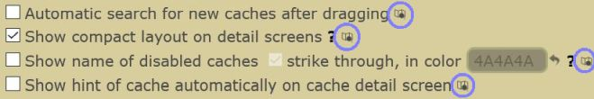</a> 
		The following features are only available on the old Map (Browse Map): 
		<a href="https://www.geocaching.com/my/#GClhShowConfig#a#settings_show_homezone" title="Link to your GClh Config">Settings -> Maps: 
		 
		 
		 
		 
		</a>  
	</li>
	<li>
		<strong>New:</strong> [New Map] Add links on Google Maps and Openstreetmap to new GC Map. [<a href="https://github.com/2Abendsegler/GClh/issues/1374" title="Issue 1374">1374</a> / <a href="https://www.geocaching.com/profile/?u=2Abendsegler" title="Thanks to 2Abendsegler">2Abendsegler</a>] 
		<a href="https://www.geocaching.com/my/#GClhShowConfig#a#settings_hide_left_sidebar_on_google_maps" title="Link to your GClh Config">Settings -> Maps: 
		</a> 
		Google Maps: 
		 
		Openstreetmap: 
		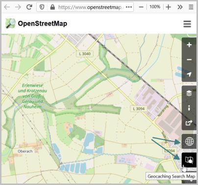  
	</li>
	<li>
		<strong>New:</strong> [Old Map] Hide and show "Community Celebration Events" together with "Events". [<a href="https://github.com/2Abendsegler/GClh/issues/1386" title="Issue 1386">1386</a> / <a href="https://www.geocaching.com/profile/?u=2Abendsegler" title="Thanks to 2Abendsegler">2Abendsegler</a>] 
		In the old Map there is no icon to hide "Community Celebration Events". Therefore, these events remain visible even if you have hidden all events with the event icons. Now, if you hide or show "Events", the "Community Celebration Events" should also be hidden or showed. This also works for the features "Show / hide all Cachetypes". 
		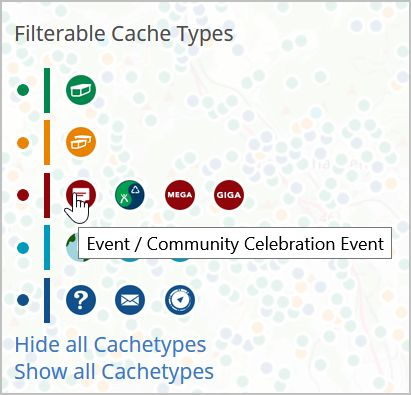  
	</li>
	<li>
		<strong>New:</strong> [New/old Map] Show number of images on the maps and provide a link to the image gallery. [<a href="https://github.com/2Abendsegler/GClh/issues/1399" title="Issue 1399">1399</a> / <a href="https://www.geocaching.com/profile/?u=2Abendsegler" title="Thanks to 2Abendsegler">2Abendsegler</a>] 
		Popup of the old Map (Browse Map): 
		 
		Detail screen of the new Map (Search Map): 
		  
	</li>
	<li>
		<strong>Fix:</strong> [New Map] Align logs again correctly in the detail screen. [<a href="https://github.com/2Abendsegler/GClh/issues/1375" title="Issue 1375">1375</a> / <a href="https://www.geocaching.com/profile/?u=2Abendsegler" title="Thanks to 2Abendsegler">2Abendsegler</a>]  
	</li>
</ul>
 

### Cache Listing:
<ul>	
	<li>
		<strong>New:</strong> [Cache listing] Highlight found places from cache listing "Search in logtext" in the logs. [<a href="https://github.com/2Abendsegler/GClh/issues/1437" title="Issue 1437">1437</a> / <a href="https://www.geocaching.com/profile/?u=2Abendsegler" title="Thanks to 2Abendsegler">2Abendsegler</a>] 
		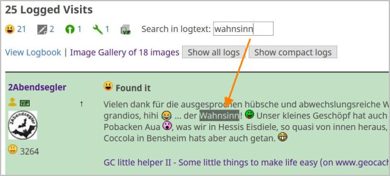  
	</li>
	<li>
		<strong>New:</strong> [Cache listing] Additional link for logging premium caches for non-premium cachers. [<a href="https://github.com/2Abendsegler/GClh/issues/1345" title="Issue 1345">1345</a> / <a href="https://www.geocaching.com/profile/?u=2Abendsegler" title="Thanks to 2Abendsegler">2Abendsegler</a>] 
		  
		To "Log your visit" not inline, you have to do nothing.  
		To "Log your visit (inline)" you have to activate possibly the parameter. If you're using an ad-blocking add-on, such as uBlock, the embedded screen may not be allowed. To turn this off, you have to add "www.geocaching.com/geocache/GC*" to the whitelist, or something similar, of your add-on. 
		<a href="https://www.geocaching.com/my/#GClhShowConfig#a#settings_log_inline_pmo4basic" title="Link to your GClh Config">Settings -> Listing: 
		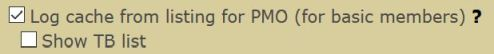</a>  
	</li>
	<li>
		<strong>New:</strong> [Cache listing] After clicking on a log icon in the VIP area, go to the log, even if the log is not yet displayed. [<a href="https://github.com/2Abendsegler/GClh/issues/1411" title="Issue 1411">1411</a> / <a href="https://www.geocaching.com/profile/?u=2Abendsegler" title="Thanks to 2Abendsegler">2Abendsegler</a>] 
		  
	</li>
	<li>
		<strong>New:</strong> [Cache listing] Build links to the log section, at the top log totals. [<a href="https://github.com/2Abendsegler/GClh/issues/1413" title="Issue 1413">1413</a> / <a href="https://www.geocaching.com/profile/?u=2Abendsegler" title="Thanks to 2Abendsegler">2Abendsegler</a>] 
		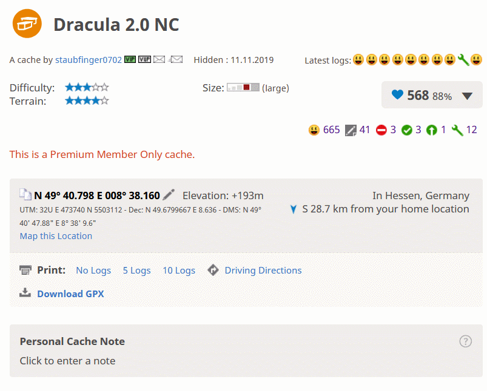  
	</li>
	<li>
		<strong>New:</strong> [Cache Listing] New feature for the menu "copy data to clipboard": Addition of data to clipboard. [<a href="https://github.com/2Abendsegler/GClh/issues/1365" title="Issue 1365">1365</a> / <a href="https://www.geocaching.com/profile/?u=2Abendsegler" title="Thanks to 2Abendsegler">2Abendsegler</a> / <a href="https://www.geocaching.com/profile/?u=Die Batzen" title="Thanks to Die Batzen">Die Batzen</a> / <a href="https://www.geocaching.com/profile/?u=Herr Ma" title="Thanks to Herr Ma">Herr Ma</a>] 
		This feature allows you not only to copy something to the clipboard after clearing the clipboard, but also to add something to the clipboard without clearing it. This is how you can collect things on the clipboard. You can enter a separator to use between the addings. The default value is a line feed. 
		<a href="https://www.geocaching.com/my/#GClhShowConfig#a#settings_show_copydata_menu" title="Link to your GClh Config">Settings -> Listing: 
		</a> 
		If you want to use this feature, you have to activate the parameter.  
		For example: 
		1. Copy a GC Code to clipboard 
		2. Than add a further GC Code to clipboard 
		3. Then paste the content of the clipboard with the keys on the keyboard "Strg" ("Ctrl") and "v"  
		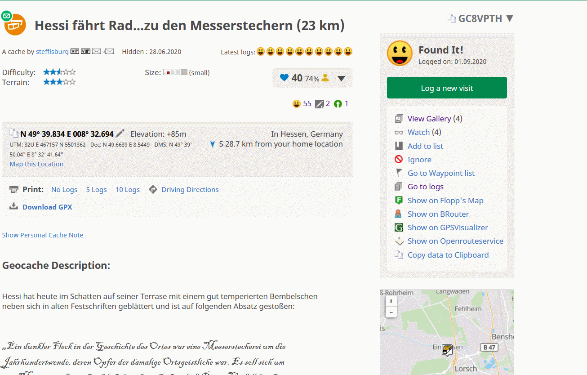  
	</li>
	<li>
		<strong>Fix:</strong> [Cache listing] Display favorite percent and own favorite point in cache listing again. [<a href="https://github.com/2Abendsegler/GClh/issues/1366" title="Issue 1366">1366</a> / <a href="https://www.geocaching.com/profile/?u=2Abendsegler" title="Thanks to 2Abendsegler">2Abendsegler</a>] 
		  
	</li>
	<li>
		<strong>Fix:</strong> [Cache listing] "Photo file name" in "Copy Data to Clipboard" feature in cache listings use invalid characters. [<a href="https://github.com/2Abendsegler/GClh/issues/1348" title="Issue 1348">1348</a> / <a href="https://www.geocaching.com/profile/?u=2Abendsegler" title="Thanks to 2Abendsegler">2Abendsegler</a>]  
	</li>
	<li>
		<strong>Fix:</strong> [Cache listing] For basic member the dropdown menu in premium cache listings are not aligned properly. [<a href="https://github.com/2Abendsegler/GClh/issues/1435" title="Issue 1435">1435</a> / <a href="https://www.geocaching.com/profile/?u=2Abendsegler" title="Thanks to 2Abendsegler">2Abendsegler</a>]  
	</li>
</ul>
 

### Owner Dashboard:
<ul>
	<li>
		<strong>New:</strong> [Owner Dashboard] Add links to cachetypes. [<a href="https://github.com/2Abendsegler/GClh/issues/1377" title="Issue 1377">1377</a> / <a href="https://www.geocaching.com/profile/?u=capoaira" title="Thanks to capoaira">capoaira</a>] 
		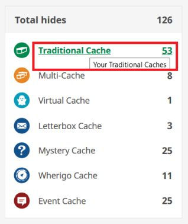  
	</li>
	<li>
		<strong>New:</strong> [Owner Dashboard] Add link to own profile. [<a href="https://github.com/2Abendsegler/GClh/issues/1402" title="Issue 1402">1402</a> / <a href="https://www.geocaching.com/profile/?u=capoaira" title="Thanks to capoaira">capoaira</a>] 
		  
	</li>
	<li>
		<strong>New:</strong> [Owner Dashboard] Build up the new links in Linklist. [<a href="https://github.com/2Abendsegler/GClh/issues/1384" title="Issue 1384">1384</a> / <a href="https://www.geocaching.com/profile/?u=2Abendsegler" title="Thanks to 2Abendsegler">2Abendsegler</a>] 
		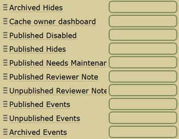  
	</li>
	<li>
		<strong>New:</strong> [Owner Dashboard] Build header with navigation menu and Linklist. [<a href="https://github.com/2Abendsegler/GClh/issues/1382" title="Issue 1382">1382</a> / <a href="https://www.geocaching.com/profile/?u=2Abendsegler" title="Thanks to 2Abendsegler">2Abendsegler</a>]  
	</li>
</ul>
 

### New Dashboard:
<ul>
	<li>
		<strong>New:</strong> [New Dashboard] Create direct "Edit log"-links on the dashboard to make logs editable without an extra-step. [<a href="https://github.com/2Abendsegler/GClh/issues/1353" title="Issue 1353">1353</a> / <a href="https://www.geocaching.com/profile/?u=2Abendsegler" title="Thanks to 2Abendsegler">2Abendsegler</a>] 
		  
	</li>
	<li>
		<strong>Fix:</strong> [New Dashboard] Unpublished caches in new dashboard have disappeared. [<a href="https://github.com/2Abendsegler/GClh/issues/1371" title="Issue 1371">1371</a> / <a href="https://www.geocaching.com/profile/?u=capoaira" title="Thanks to capoaira">capoaira</a>] 
		  
	</li>
</ul>
 

### Others:
<ul>
	<li>
		<strong>New:</strong> [Header] Get asynchron header replacement only once a day to speed up loading page. [<a href="https://github.com/2Abendsegler/GClh/issues/1427" title="Issue 1427">1427</a> / <a href="https://www.geocaching.com/profile/?u=2Abendsegler" title="Thanks to 2Abendsegler">2Abendsegler</a>]  
	</li>
	<li>
		<strong>New:</strong> [Wonders of the World] Build header with navigation menu and Linklist. [<a href="https://github.com/2Abendsegler/GClh/issues/1382" title="Issue 1382">1382</a> / <a href="https://www.geocaching.com/profile/?u=2Abendsegler" title="Thanks to 2Abendsegler">2Abendsegler</a>]  
	</li>
	<li>
		<strong>Fix:</strong> [New Drafts] Wrong link to cache listing. [<a href="https://github.com/2Abendsegler/GClh/issues/1415" title="Issue 1415">1415</a> / <a href="https://www.geocaching.com/profile/?u=2Abendsegler" title="Thanks to 2Abendsegler">2Abendsegler</a>] 
		  
	</li>
	<li>
		<strong>Fix:</strong> [TB map] Resizable TB-Map does not work. [<a href="https://github.com/2Abendsegler/GClh/issues/1287" title="Issue 1287">1287</a> / <a href="https://www.geocaching.com/profile/?u=2Abendsegler" title="Thanks to 2Abendsegler">2Abendsegler</a>] 
		  
	</li>
	<li>
		<strong>Fix:</strong> [New log form] Correct position of date. [<a href="https://github.com/2Abendsegler/GClh/issues/1406" title="Issue 1406">1406</a> / <a href="https://www.geocaching.com/profile/?u=2Abendsegler" title="Thanks to 2Abendsegler">2Abendsegler</a>]  
	</li>
	<li>
		<strong>Fix:</strong> [TB upload] Incorrect navigation menu location on page upload trackable log image. [<a href="https://github.com/2Abendsegler/GClh/issues/1347" title="Issue 1347">1347</a> / <a href="https://www.geocaching.com/profile/?u=2Abendsegler" title="Thanks to 2Abendsegler">2Abendsegler</a>]  
	</li>
	<li>
		<strong>Fix:</strong> [Menu] Mark new entries in navigation menu. [<a href="https://github.com/2Abendsegler/GClh/issues/1385" title="Issue 1385">1385</a> / <a href="https://www.geocaching.com/profile/?u=2Abendsegler" title="Thanks to 2Abendsegler">2Abendsegler</a>] 
	</li>
</ul>
 
 
(12.09.2020) 
released by <a href="https://www.geocaching.com/profile/?u=2Abendsegler">2Abendsegler</a> 
 

---
## v0.10.7:
<ul>
	<li>
		<strong>New:</strong> Show weekday for community celebration events. [<a href="https://github.com/2Abendsegler/GClh/issues/1352" title="Issue 1352">1352</a> / <a href="https://www.geocaching.com/profile/?u=capoaira" title="Thanks to capoaira">capoaira</a>]  
	</li>
	<li>
		<strong>Fix:</strong> "Submit" corrected coordinates does not react. [<a href="https://github.com/2Abendsegler/GClh/issues/1360" title="Issue 1360">1360</a> / <a href="https://www.geocaching.com/profile/?u=2Abendsegler" title="Thanks to 2Abendsegler">2Abendsegler</a>] 
	</li>
	<li>
		<strong>Fix:</strong> Cache listing page is very slow. [<a href="https://github.com/2Abendsegler/GClh/issues/1358" title="Issue 1358">1358</a> / <a href="https://www.geocaching.com/profile/?u=2Abendsegler" title="Thanks to 2Abendsegler">2Abendsegler</a>] 
	</li>
	<li>
		<strong>Fix:</strong> [New Map] GClh doesn't work on new map page. [<a href="https://github.com/2Abendsegler/GClh/issues/1356" title="Issue 1356">1356</a> / <a href="https://www.geocaching.com/profile/?u=2Abendsegler" title="Thanks to 2Abendsegler">2Abendsegler</a>] 
	</li>
	<li>
		<strong>Fix:</strong> Logs shown twice with disabled VIP list. [<a href="https://github.com/2Abendsegler/GClh/issues/1350" title="Issue 1350">1350</a> / <a href="https://www.geocaching.com/profile/?u=Ruko2010" title="Thanks to Ruko2010">Ruko2010</a>] 
	</li>
	<li>
		<strong>Fix:</strong> [New Map] Wrong position of "size" area in detail screen of a cache on new map page. [<a href="https://github.com/2Abendsegler/GClh/issues/1349" title="Issue 1349">1349</a> / <a href="https://www.geocaching.com/profile/?u=2Abendsegler" title="Thanks to 2Abendsegler">2Abendsegler</a>] 
	</li>
	<li>
		<strong>Fix:</strong> Scroll Bar at statistik page is missing respectively number of caches not recognizable everywhere. [<a href="https://github.com/2Abendsegler/GClh/issues/1344" title="Issue 1344">1344</a> / <a href="https://www.geocaching.com/profile/?u=2Abendsegler" title="Thanks to 2Abendsegler">2Abendsegler</a>] 
	</li>
</ul>
 
(07.06.2020) 
released by <a href="https://www.geocaching.com/profile/?u=2Abendsegler">2Abendsegler</a> 
 

---
## v0.10.6:
<ul>
	<li>
		<strong>New:</strong> Build coords related functions also on unpublished caches. [<a href="https://github.com/2Abendsegler/GClh/issues/1305" title="Issue 1305">1305</a> / <a href="https://www.geocaching.com/profile/?u=Ruko2010" title="Thanks to Ruko2010">Ruko2010</a>] 
		  
	</li>
	<li>
		<strong>New:</strong> New placeholder cache type for own stuff in copy to clipboard menu in cache listing #GCType#. [<a href="https://github.com/2Abendsegler/GClh/issues/1327" title="Issue 1327">1327</a> / <a href="https://www.geocaching.com/profile/?u=2Abendsegler" title="Thanks to 2Abendsegler">2Abendsegler</a>] 
		<a href="https://www.geocaching.com/my/#GClhShowConfig#a#settings_show_copydata_menu" title="Link to your GClh Config">Settings -> Listing</a>  
	</li>
	<li>
		<strong>New:</strong> Add parameter to show radius around caches on Flopp's Map. [<a href="https://github.com/2Abendsegler/GClh/issues/1334" title="Issue 1334">1334</a> / <a href="https://www.geocaching.com/profile/?u=Ruko2010" title="Thanks to Ruko2010">Ruko2010</a>] 
		 
		<a href="https://www.geocaching.com/my/#GClhShowConfig#a#settings_show_radius_on_flopps" title="Link to your GClh Config">Settings -> Listing: 
		</a>  
	</li>	
	<li>
		<strong>New:</strong> Optionally display coordinates in extended map info. [<a href="https://github.com/2Abendsegler/GClh/issues/1330" title="Issue 1330">1330</a> / <a href="https://www.geocaching.com/profile/?u=2Abendsegler" title="Thanks to 2Abendsegler">2Abendsegler</a>] 
		<a href="https://www.geocaching.com/my/#GClhShowConfig#a#settings_show_enhanced_map_coords" title="Link to your GClh Config">Settings -> Map - Enhanced Map Popup: 
		</a>  
	</li>
	<li>
		<strong>Fix:</strong> Flopp's Map distance line between coords and corrected coords does not work. [<a href="https://github.com/2Abendsegler/GClh/issues/1334" title="Issue 1334">1334</a> / <a href="https://www.geocaching.com/profile/?u=Ruko2010" title="Thanks to Ruko2010">Ruko2010</a>] 
	</li>
	<li>
		<strong>Fix:</strong> Favorits percentage for copy to clipboard is not recognized if it is <1% #FavoPerc#. [<a href="https://github.com/2Abendsegler/GClh/issues/1325" title="Issue 1325">1325</a> / <a href="https://www.geocaching.com/profile/?u=2Abendsegler" title="Thanks to 2Abendsegler">2Abendsegler</a>] 
	</li>
	<li>
		<strong>Fix:</strong> Empty personal cache note for copy to clipboard is not always recognized #GCNote#.  [<a href="https://github.com/2Abendsegler/GClh/issues/1324" title="Issue 1324">1324</a> / <a href="https://www.geocaching.com/profile/?u=2Abendsegler" title="Thanks to 2Abendsegler">2Abendsegler</a>] 
	</li>
</ul>
 
(07.05.2020) 
released by <a href="https://www.geocaching.com/profile/?u=2Abendsegler">2Abendsegler</a> 
 

---
## v0.10.5:
<ul>
	<li>
		<strong>New:</strong> New placeholders for own stuff in copy to clipboard menu in cache listing. [<a href="https://github.com/2Abendsegler/GClh/issues/1308" title="Issue 1308">1308</a> / <a href="https://www.geocaching.com/profile/?u=Herr-Ma" title="Thanks to Herr-Ma">Herr-Ma</a> / <a href="https://www.geocaching.com/profile/?u=2Abendsegler" title="Thanks to 2Abendsegler">2Abendsegler</a>] 
		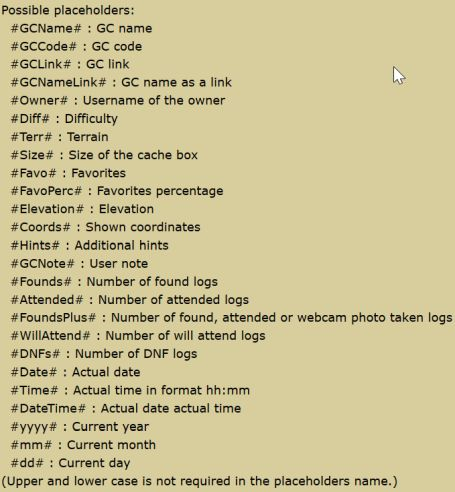  
		<strong>New:</strong> Multi entries for own stuff in copy to clipboard menu in cache listing. [<a href="https://github.com/2Abendsegler/GClh/issues/1309" title="Issue 1309">1309</a> / <a href="https://www.geocaching.com/profile/?u=2Abendsegler" title="Thanks to 2Abendsegler">2Abendsegler</a>] 
		You can create for example something like this. 
		<a href="https://www.geocaching.com/my/#GClhShowConfig#a#settings_show_copydata_menu" title="Link to your GClh Config">Settings -> Listing: 
		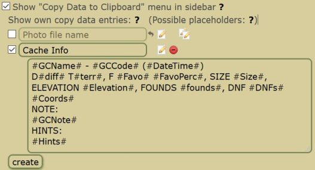</a> 
		Cache Listing: 
		 
		Clipboard: 
		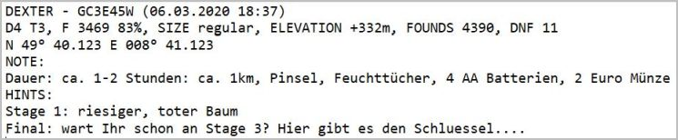  
	</li>
	<li>
		<strong>New:</strong> Download current config as txt-file. [<a href="https://github.com/2Abendsegler/GClh/issues/1312" title="Issue 1312">1312</a> / <a href="https://www.geocaching.com/profile/?u=Ruko2010" title="Thanks to Ruko2010">Ruko2010</a>] 
		<a href="//#GClhShowSync" title="Link to your GClh Sync">GClh Sync 
		</a> 
		 
		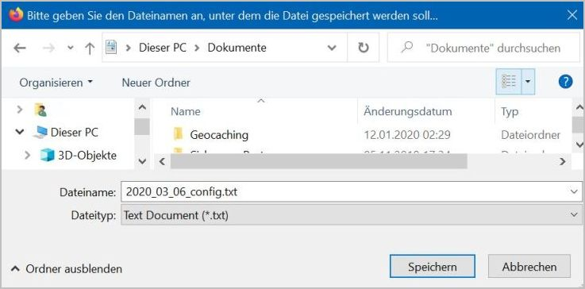  
	</li>
	<li>
		<strong>New:</strong> [New Map] Button to Google Maps, Flopps, ... [<a href="https://github.com/2Abendsegler/GClh/issues/961" title="Issue 961">961</a> / <a href="https://www.geocaching.com/profile/?u=2Abendsegler" title="Thanks to 2Abendsegler">2Abendsegler</a>] 
		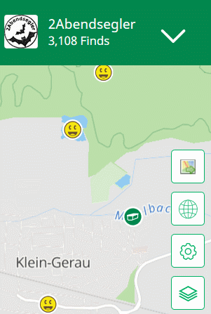 
		<a href="https://www.geocaching.com/my/#GClhShowConfig#a#settings_hide_left_sidebar_on_google_maps" title="Link to your GClh Config">Settings -> Map: 
		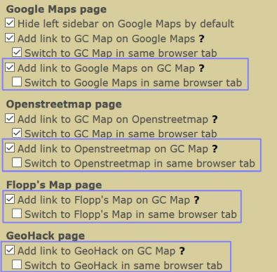</a> 
		The parameters are not new, they are already used on browse map.   
	</li>
	<li>
		<strong>New:</strong> [New Map] Set link to owner. [<a href="https://github.com/2Abendsegler/GClh/issues/1315" title="Issue 1315">1315</a> / <a href="https://www.geocaching.com/profile/?u=capoaira" title="Thanks to capoaira">capoaira</a>] 
		  
	</li>
	<li>
		<strong>New:</strong> [New Map] Relocate button "Browse geocaches" on search map to the other buttons. [<a href="https://github.com/2Abendsegler/GClh/issues/1282" title="Issue 1282">1282</a> / <a href="https://www.geocaching.com/profile/?u=2Abendsegler" title="Thanks to 2Abendsegler">2Abendsegler</a>] 
		 
		<a href="https://www.geocaching.com/my/#GClhShowConfig#a#settings_relocate_other_map_buttons" title="Link to your GClh Config">Settings -> Map: 
		</a>  
	</li>
	<li>
		<strong>New:</strong> [Browse Map] Relocate button "Search geocaches" on browse map to the other buttons. [<a href="https://github.com/2Abendsegler/GClh/issues/1272" title="Issue 1272">1272</a> / <a href="https://www.geocaching.com/profile/?u=2Abendsegler" title="Thanks to 2Abendsegler">2Abendsegler</a>] 
		 
		<a href="https://www.geocaching.com/my/#GClhShowConfig#a#settings_relocate_other_map_buttons" title="Link to your GClh Config">Settings -> Map: 
		</a>  
	</li>
	<li>
		<strong>New:</strong> [Browse Map] Show coordinates in additional popup. [<a href="https://github.com/2Abendsegler/GClh/issues/1279" title="Issue 1279">1279</a> / <a href="https://www.geocaching.com/profile/?u=2Abendsegler" title="Thanks to 2Abendsegler">2Abendsegler</a>] 
		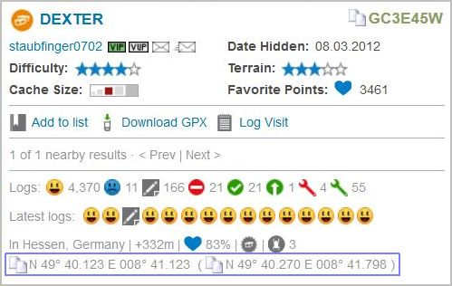  
	</li>
	<li>
		<strong>New:</strong> Show number of words behind the loglength. [<a href="https://github.com/2Abendsegler/GClh/issues/1273" title="Issue 1273">1273</a> / <a href="https://www.geocaching.com/profile/?u=capoaira" title="Thanks to capoaira">capoaira</a>] 
		Old log form: 
		 
		New log form: 
		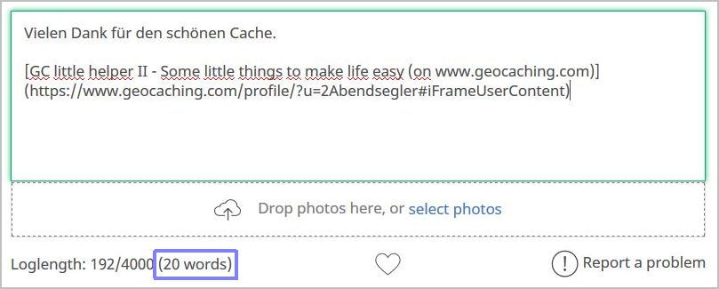</a>  
	</li>
	<li>
		<strong>New:</strong> Build possible links of found and hidden caches in Linklist. [<a href="https://github.com/2Abendsegler/GClh/issues/1271" title="Issue 1271">1271</a> / <a href="https://www.geocaching.com/profile/?u=2Abendsegler" title="Thanks to 2Abendsegler">2Abendsegler</a>] 
		<a href="https://www.geocaching.com/my/#GClhShowConfig#a#ll#settings_bookmarks_top_menu_h" title="Link to your GClh Config">Settings -> Linklist / Navigation: 
		</a> 
		If you want to use it in your Linklist, you have to set it.  
	</li>
	<li>
		<strong>New:</strong> Note whether nearby events on dashboard are opened or closed. [<a href="https://github.com/2Abendsegler/GClh/issues/1270" title="Issue 1270">1270</a> / <a href="https://www.geocaching.com/profile/?u=2Abendsegler" title="Thanks to 2Abendsegler">2Abendsegler</a>]  
	</li>
	<li>
		<strong>New:</strong> Refactor helper functions. [<a href="https://github.com/2Abendsegler/GClh/issues/772" title="Issue 772">772</a> / <a href="https://www.geocaching.com/profile/?u=2Abendsegler" title="Thanks to 2Abendsegler">2Abendsegler</a>]  
	</li>
	<li>
		<strong>Fix:</strong> [New Map] Compact layout for new fields "placed date". [<a href="https://github.com/2Abendsegler/GClh/issues/1277" title="Issue 1277">1277</a> / <a href="https://www.geocaching.com/profile/?u=2Abendsegler" title="Thanks to 2Abendsegler">2Abendsegler</a>] 
	</li>
	<li>
		<strong>Fix:</strong> [New Map] Search Map output of "undefined" behind the favorite points. [<a href="https://github.com/2Abendsegler/GClh/issues/1268" title="Issue 1268">1268</a> / <a href="https://www.geocaching.com/profile/?u=Ruko2010" title="Thanks to Ruko2010">Ruko2010</a> / <a href="https://www.geocaching.com/profile/?u=2Abendsegler" title="Thanks to 2Abendsegler">2Abendsegler</a>] 
	</li>
	<li>
		<strong>Fix:</strong> Load trackables faster without images does not work correct. [<a href="https://github.com/2Abendsegler/GClh/issues/1297" title="Issue 1297">1297</a> / <a href="https://www.geocaching.com/profile/?u=2Abendsegler" title="Thanks to 2Abendsegler">2Abendsegler</a>] 
	</li>
	<li>
		<strong>Fix:</strong> Parsing error on reset functionality. [<a href="https://github.com/2Abendsegler/GClh/issues/1294" title="Issue 1294">1294</a> / <a href="https://www.geocaching.com/profile/?u=2Abendsegler" title="Thanks to 2Abendsegler">2Abendsegler</a>] 
	</li>
	<li>
		<strong>Fix:</strong> Key F2 deletes personal note in cache listing. [<a href="https://github.com/2Abendsegler/GClh/issues/1281" title="Issue 1281">1281</a> / <a href="https://www.geocaching.com/profile/?u=2Abendsegler" title="Thanks to 2Abendsegler">2Abendsegler</a>] 
	</li>
	<li>
		<strong>Fix:</strong> The alignment of the new logging form is not correct. [<a href="https://github.com/2Abendsegler/GClh/issues/1290" title="Issue 1290">1290</a> / <a href="https://www.geocaching.com/profile/?u=2Abendsegler" title="Thanks to 2Abendsegler">2Abendsegler</a>] 
	</li>
	<li>
		<strong>Fix:</strong> Hide Facebook login doesn't run, again. [<a href="https://github.com/2Abendsegler/GClh/issues/1306" title="Issue 1306">1306</a> / <a href="https://www.geocaching.com/profile/?u=2Abendsegler" title="Thanks to 2Abendsegler">2Abendsegler</a>] 
	</li>
</ul>
 
(13.03.2020) 
released by <a href="https://www.geocaching.com/profile/?u=2Abendsegler">2Abendsegler</a> 
 

---
## v0.10.4:
<ul>
	<li>
		<strong>Fix:</strong> Errors due to the current GDPR (General Data Protection Regulation) changes of GS. [<a href="https://www.geocaching.com/profile/?u=2Abendsegler" title="Thanks to 2Abendsegler">2Abendsegler</a>] 
		<ul>
			<li>
				Clicks on the latest logs icons or the log icons in the VIP tables do not work. [<a href="https://github.com/2Abendsegler/GClh/issues/1193" title="Issue 1193">1193</a>] 
			</li>
			<li>
				The alignment of the new logging form is not correct. [<a href="https://github.com/2Abendsegler/GClh/issues/1248" title="Issue 1248">1248</a>] 
			</li>
			<li>
				On new Lists page, GClh header with Linklist ... does not load. [<a href="https://github.com/2Abendsegler/GClh/issues/1227" title="Issue 1227">1227</a>] 
			</li>
			<li>
				Some unnecessary sliders have recently been added to statistical data. [<a href="https://github.com/2Abendsegler/GClh/issues/1201" title="Issue 1201">1201</a>] 
			</li>
			<li>
				Show both tabs in list of pocket queries of one page does not work. [<a href="https://github.com/2Abendsegler/GClh/issues/1214" title="Issue 1214">1214</a>] 
			</li>
			<li>
				The TB autovisit feature on the old log page does not work. [<a href="https://github.com/2Abendsegler/GClh/issues/1205" title="Issue 1205">1205</a>] 
			</li>
			<li>
				At latest logs in cache listing, title of picture is shown as a second box next to the log. [<a href="https://github.com/2Abendsegler/GClh/issues/1191" title="Issue 1191">1191</a>] 
			</li>
			<li>
				The alignment of the "saved" information in the "One click watching" feature is not correct. [<a href="https://github.com/2Abendsegler/GClh/issues/1261" title="Issue 1261">1261</a>] 
			</li>
			<li>
				Show number of active pocket queries does not work. [<a href="https://github.com/2Abendsegler/GClh/issues/1216" title="Issue 1216">1216</a>] 
			</li>
			<li>
				On new Lists page, GClh does not work correct. [<a href="https://github.com/2Abendsegler/GClh/issues/1228" title="Issue 1228">1228</a>] 
			</li>
			<li>
				Edge no longer works with GClh. [<a href="https://github.com/2Abendsegler/GClh/issues/1251" title="Issue 1251">1251</a>]  
			</li>
		</ul>
	</li>
</ul>

### Search Map:
<ul>
	<li>
		<strong>New:</strong> [New Map] Own area on detail screen. [<a href="https://github.com/2Abendsegler/GClh/issues/964" title="Issue 964">964</a> / <a href="https://www.geocaching.com/profile/?u=Ruko2010" title="Thanks to Ruko2010">Ruko2010</a>] 
		<strong>New:</strong> [New Map] Copy GC-Code to clipboard. [<a href="https://github.com/2Abendsegler/GClh/issues/1196" title="Issue 1196">1196</a> / <a href="https://www.geocaching.com/profile/?u=Ruko2010" title="Thanks to Ruko2010">Ruko2010</a>] 
		<strong>New:</strong> [New Map] Show Elevation in Cache Details. [<a href="https://github.com/2Abendsegler/GClh/issues/953" title="Issue 953">953</a> / <a href="https://www.geocaching.com/profile/?u=Ruko2010" title="Thanks to Ruko2010">Ruko2010</a>] 
		  
	</li>
	<li>
		<strong>New:</strong> [New Map] Compact layout on detail screens. [<a href="https://github.com/2Abendsegler/GClh/issues/965" title="Issue 965">965</a> / <a href="https://www.geocaching.com/profile/?u=capoaira" title="Thanks to capoaira">capoaira</a> / <a href="https://www.geocaching.com/profile/?u=2Abendsegler" title="Thanks to 2Abendsegler">2Abendsegler</a>] 
		 
		 
		 
		 
		<a href="https://www.geocaching.com/my/#GClhShowConfig#a#settings_searchmap_compact_layout" title="Link to your GClh Config">Settings -> Map: 
		</a>  
	</li>
	<li>
		<strong>New:</strong> [New Map] After go back from cache details to cache list, scroll to last position. [<a href="https://github.com/2Abendsegler/GClh/issues/1247" title="Issue 1247">1247</a> / <a href="https://www.geocaching.com/profile/?u=2Abendsegler" title="Thanks to 2Abendsegler">2Abendsegler</a>] 
		  
	</li>
	<li>
		<strong>New:</strong> [New Map] Show hint automatically. [<a href="https://github.com/2Abendsegler/GClh/issues/1199" title="Issue 1199">1199</a> / <a href="https://www.geocaching.com/profile/?u=capoaira" title="Thanks to capoaira">capoaira</a>] 
		 
		<a href="https://www.geocaching.com/my/#GClhShowConfig#a#settings_searchmap_show_hint" title="Link to your GClh Config">Settings -> Map: 
		</a> 
		If you want to use this feature, you have to activate the parameter.  
	</li>
	<li>
		<strong>New:</strong> [New Map] Show button to collapse activity. [<a href="https://github.com/2Abendsegler/GClh/issues/1198" title="Issue 1198">1198</a> / <a href="https://www.geocaching.com/profile/?u=capoaira" title="Thanks to capoaira">capoaira</a>] 
		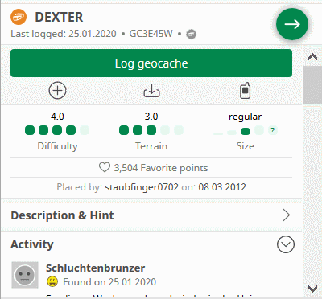  
	</li>
	<li>
		<strong>New:</strong> [New Map] Strike through title of disabled caches. [<a href="https://github.com/2Abendsegler/GClh/issues/1197" title="Issue 1197">1197</a> / <a href="https://www.geocaching.com/profile/?u=capoaira" title="Thanks to capoaira">capoaira</a>] 
		 
		<a href="https://www.geocaching.com/my/#GClhShowConfig#a#settings_searchmap_disabled" title="Link to your GClh Config">Settings -> Map: 
		</a> 
		If you want to use this feature, you have to activate the parameter.  
	</li>
	<li>
		<strong>New:</strong> [New Map] Adapt the width of the pop up. [<a href="https://github.com/2Abendsegler/GClh/issues/1219" title="Issue 1219">1219</a> / <a href="https://www.geocaching.com/profile/?u=capoaira" title="Thanks to capoaira">capoaira</a>] 
		There is a pop up when you select an icon in the new map with the right mouse button.
		  
	</li>
</ul>	

### Cache Listing:
<ul>
	<li>
		<strong>New:</strong> Add right mouse click to "Add to list" to open screen "Create a Bookmark". [<a href="https://github.com/2Abendsegler/GClh/issues/1259" title="Issue 1259">1259</a> / <a href="https://www.geocaching.com/profile/?u=2Abendsegler" title="Thanks to 2Abendsegler">2Abendsegler</a>] 
		This function was last deactivated by GS. 
		 
		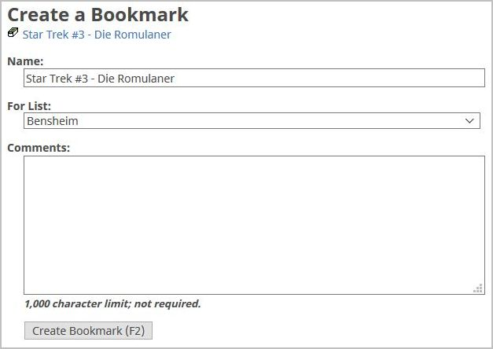  
	</li>
	<li>
		<strong>New:</strong> Show own specified entry in menu of copy data to clipboard. [<a href="https://github.com/2Abendsegler/GClh/issues/1253" title="Issue 1253">1253</a> / <a href="https://www.geocaching.com/profile/?u=2Abendsegler" title="Thanks to 2Abendsegler">2Abendsegler</a>] 
		With this feature you can generate an entry in the menu "Copy Data to Clipbord" for example to build file names of cache-specific photos. 
		 
		<a href="https://www.geocaching.com/my/#GClhShowConfig#a#settings_show_copydata_own_stuff_show" title="Link to your GClh Config">Settings -> Listing: 
		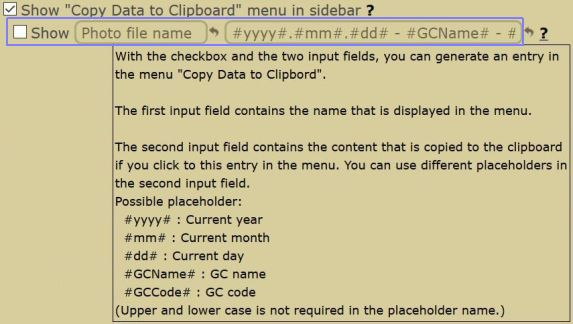</a> 
		If you want to use this feature, you have to customize the feature and you have to activate the parameter. 
		If you click to the entry in menu "Copy Data to Clipbord", something like this could be in the clipboard. 
		  
	</li>
	<li>
		<strong>New:</strong> Consider script GCTour also in feature "copy corrected coordinates". [<a href="https://github.com/2Abendsegler/GClh/issues/1200" title="Issue 1200">1200</a> / <a href="https://www.geocaching.com/profile/?u=2Abendsegler" title="Thanks to 2Abendsegler">2Abendsegler</a>] 
		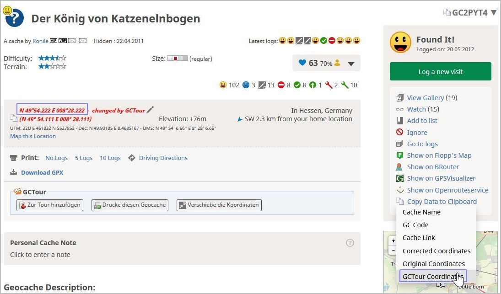  
	</li>
</ul>

### Others:
<ul>
	<li>
		<strong>New:</strong> Make "copy to clipboard" a function to reduce code duplication. [<a href="https://github.com/2Abendsegler/GClh/issues/1195" title="Issue 1195">1195</a> / <a href="https://www.geocaching.com/profile/?u=Ruko2010" title="Thanks to Ruko2010">Ruko2010</a>] 
	</li>
	<li>
		<strong>New:</strong> Implement the newer GC logo in all page headers. [<a href="https://github.com/2Abendsegler/GClh/issues/1237" title="Issue 1237">1237</a> / <a href="https://www.geocaching.com/profile/?u=2Abendsegler" title="Thanks to 2Abendsegler">2Abendsegler</a>] 
	</li>
	<li>
		<strong>New:</strong> Remove all links to unsecure pages. [<a href="https://github.com/2Abendsegler/GClh/issues/1037" title="Issue 1037">1037</a> / <a href="https://www.geocaching.com/profile/?u=2Abendsegler" title="Thanks to 2Abendsegler">2Abendsegler</a>]  
	</li>
	<li>
		<strong>New:</strong> Update Overview/Screenshots. [<a href="https://github.com/2Abendsegler/GClh/issues/661" title="Issue 661">661</a> / <a href="https://www.geocaching.com/profile/?u=2Abendsegler" title="Thanks to 2Abendsegler">2Abendsegler</a>]  
	</li>
	<li>
		<strong>Fix:</strong> Unpublished hides were shown in recently viewed list after an update from GS. [<a href="https://github.com/2Abendsegler/GClh/issues/1220" title="Issue 1220">1220</a> / <a href="https://www.geocaching.com/profile/?u=capoaira" title="Thanks to capoaira">capoaira</a>] 
	</li>
	<li>
		<strong>Fix:</strong> Cache listing, the "hidden or found by" links for a user with "+" in name does not work. [<a href="https://github.com/2Abendsegler/GClh/issues/1233" title="Issue 1233">1233</a> / <a href="https://www.geocaching.com/profile/?u=2Abendsegler" title="Thanks to 2Abendsegler">2Abendsegler</a>] 
	</li>
	<li>
		<strong>Fix:</strong> Do not allow GClh Config or GClh Sync on new map page. [<a href="https://github.com/2Abendsegler/GClh/issues/1207" title="Issue 1207">1207</a> / <a href="https://www.geocaching.com/profile/?u=2Abendsegler" title="Thanks to 2Abendsegler">2Abendsegler</a>] 
	</li>
	<li>
		<strong>Fix:</strong> Correct Mystery radius for Flopp's Map. [<a href="https://github.com/2Abendsegler/GClh/issues/1212" title="Issue 1212">1212</a> / <a href="https://www.geocaching.com/profile/?u=ztNFny" title="Thanks to ztNFny">ztNFny</a>] 
	</li>
	<li>
		<strong>Fix:</strong> Allow Find Player on new map page. [<a href="https://github.com/2Abendsegler/GClh/issues/1209" title="Issue 1209">1209</a> / <a href="https://www.geocaching.com/profile/?u=2Abendsegler" title="Thanks to 2Abendsegler">2Abendsegler</a>] 
	</li>
	<li>
		<strong>Fix:</strong> [New Map] The parameter for strike through disabled caches is ignored. [<a href="https://github.com/2Abendsegler/GClh/issues/1250" title="Issue 1250">1250</a> / <a href="https://www.geocaching.com/profile/?u=2Abendsegler" title="Thanks to 2Abendsegler">2Abendsegler</a>] 
	</li>
	<li>
		<strong>Fix:</strong> Type error on description and hint page of new search map. [<a href="https://github.com/2Abendsegler/GClh/issues/1263" title="Issue 1263">1263</a> / <a href="https://www.geocaching.com/profile/?u=2Abendsegler" title="Thanks to 2Abendsegler">2Abendsegler</a>] 
	</li>
</ul>
 
(13.02.2020) 
released by <a href="https://www.geocaching.com/profile/?u=2Abendsegler">2Abendsegler</a> 
 

---
## v0.10.3:
<ul>
	<li>
		<strong>Fix:</strong> Errors due to the current GDPR (General Data Protection Regulation) changes of GS. [<a href="https://www.geocaching.com/profile/?u=2Abendsegler" title="Thanks to 2Abendsegler">2Abendsegler</a>] 
		<ul>
			<li>
				Copy corrected coordinates to clipboard does not work. [<a href="https://github.com/2Abendsegler/GClh/issues/1179" title="Issue 1179">1179</a>] 
			</li>
			<li>
				All routing services in cache listing do not work proper. [<a href="https://github.com/2Abendsegler/GClh/issues/1181" title="Issue 1181">1181</a>] 
			</li>
			<li>
				Determination of elevation data does not work. [<a href="https://github.com/2Abendsegler/GClh/issues/1180" title="Issue 1180">1180</a>] 
			</li>
			<li>
				Improve add to list in cache listing does not work. [<a href="https://github.com/2Abendsegler/GClh/issues/1182" title="Issue 1182">1182</a>] 
			</li>
			<li>
				Jump directly into one of the profile tabs does not work. [<a href="https://github.com/2Abendsegler/GClh/issues/1162" title="Issue 1162">1162</a>] 
			</li>
			<li>
				Error when you open a TB-Listing without logs. [<a href="https://github.com/2Abendsegler/GClh/issues/1169" title="Issue 1169">1169</a>] 
			</li>
			<li>
				Automatically adopt uid of own trackables in GClh does not work. [<a href="https://github.com/2Abendsegler/GClh/issues/1166" title="Issue 1166">1166</a>] 
			</li>
			<li>
				Automatically adopt home coordinates in GClh does not work. [<a href="https://github.com/2Abendsegler/GClh/issues/1165" title="Issue 1165">1165</a>] 
			</li>
			<li>
				Set default language does not work in cache listing. [<a href="https://github.com/2Abendsegler/GClh/issues/1161" title="Issue 1161">1161</a>]  
			</li>
		</ul>
	</li>
	<li>
		<strong>New:</strong> Show length of logtext on new logging page. [<a href="https://github.com/2Abendsegler/GClh/issues/1143" title="Issue 1143">1143</a> / <a href="https://www.geocaching.com/profile/?u=capoaira" title="Thanks to capoaira">capoaira</a>] 
		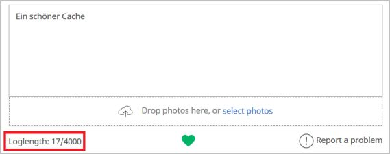 
		<a href="https://www.geocaching.com/my/#GClhShowConfig#a#settings_improve_character_counter" title="Link to your GClh Config">Settings -> Logging: 
		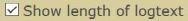</a>  
	</li>
	<li>
		<strong>New:</strong> Show length of hint, cachename and placed by on hide edit page. [<a href="https://github.com/2Abendsegler/GClh/issues/1143" title="Issue 1143">1143</a> / <a href="https://www.geocaching.com/profile/?u=capoaira" title="Thanks to capoaira">capoaira</a>] 
		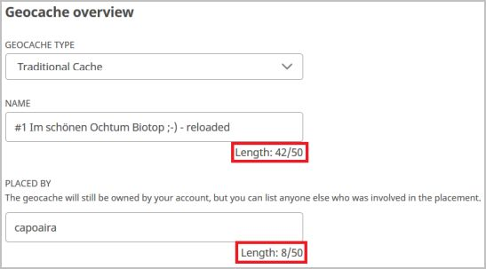 
		</a>  
	</li>
	<li>
		<strong>Fix:</strong> No automatic cache loading if map comes from 81 matrix statistic. [<a href="https://github.com/2Abendsegler/GClh/issues/1172" title="Issue 1172">1172</a> / <a href="https://www.geocaching.com/profile/?u=2Abendsegler" title="Thanks to 2Abendsegler">2Abendsegler</a>] 
	</li>
	<li>
		<strong>Fix:</strong> Link "Search Map" in Linklist is wrong. [<a href="https://github.com/2Abendsegler/GClh/issues/1163" title="Issue 1163">1163</a> / <a href="https://www.geocaching.com/profile/?u=2Abendsegler" title="Thanks to 2Abendsegler">2Abendsegler</a>] 
	</li>
	<li>
		<strong>Fix:</strong> Show the searched caches from the 81 matrix in a map doesn't work. [<a href="https://github.com/2Abendsegler/GClh/issues/1168" title="Issue 1168">1168</a> / <a href="https://www.geocaching.com/profile/?u=2Abendsegler" title="Thanks to 2Abendsegler">2Abendsegler</a>] 
	</li>
	<li>
		<strong>Fix:</strong> Menu misaligned on page "Edit your Trackable". [<a href="https://github.com/2Abendsegler/GClh/issues/1174" title="Issue 1174">1174</a> / <a href="https://www.geocaching.com/profile/?u=2Abendsegler" title="Thanks to 2Abendsegler">2Abendsegler</a>] 
	</li>
</ul>
 
(09.01.2020) 
released by <a href="https://www.geocaching.com/profile/?u=2Abendsegler">2Abendsegler</a> 
 

---
## v0.10.2:
<ul>
	<li>
		<strong>Info:</strong> The blocking of cookiebot.com is no longer necessary for the operation of the GClh.  
	</li>
	<li>
		<strong>Fix:</strong> Errors due to the current GDPR (General Data Protection Regulation) changes of GS. [<a href="https://github.com/2Abendsegler/GClh/issues/1153" title="Issue 1153">1153</a> / <a href="https://www.geocaching.com/profile/?u=2Abendsegler" title="Thanks to 2Abendsegler">2Abendsegler</a>] Many thanks to <a href="https://www.geocaching.com/profile/?u=Chrono81" title="Thanks to Chrono81">Chrono81</a> for the great tip. 😊 
		<ul>
			<li>
				Show favorite percentage in cache listing run into error. 
			</li>
			<li>
				Build map overview in cache listing run into error. 
			</li>
			<li>
				Activate fancybox in cache listing run into error. 
			</li>
			<li>
				Decrypt hints in cache listing run into error. 
			</li>
			<li>
				Replace Log-Loading function in cache listing run into error. 
			</li>
			<li>
				Show thumbnails in cache listing run into ReferenceError. 
			</li>
			<li>
				Hide hints in cache listing behind a link with show/hide do not decrypt.  
			</li>
		</ul>
	</li>
	<li>
		<strong>New:</strong> Show percentage of found caches for every country on statistic map. [<a href="https://github.com/2Abendsegler/GClh/issues/1149" title="Issue 1149">1149</a> / <a href="https://www.geocaching.com/profile/?u=2Abendsegler" title="Thanks to 2Abendsegler">2Abendsegler</a>] 
		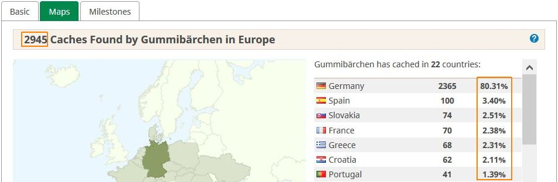 
		<a href="https://www.geocaching.com/my/#GClhShowConfig#a#settings_map_percentage_statistic" title="Link to your GClh Config">Settings -> Public profile: 
		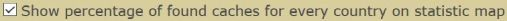</a>  
	</li>
	<li>
		<strong>New:</strong> Show button to display all, only active or only archived caches in owned caches list. [<a href="https://github.com/2Abendsegler/GClh/issues/1145" title="Issue 1145">1145</a> / <a href="https://www.geocaching.com/profile/?u=capoaira" title="Thanks to capoaira">capoaira</a>] 
		 
		<a href="https://www.geocaching.com/my/#GClhShowConfig#a#settings_show_button_for_hide_archived" title="Link to your GClh Config">Settings -> Others: 
		</a>  
	</li>
	<li>
		<strong>Fix:</strong> Align dropdown menu under main menu. [<a href="https://github.com/2Abendsegler/GClh/issues/1145" title="Issue 1145">1145</a> / <a href="https://www.geocaching.com/profile/?u=2Abendsegler" title="Thanks to 2Abendsegler">2Abendsegler</a>]  
	</li>
	<li>
		<strong>Fix:</strong> Improve print page cache listing with hide disclaimer, decrypt hints, show other coord formats and hide side rights does not run. [<a href="https://github.com/2Abendsegler/GClh/issues/1153" title="Issue 1153">1153</a> / <a href="https://www.geocaching.com/profile/?u=2Abendsegler" title="Thanks to 2Abendsegler">2Abendsegler</a>] 
	</li>
</ul>
 
(05.01.2020) 
released by <a href="https://www.geocaching.com/profile/?u=2Abendsegler">2Abendsegler</a> 
 

---
## v0.10.1:
<ul>
	<li>
		<strong>Info:</strong> Please check your settings for the elevation data. [<a href="https://github.com/2Abendsegler/GClh/issues/1138" title="Issue 1131">1131</a>] 
                Because the number of calls of Google Elevation is limited and Open-Elevation is very slow and sometimes providing erroneous data, Geonames-Elevation has been implemented with version 0.9.15. Geonames-Elevation is very fast and providing almost no erroneous data.  
		Therefore we recommend the following settings. 
<a href="https://www.geocaching.com/my/#GClhShowConfig#a#settings_show_elevation_of_waypoints" title="Link to your GClh Config">Settings -> Listing: 
		</a>  
	</li>
	<li>
		<strong>New:</strong> Show an overflowed username in a cache listing log when hovering over with the mouse. [<a href="https://github.com/2Abendsegler/GClh/issues/1138" title="Issue 1138">1138</a> / <a href="https://www.geocaching.com/profile/?u=2Abendsegler" title="Thanks to 2Abendsegler">2Abendsegler</a>] 
		  
	</li>
	<li>
		<strong>Fix:</strong> One click watching feature doesn't work in other languages than english. [<a href="https://github.com/2Abendsegler/GClh/issues/1129" title="Issue 1129">1129</a> / <a href="https://www.geocaching.com/profile/?u=2Abendsegler" title="Thanks to 2Abendsegler">2Abendsegler</a>] 
	</li>
	<li>
		<strong>Fix:</strong> The add to list loading and success message in cache listing are displaced. [<a href="https://github.com/2Abendsegler/GClh/issues/1133" title="Issue 1133">1133</a> / <a href="https://www.geocaching.com/profile/?u=2Abendsegler" title="Thanks to 2Abendsegler">2Abendsegler</a>] 
	</li>
</ul>
 
(20.12.2019) 
released by <a href="https://www.geocaching.com/profile/?u=2Abendsegler">2Abendsegler</a> 
 

---
## v0.10:

### Cache Listing:
<ul>
	<li>
		<strong>New:</strong> One click ignoring/restoring. [<a href="https://github.com/2Abendsegler/GClh/issues/1053" title="Issue 1053">1053</a> / <a href="https://www.geocaching.com/profile/?u=2Abendsegler" title="Thanks to 2Abendsegler">2Abendsegler</a>] 
		With this feature you will be able to ignore respectively restore a cache in cache listing with only one click. 
		</a> 
		<a href="https://www.geocaching.com/my/#GClhShowConfig#a#settings_use_one_click_ignoring" title="Link to your GClh Config">Settings -> Listing: 
		</a> 
	        The "One click" feature runs only together with the "Show Stop Ignoring" feature. Please note that the "Show Stop Ignoring" feature is not new and you may need to activate the parameter, if you want to use the "One click" feature.  
	</li>
	<li>
		<strong>New:</strong> One click watching. [<a href="https://github.com/2Abendsegler/GClh/issues/1072" title="Issue 1072">1072</a> / <a href="https://www.geocaching.com/profile/?u=2Abendsegler" title="Thanks to 2Abendsegler">2Abendsegler</a>] 
		With this feature you can add a cache in cache listing to your watchlist with just one click. 
		</a> 
		<a href="https://www.geocaching.com/my/#GClhShowConfig#a#settings_use_one_click_watching" title="Link to your GClh Config">Settings -> Listing: 
		</a>  
	</li>
	<li>
		<strong>New:</strong> Copy various cache informations to clipboard. [<a href="https://github.com/2Abendsegler/GClh/issues/1096" title="Issue 1096">1096</a> / <a href="https://www.geocaching.com/profile/?u=Herr Ma" title="Thanks to Herr Ma">Herr Ma</a>] 
		If there are changed coordinates, not only the original coordinates but also the changed coordinates can be copied to the clipboard. 
		 
		<a href="https://www.geocaching.com/my/#GClhShowConfig#a#settings_show_copydata_menu" title="Link to your GClh Config">Settings -> Listing:  
		</a>  
	</li>
	<li>
		<strong>New:</strong> Button to copy coordinates to the clipboard. [<a href="https://github.com/2Abendsegler/GClh/issues/1095" title="Issue 1095">1095</a> / <a href="https://www.geocaching.com/profile/?u=Herr Ma" title="Thanks to Herr Ma">Herr Ma</a>] 
		If there are changed coordinates, the changed coordinates are copied into the clipboard, otherwise the original coordinates. 
		  
	</li>
	<li>
		<strong>New:</strong> Added Openrouteservice as an additional map service. [<a href="https://github.com/2Abendsegler/GClh/issues/897" title="Issue 897">897</a> / <a href="https://www.geocaching.com/profile/?u=2Abendsegler" title="Thanks to 2Abendsegler">2Abendsegler</a>] 
		Openrouteservice also offers in addition to usual mediums for locomotion "wheelchair" as medium for locomotion in europe. 
                </a> 
		You can pick Openrouteservice in cache listing in the right navigation bar, or behind the "Additional Waypoints", if there are additional waypoints. 
                </a> 
                </a> 
		<a href="https://www.geocaching.com/my/#GClhShowConfig#a#settings_show_openrouteservice_link" title="Link to your GClh Config">Settings -> Listing: 
		</a> 
		If you want to use your home coordinates as start point for the route, you have to activate the parameter.  
	</li>
        <li>
		<strong>New:</strong> Button for hiding lot of stuff in cache listing logs. [<a href="https://github.com/2Abendsegler/GClh/issues/1045" title="Issue 1045">1045</a> / <a href="https://www.geocaching.com/profile/?u=Ruko2010" title="Thanks to Ruko2010">Ruko2010</a>] 
		The functionality can be used, for example, to compare an external logbook with an online logbook. 
		 
		<a href="https://www.geocaching.com/my/#GClhShowConfig#a#settings_show_compact_logbook_but" title="Link to your GClh Config">Settings -> Listing: 
		</a>  
	</li>
	<li>
		<strong>New:</strong> Hide found counter in cache listing. [<a href="https://github.com/2Abendsegler/GClh/issues/1044" title="Issue 1044">1044</a> / <a href="https://www.geocaching.com/profile/?u=Ruko2010" title="Thanks to Ruko2010">Ruko2010</a>] 
		 
		<a href="https://www.geocaching.com/my/#GClhShowConfig#a#settings_hide_found_count" title="Link to your GClh Config">Settings -> Listing: 
		</a> 
		If you want to use it, you have to activate the parameter.  
	</li>
	<li>
		<strong>New:</strong> Set cache type icon and log status icon in cache listing always visible. [<a href="https://github.com/2Abendsegler/GClh/issues/1110" title="Issue 1110">1110</a> / <a href="https://www.geocaching.com/profile/?u=2Abendsegler" title="Thanks to 2Abendsegler">2Abendsegler</a>] 
		Cache type icon: 
		  
		<a href="https://www.geocaching.com/my/#GClhShowConfig#a#settings_cache_type_icon_visible" title="Link to your GClh Config">Settings -> Listing: 
		</a> 
		Log status icon: 
		  
		<a href="https://www.geocaching.com/my/#GClhShowConfig#a#settings_log_status_icon_visible" title="Link to your GClh Config">Settings -> Listing: 
		</a>  
	</li>
	<li>
		<strong>Fix:</strong> Thunderforest is no longer supported on BRouter and Flopps. [<a href="https://github.com/2Abendsegler/GClh/issues/1041" title="Issue 1041">1041</a> / <a href="https://www.geocaching.com/profile/?u=radlerandi" title="Thanks to radlerandi">radlerandi</a>] 
	</li>
	<li>
		<strong>Fix:</strong> BRouter with empty waypoint in URL. [<a href="https://github.com/2Abendsegler/GClh/issues/1042" title="Issue 1042">1042</a> / <a href="https://www.geocaching.com/profile/?u=2Abendsegler" title="Thanks to 2Abendsegler">2Abendsegler</a>] 
	</li>
	<li>
		<strong>Fix:</strong> The weekday of an event is not shown in disabled events. [<a href="https://github.com/2Abendsegler/GClh/issues/1086" title="Issue 1086">1086</a> / <a href="https://www.geocaching.com/profile/?u=2Abendsegler" title="Thanks to 2Abendsegler">2Abendsegler</a>] 
	</li>
	<li>
		<strong>Fix:</strong> The long VIP list doesn't consider the parameter "Show owner in VIP list". [<a href="https://github.com/2Abendsegler/GClh/issues/1088" title="Issue 1088">1088</a> / <a href="https://www.geocaching.com/profile/?u=2Abendsegler" title="Thanks to 2Abendsegler">2Abendsegler</a>]  
	</li>
</ul>
 

### My Lists, Favorites and Ignored geocaches:
<ul>	
	<li>
		<strong>New:</strong> Integrate GClh header with Linklist and GClh Search in new designed lists page with My Lists, Favorites and Ignored geocaches. [<a href="https://github.com/2Abendsegler/GClh/issues/1052" title="Issue 1052">1052</a> / <a href="https://www.geocaching.com/profile/?u=2Abendsegler" title="Thanks to 2Abendsegler">2Abendsegler</a>] 
		  
	</li>
	<li>
		<strong>New:</strong> Improve new lists pages My Lists, Favorites and Ignored geocaches. [<a href="https://github.com/2Abendsegler/GClh/issues/1119" title="Issue 1119">1119</a> / <a href="https://www.geocaching.com/profile/?u=2Abendsegler" title="Thanks to 2Abendsegler">2Abendsegler</a>] 
		 
		 
		 
		 
		<a href="https://www.geocaching.com/my/#GClhShowConfig#a#settings_lists_compact_layout" title="Link to your GClh Config">Settings -> Bookmark list:  
		</a> 
		If you want to use these features, you have to activate the parameter. 
		<i>Please note, that these pages are still under construction by GS. Changes can also affect our features.</i>  
	</li>
	<li>
		<strong>New:</strong> Add link "Ignore List" for using in Linklist. [<a href="https://github.com/2Abendsegler/GClh/issues/1052" title="Issue 1052">1052</a> / <a href="https://www.geocaching.com/profile/?u=2Abendsegler" title="Thanks to 2Abendsegler">2Abendsegler</a>] 
		<a href="https://www.geocaching.com/my/#GClhShowConfig#a#ll#settings_bookmarks_top_menu_h" title="Link to your GClh Config">Settings -> Linklist / Navigation:  
		</a> 
		If you want to use it in your Linklist, you have to set it.  
	</li>
</ul>
 

### Search map (new map):
<ul>	
	<li>
		<strong>New:</strong> Integrate GClh header with Linklist and GC Search in new designed map page (search map). [<a href="https://github.com/2Abendsegler/GClh/issues/987" title="Issue 987">987</a> / <a href="https://www.geocaching.com/profile/?u=2Abendsegler" title="Thanks to 2Abendsegler">2Abendsegler</a>] 
		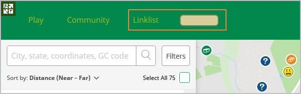  
	</li>
	<li>
		<strong>New:</strong> Virtually hit "Search this area" after dragging the map. [<a href="https://github.com/2Abendsegler/GClh/issues/966" title="Issue 966">966</a> / <a href="https://www.geocaching.com/profile/?u=capoaira" title="Thanks to capoaira">capoaira</a> / <a href="https://www.geocaching.com/profile/?u=2Abendsegler" title="Thanks to 2Abendsegler">2Abendsegler</a>] 
		<a href="https://www.geocaching.com/my/#GClhShowConfig#a#settings_searchmap_autoupdate_after_dragging" title="Link to your GClh Config">Settings -> Map:  
		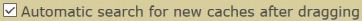</a>  
	</li>
	<li>
		<strong>New:</strong> Add link "Search Map" for using in Linklist. [<a href="https://github.com/2Abendsegler/GClh/issues/987" title="Issue 987">987</a> / <a href="https://www.geocaching.com/profile/?u=2Abendsegler" title="Thanks to 2Abendsegler">2Abendsegler</a>] 
		<a href="https://www.geocaching.com/my/#GClhShowConfig#a#ll#settings_bookmarks_top_menu_h" title="Link to your GClh Config">Settings -> Linklist / Navigation:  
		</a> 
		If you want to use it in your Linklist, you have to set it.  
	</li>
</ul>
 

### Browse map (old map):
<ul>	
	<li>
		<strong>New:</strong> Hide DNF smileys by default in browse map (old map). [<a href="https://github.com/2Abendsegler/GClh/issues/1115" title="Issue 1115">1115</a> / <a href="https://www.geocaching.com/profile/?u=capoaira" title="Thanks to capoaira">capoaira</a>] 
		</a> 
		<a href="https://www.geocaching.com/my/#GClhShowConfig#a#settings_map_hide_dnfs" title="Link to your GClh Config">Settings -> Map:  
		</a>  
	</li>
</ul>
 

### Pocket query:
<ul>	
	<li>
		<strong>Improve:</strong> Rewrite fixed PQ header/footer by pure CSS. Compatible with compact view. [<a href="https://github.com/2Abendsegler/GClh/issues/1034" title="Issue 1034">1034</a> / <a href="https://www.geocaching.com/profile/?u=Dratenik" title="Thanks to Dratenik">Dratenik</a>] 
		The functionality is not new. New is only the great functionality. Especially for small screens very well, because the line stays at the bottom of the screen when you scroll through the pocket queries. 
		 
		<a href="https://www.geocaching.com/my/#GClhShowConfig#a#settings_fixed_pq_header" title="Link to your GClh Config">Settings -> Pocket query: 
		</a> 
	        Please note that the feature is not new and you may need to activate the parameter.  
	</li>
</ul>
 

### Others:
<ul>	
	<li>
		<strong>New:</strong> Show unpublished caches in dashboard and show compact layout on unpublished caches page. [<a href="https://github.com/2Abendsegler/GClh/issues/1055" title="Issue 1055">1055</a> / <a href="https://www.geocaching.com/profile/?u=capoaira" title="Thanks to capoaira">capoaira</a>] 
		Show unpublished caches in dashboard under Nearby Events: 
		 
		Status "Disabled": The cache has not yet been submitted, you have disabled it or responded to the reviewer. 
		Status "Waiting for review": The cache has been submitted, but not yet edited by a reviewer. 
		Status "Your reviewer has responded": The cache has been submitted, the reviewer has responded. 
		Status "Ready to publish": The cache has been checked, is locked for further changes, and is waiting for the publish. 
		<a href="https://www.geocaching.com/my/#GClhShowConfig#a#settings_showUnpublishedHides" title="Link to your GClh Config">Settings -> Dashboard:  
		</a>  
		Show compact layout on unpublished caches page: 
		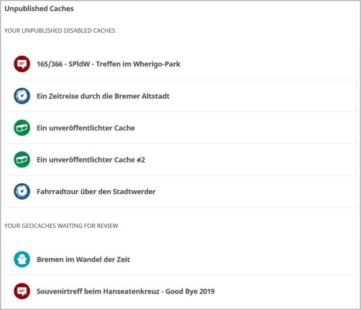 
		<a href="https://www.geocaching.com/my/#GClhShowConfig#a#settings_compactLayout_unpublishedList" title="Link to your GClh Config">Settings -> Others:  
		</a>  
	</li>
	<li>
		<strong>Improve:</strong> Improve GClh Search to Geo tours. [<a href="https://github.com/2Abendsegler/GClh/issues/1104" title="Issue 1104">1104</a> / <a href="https://www.geocaching.com/profile/?u=capoaira" title="Thanks to capoaira">capoaira</a>] 
		</a>  
	</li>
	<li>
		<strong>Fix:</strong> Show listing of (own) unpublished cache throws error. [<a href="https://github.com/2Abendsegler/GClh/issues/1039" title="Issue 1039">1039</a> / <a href="https://www.geocaching.com/profile/?u=Ruko2010" title="Thanks to Ruko2010">Ruko2010</a>] 
	</li>
	<li>
		<strong>Fix:</strong> Improve new and old log form. Show log preview on log page direct after automatic adding log signature, using log templates and using smilies. Make sure that signature is not generated multiple times. [<a href="https://github.com/2Abendsegler/GClh/issues/1047" title="Issue 1047">1047</a> / <a href="https://www.geocaching.com/profile/?u=2Abendsegler" title="Thanks to 2Abendsegler">2Abendsegler</a>] 
	</li>
	<li>
		<strong>Fix:</strong> Hide Facebook login doesn't run. [<a href="https://github.com/2Abendsegler/GClh/issues/1073" title="Issue 1073">1073</a> / <a href="https://www.geocaching.com/profile/?u=2Abendsegler" title="Thanks to 2Abendsegler">2Abendsegler</a>] 
	</li>
	<li>
		<strong>Fix:</strong> No coloring of TB listing. [<a href="https://github.com/2Abendsegler/GClh/issues/1074" title="Issue 1074">1074</a> / <a href="https://www.geocaching.com/profile/?u=2Abendsegler" title="Thanks to 2Abendsegler">2Abendsegler</a>] 
	</li>
	<li>
		<strong>Fix:</strong> Show bigger images in gallery doesn't run correct. [<a href="https://github.com/2Abendsegler/GClh/issues/1078" title="Issue 1078">1078</a> / <a href="https://www.geocaching.com/profile/?u=2Abendsegler" title="Thanks to 2Abendsegler">2Abendsegler</a>] 
	</li>
	<li>
		<strong>Fix:</strong> Link to Ignore List in dashboard doesn't run. [<a href="https://github.com/2Abendsegler/GClh/issues/1079" title="Issue 1079">1079</a> / <a href="https://www.geocaching.com/profile/?u=2Abendsegler" title="Thanks to 2Abendsegler">2Abendsegler</a>] 
	</li>
	<li>
		<strong>Fix:</strong> The changes of the links "Lists" and "Your lists" in dashboard to old-fashioned lists page are not longer possible. [<a href="https://github.com/2Abendsegler/GClh/issues/1080" title="Issue 1080">1080</a> / <a href="https://www.geocaching.com/profile/?u=2Abendsegler" title="Thanks to 2Abendsegler">2Abendsegler</a>] 
	</li>
	<li>
		<strong>Fix:</strong> Arrangement the Linklist and the other menus at the right side does not run. Alignment of vertical and horizontal menus. [<a href="https://github.com/2Abendsegler/GClh/issues/1091" title="Issue 1091">1091</a> / <a href="https://www.geocaching.com/profile/?u=2Abendsegler" title="Thanks to 2Abendsegler">2Abendsegler</a>] 
	</li>
	<li>
		<strong>Fix:</strong> Coloring of recently viewed caches list is not right. [<a href="https://github.com/2Abendsegler/GClh/issues/1121" title="Issue 1121">1121</a> / <a href="https://www.geocaching.com/profile/?u=2Abendsegler" title="Thanks to 2Abendsegler">2Abendsegler</a>] 
	</li>
</ul>
 
(13.12.2019) 
released by <a href="https://www.geocaching.com/profile/?u=2Abendsegler">2Abendsegler</a> 
 

---
## v0.9.18:
<ul>
	<li>
		<strong>New:</strong> Integrate reviewer/publisher in VIP lists. [<a href="https://github.com/2Abendsegler/GClh/issues/1011" title="Issue 1011">1011</a> / <a href="https://www.geocaching.com/profile/?u=Ruko2010" title="Thanks to Ruko2010">Ruko2010</a>] 
		You can now show the reviewer/publisher of the cache in your VIP list:  
		 
		<a href="https://www.geocaching.com/my/#GClhShowConfig#a#settings_show_reviewer_as_vip" title="Link to your GClh Config">Settings -> Listing: 
		</a> 
	</li>
	<li>
		<strong>New:</strong> "Great story" and "Helpful" are not longer deleted by GClh. [<a href="https://github.com/2Abendsegler/GClh/issues/663" title="Issue 663">663</a> / <a href="https://www.geocaching.com/profile/?u=Ruko2010" title="Thanks to Ruko2010">Ruko2010</a>] 
		If you haven't noticed yet, since about 1 year, Groundspeak is testing a new feature where you can tag a log as "Great Story" or "Helpful" and you can sort the logs by the rating of the users. 
		This feature is only available in Canada and Norway at this time. Since today, GClh is deleting these so called "Upvote"-Buttons, because we replace the log template. But from now on, GClh no longer deletes those buttons and you can use them to rate the logs and sort them by a certain rating. 
		If you want to know more about this topic, here is a blogpost from Groundspeak: <a href="https://www.geocaching.com/blog/2018/05/faq-log-upvotes/" title="Log Upvotes">here</a> 
		And this is how it looks like: 
		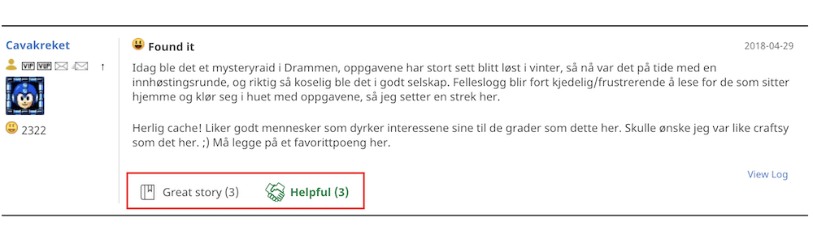 
	</li>
	<li>
		<strong>Fix:</strong> Show Google-Maps Link on Cache Listing Page does not work. [<a href="https://github.com/2Abendsegler/GClh/issues/1025" title="Issue 1025">1025</a> / <a href="https://www.geocaching.com/profile/?u=Ruko2010" title="Thanks to Ruko2010">Ruko2010</a>] 
	</li>
	<li>
		<strong>Fix:</strong> "Open Trackables" in Draft Mode not working consistently. [<a href="https://github.com/2Abendsegler/GClh/issues/1024" title="Issue 1024">1024</a> / <a href="https://www.geocaching.com/profile/?u=Ruko2010" title="Thanks to Ruko2010">Ruko2010</a>] 
	</li>
	<li>
		<strong>Fix:</strong> The "edit log" - functionality integrates the signature once again (Old log page). [<a href="https://github.com/2Abendsegler/GClh/issues/1023" title="Issue 1023">1023</a> / <a href="https://www.geocaching.com/profile/?u=Ruko2010" title="Thanks to Ruko2010">Ruko2010</a>] 
	</li>
	<li>
		<strong>Fix:</strong> Geonames in standard configuration as first service. [<a href="https://github.com/2Abendsegler/GClh/issues/1030" title="Issue 1030">1030</a> / <a href="https://www.geocaching.com/profile/?u=2Abendsegler" title="Thanks to 2Abendsegler">2Abendsegler</a>] 
	</li>
</ul>
(23.05.2019) 
released by <a href="https://www.geocaching.com/profile/?u=Ruko2010">Ruko2010</a> 
 

---
## v0.9.17:
<ul>
	<li>
		<strong>New:</strong> We added a Note of Thanks to honor all the contributors to this project. [<a href="https://github.com/2Abendsegler/GClh/issues/1004" title="Issue 1004">1004</a> / <a href="https://www.geocaching.com/profile/?u=2Abendsegler" title="Thanks to 2Abendsegler">2Abendsegler</a>] 
		You can access it via the config screen:  
		 
	</li>
	<li>
		<strong>New:</strong> Show log totals symbols at the top of the cache listing. [<a href="https://github.com/2Abendsegler/GClh/issues/1009" title="Issue 1009">1009</a> / <a href="https://www.geocaching.com/profile/?u=2Abendsegler" title="Thanks to 2Abendsegler" >2Abendsegler</a>] 
		 
		<a href="https://www.geocaching.com/my/#GClhShowConfig#a#settings_show_log_totals" title="Link to your GClh Config" >Settings -> Listing: 
		</a> 
	</li>
	<li>
		<strong>New:</strong> Replace initial Logs faster with GClh Template  [<a href="https://github.com/2Abendsegler/GClh/issues/995" title="Issue 995">995</a> / <a href="https://www.geocaching.com/profile/?u=Ruko2010" title="Thanks to Ruko2010" >Ruko2010</a>] 
	</li>
	<li>
		<strong>Fix:</strong> Logtemplate not inserted (Chrome / Safari)[<a href="https://github.com/2Abendsegler/GClh/issues/962" title="Issue 962">962</a> / <a href="https://www.geocaching.com/profile/?u=Ruko2010" title="Thanks to Ruko2010">Ruko2010</a>] 
		With fixing this bug, the insertion of a log Template is now also working on Android  
	</li>
	<li>
		<strong>Fix:</strong> Message Center - Receiver does not update if Message Center is accessed directly [<a href="https://github.com/2Abendsegler/GClh/issues/901" title="Issue 901">901</a> / <a href="https://www.geocaching.com/profile/?u=Ruko2010" title="Thanks to Ruko2010">Ruko2010</a>] 
	</li>
	<li>
		<strong>Fix:</strong> "Past Events" in bookmarklists and watchlists don't work with the new event time [<a href="https://github.com/2Abendsegler/GClh/issues/997" title="Issue 997">997</a> / <a href="https://www.geocaching.com/profile/?u=2Abendsegler" title="Thanks to 2Abendsegler">2Abendsegler</a>] 
	</li>
	<li>
		<strong>Fix:</strong> Show ignore list and hide area Lists in dashboard doesn't work [<a href="https://github.com/2Abendsegler/GClh/issues/999" title="Issue 999">999</a> / <a href="https://www.geocaching.com/profile/?u=2Abendsegler" title="Thanks to 2Abendsegler">2Abendsegler</a>] 
	</li>
	<li>
		<strong>Fix:</strong> Search field in header doesn't work with a location name [<a href="https://github.com/2Abendsegler/GClh/issues/1002" title="Issue 1002">1002</a> / <a href="https://www.geocaching.com/profile/?u=2Abendsegler" title="Thanks to 2Abendsegler">2Abendsegler</a>] 
	</li>
	<li>
		<strong>Fix:</strong> BRouter has a new URL schema [<a href="https://github.com/2Abendsegler/GClh/issues/1007" title="Issue 1007">1007</a> / <a href="https://www.geocaching.com/profile/?u=RadlerAndi" title="Thanks to RadlerAndi">RadlerAndi</a>] 
	</li>
	<li>
		<strong>Fix:</strong> Missing button create pocket query on foreign bookmarklists. [<a href="https://github.com/2Abendsegler/GClh/issues/1012" title="Issue 1012">1012</a> / <a href="https://www.geocaching.com/profile/?u=2Abendsegler" title="Thanks to 2Abendsegler">2Abendsegler</a>] 
	</li>
	<li>
		<strong>Fix:</strong> Build back old designed page list of bookmark lists and Rename link list of bookmark lists to new designed page. [<a href="https://github.com/2Abendsegler/GClh/issues/1015" title="Issue 1015">1015</a> / <a href="https://www.geocaching.com/profile/?u=2Abendsegler" title="Thanks to 2Abendsegler">2Abendsegler</a>] 
	</li>
	<li>
		<strong>Fix:</strong> On Google Maps page icon to GC Map is missing. [<a href="https://github.com/2Abendsegler/GClh/issues/1018" title="Issue 1018">1018</a> / <a href="https://www.geocaching.com/profile/?u=2Abendsegler" title="Thanks to 2Abendsegler">2Abendsegler</a>] 
	</li>
	<li>
		<strong>Fix:</strong> In dashboards sidebar the link to "Ignore List" comes also in chapter "Linklist" and "Default Links". [<a href="https://github.com/2Abendsegler/GClh/issues/1020" title="Issue 1020">1020</a> / <a href="https://www.geocaching.com/profile/?u=2Abendsegler" title="Thanks to 2Abendsegler">2Abendsegler</a>] 
	</li>
</ul>
(10.04.2019) 
released by <a href="https://www.geocaching.com/profile/?u=Ruko2010">Ruko2010</a> 
 

---
## v0.9.16:
<ul>
	<li>
		<strong>New:</strong> Show log counter when opening cache listing. [<a href="https://github.com/2Abendsegler/GClh/issues/954" title="Issue 954">954</a> / <a href="https://www.geocaching.com/profile/?u=2Abendsegler" title="Thanks to 2Abendsegler">2Abendsegler</a>] 
		 
		The functionality to show log counter is not new. New is only the possibility to activate the display by default without pushing a button. 
		<a href="https://www.geocaching.com/my/#GClhShowConfig#a#settings_show_log_counter_but" title="Link to your GClh Config">Settings -> Listing: 
		</a> 
			If you want to use it, you have to <a href="https://www.geocaching.com/my/#GClhShowConfig#a#settings_show_log_counter_but" title="Link to your GClh Config">activate the parameter</a>. 
		 
	</li>
	<li>
		<strong>New:</strong> Display difficulty and terrain in bookmark lists. [<a href="https://github.com/2Abendsegler/GClh/issues/975" title="Issue 975">975</a> / <a href="https://www.geocaching.com/profile/?u=Ruko2010" title="Thanks to Ruko2010">Ruko2010</a>] 
		 
		We changed the function of showing corrected coordinates to "Add additional information" and added difficulty and terrain for each cache. 
		 
	</li>
	<li>
		<strong>New:</strong> Add Link to "Unpublished Hides" to Linklist [<a href="https://github.com/2Abendsegler/GClh/issues/982" title="Issue 982">982</a> / <a href="https://www.geocaching.com/profile/?u=Ruko2010" title="Thanks to Ruko2010">Ruko2010</a>] 
		<a href="https://www.geocaching.com/my/#GClhShowConfig#a#llb#gclh_LinkListElement_74" title="Link to your GClh Config">Settings -> Linklist / Navigation: 
		</a> 
		 
	</li>
	<li>
		<strong>Fix:</strong> Prevent unwanted line breaks in GClh Config. [<a href="https://github.com/2Abendsegler/GClh/issues/956" title="Issue 956">956</a> / <a href="https://www.geocaching.com/profile/?u=2Abendsegler" title="Thanks to 2Abendsegler">2Abendsegler</a>] 
	</li>
	<li>
		<strong>Fix:</strong> Refine newer log page on small devices. [<a href="https://github.com/2Abendsegler/GClh/issues/957" title="Issue 957">957</a> / <a href="https://www.geocaching.com/profile/?u=2Abendsegler" title="Thanks to 2Abendsegler">2Abendsegler</a>] 
	</li>
	<li>
		<strong>Fix:</strong> Hide sidebar on map doesn't work with open in new tab. [<a href="https://github.com/2Abendsegler/GClh/issues/967" title="Issue 967">967</a> / <a href="https://www.geocaching.com/profile/?u=2Abendsegler" title="Thanks to 2Abendsegler">2Abendsegler</a>] 
	</li>
	<li>
		<strong>Fix:</strong> Error on shared bookmark lists if no home coordinates are known. [<a href="https://github.com/2Abendsegler/GClh/issues/970" title="Issue 970">970</a> / <a href="https://www.geocaching.com/profile/?u=2Abendsegler" title="Thanks to 2Abendsegler">2Abendsegler</a>] 
	</li>
	<li>
		<strong>Fix:</strong> Map error with additional layer and additional popup if Leaflet is not selected. [<a href="https://github.com/2Abendsegler/GClh/issues/969" title="Issue 969">969</a> / <a href="https://www.geocaching.com/profile/?u=Ruko2010" title="Thanks to Ruko2010">Ruko2010</a>, <a href="https://www.geocaching.com/profile/?u=2Abendsegler" title="Thanks to 2Abendsegler">2Abendsegler</a>] 
	</li>
	<li>
		<strong>Fix:</strong> Geonames elevation error with more than 20 coordinates. [<a href="https://github.com/2Abendsegler/GClh/issues/976" title="Issue 976">976</a> / <a href="https://www.geocaching.com/profile/?u=2Abendsegler" title="Thanks to 2Abendsegler">2Abendsegler</a>] 
	</li>
	<li>
		<strong>Fix:</strong> Save As Pocket Query - Default settings for new pocket queries do not work. [<a href="https://github.com/2Abendsegler/GClh/issues/978" title="Issue 978">978</a> / <a href="https://www.geocaching.com/profile/?u=Ruko2010" title="Thanks to Ruko2010">Ruko2010</a>] 
	</li>
	<li>
		<strong>Fix:</strong> Message Center: cacher name in greeting doesn't change on click on another geocacher [<a href="https://github.com/2Abendsegler/GClh/issues/901" title="Issue 901">901</a> / <a href="https://www.geocaching.com/profile/?u=Ruko2010" title="Thanks to Ruko2010">Ruko2010</a>] 
	</li>
</ul>
(13.02.2019) 
released by <a href="https://www.geocaching.com/profile/?u=2Abendsegler">2Abendsegler</a> 
 

---
## v0.9.15:
<ul>
	<li>
		<strong>New:</strong>  How you install GClh on Android devices. [<a href="https://github.com/2Abendsegler/GClh/issues/783" title="Issue 783">783</a> / <a href="https://www.geocaching.com/profile/?u=2Abendsegler" title="Thanks to 2Abendsegler">2Abendsegler</a>] 
		Extension of the <a href="https://github.com/2Abendsegler/GClh/blob/master/docu/tips_installation.md#android_firefox_en" title="Link to Tips for the installation of GC little helper II">Tips for the installation of GC little helper II (english)</a> / <a href="https://github.com/2Abendsegler/GClh/blob/master/docu/tips_installation.md#android_firefox_de" title="Link to Tips for the installation of GC little helper II">(german)</a>. 
		Extension of the FAQ: 
		- <a href="https://github.com/2Abendsegler/GClh/blob/master/docu/faq.md#4-en" title="Link to FAQ">Hints for using on Android devices (english)</a> / <a href="https://github.com/2Abendsegler/GClh/blob/master/docu/faq.md#4-de" title="Link to FAQ">(german)</a>. 
		- <a href="https://github.com/2Abendsegler/GClh/blob/master/docu/faq.md#3-en" title="Link to FAQ">GClh doesn't start (english)</a> / <a href="https://github.com/2Abendsegler/GClh/blob/master/docu/faq.md#3-de" title="Link to FAQ">(german)</a>. 
		 
	</li>
	<li>
		<strong>New:</strong> Show elevations also with Geonames. [<a href="https://github.com/2Abendsegler/GClh/issues/920" title="Issue 920">920</a> / <a href="https://www.geocaching.com/profile/?u=2Abendsegler" title="Thanks to 2Abendsegler">2Abendsegler</a>] 
		Because the number of calls to the Google Elevation API is limited and the Open-Elevation API is very slow and sometimes providing erroneous data, the Geonames API has also been implemented. The Geonames API is very fast. As before, a first and a second service can be selected. 
		We recommend the following settings. 
		<a href="https://www.geocaching.com/my/#GClhShowConfig#a#settings_show_elevation_of_waypoints" title="Link to your GClh Config">Settings -> Listing: 
			</a> 
		 
	</li>
	<li>
		<strong>New:</strong> Show elevation on additional popup on the map. [<a href="https://github.com/2Abendsegler/GClh/issues/802" title="Issue 802">802</a> / <a href="https://www.geocaching.com/profile/?u=2Abendsegler" title="Thanks to 2Abendsegler">2Abendsegler</a>] 
		 
		It only works if elevations for waypoints and listing coordinates is activated and at least a first service is named there. 
		<a href="https://www.geocaching.com/my/#GClhShowConfig#a#settings_show_elevation_of_waypoints" title="Link to your GClh Config">Settings -> Listing: 
			</a> 
		 
	</li>
	<li>
		<strong>Improvement:</strong> On favorites page no line-breaks in column location. [<a href="https://github.com/2Abendsegler/GClh/issues/926" title="Issue 926">926</a> / <a href="https://www.geocaching.com/profile/?u=2Abendsegler" title="Thanks to 2Abendsegler">2Abendsegler</a>] 
		<a href="https://www.geocaching.com/my/favorites.aspx" title="Link to your Favorites">
			 
			</a> 
		It is only used with a page width of at least 1000 pixels. 
		<a href="https://www.geocaching.com/my/#GClhShowConfig#a#settings_new_width" title="Link to your GClh Config">Settings -> Global: 
			</a> 
		 
	</li>
	<li>
		<strong>Fix:</strong> Wrong log's date in "latest logs" section of the map pop-up. [<a href="https://github.com/2Abendsegler/GClh/issues/922" title="Issue 922">922</a> / <a href="https://www.geocaching.com/profile/?u=Ruko2010" title="Thanks to Ruko2010">Ruko2010</a>] 
	</li>
	<li>
		<strong>Fix:</strong> Prevention line break caused by long cache name in map popup, works only for the first cache. [<a href="https://github.com/2Abendsegler/GClh/issues/924" title="Issue 924">924</a> / <a href="https://www.geocaching.com/profile/?u=2Abendsegler" title="Thanks to 2Abendsegler">2Abendsegler</a>] 
		(It is only implemented for browser Mozilla Firefox.) 
	</li>
	<li>
		<strong>Fix:</strong> Button "Mark Caches with Corr. Coords" can be pressed several times. [<a href="https://github.com/2Abendsegler/GClh/issues/925" title="Issue 925">925</a> / <a href="https://www.geocaching.com/profile/?u=2Abendsegler" title="Thanks to 2Abendsegler">2Abendsegler</a>] 
	</li>
	<li>
		<strong>Fix:</strong> Button "Mark Caches with Corr. Coords" doesn't work on foreign bookmarklists. [<a href="https://github.com/2Abendsegler/GClh/issues/928" title="Issue 928">928</a> / <a href="https://www.geocaching.com/profile/?u=2Abendsegler" title="Thanks to 2Abendsegler">2Abendsegler</a>] 
	</li>
	<li>
		<strong>Fix:</strong> Link to Gallery on friends page does not work for new designed profile page. [<a href="https://github.com/2Abendsegler/GClh/issues/937" title="Issue 937">937</a> / <a href="https://www.geocaching.com/profile/?u=2Abendsegler" title="Thanks to 2Abendsegler">2Abendsegler</a>] 
	</li>
	<li>
		<strong>Fix:</strong> Destroyed style of icons on search page for manage filter sets. [<a href="https://github.com/2Abendsegler/GClh/issues/939" title="Issue 939">939</a> / <a href="https://www.geocaching.com/profile/?u=2Abendsegler" title="Thanks to 2Abendsegler">2Abendsegler</a>] 
	</li>
	<li>
		<strong>Fix:</strong> Error on friends page in section Pending Friend Requests. [<a href="https://github.com/2Abendsegler/GClh/issues/941" title="Issue 941">941</a> / <a href="https://www.geocaching.com/profile/?u=2Abendsegler" title="Thanks to 2Abendsegler">2Abendsegler</a>] 
	</li>
	<li>
		<strong>Fix:</strong> Error on emtpy trackable pages. [<a href="https://github.com/2Abendsegler/GClh/issues/943" title="Issue 943">943</a> / <a href="https://www.geocaching.com/profile/?u=2Abendsegler" title="Thanks to 2Abendsegler">2Abendsegler</a>] 
	</li>
	<li>
		<strong>Fix:</strong> From "Friend League" to "Leaderboard". [<a href="https://github.com/2Abendsegler/GClh/issues/932" title="Issue 932">932</a> / <a href="https://www.geocaching.com/profile/?u=2Abendsegler" title="Thanks to 2Abendsegler">2Abendsegler</a>] 
	</li>
	<li>
		<strong>Fix:</strong> Link in dashboard to ignore list does not work with right mouse. [<a href="https://github.com/2Abendsegler/GClh/issues/851" title="Issue 851">851</a> / <a href="https://www.geocaching.com/profile/?u=2Abendsegler" title="Thanks to 2Abendsegler">2Abendsegler</a>] 
	</li>
</ul>
(18.01.2019) 
released by <a href="https://www.geocaching.com/profile/?u=2Abendsegler">2Abendsegler</a> 
 

---
## v0.9.14:
<ul>
	<li>
		<strong>Improvement:</strong> Save Personal Cache Note in cache listing with F2 key: [Issue <a href="https://github.com/2Abendsegler/GClh/issues/907">#907</a> / Thanks <a href="https://www.geocaching.com/profile/?u=2Abendsegler">2Abendsegler</a>] 
		 
	</li>
	<li>
		<strong>Improvement:</strong> Process icon "Copy GC Code to clipboard" also on additional Popup in maps: [Issue <a href="https://github.com/2Abendsegler/GClh/issues/911">#911</a> / Thanks <a href="https://www.geocaching.com/profile/?u=2Abendsegler">2Abendsegler</a>] 
		 
	</li>
	<li>
		<strong>Improvement:</strong> Past events error in foreign bookmarklists and in watchlist: [Issue <a href="https://github.com/2Abendsegler/GClh/issues/898">#898</a> / Thanks <a href="https://www.geocaching.com/profile/?u=2Abendsegler">2Abendsegler</a>] 
		To recognize and to select past events in bookmark lists and in the watchlist, the cache listings of the events will be read additionally. If you do not want this, the option can be disabled. 
		 
	</li>
	<li>
		<strong>Fix:</strong> Bookmark List: Create PQ-Button disappears in Compact Layout: [Issue <a href="https://github.com/2Abendsegler/GClh/issues/891">#891</a> / Thanks <a href="https://www.geocaching.com/profile/?u=Ruko2010">Ruko2010</a>] 
	</li>
	<li>
		<strong>Fix:</strong> Error while generating Message Icons on own Caches: [Issue <a href="https://github.com/2Abendsegler/GClh/issues/889">#889</a> / Thanks <a href="https://www.geocaching.com/profile/?u=Ruko2010">Ruko2010</a>] 
	</li>
	<li>
		<strong>Fix:</strong> Log Templates do not work when Owner Name contains a Single Quote: [Issue <a href="https://github.com/2Abendsegler/GClh/issues/902">#902</a> / Thanks <a href="https://www.geocaching.com/profile/?u=2Abendsegler">2Abendsegler</a>] 
	</li>
	<li>
		<strong>Fix:</strong> Unification of line spacing and font size of "Add to list" popup: [Issue <a href="https://github.com/2Abendsegler/GClh/issues/905">#905</a> / Thanks <a href="https://www.geocaching.com/profile/?u=2Abendsegler">2Abendsegler</a>] 
	</li>
	<li>
		<strong>Fix:</strong> Log inline and PMO log inline on listing do not work: [Issue <a href="https://github.com/2Abendsegler/GClh/issues/888">#888</a> / Thanks <a href="https://www.geocaching.com/profile/?u=2Abendsegler">2Abendsegler</a>] 
	</li>
	<li>
		<strong>Fix:</strong> Small map in Listing does not show up: [Issue <a href="https://github.com/2Abendsegler/GClh/issues/865">#865</a> / Thanks <a href="https://www.geocaching.com/profile/?u=CachingFoX">CachingFoX</a>] 
		Small Map in Listing and while creating a Pocketquery is now configurable. You can choose the map layer and the zoom: 
		 
		 
		 
	</li>
	<li>
		<strong>Improvement:</strong> Preventing twitching on the additional map popup: [Issue <a href="https://github.com/2Abendsegler/GClh/issues/916">#916</a> / Thanks <a href="https://www.geocaching.com/profile/?u=2Abendsegler">2Abendsegler</a>] 
	</li>
</ul>
(21.12.2018) 
released by <a href="https://www.geocaching.com/profile/?u=Ruko2010">Ruko2010</a> 
 

---
## v0.9.13:
<ul>
	<li>
		<strong>New:</strong> Project-GC - PQ-Splitter: You can now configurate how often the querys should run and choose between primary and secondary Output Email [Issue <a href="https://github.com/2Abendsegler/GClh/issues/861">#861</a>] 
		Thanks to <a href="https://www.geocaching.com/profile/?u=Ruko2010">Ruko2010</a> for the implementation. 
		 
  </li>
  <li>
		<strong>New:</strong> Added VIP/VUP and Message Icon behind Usernames on "Read the audit Log"-page (this page is only visible for own <i>premium caches</i>) [Issue <a href="https://github.com/2Abendsegler/GClh/issues/874">#874</a>] 
		Thanks to <a href="https://www.geocaching.com/profile/?u=Ruko2010">Ruko2010</a> for the implementation. 
		 
	</li>
	<li>
		<strong>Improvement:</strong> PQ-Splitter (Project GC) now only opens 5 Popups at a time to reduce the browsers resource consumption [Issue <a href="https://github.com/2Abendsegler/GClh/issues/842">#842</a>] 
		Thanks to <a href="https://www.geocaching.com/profile/?u=Ruko2010">Ruko2010</a> for the implementation. 
	</li>
	<li>
		<strong>Improvement:</strong> Selection in Message Center and Profile Settings is not visible in Firefox [Issue <a href="https://github.com/2Abendsegler/GClh/issues/878">#878</a>] 
		Thanks to <a href="https://www.geocaching.com/profile/?u=Ruko2010">Ruko2010</a> for the implementation. 
	</li>
	<li>
		<strong>Fix:</strong> Error in Nearest List, PQ, Recently viewed because of missing last column "Send to GPS" [Issue <a href="https://github.com/2Abendsegler/GClh/issues/844">#844</a>] 
		Thanks to <a href="https://www.geocaching.com/profile/?u=2Abendsegler">2Abendsegler</a> for the fix. 
	</li>
	<li>
		<strong>Fix:</strong> Edit and Image Links to own caches doesn't shown [Issue <a href="https://github.com/2Abendsegler/GClh/issues/810">#810</a>] 
		Thanks to <a href="https://www.geocaching.com/profile/?u=Ruko2010">Ruko2010</a> for the fix. 
	</li>
	<li>
		<strong>Fix:</strong> Loading logs do not stop after click to button show all logs [Issue <a href="https://github.com/2Abendsegler/GClh/issues/825">#825</a>] 
		Thanks to <a href="https://www.geocaching.com/profile/?u=Ruko2010">Ruko2010</a> for the fix. 
	</li>
	<li>
		<strong>Fix:</strong> Disable Loading Logs by GC on Product Listing Page [Issue <a href="https://github.com/2Abendsegler/GClh/issues/832">#832</a>] 
		Thanks to <a href="https://www.geocaching.com/profile/?u=Ruko2010">Ruko2010</a> for the fix. 
	</li>
	<li>
		<strong>Fix:</strong> PQ error because of missing last column "Send to GPS". [Issue <a href="https://github.com/2Abendsegler/GClh/issues/844">#844</a>] 
		Thanks to <a href="https://www.geocaching.com/profile/?u=2Abendsegler">2Abendsegler</a> for the fix. 
	</li>
	<li>
		<strong>Fix:</strong> Improved Elevation Service Error Handling [Issue <a href="https://github.com/2Abendsegler/GClh/issues/847">#847</a>] 
		Thanks to <a href="https://www.geocaching.com/profile/?u=CachingFoX">CachingFoX</a> for the fix. 
	</li>
	<li>
		<strong>Fix:</strong> Adapt the height of the Personal Cache Note does not work properly [Issue <a href="https://github.com/2Abendsegler/GClh/issues/848">#848</a>] 
		Thanks to <a href="https://www.geocaching.com/profile/?u=CachingFoX">CachingFoX</a> for the fix. 
	</li>
	<li>
		<strong>Fix:</strong> Added Color in Configuration and Documentation in Changelog for new parameter "Show GPSVisualizer" introduced in 0.9.12 [Issues <a href="https://github.com/2Abendsegler/GClh/issues/849">#849</a>, <a href="https://github.com/2Abendsegler/GClh/issues/850">#850</a>] 
		Thanks to <a href="https://www.geocaching.com/profile/?u=CachingFoX">CachingFoX</a> and <a href="https://www.geocaching.com/profile/?u=Ruko2010">Ruko2010</a> for the fixes. 
	</li>
	<li>
		<strong>Fix:</strong> Preselection map for BRouter does not work [Issue <a href="https://github.com/2Abendsegler/GClh/issues/852">#852</a>] 
		Thanks to <a href="https://www.geocaching.com/profile/?u=CachingFoX">CachingFoX</a> for the fix. 
	</li>
	<li>
		<strong>Fix:</strong> Error on Profile (Settings) [Issue <a href="https://github.com/2Abendsegler/GClh/issues/854">#854</a>] 
		Thanks to <a href="https://www.geocaching.com/profile/?u=CachingFoX">CachingFoX</a> for the fix. 
	</li>
	<li>
		<strong>Fix:</strong> Need to scroll down to see image description in pop-up mode [Issue <a href="https://github.com/2Abendsegler/GClh/issues/862">#862</a>] 
		Thanks to <a href="https://www.geocaching.com/profile/?u=Ruko2010">Ruko2010</a> for the fix. 
	</li>
	<li>
		<strong>Fix:</strong> Flopps Maps Link in Listing: Link to Google Maps Satellite not working [Issue <a href="https://github.com/2Abendsegler/GClh/issues/868">#868</a>] 
		Thanks to <a href="https://www.geocaching.com/profile/?u=Ruko2010">Ruko2010</a> for the fix. 
	</li>
	<li>
		<strong>Fix:</strong> Showing Weekday throws Error on unpublished Events [Issue <a href="https://github.com/2Abendsegler/GClh/issues/876">#876</a>] 
		Thanks to <a href="https://www.geocaching.com/profile/?u=Ruko2010">Ruko2010</a> for the fix. 
	</li>
</ul>
(09.10.2018) 
released by <a href="https://www.geocaching.com/profile/?u=Ruko2010">Ruko2010</a> 
 

---
## v0.9.12:
<ul>
	<li>
		<strong>New:</strong> Generate PQs from Output of Project-GC PQSplit [Issue <a href="https://github.com/2Abendsegler/GClh/issues/699">#699</a>] 
		Thanks to <a href="https://www.geocaching.com/profile/?u=Ruko2010">Ruko2010</a> for the implementation. 
		<strong>How to use it:</strong> Go to <a href="https://project-gc.com/Tools/PQSplit">https://project-gc.com/Tools/PQSplit</a> and, if not already done authenticate your account with Geocaching.com. Select either a country or a region to generate Pocket Querys for all caches in this area. Now enter a name and click on "Create PQ(s)". GClh will open as many Pop-ups as needed to generate all PocketQuerys on Geocaching.com. The Pup-ups will automaticly close if everything is done. Please make sure to not use a Pop-Up-Blocker. Also for now you can only set the filter country or region. Any other filter will disable this function. 
		<strong>Example:</strong> 
		 
	</li>
	<li>
		<strong>New:</strong> Added GPSVisualizer as an additional map service [Issue <a href="https://github.com/2Abendsegler/GClh/issues/807">#807</a>] 
		Thanks to <a href="https://www.geocaching.com/profile/?u=CachingFox">CachingFox</a> for the implementation. 
		 
		 
	</li>
	<li>
		<strong>New:</strong> Adapt the height of the edit field 'Personal Cache Note' to show the complete note [Issues <a href="https://github.com/2Abendsegler/GClh/issues/821">#821</a>, <a href="https://github.com/2Abendsegler/GClh/issues/816">#816</a>] 
		Thanks to <a href="https://www.geocaching.com/profile/?u=CachingFox">CachingFox</a> for the implementation. 
		 
	</li>
	<li>
		<strong>New:</strong> Add link to ignore list in sidebar [Issues <a href="https://github.com/2Abendsegler/GClh/issues/815">#815</a>, <a href="https://github.com/2Abendsegler/GClh/issues/819">#819</a>] 
		Thanks to <a href="https://www.geocaching.com/profile/?u=CachingFox">CachingFox</a> for the implementation. 
		 
		 
	</li>
	<li>
		<strong>New:</strong> Show both tabs "Active Pocket Queries" and "Pocket Queries Ready for Download" together of one page [Issue <a href="https://github.com/2Abendsegler/GClh/issues/835">#835</a>] 
		Thanks to <a href="https://www.geocaching.com/profile/?u=2Abendsegler">2Abendsegler</a> for the implementation. 
		 
		 
		This feature is disabled by default. You can enable it in the GClh configuration.
	</li>
	<li>
		<strong>New:</strong> Own statistic values in one line [Issue <a href="https://github.com/2Abendsegler/GClh/issues/800">#800</a>] 
		Thanks to <a href="https://www.geocaching.com/profile/?u=2Abendsegler">2Abendsegler</a> for the implementation. 
		 
	</li>
	<li>
		<strong>Fix:</strong> Duplicated Buttons in TB-List (Log Page) are not working [Issue <a href="https://github.com/2Abendsegler/GClh/issues/786">#786</a>] 
		Thanks to <a href="https://www.geocaching.com/profile/?u=Ruko2010">Ruko2010</a> for the fix. 
	</li>
	<li>
		<strong>Fix:</strong> On Paste in Log, Signature is added also if the pasted log contains the signature [Issue <a href="https://github.com/2Abendsegler/GClh/issues/776">#776</a>] 
		Thanks to <a href="https://www.geocaching.com/profile/?u=Ruko2010">Ruko2010</a> for the fix. 
	</li>
	<li>
		<strong>Fix:</strong> Reduce script injection in head section [Issue <a href="https://github.com/2Abendsegler/GClh/issues/811">#811</a>] 
		Thanks to <a href="https://www.geocaching.com/profile/?u=CachingFox">CachingFox</a> for the fix. 
	</li>
	<li>
		<strong>Fix:</strong> Error in small Map on Listing Page [Issue <a href="https://github.com/2Abendsegler/GClh/issues/787">#787</a>] 
		Thanks to <a href="https://www.geocaching.com/profile/?u=CachingFox">CachingFox</a> for the fix. 
	</li>
	<li>
		<strong>Fix:</strong> Error occurs on own "Unpublished Cache" page [Issue <a href="https://github.com/2Abendsegler/GClh/issues/809">#809</a>] 
		Thanks to <a href="https://www.geocaching.com/profile/?u=CachingFox">CachingFox</a> for the fix. 
	</li>
	<li>
		<strong>Fix:</strong> Error occurs on (not owned) "Unpublished Cache" page [Issue <a href="https://github.com/2Abendsegler/GClh/issues/826">#826</a>] 
		Thanks to <a href="https://www.geocaching.com/profile/?u=CachingFox">CachingFox</a> for the fix. 
	</li>
	<li>
		<strong>Fix:</strong> Errors on Log Page [Issue <a href="https://github.com/2Abendsegler/GClh/issues/833">#833</a>] 
		Thanks to <a href="https://www.geocaching.com/profile/?u=Ruko2010">Ruko2010</a> for the fix. 
	</li>
	<li>
		<strong>Fix:</strong> Error messages at 'All Geocaches' on the public profile [Issue <a href="https://github.com/2Abendsegler/GClh/issues/818">#818</a>] 
		Thanks to <a href="https://www.geocaching.com/profile/?u=CachingFox">CachingFox</a> for the fix. 
	</li>
	<li>
		<strong>Fix:</strong> The list of pq shows Active and Ready for Download together of one page [Issue <a href="https://github.com/2Abendsegler/GClh/issues/830">#830</a>] 
		Thanks to <a href="https://www.geocaching.com/profile/?u=2Abendsegler">2Abendsegler</a> for the fix. 
	</li>
	<li>
		<strong>Fix:</strong> If a message comes before posting a special log there is an error [Issue <a href="https://github.com/2Abendsegler/GClh/issues/836">#836</a>] 
		Thanks to <a href="https://www.geocaching.com/profile/?u=2Abendsegler">2Abendsegler</a> for the fix. 
	</li>
	<li>
		<strong>Fix:</strong> Button Show all logs and other sections do not work [Issue <a href="https://github.com/2Abendsegler/GClh/issues/761">#761</a>] 
		Thanks to <a href="https://www.geocaching.com/profile/?u=2Abendsegler">2Abendsegler</a> for the fix. 
	</li>
	<li>
		<strong>Fix:</strong> Tune server time output in pocket querries [Issue <a href="https://github.com/2Abendsegler/GClh/issues/796">#796</a>] 
		Thanks to <a href="https://www.geocaching.com/profile/?u=2Abendsegler">2Abendsegler</a> for the fix. 
	</li>
	<li>
		<strong>Fix:</strong> Tune positioning of buttons on friend league page. Tune distance of the images in the logs in the listing [Issue <a href="https://github.com/2Abendsegler/GClh/issues/790">#790</a>] 
		Thanks to <a href="https://www.geocaching.com/profile/?u=2Abendsegler">2Abendsegler</a> for the fix. 
	</li>
	<li>
		<strong>Fix:</strong> Username for generating profile link is not always recognized [Issue <a href="https://github.com/2Abendsegler/GClh/issues/793">#793</a>] 
		Thanks to <a href="https://www.geocaching.com/profile/?u=2Abendsegler">2Abendsegler</a> for the fix. 
	</li>
</ul>
(04.09.2018) 
released by <a href="https://www.geocaching.com/profile/?u=Ruko2010">Ruko2010</a> 
 

---
## v0.9.11:
<ul>
	<li>
		<strong>New:</strong> Alert if gclh_error is called (only in developer mode) [Issue <a href="https://github.com/2Abendsegler/GClh/issues/752">#752</a>] 
		We introduced a new section "Development" in the configuration. Here we will place features that are mostly designed for developers. The standard user can ignore this configurations. 
		Thanks to <a href="https://www.geocaching.com/profile/?u=CachingFoX">CachingFoX</a> for the implementation. 
	</li>
	<li>
		<strong>New:</strong> Clicking on the Personal Note Field focusing the input (no need to click twice any more) [Issue <a href="https://github.com/2Abendsegler/GClh/issues/762">#762</a>] 
	</li>
	<li>
		<strong>New:</strong> Auto Open Trackables when loading the logging page (new design) [Issue <a href="https://github.com/2Abendsegler/GClh/issues/775">#775</a>] 
	</li>
	<li>
		<strong>New:</strong> Line break for cache title and owner in additional popup on map [Issue <a href="https://github.com/2Abendsegler/GClh/issues/768">#768</a>] 
	</li>
	<li>
		<strong>Fix:</strong> Nickname missing in the Latest logs section [Issue <a href="https://github.com/2Abendsegler/GClh/issues/753">#753</a>] 
	</li>
	<li>
		<strong>Fix:</strong> Preview of Pictures in Logs throws Error [Issue <a href="https://github.com/2Abendsegler/GClh/issues/755">#755</a>] 
		Thanks to <a href="https://www.geocaching.com/profile/?u=2Abendsegler">2Abendsegler</a> for the fix. 
	</li>
	<li>
		<strong>Fix:</strong> Logs with Many Pictures: Picture container floats out of viewport [Issue <a href="https://github.com/2Abendsegler/GClh/issues/754">#754</a>] 
		Thanks to <a href="https://www.geocaching.com/profile/?u=2Abendsegler">2Abendsegler</a> for the fix. 
	</li>
	<li>
		<strong>Fix:</strong> Formatting in logs is demolished due to changes made by GS [Issue <a href="https://github.com/2Abendsegler/GClh/issues/759">#759</a>] 
		Thanks to <a href="https://www.geocaching.com/profile/?u=2Abendsegler">2Abendsegler</a> for the fix. 
	</li>
	<li>
		<strong>Fix:</strong> Eventdate is missing [Issue <a href="https://github.com/2Abendsegler/GClh/issues/764">#764</a>] 
		Thanks to <a href="https://www.geocaching.com/profile/?u=2Abendsegler">2Abendsegler</a> for the fix. 
	</li>
	<li>
		<strong>Fix:</strong> No favorites in percent in map on additional popup [Issue <a href="https://github.com/2Abendsegler/GClh/issues/766">#766</a>] 
		Thanks to <a href="https://www.geocaching.com/profile/?u=2Abendsegler">2Abendsegler</a> for the fix. 
	</li>
	<li>
		<strong>Fix:</strong> Listing Coordinates are not transfered to Flopp's Map and BRouter [Issue <a href="https://github.com/2Abendsegler/GClh/issues/771">#771</a>] 
		Thanks to <a href="https://www.geocaching.com/profile/?u=CachingFoX">CachingFoX</a> for the fix. 
	</li>
	<li>
		<strong>Fix:</strong> Logs are not added while scrolling down [Issue <a href="https://github.com/2Abendsegler/GClh/issues/745">#745</a>] 
	</li>
	<li>
		<strong>Fix:</strong> Calling Config from new dashboard do not work correct [Issue <a href="https://github.com/2Abendsegler/GClh/issues/784">#784</a>] 
		Thanks to <a href="https://www.geocaching.com/profile/?u=2Abendsegler">2Abendsegler</a> for the fix. 
	</li>
	<li>
		<strong>Fix:</strong> Wrong implementation of delayed re-try call idiom at impCallLink() [Issue <a href="https://github.com/2Abendsegler/GClh/issues/788">#788</a>] 
		Thanks to <a href="https://www.geocaching.com/profile/?u=CachingFoX">CachingFoX</a> for the fix. 
	</li>
	<li>
		<strong>Refactoring:</strong> [Issue <a href="https://github.com/2Abendsegler/GClh/issues/770">#770</a>], [Issue <a href="https://github.com/2Abendsegler/GClh/issues/770">#770</a>] 
		Thanks to <a href="https://www.geocaching.com/profile/?u=CachingFoX">CachingFoX</a> for the implementation. 
	</li>
</ul>
(25.08.2018) 
released by <a href="https://www.geocaching.com/profile/?u=Ruko2010">Ruko2010</a> 
 

---
## v0.9.10:
<ul>
	<li>
		<strong>Improvement:</strong> Some changes to the Map-Popup to make it more flexible [Issue <a href="https://github.com/2Abendsegler/GClh/issues/646">#646</a>] 
	</li>
	<li>
		<strong>Hot-Fix:</strong> Reload of logs in Listing-Page fails and breaks GClh. [Issue <a href="https://github.com/2Abendsegler/GClh/issues/745">#745</a>] 
		This Problem is not fixed yet. We have just deactived this function to get the whole Listing page (VIP/VUP, etc.) back to work. In the meantime you can use the button under the last log or at the top of the logs to load all logs. 
		<strong>We are still working on this Issue and hope to get a fix soon.</strong> 
	</li>
	<li>
		<strong>Fix:</strong> Updating names of countries [Issue <a href="https://github.com/2Abendsegler/GClh/issues/722">#722</a>] 
		Thanks to <a href="https://www.geocaching.com/profile/?u=CachingFoX">CachingFoX</a> for the fix. 
	</li>
	<li>
		<strong>Fix:</strong> Friendleague: After click on "see more" reloaded friends have no VIP/VUP Icons [Issue <a href="https://github.com/2Abendsegler/GClh/issues/734">#734</a>] 
	</li>
	<li>
		<strong>Fix:</strong> Missing 'Go to GC Map' button at www.openstreetmap.org [Issue <a href="https://github.com/2Abendsegler/GClh/issues/740">#740</a>] 
		Thanks to <a href="https://www.geocaching.com/profile/?u=CachingFoX">CachingFoX</a> for the fix. 
	</li>
	<li>
		<strong>Fix:</strong> MapPopup-Data is not loaded [Issue <a href="https://github.com/2Abendsegler/GClh/issues/747">#747</a>] 
	</li>
	<li>
		<strong>Fix:</strong> Hide empty Personal note in a cache listing fails [Issue <a href="https://github.com/2Abendsegler/GClh/issues/746">#746</a>] 
		Thanks to <a href="https://www.geocaching.com/profile/?u=CachingFoX">CachingFoX</a> for the fix. 
	</li>
</ul>
(11.08.2018) 
released by <a href="https://www.geocaching.com/profile/?u=Ruko2010">Ruko2010</a> 
 

---
## v0.9.9:
<ul>
	<li>
		<strong>Fix:</strong> Move Cursor to Starting Position after insertion of Signature in New Log/Draft Page: [Issue <a href="https://github.com/2Abendsegler/GClh/issues/729">#729</a>] 
		Thanks to <a href="https://www.geocaching.com/profile/?u=Ruko2010">Ruko2010</a> for the fix. 
	</li>
	<li>
		<strong>Fix:</strong> On Friendleague VIP/VUP List ist not generated correctly for Names with Special Chars in it: [Issue <a href="https://github.com/2Abendsegler/GClh/issues/732">#732</a>] 
		Thanks to <a href="https://www.geocaching.com/profile/?u=Ruko2010">Ruko2010</a> for the fix. 
	</li>
	<li>
		<strong>Fix:</strong> GClh and Geothumbs: Images in cache listing are damaged due to changes made by GS: [Issue <a href="https://github.com/2Abendsegler/GClh/issues/733">#733</a>] 
		If you are using Geothumbs, please install also the new version <a href="http://benchmarks.org.uk/greasemonkey/geothumbs/geothumbs_v7.9.user.js">Geothumbs 7.9</a>. 
	</li>
</ul>
(30.06.2018) 
released by <a href="https://www.geocaching.com/profile/?u=2Abendsegler">2Abendsegler</a> 
 

---
## v0.9.8:
<ul>
	<li>
		<strong>New:</strong> Mark more than one Pocket Query for generating without refreshing page for each: [Issue <a href="https://github.com/2Abendsegler/GClh/issues/702">#702</a>] 
		Only available with activated setting <a href="https://www.geocaching.com/my/#GClhShowConfig#a#settings_compact_layout_list_of_pqs">Show compact layout in list of pocket queries</a>. 
		Page <a href="https://www.geocaching.com/pocket/default.aspx">List of Pocket Queries</a>. 
		 
		Thanks to <a href="https://www.geocaching.com/profile/?u=2Abendsegler">2Abendsegler</a> for the implementation. 
		 
	</li>
	<li>
		<strong>Improvement:</strong> Show number of active Pocket Queries on page <a href="https://www.geocaching.com/pocket/default.aspx">Your Pocket Queries</a>: [Issue <a href="https://github.com/2Abendsegler/GClh/issues/705">#705</a>] 
		Thanks to <a href="https://www.geocaching.com/profile/?u=2Abendsegler">2Abendsegler</a> for the change. 
	</li>
	<li>
		<strong>Improvement:</strong> Show number of Bookmark Lists above on old page <a href="https://www.geocaching.com/my/lists.aspx">List of Bookmark Lists</a>: [Issue <a href="https://github.com/2Abendsegler/GClh/issues/711">#711</a>] 
		Thanks to <a href="https://www.geocaching.com/profile/?u=2Abendsegler">2Abendsegler</a> for the change. 
	</li>
	<li>
		<strong>Improvement:</strong> Translate <a href="https://github.com/2Abendsegler/GClh/blob/master/docu/development-tampermonkey.md">Development with Tampermonkey</a> to English: [Issue <a href="https://github.com/2Abendsegler/GClh/issues/630">#630</a>] 
	</li>
	<li>
		<strong>Improvement:</strong> Show links to found caches for every country/state on statistic maps page (improve of #363): [Issue <a href="https://github.com/2Abendsegler/GClh/issues/725">#725</a>] 
		Thanks to <a href="https://www.geocaching.com/profile/?u=CachingFoX">CachingFoX</a> for the implementation. 
	</li>
	<li>
		<strong>Fix:</strong> Navigation menu not reachable on new page Hidden Creatures: [Issue <a href="https://github.com/2Abendsegler/GClh/issues/713">#713</a>] 
		Thanks to <a href="https://www.geocaching.com/profile/?u=2Abendsegler">2Abendsegler</a> for the fix. 
	</li>
	<li>
		<strong>Fix:</strong> Push the map further down when the map popup is displayed: [Issue <a href="https://github.com/2Abendsegler/GClh/issues/646">#646</a>] 
	</li>
	<li>
		<strong>Fix:</strong> Damaged name and position of log images due to changes made by GS: [Issue <a href="https://github.com/2Abendsegler/GClh/issues/719">#719</a>] 
		Thanks to <a href="https://www.geocaching.com/profile/?u=2Abendsegler">2Abendsegler</a> for the fix. 
	</li>
	<li>
		<strong>Fix:</strong> Elevation of waypoints with hidden coordinates are shown as +0m: [Issue <a href="https://github.com/2Abendsegler/GClh/issues/670">#670</a>] 
		Thanks to <a href="https://www.geocaching.com/profile/?u=CachingFoX">CachingFoX</a> for the fix. 
	</li>
	<li>
		<strong>Fix:</strong> Updating names of countries: [Issue <a href="https://github.com/2Abendsegler/GClh/issues/722">#722</a>] 
		Thanks to <a href="https://www.geocaching.com/profile/?u=CachingFoX">CachingFoX</a> for the fix. 
	</li>
</ul>
(25.06.2018) 
released by <a href="https://www.geocaching.com/profile/?u=Ruko2010">Ruko2010</a> 
 

---
## v0.9.7:
<ul>
	<li>
		<strong>New:</strong> Show number of acquired souvenirs: [Issue <a href="https://github.com/2Abendsegler/GClh/issues/672">#672</a>] 
		 
		Thanks to <a href="https://www.geocaching.com/profile/?u=CachingFoX">CachingFoX</a> for the implementation. 
		 
	</li>
	<li>
		<strong>New:</strong> Link to map on bookmark list page: [Issue <a href="https://github.com/2Abendsegler/GClh/issues/680">#680</a>] 
		 
		(Picture is in compact layout.) 
		 
	</li>
	<li>
		<strong>New:</strong> Button to copy GC Code in cache listing to clipboard: [Issue <a href="https://github.com/2Abendsegler/GClh/issues/695">#695</a>] 
		 
		 
	</li>
	<li>
		<strong>New:</strong> Show/hide text in column Description in <a href="https://www.geocaching.com/my/lists.aspx">old list of bookmark lists</a>: [Issue <a href="https://github.com/2Abendsegler/GClh/issues/686">#686</a>] 
		Only available with activated setting <a href="https://www.geocaching.com/my/#GClhShowConfig#a#settings_compact_layout_list_of_bm_lists">show compact layout in list of bookmark lists</a>. 
		 
		 
		 
	</li>
	<li>
		<strong>Improvement:</strong> Reduce line breaks in owner line on enhanced map popup: [Issue <a href="https://github.com/2Abendsegler/GClh/issues/668">#668</a>] 
		  
		 
	</li>
	<li>
		<strong>Improvement:</strong> Update FAQs: [Issue <a href="https://github.com/2Abendsegler/GClh/issues/664">#664</a>] 
		Thanks to <a href="https://www.geocaching.com/profile/?u=Ruko2010">Ruko2010</a> for the update. 
		 
	</li>
	<li>
		<strong>Fix:</strong> Wrong links to found caches if there are equal names for a country and a region (statistics/map): [Issue <a href="https://github.com/2Abendsegler/GClh/issues/693">#693</a>] 
		Thanks to <a href="https://www.geocaching.com/profile/?u=Ruko2010">Ruko2010</a> for the fix. 
	</li>
	<li>
		<strong>Fix:</strong> Link to found caches in Czechia is missing (statistics/map): [Issue <a href="https://github.com/2Abendsegler/GClh/issues/691">#691</a>] 
		Thanks to <a href="https://www.geocaching.com/profile/?u=CachingFoX">CachingFoX</a> for the fix. 
	</li>
	<li>
		<strong>Fix:</strong> Elevation value 0m is shown with a plus sign: [Issue <a href="https://github.com/2Abendsegler/GClh/issues/671">#671</a>] 
		Thanks to <a href="https://www.geocaching.com/profile/?u=CachingFoX">CachingFoX</a> for the fix. 
	</li>
	<li>
		<strong>Fix:</strong> Grammar and Typo. 
		Thanks to <a href="https://www.geocaching.com/profile/?u=Bananeweizen">Bananeweizen</a> for the fix. 
	</li>
	<li>
		<strong>Fix:</strong> Set black as text color in search field: [Issue <a href="https://github.com/2Abendsegler/GClh/issues/662">#662</a>] 
	</li>
	<li>
		<strong>Fix:</strong> Demolished search and map buttons on new dashboard page due to changes made by GS: [Issue <a href="https://github.com/2Abendsegler/GClh/issues/674">#674</a>] 
	</li>
	<li>
		<strong>Fix:</strong> Demolished buttons on search page due to changes made by GS: [Issue <a href="https://github.com/2Abendsegler/GClh/issues/666">#666</a>] 
	</li>
	<li>
		<strong>Fix:</strong> More than one loading area and VIP button on enhanced map popup: [Issue <a href="https://github.com/2Abendsegler/GClh/issues/667">#667</a>] 
	</li>
	<li>
		<strong>Fix:</strong> Wrong percentage of favorites in enhanced map popup: [Issue <a href="https://github.com/2Abendsegler/GClh/issues/676">#676</a>] 
	</li>
</ul>
(28.05.2018) 
released by <a href="https://www.geocaching.com/profile/?u=2Abendsegler">2Abendsegler</a> 
 

---
## v0.9.6:
<ul>
	<li>
		<strong>New:</strong> After a change of a bookmark list you can go back to bookmark list automatically. The confirmation page of this change is skip: [Issue <a href="https://github.com/2Abendsegler/GClh/issues/648">#648</a>] 
		Settings -> Bookmark list: 
		 
	</li>
	<li>
		<strong>New:</strong> Save bookmark list with Key F2 too: [Issue <a href="https://github.com/2Abendsegler/GClh/issues/648">#648</a>] 
		 
	</li>
	<li>
		<strong>Improvement:</strong> Show Premium Only-Info in MapPopup: [Issue <a href="https://github.com/2Abendsegler/GClh/issues/651">#651</a>] 
		 
		Thanks to <a href="https://www.geocaching.com/profile/?u=Ruko2010">Ruko2010</a> for the change. 	
	</li>
	<li>
		<strong>Improvement:</strong> Enhance message "GC Little Helper II is already running" with link to new document FAQ: [Issue <a href="https://github.com/2Abendsegler/GClh/issues/637">#637</a>, <a href="https://github.com/2Abendsegler/GClh/issues/644">#644</a>] 
		 
		 
		Thanks to <a href="https://www.geocaching.com/profile/?u=Ruko2010">Ruko2010</a> for the change. 	
	</li>
	<li>
		<strong>Improvement:</strong> Reorganization buttons in bookmark lists so it runs to with 900 pixel: [Issue <a href="https://github.com/2Abendsegler/GClh/issues/650">#650</a>] 
		 
	</li>
	<li>
		<strong>Improvement:</strong> Change souvenirs sort buttons to standard: [Issue <a href="https://github.com/2Abendsegler/GClh/issues/649">#649</a>] 
		 
	</li>
	<li>
		<strong>Fix:</strong> Misrepresentation of coordinates if only one digit before the minutes comma: [Issue <a href="https://github.com/2Abendsegler/GClh/issues/640">#640</a>] 
	<li>
		<strong>Fix:</strong> Error on old drafts page if no drafts available: [Issue <a href="https://github.com/2Abendsegler/GClh/issues/639">#639</a>] 
	<li>
		<strong>Fix:</strong> Copyright in GClh Config is too long, it is partly demolished: [Issue <a href="https://github.com/2Abendsegler/GClh/issues/643">#643</a>] 
	</li>
	<li>
		<strong>Fix:</strong> Additional linebreaks in cache listing due to changes made by GS: [Issue <a href="https://github.com/2Abendsegler/GClh/issues/652">#652</a>] 
	</li>
	<li>
		<strong>Fix:</strong> No button for "Find Caches Along a Route" in list of pocket queries due to changes made by GS: [Issue <a href="https://github.com/2Abendsegler/GClh/issues/654">#654</a>] 
	</li>
	<li>
		<strong>Fix:</strong> Wrong owner identification on new log page if draft log was empty: [Issue <a href="https://github.com/2Abendsegler/GClh/issues/655">#655</a>] 
	</li>
</ul>
(14.05.2018) 
released by <a href="https://www.geocaching.com/profile/?u=2Abendsegler">2Abendsegler</a> 
 

---
## v0.9.5:
<ul>
	<li>
		<strong>HotFix:</strong> Save in Config does not work: [Issue <a href="https://github.com/2Abendsegler/GClh/issues/634">#634</a>] 
		Thanks to <a href="https://www.geocaching.com/profile/?u=2Abendsegler">2Abendsegler</a> for the Fix. 
	</li>
</ul>
(03.05.2018) 
released by <a href="https://www.geocaching.com/profile/?u=Ruko2010">Ruko2010</a> 

---
## v0.9.4:
<ul>
	<li>
		<strong>New:</strong> Enhanced the map popup for a cache. [Issue <a href="https://github.com/2Abendsegler/GClh/issues/554">#554</a>, <a href="https://github.com/2Abendsegler/GClh/issues/623">#623</a>] 
		Additional Informations displayed:
		<ul>
			<li>Number of different log types</li>
			<li>Latest logs (configurable from 1 to 25)</li>
			<li>Cache place (state and country)</li>
			<li>Favorite Percentage</li>
			<li>Number of Trackables in Cache</li>
		</ul> 
		 
		 
		 
	</li>
	<li>
		<strong>New:</strong> Sorting of Souvenirs. [Issue <a href="https://github.com/2Abendsegler/GClh/issues/624">#624</a>] 
		Available sorting methods:
		<ul>
			<li>Sort by Date, latest first</li>
			<li>Sort by Date, oldest first</li>
			<li>Sort by Title A to Z</li>
			<li>Sort by Title Z to A</li>
		</ul> 
		 
		 
		Thanks to <a href="https://www.geocaching.com/profile/?u=CachingFoX">CachingFoX</a> for the idea and the implementation. 
	</li>
	<li>
		<strong>New:</strong> You can now choose between Google Elevation Service and Open Elevation Service for Elevation-Data. [Issue <a href="https://github.com/2Abendsegler/GClh/issues/621">#621</a>] 
		You can choose the order of the services. The secound method will be used as Fall-Back if the first encounters an error or the data is missing.
		 
		 
		Thanks to <a href="https://www.geocaching.com/profile/?u=CachingFoX">CachingFoX</a> for the idea and the implementation. 
	</li>
	<li>
		<strong>New:</strong> Improvements of the new Draft-Page. [Issue <a href="https://github.com/2Abendsegler/GClh/issues/620">#620</a>] 
		<ul>
			<li>the Logtype (e.g. "Found-it", "Write-Note", etc.) is now displayed as Icon next to the cacheicon</li>
			<li>new link icon on the right to go directly to the cache listing (instead if the "new-log-page")</li>
			<li>Cache Icon is also linked to the cache listing</li>
		</ul>
		 
		 
		 
		Thanks to <a href="https://www.geocaching.com/profile/?u=CachingFoX">CachingFoX</a> for the idea and the implementation. 
	</li>
	<li>
		<strong>New:</strong> We now have a Documentation, how you can develop Userscripts like GClh easily with Tampermonkey and Github. [Issue <a href="https://github.com/2Abendsegler/GClh/issues/619">#619</a>] 
		You can find it here: <a href="https://github.com/2Abendsegler/GClh/blob/master/docu/development-tampermonkey.md">Development with Tampermonkey</a> 
		Thanks to <a href="https://www.geocaching.com/profile/?u=CachingFoX">CachingFoX</a> for the idea and the implementation. 
	</li>
	<li>
		<strong>Fix:</strong> Draft count is also displayed at project GC button: [Issue <a href="https://github.com/2Abendsegler/GClh/pull/611">#611</a>] 
		Thanks to <a href="https://www.geocaching.com/profile/?u=2Abendsegler">2Abendsegler</a> for the Fix. 
	</li>
	<li>
		<strong>Fix:</strong> Images in the Listing were replaced by thumbnails: [Issue <a href="https://github.com/2Abendsegler/GClh/issues/625">#625</a>] 
	</li>
</ul>
(02.05.2018) 
released by <a href="https://www.geocaching.com/profile/?u=Ruko2010">Ruko2010</a> 

---
## v0.9.3:
<ul>
	<li>
		New: Added Draft Indicator to User Avatar in the menue. it shows the number of drafts you have. You can click on the number and jump directly to the drafts page. [Issue <a href="https://github.com/2Abendsegler/GClh/issues/589">#589</a>] 
		 
		 
	</li>
	<li>
		&nbsp; New: GClh is now runable under the Browser Safari [Issue <a href="https://github.com/2Abendsegler/GClh/pull/582">#582</a>]. You can find tips for the installation [<a href="https://github.com/2Abendsegler/GClh/blob/master/docu/tips_installation.md">here</a>]. If you find any issues please report them [<a href="https://github.com/2Abendsegler/GClh/issues">here</a>]. 
	</li>
	<li>
		New: Duplicated the Trackable Header (where you can mark all Trackables as visited / dropped) to the bottom of the Trackable List [Issue <a href="https://github.com/2Abendsegler/GClh/pull/600">#600</a>]. 
		 
	</li>
	<li>
		Improvement: Updated Layout of Readme and Installation Tips. Added english to Readme [Issue <a href="https://github.com/2Abendsegler/GClh/pull/599">#599</a>] 
	</li>
	<li>
		Fix: On new dashboard search button is moved due to changes made by GS: [Issue <a href="https://github.com/2Abendsegler/GClh/pull/607">#607</a>] 
		Thanks to <a href="https://www.geocaching.com/profile/?u=2Abendsegler">2Abendsegler</a> for the Fix. 
	</li>
	<li>
		Fix: If user is not logged in and visiting a cache page (premium caches) directly, he has no chance to sign in [Issue <a href="https://github.com/2Abendsegler/GClh/pull/594">#594</a>] 
		Thanks to <a href="https://www.geocaching.com/profile/?u=2Abendsegler">2Abendsegler</a> for the Fix.
	</li>
	<li>
		Fix: On Friend League page social sharing Twitter do not hide due to changes made by GS: [Issue <a href="https://github.com/2Abendsegler/GClh/pull/601">#601</a>] 
		Thanks to <a href="https://www.geocaching.com/profile/?u=2Abendsegler">2Abendsegler</a> for the Fix.
	</li>
	<li>
		Fix: Images in filtered out logs load as a new page instead of showing a "fancybox" on the same page [Issue <a href="https://github.com/2Abendsegler/GClh/pull/591">#591</a>] 
	</li>
	<li>
		Fix: Logcount was not replaced correctly in logtemplate (#Found#), when language was set to france on geocaching.com [Issue <a href="https://github.com/2Abendsegler/GClh/pull/596">#596</a>] 
	</li>
</ul>
(28.02.2018) 
released by <a href="https://www.geocaching.com/profile/?u=Ruko2010">Ruko2010</a> 

---
## v0.9.2:
<ul>
	<li>
		Fix: [Edge] After Tampermonkey update to 4.5.5648 GClh is not running anymore: [Issue <a href="https://github.com/2Abendsegler/GClh/issues/583">#583</a>] 
		Many thanks to <a href="https://www.geocaching.com/profile/?u=DrakMrak">DrakMrak</a> for the fix.
	</li>
	<li>
		Fix: Compact layout of bookmark lists is no longer displayed correctly, due to changes made by GS on 24.01.: [Issue <a href="https://github.com/2Abendsegler/GClh/pull/580">#580</a>] 
	</li>
	<li>
		Fix: On new log page signature is set also if parameter "Add log signature on drafts logs" is deactivated: [Issue <a href="https://github.com/2Abendsegler/GClh/pull/576">#576</a>] 
	</li>
	<li>
		Fix: In the list of Bookmark lists from a cache compact layout should not run.  [Issue <a href="https://github.com/2Abendsegler/GClh/issues/574">#574</a>] 
	</li>
	<li>
		New: Add selectable month and year in calendar of <a href="https://www.geocaching.com/my/geocaches.aspx">cache logs</a> and <a href="https://www.geocaching.com/my/travelbugs.aspx">trackable logs</a>: [Issue <a href="https://github.com/2Abendsegler/GClh/issues/572">#572</a>] 
		Many thanks to <a href="https://www.geocaching.com/profile/?u=Dratenik">Dratenik</a> for the idea and the implementation. 
		 
	</li>
</ul>
(08.02.2018)  

---
## v0.9.1:
<ul>
<li>
New: Log preview on new log page: [Issue <a href="https://github.com/2Abendsegler/GClh/pull/545">#545</a>] 
Many thanks to <a href="https://www.geocaching.com/profile/?u=Ruko2010">Ruko2010</a> for the great implementation. 
 
 
</li>
<li>
New: In GClh Config there are some new chapters and some regroupings: [Issue <a href="https://github.com/2Abendsegler/GClh/pull/547">#547</a>] 
It should be now much easier to find things. 
 
 
</li>
<li>
New: Show favorites percentage in a new column on nearest lists, pocket querries and recently viewed cache list in compact layout. (A sort about this new column is not possible.) 
 
Settings -> Nearest lists, Pocket querry and Recently viewed cache list: 
 
 
</li>
<li>
New: Search and Map buttons on new dashboard. 
Many thanks to <a href="https://www.geocaching.com/profile/?u=DrakMrak">DrakMrak</a> for the nice implementation. 
 
Settings -> Dashboard: 
 
 
</li>
<li>
New: Show compact layout on new dashboard: [Issue <a href="https://github.com/2Abendsegler/GClh/pull/523">#523</a>] 
Many thanks to <a href="https://www.geocaching.com/profile/?u=DrakMrak">DrakMrak</a>. 
 
Settings -> Dashboard: 
 
 
</li>
<li>
New: Hide longtext in bookmarks on bookmark list: [Issue <a href="https://github.com/2Abendsegler/GClh/pull/565">#565</a>] 
(Only available in compact layout.) 
 
 
</li>
<li>
New: Build Config parameter for the buttons "Show all logs", "Show log counter" and "Show bigger avatars" above the logs in cache listing. This is a special tribute to the loud weeping cachers (Pienzers). 
 
Settings -> Listing: 
 
 
</li>
<li>
New: Hide green feedback icon. 
 
Settings -> Global: 
 
 
</li>
<li>
New: Take also owner pseudonym to replace placeholder owner on new logging page: [Issue <a href="https://github.com/2Abendsegler/GClh/pull/526">#526</a>] 
 
Settings -> Logging: 
 
 
</li>
<li>
New: Improve mail and message page: [Issue <a href="https://github.com/2Abendsegler/GClh/pull/531">#531</a>] 
- Set message template also if no GClh icon was choosen. 
- Replace #receiver# in mail/message template also if no GClh icon was choosen. 
- Set VIP and VUP icon also on default mail page. 
 
</li>
<li>
New: Count favorite points also on public profile lists. 
 
 
</li>
<li>
Fix: Check which script has requested the DropBox token: [Issue <a href="https://github.com/2Abendsegler/GClh/pull/535">#535</a>] 
Many thanks to <a href="https://www.geocaching.com/profile/?u=ramirez_">ramirez_</a> for the fix. 
DropBox redirect changed to GC page "Account Settings", so the check can be handled easier. 
 
</li>
<li>
Fix: Standard GC settings menu frees from GClh: [Issue <a href="https://github.com/2Abendsegler/GClh/pull/552">#552</a>] 
 
</li>
<li>
Fix: Remove F2 new log page it is not stable, the reason could not be determined. 
 
</li>
<li>
Fix: Remove Autovisit functionality new log page. GC does not recognize settings with scripts. 
 
</li>
</ul>
(16.01.2018)  
 

---
## v0.9:
<ul>
<li>
New: GClh header processing with Linklist for all the new designed pages. 
 
</li>
<li>
New: Porting all functionality from the "old" pages to the new designed pages (except Drafts and My Lists, especially the latter side is just too ugly): 
(<i>Please note that depending on your user behavior, you may come to the old page, then select the new page there.</i>) 
<a href="https://www.geocaching.com/account/dashboard">Dashboard</a>: 
 
 
<a href="https://www.geocaching.com/play/geocache/gc1efpw/log">Logging</a>: 
 
 
 
<a href="https://www.geocaching.com/p/default.aspx?u=2Abendsegler">Public Profile</a>:  
 
<a href="https://www.geocaching.com/p/default.aspx?u=2Abendsegler&tab=trackables#profilepanel">Public Profile / Trackables</a>:  
 
<a href="https://www.geocaching.com/p/default.aspx?u=2Abendsegler&tab=gallery#profilepanel">Public Profile / Gallery</a>:  
 
<a href="https://www.geocaching.com/p/default.aspx?tab=stats#profilepanel">Public Profile / Statistik</a>:  
 
 
 
 
<a href="https://www.geocaching.com/play/friendleague">Friend League</a>:  
 
 
</li>
<li>
New: Revision of the GClh Config and Sync so that they can be displayed on all pages (except the map because of no scrolling functionality). 
 
</li>
<li>
New: Faster processing of GClh especially on cache listing page. 
 
</li>
<li>
New: Added @connect statements to avoid Tampermonkey warnings because of data request from Google Maps Elevation and Github: [Issue <a href="https://github.com/2Abendsegler/GClh/pull/495">#495</a>] 
Many thanks to <a href="https://www.geocaching.com/profile/?u=Bananeweizen">Bananeweizen</a> for this note. 
 
</li>
<li>
New: Some new default links for the Linklist were added in GClh Config. 
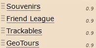 
 
</li>
<li>
New: The VIP, VUP, Mail and Message Icons are now additionally available for the owner on foreign Bookmark lists and on Nearest lists for users found and hidden caches. 
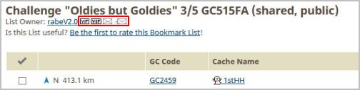 
 
 
</li>
<li>
New: Too in listings with event caches, the GClh image processing is now available. The images are displayed as thumbnails for a preview and if you hover with the mouse over a thumbnail you can see the big one. The corresponding Config settings are already longer available for all the other caches. 
Settings -> Listing: 
 
 
</li>
<li>
New: After a change of a bookmark you can go back to bookmark list automatically. The confirmation page of this change is skip: 
Settings -> Bookmark list: 
 
 
</li>
<li>
New: The Trackables maps are now bigger, you can zoom in and zoom out by mouse wheel and you can change the size of the map via a slider below left with the mouse: [Issue <a href="https://github.com/2Abendsegler/GClh/pull/492">#492</a>] 
Many thanks to <a href="https://www.geocaching.com/profile/?u=Ruko2010">Ruko2010</a> for this great implementation. 
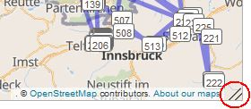 
 
</li>
<li>
New: With a new button in Bookmark lists, you can determine which caches have corrected coordinates. This detail can be helpful by planning of cache tours: [Issue <a href="https://github.com/2Abendsegler/GClh/pull/504">#504</a>] 
Many thanks to <a href="https://www.geocaching.com/profile/?u=Ruko2010">Ruko2010</a> for the idea and the nice implementation. 
 
(<i>Bookmark list in compact layout together with script GC Tour</i>) 
 
</li>
<li>
New: Show Trackable Inventory in new dashboard. (In the old dashboard it is GC standard.): 
 
Settings -> Public Profile / Dashboard - Trackables: 
 
 
</li>
<li>
New: Show all default links for the Linklist in new dashboard: 
 
Settings -> Public Profile / Dashboard: 
 
 
</li>
<li>
New: Compact layout for Recently Viewed Caches list and show GClh Icon "Log it" too on this list: 
 
Settings -> Public Profile / Dashboard: 
 
Settings -> Global: 
 
(<i>This setting is not really new, only the Recently Viewed Caches list is here new.</i>) 
 
</li>
<li>
Fix: The whole Funktionality is tested on Firefox and Chrome with premium and with basic member in english and on Firefox with premium member in german only for the new developments. All bugs are fixed. 
</li>
</ul>
(19.12.2017)  
 

---
## v0.8.11:
<ul>
<li>
New: <b>Process new dashboard page with GClh</b>: [Issue <a href="https://github.com/2Abendsegler/GClh/pull/477">#477</a>] 
GClh header processing with Linklist. 
Build links to GClh Config, GClh Sync and Changelog. 
 
Build hideable VIPs and VUPs lists. 
 
 
</li>
<li>
New: <b>Close GClh Config with key ESC</b>: [Issue <a href="https://github.com/2Abendsegler/GClh/pull/478">#478</a>] 
Settings -> GClh Config / Sync: 
 
 
</li>
<li>
New: <b>Check if GClh runs only once</b>: [Issue <a href="https://github.com/2Abendsegler/GClh/pull/476">#476</a>] 
</li>
 
<li>
Fix: <b>Buttons on search caches page in Manage Filter Sets functionality are not available again, due to changes made by GS</b>: [Issue <a href="https://github.com/2Abendsegler/GClh/pull/481">#481</a>] 
</li>
</ul>
(26.11.2017)  
 

---
## v0.8.10:

<b>FIREFOX USER, PLEASE NOTE:</b>
 
  
* The GClh is no longer executable with script manager Greasemonkey from Firefox version 57. In order to continue using the GClh, it is therefore necessary to switch to the script manager Tampermonkey. 
* We do not support Violentmonkey and other script managers. 
* Tips for installing the script manager Tampermonkey under Firefox and tips for copying the GClh configuration from script manager Greasemonkey to Tampermonkey are available [here](https://github.com/2Abendsegler/GClh/blob/master/docu/tips_installation.md#readme). 

(If you have installed Firefox version 57 in front of copying the GClh configuration from script manager Greasemonkey to Tampermonkey and you want to save the configuration, please let me know via [eMail](https://www.geocaching.com/email/?guid=7bb977ac-bc8d-45d9-ac63-99564937357a).) 
 

<b>REPORT A BUG:</b>
 

* If you find a bug, please let us know about it, so we can fix it. You can open a <a href="https://github.com/2Abendsegler/GClh/issues">new issue</a> or you can report it in the <a href="http://geoclub.de/forum/viewforum.php?f=117">geoclub forum</a>. 
* If you are not ready to report a bug, you do not have to complain about bugs that will not be fixed for a long time. 
 

<b>CHANGES:</b>
 

<ul>
<li>
New: <b>Different colors for menu and dropdown lists</b>: [Issue <a href="https://github.com/2Abendsegler/GClh/pull/460">#460</a>] 
 
Settings -> Linklist / Navigation: 
 
 
</li>
<li>
Fix: <b>Direct jump to profile tabs "Geocaches", "Gallery", "Souvenirs" ... do not work under Tampermonkey</b>: [Issue <a href="https://github.com/2Abendsegler/GClh/pull/463">#463</a>] 
</li>
<li>
Fix: <b>Linklist: Global GS feedback page is not longer available, due to changes made by GS</b>: [Issue <a href="https://github.com/2Abendsegler/GClh/pull/464">#464</a>] 
</li>
<li>
Fix: <b>With deactivated parameter "Change header layout" menu dropdown lists do not stay, due to changes made by GS</b>: [Issue <a href="https://github.com/2Abendsegler/GClh/pull/462">#462</a>] 
</li>
</ul> 
(15.11.2017)  
 

---
## v0.8.9:
<ul>
<li>
New: <b>Make Tampermonkey possible in Firefox</b>: [Issue <a href="https://github.com/2Abendsegler/GClh/pull/451">#451</a>] 
 
<b>FIREFOX USER, BITTE BEACHTEN:</b>
 
  
* Der GClh ist mit Script-Manager Greasemonkey ab Firefox Version 57 nicht mehr lauffähig. Vermutlich werden wir auch keine entsprechenden Anpassungen am GClh vornehmen, die den weiteren Betrieb unter Greasemonkey ermöglichen, obwohl es möglich wäre und Greasemonkey zumindest bisher einen merklichen Performancevorteil brachte. Um den GClh weiter zu nutzen, muß deshalb spätestens mit Firefox Version 57 auf den Script-Manager Tampermonkey umgestellt werden. Die Firefox Version 57 ist wohl für Mitte November geplant. 
* Violentmonkey und andere Script-Manager unterstützen wir nicht. 
* Tipps zur Installation des Script-Managers Tampermonkey unter Firefox und Tipps zum Kopieren der GClh Konfiguration von Script-Manager Greasemonkey nach Tampermonkey gibt es [hier](https://github.com/2Abendsegler/GClh/blob/master/docu/tips_installation.md#readme).
 
</li>
<li>
New: <b>Added Error Output to Dropbox Client Creation (DropBox Error 400)</b>: [Issue <a href="https://github.com/2Abendsegler/GClh/pull/450">#450</a>] 
Many thanks to <a href="https://www.geocaching.com/profile/?u=Ruko2010">Ruko2010</a> for the implementation. 
 
</li>
<li>
Fix: <b>DropBox Authentificate does not work with all of the gc pages (DropBox Error 400)</b>: [Issue <a href="https://github.com/2Abendsegler/GClh/pull/447">#447</a>] 
Many thanks to <a href="https://www.geocaching.com/profile/?u=Ruko2010">Ruko2010</a> for the fix. 
</li>
<li>
Fix: <b>Coloring user (with special characters) in listing does not work</b>: [Issue <a href="https://github.com/2Abendsegler/GClh/pull/444">#444</a>] 
</li>
<li>
Fix: <b>Reset DropBox Token does not work</b>: [Issue <a href="https://github.com/2Abendsegler/GClh/pull/441">#441</a>] 
</li>
<li>
Fix: <b>Without home coordinates driving direction link in Additional Waypoints doesn't work proper</b>: [Issue <a href="https://github.com/2Abendsegler/GClh/pull/322">#322</a>] 
</li>
<li>
Fix: <b>Automatically save HomeCoords does not work</b>: [Issue <a href="https://github.com/2Abendsegler/GClh/pull/438">#438</a>] 
</li>
</ul>
(03.11.2017)  
 

---
## v0.8.8:
<ul>
<li>
Fix: <b>Link to BRouter</b>: [Issue <a href="https://github.com/2Abendsegler/GClh/pull/425">#425</a>] 
</li>
</ul>
(25.10.2017)  
 

---
## v0.8.7:
<ul>
<li>
New: <b>The new DropBox API for synchronizing the configuration data of GClh is implemented.</b> 
(Fix: <b>[EDGE] Tampermonkey - problems (Dropbox)</b>: [Issue <a href="https://github.com/2Abendsegler/GClh/pull/85">#85</a>]) 
(Fix: <b>[FF] cannot save to Dropbox</b>: [Issue <a href="https://github.com/2Abendsegler/GClh/pull/113">#113</a>]) 
 
Many thanks to <a href="https://www.geocaching.com/profile/?u=Ruko2010">Ruko2010</a> for the great implementation. 
 
After installation, the GClh sync (F10 key) can be used to synchronize the GClh configuration data into the own DropBox account. Authentication stores a "token" so authentication must be performed only once. The "token" can be deleted again within the framework of the GClh Config functionality "Reset / Reset dynamic and unused data", so that one can change the DropBox account. 
 
 
 
 
</li>
<li>
New: <b>Link to BRouter</b>: [Issue <a href="https://github.com/2Abendsegler/GClh/pull/425">#425</a>] 
 
Many thanks to <a href="https://www.geocaching.com/profile/?u=RadlerAndi">RadlerAndi</a> for the great implementation. 
 
For example BRouter for the Cache <a href="https://coord.info/GC6128Z">Deutschlandtour Ost-West (GC6128Z)</a>: 
 
A further link is behind the Additional Waypoints. 
 
 
</li>
<li>
New: <b>Build Flopp's Map link too in navi area top right. Provide config parameter for new links in navi area</b>: [Issue <a href="https://github.com/2Abendsegler/GClh/pull/294">#294</a>] 
(Fix: <b>No link to Flopp's Map if there no additional waypoints</b>: [Issue <a href="https://github.com/2Abendsegler/GClh/pull/297">#297</a>]) 
 
Many thanks to <a href="https://www.geocaching.com/profile/?u=Ruko2010">Ruko2010</a> for the great implementation. 
 
 
Settings -> Linklist: 
 
 
</li>
<li>
Fix: <b>New established GS menus on map page deform the dropdowns, the linklist and the search field</b>: [Issue <a href="https://github.com/2Abendsegler/GClh/pull/430">#430</a>] 
</li>
</ul>
(25.10.2017)  
 

---
## v0.8.6:
<ul>
<li>
New: <b>Added Buttons for Show Hide all Cachetypes on the Map</b>: [Issue (Pull request) <a href="https://github.com/2Abendsegler/GClh/pull/408">#408</a>] 
 
Many thanks to <a href="https://www.geocaching.com/profile/?u=Ruko2010">Ruko2010</a> for the implementation. 
 
</li>
<li>
New: <b>Save PQ of routes with Key F2 too.</b> 
 
</li>
<li>
Fix: <b>Linklist is behind Menue in Map Mode, due to changes made by GS</b>: [Issue <a href="https://github.com/2Abendsegler/GClh/issues/405">#405</a>] 
Many thanks to <a href="https://www.geocaching.com/profile/?u=Ruko2010">Ruko2010</a> for the fixing. 
 
</li>
<li>
Fix: <b>Improve saving homecoordinates automatically and manual with different types of minute apostrophes</b>: [Issue <a href="https://github.com/2Abendsegler/GClh/issues/406">#406</a>] 
 
</li>
<li>
Fix: <b>Name and border deformation of images in logs, due to changes made by GS.</b>  
 
</li>
</ul>
(17.09.2017)  
(Advance notice: Dropbox synchronisation is coming again. <a href="https://www.geocaching.com/profile/?u=Ruko2010">Ruko2010</a> is working on it. :) ) 
 

---
## v0.8.5:
<ul>
<li>
Fix: <b>New page header construction, due to changes again made by GS.</b> 
 
</li>
<li>
Fix: <b>#me# in templates does not work & changing templaes does not work</b>: [Issue <a href="https://github.com/2Abendsegler/GClh/issues/399">#399</a>]  
 
</li>
</ul>
(23.08.2017)  
 

---
## v0.8.4:
<ul>
<li>
Fix: <b>New page header construction, due to changes made by GS.</b> 
 
</li>
<li>
Fix: <b>User defined Filter Sets for geocache searchs are no longer running correct, due to changes made by GS.</b>: [Issue <a href="https://github.com/2Abendsegler/GClh/issues/359">#359</a>]  
 
</li>
<li>
Fix: <b>No longer block of content of profile</b>: [Issue <a href="https://github.com/2Abendsegler/GClh/issues/393">#393</a>]  
Many thanks to <a href="https://www.geocaching.com/profile/?u=Jipem">Jipem</a> for the solution. 
 
</li>
<li>
Fix: <b>Show log entries: When page loading was stopped manually about browser, the number of logs and the date of the last log are no longer displayed, due to changes made by GS.</b> 
 
</li>
</ul>
(18.08.2017)  
 

---
## v0.8.3:
<ul>
<li>
Fix: <b>Removing of blue banner don't work due to changes made by GS.</b> 
 
</li>
</ul>
(22.06.2017)  
 

---
## v0.8.2:
<ul>
<li>
New: <b>Compact layout of nearest lists</b>: [Issue <a href="https://github.com/2Abendsegler/GClh/issues/295">#295</a>] 
(<i>The feature is already available since version 0.8 for pocket querries, a special nearest list. At this point, not all of the nearest lists were tested enough, so this is now the delivering of the rest.</i>) 
(<i>The compact layout is showing here together with script GCTour.</i>) 
 
Settings -> Nearest list: 
 
The parameter has to be activated in Config after installation. 
 
</li>
<li>
Fix: <b>Before showing "Add to list" popup in cache listing, scroll up, otherwise the popup could be not completely visible</b>: [Issue <a href="https://github.com/2Abendsegler/GClh/issues/384">#384</a>] 
 
</li>
<li>
Fix: <b>Show log entries: When page loading was stopped manually about browser, the number of logs and the date of the last log are no longer displayed, due to changes made by GS</b>: [Issue <a href="https://github.com/2Abendsegler/GClh/issues/381">#381</a>] 
 
 
</li>
</ul>
(19.06.2017)  
 

---
## v0.8.1:
<ul>
<li>
New: <b>Try to remove all blue banner to the new designed pages:</b> 
Settings -> Global: 
 
The parameter has to be activated. 
 
</li>
<li>
Fix: <b>Page Message Center was declared misleadingly as new designed page, so GClh didn't do anything on this site.</b> 
 
</li>
<li>
Fix: <b>Button "Add Bookmark" not always selectable in compact bookmark list.</b> 
 
</li>
</ul>
(30.05.2017)  
 

---
## v0.8:

### Cache listing:

<ul>
<li>
New: <b>Compact layout in "Add to list" popup to bookmark a cache</b>: [Issue <a href="https://github.com/2Abendsegler/GClh/issues/184">#184</a>] 
 
 <b>>>></b>  
Settings -> Listing: 
 
With this option you can choose the height of the "Add to list" popup to bookmark a cache from 100 up to 520 pixel. The example has 292 pixel and the default is 205 pixel, similar to the standard. 
 
 
</li>
<li>
Tip: <b>Enable old link in cache listing to create bookmark with comment:</b> [Issue <a href="https://github.com/2Abendsegler/GClh/issues/321">#321</a>] 
 
The functionality, to create a bookmark with comment, is already available in gc.com standard. Please select the button "Add to list" in cache listing not with the left mouse key but with the right mouse key and choose "open link in new tab". 
 <b>>>></b>  
 
 
</li>
<li>
New: <b>Show bigger avatar images in cache listing logs while hovering with the mouse:</b> [Issue <a href="https://github.com/2Abendsegler/GClh/issues/349">#349</a>] 
 
After pressing the button "Show bigger avatars" in cache listing above the logs, a big avatar image is shown, if one hover with the mouse over an avatar image. 
 
&nbsp; &nbsp; &nbsp; (<i>But one question remains: What are they doing?</i>) 
Settings -> Listing:  
 
The thumbnails parameter (not new) has to be activated. 
 
 
</li>
<li>
New: <b>File caption missing under maximized image in cache listing:</b> [Issue <a href="https://github.com/2Abendsegler/GClh/issues/326">#326</a>] 
 
Now there are showing not only the image description under the maximized image, but the file caption and the "View Log" button too. 
 
 
 
</li>
</ul>

### Map:

<ul>
<li>
New: <b>Improve relationship between GClh and GME (Geocaching Map Enhancements):</b> [Issue <a href="https://github.com/2Abendsegler/GClh/issues/342">#342</a>] 
 
Positioning GME toolbox: 
 <b>>>></b>  
Show GClh button "Hide/Show Header": 
 <b>>>></b>  
 
 
</li>
<li>
New: <b>Using map layers of GClh in GME (Geocaching Map Enhancements):</b> [Issue <a href="https://github.com/2Abendsegler/GClh/issues/345">#345</a>] 
 
Settings -> Map: 
 
 
GClh now take on the control of all layers, if GClh is to replace the layers. All other layers, for example of GME (Geocaching Map Enhancements), are deactivated. But you can use the other functionality of other scripts, like for example GME, together with GClh at once. With this option you can disable this replacement too, to use the layers from gc or other scripts like GME. This parameter is not new, the importance, however, was expanded. 
 
It is important, that GClh run at first, particularly in front of other layer used scripts like GME or GCVote.  
(If there are problems with the layers by using GCVote at once, you have to clear the local storage of GCVote. You can do it about your profile. If that does not help, deinstall and install GCVote again. GCVote use a local storage for its data. This storage can include incomplete layers which influence the layer control.) 
 
 
</li>
</ul>

### Bookmark list:

<ul>
<li>
New: <b>Compact layout of list of bookmark lists and compact layout of bookmark lists:</b> [Issue <a href="https://github.com/2Abendsegler/GClh/issues/295">#295</a>] 
 
List of bookmark lists: 
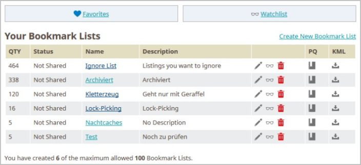 
Bookmark lists: 
 
Settings -> Bookmark list: 
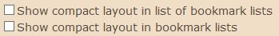 
The parameters have to be activated in Config after installation. 
 
 
</li>
</ul>

### Pocket query:

<ul>
<li>
New: <b>Compact layout of list of pocket queries and compact layout of pocket queries:</b> [Issue <a href="https://github.com/2Abendsegler/GClh/issues/295">#295</a>] 
 
List of active pocket queries: 
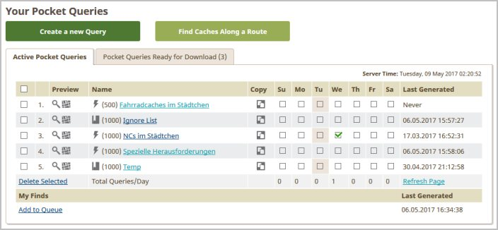 
List of pocket queries ready for download 
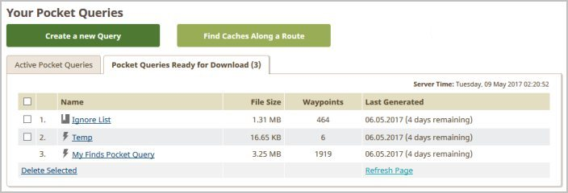 
Pocket queries: This compact layout should be useable from a page width of about 1.000 pixel. 
 
Settings -> Pocket query: 
 
The parameters have to be activated in Config after installation. 
 
 
</li>
</ul>

### Profile:

<ul>
<li>
New: <b>Show links to found caches for every country on statistic maps page:</b> [Issue <a href="https://github.com/2Abendsegler/GClh/issues/363">#363</a>] 
 
Statistic maps page: 
 
List of found caches: 
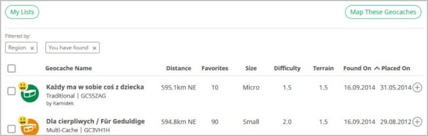 
Settings -> Profile -> Statistic: 
 
 
 
</li>
<li>
New: <b>Change the link "Lists" on "my" pages from new designed page to old-fashioned page:</b> [Issue <a href="https://github.com/2Abendsegler/GClh/issues/339">#339</a>] 
 
New designed page: <code>.../account/lists</code> 
Old-fashioned page: <code>.../my/lists.aspx</code> 
 
Settings -> Profile: 
 
The parameter has to be activated in Config after installation. 
 
 
</li>
<li>
New: <b>New entry "Lists" in Linklist with link to "my lists" old-fashioned.</b> [Issue <a href="https://github.com/2Abendsegler/GClh/issues/339">#339</a>] 
 
Settings -> Linklist: 
 
 
 
</li>
<li>
New: <b>Remove fixed column width in profiles last 30 days logs for fewer linebreaks.</b> [Issue <a href="https://github.com/2Abendsegler/GClh/issues/360">#360</a>] 
 
 
</li>
</ul>

### Others:

<ul>
<li>
New: <b>Hide banner linking "Garmin Express" or new or old "My Lists" page:</b> [Issue <a href="https://github.com/2Abendsegler/GClh/issues/311">#311</a>] 
 
Pages with banner: 
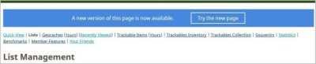 
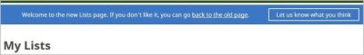 
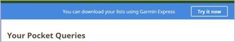 
Settings -> Global: 
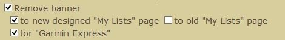 
The parameters have to be activated in Config after installation. 
 
 
</li>
<li>
New: <b>Display images in user, cache and TB image galleries with maximum possible size.</b> [Issue <a href="https://github.com/2Abendsegler/GClh/issues/312">#312</a>] 
 
</li>
<li>
New: <b>Message after successful installation with the possibility to open the changelog in a new tab.</b> [Issue <a href="https://github.com/2Abendsegler/GClh/issues/356">#356</a>] 
 
</li>
<li>
Change: <b>Try to implement another direct way to link KML files to google maps:</b> [Issue <a href="https://github.com/2Abendsegler/GClh/issues/183">#183</a>] 
It is only possible to load KML files to google maps if one is logged in to own google account. The URL of this is specially. There seems to be no direct way to link KML files from gc.com to to the specially google account url.  
The useable way to load KML files to google maps is the download from gc.com and the upload to the own google account. The additional functionality of GClh was removed. 
 
</li>
<li>
Change: <b>Consolidate F2, F4, F10 key functions for better expandability.</b> [Issue <a href="https://github.com/2Abendsegler/GClh/issues/345">#345</a>] 
 
</li>
<li>
Fix: <b>Consideration of special keys ctrl, alt and shift on keyboard input.</b> [Issue <a href="https://github.com/2Abendsegler/GClh/issues/355">#355</a>] 
 
</li>
</ul>
(20.05.2017)  
 

---
## v0.7.2:
<ul>
<li>New: [Issue <a href="https://github.com/2Abendsegler/GClh/issues/332">#332</a>] Logging fieldnotes old-fashioned:  
 
Settings > Logging:  
 
 
This option deactivates the logging of fieldnotes by the new log page (looks like a phone app) and activates logging of fieldnotes by the old-fashioned log page. 
The parameter has to be activated in Config after installation. 
 
</li>
<li>Fix: [Issue <a href="https://github.com/2Abendsegler/GClh/issues/316">#316</a>] Colors for logs in cache listing (and other things) work not proper by using the script of project gc at once.  
 
</li>
</ul>
(25.04.2017)  
 

---
## v0.7.1:
<ul>
<li>
Fix: [Issue <a href="https://github.com/2Abendsegler/GClh/issues/299">#299</a>] GClh enhancements on friends list are not available due to changes made by GS. 
</li>
 
</ul>
(12.04.2017)  
 

---
## v0.7:
<ul>
<li>
New: [Issue <a href="https://github.com/2Abendsegler/GClh/issues/254">#254</a>] Filter VIP logs in cache listing: 
 
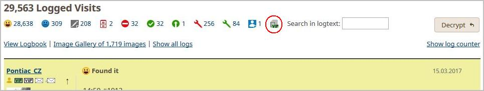 
 </li>
<li>
New: [Issue <a href="https://github.com/2Abendsegler/GClh/issues/268">#268</a>] VIP list: Quick link to VIP logs: 
Navigate down to logs area and invoke the VIP filter. 
 
 
 </li>
<li>
New: [Issue <a href="https://github.com/2Abendsegler/GClh/issues/250">#250</a>] Show elevation for listing coordinates and waypoints with visible coordinates. Metric and imperial is supported. 
Many thanks to <a href="https://www.geocaching.com/profile/?u=CachingFoX">CachingFoX</a> for the idea and the development. 
 
Settings > Listing: 
 
 
Elevation for listing coordinates (metric): 
 
 
Elevation for listing coordinates (imperial): 
 
 
Elevation for additional waypoints: 
 
 </li>
<li>
New: [Issue <a href="https://github.com/2Abendsegler/GClh/issues/10">#10</a>] Show listing coordinates and additional waypoints on Flopp's Map: 
Special thank to <a href="https://www.geocaching.com/profile/?u=SiMaKiDD">SiMaKiDD</a> - the creator of MAP_BUTTONS script - for the inspiration, permission and support.  
Many thanks to <a href="https://www.geocaching.com/profile/?u=CachingFoX">CachingFoX</a> for the implementation. 
 
 
 
Different map styles selectable: 
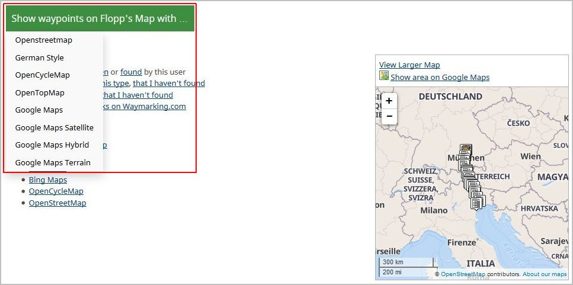 
 
Zoom level is calculate automatically: 
 
 </li>
<li>
New: [Issue <a href="https://github.com/2Abendsegler/GClh/issues/253">#253</a>] Added shortcut links to waypoint list and logs section. 
Many thanks to <a href="https://www.geocaching.com/profile/?u=CachingFoX">CachingFoX</a> for the idea and the development. 
 
 
 </li>
<li>
New: [Issue <a href="https://github.com/2Abendsegler/GClh/issues/252">#252</a>] Link to Google Map Driving Direction for every waypoint in the waypoint list (with visible coordinates): 
Many thanks to <a href="https://www.geocaching.com/profile/?u=CachingFoX">CachingFoX</a> for the idea and the development. 
 
Settings > Listing: 
 
 
Additional waypoint list: 
 
 </li>
<li>
New: Show placeholder for unavailable/unreachable images: Often helpful in working under company firewals and for example with the current changes at dropbox, that images are no longer displayed by default. 
Many thanks to <a href="https://www.geocaching.com/profile/?u=Herr%20Ma">Herr Ma</a> for the idea and the development. 
 
Placeholder image: 
 
 
Settings > Listing: 
 
 </li>
<li>
Change: [Issue <a href="https://github.com/2Abendsegler/GClh/issues/277">#277</a>] Show button "Show log counter" only if feature is possible: 
Do not show button "Show log counter" if the logs are filtered or searched. 
</li>
<li>
Change: [Issue <a href="https://github.com/2Abendsegler/GClh/issues/279">#279</a>] Implement note in Config with using information for log templates: 
Many thanks for the development. 
</li>
<li>
Fix: [Issue <a href="https://github.com/2Abendsegler/GClh/issues/264">#264</a>] VIP list not rendered on a specific cache (Lesopark Dubina). Profile link in listing without any text. 
</li>
<li>
Fix: [Issue <a href="https://github.com/2Abendsegler/GClh/issues/276">#276</a>] Open list with "Pocket Queries ready to download" not possible, only in chrome. 
</li>
 
</ul>
(08.04.2017)  
 

---
## v0.6:
<ul>
<li>
New: [Issue <a href="https://github.com/2Abendsegler/GClh/issues/226">#226</a>] Make the using of browser Vivaldi possible: 
Please notice the special points in <a href="https://github.com/2Abendsegler/GClh/blob/master/docu/tips_installation.md#readme">Tipps für die Installation</a>. 
 
 </li>
<li>
New: [Issue <a href="https://github.com/2Abendsegler/GClh/issues/199">#199</a>] Default settings for new pocket queries:  
Many thanks to <a href="https://www.geocaching.com/profile/?u=CachingFoX">CachingFoX</a> for the idea and the implementation. 
 
 </li>
<li>
New: [Issue <a href="https://github.com/2Abendsegler/GClh/issues/200">#200</a>] Warning for mutually exclusive option in pocket queries: 
Many thanks to <a href="https://www.geocaching.com/profile/?u=CachingFoX">CachingFoX</a> for the idea and the development. 
 
 
 
 </li>
<li>
New: [Issue <a href="https://github.com/2Abendsegler/GClh/issues/230">#230</a>] Auto set approvals in hide cache process:  
Many thanks to <a href="https://www.geocaching.com/profile/?u=king-ton">king-ton</a> for the idea and the development. 
 
New: [Issue <a href="https://github.com/2Abendsegler/GClh/issues/231">#231</a>] Enable save / continue with F2 key in hide cache process:  
This includes the complete hide cache process with all of the buttons "Continue", "Continue Anyway", "Save and Preview", "Submit Changes", "Update Attributes", "Create Waypoint" and "Update Waypoint" of the create and the change functionality. 
 
 
 
 
 </li>
<li>
New: [Issue <a href="https://github.com/2Abendsegler/GClh/issues/226">#226</a>] New Config parameter to open mail/message form in a new window: 
Many thanks to <a href="https://www.geocaching.com/profile/?u=Herr%20Ma">Herr Ma</a> for the development. 
 
 </li>
<li>
Fix: [Issue <a href="https://github.com/2Abendsegler/GClh/issues/224">#224</a>] Trim empty lines from mail/message template after replacing placeholders with empty strings. 
Many thanks to <a href="https://www.geocaching.com/profile/?u=Herr%20Ma">Herr Ma</a> for the fix. 
</li>
<li>
Fix: [Issue <a href="https://github.com/2Abendsegler/GClh/issues/227">#227</a>] Build maps linking on gc.map not always possible (Vorabkorrektur). 
</li>
<li>
Fix: [Issue <a href="https://github.com/2Abendsegler/GClh/issues/225">#225</a>] Own log statistics is generated on other user profile page (id). 
</li>
<li>
Fix: [Issue <a href="https://github.com/2Abendsegler/GClh/issues/239">#239</a>] Log templates show unreadable signs (Vorabkorrektur). 
</li>
<li>
Fix: [Issue <a href="https://github.com/2Abendsegler/GClh/issues/238">#238</a>] Friends page "Last check" stuck (Vorabkorrektur).  
Many thanks to <a href="https://www.geocaching.com/profile/?u=Herr%20Ma">Herr Ma</a> for the fix. 
</li>
 
</ul>
(25.03.2017)  
 

---
## v0.5:
<ul>
<li>New: [Issue <a href="https://github.com/2Abendsegler/GClh/issues/180">#180</a>] Additional geoservices (OSM, Flopp's Map, GeoHack) from GC Map: 
Many thanks to <a href="https://www.geocaching.com/profile/?u=CachingFoX">CachingFoX</a> for the idea and the implementation. 
 
New geoservices in GC Map 
 
 
New geoservices are configurable 
 
 
</li>
<li>New: [Issue <a href="https://github.com/2Abendsegler/GClh/issues/191">#191</a>] Add a link from Openstreetmap.org map to GC Map: 
Many thanks to <a href="https://www.geocaching.com/profile/?u=CachingFoX">CachingFoX</a> for the idea and the development. 
 
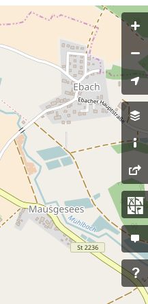 
 
 
 
</li>
<li>New: [Issue <a href="https://github.com/2Abendsegler/GClh/issues/181">#181</a>] Replace img links in cache listing to an img link with the larger image if possible:  
Many thanks to <a href="https://www.geocaching.com/profile/?u=Herr%20Ma">Herr Ma</a> for the development. 
 
 
 </li>
<li>New: Enlarge VUP list with new features: 
Many thanks to <a href="https://www.geocaching.com/profile/?u=Herr%20Ma">Herr Ma</a> for the idea and the development. 
 
 
 
Original Log: 
 
 
Log, if Cacher is on VUP list: 
 
 
Log with new option "Also hide name, avatar and counter from log": 
 
 
With the second new option "Hide complete log", the complete log is hidden. 
 </li>
<li>Fix: [Issue <a href="https://github.com/2Abendsegler/GClh/issues/179">#179</a>] Zebra effect in common lists not always available: Wrong parameter promt in special processing for common lists if user color is not set. </li>
<li>Fix: [Issue <a href="https://github.com/2Abendsegler/GClh/issues/179">#171</a>] No GClh enhancement on friends page </li>
<li>Fix: [Issue <a href="https://github.com/2Abendsegler/GClh/issues/185">#185</a>] Cacher names with brackets will not work in VUP List </li>
<li>Fix: [Issue <a href="https://github.com/2Abendsegler/GClh/issues/203">#203</a>] "Spoiler warning" text shining through in overlapping images </li>
<li>Fix: [Issue <a href="https://github.com/2Abendsegler/GClh/issues/204">#204</a>] Own log statistics is generated on other user profile page </li>
 
</ul>
(11.03.2017)  
 

---
## v0.4.1:
<ul><li>Fix: [Issue <a href="https://github.com/2Abendsegler/GClh/issues/169">#169</a>] Width in cache description is to big. Fix: [Issue <a href="https://github.com/2Abendsegler/GClh/issues/173">#173</a>] listing text "underflows" the right column. </li>
<li>Fix: [Issue <a href="https://github.com/2Abendsegler/GClh/issues/174">#174</a>] Button to GC Maps on Google Maps page was missing. </li>
<li>Change: [Issue <a href="https://github.com/2Abendsegler/GClh/issues/170">#170</a>] If empty "Spoiler Filter", no checking is done. </li>
<li>Change: [Issue <a href="https://github.com/2Abendsegler/GClh/issues/172">#172</a>] Checkbox "show VUP icons on friends list" without checkbox "Process VUPs" is misunderstood. Implement both checkboxes in section profile / friends. </li>
</ul>
(26.02.2017) 
 

---
## v0.4:
<ul><li>New: [Issue <a href="https://github.com/2Abendsegler/GClh/issues/111">#111</a>] New found / hidden in a summary in the beginning of the Friends page: 
Many thanks to <a href="https://www.geocaching.com/profile/?u=Herr%20Ma">Herr Ma</a> for the idea and the development. 
 
Summary for new finds/hides for friends of the friends page will be shown as follow: 
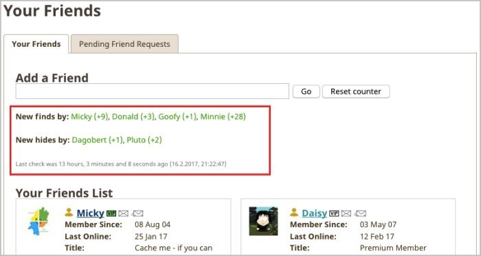 
 
There is also a timestamp with the date/time of the last check. After pushing the Reset counter button or if there are no new finds/hides, the summary is hidden and only the timestamp is visible: 
 
 
To use the new summary feature you have to set the checkbox "Show summary for new finds/hides in friends list". Special feature. If you set the checkbox "Show summary only for friends in VIP list" the summary will be shown only for friends which are marked as VIPs. 
 
 
 </li>
<li>New: [Issue <a href="https://github.com/2Abendsegler/GClh/issues/145">#145</a>] User ignore processing in cache listing logs, VUPs (Very unimportant persons): 
Many thanks to <a href="https://www.geocaching.com/profile/?u=Herr%20Ma">Herr Ma</a> for the idea and a lot of coding. 
 
The VUP processing is integrated in the VIP processing as a second part and have the most of the VIP functionality. The main idea are "censored" cache logs for the VUPs. If you mark a person as a VUP, the cache log text will only contain the text "censored", so you can be relaxed and you have not to be stressed. 
 
 
Cache listing, if cache owner is a VUP. 
 
 
Cache listing, if cache owner is a VUP, it is shown in the VIP list if owner is shown there. 
 
 
Your profile contain a list of all your VUPs. 
 
 
The VUP processing can be activated and customized in Config. 
 
 
 </li>
<li>New: [Issue <a href="https://github.com/2Abendsegler/GClh/issues/34">#34</a>] Manage user defined Filter Sets for geocache searchs: 
Many thanks to <a href="https://www.geocaching.com/profile/?u=CachingFoX">CachingFoX</a> for the idea and the development. 
 
The handling of the Filter Sets for geocache searchs are integrated in the standard geocache search / find "Find a geocache". About "Manage Filter Sets", a geocache search can be saved as a Filter Set. 
 
 
With double click of a Filter Set in the column "Available Filter Sets", you can start the geocache search with this Filter Set. If you have changed the filter of a geocache search, you can update the Filter Set here too. 
 
 
At the geocache search / find page, the current Filter Set will be shown.  
 
 
To activate and deactivate this functionality there is a parameter in Config. 
 
 
 </li>
<li>New: [Issue <a href="https://github.com/2Abendsegler/GClh/issues/9">#9</a>] Provide standard configuration set (GClh Config): 
<ul><li>Reset to standard configuration: This is the main functionality to reset to standard configuration set. This is the way to come back to an efficient configuration set, after some experimental or other motivated changes. This option load a reasonable standard configuration and overwrite your configuration data in parts. Of course, personal data, like home-coords, homezone or similar data are not overwritten. </li>
<li>Reset your own home-coords could help you with problems around your home-coords, like for example with your main homezone, with nearest lists or with your home-coords itself. </li>
<li>Reset your own id for your trackables could help you with problems with your own trackables lists. </li>
<li>Reset dynamic and unused is the possibility to reorganize the configuration set. Unused parameters, of older script versions, are deleted. And all the dynamic data, especially the autovisit settings for every TB, are deleted too. </li></ul>
 
 
 
 </li>
<li>Change: [Issue <a href="https://github.com/2Abendsegler/GClh/issues/138">#138</a>] Enlarge mail form signature to mail form template with known placeholder: 
<ul><li>Enlarge the mail and message form signature functionality to a mail and message form template with the known placeholder in the log templates. Especially integrate GC, TB name and GC, TB Link, in order that these things can be placed variable. For example above in the mail as subject. </li>
<li>The signature content is migrated automatically. </li>
<li>The settings "Show coord link in mail" and "Show coord link in message" are no longer necessary and are removed.  </li></ul>
 
 
 
 </li>
<li>New: [Issue <a href="https://github.com/2Abendsegler/GClh/issues/11">#11</a>] Seitenheader ausrichten / Arrange header layout on content: 
<ul><li>With this option you can arrange the header width on the width of the content of the page. This is an easy feature with some restrictions, like for example the available place, especially for horizontal navigation menues. </li>
<li>The fixed header is available at all pages in the older design like for example cache and TB listings, bookmarks, pocket queries, profiles, statistics, watchlists and field notes, to name just a few. </li>
<li>At maps and at the pages in the newer design it is not available, partly because the content of the pages are not yet in an accurate width, like the newer search cache page or the message center page. Also this feature is not fully integrated in the diverse possibilities of the header layout and the navigation menus. </li></ul>
(We hope the friends of this specific header design can deal with it.) 
 
 
 
 
 
 
 </li>
<li>New: [Issue <a href="https://github.com/2Abendsegler/GClh/issues/12">#12</a>] Logo und Message Center Icon wahlweise entfernen / Remove logo and message center in header: 
<ul><li>Remove logo in header: 
With this option you can remove the logo in the header. This is an easy feature with some restrictions. 
This feature is available at all pages in the older design like for example cache and TB listings, bookmarks, pocket queries, nearest lists, profiles, statistics, watchlists and field notes, to name just a few. 
At maps and at the pages in the newer design it is not available. Also this feature is not fully integrated in the diverse possibilities of the header layout and the navigation menus. </li>
<li>Remove message center in header: 
With this option you can remove the complete message center in the header. 
You will not be informed longer about new messages. </li></ul>
 
 
 
<a href="https://raw.githubusercontent.com/2Abendsegler/GClh/master/data/config_header_align_logo_mc_remove.txt ">Here</a> is a small config file with the necessary changes to arrange the header and remove the logo and the message center icon and text. You can copy the lines and insert and import it with GClh Sync II. 
 
 </li>
<li>New: [Issue <a href="https://github.com/2Abendsegler/GClh/issues/146">#146</a>] Show Cache log counter in cache listing: 
With the link "Show log counter" two counter are shown in every log. The first one is a counter only for logs with the same logtyp like for example "Found it" or "Enable Listing". The second one is the counter for all logs. 
(Only possible if all logs are shown.) 
 
 
 </li>
<li>New: Show or hide all the areas in Config with one click to a plus or minus icon with the right mouse. 
 </li>
<li>Fix: [Issue <a href="https://github.com/2Abendsegler/GClh/issues/139">#139</a>] Missing new founds and hiddens in friends list: 
In some cases, starting count of founds and hiddens are not saved. 
 </li>
<li>Fix: [Issue <a href="https://github.com/2Abendsegler/GClh/issues/147">#147</a>] Width in section "Profile Information" of public profile was cut. 
</li>
</ul>
 
(25.02.2017) 
 

---
## v0.3:
<ul>
<li>New: [Issue <a href="https://github.com/2Abendsegler/GClh/issues/23">#23</a>] Hide archived caches in owned cache list: 
Vielen Dank an <a href="https://www.geocaching.com/profile/?u=dontp%C3%A4nic">dontpänic</a> für die Entwicklung. 
 
 </li>
<li>New: [Issue <a href="https://github.com/2Abendsegler/GClh/issues/92">#92</a>] Added date format dd.MM.yyyy: 
Hier ist zu beachten, dass das Datums Format an zwei Stellen eingestellt werden muß. Das <a href="https://goo.gl/9Hgxnk">Event Date Format im GClh Config</a> und das <a href="https://www.geocaching.com/account/settings/preferences#SelectedDateFormat">Date Format in den Account settings</a>. 
Code comes from old <a href="https://github.com/amshove/GC_little_helper/pull/154">pull request 154</a> of the GClh original from petr-hendl. 
Vielen Dank an petr-hendl für das Coding. 
 
 
 </li>
<li>New: [Issue <a href="https://github.com/2Abendsegler/GClh/issues/93">#93</a>] Aufruf GClh Sync per Taste F10 ermöglichen: 
In Tampermonkey gibt es kein eigenes Tampermonkey Menü, nicht so wie in Greasemonkey. Man kann dort also den GClh Sync nur aus dem Profile und gegebenenfalls aus der Linklist aufrufen. Mit dieser Anpassung kann der GClh Sync von überall aufgerufen werden, so wie es beim GClh Config mit der Taste F4 bereits der Fall ist. 
Und für Config und Sync neben Avatar im Profile, als Title Version einblenden. 
 
 </li>
<li>New: [Issue <a href="https://github.com/2Abendsegler/GClh/issues/94">#94</a>] Profile Foto in Originalgröße einbinden in mausaktivierte Bilder: 
Ist die Funktionalität "Show thumbnails of images" aktiviert, dann wird das Profile Foto in Originalgröße angezeigt, wenn man mit der Maus über das kleine Profile Foto fährt. 
(Die Idee stammt noch aus Zeiten des GClh Originals. Die Funktionalität gab es früher auch mal im Standard.) 
 
 </li>
<li>New: [Issue <a href="https://github.com/2Abendsegler/GClh/issues/20">#20</a>] Eigene Logs zu Caches und Trackables nach Logtypen aufsummieren und auf der Statistikseite anzeigen: 
 
 
 </li>
<li>New/Change: [Issue <a href="https://github.com/2Abendsegler/GClh/issues/100">#100</a>] Links in Linklist und Fehlermeldungen zu Nearest List, Own Trackables überarbeitet: 
- Text in der Meldung wegen Fehlender Homekoordinaten oder fehlender uid für die Own Trackables umformuliert. 
- Neuen Link für Linklist eingebaut direkt zum "Forum Geoclub" und Link "Forum" in "Forum Groundspeak" umbenannt. 
- Links zu den Nearest Lists und den Own Trackables auch im GClh Config schon prüfen und gegebenenfalls individuell für den User setzen, so dass von dort aus keine unnötigen Fehlermeldungen erzeugt werden. 
 </li>
<li>New/Change: [Issue <a href="https://github.com/2Abendsegler/GClh/issues/100">#100</a>] Dokumentation Linklist im GClh Config überarbeitet: 
Scheinbar macht die Einrichtung der Linklist einigenorts Probleme, sowohl im Bereich der Standard Links wie auch insbesondere bei den Custom Links. Die Beschreibung zu den einzelnen Spalten der Linklist über die Fragezeichen "?" und die Beschreibung zu den einzelnen Feldern per Tooltip wenn man mit der Maus drübersteht, wurde komplett überarbeitet und erweitert.  
(Ich hoffe das trägt zu einem besseren Verständnis bei. Es wäre schade, wenn die Linklist nur eingeschränkt genutzt werden kann, weil man die Bedienung und die Einrichtung nicht versteht.) 
Beispiel: 
 
 </li>
<li>Change: [Issue <a href="https://github.com/2Abendsegler/GClh/issues/107">#107</a>] Beim Editieren von TB Logs F2 speichern ermöglicht. 
 </li>
<li>Change: [Issue <a href="https://github.com/2Abendsegler/GClh/issues/65">#65</a>] Spoiler Filter bei den Thumbnails aktivieren und reparieren: 
Der Filter funktioniert nun für das Cache Listing und für die Cache Gallery, nicht aber für die Bilder in den Cache Logs. 
 
 
 </li>
<li>New: [Issue <a href="https://github.com/2Abendsegler/GClh/issues/7">#7</a>] Platzhalter in Log Templates und Log Signaturen ergänzt und Dokumentation überarbeitet: 
#GCTBName# : GC or TB name 
#GCTBLink# : GC or TB link 
#GCTBNameLink# : GC or TB name as a link 
#LogDate# : Content of field "Date Logged" 
Upper and lower case is not required in the placeholder name. 
 </li>
<li>New: [Issue <a href="https://github.com/2Abendsegler/GClh/issues/15">#15</a> (not closed)] Profile Trackables pimpen: 
Hiermit werden lediglich die Ladezeiten reduziert, sofern auf die Trackable Icons verzichtet werden kann. Damit wird das eigentliche Problem umgangen, dass man die Summen im Footer nicht gut ansehen kann, weil die Icons noch ziemlich lange nachgeladen werden, und die Anzeige zuckelt. 
Danke auch an SiMaKiDD für die Idee das Laden zu stoppen. 
 
<i>(Das Vorhaben, die Trackables im Profile in weitere Kategorien zu untergliedern und die Einzelsätze per Icon ein- und aufzublenden (Issue <a href="https://github.com/2Abendsegler/GClh/issues/15">#15</a>), ist zur Zeit auf Eis gelegt. Es ist bisher nicht gelungen sinnvolle Kategorien zu bilden, weil die Systematic bei der Benennung der Trackable Serien sich noch nicht offenbart hat oder es über große Flächen eben keine gibt. Die Verwendung der Trackable Serien alleine macht nur begrenzt Sinn, weil die Serien häufig zu klein sind, was nicht nur die Darstellung aufblähen würde, sondern auch der Performance schadet.  
Wenn jemand Ideen hat, wie man die Trackables womöglich sinnvoll kategorisieren kann, dann nur her damit.)</i> 
</li>
</ul>
(05.02.2017) 
 

---
## v0.2.3.1:
<ul>
<li>Fix: [Issue #79] Script wurde doppelt installiert wegen Änderung Namespace.
 </li>
</ul>
(22.01.2017) 
 

---
## v0.2.3:
<ul>
<li>New: [Issue #36] Google Chrome, Opera und Microsoft Edge über Tampermonkey. 
Vielen Dank an <a href="https://www.geocaching.com/profile/?u=Nicole1338">Nicole1338</a> für die tolle Unterstützung. 
 
 
 
Vielen Dank auch an pstorch für das Angebot hier zu unterstützen. </li>
<li>New: [Issue #35] GClh Config: Make main areas in GClh Config hideable. 
Und im GClh Config Links zu Lizense, Gewährleistung und Check for upgrade hinzugefügt. 
Und Copyright Informationen vervollständigt. 
</li>
<li>Refactoring: [Issue #39] is_link function. 
Vielen Dank an <a href="https://www.geocaching.com/profile/?u=CachingFoX">CachingFoX</a>. </li>
<li>Performance: [Issue #42] Umbau Try/Catch. </li>
<li>Performance: [Issue #48] Umbau function getElementsByClass. 
Umbau function getElementsByClass in standard document.getElementsByClassName. </li>
<li>Performance: [Issue #49] Umbau function setLinesColorInCacheListing. 
In function setLinesColorInCacheListing jedes Log nur einmalig einfärben. 
Und Hide Personal Cache Notes wenn leer, beschleunigt. </li>
<li>Fix: [Issue #32] Cache title of an active cache shown striked. Changed for archieved and for deactivated caches. 
Vielen Dank an <a href="https://www.geocaching.com/profile/?u=CachingFoX">CachingFoX</a> für die Analyse. </li>
<li>Fix: [Issue #29] Push block of layers right, build unsorted layers in map. </li>
</ul>
(22.01.2017) 
 

---
## v0.2.2.4:
<ul>
<li>Fix: [Issue 60] Nearest List parameter generated error. Parameter changed from "&disable_redirect" to "&disable_redirect=" </li>
</ul>
(20.01.2017) 
 

---
## v0.2.2.3:
<ul>
<li>Fix: [Issue 54] (Again) Navigationsmenüs nicht sichtbar auf den Seiten "Find a Geocache", "Hide a Geocache" und "Geotours". Ursache: GS Änderung, Umbenennung der Menüs von "Menu" in "menu" und "SubMenu" in "submenu". </li>
</ul>
(20.01.2017) 
 

---
## v0.2.2.2:
<ul>
<li>Fix: [Issue 54] Navigationsmenüs nicht sichtbar auf den Seiten "Find a Geocache", "Hide a Geocache" und "Geotours". Ursache: GS Änderung, Umbenennung der Menüs von "Menu" in "menu" und "SubMenu" in "submenu". </li>
</ul>
(20.01.2017) 
 

---
## v0.2.2.1:
<ul>
<li>Change: [Enhancement #14] Hervorhebung geänderter Koordinaten flexibler gestalten. 
Danke an LittleJohn für die Vorarbeit. 
Das Aussehen der durch den Benutzer geänderten Koordinaten kann nun flexibler angepaßt werden. Das bekannte Aussehen aus dem GClh Original entspricht in etwa folgender Einstellung: 
</li>
<li>New: [Enhancement #30] Make colored illustration of versions in config selectable. 
Der teils doch etwas fleckig geratene Hintergrund im GClh Config mit den Informationen zu welcher Version ein Parameter implementiert wurde, kann nun abgewählt werden. 
</li>
<li>Fix: [Bug #31] When using "Log your visit (inline)" and clicking "All visited" for the trackables list opens an empty new tab. </li>
</ul>
(12.01.2017) 
 

---
## v0.2.2:
<ul><li>Der Bereich Map im GClh Config wurde komplett umgebaut und an die letzten Änderungen von GS angepaßt. Es gibt die neue Untergruppierung "Hide Map Elements", in der nun alle Hide Operationen zusammengefaßt sind. Die neuen Icons sind nun auch hier verfügbar und die beiden entfallenen A.P.E. und GPS Maze wurden auch hier entfernt. Außerdem wurde die Letterbox umgruppiert. Ist nun so wie auf der Karte.  Vielen Dank an <a href="https://www.geocaching.com/profile/?u=CachingFoX">CachingFoX</a>.  [Bug Issue #18, #19]  

<dl class="file"><dt class="attach-image"></dt></dl>
</li>
<li>Im Bereich Map im GClh Config gibt es noch eine neue Gruppierung "Layers in map", die die gesamten Aufgaben der Kartenlayer abdeckt. Sollen die Layer nicht vom GClh geladen werden, wird der gesamte Bereich ausgeblendet. In der linken Liste sind die nicht verwendeten Layer, in der rechten die zu verwendenden Layer.  Und es wurde auch der standard Layer "Geocaching" von GS integriert! Vielen Dank an <a href="https://www.geocaching.com/profile/?u=CachingFoX">CachingFoX</a>.  [Enhancement Issue #16, #17]  

<dl class="file"><dt class="attach-image"></dt></dl>
</li>
<li>Im GClh Config wurde eine default Sprache vorgesehen. Ist sie aktiviert, wird auf den GC Seiten die Sprache geprüft, entspricht sie nicht der default Sprache, wird sie geändert. Hier geht es im wesentlichen um die automatische Korrektur der Englischumstellungen, die einige Apps benötigen, um korrekt zu laufen. Das betrifft dann insbesondere diejenigen User, die auf den GC Seiten auf Deutsch unterwegs sind. (Soweit ich mich erinnere, stammt dieser Wunsch noch aus dem Block von Torsten.)   [Enhancement Issue #21] 

<dl class="file"><dt class="attach-image"></dt></dl>
</li></ul>
<ul><li>In den Latest logs wurde der Logtext integriert beim Drüberfahren mit der Maus.  [Enhancement Issue #22]  

<dl class="file"><dt class="attach-image"></dt></dl>
</li>
<li>Im GClh Config wurden die Verbindungen zwischen Checkboxen und Texten hergestellt. Nun muß man nicht mehr genau auf die Checkbox zielen, sondern kann die Checkbox auch durch einen Click auf den Text bedienen.  Vielen Dank an <a href="https://www.geocaching.com/profile/?u=CachingFoX">CachingFoX</a>. 

<dl class="file"><dt class="attach-image"></dt></dl>
</li>
<li>Fix: Overview map in listing: zoom in/out loses cache marker. If you zoom in/out the overview map in a cache listing, the cache marker gets replaced by a default marker and the static image shows an error therefore the proper marker creation fails.  [Bug Issue #2]   </li>
<li>Fix: Linklist/Seachfield fälschlich in Map/Labs aufgebaut.  [Bug Issue #24]</li></ul>
(09.01.2017) 
 

---
## v0.2.1:
<ul><li>New: Downloadzaehler simulieren.</li>
<li>New: Cache Listing: Latest Logs Symbole im Kopf des Listings anzeigen. Ueber GClh Config steuern. 

<dl class="file"><dt class="attach-image"></dt></dl>
</li>
<li>New: GClh Config: GClh Sync als neue Bookmark zum Aufruf aus Linklist eingerichtet.</li>
<li>Change: GClh Config: Links im Kopf vom GClh Config ueberarbeitet.</li>
<li>New: Logs anzeigen: Wenn nicht alle eigenen Logs geladen werden, weil beispielsweise das Laden der Seite ueber den Browser gestoppt wurde, dann angeben wieviele Logs geladen wurden und das Datum des letzten geladenen Logs angeben, Cache und Trackables. (Wird das Laden der Seite ueber den Browser gestoppt, funktioniert nicht mehr alles auf der Seite, so z.B. die Linklist.) (Anschliessend kann man dann beispielsweise auch GC Vote für eine begrenzte Anzahl an Caches nachladen.) 

<dl class="file"><dt class="attach-image"></dt></dl>
</li>
<li>New: Cache Listing: Make VIP lists hideable. Ueber GClh Config steuern. 

<dl class="file"><dt class="attach-image"></dt></dl>
</li></ul>
(05.01.2017) 
 

---
## v0.1:
Rebuild GC little helper (2As) as GC little helper II:
<ol style="list-style-type: decimal"><li>Fix: Bei Eigenen Favoriten kein VIP Icon aufbauen. Hier steht gegebenenfalls das Pseudonym des Owners.</li><li>Fix: Save HomeCoords von Account Settings Seite funktionierte nicht mehr.</li><li>Fix: Select Buttons in einer Bookmarkliste aufbauen, aber nicht bei der Ablistung aller Bookmarklisten.</li><li>Fix: In Bookmarkliste nach dem Loeschen von Eintraegen (...bookmarks/bulk.aspx...) fehlt Zebra.</li><li>Fix: Farbliche Logkennzeichnung fuer User mit Sonderzeichen [] korrigiert.</li><li>Change: Spezielle Links Profile Tabs, Nearest Lists/Map, Own Trackables, GClh Config, GClh Sync und Find Player mit rechter und linker Maustaste funktionsfaehig machen mit Standard Contextmenue und postback.</li><li>Change: Config und Sync Aufrufe zusammengelegt und umgebaut. Rechte, linke Maus ueberall ok.</li><li>Change: Link zu alter deutscher Anleitung entfernt und Link github angepasst.</li></ol>
(05.01.2017) 
 

---
## v11.6.7 -&gt; v11.6.8 Fix:
<ol style="list-style-type: decimal"><li>MapQuest slippy map no longer available - remove both MapQuest layers  - use OpenStreetMap Mapnik as default map</li></ol>
 

---
## v11.6.6 -&gt; v11.6.7 Fix:
<ol style="list-style-type: decimal"><li>Neue Nachrichten des Message Centers wurden nicht mehr oder nicht mehr richtig angezeigt. (Sorry, mein Fehler.) Auf einigen Seiten, wie beispielsweise im öffentlichen Profil, verursacht das Message Center immer wieder mal Fehler. In diesen Fällen wird kein Zähler dagestellt. Das hängt aber nicht am GClh. </li></ol>
 

---
## v11.6.5 -&gt; v11.6.6 Fix:
<ol style="list-style-type: decimal"><li>Anzahl auszugebender Logs wurde fälschlicherweise um 1 reduziert.  Danke an Die Batzen: Ich hatte mich schon einige an diesem Problem versucht, kam aber nicht weiter. Das Beispiel war nun super, warum nicht mal im Kleinen versuchen.  Danke an RoRo: Das gemeldete Problem sollte damit auch behoben sein ..., hoffe ich.  </li><li>Beschreibung des Parameters "Show x logs" (settings_show_all_logs_count) ist nicht ganz korrekt, weil alle gelesenen Logs auch angezeigt werden, der Parameter ist also ein Minimalwert. Beschreibung im GClh Config angepaßt: Show at least x logs.  </li></ol>
 

---
## v11.6.4 -&gt; v11.6.5 Fix:
<ol style="list-style-type: decimal"><li>"Logged in Panel" mit Avatar ... auf "My Profile" Seite wurde durch GS geändert. (Danke CachingFox.) Eigentlich dachte ich, dass GS vor Seitenänderungen informiert, gestern Abend ging das nämlich noch. Oder haben die informiert?</li><li>Hillshadow funktionierte nicht, Adresse hat sich geändert. (Danke CachingFox.)   </li></ol>
 

---
## v11.6.3 -&gt; v11.6.4:
<ol style="list-style-type: decimal"><li><strong>New:</strong> "Find Player" für die Seiten im neuen Design ermöglicht.</li><li><strong>Fix:</strong> Updates stündlich checken.</li></ol>
 

---
## v11.6.2 -&gt; v11.6.3 Fix:
<ol style="list-style-type: decimal"><li>Beim Hovern über die mausaktivierten Bilder das Zucken im Hintergrund des Bildes im unteren Teil abgestellt.</li><li>$$023 Teilrückbau: Das Hovern über die mausaktivierten Bilder funktionierte im Cache Listing Bereich nicht.</li></ol>
 

---
## v11.6.1 -&gt; v11.6.2 Fix:
<ol style="list-style-type: decimal"><li>Die Namen von GClh Sync und GClh Config im Profil und die Bookmark GClh Config sind verwirrend wenn man mit GClh (2AS) arbeitet, sie sollten dem Scriptnamen entsprechen.</li><li>$$023 Teilrückbau: Image Gallerien: Gallerybreite auf Fenstergröße einstellen (vereinfacht mausaktivierten Bildwechsel).  Unterbindet im Profil das Verschieben nach links.</li><li>Orientierung der mausaktivierten Bilder angepaßt.  (Best practice in image galleries: Let the thumbnails as much as possible at the top or at the bottom of your screen. It should be better to hover with your mouse from the right side of your screen to the left side as inverse.)</li></ol>
 

---
## Rebuild GC little helper as GC little helper (2As), Version 11.6.1:

<strong>Fehlerbehebung (Fix), Änderungen (Change) und neue Funktionalität (New)</strong>  <strong>Global:</strong>       <strong>Fix:</strong> <ul><li>Avatar: Behandlung Checkbox zum Avatar in Settings, Preferences repariert.</li><li>Neue Seiten: Insbesondere "Message Center", "Find Cache", "Hide Cache", "GeoTours", "Labs" und auch "Account Settings" voll integriert.</li><li>Neue Seiten: Bei "Find Cache", "Hide Cache" und "GeoTours" wurde die Linklist ohne Event aufgebaut. </li><li>Neue Seiten: Remove advertisement instructions auch im Messagecenter durchführen. </li><li>Social Sharing: Hide (Facebook/Twitter) überall.  </li></ul><strong>Change:</strong> <ul><li>Mail, Message und VIP Icons: Auf weiteren Seiten etabliert. Steuerung über GClh Config.</li></ul><strong>New:</strong> <ul><li>VIP: Icon zusätzlich aufbauen: Im TB Listing für Owner und in den TB Logs. Bei Post, Edit, View Cache-Logs und TB-Logs. Bei Mail schreiben. Bei TB Inventar. Bei eigenen Favoriten.  </li><li>Warnmeldung: Wenn Warnmeldung über Down Time ... vorhanden ist, prüfen, ob sie identisch ist mit der bereits gesicherten, gegebenenfalls verbergen bzw. Button erzeugen zum Verbergen. Steuerung über GClh Config.</li></ul> <strong>Seitenheader, Navigations Menü:</strong>  <strong>Fix:</strong> <ul><li>Ausgabebreite: Variable Ausgabebreite im Header korrigiert und auf allen Seiten gesetzt. Den eigentlichen Contentbereich auf der Seite vergrößert. So beispielsweise den Platz für den Logtext im Listing verbreitert.</li><li>Find Player Link in Linklist: Verursachte fehlerhaftes Layout. So funktionierten beispielsweise die Menüs nicht mehr und das Layout im Header war verschoben. </li><li>GC Standard Menus: Ausblenden auch im neuen Seiten Design. </li><li>GClh Config Link in Linklist: Im neuen Seiten Design weglassen. GClh Config wird dort nicht richtig dargestellt.</li><li>GClh Config Link in Linklist: Aufruf aus Linklist repariert.</li><li>Linklist: Rechte Maustaste funktionierte nicht bei den speziellen Links aus Linkliste, gilt für Linklist on Top und im Profile. Repariert über direkten Link mit new Tab. Contextmenu wird nicht mehr angezeigt.</li><li>Message Center: Icon oben rechts wieder auswählbar gemacht.</li><li>Message Center: Verursacht immer mal wieder Fehler. Beseitigt, vermutlich.</li><li>Search Field: Repariert.</li></ul><strong>New:</strong> <ul><li>GC Tour: Platz für GC Tour Icon lassen. Steuerung über GClh Config.</li><li>Logo: Verkleinert. Steuerung über GClh Config.</li><li>Message Center, User Bereich rechts oben: Verkleinert. Steuerung über GClh Config.</li><li>Navigations Menü: Schriftgröße, Schriftfarbe, Abstände der Menü Punkte im vertikalen und horizontalen Menü und bis zu 3 Zeilen im horizontalen Menü mit und ohne Separator, frei wählbar über GClh Config steuerbar. </li></ul> <strong>Map:</strong>  <strong>Fix:</strong> <ul><li>Cache Types ausblenden: Auf der Karte werden die gewünschten Cache Types ausgeblendet, die Icons zum Cache Type wurden aber nicht gesetzt. </li><li>Cache Types: Die Reihenmarkierungen zu den Cache Types setzen.  </li><li>GC Map - Google Maps: Button zu GC Map in Google Maps platziert.</li><li>GC Map: Button "Find My Location" und Entfernungsangaben auf der Karte wurden beim ersten Verstecken der Sidebar nicht berücksichtigt, auch im Standard nicht.</li><li>GC Map: Warnmeldung wenn Leaflet-Map nicht aktiv ist, repariert.</li><li>GC Map: Fehler bei "Hide Map Header" repariert, wenn Auswahl zu "Set Map Preferences" angezeigt wurde.</li><li>Hide/Show Header: In der Sidebar der Karten komplett anzeigen und auch nicht mehr überblenden. Und rechts orientieren wegen möglichem GC Tour Icon.</li><li>Homezone: Auch die Multi Homezonen dürfen nicht angezeigt werden, wenn der Parameter "Show Homezone" deaktiviert ist.</li><li>Homezone: Die Homezone Circles werden manchmal zu früh aufgebaut, dann blinken sie kurz auf und sind dann auch schon wieder verschwunden. Das passiert insbesondere beim Kartenaufruf ohne Koordinaten, also beispielsweise aus dem Menü Play.</li><li>Kartenfilter: Bei externen Filtern (beispielsweise aus play/search) nichts verändern. Änderungen führten dazu, dass auf der Karte alle Caches und nicht die gemäß externem Filter in der Karte angezeigt wurden.</li><li>Layer: Konnten im Zusammenhang mit dem Einsatz von GC Vote nicht immer ausgetauscht werden, weil GC Vote ebenfalls mit den Layer Classen arbeitet.</li><li>Layerliste: In den Karten verbreitert, damit sie nicht zu schmal wird, wenn noch ein GC Vote Icon dort sitzt. </li></ul><strong>New:</strong> <ul><li>Google Maps - GC Map: Button zu Google Maps in GC Map platziert und Wechsel über neuen Browser Tab oder gleichen Tab ermöglicht. Steuerung über GClh Config. </li><li>Google Maps: Linke Sidebar in Google Maps ausblenden. Steuerung über GClh Config.</li><li>Linklist: Auch im Karten Header aufbauen.</li></ul> <strong>Listing:</strong>  <strong>Fix:</strong> <ul><li>Disclaimer Hide: Bei Mega, Giga Events wurde 'Related Web Page' als Disclaimer ausgeblendet und Disclaimer blieb stehen. </li><li>Favoritenbox: Box wurde mit Update vom 29.06.2016 geändert.</li><li>Image, Logs: Mausaktivierte Bilder deaktiviert, wenn die Logs nicht vom GClh geladen werden, weil das dann nicht korrekt funktioniert. Unterstrichene Bildnamen behoben.</li><li>Image, Spoiler-Filter: Der Filter funktioniert nicht, Funktionalität deaktiviert.</li><li>Logs: VIP Icons wieder setzen. </li><li>Logs: "Edit Log / Images" und "Upload Image" wieder setzen. </li><li>Logs: Anzahl Load Logs repariert.</li><li>Post log from PMO-Listing as Basic Member (inline): Notdürftig repariert.</li><li>Show Eventday beside Date: Giga Event integriert.</li><li>TB, Logs: Farbliche Hervorhebung von Owner und User und Zebra in den Logs korrigiert.</li><li>TB, Logs: Verarbeitung von Platzhaltern in TB Logs repariert.</li><li>VIP Listen: Ohne Einträge aufbauen, wenn die Logs nicht vom GClh geladen werden.</li></ul><strong>Change:</strong> <ul><li>Decrypt hints: Gepimpt.</li><li>Favoritenbox: Kompletter Umbau, schneller gemacht und Dropdown verbessert.</li><li>Hide hints behind a link: Gepimpt.</li><li>Hide/Show Cache Note: Gepimpt.</li><li>Highlight changed coordinates: Gepimpt.</li><li>Logs: Log-Template und Load Logs überarbeitet. Standard Aufbereitung der Logtexte etabliert. Logtext etwas gestrafft. Aufbereitung zum User des Logs gestrafft, eine Zeile für den Namen, eine Zeile für die Icons. </li><li>Post log from Listing (inline)": Gepimpt.</li></ul><strong>New:</strong> <ul><li>Ignore: Link Bezeichnung für bereits ignorierte Caches ändern in 'Stop Ignoring'. Steuerung über GClh Config.</li><li>Image, TB: Mausaktivierte Bilder eingebaut.</li><li>Logs: Farbliche Hervorhebung in TB und Cache Logs von User, Owner, VIP, Zebra Effekt und Steuerung über GClh Config.</li><li>Mail Icons bei Usern in "VIP-List": Eingebaut. Steuerung über GClh Config.</li><li>Message Icon: Hinter Mail Icon aufbauen. Steuerung über GClh Config. </li><li>Überblicks Karte: Von Cache Lokation oben rechts im Cache Listing eingebaut. (Gabs mal im Standard.)</li></ul> <strong>Profil:</strong>  <strong>Fix:</strong> <ul><li>Trackables: Wenn User keine eigenen Trackables, dann Fehler im Profile Trackables.</li></ul><strong>New:</strong> <ul><li>All my VIPs Liste: Mail Icons zu Usern in Liste aufbauen. Steuerung über GClh Config.</li><li>All my VIPs Liste: Block auch klappbar machen.</li><li>Linklist: Block auch klappbar machen. </li><li>Statistik: Auswertung zur Matrix auf der Statistik Seite und im Profile erweitert: Anzahl komplette Matrixes. Farbliche Hervorhebung für die nächsten x möglichen Matrixes. Links zur Suche nach entsprechenden Caches mit einem Radius von x km in Karte oder Liste. Steuerung über GClh Config. </li></ul> <strong>Logging:</strong>  <strong>Fix:</strong> <ul><li>Show Datepicker beside Date on Log-Page: Funktioniert nicht mehr und ist auch nicht mehr notwendig, entfernt.</li></ul><strong>Change:</strong> <ul><li>BBCode: Entfernt.</li></ul> <strong>Bookmarklisten, Watchliste, Pocket Queries, Fieldnotes und andere Listen:</strong>  <strong>Fix:</strong> <ul><li>Falsche Markierung: Der Einträge in Bookmarklisten durch zwischenzeitliche Änderungen repariert.</li><li>F2 Save: Speichern mit F2 Taste bei "Create a Bookmark", "Edit a Bookmark" und "Bookmark Pocket Query" repariert und Button Bezeichnung um F2 ergänzt.</li><li>GClh Config: Auf der Fieldnotes Seite läßt sich der GClh Config nicht aufbauen. Das hängt mit Namen der function checkbox zusammen. Nach Änderung in checkboxy gab es keine Probleme mehr.</li><li>KML: Die Anzeige von KML Dateien in Google Maps funktioniert so nicht mehr. Links entfernt.</li></ul><strong>New:</strong> <ul><li>Anzahl der Caches und Anzahl der selektierten Caches: In Bookmarklisten und Watchliste in den Kategorien All, Found, Archived und Deactivated, entsprechend der Selektions Buttons, anzeigen. Steuerung über GClh Config.</li><li>Listen: Zebra Look und Found Einfärbung über GClh Config.  </li><li>Loggen: über Standard "Log It" Icons zu Premium Only Caches für Basic Members ermöglicht.</li></ul> <strong>Image Gallery:</strong>  <strong>Fix:</strong> <ul><li>Cache und Profil: Mausaktivierte Bilder repariert. </li></ul><strong>New:</strong> <ul><li>Show bigger images in gallery: Auch für TB.</li><li>TB: Mausaktivierte Bilder eingebaut.</li></ul> <strong>GClh Config, GClh Sync:</strong>  <strong>Fix:</strong> <ul><li>Cache Typ: Um Giga Event erweitert.</li><li>Home-Coords, Multi Homezone: Koordinaten in den GClh Feldern Home-Coords und Multi Homezone vollqualifiziert ausgeben, auch wenn sie auf .000 enden, sonst werden sie beim nächsten Speichern demoliert.</li><li>Invalid format Meldung: Eliminiert. </li><li>Linklist: Echte Linkbezeichnungen anzeigen und nicht den Default. Default als Title.  </li></ul><strong>New:</strong> <ul><li>Call GClh Config: F4 Call aus allen erlaubten Seiten heraus ermöglicht. Steuerung über GClh Config. </li><li>Linklist: Einige Bookmarks für Linklist ergänzt.</li><li>Linklist: Bookmarks kennzeichnen, wenn sie, bzw. wenn sie nicht, in der Linklist vorhanden sind.</li><li>Linklist: Sortierung ermöglicht für default Bookmark Links für Linklist.</li><li>Neue Parameter: Im GClh Config mit Version versehen und farblich etwas hervorheben. </li><li>Neue Platzhalter für Logs: Aktuelles Datum und aktuelle Zeit. Danke an SiMaKiDD, er hats erfunden. </li><li>Save GClh Config: F2 Save aus GClh Config ermöglicht. Steuerung über GClh Config.</li></ul>

