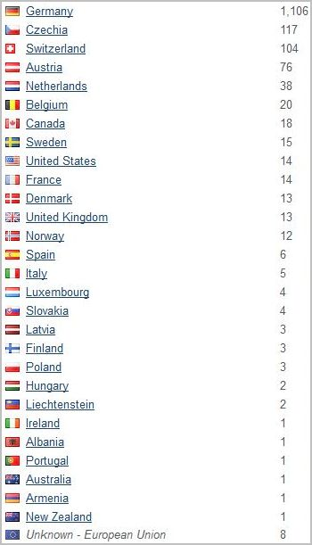
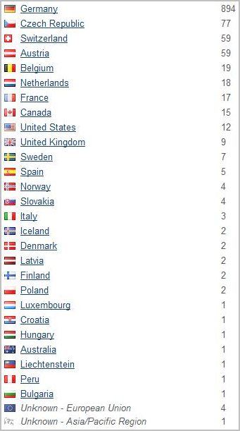
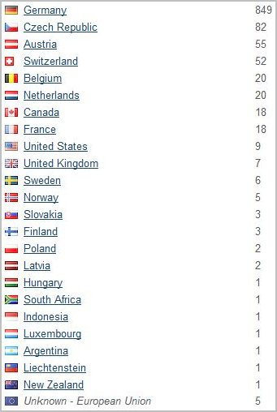
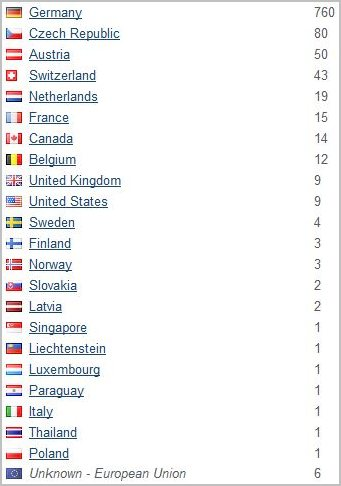
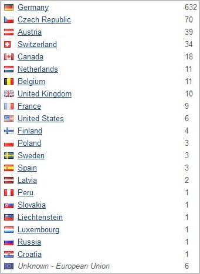
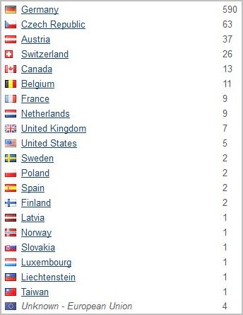
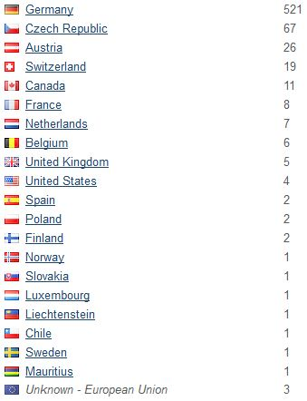
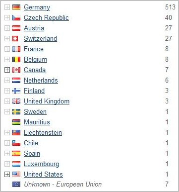

<a href="#v097" title="GClh II version 0.9.7 (28.05.2018 - 10.06.2018)">v0.9.7</a> &nbsp; 
<a href="#v083" title="GClh II version 0.8.3 (22.06.2017 - 06.07.2017)">v0.8.3</a> &nbsp; 
<a href="#v081" title="GClh II version 0.8.1 (30.05.2017 - 13.06.2017)">v0.8.1</a> &nbsp; 
<a href="#v072" title="GClh II version 0.7.2 (26.04.2017 - 09.05.2017)">v0.7.2</a> &nbsp; 
<a href="#v071" title="GClh II version 0.7.1 (12.04.2017 - 25.04.2017)">v0.7.1</a> &nbsp; 
<a href="#v06" title="GClh II version 0.6 (25.03.2017 - 07.04.2017)">v0.6</a> &nbsp; 
<a href="#v05" title="GClh II version 0.5 (11.03.2017 - 24.03.2017)">v0.5</a> &nbsp; 
<a href="#v041" title="GClh II version 0.4.1 (25.02.2017 - 10.03.2017)">v0.4.1</a> &nbsp; 
<a href="#v03" title="GClh II version 0.3 (05.02.2017 - 24.02.2017)">v0.3</a> &nbsp; 

---
### v0.9.7:
Number of installations between 28.05.2018 and 10.06.2018 (14 days) under GClh II version 0.9.7. 
<ul><li>On different addresses, corresponding World Flag Counter: Total 2.068 </li>
<li>On different addresses, corresponding Andy Hope: Total 1.796 </li>
<li>On different addresses, corresponding Flag Counter: Total 1.606 
 </li>
<li>All, corresponding World Flag Counter: Total 2.481 </li>
<li>All, corresponding Andy Hope: Total 1.954 </li>
<li>All, corresponding Flag Counter: Total 1.802 </li></ul>
 

---
### v0.8.3:
Number of installations between 22.06.2017 and 06.07.2017 (14 days) under GClh II version 0.8.3. 
<ul><li>On different addresses, corresponding Andy Hope: Total 1.269 </li>
<li>On different addresses, corresponding Flag Counter: Total 1.161 
 </li>
<li>All, corresponding Andy Hope: Total 1.434 </li>
<li>All, corresponding Flag Counter: Total 1.347 </li></ul>
 

---
### v0.8.1:
Number of installations between 30.05.2017 and 13.06.2017 (14 days) under GClh II version 0.8.1. 
<ul><li>On different addresses, corresponding Andy Hope: Total 1.314 </li>
<li>On different addresses, corresponding Flag Counter: Total 1.224 (loss 90 or 6,85%) 
 </li>
<li>All, corresponding Andy Hope: Total 1.429 </li>
<li>All, corresponding Flag Counter: Total 1.369 (loss 60 or 4,20%) </li></ul>
 

---
### v0.7.2:
Number of installations between 26.04.2017 and 09.05.2017 (14 days) under GClh II version 0.7.2. 
<ul><li>On different addresses, corresponding Andy Hope: Total 1.233 </li>
<li>On different addresses, corresponding Easy Counter: Total 1.226 </li>
<li>On different addresses, corresponding Flag Counter: Total 1.163 (loss 70 or 5,68%) 
 </li>
<li>All, corresponding Andy Hope: Total 1.322 </li>
<li>All, corresponding Easy Counter: Total 1.302 </li>
<li>All, corresponding Flag Counter: Total 1.269 (loss 53 or 4,00%) </li></ul>
 

---
### v0.7.1:
Number of installations between 12.04.2017 and 25.04.2017 (14 days) under GClh II version 0.7.1 (Easter). 
<ul><li>On different addresses, corresponding Andy Hope: Total 1.125 </li>
<li>On different addresses, corresponding Easy Counter: Total 1.121 </li>
<li>On different addresses, corresponding Flag Counter: Total 1.038 (loss 87 or 7,78%) 
 </li>
<li>All, corresponding Andy Hope: Total 1.367 </li>
<li>All, corresponding Easy Counter: Total 1.350 </li>
<li>All, corresponding Flag Counter: Total 1.303 (loss 64 or 4,68%) </li></ul>
 

---
### v0.6:
Number of installations between 25.03.2017 and 07.04.2017 (14 days) under GClh II version 0.6. 
<ul><li>On different addresses, corresponding Andy Hope: Total 938 </li>
<li>On different addresses, corresponding Easy Counter: Total 925 </li>
<li>On different addresses, corresponding Flag Counter: Total 867 (loss 71 or 7,57%) 
 </li>
<li>All, corresponding Andy Hope: Total 986 </li>
<li>All, corresponding Easy Counter: Total 963 </li>
<li>All, corresponding Flag Counter: Total 935 (loss 51 or 5,17%) </li></ul>
 

---
### v0.5:
Number of installations between 11.03.2017 and 24.03.2017 (14 days) under GClh II version 0.5. 
<ul><li>On different addresses, corresponding Andy Hope: Total 898 </li>
<li>On different addresses, corresponding Easy Counter: Total 897 </li>
<li>On different addresses, corresponding Flag Counter: Total 788 (loss 110 or 12,25%) 
 </li>
<li>All, corresponding Andy Hope: Total 973 </li>
<li>All, corresponding Easy Counter: Total 947 </li>
<li>All, corresponding Flag Counter: Total 907 (loss 66 or 6,78%) </li></ul>
 

---
### v0.4.1:
Number of installations between 25.02.2017 and 10.03.2017 (14 days) under GClh II version 0.4.1. 
<ul><li>On different addresses, corresponding Andy Hope: Total 831 </li>
<li>On different addresses, corresponding Flag Counter: Total 690 (loss 141 or 17,97%) 
 </li>
<li>All, corresponding Andy Hope: Total 976 </li>
<li>All, corresponding Flag Counter: Total 865 (loss 111 or 11,37%) </li></ul>
 

---
### v0.3:
Number of installations between 05.02.2017 and 24.02.2017 (20 days) under GClh II version 0.3. 
<ul><li>On different addresses, corresponding Andy Hope: Total 722 </li>
<li>On different addresses, corresponding Flag Counter: Total 656 (loss 66 or 9,14%) 
 </li>
<li>All, corresponding Andy Hope: Total 832 </li></ul>
 
