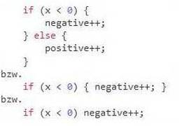

<a href="#user-content-coding-conventions" title="Coding Conventions">Coding Conventions</a> &nbsp; &nbsp; 
<a href="#user-content-branches" title="Branches">Branches</a> &nbsp; &nbsp; 
<a href="#user-content-issues" title="Issues">Issues</a> &nbsp; &nbsp; 
<a href="#user-content-documentation" title="Documentation">Documentation</a> &nbsp; &nbsp; 
<a href="#user-content-links" title="Links">Links</a> &nbsp; &nbsp; 

---
## Coding Conventions:  
* Favorisierter Einrückungsstil:  
 
* Einrücken mit 4 Leerzeichen (nicht mit Tabulator).
* Keine Leerzeichen am Ende einer Zeile.
 
 

---
## Branches:  

Unsere Branches unterteilen sich in die drei Stufen *User*, *Collector* und *Projects / Developer*.  
(Beispiel)

| 1. User | 2. Collector        | 3. Projects / Issues        |
| :------ | :------------------ | :-------------------------- |
| master  | collector (default) | upvote_buttons_for_non_pmo  |
|         |                     | v0.5_cf_geoservices         |

Anpassungen sollten mit den Resourcen aus der Branch *collector* erfolgen.  
Pull requests sollten in die Branch *collector* erfolgen.  

### 1. User:  
Hier gibt es genau eine Branch *master*. Sie enthält die aktuelle Version für die User und dient den Usern zum Abrufen neuer Versionen.

### 2. Collector:  
Hier gibt es derzeit genau eine Branch *collector*. Sie dient als Sammler aller Bestandteile für eine Version vor der Auslieferung an die User, dem Transport in die Branch *master*.  

Die Branch *collector* ist die standard (default) Branch. Sie wird beim Transportieren automatisch als Empfänger vorgeschlagen. Damit wird unter anderem sichergestellt, dass nicht aus Versehen in die Branch *master* transportiert wird.  

Außerdem kann zeitunkritisch, auch gegebenenfalls aus mehreren Branches, in den *collector* transportiert werden, die Sammlung nachbearbeitet werden und auch ein Kompletttest durchgeführt werden, bevor die Sammlung als neue Version den Usern zur Verfügung gestellt wird.  

### 3. Projects / Developer:  
Diese Stufe soll Raum für unterschiedliche Projekte unterschiedlicher Entwickler bieten. Die Namen der Branches sollten aus einer allgemein verständlichen Bezeichnung für Projekt und Entwickler bestehen, den der Entwickler selbst bestimmen kann.
 
 

---
## Issues:  

Unter Issues finden wir die Tickets und das Ticketsystem. Ein Issue durchläuft bis zu seiner Schließung in der Regel mehrere Stationen. Die Aufgaben und die Einstellungen der Issues werden im Folgenden kurz erläutert.  

Sprache: Englisch wo nötig, ansonsten auch deutsch.  

* **Neues Issue:**
  * Kategorie (Label) setzen: *bug*, *enhancement*, *improvement*, *help wanted*, *question* ... 
  * Priorität (Label) setzen, zumindest wenn sie absehbar hoch ist. 
    * Die Kategorie *bug* hat in der Regel mindestens die Priorität *middle*.
    * *help wanted* und *question* haben in der Regel nicht mehr als Priorität *middle*.
  * Handelt es sich um einen Wunsch der User, dann den Tag (Label) *wish* setzen.  
  
* **Issue in Arbeit nehmen:**
  * Issue einer Person zuordnen/assignen.
  * Status (Label) *in progress* setzen.  
  
* **Issue zurück an User geben:**
  * Aktion (Label) *user action* setzen.  
  
* **Issue auf erledigt setzen:**
  * Grob beschreiben, zu welchem Ergebnis man gekommen ist. (Beschreibung wird für Changelog verwendet.)
  * Entsprechenden Status (Label) setzen: *fixed*, *completed*, *rejected* ...  
  
* **Issue schließen:**
  * Sollen Objekte transportiert werden oder soll eine Dokumentation im Changelog erfolgen, dann Issue einem Milestone zuordnen.
  * Issue auf *close* setzen.  
 
 

---
## Documentation:  

Es sollte eine aussagekräftige *Dokumentation im Issue* bzw. im *Pull request* erfolgen. (Dokumentation wird für Changelog verwendet.)  

Eine *Änderungsdokumentation im Programmcode* ist nicht erforderlich. Bei komplexen Zusammenhängen oder wenn besondere Beachtung geboten ist, dann sollte eine Dokumentation an der entsprechenden Programmstelle erfolgen. Ob eine solche Dokumentation sinnvoll ist, entscheidet der jeweilige Entwickler.
 
 

---
## Links:  

#### GitHub:  
* GitHub:  
https://github.com/2Abendsegler/GClh/tree/master
* Aktuelle Version des Script GClh installieren (User Installation):  
https://github.com/2Abendsegler/GClh/raw/master/gc_little_helper_II.user.js
* Testversion des Script GClh vom Collector installieren: (Abschluss-, Testinstallation):  
https://github.com/2Abendsegler/GClh/raw/collector/gc_little_helper_II.user.js
* License im Browser anzeigen:  
https://raw.githubusercontent.com/2Abendsegler/GClh/master/License
* Open Issues auf GitHub aufrufen:  
https://github.com/2Abendsegler/GClh/issues?q=is:issue%20is:open%20sort:created-desc
* Changelog auf GitHub anzeigen:  
https://github.com/2Abendsegler/GClh/blob/master/docu/changelog.md#readme
* License auf GitHub anzeigen:  
https://github.com/2Abendsegler/GClh/blob/master/docu/license.md#readme
* Warranty auf GitHub anzeigen:  
https://github.com/2Abendsegler/GClh/blob/master/docu/warranty.md#readme
* Tipps für die Migration auf GitHub anzeigen:  
https://github.com/2Abendsegler/GClh/blob/master/docu/tips_migration.md#readme  
* Tipps für die Installation auf GitHub anzeigen:  
https://github.com/2Abendsegler/GClh/blob/master/docu/tips_installation.md#readme  
 

#### Browser:  
* Mozilla Firefox:  
https://www.mozilla.org  
* Google Chrome:  
https://www.google.com/chrome  
* Opera:  
https://www.opera.com  
* Microsoft Edge:  
https://www.microsoft.com/microsoft-edge  
* Vivaldi:  
https://vivaldi.com/  
* Safari:  
https://www.apple.com/safari/  
 

#### Foren:  
* Geoclub Forum, Help (Greasemonkey-Scripte):  
http://geoclub.de/forum/viewforum.php?f=117  
* Groundspeak Forum, Sammelthread für GC little helper II (mit v0.3):  
http://forums.groundspeak.com/GC/index.php?showtopic=343005  
* Swisscacher Forum, Sammelthread für GC little helper II (mit v0.5):  
http://www.swissgeocacheforum.ch/forum/topic/12872-gc-little-helper-ii/  
* Geoleaks Forum, Sammelthread für GC little helper II (mit v0.10.4):  
https://geoleaks.com/forum/showthread.php?tid=34330  
 

#### Sonstiges:  
* Deutsche Übersetzung der Lizence:  
http://www.gnu.de/documents/gpl-2.0.de.html
* Markdown Syntax (deutsch) als PDF:  
https://www.heise.de/mac-and-i/downloads/65/1/1/6/7/1/0/3/Markdown-CheatSheet-Deutsch.pdf
* Markdown Editor:  
https://github.com/mike-ward/Markdown-Edit/releases  
