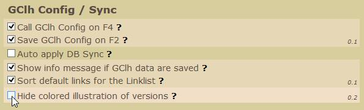

<a href="#Branch" title="Branch">Branch</a> &nbsp; 
<a href="#Issue" title="Issue">Issue</a> &nbsp; 
<a href="#Links" title="Links">Links</a> &nbsp; 

---
## Branch / Tree:
Unsere Branches unterteilen sich in die vier Stufen User, Collector, Projects und Developer.

Beispielsweise könnten in den vier Stufen folgende Branches vorhanden sein. 

| 1. User | 2. Collector        | 3. Projects | 4. Developer   |
| :------ | :-----------------: | :---------: | -------------: |
| master  | collector (default) | v0.2.2.4    | dev_bug_fe     |
|         |                     | v0.2.3      | dev_CF         |
|         |                     |             | dev_v0.2.3_fe  |
|         |                     |             | dev_LittleJohn |
|         |                     | translation | dev_trans_CF   |

<ul>
<li>Change: [Enhancement #14] Hervorhebung geänderter Koordinaten flexibler gestalten. 
Danke an LittleJohn für die Vorarbeit. 
Das Aussehen der durch den Benutzer geänderten Koordinaten kann nun flexibler angepaßt werden. Das bekannte Aussehen aus dem GClh Original entspricht in etwa folgender Einstellung: 
</li>
<li>New: [Enhancement #30] Make colored illustration of versions in config selectable. 
Der teils doch etwas fleckig geratene Hintergrund im GClh Config mit den Informationen zu welcher Version ein Parameter implementiert wurde, kann nun abgewählt werden. 
</li>
<li>Fix: [Bug #31] When using "Log your visit (inline)" and clicking "All visited" for the trackables list opens an empty new tab. </li>
</ul>
 

---
## v0.2.2:
