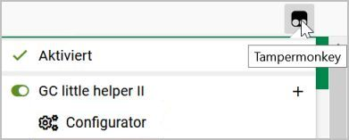
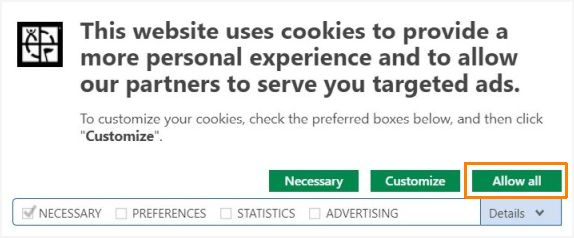
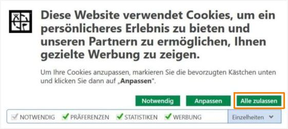

# FAQ &nbsp;  &nbsp; 

 | 
--- | --- 
<a href="#1-en">1. What can I do if the warning is displayed "GClh is running more than once"?</a> | <a href="#1-de">1. Was kann ich tun wenn die Warnung angezeigt wird, dass der GClh mehr als einmal läuft?</a>
<a href="#2-en">2. In the Config I can't add new links to the Linklist because it is out of the view.</a> | <a href="#2-de">2. Ich kann in der Konfiguration keine neuen Links zur Linkliste hinzufügen, da die Linkliste außerhalb des Bildschirms ist.</a>
<a href="#3-en">3. The GClh doesn't start.</a> | <a href="#3-de">3. Der GClh startet nicht.</a>
<a href="#4-en">4. Hints for using on Android devices.</a> | <a href="#4-de">4. Hinweise für die Nutzung auf Android Geräten.</a>
<a href="#5-en">5. How can I open the configuration (Config) of the GClh?</a> | <a href="#5-de">5. Wie kann ich die Konfiguration (Config) des GClh öffnen?</a>
<a href="#6-en">6. How can I install the GClh on Android devices?</a> | <a href="#6-de">6. Wie kann ich den GClh auf Android Geräten installieren?</a>
<a href="#7-en">7. How can I contribute to GClh?</a> | <a href="#7-de">7. Wie kann ich etwas zum GClh beitragen?</a>
<a href="#8-en">8. Where can I get help with the GClh?</a> | <a href="#8-de">8. Wo bekomme ich Hilfe zum GClh?</a>
<a href="#9-en">9. How can I report a bug or a feature request?</a> | <a href="#9-de">9. Wie kann ich einen Fehler melden oder eine Anfrage zu einem neuen Feature stellen?</a>
<a href="#10-en">10. What can I do if individual features don't work or don't always work?</a> | <a href="#10-de">10. Was kann ich tun, wenn einzelne Features nicht oder nicht immer funktionieren?</a>

---

## 1. What can I do if the Warning is displayed "GClh is running more than once"?
*GC little helper II* is only working correctly, if it's just running once at a time. Because of that, the script itself checks if it's the only GClh running. If this warning is displayed, it is true. So you can check some points: 
<ol>
	<li>
		Please check if you have more than one script manger (i.e. Tampermonkey and Violentmonkey) installed. The GClh may be installed in more than one script manager. If so, uninstall all but one instance of the GClh and the problem should be resolved. 
	</li>
	<li>
		Maybe the GClh is installed more than once in a single script manager. You can check this by viewing the script overview. If so, uninstall all but one instance of the GClh and the problem should be resolved. 
	</li>
</ol>
If you still get the warning, please leave a bug report <a href="https://github.com/2Abendsegler/GClh/issues/new/choose">here</a> and we will try to assist you. 
 

## 2. In the Config I can't add new links to the Linklist because it is out of the view.
If you have problems to drag & drop the lower links because the Linklist area is not on the screen, then use the arrow high key on your keyboard during you hold the mouseclick. 
 

## 3. The GClh doesn't start.
If the GClh does not start, these are usually matching problems between the browser and the script manager. These problems mainly occur when a tab in a browser passes beyond a session. This can be caused by the user by leaving tabs in the browser, for example when hibernating. It can also be caused by the browser, for example when restoring tabs after a cancellation. 

*Resolve problems:* Problems can be resolved depending on the situation regularly with one of the following points. 
<ul>
	<li>
		Close tabs in browser, re-select tabs. 
	</li>
	<li>
		Close tabs in browser, close browser, start browser, re-select tabs. 
	</li>
	<li>
		Deactivate the script manager and reactivate it after a few seconds (unless you have deactivated "Automatic page reload"). 
	</li>
</ul>

*Prevent problems:*  
<ul>
	<li>
		Close tabs in the browser before hibernating the computer, so that the tabs no longer exist when reactivated. 
	</li>
	<li>
		(Android) Close tabs in the browser before closing the browser, so that the tabs are no longer available the next time you start the browser. 
	</li>
</ul>
 

## 4. Hints for using on Android devices.
<ul>
	<li>
		On smaller Android devices, such as smartphones, some geocaching pages are displayed in a smaller (mobile) layout. The GClh does not support such layouts. This can lead to the geocaching page not being displayed properly. 
		Solution: 
		<ul>
			<li>
				Use the Android device in landscape format. 
			</li>
			<li>
				Mark the geocaching page via the settings in the browser as "Desktop Page". 
			</li>
		</ul>
		 
	</li>
	<li>
		Drag & drop operations do not work. 
		<ul>
			<li>
				GClh Config: In chapter "Linklist / Navigation", no new entries can be placed in the right column "Linklist" from the left column <a href="https://www.geocaching.com/account/dashboard#GClhShowConfig#a#ll#settings_bookmarks_top_menu_h" title="Link to your GClh Config">Default links</a>. 
			</li>
			<li>
				GClh Config: In chapter "Linklist / Navigation" the order can not be changed in the right column <a href="https://www.geocaching.com/account/dashboard#GClhShowConfig#a#ll#settings_bookmarks_top_menu_h" title="Link to your GClh Config">Linklist</a>. 
			</li>
		</ul>
		 
	</li>
	<li>
		Field activations by moving a mouse over a field usually works by touching. 
		<ul>
			<li>
				Icons on map: The icon "Go to Map" can not be selected in the map. All other icons in the map work. 
			</li>
			<li>
				Preview pictures (thumbnails) in listings and galleries: They work by touching, but at the same time touching also activates the normal display of the large picture. The <a href="https://www.geocaching.com/account/dashboard#GClhShowConfig#a#settings_show_thumbnailsX0" title="Link to your GClh Config">preview of the pictures</a> should be deactivated. 
				 
			</li>
		</ul>
	</li>
	<li>
		Right mouse works usually by touching and holding. 
		 
	</li>
	<li>
		Linklist and usual menu are not always visible. It is then hidden at the top right in a side menu, for example on the pages dashboard, geocache search or map. If you activate "Desktop Page" in the browser, the Linklist and the menu are displayed as usual. 
		 
	</li>
	<li>
		There are no function keys / F-keys with the standard Android keyboard. 
		<ul>
			<li>
				F2 to save ... does not work (GClh config, bookmark lists, PQ, hide ...). 
			</li>
			<li>
				F4 or F10 to call the GClh Config or GClh Sync will not work. 
			</li>
		</ul>
	</li>
</ul>
 

## 5. How can I open the configuration (Config) of the GClh?
<ul>
	<li>
		If you are on a geocaching page you can open the Config for the GClh with the F4 key on your keyboard, if you have not switched off this feature.
	</li>
	<li>
		Or you can open the Config for the GClh <a href="https://www.geocaching.com/account/dashboard#GClhShowConfig">here</a>.
	</li>
	<li>
		Or you can use the corresponding link on your <a href="https://www.geocaching.com/account/dashboard">dashboard</a> below your user name.
	</li>
	<li>
		Or you can select the corresponding link in the menu of your script manager in your browser. 
		It looks something like this: 
		 
	</li>
</ul>
 

## 6. How can I install the GClh on Android devices?
See <a href="../docu/tips_installation.md#android_en" title="Link to 'Tips for the installation of GC little helper II - Android'">Tips for the installation of GC little helper II - Android</a> 
 

## 7. How can I contribute to GClh?
We are happy about improvement suggestions, bugfixes or new features. This is realised via pull requests on the plattform GitHub. You can read how to create a Pull-Request here: <a href="../docu/how_to_contribute.md#en">How to contribute</a> 
 

## 8. Where can I get help with the GClh?
If you need help with the GClh, or if you have questions about the GClh, you can create a note in the following forums ... (German and English): 
- [Geocaching Forum](https://forums.geocaching.com/GC/index.php?/topic/343005-gc-little-helper-ii/)
- [Geoclub Geocaching Forum](https://www.geoclub.de/forum/t/gc-little-helper-ii-ab-v0-11.81650/)
- [Swiss Geocache Forum](https://www.swissgeocacheforum.ch/forum/topic/12872-gc-little-helper-ii/)
- [Discussions page](https://github.com/2Abendsegler/GClh/discussions) on our development platform at GitHub
- [Ticket System](https://github.com/2Abendsegler/GClh/issues) on our development platform at GitHub
 

## 9. How can I report a bug or a feature request?
For a bug or a feature request you can open a <a href="https://github.com/2Abendsegler/GClh/issues/new/choose">new issue</a> on our development platform at GitHub.  
Or you can create a note in one of the forums or on our discussions page. See <a href="#8-en">FAQ 8</a>. 
 

## 10. What can I do if individual features don't work or don't always work?
1. You must accept all cookies from geocaching.com and not just the necessary ones. Otherwise, errors in the website's cookie processing can lead to aborts in the script.  
2. Alternatively to 1. only the necessary cookies can be accepted by geocaching.com if cookie processing is blocked at the same time. For example, the entry "cookiebot.com" can be included in "My Filters" in the "uBlock Origin" add-on. 
3. If the "Ghostery" add-on is installed, "Never Consent" must be switched off for "geocaching.com". 
 
 

---

## 1. Was kann ich tun wenn die Warnung angezeigt wird, dass der GClh mehr als einmal läuft?
Der *GC little helper II* funktioniert nur korrekt, wenn er nur einmal im Browser ausgeführt wird. Deshalb prüft das Script selbst, ob das der Fall ist. Wenn die Meldung angezeigt wird, dass der GClh mehr als einmal läuft, dann ist das auch der Fall. In diesen Fällen sollte folgendes überprüft werden: 
<ol>
	<li>
		Bitte prüfe, ob mehr als ein Script Manager installiert ist (zum Beispiel neben Tampermonkey auch noch Violentmonkey). Womöglich ist der GClh in mehr als einem Script Manager installiert. Wenn das der Fall ist, dann deinstalliere alle Versionen bis auf eine und das Problem sollte behoben sein. 
	</li>
	<li>
		Eventuell ist der GClh mehr als einmal in einem einzigen Script Manager installiert. Das kann in der Scriptübersicht geprüft werden. Wenn das der Fall ist, dann deinstalliere alle Versionen bis auf eine und das Problem sollte behoben sein. 
	</li>
</ol>
Sollte die Warnung dann immer noch auftauchen, dann erstelle bitte <a href="https://github.com/2Abendsegler/GClh/issues/new/choose">hier</a> ein neues Issue und wir werden versuchen dir zu helfen. 
 

## 2. Ich kann im GClh Config keine neuen Links zur Linkliste hinzufügen, da die Linkliste außerhalb des Bildschirms ist.
Wenn du Probleme mit dem Drag & Drop beim Hinzufügen neuer Links zur Linkliste hast, da die Links zu weit unten stehen und die Linkliste zu weit oben steht und nicht mehr auf dem Bildschirm ist, dann nutze einfach die Pfeiltaste nach oben während du den neuen Link weiter mit der Maus fest hälst. 
 

## 3. Der GClh startet nicht.
Startet der GClh nicht, so handelt es sich in der Regel um Abstimmungsprobleme zwischen dem Browser und dem Script Manager. Diese Probleme treten hauptsächlich dann auf, wenn ein Tab in einem Browser über eine Session hinaus besteht. Das kann durch den User veranlaßt sein indem er Tabs im Browser beispielsweise im Ruhezustand bestehen läßt. Es kann aber auch durch den Browser veranlaßt sein beispielweise bei einer Wiederherstellung von Tabs nach einem Abbruch. 

*Probleme beheben:* Probleme können je nach Sachlage regelmäßig mit einem der folgenden Punkte behoben werden. 
<ul>
	<li>
		Tabs im Browser schließen, Tabs neu anwählen. 
	</li>
	<li>
		Tabs im Browser schließen, Browser schließen, Browser starten, Tabs neu anwählen. 
	</li>
	<li>
		Script Manager deaktivieren und nach einigen Sekunden wieder aktivieren (sofern man "Automatisches Seiten-Neu-Laden" nicht deaktiviert hat). 
	</li>
</ul>

*Problemen vorbeugen:*  
<ul>
	<li>
		Tabs im Browser schließen bevor man den Rechner in den Ruhezustand schickt, damit bei der Reaktivierung die Tabs nicht mehr vorhanden sind. 
	</li>
	<li>
		(Android) Tabs im Browser schließen bevor man den Browser schließt damit beim nächsten Aufruf des Browsers die Tabs nicht mehr vorhanden sind. 
	</li>
</ul>
 

## 4. Hinweise für die Nutzung auf Android Geräten.
<ul>
	<li>
		Bei kleineren Android Geräten, wie zum Beispiel Smartphones, werden einige Geocaching Seiten in einem kleineren (Mobil) Layout dargestellt. Der GClh unterstützt solche Layouts nicht. Das kann dazu führen, dass die Geocaching Seite nicht ordnungsgemäß angezeigt wird. 
Abhilfe: 
		<ul>
			<li>
				Das Android Gerät im Querformat nutzen. 
			</li>
			<li>
				Die Geocaching Seite über die Einstellungen im Browser als "Desktop Seite" kennzeichen. 
			</li>
		</ul>
		 
	</li>
	<li>
		Drag & Drop Operationen funktionieren nicht. 
		<ul>
			<li>
				GClh Config: Im Kapitel "Linklist / Navigation" können von der linken Spalte <a href="https://www.geocaching.com/account/dashboard#GClhShowConfig#a#ll#settings_bookmarks_top_menu_h" title="Link zu deinem GClh Config">Default links</a> keine neuen Einträge in die rechte Spalte "Linkliste" gehängt werden. 
			</li>
			<li>
				GClh Config: Im Kapitel "Linklist / Navigation" kann in der rechten Spalte <a href="https://www.geocaching.com/account/dashboard#GClhShowConfig#a#ll#settings_bookmarks_top_menu_h" title="Link zu deinem GClh Config">Linkliste</a> die Reihenfolge nicht geändert werden. 
				 
			</li>
		</ul>
	</li>
	<li>
		Feldaktivierungen durch Mausbewegung über ein Feld funktionieren in der Regel durch antippen. 
		<ul>
			<li>
				Icons auf Karte: In der Karte läßt sich das Icon "Go to Map" nicht anwählen. Alle anderen Icons in der Karte funktionieren. 
			</li>
			<li>
				Vorschau der Bilder (thumbnails) in Listings and Gallerien: Sie funktionieren durch antippen, gleichzeitig wird durch das Antippen jedoch auch die normale Anzeige des Bildes in groß aktiviert. Die <a href="https://www.geocaching.com/account/dashboard#GClhShowConfig#a#settings_show_thumbnailsX0" title="Link zu deinem GClh Config">Vorschau der Bilder</a> sollte im Config deaktiviert werden. 
				 
			</li>
		</ul>
	</li>
	<li>
		Rechte Maustaste funktioniert regelmäßig durch antippen und halten. 
		 
	</li>
	<li>
		Linkliste und gewohntes Menü sind nicht immer sichtbar. Sie verstecken sich dann rechts oben in einem seitlichen Menü, beispielsweise auf den Seiten Dashboard, Geocache Suche oder Karte. Aktiviert man im Browser "Desktop-Seite", wird die Linkliste und das Menü wie gewohnt angezeigt. 
		 
	</li>
	<li>
		Es gibt keine Funktionstasten / F-Tasten mit der Standard Android Tastatur. 
		<ul>
			<li>
				F2 zum Speichern ... funktioniert nicht (GClh Config, alte Bookmarklisten, PQ, Verstecken ...). 
			</li>
			<li>
				F4 bzw. F10 zum Aufrufen des GClh Config bzw. GClh Sync funktionieren nicht. 
			</li>
		</ul>
	</li>
</ul>
 

## 5. Wie kann ich die Konfiguration (Config) des GClh öffnen?
<ul>
	<li>
		Wenn du auf einer Geocaching Seite bist kannst du mit der F4 Taste auf deinem Keyboard die Konfiguration für den GClh öffnen, sofern du dieses Feature nicht ausgeschaltet hast. 
	</li>
	<li>
		Oder du kannst <a href="https://www.geocaching.com/account/dashboard#GClhShowConfig">hier</a> die Konfiguration für den GClh aufrufen.
	</li>
	<li>
		Oder du kannst den entsprechenden Link in deinem <a href="https://www.geocaching.com/account/dashboard">Dashboard</a> unterhalb deines Benutzernamens verwenden.
	</li>
	<li>
		Oder du kannst in deinem Browser im Menü deines Script Managers den entsprechenden Link auswählen. 
		Das sieht dann etwa wie folgt aus: 
		 
	</li>
</ul>
 

## 6. Wie kann ich den GClh auf Android Geräten installieren?
Siehe <a href="../docu/tips_installation.md#android_de" title="Link zu 'Tipps für die Installation des GC little helper II - Android'">Tipps für die Installation des GC little helper II - Android</a> 
 

## 7. Wie kann ich etwas zum GClh beitragen?
Wir freuen uns über Verbesserungsvorschläge, Bugfixes oder neue Features. Dies geschieht über Pull Requests auf der Plattform GitHub. Wie du dort einen Pull Request anlegst, kannst du hier nachlesen: <a href="../docu/how_to_contribute.md#de">Wie kannst du etwas beitragen?</a> 
 

## 8. Wo bekomme ich Hilfe zum GClh?
Wenn du Hilfe zum GClh benötigst, oder wenn du Fragen zum GClh hast, dann kannst du dich in folgenden Foren ... melden (Deutsch und Englisch): 
- [Geocaching Forum](https://forums.geocaching.com/GC/index.php?/topic/343005-gc-little-helper-ii/)
- [Geoclub Geocaching Forum](https://www.geoclub.de/forum/t/gc-little-helper-ii-ab-v0-11.81650/)
- [Swiss Geocache Forum](https://www.swissgeocacheforum.ch/forum/topic/12872-gc-little-helper-ii/)
- [Diskussions Seite](https://github.com/2Abendsegler/GClh/discussions) auf unserer Entwicklungsplattform bei GitHub
- [Ticket System](https://github.com/2Abendsegler/GClh/issues) auf unserer Entwicklungsplattform bei GitHub
 

## 9. Wie kann ich einen Fehler melden oder eine Anfrage zu einem neuen Feature stellen?
Zu einem Fehler oder einer Anfrage zu einem neuen Feature kannst du ein <a href="https://github.com/2Abendsegler/GClh/issues/new/choose">neues Issue</a> auf unserer Entwicklungsplattform bei GitHub eröffnen.  
Oder du kannst dich in einem der Foren oder auf unserer Diskussions Seite melden. Siehe dazu <a href="#8-de">FAQ 8</a>. 
 

## 10. Was kann ich tun, wenn einzelne Features nicht oder nicht immer funktionieren?
1. Es müssen alle Cookies von geocaching.com akzeptiert werden und nicht nur die notwendigen. Andernfalls können die Fehler in der Cookie Verarbeitung der Webseite zu Abbrüchen im Script führen.  
2. Alternativ zu 1. können auch nur die notwendigen Cookies von geocaching.com akzeptiert werden, wenn gleichzeitig die Cookie Verarbeitung blockiert wird. Dazu kann beispielsweise im Add on "uBlock Origin" in "Meine Filter" der Eintrag "cookiebot.com" aufgenommen werden. 
3. Ist das Add on "Ghostery" installiert, muss "Never Consent" für "geocaching.com" ausgeschaltet werden. 
 
