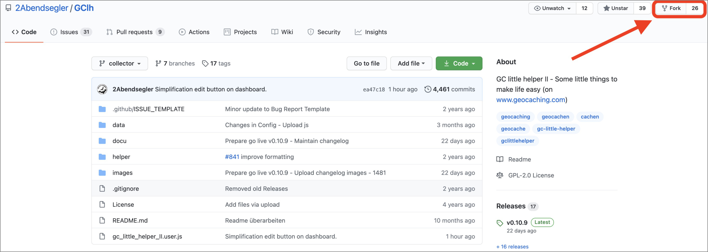
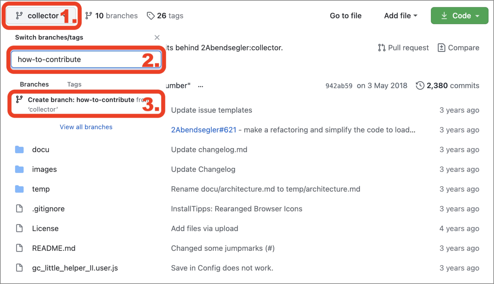

 
 
 &nbsp;

---
## How can you contribute?
The easiest way to contribute is via a pull request. If you don't know how to do that, just read on. We'll give you a step by step instruction on how you can make changes or create new features. We'll audit the changes and possibly deploy them in the next version of GClh II.

###  1. Fork: Create a server-sided copy of the code in your GitHub account
Changes to the code are not directly possible in our repository. You have to create a copy of the code in your personal GitHub account, a so called fork. 
It is quite simple. Just log in to your GitHub account and go to our repository. You can just <a href="https://github.com/2Abendsegler/GClh">click here</a>. 
At the top of the page, in the right hand corner you'll find the *Fork* Button. 
   
If you click it, a server-sided copy is created which can be modified by you.
 

###  2. Branch: Create a local feature branch
In order for changes to be cohesive and maybe to work on more than one feature at once, you'll have to create a separat so called branch for every feature / change. This will happen in your local copy of the code, in your repository. 
To do that, you have to click the branch *collector* (1.), enter a name for the new feature branch (2.) and than click on *Create branch* (3.) 
  

###  3. Development: Implement your changes
Now you can make your changes to the code within one or more commits. 
This can be done by installing a local Git client, to work on your computer or you can make the changes right on the repository in your GitHub account within the webinterface. We described how to work with a local Git client here: <a href="../docu/development-tampermonkey.md#en">GC little helper II - Development with Tampermonkey</a>

###  4. Pull request: Submit your changes
When you've finished your feature / change you can create a pull request in our repository. We will review your changes. Either we will deploy your code in the next version of GClh II or we will get in touch with you to notice you about necessary edits. 
 
This is how you create a pull request:

- Log in to your GitHub account and visit our repository <a href="https://github.com/2Abendsegler/GClh">here</a>.
- Click on the tab *Pull requests* (1.) and then hit *New pull request* (2.) 
   
- Mind two things. First you'll have to click on *compare across forks* (1.) otherwise you can't create a pull request with changes in our repository. After that you choose *2Abendsegler/GClh* as *base repository* (2.) and select the branch *collector* because there we gather all changes that will be deployed in the next version of GClh II. Select your local branch with your changes as *head repository* (3.). After that you click on *Create pull request* (4.). 
   
- At last you have to name your pull request (1.), enter a description (2.) and click *Create pull request* (3.) to finish the process. 
You don't have to fill in the fields on the right side (4.). 
Please create a separate pull request for every feature. This makes possible change requests more easy. 
  

---
## Wie kannst du etwas beitragen?
Am einfachsten ist es, wenn du direkt einen Pull Request einreichst. Falls du nicht weißt wie das geht, dann bist du hier genau richtig. Wir erklären dir Schritt für Schritt wie du Änderungen oder neue Features einreichen kannst. Wir prüfen diese Änderungen und lassen sie ggf. in die nächste Version vom GClh II einfließen.

###  1. Fork: Erstelle eine serverseitige Kopie des Codes in deinem GitHub Account
Änderungen am Code kannst du nicht direkt bei uns im Repository vornehmen. Du musst dafür eine Kopie des Codes in deinem GitHub Account erzeugen, einen sogenannten Fork. 
Das ist ganz einfach. Dafür loggst du dich bei GitHub ein und rufst unser Repository über <a href="https://github.com/2Abendsegler/GClh">diesen Link</a> auf. 
Auf dieser Seite ist oben rechts der *Fork* Button.  
   
Sobald man diesen betätigt hat man eine serverseitige Kopie des Codes angelegt, in dem man nun arbeiten kann.
 

###  2. Branch: Erstelle einen lokalen Feature Branch
Damit deine Änderungen zusammenhängend sind und du ggf. auch an mehreren Sachen gleichzeitig arbeiten kannst, wird pro Feature / Änderung ein sogenannter Branch angelegt. Dies geschieht in deiner lokalen Kopie des Codes, also in deinem Repository.  
Hierfür klickt man auf den Branch *collector* (1.), gibt einen neuen Namen für den Feature Branch ein (2.) und klickt anschließend auf *Create branch* (3.) 
  

###  3. Entwicklung: Implementierung der Änderungen
Nun kannst du die Änderungen über ein oder meherere Commits am Code durchführen. 
Entweder du installierst dir einen Git Client um die Änderungen auf deinem Computer durchzuführen, oder du führst die Änderungen direkt im Repository in deinem GitHub Account auf der Webseite durch. Wie du dir einen Lokalen Git Client einrichten kannst, haben wir hier beschrieben: <a href="../docu/development-tampermonkey.md#de">GC little helper II - Entwicklung mit Tampermonkey</a>.

###  4. Pull Request: Änderungsantrag einreichen
Sind alle Änderungen gemacht, kannst du bei uns im Repository einen Änderungsantrag, einen sogenannten Pull Request, einreichen. Wir werden deine Änderungen dann prüfen. Entweder wir übernehmen die Änderungen in der nächsten Version vom GClh II, oder melden uns bei dir, falls noch Änderungsbedarf besteht. 
 
So reichst du den Pull Request ein:

- Dafür loggst du dich wieder bei GitHub ein und rufst unser Repository über <a href="https://github.com/2Abendsegler/GClh">diesen Link</a> auf.
- Du klickst auf den Reiter *Pull requests* (1.) und dort auf *New pull request* (2.) 
   
- Hier gibt es nun zwei Sachen zu beachten. Zuerst muss auf den Link *compare across forks* (1.) geklickt werden, da sonst nur ein Pull Request innerhalb unseres Repositorys möglich ist. Danach wird als *base repository* (2.) das Repository von *2Abendsegler/GClh* ausgewählt. Wichtig ist weiterhin den Branch *collector* zu wählen. In der Branch *collector* sammeln wir alle Änderungen, um sie dann später in einer neuen Version an die User auszuliefern. Als *head repository* (3.) wählst du nun dein eigenes Repository und den Branch in dem deine Änderungen zu finden sind. Zum Abschluss klickst du auf *Create pull request* (4.). 
   
- Im letzten Schritt musst du deinem Pull Request einen Namen (1.) geben und eine Beschreibung (2.) zur Verfügung stellen. Mit dem Button *Create pull request* (3.) erstellst du den Pull Request und bist fertig. 
Die Felder auf der rechten Seite (4.) musst du nicht ausfüllen. 
Bitte erstelle für jedes Feature einen separaten Pull Request. Das macht mögliche Änderungen einfacher. 
  
