## Screenshots of the Geocaching pages when using the *GC little helper II*

(Extensions by the *GC little helper II* are marked.)

### Cache Listing:
 
 
 
 

### Navigationmenu:
 
 
 
 
 
 

### Profile:
 
 
 

### Map:
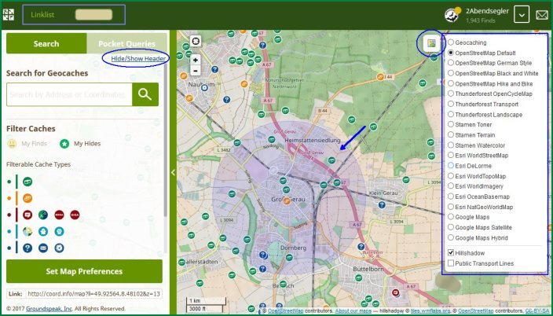 
 

### Pocket Query:
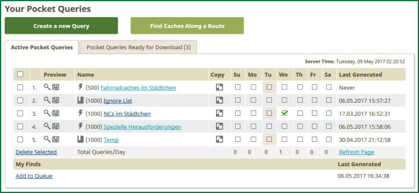 
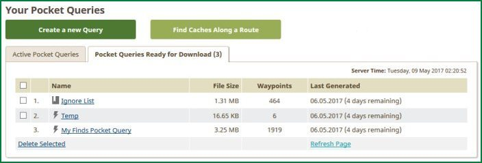 
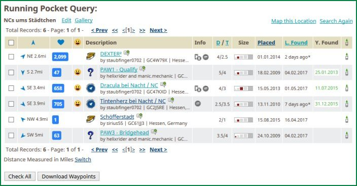 
 

### Bookmark List:
 
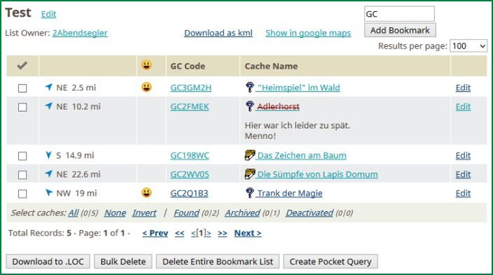 
 

### Friends:
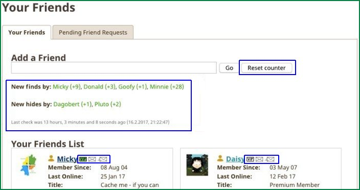 
 

### Watchlist:
 
 

### Search Cache:
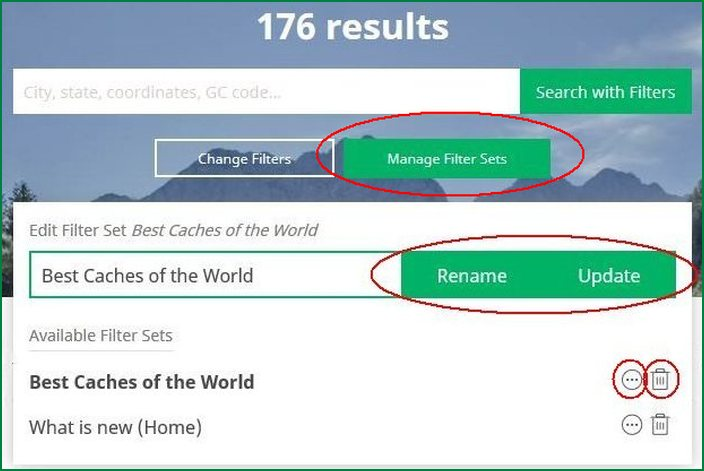 
 

### Statistic:
 
 
 

### Configuration of the GC little helper:
 
 
 
 
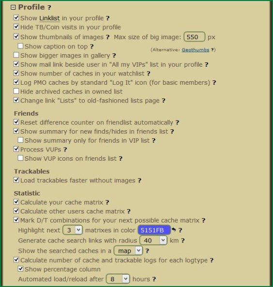 
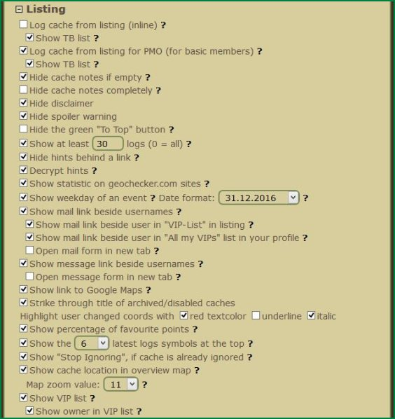 
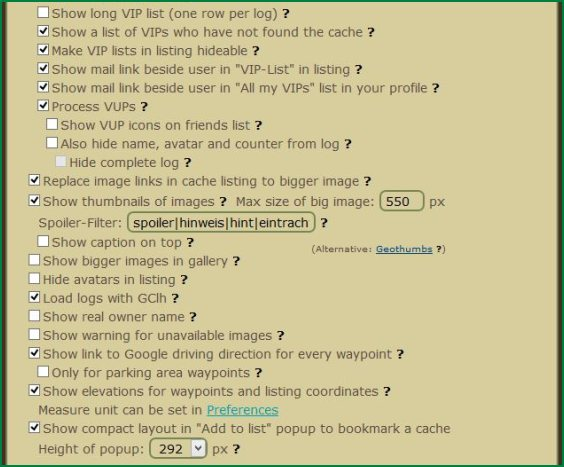 
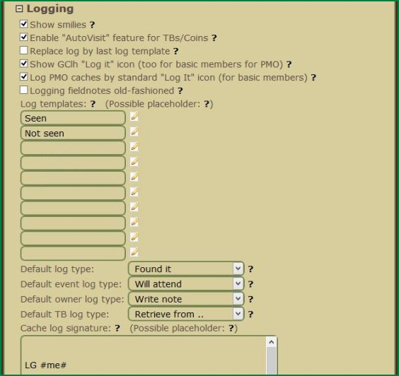 
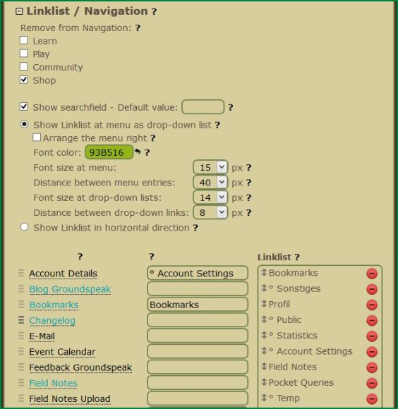 
 

### ...
