## Screenshots der Geocaching Seiten bei Verwendung des *GC little helper II*

(Erweiterungen durch den *GC little helper II* sind gekennzeichnet.)

### Listing:
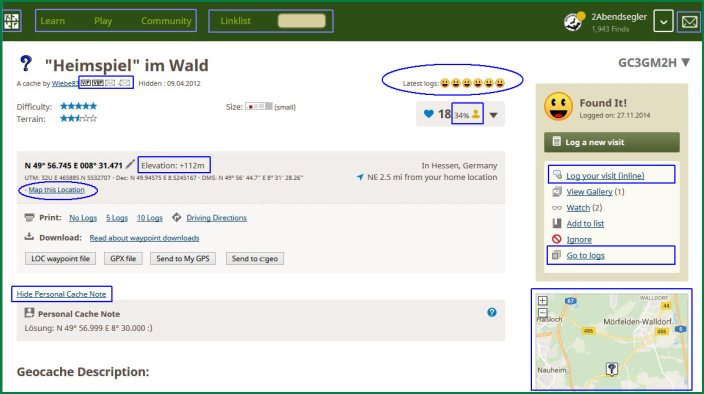 
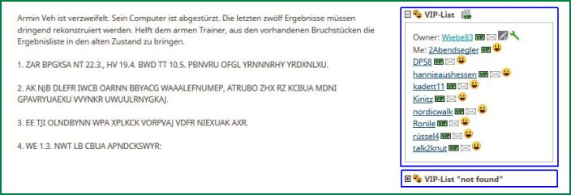 
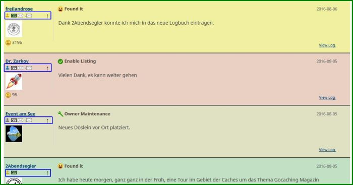 

### Navigationsmenü:
 
 
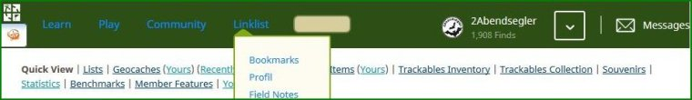 

### Profile:
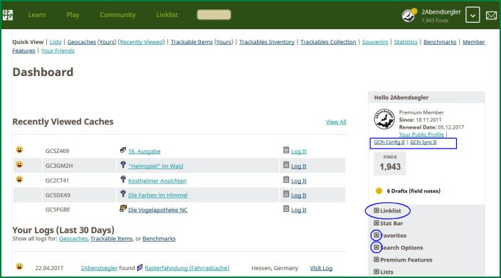 
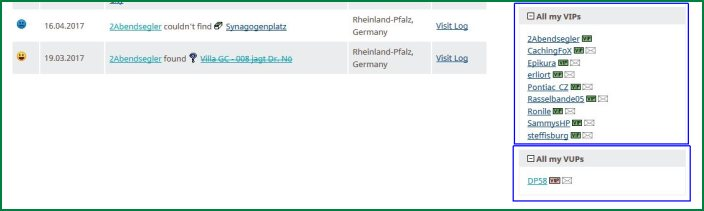 

### Karte:
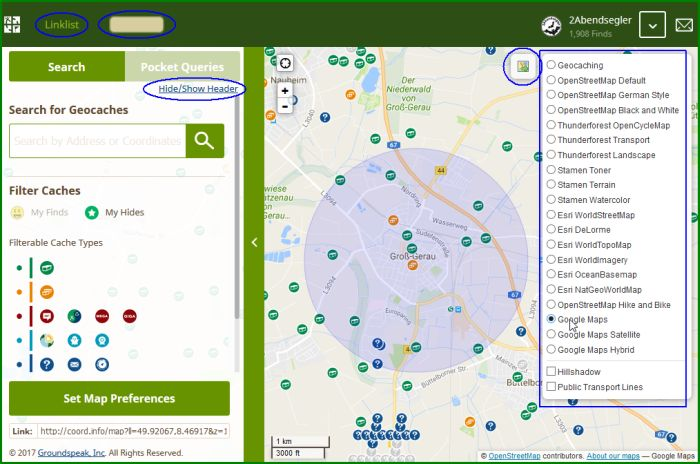 

### Watchlist:
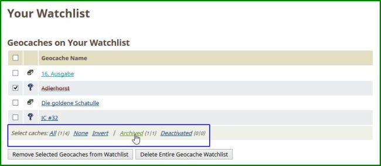 

### Statistik:
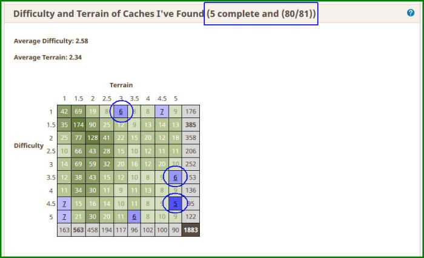 

### Trackables:
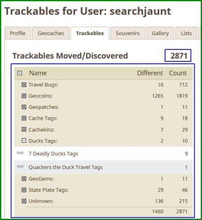 

### Konfiguration des GC little helper:
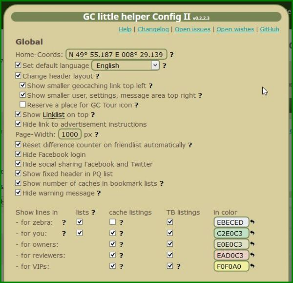 
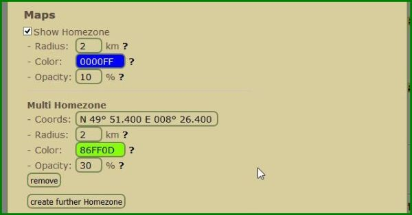 
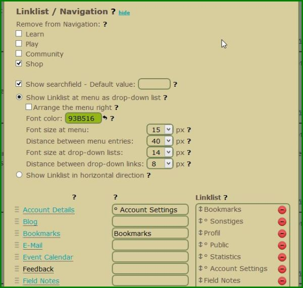 
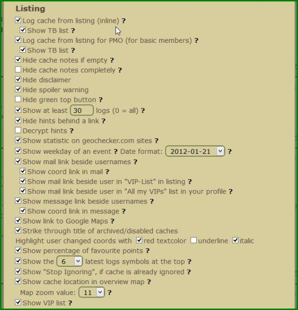 

# ...

